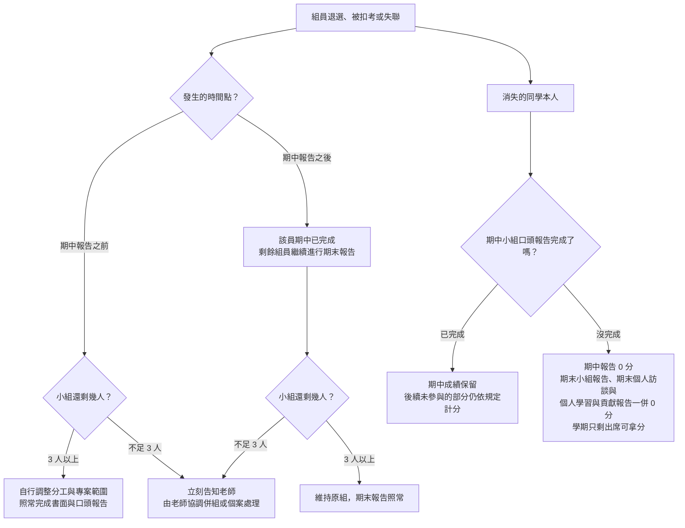

# 系統分析與設計（System Analysis and Design）課程介紹

> **這份文件很長，但每一條都會影響你的成績。請不要只在第一週聽老師講過一次就算了——找時間自己從頭到尾讀完一遍，尤其是「報告規範」一節。學期中真的出狀況時，老師是依這份文件處理，不是依你記得的版本。**

**第二週（9/16）課堂上會發一份「課程規範確認單」紙本**，請同學簽名確認已讀過本文件。確認單上會寫些什麼，已完整列於 [Course-Rules-Acknowledgement.md](Course-Rules-Acknowledgement.md)，請先看過再來簽。有疑問請在簽名前提出，當場問清楚；簽名之後就代表你知道並接受這些規則，之後不接受「我不知道有這條規定」。第二週請假或缺席者，於第三週補簽。另外要說明的是，**未簽署不影響本規範的適用**——這份文件對全班一體適用，簽名只是確認你讀過，不是規範生效的條件。

讀完之後如果覺得某些規定你不太能接受，歡迎直接跟老師聊聊，也許只是還沒說清楚，或是有你沒想到的考量。這些規範對全班一體適用，老師沒辦法為個別同學調整；如果談過之後你還是覺得不合適，那也沒關係，**趁加退選期間想清楚要不要繼續修這門課就好**，在還有選擇的時候做決定，總比整學期都不自在來得好。

本文件若有異動（例如日期調整或條文修訂），會於 LINE 群組公告並更新此處的版本日期，以 **最新版本** 為準。

## 重點速覽

下表是提醒，**不能取代全文**。每一列的完整條件與例外都在對應章節裡，真的發生爭議時以該章節的條文為準。

| 項目 | 重點 | 詳見 |
|---|---|---|
| 配分 | 期中小組報告 30%、期末小組報告 30%、期末個人訪談 20%、個人學習與貢獻報告 15%、出席 5% | 學期配分比重 |
| 兩次報告日 | 期中 **11/4（第 9 週）**、期末 **12/23（第 16 週）** | 課程預計進度表 |
| 繳交方式 | 一律 **PDF 上傳學校 Portal**，不收紙本，也不受理電子郵件、LINE、隨身碟等繳交方式 | 書面報告、投影片繳交方式與期限 |
| 兩條期限 | 書面：報告或訪談日 **前一個星期五午夜 12 點**；投影片：報告 **當週星期五午夜 12 點** | 同上 |
| 書面先行 | **沒有繳交書面，口頭一律 0 分**，沒有「只上台報告」這種選項 | 繳交要求與連帶規定 |
| 環環相扣 | 缺期中小組報告，後面三項 **一併 0 分**，整學期只剩出席那 5 分 | 繳交要求與連帶規定 |
| 額外扣分 | 遲交扣該部分 **10%**；檔案不是 PDF 或打不開，經提醒後補交扣 **5%** | 書面報告的額外扣分原則 |
| 分組 | 3–4 人一組，**第三週前** 確定名單；組員變動申請 **最晚第 10 週（11/11）** | 分組原則與規定 |
| 出席 | 只看曠課，**曠課超過 18 小時逕行扣考**，扣考等於失去 65% 的學期成績 | 課堂規範 |
| 特殊安排 | **11/25 不上課**，該時數挪作期末個人訪談；訪談時段以線上表單自選 | 訪談時間安排 |
| 公告管道 | 所有公告都在 **LINE 群組**，請務必加入 | LINE 群組 |

|課號|授課老師|
|---|---|
|115-1（IE226）|呂卓勲|

## 授課教師聯絡資訊

| 老師 | Email | Office Hour |
|---|---|---|
| 呂卓勲 | chohsunlu@saturn.yzu.edu.tw | 每週四 13:30-16:30 |

## 課程內容

本課程以「系統分析與設計」為核心，採用專題導向（Project-Based Learning）方式進行教學。學生透過實際案例分析、需求萃取、系統設計、文件撰寫與成果報告，建立資訊系統開發所需的分析與設計能力。

### 上課時間地點

- 時間：每週三，第 2–4 節，共三小時
- 地點

### 課程預計進度表

本學期自 2026 年 9 月 9 日起，至 2027 年 1 月 6 日止，共 18 週。

| 週次 | 日期 | 主題 | 說明 |
|---|---|---|---|
| 1 | 9/9 | 課程介紹與課程規範說明；系統、資訊系統與系統分析的基本概念 | 00-Course-Introduction.md |
| 2 | 9/16 | 系統開發生命週期（SDLC）與開發方法論；專案角色分工與可行性評估 | 期中專題案例發放；**簽署課程規範確認單** |
| 3 | 9/23 | 需求工程導論：需求萃取方法（訪談、觀察、文件分析）、功能性與非功能性需求 | 對應「系統需求分析」；**分組名單確定期限**；第二週缺席者補簽確認單 |
| 4 | 9/30 | 使用者分析：利害關係人辨識、Persona 與使用情境；現況流程（As-Is）盤點 | 對應「使用者分析」 |
| 5 | 10/7 | 功能分析與 Use Case：Actor 辨識、Use Case Diagram、Use Case 敘述與例外流程 | 對應「功能分析」「Use Case」 |
| 6 | 10/14 | 流程建模：Activity Diagram（含泳道）及其與 Use Case 的對應關係 | 對應「Activity Diagram」 |
| 7 | 10/21 | 資料建模：實體關聯圖（ERD）、正規化基礎與 Data Dictionary 撰寫 | 對應「ERD」「Data Dictionary」 |
| 8 | 10/28 | 初步系統架構分析；期中書面文件整合與口頭報告演練 | 對應「初步系統架構分析」 |
| 9 | 11/4 | **期中小組報告：系統分析（Analysis）** | **口頭報告；書面最晚 10/30（五）23:59、投影片最晚 11/6（五）23:59 前上傳 Portal** |
| 10 | 11/11 | 期中報告講評；從分析到設計的銜接：模組化、內聚與耦合 | **期中小組報告若未報告完，順延至本週續行；各組報告完畢後接續上課；組員變動申請期限** |
| 11 | 11/18 | 系統架構設計：分層式、主從式與三層式架構，部署與非功能需求的取捨 | 對應「系統架構」；**組員變動核准結果公布** |
| 12 | 11/25 | **本週不上課** | **該週時數挪作期末個人訪談，時段另行公告並開放表單登記** |
| 13 | 12/2 | 模組設計與 UML 設計階段圖：Class Diagram、Sequence Diagram | 對應「模組設計」「UML」 |
| 14 | 12/9 | 資料庫設計（Database Design）與 API 設計：綱要落地、介面規格與資料交換格式 | 對應「Database Design」「API Design」 |
| 15 | 12/16 | 使用者介面設計與 UI Prototype；Design Specification 文件整合與報告演練 | 對應「UI Prototype」「Design Specification」；**個人訪談時段登記表單開放（最遲於本週）**|
| 16 | 12/23 | **期末小組報告：系統設計（Design）** | **口頭報告；書面最晚 12/18（五）23:59、投影片最晚 12/25（五）23:59 前上傳 Portal** |
| 17 | 12/30 | 期末個人訪談 | 訪談時段依表單登記；**期末小組報告若未報告完，順延至本週續行** |
| 18 | 2027/1/6 | 期末個人訪談 | 訪談時段依表單登記 |

進度表的主題安排依兩份小組報告的產出項目倒推：第 1–8 週對應期中報告的系統分析（Analysis）產出，第 10–15 週對應期末報告的系統設計（Design）產出，「說明」欄位標示該週對應哪一項。實際進度可能依各組狀況微調，異動會在課堂與 LINE 群組公告；各週對應的教材檔案待撰寫後補上。

**報告週次可能順延**：口頭報告的實際時間取決於當週的組數與各組報告長度。若期中小組報告當週未能全部報告完畢，**未報告的組別順延至下一週（第 10 週，11/11）繼續**，順延不影響評分標準，也不算遲交；書面電子檔仍以原定的 10/30（五）23:59 為繳交期限，不因口頭報告順延而延後（見「**報告規範**」）。順延的組別報告完畢後，該堂課 **接續當週原訂的授課內容**，不會整節都留給報告，因此已報告完的組別當天仍須到課。期末小組報告（第 16 週，12/23）採相同作法：各組報告完畢後接續當週原訂的課程內容，必要時順延至第 17 週（12/30）續行。但第 17 週已排定個人訪談，順延會直接壓縮訪談時間，各組請務必控制在原定時間內完成。

## 學期配分比重

|項目|比重|說明|
|---|---|---|
|**期中小組報告**|30%|系統分析（Analysis）階段，以總分 100 計算，包括：書面（30%）與口頭報告（70%）|
|**期末小組報告**|30%|系統設計（Design），以總分 100 計算，包括：書面（30%）與口頭報告（70%）|
|**期末個人訪談**|20%|預計每一個同學都訪談 6-10 分鐘，以總分 100 計算|
|**個人學習與貢獻報告**|15%|建議篇幅為 1,500-2,500 字，或約 4-6 頁，說明你自己在期中與期末的小組報告中的主要貢獻，以總分 100 計算|
|**出席狀況**|5%|詳細可見「**課堂規範**」一節，以總分 100 計算|
|合計|100%||

**小組分數與個人分數的關係**：期中與期末小組報告（各 30%）原則上 **組內同分**，由小組成果決定基準分。個人之間的差異，由期末個人訪談（20%）與個人學習與貢獻報告（15%）反映。換句話說，報告做得好壞是全組共同承擔，你自己有沒有真的參與，則另外檢核。

報告怎麼交、少交一項會怎樣、缺席與補救如何處理，全部集中在「**報告規範**」一節，請務必讀過。特別注意：**上表的前四個項目是環環相扣的**，缺了前面的，後面的一律 0 分，詳見「**繳交要求與連帶規定**」。

**成績公告與複查**：各項報告與訪談的分數，原則上都會在評分完成後 **一週內公告**。對分數有疑問的同學，請在 **老師指定的複查時間內** 提出。

## 分組原則與規定

本課程的期中與期末報告原則上均以「**小組**」為單位進行。分組結果將影響整學期的專題進度與工作分配，請同學審慎選擇組員並及早完成分組。

|項目|規定|
|---|---|
|組成人數|**原則上為 3–4 人一組，初始分組不得少於 3 人**。|
|名單確定期限|最晚於 **第三週前** 確定名單。第三週後仍未分組者，由教師依各組人數與課程安排逕行分組：可能把未分組的同學湊成一組，也可能把個人指派到特定組別。不論以哪一種方式成組，適用的評分標準都與其他各組完全相同。|
|分工紀錄|各組須保留分工佐證，例如工作分配表、會議記錄、共筆或檔案版本紀錄，並於期中與期末報告繳交時一併附上。此紀錄是個人學習與貢獻報告、期末個人訪談的主要判斷依據，發生具名陳情時也以它為準。沒有紀錄，個人貢獻就只能憑各說各話認定。|
|人力減損風險|組員可能因退選、扣考或其他因素退出課程。若因此造成小組人數減少，仍由小組自行評估剩餘人力與進度，調整工作分配、專案範圍及成果內容。人數減少 **不免除** 書面與口頭都必須完成的要求；若減損後不足 3 人，由教師協調併組或個案處理。老師會 **先設法補人或併組**，只有在真的沒有人可以補進來的特殊情況下，才會讓小組以低於 3 人的狀態繼續，這不是常態。|
|人力減損後的評分|教師不直接替小組決定應刪減或保留哪些工作，但期末評分時，會依組員異動時間、剩餘人力與實際完成情況，適度調整對報告完整性與成果品質的期待。人數減少不代表所有核心要求均可免除。|
|期中後組員變動|期中報告後，個人可申請一次組員變動。申請人必須取得移出組與移入組所有成員的書面同意，原則上以單一成員移入 3 人組為主，且不得使原組低於 3 人。最終是否核准，由教師依各組人數、專題進度及實際情況決定。轉組核准後，期末小組報告的分數以 **新組** 為準。|
|組員變動申請期限|**最晚於第 10 週（11/11）當週下課前** 提出，以書面同意書送交教師為準，逾期不受理。教師最遲於第 11 週（11/18）上課時公布核准結果，讓各組立刻依新編組推進系統設計。之所以卡在這個時間點，是因為期末小組報告在第 16 週（12/23），扣掉停課週實際只剩四次上課，再晚異動會讓新組來不及磨合。**例外**：若期中口頭報告順延至第 10 週才全部結束，該次申請期限順延至第 11 週（11/18）當週下課前。|
|轉組後個人報告|期末個人報告仍以學生原屬小組的期中報告內容為主，不因轉組而改變。學生不須負責離組後原組新增或修改的內容。|
|組內衝突處理|一般性的分工、溝通與進度衝突，由各組自行協調，教師原則上不擔任組內協調者。|
|具名陳情|教師接受組內衝突之具名私下陳情。陳情內容將作為期末個人訪談、工作貢獻判斷與成績評量的參考。若涉及霸凌、威脅、惡意排除成員或學術不誠信等重大情形，教師將依實際狀況另行處理。|

組員中途退出或缺席報告時的完整處理流程（含不可抗力的請假與補救），見「**報告規範**」一節。

## 期中小組報告：系統分析（Analysis）

教師提供既有系統案例。各組同學須完成：

* 系統需求分析
* 使用者分析
* 功能分析
* Use Case
* Activity Diagram
* ERD
* Data Dictionary
* 初步系統架構分析

### 備註

由於學校會要求上傳期中成績，以進行期中預警的作業，因此期中小組報告的原始分數介於 0 到 100 分之間，並依下表換算成等第：

|期中成績（原始分數）|期中評量等第|備註|
|---|---|---|
|80 分（含）以上|A|優異|
|70 分以上、未滿 80 分|B|良好|
|60 分以上、未滿 70 分|C|待加強|
|未滿 60 分|D|不及格；導師會關切，家長可能會收到通知|

期中之後，你除了看到分數，也會看到等第。如果你拿到 D，學校會通知你、導師也會關切，家長也可能會知道。

## 期末小組報告：系統設計（Design）

教師提供新的專題需求。各組同學須完成：

* 系統架構
* 模組設計
* API Design
* Database Design
* UI Prototype
* UML
* Design Specification

### 兩份報告請一起規劃

期中做分析、期末做設計，兩份報告的 **題目可能完全不同**，但用的是同一套概念與方法：先弄清楚使用者要什麼，再決定系統長成什麼樣子。期中畫 Use Case 與 ERD 時建立起來的思考方式，正是期末切模組、設計資料庫時要用的東西——換了案子，做法沒有換。

所以請不要等期中交完才開始想期末。期中在第 9 週、期末在第 16 週，中間扣掉停課只剩五次上課，再花兩週暖機就只剩三次；而且分析階段好不容易練起來的建模習慣與繪圖工具，隔幾週不碰又要重新熟悉一次。分工方式、檔案命名、簡報模板與共筆規則也一樣，期中定好期末直接沿用，期中隨便做，期末就得整套重來。

> **把期中與期末當成同一個專題的兩個階段，不要當成兩份不相干的作業。**

## 期末個人訪談與報告

學生整理整學期成果，這是兩個獨立計分的項目：

* **個人學習與貢獻報告**（書面，15%）
* **期末個人訪談**（面對面口試，20%）

教師依據學生回答內容確認是否真正理解系統分析與設計流程。

這兩項 **建立在兩份小組報告之上**，訪談問的就是你在期中與期末報告裡實際做了什麼。因此依「**報告規範**」的「**繳交要求與連帶規定**」，**沒有完成期中或期末小組報告的同學，這兩項一律 0 分**，不會另外給你一次單獨表現的機會。

### 訪談時間安排

每位同學的訪談約 6–10 分鐘，全班人數不是第 17、18 週兩次上課時段塞得下的，因此 **第 12 週（11/25）停課挪出的三小時，會以另外開放時段的形式還給訪談使用**。也就是說，可選的訪談時間除了第 17 週（12/30）與第 18 週（2027/1/6）的上課時段之外，還包含教師另行公告的非上課時段。

時段以 **線上表單登記、同學自行選填** 的方式安排，表單會在 **期末小組報告那一週（第 16 週，12/23）之前開放**，連結公布於 LINE 群組。請儘早填寫，額滿的時段就會關閉；未在表單截止前登記者，由教師逕行指派時段，不再另行協調。

登記後如需更換時段，須在該時段開始前提出並經教師同意。**訪談當天無故未到者，該項以 0 分計算，不另安排補訪**；屬不可抗力者，依「**報告規範**」的「**不可抗力無法上台怎麼辦？**」辦理。

## 報告規範

本節是四個評分項目共通的規則：包括 **1. 期中小組報告、2. 期末小組報告、3. 期末個人訪談與 4. 個人學習與貢獻報告**。

### 繳交要求與連帶規定

兩份小組報告都由以下兩者組成：

- **書面報告**
- **口頭報告** 

缺一不可。少做其中一項不是只扣那一部分的分數，而是 **整份報告 0 分**；老師不接受「請只針對我有做的部分評分」這類要求。

期末個人訪談與個人學習與貢獻報告雖然分開計分，運作方式相同：報告是書面、訪談是口頭，**兩者也都要完成**。

> **請特別注意**：基本原則「**書面先行**」

書面的期限一律在上台或訪談之前，老師必須先讀完書面才有辦法針對你的報告進行提問。沒有書面，口頭就沒有對照的依據，講得再好也無從評起；反過來只交書面、當天人沒到，一樣是 0 分。小組口頭報告原則上 **全員上台**，每位組員負責其中一段。

> **沒有繳交書面，口頭一律 0 分。這門課沒有「只上台報告」或「只來訪談」這種選項。**

更要注意的是，四個評分項目 **不是各自獨立的作業，而是環環相扣的一條線**。後面每一項都建立在前面練成的能力上：期末的系統設計雖然換了題目，你仍會用到期中做系統分析時那一套概念與方法；個人訪談問的是你在這兩份報告裡實際做了什麼，個人學習與貢獻報告寫的也是同一件事。前面沒有做過，後面就沒有可以評的對象。因此：

> **缺期中小組報告，其後的期末小組報告、期末個人訪談與個人學習與貢獻報告一律 0 分。**
>
> **缺期末小組報告，其後的期末個人訪談與個人學習與貢獻報告一律 0 分。**

以下簡單整理：

| 缺的是 | 一併以 0 分計算的項目 | 歸零的學期比重 | 該生的學期總分上限 |
|---|---|---|---|
| 期中小組報告（30%） | 期末小組報告、期末個人訪談、個人學習與貢獻報告 | **95%** | **5 分** |
| 期末小組報告（30%） | 期末個人訪談、個人學習與貢獻報告 | **65%** | **35 分** |

缺期中小組報告是最極端的情況：整條線從第一環就斷了，整學期唯一還拿得到分數的只剩出席狀況那 5 分。這兩種情況都不可能及格，也沒有任何補救管道可以把分數拉回來。

### 書面報告、投影片繳交方式與期限

所有報告與投影片一律 **繳交 PDF 電子檔，不收紙本，也不收 PDF 以外格式**，繳交位置為學校的 **Portal 系統**。以其他管道傳送（電子郵件、LINE、隨身碟）一律不受理，請務必確認檔案已上傳成功。

繳交期限只有兩條原則，記住這兩句就不會交錯時間：

> **書面電子檔一律在你上台報告（或接受訪談）那一天的前一個星期五午夜 12 點前上傳。**
>
> **口頭報告的投影片，則在你上台那一天的當週星期五午夜 12 點前上傳。**

書面卡在報告 **前** 的星期五，是因為老師要利用 **週末** 把各組的內容讀完，上台當天才問得出有意義的問題。

投影片剛好相反，排在報告 **後**，因為各組常改到上台前一刻，硬性要求事先上傳只會逼大家交一份用不到的檔案；上傳的必須是 **當天實際報告的版本**，報告後不得再增補內容。

兩份小組報告的實際日期如下：

| 報告 | 報告日 | 書面期限 | 投影片期限 | 書面最晚可繳交時間 |
|---|---|---|---|---|
| 期中小組報告 | 第 9 週，11/4（三） | 10/30（五）23:59 | 11/6（五）23:59 | 11/3（二）23:59 |
| 期末小組報告 | 第 16 週，12/23（三） | 12/18（五）23:59 | 12/25（五）23:59 | 12/22（二）23:59 |

口頭報告若因當週報告不完而順延（見「**課程預計進度表**」），**書面期限不隨之延後**，仍以原定的星期五為準——排在後面才上台的組別，不會因此多拿到一週的寫作時間；**投影片期限則以實際上台那一週的星期五** 為準。

**個人學習與貢獻報告** 只需繳交書面電子檔，**不必製作投影片**——期末個人訪談是面對面問答，不是上台簡報。期限依同學自己選定的訪談日套用上述書面原則：訪談排在 12/30（三），期限就是 12/25（五）23:59。教師於 **星期六早上** 統計繳交狀況，以當下 Portal 上的檔案為準。

**繳交提醒**：老師會在 **截止日前三天** 與 **截止日當天** 各在 LINE 群組提醒一次，**總共只提醒兩次**。這是善意提醒，不是老師的義務——沒收到、沒看到、群組被設成靜音，都不構成延後繳交的理由，期限一律以上表為準。請自己把日期記進行事曆。

### 書面報告的額外扣分原則

繳交出了狀況，有兩種扣分，各自獨立計算：**沒有準時交** 扣 10%，**交了但檔案有問題** 扣 5%。兩者互不取代，也不會互相抵消。

在講細節之前，先說為什麼這麼嚴格。老師是照 **一份一份讀、一份一份給分** 的順序在工作的：星期五午夜收齊，週末把全班讀完，星期三聽你們上台。任何一份沒到位——晚交、檔案打不開、格式不對——整個排程就要為這一份倒回來重跑一次，而擠掉的時間是別組的閱讀時間。這在職場也一樣：交付日期與交付格式是需求規格的一部分，內容做得再好，客戶打不開你的檔案就是沒有交付。系統分析與設計這門課要練的正是這件事。

#### 遲交與缺交

遲交 **只扣對應的那一部分**，不影響另一部分，扣幅一律為該部分得分的 10%：

| 遲交的項目 | 扣分對象 | 對總分的最大影響 |
|---|---|---|
| 書面報告 | 書面得分扣 10% | 書面佔該報告 30%，最多少 3 分 |
| 口頭報告投影片 | 口頭報告得分扣 10% | 口頭佔該報告 70%，最多少 7 分 |
| 個人學習與貢獻報告 | 該報告得分扣 10% | 該報告滿分 100，最多少 10 分 |

例如某組書面原得 24 分（滿分 30 分），遲交後扣 2.4 分、實得 21.6 分。

遲交與缺交是兩件事。過了期限仍可補交，但有一個最晚可繳交時間：

> **書面報告最遲須於報告日前一天的午夜 12 點前上傳。超過這個時間仍未繳交，視同放棄該次小組報告，整份報告以 0 分計算，後果的嚴重性請見前面「繳交要求與連帶規定」。**

以期中小組報告為例：10/30（五）23:59 是正常期限；10/31 到 11/3（二）23:59 之間補交算遲交，扣書面得分的 10%；11/3 午夜一過還沒上傳就是缺交，整份報告 0 分，並依「**繳交要求與連帶規定**」，後面三項一併 0 分。個人學習與貢獻報告同理，最晚可繳交時間為 **訪談日前一天的午夜 12 點**，逾時未交者該報告以 0 分計算。

**投影片沒有最晚可繳交時間。** 它的期限落在報告日之後，那時口頭報告早已上台完成並當場評分，投影片只是事後補存的紀錄，不存在「視同放棄」的問題。逾期上傳甚至一直沒交，一律扣口頭報告得分 10%，不再加重——報告都結束好幾天了，檔案就在手上，這時候還交不出來就是自己的問題。

#### 檔案格式錯誤或無法開啟

檔案有交，但 **不是 PDF、內容毀損、加了密碼、上傳到錯的地方，或是老師打不開**，一律視為 **這一份還沒有交到**。老師發現後會透過 LINE 群組通知，請你重新上傳：

> **經老師提醒後補交合格檔案者，該部分得分扣 5%。**

要分清楚的是，**這 5% 與遲交的 10% 是兩回事**：

- 你在期限內交了，只是檔案打不開，經提醒後補上 → **只扣 5%**，不算遲交，不會再扣 10%
- 你根本沒在期限內交 → 扣遲交的 10%；若補交的檔案又打不開，再扣 5%，兩者相加
- 老師提醒後 **一直沒有補上合格檔案** → 視同從未繳交，適用上面的最晚可繳交時間與缺交規定

要避開這 5% 其實很簡單：上傳完自己重新下載一次，用別台電腦或手機打開來看，確認頁數對、圖沒有變成空白、中文沒有變成亂碼。這個動作花不到兩分鐘，也是你未來交付任何文件都該養成的習慣。

### 未完成的認定

書面缺交由 **全組** 承擔；口頭報告當天無故缺席或沒有上台，由 **該員個人** 承擔，其餘組員不受影響。

舉例來說，三人一組的小組在口頭報告當天有一人沒到，另外兩人照常取得該組應得的分數，缺席的那位以 0 分計算；若缺的是期中報告，依「**繳交要求與連帶規定**」，該員後面三項也會一併 0 分。

「其餘組員不受影響」指的是 **不會替缺席者連坐扣分**，不代表報告的實際表現不受影響——少一個人上台，內容講不完整、段落銜接不上，這些落差 **仍會反映在小組的口頭報告分數上，由全組自行承擔**。因此各組務必準備備案：每一段至少要有第二個人講得出來，資料與簡報檔也不要只放在一個人手上。

另外要注意，出席雖然只佔 5%，但依「**課堂規範**」的「**扣考規則**」，被扣考者不能參加期末小組報告與期末個人訪談，再依連帶規定，個人學習與貢獻報告也一併 0 分——**等於直接失去 65% 的學期成績**，損失遠大於 5%。各組在分工時請把這個風險一併考慮進去。

### 組員中途消失了怎麼辦？

每學期都會遇到有同學退選、被扣考或直接失聯。下圖說明這種情況發生時，**留下來的組員** 與 **消失的同學** 各自會怎麼處理。要先講清楚的是，本圖處理的是 **當事人就此不再參與、也沒有打算補救** 的情形；若是有客觀事由、本人也願意補上台，請看「**不可抗力無法上台怎麼辦？**」，那條路不會走到圖中的 0 分結局。

> **不論是哪一種情況，發現組員失聯就儘早告知老師。拖到報告當天才說，能處理的空間最小。**

### 不可抗力無法上台怎麼辦？

- **適用事由**：住院或急診、法定傳染病隔離、重大意外、直系親屬喪事、天災停課、兵役徵集與法院傳票等有客觀憑證的情況。打工、旅遊、社團活動、考照、睡過頭、交通遲到 **不在此列**，一律以無故缺席辦理。
- **通報與證明**：知道的當下立即通知老師與組長，最遲不得晚於報告當天上課前；突發狀況（送急診、意外）於事發後 **三個工作日內** 補行通報。同時仍須依學校請假系統辦理請假並提出證明文件（診斷證明、隔離通知、公文等），提不出證明者不適用本節。
- **小組怎麼辦**：報告 **照常進行、不延期**，缺席者的段落由其他組員代講。代講只保住小組成績，**不能替缺席者取得他的口頭分數**，所以各組準備時就要做好備援，每一段至少要有第二個人講得出來。
- **個人怎麼補**：經核准後由 **本人** 補上台，方式依優先順序為——線上即時報告（能視訊接入就用這個，最接近原本的評分情境）、兩週內個別補報告（10 分鐘內）、錄影補交並線上答問、併入期末個人訪談加重提問。補救依 **原評分標準** 計分，不打折也不加分；同一學期 **原則上以一次為限，第二次起由教師個案認定**。
- **與 0 分規定的關係**：經核准且 **本人完成補救** 者，不視為未完成報告，不觸發連帶 0 分。未在期限內完成補救，或只由組員代講而本人沒補，仍以 0 分計算。確實無法補救者（例如長期住院），由老師個案處理，不強行以 0 分結案。

## 小組與個人評分標準

評分標準請見文件「系統分析與設計課程評量規準（Rubrics）」。

## AI 工具使用揭露

**其實，就算你的書面報告與檔案內容全部都用 AI 生成，老師也不介意。與其交出一份排版亂七八糟、前後語意不通、讓人讀不下去的報告，老師寧可你好好運用 AI，做出一份清楚完整的成果。**

不過，這不代表用了 AI 你就會比較輕鬆。

即使書面報告或其他繳交內容大量使用 AI 工具協助產出，教師原則上不會因此扣分。評分重點不在於是否使用 AI，而在於學生是否能理解、查核、修改並說明最終成果。教師將透過小組口頭報告與期末個人訪談確認學生對內容的理解程度。

若使用生成式人工智慧協助撰寫、整理、繪圖、翻譯或修訂，應於報告中揭露下列事項：

| 項目      | 說明                                                  |
| ------- | --------------------------------------------------- |
| 使用工具    | 列出使用的工具，例如 ChatGPT、Claude、Gemini 或其他服務，並儘可能註明模型或版本。 |
| 使用目的    | 說明使用 AI 的用途，例如架構發想、資料整理、翻譯潤稿、繪製圖表或產生範例資料。           |
| 使用範圍    | 說明 AI 協助產出的章節、圖表、模型或其他內容。                           |
| 人工查核與修改 | 說明如何確認內容正確，以及人工進行了哪些修正、補充或重新製作。                     |

使用 AI 不代表學生可以免除內容查核與說明責任。若無法說明報告內容、圖表關係、設計依據或修改過程，仍會影響口頭報告與個人成績。

## 課堂規範

### 簽到與簽退

我們每一週上課都要簽退與簽到，助教將會在上課前 30 分鐘前給同學簽到，下課時間後則可以簽退。

||時間|說明|
|---|---|---|
|簽到|上課前 10-20 分鐘到上課鐘響後 20 分鐘內|超過時間後助教就會離開|
|簽退|第三堂課下課後|助教會在現場等候，沒有同學要簽退就會離開|

如何計算曠課時數，請見下表：

|狀況|備註|
|---|---|
|未簽到有簽退|曠課 1 小時|
|有簽到未簽退|曠課 1 小時|
|未簽到也未簽退|曠課 3 小時|

> 請注意：簽到與簽退時間到，助教就會立刻離開教室，請同學不可因為個人因素干擾助教進行前述的工作！違者將依照學校規定處理

**出席狀況的公告與更正**：每週的點名結果，原則上於 **上課後的第一個星期一** 在 LINE 群組公告。對自己的出席紀錄有疑問，請 **最晚於下一次上課前** 告知老師；過了這個時間就不再更正，因為時間拖久了誰也想不起當天的狀況。本項公告進行至 **第 16 週（12/23）** 為止。

每週都花一分鐘核對，比學期末才發現曠課時數不對容易處理得多。

### 扣考規則

> **所謂扣考就是：不能參加期末小組報告、期末個人訪談與個人學習與貢獻報告，並且如果你的小組中有人被扣考，你那組就會少一個人。**

這三項合計佔學期成績 **65%**，依「**報告規範**」的「**繳交要求與連帶規定**」一併 0 分，剩下只有期中成績與出席可以拿分。

學校已經將相關規定寫在學則裡面：

*圖片來源：元智大學學則*

簡單來說，如果一堂課 3 學分，全學期共有 54 小時。學校規定是缺課 18 小時就會被扣考，所謂「缺課」包括了「曠課（曠課 1 小時，以缺課 2 小時論）、病假、事假」都算在內。換句話說，假如你的曠課、病假、事假時數通通加起來超過 18 小時，就等於被當。但是你放心，卓勲老師這裡的規定很寬鬆，如下：

> **我只看曠課，曠課 1 小時，以缺課 2 小時論，曠課超過 18 小時（等於有六次沒來上課），將逕行扣考。**

換句話說，你只要想辦法不要超過曠課 18 小時，就不會被扣考（你自己算算看，要曠課超過 18 小時，其實很難！所以拜託，不要太誇張）。因此，如果沒有來上課，請務必請假。關於請假規定，請繼續往下讀。

### 請假規定

- 請假請自行按照學校規定申請，但是請勿濫用各種假別……務必仔細思考有必要才請假
- 你的請假理由，麻煩不要太扯，什麼叫做很扯的理由，像是：
  - 要去打工、打工班表已排好 🈲 🙅
  - 你考駕照考了四五次甚至更多 🚗 🛵
  - 老師我已經機票買好了，可以之後再補報告嗎？
  - 要去排演唱會周邊、心儀的偶像閃電結婚/退伍 👩‍🎤 🧑‍🎤
  - 我的鬧鐘壞了 ⏰️
  - 昨晚熬夜打電動，現在太睏了 🎮
  - 男生請生理假？
  - 我頭髮骨折
  - 任何太蝦 🦐 的理由……
- 真的因為某些因素會有長期缺課，請務必聯絡任課老師，不要預設任何情況，敬請先跟任課老師討論，以免造成不可挽回的悲劇狀況

### 其他規範

- 上課禁止使用智慧型手機，使用電腦請務必與本課程有關，要追劇、打電動、看直播、聽音樂請回家
- 如果我發現你玩得太過頭，老師不會罵人但是請你離開教室，想好好上課再回來

## 成績有問題怎麼辦？

先分清楚兩件事：**分數算錯了** 和 **分數不理想**，處理方式完全不同。

**分數算錯了**：誤植、加總錯誤、漏登某一項——這種情況隨時歡迎提出，老師會查、也會改。請在「**學期配分比重**」提到的複查期限內跟老師聯絡，不用客氣，也不用先預設是「針對你」或「黑箱」，多數時候真的只是打錯字。

**分數不理想**：**請先自己對照「小組與個人評分標準」的評量規準（Rubrics）看一遍**，多數人的疑問看完就解開了——分數是照那份規準給的，不是憑印象。對照過還是有疑問，歡迎來問，老師會告訴你評分是怎麼給的、哪些地方失分，這對你下一份報告有幫助。但要先說清楚，**這是說明，不是議價**——聽完之後分數不會因為你來問過就往上調，那對其他同學不公平。

還有一種情況要特別提醒：**依本文件規定已判定為 0 分的項目**（書面缺交、逾最晚可繳交時間、無故缺席、被扣考等），**不在討論範圍**。這些規則第一週就公告、第二週也請你確認過，事後沒有補救管道，老師不會為個別同學開例外。

真正有用的做法是 **提早說**。修課過程中遇到困難——身體狀況、家裡的事、或真的跟不上進度——請在還來得及的時候讓老師知道，那時候能一起想辦法的空間最大。

> 被當掉不是天崩地裂，人生還很長，真的有困難早點讓老師知道，總比成績都送出去了才來求情好得多。

## LINE 群組

本課程所有公告事務於 LINE 上公告，請加入 LINE 群組。

> 請同學務必加入，免得漏掉重要訊息，每學年都有人最後才加入，然後發現自己什麼都不知道，請不要當這種人

為避免干擾同學，若有需要公告的事務，老師將僅於上班時間週一至五 09:00-16:00 公布，除非有緊急事務，則儘可能於晚間 9 時前公布。

同學有疑問，或只是想聊天，不在此限（也請注意同學之間應有的禮節）。

## 課程教材
