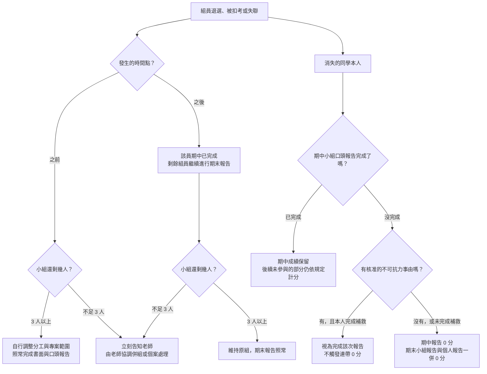

# 系統分析與設 課程介紹

|課號|授課老師|
|---|---|
|115-1（IE226）|呂卓勲|

## 授課教師聯絡資訊

| 老師 | Email | Office Hour |
|---|---|---|
| 呂卓勲 | chohsunlu@saturn.yzu.edu.tw | 每週四 13:30-16:30 |

## 學期配分比重

|項目|比重|說明|
|---|---|---|
|**期中小組報告**|30%|系統分析（Analysis）階段，以總分 100 計算，包括：書面（30%）與口頭報告（70%）|
|**期末小組報告**|30%|系統設計（Design），以總分 100 計算，包括：書面（30%）與口頭報告（70%）|
|**期末個人訪談**|20%|預計每一個同學都訪談 6-10 分鐘，以總分 100 計算|
|**個人學習與貢獻報告**|15%|建議篇幅為 1,500-2,500 字，或約 4-6 頁，說明你自己在期中與期末的小組報告中的主要貢獻，以總分 100 計算|
|**出席狀況**|5%|詳細可見「**課堂規範**」一節，以總分 100 計算|
|合計|100%||

**小組分數與個人分數的關係**：期中與期末小組報告（各 30%）原則上 **組內同分**，由小組成果決定基準分。個人之間的差異，由期末個人訪談（20%）與個人學習與貢獻報告（15%）反映。換句話說，報告做得好壞是全組共同承擔，你自己有沒有真的參與，則另外檢核。

報告怎麼交、少交一項會怎樣、缺席與補救如何處理，全部集中在「**報告規範**」一節，請務必讀過。

**成績公告與複查**：各項報告與訪談的分數，原則上都會在評分完成後 **一週內公告**。對分數有疑問的同學，請在 **老師指定的複查時間內** 提出。

## 課程預計進度表

| 週次 | 日期 | 主題 | 對應檔案 |
|---|---|---|---|

## 分組原則與規定

本課程的期中與期末報告原則上均以「**小組**」為單位進行。分組結果將影響整學期的專題進度與工作分配，請同學審慎選擇組員並及早完成分組。

|項目|規定|
|---|---|
|組成人數|**原則上為 3–4 人一組，初始分組不得少於 3 人**。|
|名單確定期限|最晚於 **第三週前** 確定名單。第三週後仍未分組者，由教師依各組人數與課程安排逕行分組：可能把未分組的同學湊成一組，也可能把個人指派到特定組別。不論以哪一種方式成組，適用的評分標準都與其他各組完全相同。|
|分工紀錄|各組須保留分工佐證，例如工作分配表、會議記錄、共筆或檔案版本紀錄，並於期中與期末報告繳交時一併附上。此紀錄是個人學習與貢獻報告、期末個人訪談的主要判斷依據，發生具名陳情時也以它為準。沒有紀錄，個人貢獻就只能憑各說各話認定。|
|人力減損風險|組員可能因退選、扣考或其他因素退出課程。若因此造成小組人數減少，仍由小組自行評估剩餘人力與進度，調整工作分配、專案範圍及成果內容。人數減少 **不免除** 書面與口頭都必須完成的要求；若減損後不足 3 人，由教師協調併組或個案處理。老師會 **先設法補人或併組**，只有在真的沒有人可以補進來的特殊情況下，才會讓小組以低於 3 人的狀態繼續，這不是常態。|
|人力減損後的評分|教師不直接替小組決定應刪減或保留哪些工作，但期末評分時，會依組員異動時間、剩餘人力與實際完成情況，適度調整對報告完整性與成果品質的期待。人數減少不代表所有核心要求均可免除。|
|期中後組員變動|期中報告後，個人可申請一次組員變動。申請人必須取得移出組與移入組所有成員的書面同意，原則上以單一成員移入 3 人組為主，且不得使原組低於 3 人。最終是否核准，由教師依各組人數、專題進度及實際情況決定。轉組核准後，期末小組報告的分數以 **新組** 為準。|
|轉組後個人報告|期末個人報告仍以學生原屬小組的期中報告內容為主，不因轉組而改變。學生不須負責離組後原組新增或修改的內容。|
|組內衝突處理|一般性的分工、溝通與進度衝突，由各組自行協調，教師原則上不擔任組內協調者。|
|具名陳情|教師接受組內衝突之具名私下陳情。陳情內容將作為期末個人訪談、工作貢獻判斷與成績評量的參考。若涉及霸凌、威脅、惡意排除成員或學術不誠信等重大情形，教師將依實際狀況另行處理。|

組員中途退出或缺席報告時的完整處理流程（含不可抗力的請假與補救），見「**報告規範**」一節。

## 期中小組報告：系統分析（Analysis）

教師提供既有系統案例。各組同學須完成：

* 系統需求分析
* 使用者分析
* 功能分析
* Use Case
* Activity Diagram
* ERD
* Data Dictionary
* 初步系統架構分析

### 備註

由於學校會要求上傳期中成績，以進行期中預警的作業，因此期中小組報告的原始分數介於 0 到 100 分之間，並依下表換算成等第：

|期中成績（原始分數）|期中評量等第|備註|
|---|---|---|
|80 分（含）以上|A|優異|
|70 分以上、未滿 80 分|B|良好|
|60 分以上、未滿 70 分|C|待加強|
|未滿 60 分|D|不及格；導師會關切，家長可能會收到通知|

期中之後，你除了看到分數，也會看到等第。如果你拿到 D，學校會通知你、導師也會關切，家長也可能會知道。

## 期末小組報告：系統設計（Design）

教師提供新的專題需求。各組同學須完成：

* 系統架構
* 模組設計
* API Design
* Database Design
* UI Prototype
* UML
* Design Specification

## 期末個人訪談與報告

學生整理整學期成果。內容包括：

* 個人整理報告
* 面對面口試

教師依據學生回答內容確認是否真正理解系統分析與設計流程。

## 報告規範

本節適用於期中小組報告、期末小組報告與期末個人訪談與報告，是三份報告共通的規則。

### 繳交要求

本課程的每一份報告都包含 **書面與口頭兩個部分，兩者都必須完成**，不能只交書面、也不能只上台報告。少做其中一項，不是只扣掉那一部分的分數，而是 **整份報告以 0 分計算**；老師也不接受「請只針對我有做的部分評分」這類要求。

口頭報告原則上 **全員上台**，每位組員負責其中一段。

各份報告之間還有連帶關係，缺了前面的，後面的也一起失分：

> **缺期中小組報告，期末小組報告與個人報告一律 0 分；缺期末小組報告，個人報告也是 0 分。**

### 未完成的認定

書面缺交由 **全組** 承擔；口頭報告當天無故缺席或沒有上台，由 **該員個人** 承擔，其餘組員不受影響。

舉例來說，三人一組的小組在口頭報告當天有一人沒到，另外兩人照常取得該組應得的分數，缺席的那位以 0 分計算；若缺的是期中報告，該員的期末小組報告與個人報告也會一併 0 分。

不過要提醒的是，「其餘組員不受影響」指的是 **不會替缺席者連坐扣分**，不代表報告的實際表現不受影響——少一個人上台，內容可能講不完整、段落之間銜接不上，這些呈現上的落差 **仍會反映在小組的口頭報告分數上，由全組自行承擔**，老師不會另外補償。因此各組務必事先準備備案：每一段至少要有第二個人講得出來，資料與簡報檔也不要只放在一個人手上。

另外要注意，出席雖然只佔 5%，但依「**課堂規範**」的「**扣考規則**」，被扣考者不能參加期末小組報告，再依上述連帶規定，個人報告也一併 0 分，實際損失遠大於 5%。各組在分工時請把這個風險一併考慮進去。

### 組員中途消失了怎麼辦？

每學期都會遇到有同學退選、被扣考或直接失聯。下圖說明這種情況發生時，**留下來的組員** 與 **消失的同學** 各自會怎麼處理：

> **不論是哪一種情況，發現組員失聯就儘早告知老師。拖到報告當天才說，能處理的空間最小。**

### 不可抗力無法上台怎麼辦？

**適用事由**：住院或急診、法定傳染病隔離、重大意外、直系親屬喪事、天災停課、兵役徵集與法院傳票等有客觀憑證的情況。打工、旅遊、社團活動、考照、睡過頭、交通遲到 **不在此列**，一律以無故缺席辦理。

**通報與證明**：知道的當下立即通知老師與組長，最遲不得晚於報告當天上課前；突發狀況（送急診、意外）於事發後 **三個工作日內** 補行通報。同時仍須依學校請假系統辦理請假並提出證明文件（診斷證明、隔離通知、公文等），提不出證明者不適用本節。

**小組怎麼辦**：報告 **照常進行、不延期**，缺席者的段落由其他組員代講。代講只保住小組成績，**不能替缺席者取得他的口頭分數**，所以各組準備時就要做好備援，每一段至少要有第二個人講得出來。

**個人怎麼補**：經核准後由 **本人** 補上台，方式依優先順序為——線上即時報告（能視訊接入就用這個，最接近原本的評分情境）、兩週內個別補報告（10 分鐘內）、錄影補交並線上答問、併入期末個人訪談加重提問。補救依 **原評分標準** 計分，不打折也不加分；同一學期以 **一次** 為限。

**與 0 分規定的關係**：經核准且 **本人完成補救** 者，不視為未完成報告，不觸發連帶 0 分。未在期限內完成補救，或只由組員代講而本人沒補，仍以 0 分計算。確實無法補救者（例如長期住院），由老師個案處理，不強行以 0 分結案。

## 小組與個人評分標準

評分標準請見文件「系統分析與設計課程評量規準（Rubrics）」。

## AI 工具使用揭露

**其實，就算你的書面報告與檔案內容全部都用 AI 生成，老師也不介意。與其交出一份排版亂七八糟、前後語意不通、讓人讀不下去的報告，老師寧可你好好運用 AI，做出一份清楚完整的成果。**

不過，這不代表用了 AI 你就會比較輕鬆。

即使書面報告或其他繳交內容大量使用 AI 工具協助產出，教師原則上不會因此扣分。評分重點不在於是否使用 AI，而在於學生是否能理解、查核、修改並說明最終成果。教師將透過小組口頭報告與期末個人訪談確認學生對內容的理解程度。

若使用生成式人工智慧協助撰寫、整理、繪圖、翻譯或修訂，應於報告中揭露下列事項：

| 項目      | 說明                                                  |
| ------- | --------------------------------------------------- |
| 使用工具    | 列出使用的工具，例如 ChatGPT、Claude、Gemini 或其他服務，並儘可能註明模型或版本。 |
| 使用目的    | 說明使用 AI 的用途，例如架構發想、資料整理、翻譯潤稿、繪製圖表或產生範例資料。           |
| 使用範圍    | 說明 AI 協助產出的章節、圖表、模型或其他內容。                           |
| 人工查核與修改 | 說明如何確認內容正確，以及人工進行了哪些修正、補充或重新製作。                     |

使用 AI 不代表學生可以免除內容查核與說明責任。若無法說明報告內容、圖表關係、設計依據或修改過程，仍會影響口頭報告與個人成績。

## 課堂規範

### 簽到與簽退

我們每一週上課都要簽退與簽到，助教將會在上課前 30 分鐘前給同學簽到，下課時間後則可以簽退。

||時間|說明|
|---|---|---|
|簽到|上課前 10-20 分鐘到上課鐘響後 20 分鐘內|超過時間後助教就會離開|
|簽退|第三堂課下課後|助教會在現場等候，沒有同學要簽退就會離開|

如何計算曠課時數，請見下表：

|狀況|備註|
|---|---|
|未簽到有簽退|曠課1小時|
|有簽到未簽退|曠課1小時|
|未簽到也未簽退|曠課3小時|

> 請注意：簽到與簽退時間到，助教就會立刻離開教室，請同學不可因為個人因素干擾助教進行前述的工作！違者將依照學校規定處理

### 扣考規則

**所謂扣考就是：不能參加期末小組報告與個人訪談與報告，並且如果你的小組中有人被扣考，你那組就會少一個人。** 

學校已經將相關規定寫在學則裡面：

*圖片來源：元智大學學則*

簡單來說，如果一堂課 3 學分，全學期共有 54 小時。學校規定是缺課 18 小時就會被扣考，所謂「缺課」包括了「曠課（曠課 1 小時，以缺課 2 小時論）、病假、事假」都算在內。換句話說，假如你的曠課、病假、事假時數通通加起來超過 18 小時，就等於被當。但是你放心，卓勲老師這裡的規定很寬鬆，如下：

> **我只看曠課，曠課 1 小時，以缺課 2 小時論，曠課超過 18 小時（等於有六次沒來上課），將逕行扣考。**

換句話說，你只要想辦法不要超過曠課 18 小時，就不會被扣考（你自己算算看，要曠課超過 18 小時，其實很難！所以拜託，不要太誇張）。因此，如果沒有來上課，請務必請假。關於請假規定，請繼續往下讀。

### 請假規定

- 請假請自行按照學校規定申請，但是請勿濫用各種假別……務必仔細思考有必要才請假
- 你的請假理由，麻煩不要太扯，什麼叫做很扯的理由，像是：
  - 要去打工、打工班表已排好 🈲 🙅
  - 你考駕照考了四五次甚至更多 🚗 🛵
  - 老師我已經機票買好了，可以之後補考期中考嗎？
  - 要去排演唱會周邊、心儀的偶像閃電結婚/退伍 👩‍🎤 🧑‍🎤
  - 我的鬧鐘壞了 ⏰️
  - 昨晚熬夜打電動，現在太睏了 🎮
  - 男生請生理假？
  - 我頭髮骨折
  - 任何太蝦 🦐 的理由……
- 真的因為某些因素會有長期缺課，請務必聯絡任課老師，不要預設任何情況，敬請先跟任課老師討論，以免造成不可挽回的悲劇狀況

### 其他規範

- 上課禁止使用智慧型手機，使用電腦請務必與本課程有關，要追劇、打電動、看直播、聽音樂請回家
- 如果我發現你玩得太過頭，老師不會罵人但是請你離開教室，想好好上課再回來

## 成績有問題怎麼辦？

首先，請先跟任課老師聯絡，不要預設任何立場。

成績有問題不一定是「針對你/黑箱/完全不能改」，可能只是誤植、算錯，請在還可以改的期限內提出問題，確認成績是否正確，不用客氣。

成績不及格，不要認為老師一定會當掉你，請好好說明你的狀況，和老師討論是否有補救方案？

但請不要認為老師要給你補救是天經地義，假如你的期中成績不是58、59分，而是可憐的低於50分，這太難救了，請下學期/學年再來吧。

> 被當掉不是天崩地裂，人生還很長，真的有困難早點讓老師知道，總比成績都送出去了才來求情好得多。

## LINE 群組

本課程所有公告事務於LINE上公告，請加入LINE群組。

> 請同學務必加入，免得漏掉重要訊息，每學年都有人最後才加入，然後發現自己什麼都不知道，請不要當這種人

為避免干擾同學，若有需要公告的事務，老師將僅於上班時間週一至五 09:00-16:00 公布，除非有緊急事務，則儘可能於晚間9時前公布。

同學有疑問，或只是想聊天，不在此限（也請注意同學之間應有的禮節）。

## 課程教材
