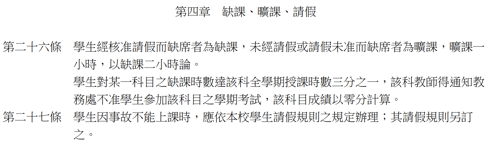

# 系統分析與設計（System Analysis and Design, SAD）課程介紹

| 項目 | 內容 |
|---|---|
| 學期（課號） | 115-1（IE226） |
| 學分數 | 3 學分 |
| 授課老師 | 呂卓勲 |
| Email | chohsunlu@saturn.yzu.edu.tw |
| Office Hour | 每週四 13:30–16:30 |
| 上課時間 | 每週三，第 2–4 節，共三小時 |
| 上課地點 | *待補* |
| 課程內容 | 以「系統分析與設計」為核心，採專題導向（Project-Based Learning）教學。學生透過實際案例分析、需求萃取、系統設計、文件撰寫與成果報告，建立資訊系統開發所需的分析與設計能力 |

## 課程預計進度表

本學期自 2026 年 9 月 9 日起，至 2027 年 1 月 6 日止，共 18 週。下表是預計安排，**各週主題與順序可能小幅變動**；報告日期與繳交期限若有調整，一律以 LINE 群組公告為準。

| 週次 | 日期 | 主題 Topic | 本週內容 | 對應報告項目與提醒 |
|---|---|---|---|---|
| 1 | 9/9 | 課程導論與系統概念 Course Orientation and Systems Concepts | 課程規範與評分方式；系統的四要素、邊界與環境；資料與資訊的差別；ERP／MES／WMS／QMS 是什麼 | 講解本文件與[報告規範](Report-Rules.md)；教材：[系統分析與設計導論](../01-Course-Materials/01-Systems-and-Analysis.md) |
| 2 | 9/16 | 系統開發生命週期與專案角色 Systems Development Life Cycle (SDLC) and Project Roles | 瀑布、疊代與敏捷的差別；分析與設計的分界；專案角色分工；錯誤成本曲線 | 期中專題案例發放；建議本週上課前做完[課程規範理解測驗](Course-Rules-Quiz.md)（不計分）；教材：[系統分析與設計導論](../01-Course-Materials/01-Systems-and-Analysis.md) |
| 3 | 9/23 | 問題定義與現況分析 Problem Definition and Current-State Analysis | 從既有系統反推當初要解決的問題；5 Why 與魚骨圖；可驗收的目標與成功指標；改善建議的三個層次 | 期中第 1、9 項；教材：[問題定義與現況分析](../01-Course-Materials/02-Problem-Definition.md)；**分組名單確定期限**；**當堂公開抽籤決定各組期中題目** |
| 4 | 9/30 | 使用者分析與使用案例 User Analysis and Use Cases | 利害關係人辨識與 RACI；使用者分群與人物誌；使用案例圖、使用案例敘述與例外流程；現況流程（As-Is）盤點與事件表 | 期中第 2 項，並為第 3、6 項鋪路；教材：[使用者分析](../01-Course-Materials/03-User-Analysis.md) |
| 5 | 10/7 | 系統需求分析；功能分析與系統邊界 Requirements Analysis; Functional Analysis and System Scope | 功能與非功能需求、FURPS+、需求品質判準、MoSCoW 與追溯矩陣；系統邊界與情境圖、範圍外清單；功能分解與功能清單 | 期中第 4、5 項；教材：[系統需求分析](../01-Course-Materials/04-System-Requirements-Analysis.md)、[功能分析](../01-Course-Materials/05-Functional-Analysis.md)（模組劃分留到第 10 週） |
| 6 | 10/14 | 行為建模：活動圖與系統循序圖 Behavioral Modeling: Activity and System Sequence Diagrams | 活動圖與泳道、分岔與會合、例外分支；系統循序圖（SSD）把系統當黑箱；三張圖之間怎麼對得起來 | 期中第 3、6 項；教材：[行為建模](../01-Course-Materials/06-Behavioral-Modeling.md) |
| 7 | 10/21 | 資料建模：ERD、正規化與資料字典 Data Modeling: ERD, Normalization, and Data Dictionary | 名詞分析法找實體；主鍵、外鍵與多對多拆解；1NF–3NF；Schema 與資料字典的欄位定義 | 期中第 7 項；教材：[資料建模與資料庫設計](../01-Course-Materials/07-Data-Modeling.md) |
| 8 | 10/28 | 系統環境與整體架構；期中整合演練 System Environment and Architecture; Midterm Integration | 使用者端、應用系統、資料庫與外部系統的整體關係；主從式與分層式架構；九項書面文件的一致性自我檢查與口頭報告演練 | 期中第 8 項與全部九項整合；教材：[系統環境與架構](../01-Course-Materials/08-System-Architecture.md) |
| 9 | 11/4 | **期中小組報告：系統分析** **Midterm Team Presentation: Systems Analysis** | 各組口頭報告 12–15 分鐘，另加 5–8 分鐘問答 | **書面最晚 10/30（五）23:59:59、投影片最晚 11/6（五）23:59:59 前上傳 Portal** |
| 10 | 11/11 | 期中講評；從分析到設計 Midterm Review; From Analysis to Design | 各組共同問題講評；設計階段八項產出總覽與期末技術深度原則；模組化、內聚與耦合 | 期末第 1、2 項起手；教材：[功能分析](../01-Course-Materials/05-Functional-Analysis.md)；**期末題目說明書發放並當堂公開抽籤**；**期中報告若未報告完順延至本週續行，報告完畢後接續上課**；**組員變動申請期限** |
| 11 | 11/18 | 系統架構設計；可行性、限制與風險 Architecture Design; Feasibility, Constraints, and Risk | 非功能需求如何決定架構、架構取捨與決策說明；地端與雲端、網路分區；可行性四面向與成本效益；限制盤點、風險機率乘衝擊與四種回應 | 期末第 5（架構）、7 項；教材：[系統環境與架構](../01-Course-Materials/08-System-Architecture.md)、[可行性、限制與風險分析](../01-Course-Materials/09-Feasibility-and-Risk.md)；**組員變動核准結果公布** |
| 12 | 11/25 | **本週不上課** **No Class** | — | **該週時數挪作期末個人訪談，可選時段另行公告** |
| 13 | 12/2 | 功能與模組設計；主要流程與互動設計 Module Design; Process and Interaction Design | 模組怎麼切、模組規格的欄位、CRUD 矩陣與相依關係圖；設計階段的活動圖；生命線是模組的設計循序圖；狀態機圖 | 期末第 2、3 項；教材：[功能分析](../01-Course-Materials/05-Functional-Analysis.md)、[行為建模](../01-Course-Materials/06-Behavioral-Modeling.md) |
| 14 | 12/9 | 資料設計與資料交換設計 Data Design and Data Exchange Design | 概念類別圖與 ERD 的差異；從需求推導 Schema 與資料字典、對回畫面欄位；系統介面規格的五件事、CSV 與 JSON、失敗處理 | 期末第 4、5（資料交換）項；教材：[物件建模](../01-Course-Materials/10-Object-Modeling.md)、[資料建模與資料庫設計](../01-Course-Materials/07-Data-Modeling.md)、[系統介面與資料交換設計](../01-Course-Materials/11-System-Interface-and-Data-Exchange.md)；**個人訪談時段登記表單開放** |
| 15 | 12/16 | 介面原型；設計規格與追溯；期末演練 UI Prototyping; Design Specification and Traceability | 使用性原則、線框圖與原型保真度、現場操作限制；需求 → 模組 → 流程 → 資料 → 畫面的追溯鏈；設計決策紀錄；八項文件整合與口頭報告演練 | 期末第 6、8 項與全部八項整合；教材：[使用者介面設計](../01-Course-Materials/12-UI-Design.md)、[系統設計規格與追溯](../01-Course-Materials/13-Design-Specification.md) |
| 16 | 12/23 | **期末小組報告：系統設計** **Final Team Presentation: Systems Design** | 各組口頭報告 | **書面最晚 12/18（五）23:59:59、投影片最晚 12/25（五）23:59:59 前上傳 Portal；個人訪談時段登記本日截止** |
| 17 | 12/30 | 期末個人訪談 Final Individual Interviews | 一對一口試，每人一次 | 訪談時段依表單登記；**期末小組報告若未報告完，順延至本週續行** |
| 18 | 2027/1/6 | 期末個人訪談 Final Individual Interviews | 一對一口試，每人一次 | 訪談時段依表單登記 |

進度表的主題安排依兩份小組報告的產出項目倒推：**第 1–8 週對應期中報告的九項系統分析（Analysis）產出，第 10–15 週對應期末報告的八項系統設計（Design）產出**，「對應報告項目與提醒」欄標示該週服務哪幾項產出、要讀哪幾章教材。各項產出要寫到什麼程度，見[「報告內容」](Report-Contents.md)；教材的完整章名見[「SAD 課程教材」](../README.md)。

**報告週次可能順延**：口頭報告的實際時間取決於當週的組數與各組報告長度，當週未報告完的組別順延至下一週繼續。

## 學期配分比重

每個項目各自算出自己的成績，再依「學期比重」加權合計。兩份小組報告的成績由書面與口頭兩部分組成，其餘三項不再細分。

| 項目 | 學期比重 | 總分 | 書面 | 口頭 | 說明 |
|---|---|---|---|---|---|
| **期中小組報告** | 30% | 100 | 30% | 70% | 系統分析（Analysis）階段 |
| **期末小組報告** | 30% | 100 | 30% | 70% | 系統設計（Design）階段 |
| **期末個人訪談** | 20% | 100 | — | — | 面對面口試，每人一次 |
| **個人學習與貢獻報告** | 15% | 100 | — | — | 個人書面，說明自己在兩份小組報告中的貢獻 |
| **出席狀況** | 5% | 100 | — | — | 只看曠課，計算方式見〈課堂規範〉 |
| 合計 | 100% | | | | |

**本節只列比重**：完整公式、遲交與缺交各扣多少、少做一項學期成績最多剩幾分，全部集中在[「成績計算規範」](Grading-Rules.md)，**所有分數與扣分規定都以那份文件為準**；報告怎麼交、缺席與補救如何處理，見[「報告規範」](Report-Rules.md)。兩份都請務必讀過。

表上五項之外，另有一個 **額外投入加分**：做了建議清單以外的內容、或把雛型系統實際做出來，最多可在學期成績上加 3 分，加完仍以 100 分封頂。這是本課程唯一的加分機制，條件見[「額外投入加分」](Bonus-Rules.md)。**不擅長寫程式不會因此吃虧**，文件做得扎實，四個評分項目一樣拿得到高分。

**小組分數與個人分數的關係**：期中與期末小組報告（各 30%）原則上 **組內同分**，由小組成果決定基準分。個人之間的差異，由期末個人訪談（20%）與個人學習與貢獻報告（15%）反映。換句話說，報告做得好壞是全組共同承擔，你自己有沒有真的參與，則另外檢核。

**四個評分項目會互相影響**：四項 **各自計分，沒有任何一項是另一項的參加資格**，但少做一項，除了那一項拿不到分數，**後面幾項的分數也一定跟著往下掉**，理由見〈期末個人訪談與報告〉與[「報告規範」](Report-Rules.md)〈四個項目怎麼互相影響〉。

## 分組規範

期中與期末報告均以「**小組**」為單位，分組結果影響整學期的專題進度與工作分配，請審慎選擇組員並及早完成分組。

> **分組人數、名單期限、分工紀錄、組員變動與組內衝突處理，全部集中在[「分組規範」](Group-Rules.md)，請完整讀過。**

最容易錯過的兩個日期：**分組名單最晚第三週（9/23）確定**、**組員變動申請最晚第 10 週（11/11）** 提出，逾期都不受理。個別同學缺席報告時的請假與補救，另見[「報告規範」](Report-Rules.md)。

## 報告規範

本節只把四個評分項目的概要說清楚：各自要做什麼、要交出哪些東西、時間怎麼安排。**完整規定不在這裡**，依你想知道的事情跳過去：

| 你想知道 | 去哪份文件 |
|---|---|
| 報告怎麼交、期限是哪一天、缺席與補救怎麼處理 | [報告規範](Report-Rules.md) |
| 遲交扣幾分、什麼情況直接 0 分、學期成績怎麼算 | [成績計算規範](Grading-Rules.md) |
| 書面要寫到什麼程度、口頭報告與訪談會問什麼方向 | [報告內容](Report-Contents.md)、[參考題庫](Question-Bank.md) |
| 每一項怎麼評分、等第怎麼換算 | [報告評量 Rubrics](Rubrics.md) |
| 有沒有範例可以參考 | 每一項該有哪些欄位、為什麼這樣寫，見[系統分析範例報告說明](../02-Midterm-Project-Example-Reports/Analysis-Phase-Deliverables.md)、[系統設計範例報告說明](../04-Final-Project-Example-Reports/Design-Phase-Deliverables.md)；寫完的成品長什麼樣，見[系統分析範例報告](../02-Midterm-Project-Example-Reports/Analysis-Phase-Sample-Report.md)、[系統設計範例報告](../04-Final-Project-Example-Reports/Design-Phase-Sample-Report.md)。各組題目不同，**照結構寫，不要照內容抄** |
| 做得比要求更多能不能加分 | [額外投入加分](Bonus-Rules.md) |

> **上面每一份都請完整讀過。** 真的發生爭議時，老師是依那些條文處理，不是依本節的概要。

### 期中與期末小組報告

兩份報告的題目由老師提供、各組抽籤決定，產出項目如下表。

| 報告 | 階段 | 題目來源 | 產出項目 |
|---|---|---|---|
| **期中小組報告** | 系統分析（Analysis） | 既有系統案例 | **九項**：1 問題與系統背景、2 使用者與利害關係人分析、3 現況流程分析、4 系統需求分析、5 功能分析與系統邊界、6 使用案例與系統互動分析、7 資料需求分析、8 系統環境與整體架構理解、9 現況問題與改善建議。必做的 UML 為使用案例圖、活動圖、系統循序圖三種 |
| **期末小組報告** | 系統設計（Design） | 製造現場的新專題需求 | **八項**：1 設計基礎與需求摘要、2 功能與模組設計、3 主要流程與互動設計、4 資料設計、5 系統環境、架構與資料交換設計、6 使用者介面原型、7 可行性、限制與風險分析、8 整體設計規格與追溯。必做的圖為活動圖、循序圖、概念類別圖、ERD、架構圖、模組相依關係圖與介面原型 |

兩份書面報告的最後都要再附一份 **分工紀錄**，欄位見[「報告內容」](Report-Contents.md)的「附錄：分工紀錄」，組內怎麼維護見[「分組規範」](Group-Rules.md)。

**兩份清單以[「報告內容」](Report-Contents.md)為準**，各項要寫到什麼程度、最低標準是什麼，另見[「系統分析範例報告說明」](../02-Midterm-Project-Example-Reports/Analysis-Phase-Deliverables.md)與[「系統設計範例報告說明」](../04-Final-Project-Example-Reports/Design-Phase-Deliverables.md)，兩份說明各配一份完整的範例報告。

#### 題目怎麼分配

期中與期末的題目老師都會準備數個，**哪一組做哪一題，在課堂上當場公開抽籤決定**。**期中題目於第 3 週（9/23）分組名單確定後當堂抽**；**期末題目於第 10 週（11/11）發放題目說明書後當堂抽**。

抽籤使用老師開發的開源工具 Lucklet：<https://github.com/billy1125/lottery-game>。投影在螢幕上當場操作，全班一起看結果；程式碼公開，亂數由瀏覽器端產生，老師無法預先決定哪一組拿到哪一題。**抽到就是抽到，不重抽、不換題、不接受組間交換。**

各題的規模與難度會盡量拉平，但不可能完全一樣。評分規準（見[「報告評量 Rubrics」](Rubrics.md)）對全班相同，看的是你對自己那一題做得多完整。

#### 兩份報告請一起規劃

期中做分析、期末做設計，兩份報告的 **題目可能完全不同**，但用的是同一套概念與方法：先弄清楚使用者要什麼，再決定系統長成什麼樣子。期中畫 Use Case 與 ERD 時建立起來的思考方式，正是期末切模組、設計資料庫時要用的東西——換了案子，做法沒有換。

所以請不要等期中交完才開始想期末。期中在第 9 週、期末在第 16 週，中間扣掉停課只剩五次上課，再花兩週暖機就只剩三次。分工方式、檔案命名、簡報模板與共筆規則也一樣，期中定好期末直接沿用；期中隨便做，期末就得整套重來。

> **把期中與期末當成同一個專題的兩個階段，不要當成兩份不相干的作業。**

### 期末個人訪談與報告

本階段由同學整理整學期的成果，包含兩個獨立計分的項目。

| 項目 | 形式 | 學期比重 | 概要 |
|---|---|---|---|
| **個人學習與貢獻報告** | 書面 | 15% | 說明你在期中與期末小組報告中的主要貢獻，**至少 2,000 字或 5 頁** |
| **期末個人訪談** | 面對面口試 | 20% | 老師從你們的書面報告抽題提問，依回答內容確認你是否真正理解系統分析與設計的流程 |

這兩項 **建立在兩份小組報告之上**，訪談問的就是你在期中與期末報告裡實際做了什麼。依[「報告規範」](Report-Rules.md)〈四個項目怎麼互相影響〉，沒有完成小組報告的同學 **仍然可以參加這兩項**，但訪談抽不到題目、個人報告也沒有內容可寫，**分數一定會受到大幅度影響**。

這兩項彼此之間也一樣：各自計分，少做一樣不會讓另一樣自動歸零，但 **沒交個人報告，訪談就少了你自己整理過的素材；沒來訪談，個人報告寫的東西也沒有機會被驗證**。兩項合計 35%，放掉哪一項都很難補回來。

#### 訪談時間安排

全班人數光靠第 17、18 週兩次上課時段排不完，因此 **第 12 週（11/25）停課挪出的三小時，會以另外開放時段的形式還給訪談使用**。可選時間包含第 17 週（12/30）與第 18 週（2027/1/6）的上課時段，以及老師另行公告的非上課時段，**一律排在 12/30（三）及之後**。

時段以 **線上表單登記、同學自行選填**，表單 **自第 14 週（12/9）開放至第 16 週（12/23）截止**，連結公布於 LINE 群組。請儘早填寫，額滿的時段就會關閉。

**逾時未登記、登記後換時段、訪談當天未到，以及個人報告的期限怎麼跟著訪談日走，一律依[「報告規範」](Report-Rules.md)辦理。** 其中最容易吃虧的一條是：沒在期限內登記的同學，老師的安排結果不保證會在 12/25 前通知你，因此請一律以最早的訪談日反推，**在 12/25（五）23:59:59 前把個人報告交出來**。

### 小組與個人評分標準

報告的分數會由兩個方向去打：**內容分數** 看內容做得如何，四個評分項目各自的評量規準（Rubrics）與等第、分數的換算方式，依[「報告評量 Rubrics」](Rubrics.md)；**繳交扣分** 看有沒有按時交、檔案打不打得開，細節請見[「成績計算規範」](Grading-Rules.md)。

## AI 工具使用揭露

**其實，就算你的書面報告與檔案內容全部都用 AI 生成，老師也不介意。與其交出一份排版亂七八糟、前後語意不通、讓人讀不下去的報告，老師寧可你好好運用 AI，做出一份清楚完整的成果。**

不過，這不代表用了 AI 你就會比較輕鬆。評分重點不在於是否使用 AI，而在於你是否能理解、查核、修改並說明最終成果——老師將透過小組口頭報告與期末個人訪談確認你對內容的理解程度。

若使用生成式人工智慧協助撰寫、整理、繪圖、翻譯或修訂，應於報告中揭露下列事項：

| 項目 | 說明 |
|---|---|
| 使用工具 | 列出使用的工具，例如 ChatGPT、Claude、Gemini 或其他服務，並儘可能註明模型或版本 |
| 使用目的 | 說明使用 AI 的用途，例如架構發想、資料整理、翻譯潤稿、繪製圖表或產生範例資料 |
| 使用範圍 | 說明 AI 協助產出的章節、圖表、模型或其他內容 |
| 人工查核與修改 | 說明如何確認內容正確，以及人工做了哪些修正、補充或重新製作 |

使用 AI 不代表可以免除內容查核與說明的責任。若無法說明報告內容、圖表關係、設計依據或修改過程，仍會影響口頭報告與個人成績。

## 課堂規範

### 簽到與簽退

每週上課都要簽到與簽退。助教會在上課前 10–20 分鐘到教室讓同學簽到，第三堂課下課後則開放簽退，完整時間見下表。

| 項目 | 時間 | 說明 |
|---|---|---|
| 簽到 | 上課前 10–20 分鐘到上課鐘響後 20 分鐘內 | 超過時間後助教就會離開 |
| 簽退 | 第三堂課下課後 | 助教會在現場等候，沒有同學要簽退就會離開 |

如何計算曠課時數，請見下表：

| 狀況 | 備註 |
|---|---|
| 未簽到有簽退 | 曠課 1 小時 |
| 有簽到未簽退 | 曠課 1 小時 |
| 未簽到也未簽退 | 曠課 3 小時 |

> 請注意：簽到與簽退時間一到，助教就會立刻離開教室。請勿因個人因素干擾助教作業，違者依學校規定處理。

**出席狀況的公告與更正**：每週的點名結果，原則上於 **上課後的第一個星期一** 在 LINE 群組公告。對自己的出席紀錄有疑問，請 **最晚於下一次上課前** 告知老師；過了這個時間就不再更正，因為時間拖久了誰也想不起當天的狀況。本項公告進行至 **第 16 週（12/23）** 為止。

每週都花一分鐘核對，比學期末才發現曠課時數不對容易處理得多。

### 扣考規則

> **所謂扣考就是：不能參加期末小組報告、期末個人訪談與個人學習與貢獻報告，並且如果你的小組中有人被扣考，你那組就會少一個人。**

**扣考只依曠課時數認定**，依據是下方的學則，而本課程只看曠課、不算請假，比學則寬鬆。要注意這件事由 **老師依曠課時數逕行認定**，走的是出席這條線。**報告規範不會另外剝奪你參加任何一項的資格**，兩者是兩回事。

被扣考的實際後果是期末小組報告、期末個人訪談與個人學習與貢獻報告三項都無法進行，合計 65% 全部拿不到分數，學期成績不可能及格（已完成的期中成績仍然保留，算式見[「成績計算規範」](Grading-Rules.md)）。所以請不要曠課到這個地步。

學校已經將相關規定寫在學則裡面：

*圖片來源：元智大學學則*

3 學分的課全學期共 54 小時，學校規定缺課 18 小時就扣考，而學則的「缺課」把曠課、病假、事假通通算進去。本課程比學則寬鬆：

> **我只看曠課，曠課超過 18 小時（等於有六次沒來上課），將逕行扣考。**

要曠到這個程度其實很難，沒辦法來上課，請務必請假。

### 請假規定

- 請假請自行依學校規定申請，但請勿濫用各種假別……務必仔細思考有必要才請假
- 請假理由也麻煩不要太扯，以下這些都算：
  - 要去打工、打工班表已排好 🈲 🙅
  - 考駕照考了四、五次甚至更多 🚗 🛵
  - 老師我已經機票買好了，可以之後再補報告嗎？
  - 要去排演唱會周邊、心儀的偶像閃電結婚或退伍 👩‍🎤 🧑‍🎤
  - 我的鬧鐘壞了 ⏰️、昨晚熬夜打電動太睏了 🎮、我頭髮骨折，或任何太蝦 🦐 的理由……
- 若因故必須長期缺課，請務必先聯絡任課老師討論，不要自己先假設可以怎麼處理，以免造成無法挽回的結果

### 其他規範

- 上課禁止使用智慧型手機，使用電腦請務必用於本課程相關的事情，要追劇、打電動、看直播、聽音樂請回家
- 如果老師發現你玩得太過頭，不會罵人，但會請你離開教室，想好好上課再回來

## 成績有問題怎麼辦？

各項報告與訪談的分數，原則上都會在評分完成後 **一週內公告**，對分數有疑問請在 **老師指定的複查時間內** 提出。提出之前，先分清楚兩件事：**分數算錯了** 和 **分數不理想**，處理方式完全不同。

**分數算錯了**：誤植、加總錯誤、漏登某一項——隨時歡迎提出，老師會查、也會改。請在複查時間內聯絡老師，不用客氣，也不用先預設是「針對你」或「黑箱」，多數時候真的只是打錯字。

**分數不理想**：**請先自己對照〈小組與個人評分標準〉的評量規準（Rubrics）看一遍**，多數人的疑問看完就解開了——分數是照那份規準給的，不是憑印象。對照過還是有疑問，歡迎來問失分在哪，這對你下一份報告有幫助。但要先說清楚，**這是說明，不是議價**——分數不會因為你來問過就往上調，那對其他同學不公平。

還有一種情況要特別提醒：**依課程規範已判定為 0 分的部分**（書面缺交、逾最晚可繳交時間、無故缺席、被扣考等），**不在討論範圍**。這些規則第一週就公告、第二週也請你確認過，事後沒有補救管道，老師不會為個別同學開例外。

真正有用的做法是 **提早說**。修課過程中遇到困難——身體狀況、家裡的事、或真的跟不上進度——請在還來得及的時候讓老師知道，那時候能一起想辦法的空間最大。

> 被當掉不是天崩地裂，人生還很長，真的有困難早點讓老師知道，總比成績都送出去了才來求情好得多。

## LINE 群組

本課程所有公告事務於 LINE 上公告，請加入 LINE 群組。

> 請同學務必加入，免得漏掉重要訊息。每學期都有人拖到最後才加入，然後發現自己什麼都不知道，請不要當這種人。

為避免干擾同學，若有需要公告的事務，老師僅於上班時間週一至週五 09:00–16:00 公布；若遇緊急事務，也儘可能在晚間 9 點前公布。

同學有疑問，或只是想聊天，不在此限（也請注意同學之間應有的禮節）。

連結：[line.me/ti/g/TPRBF-K8P4](https://line.me/ti/g/TPRBF-K8P4)

## 課程教材

各章教材正文與投影片會在學期進行中陸續補上，一律放在課程的 GitHub 儲存庫，完整的文件清單見[「SAD 課程教材」](../README.md)。
