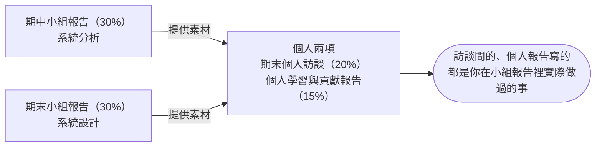

# 報告規範

> 請務必逐條看完，以下每一條都會直接影響學期成績。

報告規範內容很多，你應該會覺得很誇張，但是這份文件大部分的篇幅，都在處理「書面報告沒交、遲交、檔案壞掉、口頭報告人沒到」要怎麼辦？

**其實只要該交的東西有準時交、該報告的時候有準時到、認真做報告，裡面很多規則你連看都不用看**，遲交扣幾分、檔案怎麼補、缺席算誰的？這些都跟你沒關係。會需要翻到那些段落，通常表示事情已經出狀況了。

這份文件只回答「怎麼交」。要交什麼、怎麼算分、怎麼評，各有專門的文件，需要時直接跳過去：

| 你想知道 | 去哪份文件 |
|---|---|
| 報告要交出哪些內容 | [報告內容](Report-Contents.md) |
| 分數怎麼算、遲交與缺交扣多少 | [成績計算規範](Grading-Rules.md) |
| 老師評分時看哪些面向 | [報告評量 Rubrics](Rubrics.md) |
| 有沒有範例可以參考 | [系統分析範例報告說明](../02-Midterm-Project-Example-Reports/Analysis-Phase-Deliverables.md)、[系統設計範例報告說明](../04-Final-Project-Example-Reports/Design-Phase-Deliverables.md)，各配一份寫完的[系統分析範例報告](../02-Midterm-Project-Example-Reports/Analysis-Phase-Sample-Report.md)、[系統設計範例報告](../04-Final-Project-Example-Reports/Design-Phase-Sample-Report.md) |
| 口頭報告與訪談會問什麼方向的題目 | [參考題庫](Question-Bank.md) |
| 做得比要求更多能不能加分 | [額外投入加分](Bonus-Rules.md) |

## 四個項目怎麼互相影響

這四個評分項目共用同一套繳交與計分規則：

- 期中小組報告（30%）
- 期末小組報告（30%）
- 期末個人訪談（20%）
- 個人學習與貢獻報告（15%）

以下把「期末個人訪談」與「個人學習與貢獻報告」合稱「個人兩項」。另外，本文件反覆用到「扣 N 分」「該部分 0 分」「該項 0 分」這幾個詞，輕重差很多，精確意思見[「成績計算規範」](Grading-Rules.md)的「先講清楚幾個詞的差別」。

> **四個項目各自計分，沒有任何一項是另一項的參加資格。** 少做了哪一項，就是那一項拿不到分數；不會因此取消你參加其他項目的資格，也不會回頭把已經拿到的分數歸零。

但「各自計分」不等於「互不相干」。它們考的是同一件事的不同階段：

期中與期末的題目可能完全不同，但用的是同一套分析與設計方法。訪談的題目由老師從你們那兩份報告裡隨機抽取，個人報告要寫的也是你自己負責的那幾段。**沒有做過的事，訪談問不出來，個人報告也寫不出來**。

## 評分標準是什麼？

跟評分標準有關的規定 **全部集中在[「報告評量 Rubrics」](Rubrics.md)**。

> **口頭報告與期末個人訪談，評的不只是你講得好不好，更是你講的東西跟文件對不對得起來。** 缺了書面內容，報告與訪談就會很難評估，**分數一定會受到大幅度影響**。

老師評口頭報告與訪談時，會做這四件事：

- **對照文件聽你報告**：投影片上的流程圖、ERD、設計規格，跟書面寫的對不對得起來。
- **追問細節**：請你指出這個決策寫在文件哪一段、當初依據什麼判斷。
- **從文件抽題**：訪談的題目，是從你們的書面文件與你的個人報告中隨機抽出來的。
- **判斷個人貢獻**：把你講的內容，對回文件與分工紀錄。

這四件事都要有文件才做得下去。書面缺了，老師手上就沒有東西可以對照、可以追問、可以抽題，**能給的分數自然大幅下降**。

> **這門課沒有「只交書面」或「只上台」的省力走法：少掉的那一邊是 0 分，留下的那一邊也好不到哪裡去。**

## 分數怎麼算？

跟分數有關的規定 **全部集中在[「成績計算規範」](Grading-Rules.md)**：一份報告的 100 分怎麼組成、遲交與檔案問題各扣幾分、什麼情況那一部分直接 0 分、雷同與扣考怎麼處理，以及四個項目如何合成學期成績。

## 什麼時候要交什麼？

下表是整學期要交的東西與上台的日子。**建議把這張表當成待辦清單**，做完一項就打一個勾，確保你不會漏掉任何一個東西。

| 完成 | 週次 | 時間 | 該做的事 | 形式 | 對應評分項目 | 沒有準時完成會怎樣 |
|:---:|---|---|---|---|---|---|
| ☐ | 8 | 10/30（五）23:59:59 | 繳交期中書面報告 | 小組一份 | 期中小組報告的書面（30%） | 11/3（二）23:59:59 前補交，書面扣 10 分；**逾時全組書面 0 分**，口頭也會因為沒有文件可對照而嚴重失分 |
| ☐ | 9 | 11/4（三）上課 | 進行期中口頭報告 | 全員上台 | 期中小組報告的口頭（70%） | **無故缺席者該員這次的口頭 0 分**，其餘組員不受影響 |
| ☐ | 9 | 11/6（五）23:59:59 | 繳交期中投影片 | 小組一份 | 期中小組報告的口頭（70%） | 過了期限一律扣口頭 10 分，不通知補交（順延至第 10 週報告的組別，期限為 11/13（五）） |
| ☐ | 15 | 12/18（五）23:59:59 | 繳交期末書面報告 | 小組一份 | 期末小組報告的書面（30%） | 12/22（二）23:59:59 前補交，書面扣 10 分；**逾時全組書面 0 分**，口頭同樣嚴重失分 |
| ☐ | 14–16 | 12/9（三）開放，12/23（三）截止 | 登記訪談時段 | 線上表單，個人自行選填 | 期末個人訪談（20%） | 不扣分，但改由老師逕行安排，不再協調，時間壓縮的風險自負 |
| ☐ | 16 | 12/23（三）上課 | 進行期末口頭報告 | 全員上台 | 期末小組報告的口頭（70%） | **無故缺席者該員這次的口頭 0 分**，其餘組員不受影響 |
| ☐ | 16 | 12/25（五）23:59:59 | 繳交期末投影片 | 小組一份 | 期末小組報告的口頭（70%） | 過了期限一律扣口頭 10 分，不通知補交（順延至第 17 週報告的組別，期限為 2027/1/1（五）） |
| ☐ | 依訪談日 | 訪談日的前一個星期五 23:59:59 | 繳交個人學習與貢獻報告 | 個人各一份 | 個人學習與貢獻報告（15%） | 訪談日前一天 23:59:59 前補交，扣 10 分；**逾時該項 0 分**，訪談也會因為沒有素材而失分 |
| ☐ | 17、18 | 自選時段（含另行公告的非上課時段） | 進行期末個人訪談 | 本人到場 6–10 分鐘 | 期末個人訪談（20%） | **無故未到，該項 0 分**，不另安排補訪 |

### 說明

- 訪談時段登記表單開放 12/9（三）至 12/23（三）。逾時未登記者由老師逕行安排時段，安排結果不保證會在 12/25 之前通知你。既然不知道自己被排到哪一天，就請一律以最早的訪談日反推，**在 12/25（五）23:59:59 前把個人報告交出來**。這是沒有在期限內登記所要自行承擔的風險，不構成日後延後繳交或補交的理由。

## 報告繳交項目說明

### 1. 期中與期末小組報告

無論是期中或期末小組報告，都由以下兩個項目構成：

- 書面報告：全組共同完成，繳交一份，應包含的內容請見[報告內容](Report-Contents.md)。
- 口頭報告：期中 11/4（第 9 週）、期末 12/23（第 16 週）上台，報告時間與要講到的項目見[報告內容](Report-Contents.md)。

### 2. 期末個人訪談、個人學習與貢獻報告

雖然分開計分，但運作方式類似，同樣由以下兩個項目構成：

- 書面報告：即個人學習與貢獻報告，每人各交一份，建議篇幅與分節結構見[報告內容](Report-Contents.md)
- 口頭報告：即期末個人訪談，時段以線上表單登記、同學自行選填的方式安排，會問哪幾種形式的題目見[報告內容](Report-Contents.md)

> 再提醒一次：書面報告的繳交期限一律在上台或訪談之前，老師會先讀過你的書面，再據以提問。

## 報告繳交期限與方式

繳交期限只有兩條原則，記住這兩句就不會交錯時間，實際日期見「什麼時候要交什麼？」的總表：

> 書面電子檔一律在小組上台報告，或個人接受訪談那一天的 **前一個星期五** 23:59:59 前上傳。
>
> 口頭報告的投影片，則在小組上台報告那一天的 **當週星期五** 23:59:59 前上傳。

書面排在報告前，是因為老師要用週末讀完全班；投影片排在報告後，是因為各組常改到上台前一刻。

> **時間以 Portal 系統為準**

期限一律以 **元智大學 Portal 系統記錄的上傳完成時間** 為準，不是你手錶、手機或電腦上的時間。算的也是 **上傳完成** 的時間，不是按下上傳的時間：檔案大、網路慢都可能讓完成時間比你以為的晚。

> **請不要壓線上傳。** 提早一天交，這條規則就跟你沒有關係。

### 1. 期中與期末小組報告繳交期限

以下兩種檔案都要繳交，全組繳交一份即可：

- 書面報告：報告日的前一個星期五 23:59:59 前上傳，期中為 **10/30（五）**、期末為 **12/18（五）**
- 投影片：上台當週的星期五 23:59:59 前上傳，期中為 **11/6（五）**、期末為 **12/25（五）**

請注意：

- 投影片上傳的必須是當天實際報告的版本，報告後不得增補內容。
- 口頭報告若因當週報告不完而順延（見[SAD 課程介紹](Course-Introduction.md)的「課程預計進度表」），書面期限不隨之延後，仍以原定的星期五為準；投影片期限則以實際上台那一週的星期五為準，也就是期中順延組為 **11/13（五）**、期末順延組為 **2027/1/1（五）**。
- 老師於星期六早上統計書面的繳交狀況，以當下 Portal 上的檔案為準。

> 建議各組指定一位組員負責上傳，其他人在期限前自己上 Portal 確認檔案在不在。書面沒交是由 **全組** 一起承擔的：全組書面 0 分，口頭也會跟著失分，後果見[「成績計算規範」](Grading-Rules.md)。

### 2. 期末個人學習與貢獻報告繳交期限

只交書面，不必做投影片：

- 個人學習與貢獻報告：訪談日的前一個星期五 23:59:59 前上傳，每人各交一份，內容不得與其他同學雷同（見「個人報告的學術誠信」）。
- 期末個人訪談：本人到場即可，沒有要繳交的檔案。想帶自己的草稿、分工紀錄或圖表給老師看也可以，但訪談只有 6–10 分鐘，請挑真的講得完、打開就能看的東西。

請注意：

- 這份報告的期限跟著你自己的訪談日走，不是全班同一天。
- 所有訪談時段（含第 12 週停課挪出、另行公告的非上課時段）一律排在 **12/30（三）及之後**，因此期限只有兩種：訪談排在 **第 17 週** 者，期限為 **12/25（五）23:59:59**；排在 **第 18 週** 者，期限為 **2027/1/1（五）23:59:59**。

繳交提醒：老師會針對 12/25 與 2027/1/1 這兩個期限，各在 LINE 群組提醒兩次，分別在截止日前三天與當天。老師沒有提醒的義務，沒收到、沒看到、群組設靜音，都不構成延後繳交的理由。請自己把日期記進行事曆。

### 3. 準時繳交、遲交與缺交的定義

上一節設定了各個書面、投影片檔案的繳交期限，但超過期限不等於直接 0 分。以下定義什麼是「準時繳交」「遲交」與「缺交」，這三種狀態各自扣幾分，見[成績計算規範](Grading-Rules.md)。：

- 準時繳交：在繳交期限（見上節）前完成上傳。
- 遲交：過了期限，但在最晚可繳交時間前完成上傳。
- 缺交：超過最晚可繳交時間仍未完成上傳。

各項目的三個時間點如下：

| 項目 | 準時 | 遲交 | 缺交 |
|---|---|---|---|
| 期中書面報告 | 10/30（五）23:59:59 前 | 10/31 至 11/3（二）23:59:59 | 11/3（二）23:59:59 之後 |
| 期末書面報告 | 12/18（五）23:59:59 前 | 12/19 至 12/22（二）23:59:59 | 12/22（二）23:59:59 之後 |
| 個人學習與貢獻報告 | 訪談日的前一個星期五 23:59:59 前 | 至訪談日前一天 23:59:59 | 訪談日前一天 23:59:59 之後 |
| 投影片 | 上台當週的星期五 23:59:59 前 | 沒有這一段 | 沒有這一段 |

請注意：

- 書面報告的最晚可繳交時間，一律是報告日或訪談日的 **前一天 23:59:59**，過了就視同放棄那一份書面。
- 書面報告與個人學習與貢獻報告的檔案問題適用同一條線：老師發現後會通知你，到最晚可繳交時間仍未補上可以開啟的合格檔案，等同缺交。
- **投影片不分遲交與缺交，也不會通知補交**：它的期限落在報告日之後，口頭報告當天早已評分完畢，所以過了期限之後不論是晚幾天交、檔案有問題還是一直沒交，處理方式都一樣。

### 4. 報告繳交方式

**所有報告與投影片一律以 PDF 電子檔上傳學校 Portal 系統**，不收紙本，也不收 PDF 以外的格式；電子郵件、LINE、隨身碟等其他管道一律不受理。老師已經在 Portal 系統開好繳交區，請在期限前完成上傳。上傳成功不等於繳交完成。檔案本身有問題一樣要扣分，以下先說明什麼叫做有問題的檔案。

#### 什麼叫做「檔案有問題」？

檔案有上傳成功，但只要符合以下任何一項，就是檔案有問題：

| 類型 | 具體情況 |
|---|---|
| 格式不對 | 不是 PDF。Word、PowerPoint、圖片檔都不收，也不要壓成 zip 或 rar 再上傳 |
| 打不開 | 檔案毀損、設了密碼保護、上傳中斷導致檔案不完整 |
| 打得開但讀不了 | 中文變亂碼或空白方框（字型沒嵌入）、圖表變空白、圖片沒顯示、頁面缺漏 |
| 內容是空的 | 0 KB、整份空白、只有封面、只有大標題沒有內文 |
| 看不清楚 | 拍螢幕或翻拍紙本轉成的 PDF、解析度太低、圖表縮到看不出數字與文字 |
| 沒有檔案，只有連結 | 上傳雲端硬碟的捷徑檔，或 PDF 裡只放一個連結要老師自己去下載 |
| 有安全疑慮 | 被資安軟體警示，或內含巨集、可執行內容 |
| 完全不相干 | 傳成別的科目的作業、別組的檔案 |

只要符合任何一項，一律視為沒有完成繳交。書面報告與個人學習與貢獻報告，老師發現後會透過 LINE 群組通知，請你重新上傳；**投影片不通知，也沒有補交機制**。

**傳錯版本不在上表之內**。如果你上傳的是本課程的舊版或草稿（檔案本身打得開、也讀得懂，只是不是你想交的那一份），老師 **一律就期限前 Portal 上的那一份評分，不會通知你，也沒有補正機會**。這不是檔案問題，是你自己該確認的事。

建議：上傳完自己重新下載一次，用別台電腦或手機打開，確認是正確的版本、頁數對、圖沒變空白、中文沒變亂碼。另外提醒兩件事：

- **檔案大小主要是圖片撐出來的**。請先用軟體把圖片壓縮過再放進文書軟體，不要直接貼相機原檔或未經處理的截圖。檔案太大容易上傳中斷，變成上表的「打不開」。
- **不必套用一堆非必要的版型與裝飾，但排版本身仍要顧**。標題階層、編號、圖表編號與引用格式是書面報告的評分項目之一，見[報告評量 Rubrics](Rubrics.md)的「文件表達與格式」。

#### Portal 如果無法上傳怎麼辦？

Portal 是學校的系統，難免有維護、當機或連不上的時候。**這種情況不會要你自行承擔**，但要照下面的程序走。

**第一步：期限前通報。** 發現上傳失敗，請在原繳交期限之前透過 LINE 群組或 Email 告知老師，並附上錯誤畫面的截圖（要看得到時間與錯誤訊息）。越早說，能處理的空間越大。

**第二步：等老師公告備援方式。** 確認是系統端的問題後，老師會另行指定上傳管道（例如以 Email 寄送附件，或指定的雲端繳交連結），並另訂新的繳交期限。

> **備援管道與新期限一律公告於 LINE 群組**，不會逐一私訊通知。請自己回群組確認，不要等別人轉述。

**第三步：依公告的方式與期限交件。** 在新期限前依指定管道交到的，視同準時繳交，不扣遲交的分數；超過新期限才交，仍依遲交或缺交辦理。

還有兩點：

- **Portal 恢復後，仍請把同一份檔案補傳一份到 Portal**，讓繳交紀錄留在同一個地方。這一步不影響已經認定的準時繳交。
- **本程序只適用於系統端的問題**。自己的電腦壞掉、網路不通、忘記帳號密碼、檔案太大傳不上去、壓線上傳來不及，這些都不是 Portal 故障，一律依遲交或缺交辦理。

**等期限過了才來說系統壞掉，就只能依遲交或缺交辦理**，因為那時已經沒有辦法查證你當下的狀況。

## 口頭報告的規範

書面沒交是全組一起承擔；口頭報告不一樣，當天無故缺席或沒有上台，由該員個人承擔。

- 每位組員都要上台，各自負責其中一段內容。
- 無故缺席者，**該員這次的口頭以 0 分計算**：口頭是一份報告裡佔比最重的部分，書面有交也補不回來。
- 其餘組員不受影響：三人一組當天有一人沒到，另外兩人照常取得該組應得的分數。
- 期末個人訪談無故未到者，**該項以 0 分計算**，不另安排補訪。

「其餘組員不受影響」指的是不會替缺席者連坐扣分，不代表報告表現不受影響：少一個人上台，內容講不完整、段落銜接不上，這些落差仍會反映在小組的口頭報告分數上。因此各組務必準備備案：每一段至少要有第二個人講得出來，資料與簡報檔也不要只放在一個人手上。

組員中途退選、被扣考或失聯時，留下來的組員該怎麼辦、當事人本人的成績怎麼算，見[「分組規範」](Group-Rules.md)的「**組員中途消失了怎麼辦？**」。缺席的計分方式，見[「成績計算規範」](Grading-Rules.md)。

### 報告當天的服裝

上台報告與接受訪談時穿什麼，**不列入評分**，老師不會因此加分或扣分。

不過還是可以給你一個判準：**別讓衣服搶走報告的焦點**。不是穿得越蝦趴越好，也不是隨便穿就沒關係，要避免的是台下第一眼注意到的是你的裝扮，而不是你講的內容。

老師自己是資訊工程師出身，這一行對穿著向來寬鬆，看賈伯斯的黑色高領、黃仁勳的皮衣，還有永遠像個大學生的祖克柏就知道了，我平常也不常穿正裝。我自己就是照上面那個判準在穿：聽同學報告或跟同學面談，不穿拖鞋、短褲，也不會刻意穿得太正式，長褲加一件 Polo 衫這種有領子的上衣就夠了。不是為了好看，也不是為了禮貌，是不想讓外表干擾我要講的事情。

至於怎樣才算穿對，**老師不給正確答案**，也不會列一張「可以穿」與「不可以穿」的清單。什麼樣的穿著配得上什麼樣的場合，本來就是你自己要學會判斷的事，出了社會也沒有人會幫你判斷。

真的不確定，就 **依照本系的基本 Dress Code**，那是最不會出錯的選擇。

## 個人報告的學術誠信

個人學習與貢獻報告是個人項目，每人各交一份，**內容不得與其他同學雷同**。

- **判定方式**：老師會使用 AI 工具比對全班的個人報告，但 AI 比對只是初篩，一律經老師人工複核確認後才成立。
- **計分**：認定為雷同者，該項書面分數一律以固定分數計，見[成績計算規範](Grading-Rules.md)。
- **申訴**：這一項可以申訴。請於成績公告後一週內向老師提出，並附上足以證明獨立完成的過程紀錄，例如草稿、檔案版本紀錄或共筆歷程。

要避開這條規則其實不難：寫你自己實際做過的事、遇到的問題、當時怎麼判斷。這些東西每個人本來就不一樣，會雷同多半是因為直接複製了小組文件或別人的段落。

## 如果遇到不可抗力因素？

這一節處理的是 **個別同學** 因客觀事由無法上台或無法準時繳交的情形。走完這條路、且本人完成補救的人，不會被當成無故缺席，也不會因此扣分。

天災停課、學校公告停課等 **影響全班** 的情況不走這一節，由老師另行公告順延的報告日期與新的繳交期限。

### 1. 什麼事情算是不可抗力

**住院或急診、法定傳染病隔離、重大意外、直系親屬喪事、兵役徵集、法院傳票**。

> 原則上包括以上所述事由，但不限於此。其他經學校請假系統核准，或具有相當客觀證明且確實無法事先避免之重大事由，由老師依一致標準個案認定。

要走這一邊，**三個條件必須同時成立**：

1. **事由本身不是你能決定的**：不是你決定可不可以發生的。
2. **你也沒有機會事先避開**：報告與訪談的日期第一週就公告了，凡是你有時間事先安排、事先排開的，都不算。
3. **提得出客觀憑證**。

第 2 條是關鍵。有同學會主張「打工班表不是我排的」，班表確實不是你排的，但你有整個學期可以拿報告日期去跟雇主調班，這叫做 **有機會事先避開**。旅遊、社團活動、考照、演唱會同理：日期或許不由你定，但要不要把那天排進去、以及有沒有提早處理，都是你決定的。住院、急診、意外、法院傳票不一樣，它們沒有給你事先安排的餘地。

憑證只是證明事情真的發生，**不能讓不符合前兩個條件的事情變成不可抗力**。機票、班表、報名表也都是憑證，交得出來一樣以無故缺席辦理。三個條件少任何一個，都不算。

### 2. 什麼事情不是不可抗力

以下這些一律以無故缺席辦理：

| 類型 | 常見例子 |
|---|---|
| 自己安排的行程 | 打工班表、旅遊、返鄉、社團活動、系上活動、球隊練習或比賽、演唱會、婚宴、家庭聚餐 |
| 可以改期或再考一次的事 | 考駕照、語言檢定、各類證照考試、企業參訪、徵才活動、公司面試 |
| 其他課的事 | 別的課考試、作業或報告撞期；別的課的實驗、實習或校外教學 |
| 沒有就醫紀錄的身體不適 | 感冒、疲勞、身體不舒服，但沒有就醫，也提不出診斷證明 |
| 自己該管的準備工作 | 睡過頭、記錯日期、熬夜趕報告、電腦或手機壞掉、檔案沒存到、雲端沒同步、忘記把檔案帶來 |
| 交通問題 | 塞車、大眾運輸誤點、機車故障、找不到停車位 |
| 組內的事 | 組員沒把檔案給你、組員失聯、分工沒喬好、簡報只有某一個人手上有 |

這張表不是窮舉，沒有列到的情況一樣拿上面三個條件去判斷。要提醒的是最後兩類：**交通與器材問題請自己留緩衝**，報告日期你早就知道；**組內的事屬於小組自理範圍**，處理方式見[「分組規範」](Group-Rules.md)，不能拿來當個人缺席的理由。

### 3. 為什麼卡這麼死？

因為出了社會，別人不會因為你的個人因素配合你。以下都是離開學校之後真的會遇到的事情：

| 場合 | 你會講的理由 | 實際會發生的事 |
|---|---|---|
| 求職面試 | 「路上塞車，晚了二十分鐘」 | 面試官的時段是排定的，遲到就是取消，不會為你往後挪 |
| 對客戶提案 | 「我另一個會議撞期」 | 會議照開，你的部分換人講或直接跳過。案子沒拿到，不會因為你的理由重來一次 |
| 線上投標、報名、申請補助 | 「系統上傳到一半當掉」 | 截止時間一到系統就關閉，晚一秒都不收，沒有補件程序 |
| 報稅、繳費、各種法定期限 | 「我忘記了，也沒收到通知」 | 滯納金照算，逾期失權就是失權，沒有人有義務提醒你——老師自己就忘記過驗車，罰了 900 元，還得專程跑一趟監理所繳。跟誰都沒得談，只能認了 |
| 交件給客戶 | 「檔案壞掉，我重做一份就好」 | 違約金與逾期條款照合約走，客戶不管你的檔案發生什麼事 |
| 排定的上班班表 | 「我睡過頭」 | 曠職紀錄照登，累積到一定次數就是資遣事由 |

這些場合的共同點是：**時間是所有人一起排的，不是你一個人的事**。你晚一天，後面每一個人都得跟著改。所以請務必照規定走——至少這門課還給了你遲交的緩衝、不可抗力的補救管道，以及一個願意聽你解釋的老師，這些外面都沒有。

### 4. 通報與證明

| 項目 | 規定 |
|---|---|
| 通報對象 | 老師與組長，兩邊都要 |
| 通報時限 | 知道的當下立即通知，最遲不得晚於報告當天上課前 |
| 突發狀況 | 事發後 **三個工作日內** 補行通報 |
| 證明文件 | 仍須依學校請假系統辦理請假，並提出診斷證明、隔離通知、公文等 |

**提不出證明者不適用本節**，依無故缺席辦理。

### 5. 當天小組怎麼辦

報告 **照常進行、不延期**，缺席者的段落由其他組員代講。代講只保住小組的口頭報告成績，**不能替缺席者取得他個人的口頭分數**。那要靠本人補救。

### 6. 補救方式

經核准後由 **本人** 補上台。以下四種方式依序採用，能用前面的就不用後面的：

| 順序 | 方式 | 進行方式 | 完成時點 |
|---|---|---|---|
| 1 | 線上即時報告 | 報告當天以視訊接入，與其他組員同步進行 | 報告當天 |
| 2 | 個別補報告 | 另約時間到場，10 分鐘內講完自己負責的段落 | 原報告日起兩週內 |
| 3 | 錄影補交並線上答問 | 繳交錄影檔，另安排線上問答 | 原報告日起兩週內 |
| 4 | 併入期末個人訪談 | 不另補報告，於訪談時就該部分加重提問 | 訪談日 |

不論採哪一種：

- 補救一律須在 **原報告日起兩週內** 完成，併入期末個人訪談者以訪談日為完成日。
- 依 **原評分標準** 計分，不打折也不加分。
- 同一學期 **原則上以一次為限**，第二次起由老師個案認定。

### 7. 書面怎麼補？

- 經核准的事由若影響書面繳交，**最晚可繳交時間依核准的天數順延**，順延期間不算遲交。
- 小組報告的書面 **由其餘組員先行完成繳交**，缺席者的貢獻另於個人學習與貢獻報告中說明。
- 全組同時受影響時，由老師另訂期限。

### 8. 補救的三種結果

- **補起來了**：經核准、且本人確實完成補救者，依 **原評分標準** 取得自己的口頭分數，不因缺席當天而扣分。
- **沒補起來**：超過兩週還沒補，或只由組員代講、本人始終沒有補上台，處理方式與無故缺席完全相同：**該員這次的口頭以 0 分計算**。
- **真的補不了**：例如長期住院、整學期都無法到校，這種情形由老師依個案處理，不會直接用 0 分結案，請儘早聯絡老師討論。
