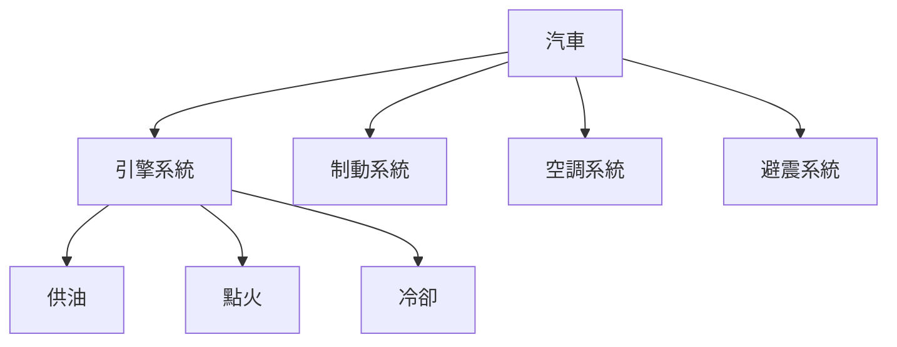
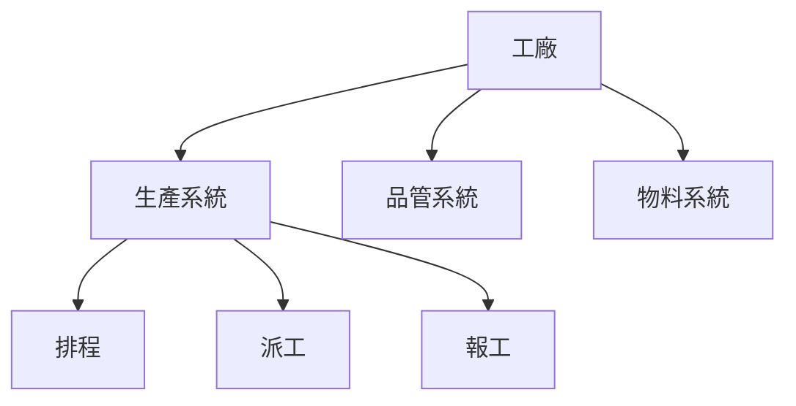
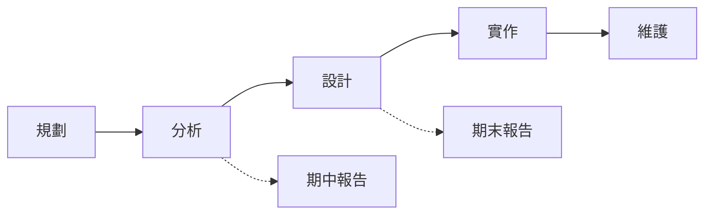

# 系統分析與設計導論

工業工程與管理系的學生在修這門課之前，通常會有一個疑問：我又不是要當工程師寫程式，為什麼要學系統分析與設計？

這個疑問其實問反了。一套資訊系統真正失敗的原因，很少是程式寫得不好，而是 **沒有人搞清楚這套系統到底該做什麼**。工廠花了兩百萬導入生產管理系統，上線半年後作業員仍然在用紙本工單、生產管理員仍然在用 Excel，程式碼一行都沒錯，但沒有人用。問題出在導入之前沒有人真正弄懂現場怎麼運作、誰在什麼時候需要什麼資訊、既有的作業習慣為什麼是那樣。

弄清楚這些事情，傳統上被當成程式設計師或資訊系統工程師的工作。但工程師不見得是最了解實際流程與工作現場的人。

在製造業與服務業的現場，最有機會扮演這個角色的，往往不是資訊科系畢業的人——**因為他們不懂現場**。懂現場流程、看得懂生產排程、知道品管為什麼要留那一欄簽名的人，是工業工程背景的你。這門課要練的，就是把你已經懂的現場，翻譯成資訊人員做得出來的規格。

本章先建立整門課共用的語彙：什麼是系統、什麼是資訊系統、系統分析在做什麼、一套系統從無到有會經過哪些階段、誰負責哪一段，以及為什麼那麼多系統專案會失敗。這些概念不見得會出現在你的報告裡，但都是系統分析與設計的最基礎概念。

> **延伸閱讀**：本章不談任何具體的分析方法或圖表畫法。各項產出實際要怎麼做，見後續各章；各組報告要交出什麼，見[「報告內容」](../00-Course-Introduction/Report-Contents.md)。

> **期中必讀標記**：標題後加註 🔴 期中必讀 的小節，是期中小組報告九項產出直接會用到的內容。判準見[「系統分析範例報告說明」](../02-Midterm-Project-Example-Reports/Analysis-Phase-Deliverables.md)，成品的樣子見[「系統分析範例報告」](../02-Midterm-Project-Example-Reports/Analysis-Phase-Sample-Report.md)。未標記的小節仍屬課程範圍，只是期中不會直接產出。本章多數內容是後面各章共用的語彙，標記較少不代表可以略過。

## 一、什麼是系統 🔴 期中必讀

### 1.1 系統的四個要素

**[系統](https://zh.wikipedia.org/wiki/系统)（System）是一群互相關聯的元素，為了共同的目標而運作。** 這個定義聽起來抽象，但拆成四個要素就很具體：

| 要素 | 意義 | 汽車 | 沖壓生產線 |
|---|---|---|---|
| 輸入（Input） | 從外界取得、要被處理的東西 | 汽油、駕駛踩油門與轉方向盤 | 鋼捲、生產工單、模具 |
| 處理（Process） | 把輸入轉換成輸出的活動 | 引擎燃燒、變速箱把動力送到輪胎 | 開卷、沖壓、去毛邊、檢驗 |
| 輸出（Output） | 處理後送出的結果 | 車子前進、廢氣、耗掉的油 | 沖壓件、廢料、生產紀錄 |
| 回饋（Feedback） | 把輸出的資訊送回來調整處理 | 時速表顯示超速，駕駛放掉油門 | 不良率偏高時停線調模 |

**四個要素裡最容易被忽略的是回饋。** 沒有回饋的系統只能一直做同樣的事，做錯了也不知道。工廠裡每一道品管檢驗、每一張日報表，本質上都是回饋機制——它們不生產任何東西，存在的目的是讓前面的處理能夠修正。這一點在後面談資訊系統時會再出現：一套只能輸入資料、不能產出有用報表的系統，等於是把回饋這一環拿掉了。

### 1.2 邊界與環境 🔴 期中必讀

**系統邊界（Boundary）決定哪些東西算在系統裡面，哪些算在外面。** 邊界之外、但會與系統互動的部分，稱為 **環境（Environment）**。

邊界是人為劃定的責任範圍，不一定有標準的規範說一定要怎麼劃定。例如同樣一台汽車，可以有三種畫法：

- 邊界只設定為引擎：油箱、變速箱、駕駛都是環境。
- 算到整台車：引擎、變速箱、煞車、儀表板都在界內，駕駛與路況是環境。
- 算到一趟通勤：駕駛、路況、加油站、導航都算進來。

同樣一條沖壓生產線也是這樣：

- 只算沖床本身：模具、鋼捲、操作員都是環境。
- 算到整個沖壓課：排程、品管、物料都在界內。
- 算到整廠：連 ERP 下單與出貨都算進來。

三種畫法都對，就看你要討論的問題是什麼。**邊界劃在哪裡，決定了你要負責什麼、可以改什麼。**

如果是期中與期末報告為例。期中報告的系統邊界已經設定好，你要做的是說明既有系統的邊界：環境中有哪些物件跟系統互動、怎麼互動。期末報告只給你一個題目，邊界劃在哪裡由你決定。

### 1.3 子系統 🔴 期中必讀

大系統由小系統組成，小系統還能再往下拆。用這種層次去看，比較容易理解一個系統怎麼運作。從工程角度看，拆開之後也比較好管理，要調整、修正或重新組合成更有效率的結構都方便。

例如，一台汽車底下有引擎、制動、空調、避震等子系統，引擎底下又可以再拆成供油、點火、冷卻。工廠也一樣：一座工廠是一個系統，底下有生產系統、品管系統、物料系統；生產系統底下又有排程、派工、報工。這種層層包含的結構稱為 **子系統（Subsystem）**。

拆成子系統的好處是可以分開處理：換一組避震器不必動到引擎，改動報工的做法也不必動到整個物料系統。這個想法後面會以「模組」的形式再出現，是系統設計最基本的手法之一。

### 系統概念 v.s. 資訊系統

請同學記得：**系統這個概念不是資訊系統專用的。** 汽車是系統、工廠是系統、一條生產線也是系統，身邊多數東西都可以用輸入、處理、輸出、回饋這四個要素拆開來看。先花一整節建立系統概念，目的就是讓你看得出系統無所不在；而其中專門處理數位資料的那一種系統，就是接下來要談的「**資訊系統**」。

## 二、資訊系統

有了系統的概念，接著要問的是：什麼是 **資訊系統**？

**[資訊系統](https://zh.wikipedia.org/wiki/信息系统)（Information System）是為了蒐集、處理、儲存與傳遞資訊而存在的系統。** 它一樣有輸入、處理、輸出與回饋，只是處理的對象不是鋼捲或汽油，而是資料。

工廠沒有資訊系統也照樣能生產。工單可以用紙本開、產量記在白板上、不良品數字寫在班長的筆記本裡，東西一樣做得出來。**差別不在生產，在資料**。紙本只有現場那一份，別人看不到，也沒辦法即時更新；要把散在各處的數字湊成看得懂的狀況，得靠人工整理，過程中還容易遺失或抄錯。

**資訊系統的用處就在這裡：把生產過程產生的資料即時收下來，整理成看得懂的資訊，送到需要的人手上。** 今天做了幾件、哪一批不良率偏高、哪張工單還沒完工，主管不必等到月底彙整，也不必跑到現場問人。

以汽車為例。引擎、變速箱、煞車讓車子跑起來，但駕駛要看儀表板才知道現在多快、油還剩多少、水溫有沒有異常。儀表板不推動車子前進，卻是駕駛決定踩油門還是靠邊停的依據。**資訊系統在組織裡扮演的就是儀表板的角色**：它不直接生產東西，而是讓做決定的人看得到現在的狀況。

但儀表板有沒有用，要看它能不能把機械的原始行為轉成駕駛看得懂的東西。感測器每秒量到的轉速、水溫、油量都是機器的數字，直接列出來沒有人看得懂；儀表板把它們變成一根指針、一盞警示燈，駕駛看一眼就知道該減速還是靠邊停。

資訊系統也一樣：記了多少事實不是重點，能不能讓看的人據此把事情做下去才是。**記錄下來的事實與看得懂的狀況，是兩件事**，這個差別就是下一節要談的資料與資訊。

> **補充教材**：如果你對資訊系統還沒有概念，或想先把基礎補起來，可以看[「資訊系統與資料庫——工業工程管理導向」](https://github.com/billy1125/introduction-of-information-technology/blob/main/05-Information-Systems-and-Database.md)，那是另一門課的教材，從校園系統談起，講得比本章詳細。

### 2.1 資料不等於資訊

**[資料](https://zh.wikipedia.org/wiki/資料)（Data）是未經處理的原始紀錄，資訊（Information）是經過整理、對決策有幫助的資料。** 資訊系統做的事，就是把資料變成資訊。

一個月下來，報工系統累積了六千筆紀錄：哪張工單、哪台機台、哪個人、做了幾件、什麼時候完工。這六千筆是資料。把它們依機台彙總、算出各機台這個月的稼動率、標出經常超出標準工時的那幾張工單——這才是資訊，因為生產管理員看了知道明天的排程該怎麼調。

**一套資訊系統的價值，取決於兩件事：能不能把資料轉成資訊，以及產出的資訊使用者看不看得懂、用不用得上。** 兩件都做到，這套系統才有人願意用。

只做到前半段的系統很常見。現場人員每天掃碼、填表單、輸入一堆東西，卻從來沒從系統得到任何對自己有用的東西——想知道自己這條線上個月的產出，還是得翻紙本或問組長。輸入的人得不到好處，資料品質就會迅速崩壞：亂填、事後一次補填一週、整批填同一個值。資料一爛，後面彙總出來的稼動率與不良率全部失真，主管不敢用、現場更不想填，變成惡性循環。這是導入失敗最常見的起點，也就是第一節說的：把回饋那一環拿掉了。

### 2.2 資訊系統的五個組成

**資訊系統由五個部分組成，缺一不可：**

| 組成 | 說明 | 沒做好會怎樣 |
|---|---|---|
| 人 | 使用者與維護者 | 沒人會用、沒人維護 |
| 流程 | 規定誰在什麼時候做什麼 | 系統與實際作業脫節 |
| 資料 | 系統儲存與處理的內容 | 資料錯誤或不完整 |
| 軟體 | 程式與資料庫 | 功能不足或不穩定 |
| 硬體 | 電腦、平板、掃碼槍、網路 | 現場根本用不了 |

**注意軟體只是其中一項。** 這五項裡，資訊科系負責的主要是軟體與部分硬體，其餘三項——人、流程、資料——正好是工業工程的專長範圍。一個專案如果只把軟體做好，另外三項沒處理，結果就是前面說的「程式沒錯，但沒有人用」。

### 2.3 工廠裡常見的資訊系統

前面談的都是資訊系統的通則，實際到了工廠，你會遇到的是這幾類系統：

| 系統 | 全名 | 主要負責 |
|---|---|---|
| ERP | Enterprise Resource Planning（[企業資源規劃](https://zh.wikipedia.org/wiki/企业资源计划)） | 訂單、採購、庫存、財務、成本 |
| MES | Manufacturing Execution System（[製造執行系統](https://zh.wikipedia.org/wiki/製造執行系統)） | 工單派工、現場報工、生產進度 |
| WMS | Warehouse Management System（[倉儲管理系統](https://zh.wikipedia.org/wiki/倉儲管理系統)） | 入庫、儲位、揀貨、出庫 |
| QMS | Quality Management System（品質管理系統） | 檢驗紀錄、不良分析、矯正措施 |

這幾套系統之間會互相傳資料：ERP 把生產工單下給 MES，MES 把實際產出回報給 ERP，WMS 依 MES 的進度準備物料。**它們之間的介接，往往比每一套系統本身更容易出問題**，因為那條界線上通常沒有明確的負責人。

## 三、系統分析與設計在做什麼？

前面我們說過，**一套資訊系統的價值，取決於兩件事：能不能把資料轉成資訊，以及產出的資訊使用者看不看得懂、用不用得上。** 這兩件事都不是靠程式寫得好就能達成的。

想把資料轉成有用的資訊，得先知道現場實際怎麼運作、會產生什麼資料、需要轉化成什麼型態讓人看懂、誰在什麼時候要做什麼決定、他要看到什麼才做得了那個決定。

這些答案坐在辦公室想不出來，得到現場看、找相關的人問。更麻煩的是同一件事，老闆、經理、組長、生產管理員與廠長講出來的版本經常不一樣，各自想看的資訊也不同，有時候還互相衝突。把這些說法問出來、對起來，整理成資訊人員做得出來的規格，就是系統分析與設計要做的事。

**它發生在寫程式之前。** 程式寫錯了可以改，但一開始就搞錯要做什麼，等到系統上線才發現，改起來的代價是好幾倍——這一點會在[第七節](#七系統為什麼會失敗)用數字說明。這門課從頭到尾練的，就是在動工之前把事情弄清楚的能力。

### 3.1 分析與設計的分界

**[系統分析](https://zh.wikipedia.org/wiki/系统分析)（System Analysis）回答「這套系統要做什麼」，系統設計（System Design）回答「這套系統要怎麼做到」。**

這條界線是本課程最重要的分界，也是期中與期末報告的分野：

| | 分析 | 設計 |
|---|---|---|
| 核心問題 | 做什麼（What） | 怎麼做（How） |
| 關心的對象 | 使用者、流程、需求 | 架構、資料表、模組、畫面 |
| 說得懂的人 | 現場人員也看得懂 | 需要一些技術背景 |
| 本課程 | 期中報告 | 期末報告 |

實務上兩種工作不會切分得太清楚，分析到後期一定會開始想設計，設計途中也可能發現需求沒問清楚，需要重新確認需求。

但 **文件上一定要分開寫**。「系統要有一張報表，讓生產管理員看到各機台稼動率」講的是使用者要什麼，「用 Chart.js 畫長條圖，資料從 report_daily 表撈出來」講的是你打算怎麼做（Chart.js 與 report_daily 看不懂沒關係，那是程式開發的名詞而已）。兩句寫在一起，客戶讀到的是一堆技術名詞，沒辦法確認你有沒有聽懂他要的東西。

### 3.2 系統分析師做什麼

系統分析師（System Analyst, SA）的工作有一個明確的定位：**站在使用者與開發人員中間，把前者說得出口的期待，翻譯成後者做得出來的規格。**

這份工作的日常大致是：找出誰會用這套系統、訪談他們、觀察他們實際怎麼工作、把發現整理成需求文件、畫圖讓各方確認、在客戶追加要求時判斷該不該接、在開發人員問「這裡沒寫清楚」時給出答案。

它與程式設計師的差別在於：

| | 系統分析師 | 程式設計師 |
|---|---|---|
| 主要對話對象 | 使用者、客戶、各部門 | 電腦、其他開發人員 |
| 主要產出 | 需求文件、流程圖、規格 | 可執行的程式 |
| 犯錯的代價 | 整個專案做錯方向 | 一個功能有 bug |
| 最需要的能力 | 聽懂、問對問題、寫清楚 | 邏輯、演算法、除錯 |

「犯錯的代價」那一列是關鍵。程式的 bug 可以修，但需求搞錯了，整套系統做出來就是廢的。分析階段值得花時間的理由就在這裡。

### 3.3 為什麼這是工管系的事

前面提過，資訊系統的五個組成裡有三項是流程、人與資料。工管系的訓練——生產排程、品質管理、作業研究、工作研究——處理的正是這三件事。

「系統分析師」這個名字聽起來像醫師、會計師那樣的專業證照工作，實際上不是。它沒有執照，也沒有國家考試，誰都可以掛這個頭銜。

在台灣，你甚至很難找到一個只做系統分析的職缺。這件事多半被歸在資訊工程師的工作範圍裡，由寫程式的人一起做掉；也常見由某個領域的工程師兼著做，例如生管人員兼著談 MES 要有哪些功能、品保人員兼著談檢驗系統該收哪些欄位。換句話說，這門課練的不是一個職位，是一種在很多職位上都用得到的能力。

實務上有兩種人在做系統分析：資訊背景轉過來的，跟領域背景轉過來的。前者懂技術，但要花很久才摸熟現場；後者懂現場，缺的是技術語彙。**這門課補的就是後者缺的那一塊**：讓你跟資訊人員開會時，能用他們聽得懂的方式，描述你本來就很清楚的現場。

你不需要很會寫程式（但如果熟練的話一定更好），但你要看得懂一張資料表的結構、講得出一個功能的輸入與輸出、畫得出一張流程圖說明什麼情況該做什麼判斷。

## 四、系統開發生命週期

怎麼設計與開發一套系統，是從電腦被拿來處理人類的資訊時就存在的老問題。早期沒有固定做法，每個團隊各做各的。Royce 在 1970 年發表的論文把開發劃分成需求、分析、設計、編碼、測試等依序推進的階段，這種階段化的切法才成為業界共用的框架，來龍去脈見 [5.1 瀑布模型](#51-瀑布模型)。

### 4.1 五個階段

一套系統從無到有，會經過固定的幾個階段，合稱 **[系統開發生命週期](https://zh.wikipedia.org/wiki/軟體開發過程)（Systems Development Life Cycle, SDLC）**。各家教科書切法略有不同，最通行的是五階段：

| 階段 | 在做什麼 | 主要產出 |
|---|---|---|
| 規劃（Planning） | 判斷這個專案值不值得做、做不做得到 | 專案章程、可行性評估 |
| 分析（Analysis） | 弄清楚系統要做什麼 | 需求規格、流程圖、使用案例 |
| 設計（Design） | 決定系統怎麼做到 | 架構圖、資料庫設計、介面設計 |
| 實作（Implementation） | 寫程式、測試、上線、教育訓練 | 可運作的系統、測試報告 |
| 維護（Maintenance） | 修錯、調整、增補功能 | 修改紀錄、版本 |

**維護階段的時間長度遠超過其他四個。**

開發本身可能只花半年，但上線之後的修正、調整與增加功能會延續五年、十年，這段期間一直有人在改它。這件事對分析階段有直接影響：文件寫得清不清楚，決定了三年後接手的人看不看得懂這套系統當初為什麼要這樣做。

要提醒的是，這五個階段看起來一步一步往前走、界線分明，實務上卻經常混在一起。分析還沒做完就開始設計、系統上線之後又不斷補新功能，實作與維護根本分不開。做這些事的是人，需求會變、人也會換，這正是資訊系統開發最難的地方。

> **延伸閱讀**：想知道軟體專案為什麼常常做不完、為什麼加人也趕不上進度，可以看 Brooks 的《人月神話》（*The Mythical Man-Month*），1975 年初版、1995 年出紀念版，有[簡體中文線上版翻譯](https://cactus-proj.github.io/The-Mythical-Man-Month-zh/ch1.html)，也有[繁體中文版書籍](https://www.books.com.tw/products/0010254508?srsltid=AfmBOoo_7mOEt_t5uQRVJW5xRnuxlppWk7Wu66AqxHd546wmpOHOb_n8)，書裡談的多半是人與溝通的問題，不是技術問題。

### 4.2 對照這門課

本課程的兩份小組報告，正好對應 SDLC 的中間兩個階段：

差別在於方向：**期中是拿一套已經存在的系統，反推它的分析文件**；期末是拿一個新問題，正向做出設計方案。前者像逆向工程，後者像正向設計。兩者用的是同一套方法，只是走的方向相反。

規劃階段的可行性評估，期中不做——因為分析對象已經存在，不必再證明它做不做得出來；期末才需要，因為那是一套還不存在的系統。實作與維護階段不在本課程範圍內。

## 五、開發方法論

同樣是那五個階段，怎麼安排它們的順序與節奏，有不同的做法，這些做法稱為開發方法論。

### 5.1 瀑布模型

**[瀑布模型](https://zh.wikipedia.org/wiki/瀑布模型)（Waterfall Model）把五個階段排成一條直線，每個階段完成、文件簽核之後才進入下一階段**，像水往下流不會倒流。

*圖片來源：[Wikimedia Commons「Waterfall model revised.svg」](https://commons.wikimedia.org/wiki/File:Waterfall_model_revised.svg)，作者 Beao（初版 Paul Smith），授權 CC BY 3.0*

圖中的階段名稱是軟體工程慣用的切法（需求、設計、實作、驗證、維護），與上一節 SDLC 的五階段不完全對應，但排成直線、不回頭的形狀是一樣的。

這個模型常被當成過時的反面教材，但值得澄清一件事：最早描述它的 Royce 在 1970 年那篇論文裡，其實是把純線性的做法當作 **有問題的示範** 提出來的，他主張要有回頭修正的機制。後人引用時只記得那張圖，忘了他的但書。

瀑布模型適合的情況是：需求明確且不太會變、法規或合約要求每階段簽核、系統與人命或大筆金錢相關。工廠導入既有套裝軟體、政府標案，多半照這個模式走。

它的問題也很清楚：**要到很後面才看得到成品**。如果需求在一開始就理解錯了，通常要等到驗收才會發現。

### 5.2 疊代與增量

疊代（Iterative）與增量（Incremental）的做法是：不要一次做完，先做一小塊完整可用的，讓使用者看到、給回饋，再做下一塊。

[螺旋模型](https://zh.wikipedia.org/wiki/螺旋模型)（Spiral Model）是其中的代表，它在每一圈都加入風險評估，適合不確定性高的專案。

*圖片來源：[Wikimedia Commons「Spiral model (Boehm, 1988).svg」](https://commons.wikimedia.org/wiki/File:Spiral_model_%28Boehm,_1988%29.svg)，作者 Conny、Marctroy 與 Conan，公有領域（Public Domain）*

圖上每繞一圈就是一次疊代，四個象限依序是訂目標、找出並解決風險、開發與測試、規劃下一輪。圈子越畫越大，代表累積投入的成本越來越高，所以風險要在圈子還小的時候處理掉。

另一種常見手法是原型法（Prototyping）：先做一個看得到、點得動但沒有真實功能的雛型，拿去給使用者試用。

**對現場使用者而言，看雛型比讀文件有效得多。** 一個沒有資訊背景的作業員讀十頁需求規格說不出什麼意見，但操作三分鐘的雛型畫面，馬上就會說「這裡不對，我們不是這樣做的」。

### 5.3 敏捷方法

**[敏捷開發](https://zh.wikipedia.org/wiki/敏捷软件开发)（Agile）** 的基本主張寫在 2001 年的敏捷宣言（Agile Manifesto）裡：重視個人與互動勝過流程與工具、可用的軟體勝過詳盡的文件、與客戶協作勝過合約談判、回應變化勝過遵循計畫。

[Scrum](https://zh.wikipedia.org/wiki/Scrum) 是最普及的敏捷框架，把開發切成兩到四週一輪的衝刺（Sprint），每輪結束都要交出可用的成果，並開會檢討。

*圖片來源：[Wikimedia Commons「Scrum process.svg」](https://commons.wikimedia.org/wiki/File:Scrum_process.svg)，作者 Lakeworks，授權 CC BY-SA 4.0*

流程是從待辦清單（Product Backlog）挑出這一輪要做的項目（Sprint Backlog），衝刺期間每天開一次短會（圖中的 24 小時），結束時交出可以實際使用的成果。圖上標的 30 天是早期 Scrum 的預設長度，現在多數團隊用兩到四週。

這裡要澄清一個常見的誤解：**敏捷不是「不寫文件」，而是「不寫沒人看的文件」**。需求還是要弄清楚，只是不再要求一次寫完幾百頁再開工。對本課程來說，這個區別不影響你要交的東西——不論用哪種方法論，弄清楚使用者要什麼、把它寫成別人看得懂的規格，這件事都免不了。

### 5.4 怎麼選

| 專案特性 | 適合的方法 |
|---|---|
| 需求明確、變動少、需要階段簽核 | 瀑布 |
| 需求不確定、風險高 | 疊代、螺旋 |
| 使用者說不清楚要什麼 | 原型法 |
| 需求會持續演進、團隊能常態溝通 | 敏捷 |

實務上很少有純粹的做法，多數專案是混合的：整體照瀑布的階段走，但在分析階段用原型法確認需求。**選方法論的判準只有一個：這個專案的需求有多不確定。** 越不確定，就越需要早一點、頻繁一點讓使用者看到東西。

### 5.5 AI 開始寫程式之後

前面三種方法論都假設程式是人寫的。現在多了一個變數：AI 寫得出可用的程式碼，而且比人快。**這件事沒有推翻任何一種方法論，但它把重量從「寫程式」移到了「寫規格」。**

LINE 台灣的一支技術團隊在過去一年走過完整的一輪，過程值得參考。他們一開始用 Vibe Coding——工程師直接用文字描述需求，AI 產生程式碼，邊寫邊改。一個入口頁面產品約七成程式碼由 AI 產出，兩到三週就上線，比用傳統做法估的時間少一個月。

但這種做法很快遇到瓶頸：快，卻不可控。帶隊的技術總監形容，那像請工匠做椅子，你說要換人體工學椅，他只在原本的木椅上加了輪子；**規格不夠明確，AI 就會「已讀亂回」**。

團隊後來改用規格驅動開發（Spec-Driven Development, SDD），採 GitHub 開源的 Spec Kit 框架：先定技術堆疊與撰寫規範，再定功能範圍、使用流程與驗收條件，接著定資料庫與 API 結構，最後才把規格拆成任務交給 AI 實作。工作節奏因此翻轉——白天寫規格，下班後讓 AI 寫程式，隔天審查。一個規模比前一個產品更大的元件，三天就完成。

這個轉變對本課程有兩點意義。

**第一，規格寫不清楚的代價變得更立即。** 以前需求含糊，還有工程師憑經驗補上、或回頭追問；現在補的是 AI，它不會追問，只會照字面猜。

**第二，規格怎麼切分成為新的難題。** 切太大 AI 一次吃不下，切太碎則規格之間的相依關係難以管理。系統一旦牽涉多個服務、資料庫與外部介接，就得先想清楚系統邊界與模組依賴——正是本章〈一〉談的邊界與子系統，以及後面幾章要練的東西。

該團隊的結論是：工程師的角色從工匠變成工頭，價值不在寫了多少程式碼，而在能不能定義問題、寫出好規格，並為 AI 產出的結果負責。**這正好是這門課要練的能力。**

> **延伸閱讀**：[「【AI Coding 實戰】AI 開始寫程式後，工程師下一步是什麼？LINE 臺灣：不只寫規格，更要懂得帶 AI 做事」](https://www.ithome.com.tw/news/175833)，王若樸，iThome，2026 年 5 月 25 日。

## 六、專案角色與分工

### 6.1 一個系統專案有哪些人

| 角色 | 負責什麼 |
|---|---|
| 專案經理（PM） | 時程、預算、人力、對外溝通 |
| 系統分析師（SA） | 需求釐清、分析文件、與使用者確認 |
| 系統設計師（SD） | 架構、資料庫、模組與介面設計 |
| 程式設計師 | 寫程式、單元測試 |
| 測試人員 | 驗證系統符合需求 |
| 使用者代表 | 提供現場知識、確認需求、參與驗收 |

小專案裡一個人可能兼多個角色，大專案則每個角色都有一組人。**使用者代表是最常被跳過的一個**。他們如果沒有真的參與，前面五個角色做得再好，做出來的東西也不會是現場要的。

### 6.2 工管背景的人站在哪裡

上表中，工業工程背景的人最常落在三個位置：**系統分析師、使用者代表，以及驗收與導入的負責人**。

這三個位置的共同點是需要同時聽懂兩邊：現場說「這樣做很麻煩」，你要能翻譯成「這個流程有三次重複輸入，可以合併成一次」；資訊人員說「這個要加一張關聯表」，你要判斷得出這對現場作業有沒有影響。

實際工作中還有一項常落在工管身上的任務：**導入後的流程調整**。系統上線不是終點，現場的作業標準要跟著改、人員要訓練、舊的紙本表單要停用——這些不是資訊人員的工作，是懂流程的人的工作。

### 6.3 對照課程的分組

各組在做報告時，也可以照這個分工來安排：誰負責訪談與需求整理、誰負責畫圖、誰負責資料設計、誰負責整合文件與檢查一致性。**建議至少指定一個人專門負責一致性檢查**——這門課的報告最常失分的地方，是各項之間互相矛盾：使用案例上有的角色，流程圖上沒有；畫面上的欄位，資料表裡找不到。這種錯誤只有專責的人從頭看到尾才抓得出來。

分工方式與紀錄要求見[「分組規範」](../00-Course-Introduction/Group-Rules.md)。

## 七、系統為什麼會失敗

### 7.1 錯誤發現得越晚，代價越高

軟體工程有一個被反覆驗證的觀察：**修正一個錯誤的成本，隨著發現的階段往後而急遽上升。** Boehm 在 1981 年整理多個專案的資料後提出這個關係，後續研究雖然對倍數有爭議，但趨勢一致。

| 發現階段 | 相對成本 |
|---|---|
| 分析 | 1 |
| 設計 | 5 |
| 實作 | 10 |
| 測試 | 20 |
| 上線後 | 50 以上 |

原因不難理解：分析階段發現需求寫錯，改一句話；上線後才發現，要改程式、改資料庫、把已經存進去的錯誤資料清乾淨、重新訓練使用者，還要承受停機的損失。

**這張表是整門課的存在理由。** 分析階段多花的每一小時，都是在買後面幾十小時的保險。

### 7.2 三種常見的失敗

**需求搞錯。** 系統做出來的東西不是使用者要的。多半源於只訪談了主管、沒問過實際操作的人；或者使用者說的是「應該怎麼做」，而不是「實際怎麼做」。

**流程沒摸清楚。** 系統照著作業標準書設計，但現場實際的做法跟標準書不一樣——那些私下的變通、順手的檢核、口頭的協調，都沒被寫進去。系統上線後，這些原本靠人補起來的縫隙就露出來了。

**跨部門沒談攏。** 生產部要的欄位品管部不願意填，資訊部依 A 部門的需求做完，B 部門說這樣他們沒辦法用。這類問題的根源在分析階段：沒有把所有利害關係人找齊。

三種失敗都發生在寫程式之前，也都能在分析階段用方法避免。後面各章教的就是這些方法。

### 7.3 這門課要練的事

回到開頭那個問題：不寫程式的人學這個做什麼？

答案是：**你要練的不是做出系統，而是說清楚系統該做什麼，並且說到別人做得出來、做完之後真的有人用。** 這件事在任何產業、任何規模的專案裡都需要，而且不會因為工具或程式語言改朝換代而失效。

## 八、學習重點總結

讀完本章後，你應該能夠理解以下核心概念，並將其應用於工業場域的思考與決策：

**系統的價值有一半在回饋**

輸入、處理、輸出三個要素決定系統做什麼，回饋決定它做得好不好。一套只收資料不產出資訊的系統，等於拿掉了回饋這一環，而輸入資料的人一旦得不到任何回報，資料品質就會迅速崩壞。判斷一套資訊系統值不值得導入，先看它給第一線輸入資料的人什麼好處。

**資訊系統不只是軟體**

人、流程、資料、軟體、硬體五項缺一不可，而資訊人員負責的主要是後兩項。專案失敗最常見的形態是軟體沒問題但系統沒人用，因為另外三項沒有人處理。這也解釋了工業工程背景的人在系統專案裡的價值：那三項正好是你受過訓練的領域。

**分析回答做什麼，設計回答怎麼做**

這條界線貫穿整門課，也是期中與期末報告的分野。實務上兩者會來回交錯，但文件上必須分清楚——把需求與實作方式寫在一起，客戶就無法判斷你有沒有聽懂他要什麼，日後也無從追究是需求錯了還是做錯了。

**邊界劃在哪裡，責任就到哪裡**

同一條產線可以畫成三種不同大小的系統，沒有對錯，只有適不適合你要解決的問題。但邊界一旦劃定，界內的事你要負責、界外的事你不能承諾。這個觀念在專案中最實際的用途，是客戶追加要求時，讓範圍變更成為一個攤開來討論的決定，而不是無聲累積到最後做不完。

**方法論的選擇取決於需求有多不確定**

瀑布適合需求明確、要階段簽核的專案，疊代與敏捷適合需求會變動的專案，原型法適合使用者說不清楚要什麼的情況。實務上多是混合。但不論用哪一種，弄清楚使用者要什麼、把它寫成別人看得懂的規格，這件事都免不了——敏捷反對的是沒人看的文件，不是文件本身。

**錯誤發現得越晚，代價越高**

同一個錯誤在分析階段修改的成本是一，上線後可能是五十以上，因為那時要一併處理程式、資料庫、已存入的錯誤資料、使用者再訓練與停機損失。這個關係是分析階段值得投入時間最直接的理由，也是這門課所有要求背後的共同邏輯。

> **銜接提示**：本章建立的是共同語彙，還沒開始動手。下一章[「問題定義與現況分析」](02-Problem-Definition.md)進入分析的第一步：釐清這套系統當初要解決什麼問題、現在解決得如何，以及這次分析要涵蓋到哪裡。

## 參考文獻

- Beck, K., Beedle, M., van Bennekum, A., Cockburn, A., Cunningham, W., Fowler, M., Grenning, J., Highsmith, J., Hunt, A., Jeffries, R., Kern, J., Marick, B., Martin, R. C., Mellor, S., Schwaber, K., Sutherland, J., & Thomas, D. (2001). *Manifesto for agile software development*. https://agilemanifesto.org/
- Bertalanffy, L. von. (1968). *General system theory: Foundations, development, applications*. George Braziller.
- Boehm, B. W. (1981). *Software engineering economics*. Prentice Hall.
- Boehm, B. W. (1988). A spiral model of software development and enhancement. *Computer*, *21*(5), 61–72. https://doi.org/10.1109/2.59
- Brooks, F. P. (1995). *The mythical man-month: Essays on software engineering* (Anniversary ed.). Addison-Wesley.
- Checkland, P. (1999). *Systems thinking, systems practice*. Wiley.
- Davis, G. B., & Olson, M. H. (1985). *Management information systems: Conceptual foundations, structure, and development* (2nd ed.). McGraw-Hill.
- Dennis, A., Wixom, B. H., & Roth, R. M. (2018). *Systems analysis and design* (7th ed.). Wiley.
- Highsmith, J. (2009). *Agile project management: Creating innovative products* (2nd ed.). Addison-Wesley.
- Kendall, K. E., & Kendall, J. E. (2019). *Systems analysis and design* (10th ed.). Pearson.
- Larman, C., & Basili, V. R. (2003). Iterative and incremental development: A brief history. *Computer*, *36*(6), 47–56. https://doi.org/10.1109/MC.2003.1204375
- Laudon, K. C., & Laudon, J. P. (2020). *Management information systems: Managing the digital firm* (16th ed.). Pearson.
- McConnell, S. (2004). *Code complete: A practical handbook of software construction* (2nd ed.). Microsoft Press.
- Nelson, R. R. (2007). IT project management: Infamous failures, classic mistakes, and best practices. *MIS Quarterly Executive*, *6*(2), 67–78.
- O'Brien, J. A., & Marakas, G. M. (2011). *Management information systems* (10th ed.). McGraw-Hill.
- Pressman, R. S., & Maxim, B. R. (2020). *Software engineering: A practitioner's approach* (9th ed.). McGraw-Hill.
- Royce, W. W. (1970). Managing the development of large software systems. In *Proceedings of IEEE WESCON* (pp. 1–9). IEEE.
- Satzinger, J. W., Jackson, R. B., & Burd, S. D. (2016). *Systems analysis and design in a changing world* (7th ed.). Cengage Learning.
- Schwaber, K., & Sutherland, J. (2020). *The Scrum guide: The definitive guide to Scrum—The rules of the game*. https://scrumguides.org/
- Sommerville, I. (2016). *Software engineering* (10th ed.). Pearson.
- Standish Group. (2015). *CHAOS report 2015*. The Standish Group International.
- Whitten, J. L., & Bentley, L. D. (2007). *Systems analysis and design methods* (7th ed.). McGraw-Hill.
- Yourdon, E. (1989). *Modern structured analysis*. Yourdon Press.

---

*本章是整門課的語彙基礎，本身不對應任何一項報告產出，但後面每一章都建立在這些概念上。建議的延伸練習是：找一套你實習或打工時用過的資訊系統，用〈一〉的四個要素描述它、用〈二〉的五個組成檢查它哪一項最弱，再用〈七〉的三種失敗形態判斷它現在的問題屬於哪一種。你抱怨過的那套難用系統，問題未必出在程式上。*
