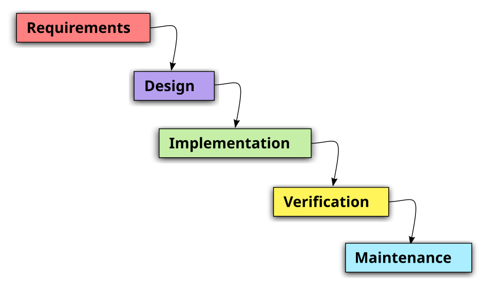
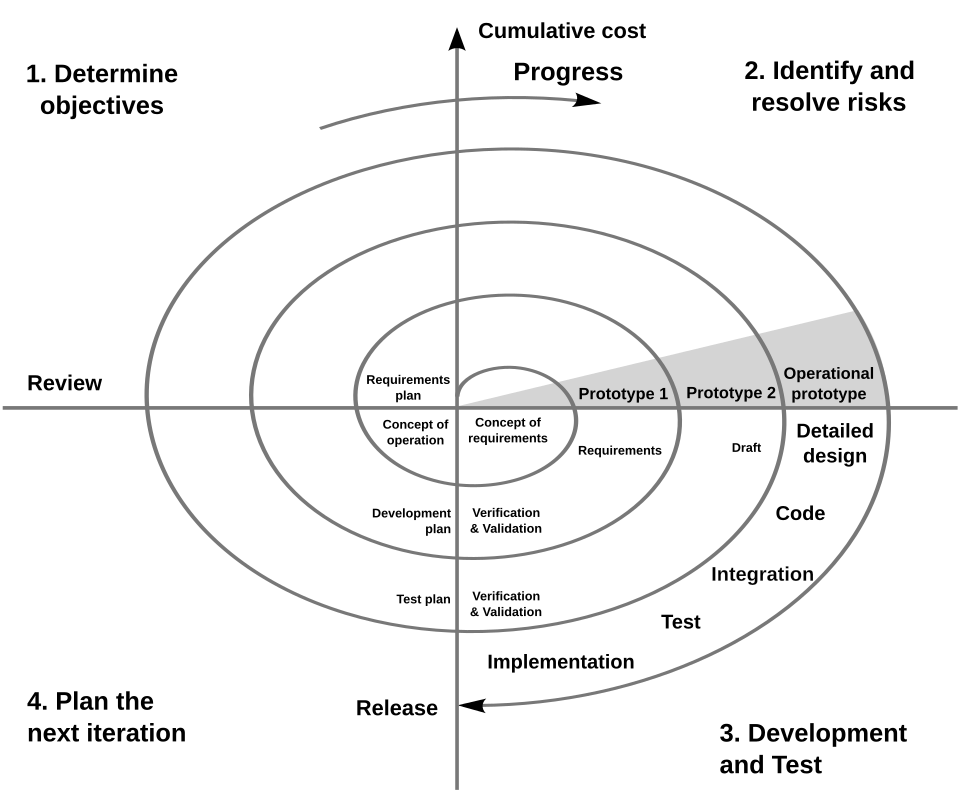
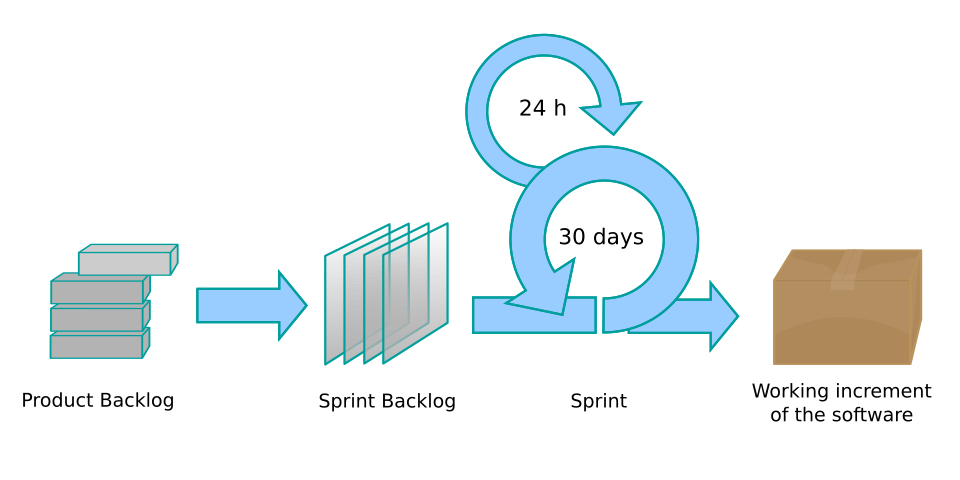

# 系統分析與設計導論

## 系統分析與設計（IE226）115-1

授課教師：呂卓勲

---

## 為什麼工管系要學這個

一套資訊系統真正失敗的原因，很少是程式寫得不好，而是沒有人搞清楚這套系統到底該做什麼。

工廠花兩百萬導入生產管理系統，上線半年後作業員還在用紙本工單、生產管理員還在用 Excel。程式碼一行都沒錯，但沒有人用。

問題出在導入之前沒有人真正弄懂現場怎麼運作、誰在什麼時候需要什麼資訊。

---

## 弄清楚現場，是誰的工作

系統分析與設計這件事傳統上被當成程式設計師或資訊系統工程師的工作。但工程師不見得是最了解實際流程與工作現場的人。

懂現場流程、看得懂生產排程、知道品管為什麼要留那一欄簽名的人，是工業工程背景的你。

> **這門課要練的，就是把你已經懂的現場，翻譯成資訊人員做得出來的規格。**

---

# 一、什麼是系統

系統這個詞每天都在用，但要說清楚一台車、一條產線、一間工廠各自是什麼系統，需要一組固定的拆法。

本節建立三個最基本的語彙：系統由哪四個要素構成、邊界劃在哪裡、大系統怎麼拆成小系統。後面每一章都會用到。

---

## 系統的四個要素

> **系統是一群互相關聯的元素，為了共同的目標而運作。**

| 要素 | 汽車 | 沖壓生產線 |
|---|---|---|
| 輸入（Input） | 汽油、踩油門 | 鋼捲、工單、模具 |
| 處理（Process） | 引擎燃燒、變速箱傳動 | 開卷、沖壓、檢驗 |
| 輸出（Output） | 車子前進、廢氣 | 沖壓件、廢料、生產紀錄 |
| 回饋（Feedback） | 時速表顯示超速，放掉油門 | 不良率偏高時停線調模 |

---

## 最容易被忽略的是回饋

> **沒有回饋的系統只能一直做同樣的事，做錯了也不知道。**

工廠裡每一道品管檢驗、每一張日報表，本質上都是回饋機制——它們不生產任何東西，存在的目的是讓前面的處理能夠修正。

一套只能輸入資料、不能產出有用報表的系統，等於把回饋這一環拿掉了。

---

## 邊界與環境

- **邊界（Boundary）**：哪些東西算在系統裡面
- **環境（Environment）**：邊界之外、但會與系統互動的部分

邊界是人為劃定的責任範圍，沒有標準規定一定要怎麼劃。

---

## 同一台車，三種畫法

- 只算引擎：油箱、變速箱、駕駛都是環境
- 算到整台車：駕駛與路況是環境
- 算到一趟通勤：加油站、導航都算進來

三種畫法都對，就看你要討論的問題是什麼。

---

## 同一條產線，三種畫法

- 只算沖床本身：模具、鋼捲、操作員都是環境
- 算到整個沖壓課：排程、品管、物料都在界內
- 算到整廠：連 ERP 下單與出貨都算進來

> **邊界劃在哪裡，決定了你要負責什麼、可以改什麼。**

---

## 兩份報告的差別就在邊界

- **期中**：邊界已經設定好，你要說明既有系統的邊界，以及環境中有哪些物件跟它互動
- **期末**：只給你一個題目，邊界劃在哪裡由你決定

---

## 子系統

大系統由小系統組成，小系統還能再往下拆。

- 汽車：引擎、制動、空調、避震；引擎再拆成供油、點火、冷卻
- 工廠：生產、品管、物料；生產再拆成排程、派工、報工

好處是可以分開處理：換一組避震器不必動到引擎。這個想法後面會以「模組」的形式再出現。

---

## 系統無所不在

> **系統這個概念不是資訊系統專用的。**

汽車是系統、工廠是系統、一條生產線也是系統，身邊多數東西都可以用輸入、處理、輸出、回饋四個要素拆開來看。

其中專門處理數位資料的那一種，就是接下來要談的資訊系統。

---

# 二、什麼是資訊系統

工廠沒有資訊系統也照樣能生產，那為什麼還要花錢建一套？

本節先回答這個問題，再區分兩個最容易混用的詞：資料與資訊。這個區分決定了一套系統對使用者有沒有用。

---

## 沒有資訊系統也能生產

工單用紙本開、產量記在白板上、不良品數字寫在班長的筆記本裡，東西一樣做得出來。

差別不在生產，在資料：

- 紙本只有現場那一份，別人看不到，也沒辦法即時更新
- 要湊成看得懂的狀況得靠人工整理
- 整理過程還容易遺失或抄錯

---

## 資訊系統的用處

> **把生產過程產生的資料即時收下來，整理成看得懂的資訊，送到需要的人手上。**

今天做了幾件、哪一批不良率偏高、哪張工單還沒完工，主管不必等到月底彙整，也不必跑到現場問人。

---

## 資訊系統就像儀表板

引擎讓車子跑起來，儀表板不推動車子前進，卻是駕駛決定踩油門還是靠邊停的依據。

但儀表板有沒有用，要看它能不能把機械的原始行為轉成駕駛看得懂的東西：感測器每秒量到的數字沒有人看得懂，一根指針、一盞警示燈才有用。

> **記錄下來的事實與看得懂的狀況，是兩件事。**

---

## 資料不等於資訊

- **資料（Data）**：未經處理的原始紀錄
- **資訊（Information）**：經過整理、對決策有幫助的資料

報工系統一個月累積六千筆紀錄，那是資料。依機台算出稼動率、標出經常超出標準工時的工單，才是資訊——生產管理員看了知道明天排程該怎麼調。

---

## 只做到一半的系統

現場每天掃碼、填表單，卻從來沒從系統得到任何對自己有用的東西。

- 輸入的人得不到好處，資料品質就會崩壞
- 亂填、事後補填一週、整批填同一個值
- 彙總出來的數字全部失真，主管不敢用、現場更不想填

這是導入失敗最常見的起點，也就是把回饋那一環拿掉了。

---

## 資訊系統的五個組成

| 組成 | 沒做好會怎樣 |
|---|---|
| 人 | 沒人會用、沒人維護 |
| 流程 | 系統與實際作業脫節 |
| 資料 | 資料錯誤或不完整 |
| 軟體 | 功能不足或不穩定 |
| 硬體 | 現場根本用不了 |

> **軟體只是其中一項，人、流程、資料正好是工業工程的專長。**

---

## 工廠裡常見的資訊系統

| 系統 | 主要負責 |
|---|---|
| ERP（企業資源規劃） | 訂單、採購、庫存、財務、成本 |
| MES（製造執行系統） | 工單派工、現場報工、生產進度 |
| WMS（倉儲管理系統） | 入庫、儲位、揀貨、出庫 |
| QMS（品質管理系統） | 檢驗紀錄、不良分析、矯正措施 |

> **它們之間的介接，往往比每一套系統本身更容易出問題。**

---

# 三、系統分析與設計在做什麼

想把資料轉成有用的資訊，得先知道現場實際怎麼運作、誰在什麼時候要做什麼決定、他要看到什麼才做得了那個決定。

這些答案坐在辦公室想不出來。本節說明這份工作的內容、它與寫程式的差別，以及為什麼工管背景的人適合做。

---

## 難的地方不是技術

同一件事，老闆、經理、組長、生產管理員與廠長講出來的版本經常不一樣，各自想看的資訊也不同，有時候還互相衝突。

把這些說法問出來、對起來，整理成資訊人員做得出來的規格，就是系統分析與設計要做的事。

> **它發生在寫程式之前。**

---

## 分析與設計的分界

| | 分析 | 設計 |
|---|---|---|
| 核心問題 | 做什麼 | 怎麼做 |
| 關心的對象 | 使用者、流程、需求 | 架構、資料表、畫面 |
| 說得懂的人 | 現場人員也看得懂 | 需要技術背景 |
| 本課程 | 期中報告 | 期末報告 |

實務上兩者不會切得太清楚：分析到後期一定會開始想設計，設計途中也可能發現需求沒問清楚。

---

## 文件上一定要分開寫

- **需求**：系統要有一張報表，讓生產管理員看到各機台稼動率
- **設計**：用 Chart.js 畫長條圖，資料從 `report_daily` 表撈出來

兩句寫在一起，客戶讀到的是一堆技術名詞，沒辦法確認你有沒有聽懂他要的東西。

---

## 系統分析師的日常

> **站在使用者與開發人員中間，把前者說得出口的期待，翻譯成後者做得出來的規格。**

- 找出誰會用這套系統，訪談他們、觀察他們實際怎麼工作
- 把發現整理成需求文件，畫圖讓各方確認
- 客戶追加要求時，判斷該不該接
- 開發人員問「這裡沒寫清楚」時，給出答案

---

## 系統分析師與程式設計師

| | 系統分析師 | 程式設計師 |
|---|---|---|
| 對話對象 | 使用者、各部門 | 電腦、開發人員 |
| 主要產出 | 需求文件、流程圖 | 可執行的程式 |
| 犯錯的代價 | 專案做錯方向 | 一個功能有 bug |
| 最需要的能力 | 聽懂、問對問題 | 邏輯、演算法 |

---

## 為什麼這是工管系的事

資訊系統的五個組成裡，人、流程、資料這三項不歸資訊人員管。

工管系的訓練——生產排程、品質管理、作業研究、工作研究——處理的正是這三件事。

---

## 沒有這張執照

「系統分析師」聽起來像醫師、會計師那樣的專業證照工作，實際上不是。

在台灣你甚至很難找到一個只做系統分析的職缺：多半被歸在資訊工程師的工作範圍裡，或由某個領域的工程師兼著做。

> **這門課練的不是一個職位，是一種在很多職位上都用得到的能力。**

---

## 兩種人在做系統分析

實務上有兩種人在做系統分析：

- **資訊背景轉過來的**：懂技術，但要花很久才摸熟現場
- **領域背景轉過來的**：懂現場，缺的是技術語彙

你不需要很會寫程式，但你要看得懂一張資料表的結構、講得出一個功能的輸入與輸出、畫得出一張流程圖。

---

# 四、系統開發生命週期

怎麼設計與開發一套系統，是從電腦被拿來處理人類的資訊時就存在的老問題。

Royce 在 1970 年發表的論文把開發劃分成依序推進的階段，這種切法才成為業界共用的框架。本節說明這些階段，以及這門課落在哪兩段。

---

## SDLC 的五個階段

| 階段 | 在做什麼 | 主要產出 |
|---|---|---|
| 規劃 | 值不值得做 | 專案章程、可行性評估 |
| 分析 | 系統要做什麼 | 需求規格、流程圖、使用案例 |
| 設計 | 系統怎麼做到 | 架構圖、資料庫設計、介面設計 |
| 實作 | 寫程式、上線、訓練 | 可運作的系統、測試報告 |
| 維護 | 修錯、增補功能 | 修改紀錄、版本 |

---

## 維護階段遠比其他四個長

開發本身可能只花半年，但上線之後的修正、調整與增加功能會延續五年、十年。

> **文件寫得清不清楚，決定了三年後接手的人看不看得懂這套系統當初為什麼要這樣做。**

---

## 實務上階段會混在一起

這五個階段看起來一步一步往前走、界線分明，實務上卻經常混在一起。

- 分析還沒做完就開始設計
- 系統上線之後又不斷補新功能，實作與維護分不開

做這些事的是人，需求會變、人也會換，這正是資訊系統開發最難的地方。

---

## 對照這門課

`規劃 → 分析 → 設計 → 實作 → 維護`

- **期中報告** 對應分析：拿一套已經存在的系統，反推它的分析文件
- **期末報告** 對應設計：拿一個新問題，正向做出設計方案

兩者用的是同一套方法，只是走的方向相反。

規劃階段的可行性評估期中不做（分析對象已經存在），期末才需要；實作與維護不在本課程範圍內。

---

# 五、開發方法論

同樣是那五個階段，怎麼安排它們的順序與節奏，有不同的做法。

本節介紹三類主流做法，以及選擇的判準。判準只有一個，記住它比記住名詞有用。

---

## 瀑布模型

**把五個階段排成一條直線，每個階段完成、文件簽核之後才進入下一階段。**

- 適合：需求明確、法規或合約要求階段簽核
- 問題：要到很後面才看得到成品

Royce 當年其實是把純線性的做法當作有問題的示範提出來的，後人只記得那張圖。

---

## 瀑布模型的五個階段

---

## 疊代、增量與原型法

不要一次做完，先做一小塊完整可用的，讓使用者看到、給回饋，再做下一塊。

- **螺旋模型**：每一圈都加入風險評估
- **原型法**：先做看得到、點得動但沒有真實功能的雛型

> **對現場使用者而言，看雛型比讀文件有效得多。**

---

## 螺旋模型

---

## 敏捷方法

2001 年敏捷宣言的四項主張：重視個人與互動、可用的軟體、與客戶協作、回應變化。

Scrum 把開發切成兩到四週一輪的衝刺，每輪結束都要交出可用的成果。

> **敏捷不是不寫文件，而是不寫沒人看的文件。**

---

## Scrum 的流程

---

## 怎麼選

| 專案特性 | 適合的方法 |
|---|---|
| 需求明確、需要階段簽核 | 瀑布 |
| 需求不確定、風險高 | 疊代、螺旋 |
| 使用者說不清楚要什麼 | 原型法 |
| 需求會持續演進 | 敏捷 |

> **判準只有一個：這個專案的需求有多不確定。**

---

# 六、專案角色與分工

一個系統專案不是只有寫程式的人。知道有哪些角色，你才知道自己站在哪個位置、該對誰說話。

本節也說明各組做報告時可以怎麼分工。

---

## 一個系統專案有哪些人

| 角色 | 負責什麼 |
|---|---|
| 專案經理（PM） | 時程、預算、人力、對外溝通 |
| 系統分析師（SA） | 需求釐清、分析文件 |
| 系統設計師（SD） | 架構、資料庫、模組設計 |
| 程式設計師 | 寫程式、單元測試 |
| 測試人員 | 驗證系統符合需求 |
| 使用者代表 | 提供現場知識、參與驗收 |

---

## 使用者代表最常被跳過

他們如果沒有真的參與，前面五個角色做得再好，做出來的東西也不會是現場要的。

工管背景的人最常落在三個位置：**系統分析師、使用者代表，以及驗收與導入的負責人**。

共同點是需要同時聽懂兩邊：現場的抱怨與資訊人員的術語。

---

## 導入後的流程調整

系統上線不是終點：現場的作業標準要跟著改、人員要訓練、舊的紙本表單要停用。

> **這些不是資訊人員的工作，是懂流程的人的工作。**

---

## 各組報告的分工

- 誰負責訪談與需求整理
- 誰負責畫圖
- 誰負責資料設計
- 誰負責整合文件與檢查一致性

> **建議至少指定一個人專門負責一致性檢查。**

最常失分的地方是各項互相矛盾：使用案例上有的角色，流程圖上沒有。

---

# 七、系統為什麼會失敗

三種最常見的失敗都發生在寫程式之前，也都能在分析階段用方法避免。

本節先講一個數字，那個數字是整門課的存在理由。

---

## 錯誤發現得越晚，代價越高

| 發現階段 | 相對成本 |
|---|---|
| 分析 | 1 |
| 設計 | 5 |
| 實作 | 10 |
| 測試 | 20 |
| 上線後 | 50 以上 |

Boehm 在 1981 年整理多個專案資料後提出這個關係，後續研究對倍數有爭議，但趨勢一致。

---

## 為什麼差距這麼大

分析階段發現需求寫錯，改一句話。

上線後才發現，要改程式、改資料庫、把已經存進去的錯誤資料清乾淨、重新訓練使用者，還要承受停機的損失。

> **分析階段多花的每一小時，都是在買後面幾十小時的保險。**

---

## 三種常見的失敗

- **需求搞錯**：只訪談了主管，沒問過實際操作的人
- **流程沒摸清楚**：現場實際做法跟標準書不一樣，那些私下的變通沒被寫進去
- **跨部門沒談攏**：分析階段沒有把所有利害關係人找齊

---

## 這門課要練的事

回到開頭那個問題：不寫程式的人學這個做什麼？

> **你要練的不是做出系統，而是說清楚系統該做什麼，並且說到別人做得出來、做完之後真的有人用。**

這件事在任何產業、任何規模的專案裡都需要，而且不會因為工具或程式語言改朝換代而失效。

---

## 本章重點回顧

- 系統的價值有一半在回饋，只收資料不產出資訊等於拿掉回饋
- 資訊系統不只是軟體，人、流程、資料是工管的守備範圍
- 分析回答做什麼，設計回答怎麼做
- 邊界劃在哪裡，責任就到哪裡
- 方法論的選擇取決於需求有多不確定
- 錯誤發現得越晚，代價越高
