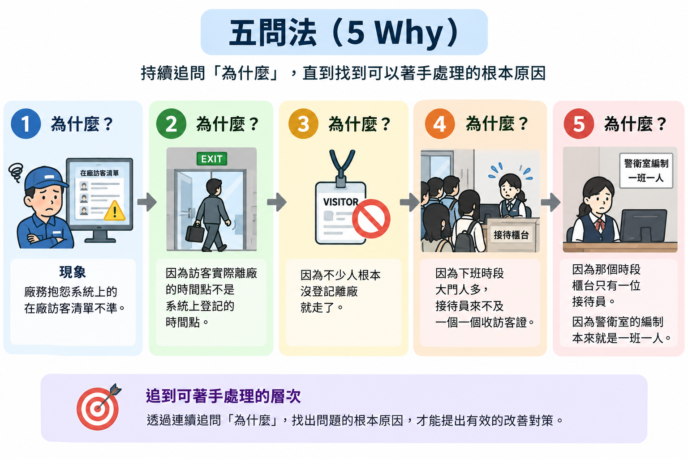
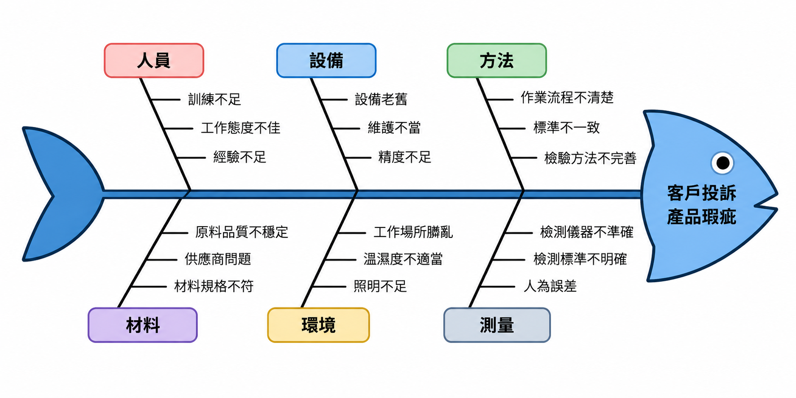

# 問題定義與現況分析

分析一套既有系統時，最容易的起手式是打開系統、把每個選單點過一遍，然後照著畫面順序寫成報告。

系統上的每一個功能、每一個欄位、每一道審核關卡，當初都是為了解決某個問題才被加上去的。看不出那個問題，你就只是在幫使用手冊換句話說；看得出來，你才有資格判斷哪些設計是合理的、哪些其實已經沒有存在的必要。

本章處理期中報告的第一項與最後一項——**問題與系統背景**、**現況問題與改善建議**。這兩項一頭一尾，但其實是同一條邏輯的兩端：開頭問「當初要解決什麼問題」，結尾答「解決得如何、還剩什麼沒解決」。中間各章的分析，都是為了讓結尾那個答案有憑有據。

也因為這樣，**本章的後半要等其他分析全部做完才寫得出來**。第六、七節請留到最後。第五節之前的問題定義與現況說明雖然可以在專案初期動筆，實際上也會跟著後面的分析不斷修改：使用者、流程與需求分析做下去，可能會發現當初的問題抓偏了或漏掉一段。因此一開始寫不出來也沒關係，可以先放著，等其他分析有了眉目再回頭補。

> **前情提要**：本章假設你已讀過[「系統分析與設計導論」](01-Systems-and-Analysis.md)，特別是〈三〉分析與設計的分界，以及〈七〉系統為什麼會失敗。本章的例子以課堂範例系統 `SAD-Forum`（論壇系統）與它的[「系統分析範例報告」](../02-Midterm-Project-Example-Reports/Analysis-Phase-Sample-Report.md)為主；範例報告沒有對應內容的部分——〈二、2.3〉與〈四〉的目標和成功指標、〈三〉需要現場量測數字的 5 Why 與問題陳述——沿用上一章的工廠訪客進出登記系統。

> **延伸閱讀**：本章不做可行性評估。期中的分析對象已經存在，不必再證明它做不做得出來；技術、經濟、組織與時程可行性屬於期末新系統設計的範圍。

> **必讀標記**：標題後加註 🔴 期中必讀 的小節，是期中小組報告九項產出直接會用到的內容；加註 🔵 期末必讀 的，是期末八項產出直接會用到的。判準與成品的樣子，期中見[「系統分析範例報告說明」](../02-Midterm-Project-Example-Reports/Analysis-Phase-Deliverables.md)與[「系統分析範例報告」](../02-Midterm-Project-Example-Reports/Analysis-Phase-Sample-Report.md)，期末見[「系統設計範例報告說明」](../04-Final-Project-Example-Reports/Design-Phase-Deliverables.md)與[「系統設計範例報告」](../04-Final-Project-Example-Reports/Design-Phase-Sample-Report.md)。未標記的小節仍屬課程範圍，只是報告不會直接產出。

## 一、問題定義要回答什麼 🔴 期中必讀 🔵 期末必讀

建置一套資訊系統是解決管理或實務工作上問題的手段，所以分析要從問題開始。多數系統分析報告的開頭只交代這套系統是做什麼的，例如「本系統是一個讓會員發文與回覆的論壇」，但這只是功能介紹。更該說清楚的是它解決了什麼問題：沒有這套系統之前，哪件事做不好、誰因此多花時間或出錯。答得出這一點，才說得出這套系統存在的理由。

報告一開始當然要交代這是什麼系統，例如[「系統分析範例報告」](../02-Midterm-Project-Example-Reports/Analysis-Phase-Sample-Report.md)〈1.1 系統概述〉與〈1.2 現況說明〉；但一份好的系統分析報告，更重要的是定義出這套系統解決了什麼問題。

現況分析最重要的產出就是問題定義，因為問題不會憑空存在，它是**現況與期望之間的落差**。只說「帳號管理很亂」看不出問題在哪；要寫出管理員目前怎麼停用帳號、停用之後當事人還能做什麼、出事時查不查得到是誰停用的，落差才看得見。**描述現況的過程就是在找問題，說不出現況哪一段出錯，就等於還沒定義出問題。** 這也是本章把問題定義與現況分析放在同一章的原因。

問題定義也決定了後面的分析往哪裡走。問題沒講清楚，後面每個判斷都沒有依據：需求從哪裡來、功能該不該做、做完算不算成功，都要回頭對照問題才答得出來。問題確認了，分析才有方向：受問題影響的人，是要找的重要使用者與利害關係人；問題發生的那段作業，是要看的流程；解決問題需要系統做到的事，是要確認的需求。這幾件事分別在[「使用者分析」](03-User-Analysis.md)與[「系統需求分析」](04-System-Requirements-Analysis.md)展開。

### 1.1 四件事 🔴 期中必讀 🔵 期末必讀

一份問題定義要交代四件事，缺一不可：

| 要交代的 | 回答的問題 | 白話文 |
|---|---|---|
| 現況 | 目前這件事是怎麼運作的 | 現在大家是怎麼做的？現有的流程是甚麼？ |
| 問題 | 現況哪裡不夠好、造成什麼損失 | 哪裡容易卡住、誰會在哪個流程中容易出包、缺了甚麼東西？ |
| 目標 | 導入系統後要達成什麼 | 做完之後要變成什麼樣子？ |
| 範圍 | 這套系統負責到哪裡 | 哪些事歸它管、哪些不是？ |

四件事之間有嚴格的因果：**沒有現況就看不出問題，沒有問題就推不出目標，沒有目標就界定不了範圍。** 學生報告最常見的斷點在第二格——直接寫「本系統可以提升生產效率」，但從來沒說現況的效率為什麼不好、不好在哪一段。

### 1.2 期中的特殊處境：要反推 🔴 期中必讀

一般的專案是先有問題、才有系統。期中報告的處境相反：**系統已經在那裡了，你要從它回推當初的問題。**

這件事並不玄。系統的每一項設計都留下了線索：

| 系統上看到的 | 可以推出的問題 |
|---|---|
| 登入要輸入圖形驗證碼，申請帳號卻不用 | 曾被自動化程式大量嘗試登入，但註冊沒有遇到同樣的壓力 |
| 帳號有「停用」這個狀態，而不是只有刪除 | 需要暫時擋住某個人但保留紀錄，例如爭議尚未查清的期間 |
| 刪除帳號只把旗標設為 1，紀錄仍留在資料庫 | 事後要查得到這個帳號做過什麼 |
| 論壇文章的刪除權收給管理員，作者自己不能刪 | 有人刪掉自己的文章，導致底下所有人的回覆一起消失 |

**每個功能背後都有一個它要處理的問題。** 一個系統會為某件事特別做一個功能、加一道關卡、留一份紀錄，通常是因為那件事真的出過問題。反推的方法就是逐項問：這個設計是在防止什麼、補救什麼、或方便誰？

**系統要解決的問題不一定都很小。** 上表每一列都只對應單一設計，但整套系統本身也在回答一個更大的問題：它為什麼要存在。以論壇系統為例，論壇是系統的主體，帳號與管理功能都在支撐它；訪客不必登入就能瀏覽，回覆集中在所屬文章底下。這些線索合起來指向的是「一群人需要一個公開、依主題集中的地方彼此分享資訊」。這種問題不會對應到某一個按鈕，但上表那些細節問題，都是為了讓這個需求能持續運作才衍生出來的。

因此反推時先問整體，再逐項看細節。只列細節的話，報告讀起來會像一堆零散的防護設計，看不出這套系統到底在服務什麼需求。

總結來說，把每一項功能、關卡與紀錄背後可能的問題逐一整理出來，就能清楚看出整套資訊系統的各項功能分別在解決什麼問題。

### 1.3 推不出來的部分要說清楚 🔴 期中必讀

有些設計確實推不出理由，可能是舊系統（Legacy System）遺留下來的，可能是當初某位主管的要求，也可能連設計者自己都忘了。

**期中報告遇到推不出來的設計，就直接寫推不出來，並說明需要什麼資訊才能確認。** 例如：「`users.role` 只有 0 與 1 兩個值，看不出當初是否規劃過第三種角色（例如助理管理員），需查閱開發紀錄或訪談維護者才能確認。」

這樣寫比硬掰一個理由更有價值，訪談被追問時也答得出來。分析報告的可信度，來自你分得清「我查到的」和「我推測的」，而不是把每一格都填滿。老師並不期望你找出所有大小問題，畢竟也沒有一套資訊系統能解決所有問題。

## 二、從既有系統反推問題與目標 🔴 期中必讀

### 2.1 三個切入點 🔴 期中必讀

反推不必憑空想像，有三個地方可以找線索。

**看功能。** 前一節的做法：逐項問這個功能在防止什麼、補救什麼。特別注意那些「看起來多餘」的功能，它們可能是更關鍵的實務問題。

**看資料。** 系統留下哪些欄位，反映當初認為哪些事情重要。例如 `users` 表同時留了 `is_active` 與 `is_deleted` 兩個旗標，代表「暫時停用」與「刪除」被當成兩件不同的事處理，而且刪除之後仍需要留下紀錄釐清責任。

**看限制。** 系統擋住的操作，比允許的操作更能說明問題。管理員不能停用自己、不能刪除自己、不能改自己的角色，一般會員不能刪除自己的文章……每一條限制背後都可能是實際工作上的條件或規定。

### 2.2 對照現場，不要只看系統

系統反映的是「當初想解決的問題」，不一定是「現在實際的問題」。兩者的落差往往就是報告最後改善建議的來源。

以論壇系統為例，管理員可以刪除任何文章與回覆，只看系統會以為「不當內容」這件事已經處理了。但對照實際使用情境，誰來發現不當內容、用什麼管道通報、什麼算不當，全都在系統之外；而被討論到的第三人不是會員，連要求處理的管道都沒有。這中間的落差說明：系統只處理了「刪除」這最後一步，前面的發現、通報與判斷都還靠人工，甚至沒有人負責。

**只讀系統會漏掉這一層。** 期中報告的分析對象雖然是系統，但問題定義要對照的是真實的使用情境。

實際到現場觀察，得到的問題定義最準確。本課程期中與期末報告的題目都是模擬情境，沒有真實現場，因此現場的使用情況可以自行假設，或找類似場域的資料作為參考。但要記得，再精密的假設、再完整的書面資料，都比不上親自到現場走一趟、親自和相關人員談一談。

### 2.3 從問題推回目標

問題找到之後，目標就是問題的反面——但要寫得比「解決那個問題」更具體。

| 現況與問題 | 推出的目標 |
|---|---|
| 訪客到了才臨時找受訪人，門口平均等十分鐘 | 訪客抵達之前，受訪人已經確認過這次來訪 |
| 紙本登記簿攤在櫃台，前一位訪客的個資下一位看得到 | 訪客個資只有經手的接待員看得到 |
| 訪客證發出去沒收回，月底盤點才發現少三張 | 任一張訪客證在任何時點都查得到在誰身上 |

這三個目標都能對應到後面的功能需求，也都能在系統上線後拿來驗收。這就是下一節要處理的事。

## 三、把抱怨變成問題陳述 🔴 期中必讀 🔵 期末必讀

期中與期末報告沒有真實的使用者，你聽不到有人抱怨。這時可以試著想像自己是系統的使用者，會在哪裡卡住、對什麼不滿；想不出來或不確定時，也可以直接問老師。

### 3.1 症狀不是問題

訪談時聽到的多半是症狀：「系統很難用」「資料常常對不起來」「每次月底都在加班」。這些都不是問題陳述，因為它們指不出要改什麼。

症狀與問題的差別在於：**症狀是被感受到的現象，問題是造成現象的機制。** 「管理員停了帳號，對方好像還能改資料」是症狀；「停用只擋住重新登入，沒有擋住已經建立的登入狀態」是問題。前者無法著手，後者可以。

### 3.2 用 5 Why 往下追

[五問法](https://zh.wikipedia.org/wiki/五问法)（5 Why）是工管學生熟悉的工具：對一個現象連續追問「為什麼」，直到追到可以著手處理的層次為止。

用在資訊系統上的例子：

*圖片來源：ChatGPT 生成，由作者審閱其正確性*

追到第五層，問題的性質就變了：這不是系統功能不足，是人力編制不足。**寫成「系統應該增加離廠提醒功能」會完全解決不了問題**，因為癥結不在軟體。

「五」不是硬性規定，追到能著手處理就停。但至少要追到第二層——停在第一層通常還是症狀。

### 3.3 用魚骨圖擴大範圍

5 Why 是往下深挖一條線，有個找出問題真實癥結點的方法叫做 [石川圖](https://zh.wikipedia.org/wiki/石川圖)（Ishikawa Diagram，當初發明這個方法的是一位日本學者與工程師石川馨，因此叫石川圖，又稱魚骨圖或特性要因圖）則是往旁邊擴大，避免只盯著一個方向。

*圖片來源：ChatGPT 生成，由作者審閱其正確性*

製造業慣用的 4M（人、機、料、法）在資訊系統情境要換一組分類：

| 分類 | 這一類的問題長什麼樣 |
|---|---|
| 人 | 不會用、不想用、沒受訓、離職帶走了經驗 |
| 流程 | 作業標準與系統設計不符、有繞道的做法 |
| 資料 | 欄位定義不清、來源不一致、沒人維護基本資料 |
| 系統 | 功能不足、效能差、當機、介面難用 |
| 環境 | 硬體不足、網路不穩、現場條件不允許 |

這五類正好對應[「系統分析與設計導論」](01-Systems-and-Analysis.md)〈二、2.2〉資訊系統的五個組成。用這張表逐類盤點，可以避免報告裡的問題全部集中在「系統功能不足」——那通常代表分析只做了一層。

### 3.4 寫成可以被檢驗的問題陳述 🔴 期中必讀 🔵 期末必讀

一條合格的問題陳述要包含三件事：**誰受影響、發生什麼、造成什麼後果**，而且後果最好帶數字。

> ❌ 訪客進出紀錄不準確。
>
> ✅ 訪客多在離廠時未經櫃台登記即離開，導致系統上的在廠清單與實際人數每日相差五到八人；消防演練時廠務無法確認廠內尚有哪些外部人員，點名作業平均延誤十五分鐘。

第二種寫法的好處是：它自己就指出了要量什麼（時間差距、決策延遲），因此改善之後可以驗證。它也讓讀者看得出這個問題值不值得處理。

反推出來的問題陳述會比上例抽象一些，因為你手上沒有現場的量測數字，只有系統留下的設計痕跡。這種情況下數字可以省，但 **「誰受影響」與「造成什麼後果」兩件事仍然要寫**：

> ✅ 帳號與其行為的關聯若隨帳號一起消失，事後就無從追究責任；但若因此不能刪除帳號，又處理不了離職或違規的使用者。

這條沒有數字，卻仍然可被檢驗——它指出了一組互相牽制的需求，你可以回頭去看系統實際上怎麼處理這個矛盾（答案是軟刪除），也看得出它處理得夠不夠。

**沒有數字時，至少寫出頻率與範圍**：一週發生幾次、影響幾個人、涉及多少筆資料。期中分析既有系統時不見得拿得到精確數據，但「每天都發生」與「一季一次」對應的處理優先順序完全不同。

## 四、目標要能驗收 🔵 期末必讀

### 4.1 不能驗收的目標等於沒寫

「提升效率」「加強管理」「優化流程」——這類目標在報告裡出現，等於什麼都沒說，因為沒有任何方法能判斷它達成了沒有。

判準很簡單：**系統上線半年後，有沒有辦法拿出證據說這個目標達成了？** 答不出來就要重寫。

| ❌ 無法驗收 | ✅ 可以驗收 |
|---|---|
| 提升報到效率 | 單次報到的櫃台作業時間從 3 分鐘降到 60 秒以內 |
| 加強訪客管理 | 任一位在廠訪客在任何時點都查得到是誰、來找誰、拿哪一張訪客證 |
| 減少人工作業 | 訪客月報由系統自動產生，取消每月 2 小時的人工彙總 |
| 提高資料正確性 | 每日結束時仍顯示在廠、實際卻已離開的紀錄從每日約 6 筆降到 1 筆以下 |

### 4.2 SMART 與成功指標 🔵 期末必讀

[SMART 原則](https://zh.wikipedia.org/wiki/SMART原则)是常見的檢查表：具體（Specific）、可衡量（Measurable）、可達成（Achievable）、相關（Relevant）、有時限（Time-bound）。這五項裡，學生最常漏的是可衡量與有時限。

實務上會為每個目標配一到兩個 **成功指標**，並寫下現況值與目標值：

| 目標 | 指標 | 現況 | 目標 |
|---|---|---|---|
| 在廠訪客即時可見 | 登記的離廠時間與實際離廠時間的平均差距 | 約 4 小時 | 30 分鐘內 |
| 減少事後補登 | 每日需事後補登離廠的筆數 | 每日約 6 筆 | 1 筆以下 |
| 提高訪客證可追溯性 | 月底盤點時去向不明的訪客證張數 | 每季約 3 張 | 0 張 |

「現況」那一欄是關鍵，也是最常空白的一欄。**沒有現況值，就沒有改善幅度可言**——這一點在工管的改善案裡是常識，寫資訊系統報告時同樣適用。期中分析既有系統時若量不到現況值，就寫明「無法取得，需要什麼資料才能量」。

### 4.3 目標不要多

三到五個就夠了。目標列到十幾條，通常代表沒有排優先順序，而每一條都寫進報告卻沒有一條講得清楚。

挑選的判準是回到第三節的問題陳述：**哪幾個問題造成的損失最大，就針對那幾個訂目標。** 這也呼應[帕累托法則](https://zh.wikipedia.org/wiki/帕累托法则)——少數幾項問題往往佔了大部分的損失。

## 五、問題定義書怎麼寫 🔴 期中必讀 🔵 期末必讀

### 5.1 內容架構 🔴 期中必讀

問題定義書是期中報告第一項的產出，建議的結構：

| 段落 | 內容 |
|---|---|
| 系統概述 | 這是什麼系統、誰在用、在什麼場域運作 |
| 現況說明 | 目前這件事怎麼進行，包含系統與人工的部分 |
| 問題陳述 | 三到五條，每條寫明誰受影響、發生什麼、後果 |
| 系統做了哪些、哪些仍靠人工 | 兩欄對照，逐項列出 |
| 目標與成功指標 | 對應問題，每項附指標與現況值。**期中不必寫**，見下方說明 |
| 分析範圍 | 這次分析涵蓋哪些、不涵蓋哪些 |
| 判斷依據 | 上述推論是從系統的哪些地方看出來的 |

最後一項是期中報告特有的。因為你的問題與目標是反推出來的，**要說明推論的依據**：從哪個功能、哪張表、哪個限制看出來的。這一欄讓讀者能判斷你的推論可不可信，也是訪談時最容易被追問的地方。寫成兩欄的對照表即可，左欄是你下的判斷，右欄是憑什麼。

這個結構不是固定格式，不必完全照這樣寫，內容也不限於這幾項。重點是讓利害關係人或開發人員讀完之後，能很快掌握這套系統的基本概要。

「目標與成功指標」那一列期中不必寫。訂目標是替一個還沒做的系統設定驗收標準，而期中的系統已經上線好幾年了——當初的目標是什麼，你只能猜；現在再訂一個，也沒有人會拿它驗收。這一列留到期末重新設計時再處理。

「系統做了哪些、哪些仍靠人工」那一列則是期中特別重要的一段，因為右欄那些「沒有這個功能」「只能請管理員處理」的格子，正是報告第九項改善建議的第一批候選。

這一節先交代問題定義書要放哪些內容；完整寫出來長什麼樣，見[「系統分析範例報告」](../02-Midterm-Project-Example-Reports/Analysis-Phase-Sample-Report.md)〈1. 問題與系統背景〉。

### 5.2 範圍要寫「不做什麼」 🔴 期中必讀 🔵 期末必讀

範圍只寫「本次分析涵蓋五個子系統的全部功能」是不夠的，要補上不涵蓋的部分並說明理由：

> 本次分析不涵蓋：部署與容器設定（屬於維運，不影響使用者的作業方式）、自動化測試的內容（屬於開發過程的產出，非系統對使用者提供的功能）、版面樣式與色彩配置（不涉及功能與資料）。

寫下不做什麼有兩個作用：讓讀者知道你是「確認過不需要」而不是「漏掉了」，以及在有人問「怎麼沒分析某某」時有明確的回答。

> **延伸閱讀**：這裡談的是專案層級的粗略框定。系統邊界的正式判定方法、界外對象的分類與範圍外清單的寫法，見[「功能分析」](05-Functional-Analysis.md)〈二、系統邊界〉。

## 六、分析完成後回頭找問題 🔴 期中必讀

**以下兩節請在其他各項分析全部完成之後再寫。** 它們是期中報告的第九項，也是整份報告最能看出分析深度的地方。

### 6.1 問題要從自己的分析裡長出來 🔴 期中必讀

改善建議最常見的失分形態是：前面八項認真做完，最後一項卻寫出一堆與前面無關的感想——「介面可以更美觀」「希望增加手機版」「建議加入 AI 功能」。這些不是分析的結果，是使用心得。

**合格的問題必須指得出來自哪一份分析。** 前面各章的產出，每一份都會自己浮出問題：

| 分析產出 | 會浮出的問題 |
|---|---|
| 利害關係人清單 | 某個利害關係人完全沒有任何功能對應到他 |
| 使用案例圖與權限範圍 | 某個角色只能看不能改、某項作業完全沒有系統支援 |
| 流程圖（活動圖） | 同一份資料被輸入兩次、審核關卡沒有實質作用、例外情況無人處理 |
| 需求清單 | 有需求卻找不到對應功能、有功能卻對不到任何需求 |
| 功能清單與系統邊界 | 界外那幾條「系統不做」，是不是真的不需要做 |
| ERD 與資料字典 | 欄位沒有值域定義、同一件事存在兩個地方、關聯只存在模型上、資料無人維護 |
| 系統環境圖 | 兩套系統靠人工搬資料、現場沒有可用的終端、資料沒有備份機制 |

逐項回頭掃一次，找出來的每一個問題都指得出證據。這比憑印象列感想有力得多。

**兩份清單特別容易被跳過，卻各自藏著一整組問題。** 一是利害關係人清單：不操作系統的那幾位，去看看他們有沒有對應的功能，沒有的話，那一整組功能就是缺席的。二是系統邊界的界外欄：那幾條「本系統不做」，逐條問一次「真的不需要做嗎、不做的話現在是誰在做」，答不出來的就是問題。

還有一類問題不在任何單一產出上，要 **把兩份產出擺在一起才看得到**。例如權限表寫著「修改個人資料需要登入」，停用流程的完成後狀態寫著「其後無法登入」，兩件事各自都對；但你照著實測一次，可能會發現停用只擋住了重新登入，沒有擋住已經登入的狀態。這種靠交叉比對找出來的問題，價值比單一產出上看得到的高得多。

### 6.2 挑出值得寫的 🔴 期中必讀

找到的問題不必全部寫進報告。用兩個維度排序，挑影響大而且看得出改法的：

| | 影響大 | 影響小 |
|---|---|---|
| **改法明確** | 優先寫，是報告的主體 | 可以一句話帶過 |
| **改法不明** | 值得寫，但要說明還需要什麼資訊 | 不必寫 |

右下角那一格要克制。報告裡塞滿無關痛癢的小問題，會稀釋掉真正重要的那幾條。

找出來的問題與挑選後的結果實際寫成什麼樣子，見[「系統分析範例報告」](../02-Midterm-Project-Example-Reports/Analysis-Phase-Sample-Report.md)〈9.1 從分析中找到的問題〉與〈9.3 影響較小或改法待確認者〉。

## 七、改善建議怎麼提 🔴 期中必讀

### 7.1 三個層次 🔴 期中必讀

改善建議不是只有「系統要加什麼功能」一種。同一個問題，往往在三個層次都有處理的餘地：

| 層次 | 處理什麼 | 例子 |
|---|---|---|
| 流程 | 作業的順序、分工與規則 | 在登入頁標明「忘記密碼請聯絡管理員」，讓使用者知道找誰 |
| 系統 | 功能、資料、介面 | 補上停用後的存取檢查；為管理動作建立紀錄表 |
| 組織 | 權責、訓練、規範 | 明訂管理動作紀錄多久查閱一次、由誰負責；決定是否引入寄信能力 |

**只寫系統層次的報告，分析深度一定不夠。** 前面 5 Why 那個例子就是最好的說明：下班時段櫃台只有一個人這件事，加再多功能也解決不了，要處理的是人力編制，屬於組織層次。

反過來，也不要把所有問題都推給「使用者習慣不好」。那通常代表沒有追問使用者為什麼要那樣做——而現況流程裡看似不合理的動作，往往有沒被說出口的理由。

### 7.2 每條建議要接得回去 🔴 期中必讀

一條合格的改善建議包含四個部分：

> **建議**：短期在登入頁標明「忘記密碼請聯絡管理員」，並於管理員端提供重設密碼功能；長期評估是否導入以電子郵件重設密碼的流程。前者為流程與系統層次，後者牽涉是否引入寄信能力，屬組織層次的決定。
> **針對的問題**：使用者忘記密碼時無路可走，系統無此功能，管理員也沒有重設密碼的介面。
> **依據**：第 5 項功能清單中，身分驗證群組僅有申請帳號、登入、登出與驗證碼四項；會員管理群組的五項操作皆不處理密碼。系統邊界表將「寄送電子郵件」列為界外，因此連自助重設的技術前提都不存在。
> **預期效果**：使用者不再因忘記密碼而失去既有內容；管理員有明確的處理方式。

四個部分中，**「依據」是分數的關鍵**——它證明這條建議來自分析，不是憑空想的。而「預期效果」要說出改善之後「哪個指標或哪個行為會不一樣」，讓整份報告首尾閉合。期中沒有訂目標與成功指標，這裡就寫成質性的描述，例如「管理員停用一個帳號之後，不需要再另外確認對方是否還在線上」——只要說得出改完之後有什麼具體的不同即可。

依據那一欄還有一個層次的差別。上面的例子只用了一份產出，**真正扎實的依據是跨兩三份產出的交叉比對**：

> **依據**：第 2 項的權限範圍顯示「修改個人資料」需要登入；第 3 項的停用流程顯示其完成後狀態為「其後無法登入」。兩者對照後實測發現，停用只擋住了重新登入，沒有擋住已經建立的登入狀態。第 4 項的 FR-11 也只寫了「阻擋未登入者」，沒有涵蓋這種情況。

這種依據之所以有力，是因為它指得出三份文件的具體位置，而且那個問題不是操作系統時直接看得到的——只有把幾份產出擺在一起才浮得出來。訪談時被問「你怎麼發現這個的」，你答得出一條完整的推論路徑。

### 7.3 期中到此為止 🔴 期中必讀

改善建議只要提出合理的方向，**不必也不應該完成新系統設計**。畫出新的架構圖、資料表、畫面原型，那是期末階段的工作；期中把它做了，一來超出範圍，二來在沒有做過可行性評估的情況下提出的設計，多半經不起追問。

期中要證明的是：你看懂了這套系統，也看得出它哪裡還可以更好，而且說得出憑什麼這樣判斷。

改善建議實際寫成什麼樣子，見[「系統分析範例報告」](../02-Midterm-Project-Example-Reports/Analysis-Phase-Sample-Report.md)〈9.2 改善建議〉。

## 八、學習重點總結

讀完本章後，你應該能夠理解以下核心概念，並將其應用於工業場域的思考與決策：

**從功能反推問題**

系統上的每一個功能、每一道審核、每一份紀錄，當初都是為了解決某個問題才存在的。分析既有系統時，逐項問「這個設計在防止什麼、補救什麼、方便誰」，就能反推出當初的問題。看不出這一層，寫出來的報告就只是換句話說的使用手冊。

**症狀不等於問題**

「很難用」「常出錯」「月底加班」都是被感受到的現象，指不出要改什麼。往下追到造成現象的機制，才是可以著手的問題。5 Why 往深處挖一條線，魚骨圖往旁邊擴大範圍，兩者搭配可以避免所有問題都被歸結成「系統功能不足」——那通常代表分析只做了一層。

**沒有現況值就沒有改善幅度**

目標寫成「提升效率」等於沒寫，因為上線半年後沒有人能證明它達成了。可驗收的目標要配成功指標，而指標要有現況值與目標值。這在工管的改善案裡是常識，寫資訊系統報告時同樣適用；量不到現況值的時候，要寫明需要什麼資料才量得到。

**推不出來的部分要誠實標示**

分析報告的可信度來自於分得清「查到的」與「推測的」，而不是每一格都填滿。一個看不出設計理由的欄位，寫「無法判斷，需查閱開發紀錄或訪談維護者確認」比硬掰一個理由更有價值，訪談被追問時也站得住。

**改善建議要接得回分析**

一條建議要說得出針對哪個問題、依據是分析中的哪一份產出、預期能讓哪個指標動到什麼程度。做不到這三點的建議，就只是使用心得。本章後半必須等其他分析全部完成才寫得出來，原因也在這裡——它的材料全部來自前面各項。

**改善不是只有加功能一途**

同一個問題通常在流程、系統、組織三個層次都有下手的餘地，而許多問題根本不在軟體裡：終端不足、沒有教育訓練、基本資料無人維護。只寫系統層次的報告，分析深度必然不足；把問題全部推給使用者習慣，則代表沒有追問他們為什麼那樣做。

> **銜接提示**：本章界定了要解決的問題與範圍，但還沒有回答「這套系統是給誰用的」。下一章[「使用者分析」](03-User-Analysis.md)從人開始：找出利害關係人、了解他們怎麼工作，並把這些整理成使用案例。

## 參考文獻

- Andersen, B., & Fagerhaug, T. (2006). *Root cause analysis: Simplified tools and techniques* (2nd ed.). ASQ Quality Press.
- Christensen, C. M., Hall, T., Dillon, K., & Duncan, D. S. (2016). *Competing against luck: The story of innovation and customer choice*. HarperBusiness.
- Dennis, A., Wixom, B. H., & Roth, R. M. (2018). *Systems analysis and design* (7th ed.). Wiley.
- Doran, G. T. (1981). There's a S.M.A.R.T. way to write management's goals and objectives. *Management Review*, *70*(11), 35–36.
- Gause, D. C., & Weinberg, G. M. (1989). *Exploring requirements: Quality before design*. Dorset House.
- Hammer, M. (1990). Reengineering work: Don't automate, obliterate. *Harvard Business Review*, *68*(4), 104–112.
- Ishikawa, K. (1985). *What is total quality control? The Japanese way*. Prentice Hall.
- Ishikawa, K. (1990). *Introduction to quality control*. 3A Corporation.
- Juran, J. M., & Godfrey, A. B. (1999). *Juran's quality handbook* (5th ed.). McGraw-Hill.
- Kaplan, R. S., & Norton, D. P. (1992). The balanced scorecard: Measures that drive performance. *Harvard Business Review*, *70*(1), 71–79.
- Kendall, K. E., & Kendall, J. E. (2019). *Systems analysis and design* (10th ed.). Pearson.
- Laudon, K. C., & Laudon, J. P. (2020). *Management information systems: Managing the digital firm* (16th ed.). Pearson.
- Ohno, T. (1988). *Toyota production system: Beyond large-scale production*. Productivity Press.
- Project Management Institute. (2021). *A guide to the project management body of knowledge (PMBOK guide)* (7th ed.). Project Management Institute.
- Robertson, S., & Robertson, J. (2012). *Mastering the requirements process: Getting requirements right* (3rd ed.). Addison-Wesley.
- Rother, M., & Shook, J. (2003). *Learning to see: Value stream mapping to add value and eliminate muda*. Lean Enterprise Institute.
- Satzinger, J. W., Jackson, R. B., & Burd, S. D. (2016). *Systems analysis and design in a changing world* (7th ed.). Cengage Learning.
- Sommerville, I. (2016). *Software engineering* (10th ed.). Pearson.
- Weinberg, G. M. (1985). *The secrets of consulting: A guide to giving and getting advice successfully*. Dorset House.
- Whitten, J. L., & Bentley, L. D. (2007). *Systems analysis and design methods* (7th ed.). McGraw-Hill.
- Wiegers, K., & Beatty, J. (2013). *Software requirements* (3rd ed.). Microsoft Press.
- Womack, J. P., & Jones, D. T. (2003). *Lean thinking: Banish waste and create wealth in your corporation* (2nd ed.). Free Press.

---

*本章一頭一尾對應期中報告的第一項與第九項，中間留給其他各章填滿。建議的延伸練習是：挑一套你用過的校內系統，先用〈二〉的三個切入點反推它當初要解決什麼問題，寫成三條符合〈三、3.4〉格式的問題陳述；等這門課其他章節讀完、你也做過一輪完整分析之後，再回頭用〈六〉的表格檢查一次，並把兩次的清單並排比對。憑印象寫下的問題與分析之後找到的問題，差在哪裡，本身就是這章的答案。*
