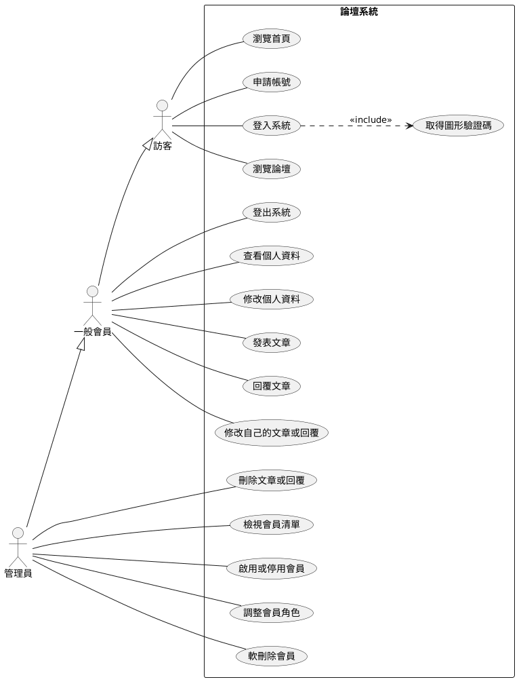
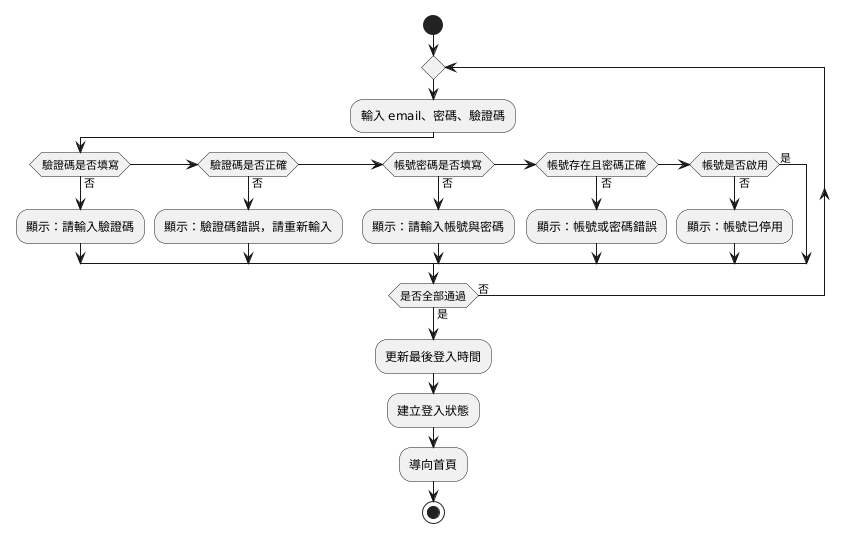
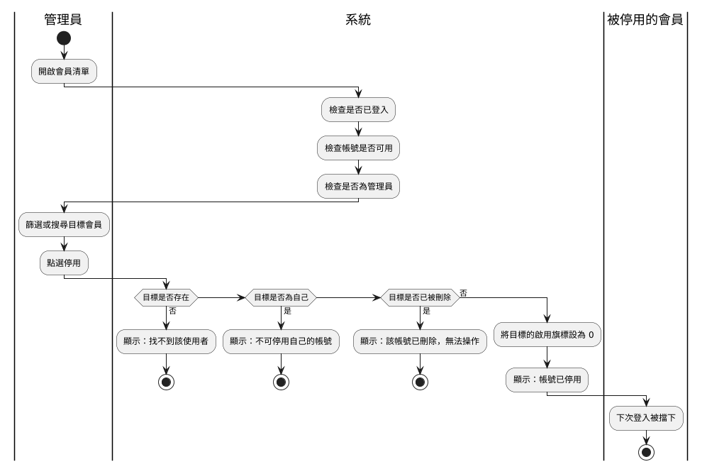

# 使用者分析

## 系統分析與設計（IE226）115-1

授課教師：呂卓勲

本課程教材：[GitHub](https://github.com/billy1125/system-analysis-and-design)

---

## 系統失敗，常常不是程式寫壞

多數失敗的資訊系統，是一開始就搞錯了「誰要用、用來做什麼」。

- 只問管理員、沒問一般會員：會員管理功能齊全，會員忘記密碼卻無路可走
- 假設不當內容管理員自己會看到：被討論到的人沒有任何管道要求處理

> **分析階段的第一項工作，是把「人」與「事」看清楚。**

---

## 本章的順序

1. 利害關係人分析：誰會受系統影響
2. 需求收集方法：用什麼方法問
3. 使用者分析：這些人是什麼樣的人
4. 使用案例圖：誰要用系統做什麼
5. 流程分析：這些事現在怎麼一步步做完

順序不能顛倒，後一項建立在前一項之上。

---

## 本章的例子

- 課堂範例系統「論壇系統」`sad-forum`
- 訪客瀏覽討論區、申請帳號並登入；會員發表文章與回覆；管理員治理帳號與內容
- 原始碼在 `03-Midterm-Project-Example-Systems/SAD-Forum/`

本章的例子都取自「系統分析範例報告」，也就是期中報告寫完的樣子。

---

# 一、為什麼分析要從人開始

資訊系統是給人用的。這句話聽起來像廢話，卻是整個分析階段的出發點：系統要做成什麼樣子，只能回到需要它的人身上去問。

本節先說明為什麼沒有一套系統與人無關，再列出從人開始的三個理由。

---

## 全自動的系統也和人有關

無人搬運車、視覺檢測設備、半夜自己跑的月結批次，過程中確實沒有人動手。

但要自動化哪一段、判定標準怎麼設、出狀況誰接手，都是人決定的。

> **自動化取消的是人的操作動作，取消不了人的目的。**

---

## 系統的價值由人給定

- 做得出來卻沒人需要：上線後被繞過去
- 做得到但不合期望：被抱怨、被消極抵制
- 兩者的結局都一樣：停用，或大家改用 Excel 私下作業

> **系統的價值由使用它的人給定，不是由功能數量給定。**

---

## 從人開始的三個理由

| 理由 | 例子 |
|---|---|
| 需求的正確性取決於問對人 | 只問管理員，只會得到會員管理的需求 |
| 同一件事在不同人眼中是不同問題 | 「刪文」：會員怕自己的內容莫名消失，管理員要能處理掉不當內容 |
| 願不願意用決定成敗 | 申請帳號太麻煩，訪客就不會成為會員 |

> 需求來自人，需求收集過程中的典型困難幾乎都是溝通問題而非技術問題

---

# 二、利害關係人分析

利害關係人比「使用者」的範圍寬：不會碰畫面的人，也可能是關鍵的利害關係人。系統維護者不發文也不管會員，但資料庫的備份與還原都在他手上。

本節說明怎麼找出利害關係人、怎麼分類、怎麼釐清權責，最後整理利害關係人到底是哪些人。

---

## 利害關係人是誰

> **只要會影響系統，或會被系統影響，就是利害關係人。**

不管他碰不碰畫面。

---

## 找出利害關係人的四個步驟

| 步驟 | 論壇系統找到的對象 |
|---|---|
| 分析專案文件 | 文件寫明的三種角色：訪客、一般會員、管理員 |
| 腦力激盪 | 系統維護者、課程教師與助教 |
| 客戶分析 | 內容公開後會波及的人：被討論到的第三人 |
| 製作表單 | 逐一寫出每個人受影響的方式 |

越後面找到的人，越容易被漏掉。

---

## 期中：沒有人可以訪談怎麼辦

期中分析既有系統，沒有立案文件，也沒有人可以訪談。把作業流程從頭走一遍，逐一問四個問題：

| 問題 | 論壇系統的答案 |
|---|---|
| 誰輸入資料？ | 訪客（申請帳號）、一般會員（發文與回覆） |
| 誰查看資料？ | 訪客、一般會員、管理員 |
| 誰維護系統？ | 系統維護者 |
| 誰為結果負責？ | 管理員 |

---

## 找齊之後分成兩張表

| 表 | 收哪些人 | 欄位 |
|---|---|---|
| 使用者 | 會直接操作畫面的人 | 角色、使用目標、主要需求、權限範圍、最在意什麼 |
| 利害關係人 | 不碰畫面，但影響系統或被影響的人 | 利害關係人、是否操作系統、受影響的方式 |

---

## 「是否操作系統」答「否」的那幾列

> **不碰系統卻被系統影響的角色最容易被漏掉，漏掉他就漏掉他那一整組功能。**

- 系統維護者：不操作論壇，但系統沒有稽核紀錄，出事時只能靠推測
- 被討論到的第三人：不是會員，內容涉及他時沒有管道要求處理

---

## 利害關係人的分類：所在位置 × 職能

| 所在位置 | 職能 | 論壇系統的對象 |
|---|---|---|
| 內部（internal） | 操作類型 | 管理員 |
| 內部（internal） | 管理類型 | 課程教師與助教 |
| 內部（internal） | 技術類型 | 系統維護者 |
| 外部（external） | 操作類型 | 訪客、一般會員 |

不同類別的人，需要投入的溝通程度不同。

---

## 利害關係人的分類：影響力 × 受影響程度

| | 受影響程度低 | 受影響程度高 |
|---|---|---|
| **影響力高** | 維持滿意：課程教師與助教 | 密切管理：管理員、系統維護者 |
| **影響力低** | 最低限度關注：訪客 | 充分告知：一般會員、被討論到的第三人 |

右下這一格最常被跳過，也是上線後抗拒最強的來源。

---

## 用 RACI 釐清權責

| 代號 | 角色 | 例：停用一個有爭議的會員帳號 |
|---|---|---|
| R | 實際執行的人 | 動手停用的管理員 |
| A | 簽核負責的人，只能有一位 | 決定該不該停用的那一位管理員 |
| C | 事前諮詢的人 | 其他管理員 |
| I | 事後告知的人 | 被停用的會員 |

「A 只能有一位」強迫你在動工前找出能做決定的人。

---

## 小結：利害關係人是哪些人

| 類型 | 論壇系統 |
|---|---|
| 會操作系統的人 | 訪客、一般會員、管理員 |
| 不操作系統，但會影響系統 | 系統維護者 |
| 不操作系統，但被系統影響 | 被討論到的第三人 |

最容易漏掉的是後兩種。本節的方法都是用來把這三種人找齊的。

---

# 三、需求收集方法

找出利害關係人之後，要決定用什麼方法向他們取得資訊。方法的選擇取決於對象是誰，也取決於你想知道的是「為什麼」還是「有多少」。

本節介紹質化與量化兩類方法，最後說明本課程報告能用到哪些。

---

## 質化方法：理解「為什麼」

| 方法 | 在論壇系統中的應用 |
|---|---|
| 訪談 | 問管理員平常怎麼判斷該不該停用帳號 |
| 觀察 | 看會員忘記密碼時實際怎麼處理 |
| 文件分析 | 讀原始碼、`README.md` 與 `document/` 系統文件 |
| 焦點團體 | 找會員與管理員一起討論什麼算不當內容 |
| 個案研究 | 研究其他論壇的檢舉與申訴做法 |

---

## 觀察比訪談更接近實際

管理員說：「帳號停用之後，那個人就什麼都不能做了。」

實際操作一遍：已登入的會員被停用後，仍能修改自己的姓名與顯示名稱。

> **只靠訪談會得到應該怎麼做，加上觀察才會得到實際怎麼做。**

---

## 量化方法：確認「有多少、多嚴重」

- 包括問卷調查、相關分析與實驗
- 例：從資料庫統計停用與已刪除的帳號各有幾筆、占全部會員多少
- 數字能支持立案，也能當上線後的效益比較基準

先以質化方法發現問題，再以量化方法驗證規模。

---

## 本課程的限制

兩次報告都沒有真實現場，也沒有真的使用者可以訪談或發問卷。

| 報告 | 能用的方法 |
|---|---|
| 期中 | 以文件分析為主：原始碼、`README.md`、`document/` 系統文件 |
| 期末 | 多半只能依題目說明書的情境推想 |

---

# 四、使用者分析

利害關係人回答「誰被影響」，使用者分析進一步回答「這些人是什麼樣的人、在什麼情境下操作系統」。只想看文章、還沒有帳號的訪客，和要在會員清單裡找出目標帳號的管理員，需要的畫面完全不同。

本節先做使用者分群與角色表，再介紹可選做的人物誌。

---

## 分群依據是與系統互動的方式

> **分群不依職稱，依與系統互動的方式。**

下列任一項不同，就分成不同族群：

- 使用的功能
- 操作頻率
- 所處環境

---

## 論壇系統的使用者分群

| 使用者群 | 使用的功能 | 登入狀態 | 主要關切 |
|---|---|---|---|
| 訪客 | 瀏覽首頁與論壇、申請帳號、登入 | 未登入 | 申請流程不要太麻煩 |
| 一般會員 | 發文、回覆、修改自己的內容與個人資料 | 已登入 | 自己發的內容不會莫名消失 |
| 管理員 | 會員清單、停用、調整角色、刪除 | 已登入且角色為管理員 | 不要把自己鎖在系統外 |

三群都用桌機或筆電的瀏覽器，所處環境相同；分得開是因為使用的功能不同。

---

## 分群表會變成設計約束

- 訪客「申請流程不要太麻煩」→ 申請帳號不用驗證碼，送出後即時生效
- 一般會員「內容不會莫名消失」→ 刪除權收給管理員，作者自己不能刪
- 管理員「不要把自己鎖在系統外」→ 不能停用、刪除自己，也不能改自己的角色

分群表適合分析時先整理，不一定要放進報告。

---

## 放進報告的是角色表（1/2）

| 角色 | 使用目標 | 主要需求 |
|---|---|---|
| 訪客 | 進入系統、成為會員 | 瀏覽首頁、瀏覽論壇、申請帳號、登入 |
| 一般會員 | 維護自己的資料、參與討論 | 登入登出、查看與修改個人資料、發表與回覆文章、修改自己的內容 |
| 管理員 | 治理帳號與內容 | 會員清單、篩選搜尋、啟用停用、調整角色、軟刪除、刪除任何文章與回覆 |

---

## 放進報告的是角色表（2/2）

| 角色 | 權限範圍 | 最在意 |
|---|---|---|
| 訪客 | 只能讀公開內容，不能發文、不能查看個人資料 | 申請流程不要太麻煩 |
| 一般會員 | 不能刪除任何內容、不能查看他人的帳號資料 | 自己發的內容不會莫名消失 |
| 管理員 | 一般會員的全部權限，加上管理功能；不能對自己執行停用、刪除、改角色 | 不要把自己鎖在系統外 |

出處：「系統分析範例報告」〈2.1 使用者〉。

---

## 權限範圍要正反兩面都寫

> **可以做什麼寫一半，不能做什麼寫另一半，分號後面那半句才是重點。**

- 訪客「不能發文、不能查看個人資料」，各自變成一條功能需求（FR-13、FR-11）
- 管理員「不能停用、刪除、改自己的角色」，保證系統永遠至少有一個可用的管理員

權限規則與流程對不上的地方，通常就是一個漏洞。

---

## 人物誌（補充，可選做）

人物誌是把一群使用者的共同特徵，濃縮成一個有名字的虛構人物。

- 期中與期末報告都不要求，各組自行決定要不要放
- 作用是讓團隊討論設計時有共同判準
- 與其爭論「系統畫面使用者看得懂嗎？」，不如問「如果有一個符合這個人物誌的真人他看得懂嗎？」。

---

## 人物誌範例：林小安，20 歲，一般會員

- **背景**：大二學生，用筆電上論壇問課業問題
- **目標**：問題有人回，回過的討論之後找得到
- **困難**：密碼常忘記，登入頁卻沒有忘記密碼的功能；發錯文只能修改，不能刪除
- **偏好**：不想為了一個論壇多記一組帳號

「忘記密碼」會讓他重新申請一個帳號，舊帳號發過的文章就接不回來。

---

## 放了人物誌，就要對得上表

> **每一份人物誌都必須對應到使用者表或利害關係人表上的某個角色。**

- 內容要和表上的使用目標、權限範圍、最在意的事一致
- 不能憑空編一個和系統無關的人物
- 對不上表的人物誌，只會讓報告前後不一致

---

# 五、使用案例圖（重點）

使用者與利害關係人確認之後，下一步是用 UML 標準的使用案例圖，把「誰要用系統做什麼」畫出來。它不描述系統內部怎麼運作，是最適合拿去和不懂技術的使用者確認需求的一張圖。

這是期中三張圖的第一張，後面的活動圖與系統循序圖，都以它上面的每一個橢圓為題材。

---

## UML 是什麼

UML（Unified Modeling Language，統一塑模語言）是一套畫系統圖的標準符號，由 Object Management Group（OMG）制定與維護。

同一個符號在誰手上都代表同一個意思，分析人員、使用者與工程師看同一張圖，才不會各自解讀。

本課程用到的使用案例圖、活動圖與系統循序圖，都是 UML 的圖。

---

<style scoped>
table {
  font-size: 0.95em;
}
</style>

## 四個構成元素

| 元素 | 圖示 | 含義 |
|---|---|---|
| 參與者（Actor） | 人形 | 與系統互動的角色，可以是人或其他系統 |
| 使用案例（Use Case） | 橢圓 | 系統提供的一項完整功能 |
| 系統邊界 | 方框 | 框內是本系統負責的範圍 |
| 關係 | 連線 | 參與者與使用案例、或使用案例之間的關係 |

---

## 參與者是角色，不是個人

- 同一個人，沒登入時是「訪客」，登入後是「一般會員」
- 多位管理員對系統做的事完全相同，就是同一個參與者
- 非人的對象也可以是參與者，例如外部系統；論壇沒有任何對外介接，圖上只有三個人形

---

## 使用案例的命名

名稱寫成 **動詞加受詞**，從參與者角度看得懂的一件完整的事。

| ✅ 適當 | ❌ 不適當 | 為什麼 |
|---|---|---|
| 發表文章 | 資料輸入 | 太籠統 |
| 檢視會員清單 | 按下查詢鈕 | 是操作步驟 |
| 啟用或停用會員 | 會員管理 | 看不出做了什麼 |
| 申請帳號 | 資料庫寫入 | 是系統內部實作 |

---

## 粒度：切多粗、切多細

> **判準：完成之後，參與者能不能就此離開系統去做別的事。**

- 「發表文章」符合：發完就可以離開
- 例外一：被 «include» 的使用案例，例如「取得圖形驗證碼」
- 例外二：作為權限前提的使用案例，例如「登入系統」

---

## 論壇用到的兩種關係

| 關係 | 用途 | 例子 |
|---|---|---|
| «include» | 一定會執行的共用步驟 | 「登入系統」包含「取得圖形驗證碼」 |
| 一般化(空心箭頭) | 一般與特殊 | 管理員是一般會員的特殊化 |

---

## 一般化的三件事

- **子角色不重畫父角色的連線**，只連自己多出來的使用案例
- **一般化可以串成多層**：訪客 ← 一般會員 ← 管理員
- **不畫一般化也不算錯**，代價是重複的連線要畫出來

---

## 論壇系統的使用案例圖



---

## 讀這張圖

- 管理員一般化自一般會員，一般會員一般化自訪客，各自只連多出來的使用案例
- 「登入系統」以 «include» 連到「取得圖形驗證碼」：登入必定經過驗證碼
- 邊界外沒有任何系統，代表論壇不與外部交換資料

出處：「系統分析範例報告」〈2.3 使用案例圖〉。

---

## 圖上看不出來的三件事

「登入系統」這個橢圓上只有四個字。看圖的人答不出來：

- 訪客要輸入哪些東西？
- 哪些情況登不進去？
- 登入之後系統裡留下了什麼？

圖呈現全貌與範圍，這些細節由 **使用案例敘述** 承載。

---

## 使用案例敘述的欄位

| 期中報告 | 欄位 |
|---|---|
| ✅ 建議（8 欄） | 編號與名稱、主要參與者、前置條件、觸發、主要流程、例外流程、後置條件、對應需求 |
| 有才寫 | 次要參與者 |
| 不必寫 | 簡要描述、利害關係人與目標 |

---

## 使用案例敘述的寫法提醒

- 編號寫成 `UC-01`、`UC-02`，兩位數固定寬度，指定後不再改
- 對應需求要等第 4 章整理出需求編號才填得上，最後回頭補

把系統當黑箱，只寫參與者做什麼、系統回應什麼。範例見「系統分析範例報告」〈6.1〉與〈6.2〉。

---

## 期中的敘述建議寫法（1/2）

「主要流程」與「例外流程」兩欄本課程建議同學照下面的寫法，UML 沒有要求——這兩欄之後要拿去對照第 6 章的活動圖與系統循序圖。

**主要流程要編號，主詞在參與者與系統之間交替**（UC-03 登入系統）：

1. 訪客請求登入頁　2. 系統回傳表單與驗證碼圖　3. 訪客送出 email、密碼、驗證碼　4. 系統驗證驗證碼　5. 系統驗證帳號與密碼　6. 系統檢查帳號狀態　7. 系統記錄登入時間並建立登入狀態　8. 系統導向首頁

---

## 期中的敘述建議寫法（2/2）

**例外流程掛在步驟編號上**：

4a 驗證碼未填或錯誤　5a 帳號密碼未填　5b 帳號或密碼錯誤　6a 帳號已停用

---

## 例外編號怎麼讀

對照上一頁的主要流程：

- `4a` 的 `4`：發生在第 4 步「驗證驗證碼」，驗證碼不對就卡在這裡
- `5a`、`5b` 的 `5`：發生在第 5 步的驗證，同一步兩種擋下來的理由，用 `a`、`b` 分開
- 第 1 到 3 步沒有例外，就不會出現 `1a`、`2a`、`3a`

每一個編號都是一種系統要處理的情況。漏掉一個，就是有一種狀況上線後沒人管。

---

## 使用案例圖常見的畫法錯誤

| 錯誤 | 修正方向 |
|---|---|
| 橢圓之間用箭頭串成順序 | 順序寫在敘述裡，圖不表達時間 |
| 出現「按下確認」等橢圓 | 合併成完整目的 |
| 出現「寫入資料庫」 | 刪除，屬於設計階段 |
| 參與者寫「小安」「管理組」 | 改成角色名稱 |
| 沒畫系統邊界 | 補上方框 |

---

## 使用案例圖的價值在於界定範圍

> **方框之內是這次要做的，方框之外不做。**

論壇的方框裡沒有「重設密碼」與「檢舉內容」，這兩件事系統就不處理。

客戶事後要求增加功能時，這張圖就是討論範圍變更的依據。

---

# 六、流程分析

使用案例圖畫出了誰要用系統做什麼，接著要看這些事現在是怎麼一步步做完的。流程裡需要系統協助的活動，都應該在使用案例圖上找得到對應；找不到，就代表圖上漏了。

本節說明現況與目標流程的差別、流程的四個要素、活動圖與泳道圖，再拿範例報告的兩條流程示範，最後用事件表回頭核對。

---

## 現況流程與目標流程

- **現況流程（AS-IS）**：目前實際運作的方式，包含私下變通
- **目標流程（TO-BE）**：導入系統後預期的運作方式

論壇的作者不能刪自己的文章，看似不合理，其實是防止刪文時底下所有人的回覆一起消失。

> **改動任何一個步驟之前，先問清楚它現在為什麼存在。**

---

## 期中的現況流程

期中分析的是已經在運作的系統。

- 現況流程指的是 **系統目前實際的行為**，不是系統以外的紙本作業
- 走畫面上跑得出來的那條路，包含每個關卡怎麼擋下你
- TO-BE 是期末的工作，期中不做

---

## 流程的四個要素

| 要素 | 論壇流程中的例子 |
|---|---|
| 活動 | 申請帳號、登入、發表文章、停用會員 |
| 角色 | 訪客、一般會員、管理員 |
| 觸發與流向 | 訪客送出登入表單後啟動；驗證碼錯誤則回到輸入 |
| 資訊 | 輸入 email、密碼、驗證碼，輸出登入狀態與最後登入時間 |

最容易漏掉的是 **分支**：帳號被停用的人來登入怎麼辦？

---

## 期中的流程欄位：先寫文字，再畫圖

```text
流程名稱：
主要角色：
觸發事件：
前置條件：
主要步驟：
例外情況：
完成後狀態：
```

至少兩條流程：主要角色一條、次要角色一條。

---

## 活動圖是什麼

**活動圖（Activity Diagram）** 是 UML 中描述流程步驟與走向的圖，期中的流程圖用的就是它。

| 符號 | 畫法 | 含義 |
|---|---|---|
| 起始節點 | 實心圓 | 流程的起點，只有一個 |
| 動作 | 圓角方框 | 一個步驟，寫成動詞加受詞 |
| 判斷節點 | 菱形 | 依條件選一條路走 |
| 結束節點 | 內含實心圓的空心圓 | 流程的終點，可以有多個 |

---

## 文字欄位怎麼畫成活動圖

| 文字欄位 | 在圖上畫成 |
|---|---|
| 主要步驟 | 由上而下的一串動作，順序照抄 |
| 例外情況 | 判斷節點，否的出線接「顯示：訊息原文」 |
| 完成後狀態 | 走到結束節點前的最後幾個動作 |

例外處理完：改一改就能成功的，拉回輸入；怎麼改都沒用的，直接結束。

---

## 泳道圖：加上泳道的活動圖

- 每個角色一條泳道，誰做的動作就畫在誰的泳道
- 期中分析既有系統時，**「系統」自己就是一條泳道**
- 只有使用者與系統兩方時，可以不加泳道

接下來的兩條流程各示範一種：會員登入不加泳道，管理員停用會員加泳道。

---

## 範例報告：會員登入（文字）

- **主要角色**：訪客
- **觸發事件**：訪客送出帳號密碼
- **主要步驟**：輸入 email、密碼、驗證碼 → 驗證驗證碼 → 驗證帳號密碼 → 檢查帳號狀態 → 建立登入狀態 → 導向首頁
- **例外情況**：驗證碼未填或錯誤、帳密未填、帳號或密碼錯誤、帳號已停用
- **完成後狀態**：記住登入者身分，更新最後登入時間

---

## 範例報告：會員登入（活動圖）



---

## 文字欄位怎麼變成圖

| 文字欄位 | 在圖上變成什麼 |
|---|---|
| 主要步驟 | 由上而下的動作，順序不變 |
| 例外情況 | 五個判斷，「驗證碼未填或錯誤」拆成兩個 |
| 例外的處置 | 都改得回來，顯示訊息後回到輸入 |
| 完成後狀態 | 最後的「更新最後登入時間」「建立登入狀態」 |

> **每一個例外都要在圖上找得到判斷，找不到就是漏了。**

---

## 範例報告：管理員停用會員（文字）

- **主要角色**：管理員；**次要角色**：被停用的會員
- **前置條件**：管理員已登入、帳號可用、角色為管理員
- **主要步驟**：開啟會員清單 → 篩選或搜尋目標 → 點選停用 → 系統檢核 → 更新帳號狀態 → 回到清單
- **例外情況**：目標不存在、目標為自己、目標已被刪除
- **完成後狀態**：目標帳號的啟用旗標為 0，其後無法登入

---

## 範例報告：管理員停用會員（泳道圖）



---

## 文字欄位怎麼變成泳道圖

| 文字欄位 | 在圖上變成什麼 |
|---|---|
| 主要角色、次要角色 | 兩條泳道，中間再加一條「系統」 |
| 前置條件 | 系統先做的三項檢查 |
| 主要步驟 | 由上而下的動作，誰做的就畫在誰的泳道 |
| 例外情況 | 三個判斷，都改不回來，顯示訊息後結束 |
| 完成後狀態 | 被停用的會員「下次登入被擋下」 |

> **角色不只一個時，用泳道把「誰做的」分開。**

---

## 泳道圖要看跨越的次數

每一次跨越泳道，就是一次交接，也是延遲與遺漏最容易發生的地方。

- 管理員點選停用，跨到系統檢核；檢核通過再跨回管理員的清單
- 最後一次跨越落在被停用的會員：他要到下次登入被擋下，才知道自己被停用
- 通知當事人不在系統裡，由管理員自行處理

---

## 完成後狀態是交叉比對的入口

範例報告〈3.2 管理員停用會員〉的完成後狀態：「目標帳號其後無法登入」。

拿這句去逐一試需要登入的功能，會發現已登入的會員被停用後，仍能修改自己的姓名。

> **試到一個沒被擋住的，就是一項分析發現。**

---

## 論壇系統的事件

論壇的事件都是 **外部事件**：由系統以外的人引發，系統收到後才回應。

- 訪客送出登入表單
- 會員送出回覆
- 管理員點選停用

每一個事件，都要在使用案例圖上找得到對應的橢圓。

---

## 事件表：回頭核對使用案例圖

| 事件 | 類型 | 系統回應 | 對應使用案例 |
|---|---|---|---|
| 訪客送出申請表單 | 外部 | 檢核後建立一般會員帳號 | UC-02 申請帳號 |
| 訪客送出登入表單 | 外部 | 建立登入狀態，更新最後登入時間 | UC-03 登入系統 |
| 會員送出回覆 | 外部 | 儲存回覆，文章移到列表最上方 | UC-09 回覆文章 |
| 管理員點選停用 | 外部 | 檢核後把啟用旗標設為 0 | UC-13 啟用或停用會員 |

---

# 七、各項分析如何串接

本章的各項工具不是互不相干的文件，而是一條有明確傳遞關係的鏈：從利害關係人、需求收集、使用者輪廓，到使用案例、流程與事件，最後展開成需求規格。

串得起來的前提是每一環都對得上，而且編號一致。

---

## 一條傳遞的鏈

- 利害關係人清單 **決定要訪談誰**
- 需求收集方法 **決定資訊的品質**
- 使用者分群與人物誌 **決定參與者的劃分**
- 使用案例圖 **界定系統的範圍**
- 流程與事件表 **回頭核對使用案例圖**

使用案例圖上每個參與者，都要能在利害關係人清單中找到對應。

---

## 編號一致

| 編號 | 代表什麼 |
|---|---|
| UC-xx | 使用案例 |
| FR-xx／NFR-xx | 功能需求／非功能需求 |
| F-xx | 功能 |
| P-xx／I-xx | 反推的原本問題／分析後的現況問題 |

> **編號一經指定就不要再改，而且一律用固定寬度的兩位數。**

---

## 本章重點回顧

- 需求附著在人身上，分析的起手式是找人、問人、觀察人
- 利害關係人包含不操作系統、卻影響系統或被系統影響的人
- 影響力與受影響程度是兩件事，影響力低、受影響高的那一格最常被跳過
- 使用案例圖的價值在於界定範圍，事件表回頭核對它有沒有漏
- 現況流程的不合理處往往有隱藏的理由

---

## 下一章

本章處理的是「誰要用、要用來做什麼」。

下一章「系統需求分析」接著處理「系統要做到什麼程度才算合格」，把使用案例展開成可驗證的功能需求與非功能需求。
