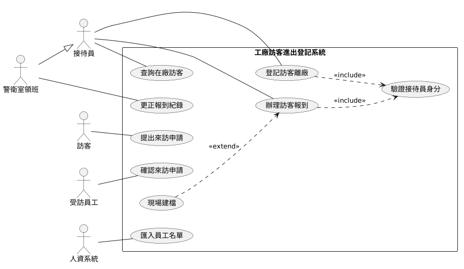
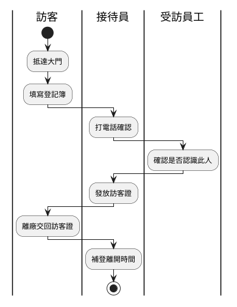
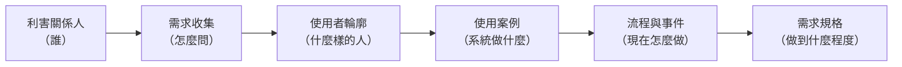

# 使用者分析

多數失敗的資訊系統，並不是程式寫壞了，而是一開始就搞錯了「誰要用、用來做什麼」。一套訪客登記系統若只問過廠務主管、沒問過大門的接待員，很可能做出一個報表漂亮但門口大排長龍的系統；若假設訪客都會在來訪前三天上網把申請填好，上線第一天就會發現九成的人是到了櫃台才填。你在分析階段的第一項工作，因此不是畫系統架構，而是把「人」與「事」看清楚。

本章處理分析階段的第一個區塊——使用者分析。內容依你實際執行的順序展開：先找出誰會受這套系統影響（利害關係人分析），決定用什麼方法向他們蒐集資訊（需求收集方法），再刻畫出這些人的輪廓（使用者分析）。人確認之後，把「誰需要系統幫他做什麼」用一張圖固定下來（使用案例圖），最後看這些事現在是怎麼一步步做完的（流程分析）。順序不能顛倒，因為後一項的正確性完全建立在前一項之上。

本章從頭到尾使用同一個情境：一家生產金屬沖壓件的中型工廠，每天有供應商、客戶與外部維修人員進出廠區，大門警衛室仍以一本紙本登記簿管理，消防演練時說不出廠內還有哪些外部人員。工廠決定導入一套「工廠訪客進出登記系統」，讓訪客事前提出來訪申請、到廠只做報到。以下各節都以這個案子說明方法。

另外，期中報告分析的是既有系統，寫法和從零開始的案子不完全一樣。凡是期中有特別規定的地方，本章會再對照[「系統分析範例報告」](../02-Midterm-Project-Example-Reports/Analysis-Phase-Sample-Report.md)〈2. 使用者與利害關係人分析〉與〈3. 現況流程分析〉，看同一個方法套在課堂範例系統 `SAD-Forum`（論壇系統）上寫出來是什麼樣子。

> **延伸閱讀**：本章談的是這些分析要怎麼做，各組實際要繳交哪些文件、格式與最低標準，見[「系統分析範例報告說明」](../02-Midterm-Project-Example-Reports/Analysis-Phase-Deliverables.md)。

> **必讀標記**：標題後加註 🔴 期中必讀 的小節，是期中小組報告九項產出直接會用到的內容；加註 🔵 期末必讀 的，是期末八項產出直接會用到的。判準與成品的樣子，期中見[「系統分析範例報告說明」](../02-Midterm-Project-Example-Reports/Analysis-Phase-Deliverables.md)與[「系統分析範例報告」](../02-Midterm-Project-Example-Reports/Analysis-Phase-Sample-Report.md)，期末見[「系統設計範例報告說明」](../04-Final-Project-Example-Reports/Design-Phase-Deliverables.md)與[「系統設計範例報告」](../04-Final-Project-Example-Reports/Design-Phase-Sample-Report.md)。未標記的小節仍屬課程範圍，只是報告不會直接產出。

## 一、為什麼分析要從人開始

### 1.1 沒有一套資訊系統與人無關

資訊系統是給人用的。這句話聽起來像廢話，卻是整個分析階段的出發點。

有人會反問：全自動的系統呢？無人搬運車自己決定路線、視覺檢測設備自己判定良品與不良品、批次程式在半夜自己跑完月結——過程中確實沒有人動手。但把時間軸拉開來看，是人決定要自動化哪一段、自動到什麼程度、判定標準怎麼設、出狀況時誰接手、結果報給誰看。**自動化取消的是人的操作動作，取消不了人的目的。** 檢測設備替代的是原本站在產線上目視挑件的作業員，它服務的仍是「不要把不良品出給客戶」這件事，而這是人訂下的目標。

再往上一層看，資訊系統本身不創造價值。它把資料從一個地方搬到另一個地方、算出一個數字、擋掉一個錯誤動作——這些事之所以有意義，是因為某個人接下來要據此做決定或採取行動。沒有人接手，系統的輸出就只是硬碟裡的一堆位元。

所以判斷一套系統該不該存在、能不能存在下去，判準不在技術做不做得到，而在 **它是否符合人的需要與期望**。做得出來卻沒有人需要的系統，上線後會被繞過去；做得到但與使用者期望不合的系統，會被抱怨、被消極抵制。兩者最後都是同一個結局——停用，或是變成一套「大家都在用另一套 Excel 私下作業」的空殼。系統的價值由使用它的人給定，不是由它的功能數量給定。

這就是分析階段必須從人開始的根本原因：**你要判斷一套系統該做成什麼樣子，只能回到那些需要它的人身上去問。**

### 1.2 從人開始的三個理由

[系統分析](https://zh.wikipedia.org/wiki/系統分析)的目的，是把一個含糊的期待——「我們想要一套能即時看到生產進度的系統」——轉換成開發人員做得出來、使用者也真的願意用的具體描述。這個轉換的第一道關卡是 **需求來源**：需求不會自己浮現，它附著在人身上，附著在這些人每天實際執行的作業裡。

從人開始有三個理由。第一，**需求的正確性取決於問對人**。工廠裡的訪客管理，廠長關心的是稽核時交得出紀錄，職安人員關心的是演練時點得出人，接待員關心的是尖峰時段門口會不會塞住。你只問廠長，就只會得到報表需求，做出來的系統在大門一定卡住。

第二，**同一件事在不同人眼中是不同的問題**。「訪客管理很亂」對職安人員而言是在廠名單不準，對總務而言是訪客證收不回來，對業務而言是客戶來訪時在門口等太久很失禮。三種說法指向三組不同的功能，而它們未必都在這次專案的範圍內。你在分析階段要做的正是把它們攤開來，再決定做哪些。

第三，**願不願意用，決定系統的成敗**。資訊系統的效益來自持續被使用，而使用者是否配合，取決於新做法相對於舊做法是不是真的比較省事。這個判斷你只能從理解使用者的實際工作情境得到，無法從技術規格推導。

也因為需求來自人，需求收集過程中的典型困難幾乎都是溝通問題而非技術問題：不同使用者對同一功能的要求互相衝突、客戶認為開發者理應已具備該行業的知識而略去不談、使用者說不清楚自己要什麼、訪談雙方對同一個詞的理解不同。本章介紹的各項工具，本質上都是在降低這幾類誤差。

## 二、利害關係人分析 🔴 期中必讀

**[利害關係人](https://zh.wikipedia.org/wiki/利害關係人)（Stakeholder）是指任何直接或間接受到系統成敗影響、或能影響系統成敗的個人或團體。** 注意這個定義比「使用者」寬：不會碰鍵盤的人也可能是關鍵利害關係人。以訪客登記系統為例，資訊室負責日後維護、卻不會天天使用系統。你在分析階段沒問過他們，系統很可能選用工廠內部無法維運的技術。

### 2.1 找出利害關係人 🔴 期中必讀

實務上依下列順序展開，越後面找到的人越容易被漏掉：

| 步驟 | 做法 | 在訪客登記系統案例中找到的對象 |
|---|---|---|
| 分析專案文件 | 從組織圖、作業流程書、專案立案文件中找出相關單位與職務；若無文件可參考則直接進入下一步 | 警衛室、廠務課、人資課、資訊室、廠長室 |
| 腦力激盪 | 召集專案團隊，針對文件未涵蓋的受影響範圍進行討論 | 夜班警衛、職安人員、常來的設備維修廠商 |
| 客戶分析 | 訪談客戶或目標對象，每訪談一位就追問「這件事還牽涉到誰」 | 負責訪客證製卡的總務、要接待客戶的業務 |
| 製作表單 | 列出前三步得到的利害關係人清單，逐一說明其受專案影響的方式 | —— |

最後一欄「受影響的方式」你不可省略。只寫「職安人員」沒有分析價值，寫成「職安人員——需要在演練與事故時立即取得在廠訪客名單，否則無法完成人員清點」才構成後續需求的線索。

期中報告分析的是一套已經存在的系統，沒有立案文件也沒有人可以訪談，上表的四個步驟要換成另一種問法：把作業流程從頭走一遍，逐一問 **誰輸入資料、誰查看資料、誰維護系統、誰為結果負責**。四個問題各自對應一群人，答得出來就找得齊。

找齊之後要分成兩張表，不要混在同一張裡：

| 表 | 收哪些人 | 該有的欄位 |
|---|---|---|
| 使用者 | 會直接操作畫面的人 | 角色、使用目標、主要需求、權限範圍、最在意什麼 |
| 利害關係人 | 不碰畫面、但會影響系統或被系統影響的人 | 利害關係人、是否操作系統、受影響的方式 |

利害關係人那張表的「是否操作系統」欄看起來多餘，作用是逼你正視答「否」的那幾列。**不碰系統卻被系統影響的角色最容易被漏掉，而漏掉他就等於漏掉他那一整組功能。** 訪客登記系統的職安人員是典型例子：他不辦報到、不發訪客證，但演練與事故時要靠在廠訪客名單完成人員清點；系統若不給他一個取得名單的管道——而且是斷電斷網時也拿得到的管道——那份名單就只是躺在資料庫裡，「在廠名單的離線取得」這一整組功能也就無聲無息地缺席了。

範例報告〈2.2 利害關係人〉也有同樣的一列：「被討論到的第三人」不是會員、不操作系統，但論壇內容涉及他時，他沒有任何管道要求處理。這一列到了報告最後，就成了〈9.1〉的現況問題 I-04。

### 2.2 利害關係人的分類

找齊之後要分類，因為不同類別的人需要投入的溝通程度不同。最基本的分類是依 **所在位置** 與 **職能** 交叉切分：

| | 操作類型 | 管理類型 | 技術類型 |
|---|---|---|---|
| **內部（internal）** | 接待員、警衛室領班 | 廠務課主管、廠長 | 資訊室 |
| **外部（external）** | 供應商的維修師傅 | 客戶的採購窗口 | 系統廠商、門禁設備維護商 |

另一種分類方式是依「能影響專案」與「被專案影響」區分為直接與間接利害關係人。實務上更常用的是把 **影響力** 與 **受影響程度** 當成兩個維度，交叉後得到四種處置方式：

| | 受影響程度低 | 受影響程度高 |
|---|---|---|
| **影響力高** | 維持滿意：定期告知進度即可，例如廠長 | 密切管理：全程參與需求確認，例如廠務課主管 |
| **影響力低** | 最低限度關注：例如訪客所屬的供應商公司 | 充分告知：需求要問、決策不必參與，例如大門接待員 |

要特別注意左下與右下的差別。接待員影響力低但受影響極大——系統上線後每天要多做幾十次登記動作的正是他們。這一格的人最常被跳過，也是系統上線後抗拒最強的來源。

### 2.3 用 RACI 釐清權責

需求確認階段常見的僵局是「大家都有意見，但沒有人能拍板」。[RACI 責任分配矩陣](https://zh.wikipedia.org/wiki/責任分配矩陣) 用來把這件事講明白：

| 代號 | 角色 | 含義 |
|---|---|---|
| R | 責任者（Responsible） | 實際執行工作的人 |
| A | 當責者（Accountable） | 最終負責正確完成可交付成果、並負責簽核的人，每項工作只能有一位 |
| C | 事先諮詢者（Consulted） | 事前徵詢意見的對象，通常是領域專家，雙向溝通 |
| I | 事後告知者（Informed） | 需要隨時了解進展的人，單向告知 |

以「確認來訪申請表單的欄位」這項工作為例：廠務課承辦人是 R（提出欄位需求），廠務課主管是 A（簽核定案），警衛室領班與職安人員是 C（提供現場與法遵面的意見），廠長與資訊室是 I。矩陣裡「A 只能有一位」這條限制最有價值——它強迫你在動工前就找出那個能做決定的人。

### 2.4 小結：利害關係人是哪些人？

利害關係人不等於操作系統的人。**只要會影響系統，或會被系統影響，就是利害關係人**，不管他碰不碰畫面。大致可以分成三種：

| 類型 | 訪客登記系統 | 論壇系統（範例報告） |
|---|---|---|
| 會操作系統的人 | 訪客、接待員 | 訪客、一般會員、管理員 |
| 不操作系統，但會影響系統的人 | 廠長、資訊室 | 系統維護者 |
| 不操作系統，但被系統影響的人 | 訪客所屬的供應商公司 | 被討論到的第三人 |

分析時最容易漏掉的是後兩種。本節介紹的四個步驟、四個問題、兩張表、兩種分類與 RACI，都是用來把這三種人找齊、整理清楚的方法，可以依情況選用。

## 三、需求收集方法

找出利害關係人之後，你要決定用什麼方法向他們取得資訊。方法的選擇取決於對象是誰：

| 來源 | 主要調查對象 | 主要方法 |
|---|---|---|
| 內部 | 利害關係人 | 質化（qualitative）方法為主，以訪談為核心 |
| 外部 | 終端使用者 | 量化（quantitative）方法為主，以問卷調查為核心 |

這個分工的道理在於人數與目的不同。內部利害關係人數量有限但每個人的資訊量大，需要深入挖掘；外部使用者人數眾多但每個人的資訊量小，需要的是分布與比例。

**質化方法** 用於理解「為什麼」，適合需求還不明確的階段：

| 方法 | 適用時機 | 在訪客登記系統中的應用 |
|---|---|---|
| 訪談 | 需要深入理解個別對象的想法 | 逐一訪談日班與夜班接待員，問出兩班的作業差異 |
| 觀察 | 對象說不清楚、或說的與做的不一致時 | 站在大門口看訪客實際怎麼填登記簿、怎麼離開 |
| 文件分析 | 需要掌握既有規則與資料格式 | 蒐集現行登記簿、訪客證清冊、人資的員工名單欄位 |
| 焦點團體討論 | 需要讓不同角色當場對焦衝突 | 找警衛室、廠務、職安三方共同確認流程 |
| 個案研究 | 需要參考同業做法 | 研究同業導入訪客管理系統的成效與踩過的坑 |

其中 **觀察** 在工廠場域的價值特別高。訪談時接待員會說「訪客離開都會來交還訪客證」，你實際到大門看，會發現下班時段有一半的人是跟著受訪員工直接走出去的——這個落差正是系統設計必須面對的真實條件。

**量化方法** 用於確認「有多少、多嚴重」，適合需求方向已定、要驗證普遍性的階段，包括調查（問卷）、相關分析與實驗。例如抽查最近三個月的登記簿共 1,200 筆，統計「未填離開時間」的比率，得到的數字既能支持專案立案，也能作為上線後的效益比較基準。

實務上兩類方法搭配使用：先以質化方法發現問題與假設，再以量化方法驗證其普遍程度。

**本節的方法，期中與期末報告不一定都用得到。** 這是本課程的限制：兩次報告的題目都沒有真實的現場，也沒有真的使用者可以訪談或發問卷。期中分析的是既有系統，能用的主要是文件分析，資料來源是系統的原始碼、`README.md` 與 `document/` 底下的系統文件。期末的題目只有一份題目說明書，現場怎麼運作、使用者怎麼想，多半只能依說明書的情境推想。

## 四、使用者分析 🔴 期中必讀 🔵 期末必讀

利害關係人回答的是「誰被影響」，使用者分析進一步回答「這些人是什麼樣的人、在什麼情境下操作系統」。同樣是使用者，特性差距可能極大：辦公室裡的廠務人員坐在雙螢幕前操作，訪客站在廠外大門口、用自己的手機、一隻手還提著東西、而且說不定這輩子只會用這套系統兩三次。你忽略這個差距，設計出來的介面就會只適合前者。

### 4.1 使用者分群 🔴 期中必讀 🔵 期末必讀

分群的依據不是職稱，而是 **與系統互動的方式**。判斷方法很直接：不同族群人使用的功能不同、操作頻率不同、或所處環境不同，你就該把他們分成不同的族群。

例如，訪客登記系統的分群結果如下：

| 使用者群 | 使用頻率 | 操作情境 | 主要關切 |
|---|---|---|---|
| 訪客 | 每人每年數次 | 廠外、自己的手機、單手、第一次用沒有人教 | 不要填太多欄位，不要被擋在門口 |
| 接待員 | 每班 20–30 次 | 大門警衛室，日照直射螢幕，門口車輛噪音 | 動作要快，尖峰時段不能排隊 |
| 受訪員工 | 每月數次 | 辦公室電腦 | 不要多一件麻煩事；訪客到了要有人通知 |
| 廠務與職安人員 | 不定時，演練時密集 | 辦公室，緊急時可能在現場 | 在廠名單要準，而且斷電時也拿得到 |
| 廠長 | 每週數次 | 辦公室或手機 | 彙總指標，不需明細 |

這張表直接決定了後續的設計約束。訪客那一列的「單手、沒有人教」會轉成介面需求（單欄版面、欄位極少、不用專有名詞），職安那一列的「斷電時也拿得到」會轉成架構需求（在廠名單要能離線取得）。

使用者分群適合在分析時先整理出來，但是不一定要全部都放進報告。建議放進報告的是系統需要優先滿足的對象，並且整理出他們的需求，例如下面這張角色表，寫出來的樣子見[「系統分析範例報告」](../02-Midterm-Project-Example-Reports/Analysis-Phase-Sample-Report.md)〈2.1 使用者〉，後續推導介面與非功能需求時也會用到。期中報告的角色表另外要求兩欄：**主要需求** 與 **權限範圍**，回答的是「這個角色需要系統提供什麼、可以做到哪裡為止」：

| 角色 | 使用目標 | 主要需求 | 權限範圍 | 最在意 |
|---|---|---|---|---|
| 訪客 | 順利進廠見到要見的人 | 提出來訪申請、查詢自己的申請狀態 | 只能填寫與查看自己的申請；不能查看員工名冊，也看不到別人的來訪紀錄 | 不要填太多欄位 |
| 接待員 | 讓訪客快速進場並掌握廠內有誰 | 辦理報到與發證、登記離廠、現場建檔、查在廠清單 | 可登記全部來訪；不能修改超過 30 分鐘的既有紀錄，也不能新增員工資料 | 動作要快，尖峰不能排隊 |
| 警衛室領班 | 收拾當班沒處理完的異常 | 接待員的全部功能，再加上更正逾時的紀錄 | 接待員的全部權限，再加上更正與補登；不能刪除任何一筆來訪紀錄 | 交接時帳要對得起來 |

**「權限範圍」這一欄要正反兩面都寫**：可以做什麼寫一半，不能做什麼寫另一半。分號後面那半句才是真正有價值的部分。它是非功能需求的來源，「不能查看員工名冊」會變成一條資料保護的規則；它也是後續找出系統問題的入口，權限規則與流程的後置條件對不上的地方，通常就是一個沒被發現的漏洞。

範例報告〈2.1 使用者〉的管理員那一列就是這樣寫的：

| 角色 | 權限範圍 |
|---|---|
| 管理員 | 一般會員的全部權限，加上管理功能；不能對自己執行停用、刪除、改角色 |

分號後面那三條「不能」合起來，保證系統中永遠至少有一個可用的管理員。其中「不能停用自己」，在〈3.2 管理員停用會員〉的流程裡就是系統的一道檢核。

### 4.2 人物誌

本小節是補充內容。使用者與利害關係人表寫完之後，如果還需要更具體的人物圖像，可以再用人物誌補強。期中與期末報告都不要求人物誌，各組自行決定要不要放。

**[人物誌](https://zh.wikipedia.org/wiki/人物誌_(使用者體驗))（Persona）是把某一群使用者的共同特徵，濃縮成一個具體、有名字的虛構人物。** 它的作用不是增加文件厚度，而是讓團隊討論設計時有共同的判準：與其爭論「系統畫面使用者看得懂嗎？」，不如問「如果有一個符合這個人物誌的真人他看得懂嗎？」。

一份人物誌通常包含兩類內容：

| 類別 | 項目 |
|---|---|
| 基本輪廓 | 姓名、人口資料、簡介、獲得消息的管道 |
| 使用行為 | 使用情境、目標、行為模式與使用偏好、痛點與困難 |

基本輪廓讓人物看起來像真人，使用行為才是推導需求的依據，後者不能省。以訪客登記系統的核心使用者為例：

> **陳志明，58 歲，警衛室領班，年資 22 年**
>
> 高職畢業，負責大門日班，對常來的供應商幾乎都叫得出名字。平常用智慧型手機看影片與通訊軟體，但不太打字，公司電腦只在年度考核時碰過。有老花眼。
>
> **目標**：不要讓訪客在門口等太久、不要放錯人進廠、準時交接。
>
> **困難**：紙本登記簿常被雨水弄濕，訪客字跡潦草，事後看不懂；早上八點五十分常一次來五、六位訪客，他一個人處理不完。他不反對用系統，但擔心「輸錯了會不會被追究」。他有老花眼，看太小的字會比較辛苦。
>
> **使用偏好**：習慣掃條碼、按實體按鈕，抗拒需要輸入文字的介面。
>
> **獲得消息的管道**：交接班、警衛室公布欄、同事口耳相傳。

這份描述裡最有價值的是「擔心輸錯會被追究」。它不是介面問題，而是會直接影響資料品質的組織問題。系統若不提供簡單的更正機制，接待員在尖峰時段會先讓訪客進去，等空下來再一次補登，在廠清單就失去了即時性。這類線索要從具體的人身上才看得出來。

人物誌一般為每個主要使用者群各做一份，總數控制在三到五份，做太多會失去焦點。其中要指定一份為 **主要人物誌**，不同人物誌的需求衝突時以它為優先。訪客登記系統的主要人物誌是陳領班：訪客沒有事前申請，他還能現場替對方建檔；他不登記，整套系統就沒有資料。

**報告裡一旦放了人物誌，每一份都必須對應到使用者表或利害關係人表上的某個角色**，內容也要和表上的使用目標、權限範圍、最在意的事對得起來。人物誌不是自由創作，不能憑空編一個和系統無關的人物，也不能寫出和角色表矛盾的特徵。對不上表的人物誌，放了只會讓報告前後不一致。

## 五、使用案例圖 🔴 期中必讀

使用者與利害關係人確認之後，下一步是用 UML 標準的使用案例圖，把「誰要用系統做什麼」畫出來。

**[使用案例圖](https://zh.wikipedia.org/wiki/用例圖)（Use Case Diagram）是 [統一塑模語言](https://zh.wikipedia.org/wiki/统一建模语言)（Unified Modeling Language, UML）中用來描述「誰能用這個系統做什麼」的圖。** 它刻意不描述系統內部怎麼運作，只呈現外部使用者與系統之間的互動，因此是分析階段最適合拿去和不懂技術的使用者確認需求的一張圖。

UML 是一套畫系統圖的標準符號，由 Object Management Group（OMG）制定與維護。標準的用處在於同一個符號在誰手上都代表同一個意思：分析人員、使用者與工程師看同一張圖，不會各自解讀。本課程用到的使用案例圖、活動圖與系統循序圖，都是 UML 的圖。

這是期中報告要求的三張圖裡的第一張，回答「誰要做什麼」。另外兩張依序回答「事情怎麼做」（活動圖）與「使用者與系統怎麼互動」（系統循序圖），都以本節的產出為起點——使用案例圖上的每一個橢圓，都是後續兩張圖的題材來源。期末報告另外要求一張概念類別圖，回答「系統管理哪些概念與規則」，見[「物件建模」](10-Object-Modeling.md)。

### 5.1 四個構成元素 🔴 期中必讀

| 元素 | 圖示 | 含義 |
|---|---|---|
| 參與者（Actor） | 人形符號 | 與系統互動的角色，可以是人，也可以是其他系統或設備 |
| 使用案例（Use Case） | 橢圓 | 系統提供的一項完整功能，執行完後參與者應得到一個有意義的結果 |
| 系統邊界（System Boundary） | 方框 | 框內是本系統負責的範圍，框外是環境 |
| 關係 | 連線 | 參與者與使用案例的關聯，或使用案例之間的關係 |

**參與者是角色而非個人。** 同一位陳領班，在辦理報到時是「接待員」，處理逾時未離廠的補登時則是「警衛室領班」——這是兩個參與者。反過來，若三個不同職稱的人對系統做的事完全相同，他們就是同一個參與者。這個判準能大幅簡化圖面。

參與者也包含非人的對象。訪客登記系統要從既有的人資系統取得員工名單，人資系統就是一個參與者；若大門裝有門禁設備可自動送出刷卡紀錄，門禁設備同樣是參與者。工廠裡另一類常見的非人參與者是 [企業資源規劃](https://zh.wikipedia.org/wiki/企业资源计划)（Enterprise Resource Planning, ERP）系統，多數廠內系統都要向它取得基礎資料。

找出參與者可從下列問題著手：誰使用系統的主要功能（主要角色）？誰需要靠系統完成日常作業？誰負責維護與管理系統以確保正常運作（次要角色）？系統要與哪些硬體設備或其他系統互通？哪些人或單位對系統產生的結果有興趣或受其影響？

### 5.2 使用案例的命名與粒度 🔴 期中必讀

使用案例的名稱一律寫成 **動詞加受詞**，且必須是從參與者角度看得懂的一件完整的事：

| ✅ 適當 | ❌ 不適當 | 為什麼 |
|---|---|---|
| 辦理訪客報到 | 資料輸入 | 太籠統，看不出做什麼 |
| 查詢在廠訪客 | 按下查詢鈕 | 這是操作步驟，不是完整目的 |
| 登記訪客離廠 | 離廠管理 | 名詞化，看不出參與者做了什麼 |
| 提出來訪申請 | 資料庫寫入 | 這是系統內部實作，不是使用者的目的 |

名稱之外還要決定 **粒度（granularity）**。粒度指的是一個項目切得多粗或多細——同一件事可以描述成一個大項目，也可以拆成十個小項目，粒度講的就是你選在哪一個層次描述它。粒度切得太粗，一個使用案例包山包海，看不出系統實際提供什麼；切得太細，圖上會出現一堆操作步驟。

順帶一提，「粒度」原本是材料與地質領域描述顆粒大小的名詞（如粒度分布），中文資訊領域拿它來翻譯 granularity，是循日語技術文件的用法而來——日文以「粒度（りゅうど）」形容一件事被切分得多細，這個講法後來進入中文的軟體工程用語。理解字面意思會比較好記：把一塊石頭磨成粗砂或細粉，材料沒變，變的是顆粒的大小，而在分析文件裡變的是描述的層次。

粒度的判準是 **完成之後，參與者能不能就此離開系統去做別的事**。「登入系統」單獨存在時不符合這個判準——沒有人登入只為了登入。而「辦理訪客報到」符合：報到辦完，接待員就轉頭去處理下一位訪客了。

這條判準有兩個例外，分析既有系統時一定會遇到。**被 «include» 進來的使用案例不受此判準約束**：「驗證接待員身分」沒有人會為它本身而來，但它是每次報到都必經的一步，抽出來畫才看得出報到這件事實際做了幾件事。**作為權限前提的使用案例也不受約束**：一套區分角色的系統裡，「登入系統」是其他所有使用案例的入口，圖上不畫它，未登入者與登入者的界線就無處可標。判準要擋掉的是「按下確認鈕」這種操作步驟，不是這兩類。

從角色出發找使用案例時，可以逐一自問：這個角色需要從系統獲得什麼功能？他需要讀取、產生、刪除、修改或儲存哪些資訊？系統中發生的事件需要通知他嗎？他需要通知系統某件事嗎？

### 5.3 三種關係 🔴 期中必讀

使用案例之間有三種標準關係，實務上前兩種最常用：

| 關係 | 標記 | 用途 | 例子 |
|---|---|---|---|
| 包含 | «include» | 多個使用案例共用的必要步驟，抽出來避免重複描述 | 「辦理訪客報到」與「登記訪客離廠」都包含「驗證接待員身分」 |
| 延伸 | «extend» | 只在特定條件下才發生的選擇性行為 | 「辦理訪客報到」在訪客沒有事前申請時延伸出「現場建檔」 |
| 一般化 | 空心三角箭頭 | 一般與特殊的關係，可用於參與者或使用案例 | 「警衛室領班」是「接待員」的特殊化，具備接待員的全部能力再加上更正紀錄 |

兩者的差別在於 **必要性與方向**：«include» 的目標一定會被執行，箭頭從主案例指向被包含的案例；«extend» 的目標不一定會被執行，箭頭反過來從延伸案例指向被延伸的主案例。你拿不準時，優先使用 «include»；過度使用 «extend» 會讓圖面變得難懂。

一般化在期中最常用到，也最常畫錯，三件事要記住：

- **子角色不重畫父角色的連線。** 警衛室領班既然一般化自接待員，圖上就不要再把領班連到接待員的每一個使用案例，只連他自己多出來的那幾個。初學者最常見的錯誤是兩邊都連，圖面立刻多出十幾條線，而且看不出領班究竟多了什麼能力。
- **一般化可以串成多層。** 例如「訪客 ← 一般會員 ← 管理員」，管理員一般化自一般會員、一般會員又一般化自訪客，能力逐層累加。畫成一條鏈，比讓每個角色各連一次清楚得多。
- **不畫一般化也不算錯**，代價是重複的連線要老實畫出來。角色只有兩三個、共用的功能又不多時，直接畫反而好讀。

### 5.4 訪客登記系統的使用案例圖 🔴 期中必讀



*本圖由作者自製*

圖中「警衛室領班」指向「接待員」的空心三角箭頭表示一般化：領班可以做接待員能做的所有事，另外還能更正逾時的報到紀錄。人資系統以參與者身分出現在邊界之外，代表員工名單來自外部、不是本系統產生。**訪客本人也是參與者，而且是唯一從廠外連進來的一個**——這一點在後面的架構設計會變成一項限制。

分析既有系統畫出來的圖，可以對照範例報告〈2.3 使用案例圖〉。論壇系統共 16 個使用案例，前面講過的幾條規則都用上了：

| 規則 | 在論壇系統的圖上 |
|---|---|
| 一般化串成多層（〈5.3〉） | 訪客 ← 一般會員 ← 管理員，子角色只連自己多出來的使用案例 |
| 被 «include» 的使用案例不受粒度判準約束（〈5.2〉） | 「取得圖形驗證碼」被「登入系統」包含 |
| 權限前提的使用案例不受粒度判準約束（〈5.2〉） | 「登入系統」單獨畫出，標出未登入與已登入的界線 |

### 5.5 使用案例敘述 🔴 期中必讀

回頭看〈5.4〉那張圖，「辦理訪客報到」這個橢圓上只有五個字。看圖的人答不出三件事：接待員要核對哪些東西、哪些情況不該放行、辦完之後系統裡留下了什麼。圖負責呈現全貌與範圍，這些細節則由 **使用案例敘述** 承載——把圖上一個橢圓展開成文字。

UML 並未規定敘述的格式，但歸納各家做法，完整版本應包含下列項目。**期中報告的使用案例敘述建議寫出這 8 個欄位：編號與名稱、主要參與者、前置條件、觸發、主要流程、例外流程、後置條件、對應需求**，次要參與者有才寫，其餘項目可以不寫：

| 項目 | 說明 | 期中報告 |
|---|---|---|
| 編號與名稱 | 便於後續追溯。編號寫成 `UC-01`、`UC-02`，兩位數固定寬度，一經指定就不再更動，見〈七〉 | ✅ |
| 簡要描述 | 一兩句話說明這個使用案例做什麼 | 不必寫 |
| 主要參與者 | 誰發起。來源是〈四〉整理出來的角色 | ✅ |
| 次要參與者 | 誰協同或被影響。來源同上 | 有才寫 |
| 利害關係人與目標 | 各方期待從中得到什麼。來源是〈二〉的利害關係人清單 | 不必寫 |
| 前置條件 | 執行前系統必須處於什麼狀態 | ✅ |
| 觸發 | 啟動這個使用案例的事件 | ✅ |
| 主要流程 | 一切順利時的步驟順序 | ✅ |
| 例外與替代流程 | 失敗、異常或其他走法。期中只要求例外流程 | ✅ |
| 後置條件 | 執行完成後系統的狀態或達成的效益 | ✅ |
| 對應需求 | 這個使用案例涵蓋哪幾條功能需求與非功能需求。這一欄要等[「系統需求分析」](04-System-Requirements-Analysis.md)把需求編號整理出來才填得上，所以是最後回頭補的 | ✅ |

敘述的詳略分為簡略（brief）、中等（medium）、詳細（detail）三種形式。專案初期以簡略或中等方式描述即可，需求收集告一段落後再展開為詳細版本。撰寫時要把系統當作黑箱，只描述參與者做什麼、系統回應什麼，不涉及內部如何實作，也不描述按鈕與畫面配置。

這些欄位寫出來的樣子見[「系統分析範例報告」](../02-Midterm-Project-Example-Reports/Analysis-Phase-Sample-Report.md)〈6.1 UC-03 登入系統〉與〈6.2 UC-13 停用會員〉，那兩份寫的是詳細版本。

上表這些欄位你不寫下來，開發人員只能自行猜測，而猜錯的代價要到驗收時才會顯現。

上表的「主要流程」與「例外流程」兩欄，本課程建議同學在期中報告照下面的寫法。其實 UML 本身沒有這樣要求，但這樣寫你們會更好理解，也可以直接拿來對照第 6 章：

| 欄位 | 建議的寫法 |
|---|---|
| 主要流程 | 每一步都編號，並寫明主詞是參與者還是系統 |
| 例外流程 | 每一個例外都掛在主要流程的步驟編號上，寫成 `4a`、`4b` 的形式 |

會這樣建議，是因為這兩欄之後要拿去對照[「行為建模」](06-Behavioral-Modeling.md)的活動圖與系統循序圖：主要流程對應循序圖的箭頭，例外流程對應活動圖的判斷節點。格式不一致就對不起來。以下分別說明。

**主要流程要編號，而且每一步都寫明主詞是參與者還是系統**，兩者交替出現：

> **主要流程**：1. 接待員調出當日的來訪申請　2. 系統顯示訪客姓名、公司與受訪人　3. 接待員核對證件並輸入訪客證編號　4. 系統檢核該張訪客證未被佔用　5. 系統記錄報到時間並更新在廠清單

主詞交替不只是排版習慣。每一步都分得出是誰在動作，這份敘述才有辦法直接轉成後面兩張圖；寫成「驗證登入資料」這種看不出主詞的句子，轉不過去。

> **這裡先照著寫就好，理由第 6 章會看到**：主詞決定的是系統循序圖上箭頭的方向——主詞是參與者的那幾步，箭頭從參與者指向系統；主詞是系統的那幾步，箭頭反過來。

**例外流程要掛在主要流程的步驟編號上**，寫成「數字加小寫字母」的形式。數字是它發生在主要流程的第幾步，字母是同一步的第幾個例外：

> **例外流程**：1a 查無此來訪申請　1b 申請的來訪日期不是今天　3a 訪客證欄位空白　4a 該張訪客證已在其他在廠訪客身上　4b 該張訪客證已停用

對照上面的主要流程就看得懂這組編號：`1a` 與 `1b` 的 `1` 指的是第 1 步「接待員調出當日的來訪申請」，調不出來、或調出來的日期不對，都發生在這一步；`4a` 與 `4b` 的 `4` 指的是第 4 步的檢核，同一步有兩種擋下來的理由，所以用 `a`、`b` 分開。主要流程沒有第 2 步的例外，就不會出現 `2a`。

例外抓得齊不齊，決定了這個使用案例有沒有被想清楚。每一個編號都是一種系統要處理的情況，漏掉一個，就是有一種狀況上線後沒人管。

> **這裡先照著寫就好，理由第 6 章會看到**：這組編號會決定活動圖上要畫幾個判斷節點，第 4 步有 `4a` 與 `4b` 兩個例外，圖上該處就分出兩個判斷。交件前拿敘述的例外編號與活動圖對一次，少一個就是漏了一種情況。

### 5.6 使用案例圖常見的畫法錯誤 🔴 期中必讀

| 錯誤 | 症狀 | 修正方向 |
|---|---|---|
| 把流程圖畫成使用案例圖 | 橢圓之間用箭頭串成先後順序 | 使用案例圖不表達時間順序，順序寫在使用案例敘述的流程裡 |
| 粒度過細 | 出現「輸入訪客證號」「按下確認」等橢圓 | 合併成一個對參與者有意義的完整目的 |
| 把系統內部功能畫進去 | 出現「寫入資料庫」「產生流水號」 | 刪除，這些屬於設計階段 |
| 參與者用人名或部門名 | 出現「陳領班」「警衛室」 | 改成角色名稱 |
| 邊界不明 | 沒畫方框，分不清哪些是本系統的責任 | 補上系統邊界，這是釐清專案範圍的關鍵 |

使用案例圖在專案中最實際的用途，往往不是描述功能，而是 **界定範圍**：方框之內是這次要做的，方框之外不做。客戶事後要求增加功能時，這張圖就是你討論範圍變更的依據。

> **延伸閱讀**：系統邊界怎麼判定、界外的對象有哪幾類、範圍外清單怎麼寫，見[「功能分析」](05-Functional-Analysis.md)〈二、系統邊界〉。

## 六、流程分析 🔴 期中必讀 🔵 期末必讀

使用案例圖畫出了誰要用系統做什麼，接著要看這些事現在是怎麼一步步做完的。**流程分析是把工作拆解成一連串有順序的活動，標示出每個活動由誰執行、需要什麼輸入、產出什麼結果。** 流程裡需要系統協助的活動，都應該在使用案例圖上找得到對應；找不到，就代表圖上漏了。

### 6.1 現況流程與目標流程 🔴 期中必讀 🔵 期末必讀

流程分析一定要區分兩種流程：

- **現況流程（AS-IS）**：目前實際運作的方式，包含所有臨時補丁與私下變通。
- **目標流程（TO-BE）**：導入系統後預期的運作方式。

先畫現況、再設計目標，順序不能省略。原因是現況流程裡那些看似不合理的動作，往往藏著沒被說出口的限制。訪客登記系統的現況流程中，訪客在登記簿上填完資料，接待員還要打一通電話向受訪員工確認，確認完才發訪客證。看起來多此一舉——訪客都說是某某人約的了，為什麼還要問一次？但訪談後發現這通電話擋掉過推銷員與求職者。你在 TO-BE 流程中直接刪掉這道人工確認，系統擋人的能力反而會比紙本時代更差。

現況流程也是效益評估的基準。「導入後可省下每天一小時的抄寫時間」這種說法，只有在現況流程被記錄下來之後才成立。

期中報告的分析對象是一套已經在運作的系統，這時的「現況流程」指的是 **系統目前實際的行為**，不是系統以外的紙本作業。你要走的是畫面上跑得出來的那條路，包含它在每一個關卡擋下你的方式；TO-BE 是期末重新設計時的工作，期中不做。

### 6.2 流程的四個要素 🔴 期中必讀

描述任何一道流程，至少要交代四件事：

| 要素 | 說明 | 訪客進出流程中的例子 |
|---|---|---|
| 活動 | 一個有明確起訖的動作 | 提出來訪申請、辦理報到、發放訪客證、登記離廠 |
| 角色 | 執行該活動的人或單位 | 訪客、接待員、受訪員工 |
| 觸發與流向 | 什麼事件啟動流程，活動之間的先後與分支 | 訪客抵達大門後啟動；若受訪人不在則轉由代理人接待 |
| 資訊 | 每個活動需要的輸入與產生的輸出 | 輸入來訪編號與訪客證號，輸出報到時間與登記人 |

其中最容易漏掉的是 **分支**。多數人描述流程時只講一路順暢的走法，但真正會讓系統上線後出問題的，往往是例外分支：訪客提早一天到怎麼辦？受訪員工臨時請假怎麼辦？訪客沒交回訪客證就走了怎麼辦？這些你在流程分析階段就要問出來。

期中報告的流程分析，除了上述四要素，還規定了一組固定的文字欄位。**先把每條流程寫成這個格式，再畫成圖**，順序顛倒過來的話，圖上一定會缺東西：

```text
流程名稱：
主要角色：
觸發事件：
前置條件：
主要步驟：
例外情況：
完成後狀態：
```

四要素裡沒有、這裡卻多出來的是 **前置條件** 與 **完成後狀態**：流程開始前系統必須處於什麼狀態，跑完之後又變成什麼狀態。它們是後續交叉比對時最好用的兩欄。舉例來說，某條流程的完成後狀態寫著「該帳號其後無法登入」，你就可以逐一去試那些需要登入的功能是不是真的都被擋住了；試到一個沒被擋住的，那就是一項分析發現。

這個例子來自範例報告。〈3.2 管理員停用會員〉照上面的格式寫成：

> **主要角色**：管理員
> **次要角色**：被停用的會員
> **觸發事件**：管理員在會員清單或明細頁點選停用
> **前置條件**：管理員已登入、帳號可用、角色為管理員
> **主要步驟**：開啟會員清單 → 篩選或搜尋目標 → 點選停用 → 系統檢核 → 更新帳號狀態 → 回到清單
> **例外情況**：目標不存在、目標為自己、目標已被刪除
> **完成後狀態**：目標帳號的啟用旗標為 0，其後無法登入

拿「其後無法登入」去逐一試，會發現已經登入的會員被停用後，仍能修改自己的姓名與顯示名稱。這就是範例報告〈9.1〉的現況問題 I-01。

數量上至少要兩條流程：**主要角色一條、次要角色一條**。只寫主要角色那一條，等於只證明了系統的正常路徑跑得動。範例報告寫了〈3.1 會員登入〉與〈3.2 管理員停用會員〉兩條。

### 6.3 用泳道圖表達跨角色流程 🔴 期中必讀 🔵 期末必讀

當流程牽涉多個角色時，適合用 **[泳道圖](https://zh.wikipedia.org/wiki/泳道圖)（Swimlane Diagram）** ——把圖面切成數條並排的「泳道」，每條代表一個角色，活動畫在執行者的泳道內，跨泳道的箭頭就代表工作的移交。



*本圖由作者自製*

泳道圖的分析價值在於 **箭頭跨越泳道的次數**。每一次跨越都代表一次交接，而交接正是延遲、遺漏與資訊失真最容易發生的地方。上圖中接待員「打電話確認」要跨到受訪員工的泳道，確認完再跨回來「發放訪客證」，一來一回就是兩次交接，而受訪員工可能在開會、在產線上，訪客就站在門口等——這正是整個專案要解決的核心問題。

上圖畫的是還沒有系統的年代，泳道全是人與單位。期中報告分析的是既有系統，這時 **「系統」自己就是一條泳道**：使用者送出動作之後，接手做檢核、寫入與回應的是系統，那些動作要畫在系統那一條裡，不能混進使用者的泳道。跨進系統泳道的箭頭代表責任從人移交給系統，跨出來的箭頭則代表系統把結果交還給人。畫法與範例見[「行為建模」](06-Behavioral-Modeling.md)〈二、活動圖〉。

### 6.4 從事件到事件表

流程畫出來之後，需要一個機制把它轉成系統要處理的項目，這個機制是 **事件**。**事件是在特定時間或地點發生、可以描述且值得注意的特定事情。** 你只要列得出「什麼事發生時系統需要做出回應」，就等於掌握了系統要做哪些事。

事件分三類：

| 類型 | 說明 | 訪客登記系統中的例子 |
|---|---|---|
| 外部事件（External event） | 發生在系統外部、由參與者啟動 | 訪客抵達大門要辦理報到 |
| 暫時事件（Temporal event） | 到了特定時間，系統自動處理，不需外部觸發 | 每日 23:30 自動把預定日已過仍未報到的申請標記為未到訪 |
| 狀態事件（State event） | 系統內部達到某種狀態而必須處理，與時間無關 | 某位訪客停留超過預定結束時間兩小時時發出警示 |

尋找事件有三種角度可以交叉使用：依類型逐類尋找、依利害關係人的目標逐項對應、依參與者需要的服務逐項展開。

找到事件後要判斷合併與拆分。**若數個動作總是同時或固定接續發生，視為單一事件** ——「辦理訪客報到」可涵蓋核對證件、指定訪客證、寫入報到時間、更新在廠清單，不必拆成四個。**若動作發生時間各自獨立但性質相近，可合併為一個事件** ——訪客證的新增、停用、備註都屬資料異動，合併為「維護訪客證資料」即可。

把事件與其對應的使用案例編列成表格，就是 **事件表（event table）**：

| 事件 | 類型 | 觸發者 | 系統回應 | 對應使用案例 |
|---|---|---|---|---|
| 訪客抵達大門 | 外部 | 接待員 | 記錄報到時間與訪客證，更新在廠清單 | 辦理訪客報到 |
| 訪客交回訪客證 | 外部 | 接待員 | 記錄離廠時間，釋出該張訪客證 | 登記訪客離廠 |
| 每日 23:30 | 暫時 | 系統 | 將預定日已過仍未報到的申請標記為未到訪 | 結算未到訪申請 |
| 停留超過預定時段兩小時 | 狀態 | 系統 | 在櫃台清單標記逾時 | 發送逾時停留提醒 |

事件表的目的是核對使用案例圖有沒有漏掉系統作業。通常一個事件對應一個使用案例，但相關或接續的多個事件也可以合併到同一個使用案例中。完成後你要用下列問題檢核：哪些事件重複、可合併或該拆開？事件是否涵蓋所有利害關係人的目標？所有使用案例合起來是否涵蓋整體系統功能？有沒有功能被遺漏？

事件名稱建議寫成「觸發狀態（動詞）＋處理的作業（名詞）」，使用案例名稱則建議寫成「事情（名詞）＋處理方式（動詞）」，以最清楚明白為原則。

## 七、各項分析如何串接 🔴 期中必讀

本章的各項工具並非互不相干的文件，而是一條有明確傳遞關係的鏈：



- 利害關係人清單 **決定要訪談誰**，漏掉一類人，就漏掉一整批流程。
- 需求收集方法 **決定資訊的品質**，只靠訪談會得到「應該怎麼做」，加上觀察才會得到「實際怎麼做」。
- 使用者分群與人物誌 **決定參與者的劃分**，並提供後續介面設計與非功能需求的依據。
- 使用案例圖 **界定系統的範圍**，接著逐一展開成可驗證的需求條目。
- 流程與事件表 **回頭核對使用案例圖**：凡是需要系統協助才能完成的活動，都應該對應一個使用案例；純人工的活動（例如接待員目視核對證件上的照片）則留在系統邊界之外。

你反過來檢查也同樣有效：使用案例圖上每個參與者，都應該能在利害關係人清單中找到對應；清單上每位主要使用者，也都應該至少對應一個使用案例。對不上的地方，不是圖畫錯了，就是有人被漏掉了。

串接得起來的前提是編號一致。期中報告的各項產出各有一組編號，跨文件互相引用時只認編號、不認名稱：

| 編號 | 代表什麼 | 出現在哪一項 |
|---|---|---|
| UC-xx | 使用案例 | 使用案例圖、使用案例敘述 |
| FR-xx | 功能需求 | 功能需求清單 |
| NFR-xx | 非功能需求 | 非功能需求清單 |
| F-xx | 功能 | 功能階層圖、功能清單 |
| P-xx | 反推出來的原本問題 | 問題與系統背景 |
| I-xx | 分析後找到的現況問題 | 現況問題與改善建議 |

編號一經指定就不要再改，因為別的表格已經在引用它了。功能清單上的一列會同時掛著「對應需求 FR-06、NFR-02」與「對應使用案例 UC-03」，你改動任何一個編號，都得回頭修改所有引用它的地方。**編號一律用固定寬度的兩位數**，FR-6 與 FR-06 混著用，交件前搜尋核對時會漏掉一半。

> **延伸閱讀**：使用案例接下來如何展開成功能需求與非功能需求，以及如何彙整為系統需求規格，見[「系統需求分析」](04-System-Requirements-Analysis.md)。

## 八、學習重點總結

讀完本章後，你應該能夠理解以下核心概念，並將其應用於工業場域的思考與決策：

**需求附著在人身上**

系統需求不會自動出現在文件裡，它存在於每天執行該項作業的人的工作習慣中。這決定了分析的起手式必須是找人、問人、觀察人，而不是先畫架構圖。在工廠場域，這意味著你要走到大門口站十分鐘，看訪客實際怎麼填登記簿、什麼時候會跳過、離開時到底有沒有交回訪客證。

**影響力與受影響程度是兩件事**

大門接待員通常沒有決策權，卻是受系統影響最深的一群人；高階主管則相反。你把這兩個維度分開評估，才不會把溝通資源全放在會議室裡而忽略了現場。系統上線後最常見的失敗——「大家都不用」——幾乎都源自於這一格的人在分析階段沒有被認真對待。

**質化與量化方法回答的是不同問題**

訪談與觀察回答「為什麼會這樣」，問卷與統計回答「有多普遍、多嚴重」。只做前者會把個別意見誤當成全體需求，只做後者則會得到一堆數字卻不知道背後的原因。實務上的標準做法是先質化發現問題，再量化驗證規模，兩者的產出共同構成專案立案的依據。

**使用案例圖的價值在於界定範圍**

在專案實務中，這張圖被翻出來的時機多半是客戶要求追加功能的時候。系統邊界方框把「這次要做的」與「這次不做的」畫成一條看得見的線，讓範圍變更成為一個可以攤開來討論的決策，而不是無聲無息地壓垮時程的暗流。

**現況流程的不合理處往往有隱藏的理由**

目標流程不是把現況流程裡的人工步驟直接刪光。那些看似多餘的人工檢核、重複謄寫，可能承擔著沒有被寫進作業標準的品質把關功能。你改動任何一個步驟之前，先問清楚它現在為什麼存在，是流程分析最核心的紀律。

**事件是流程與系統功能之間的轉換器**

流程描述的是人怎麼工作，使用案例描述的是系統要提供什麼，兩者之間需要一個橋樑，而事件正是這個橋樑：問「什麼事情發生時系統必須有所反應」，答案就是系統的功能清單。外部、暫時、狀態三種事件類型提供了逐類盤點的檢查表，能有效降低功能遺漏——尤其是最容易被忘記的暫時事件（定時結算、定期通知）與狀態事件（超過門檻的警示）。

> **銜接提示**：本章處理的是「誰要用、要用來做什麼」，下一章[「系統需求分析」](04-System-Requirements-Analysis.md)接著處理「系統要做到什麼程度才算合格」，把使用案例展開成可驗證的功能需求與非功能需求。

## 參考文獻

- Alexander, I. F., & Beus-Dukic, L. (2009). *Discovering requirements: How to specify products and services*. Wiley.
- Bittner, K., & Spence, I. (2003). *Use case modeling*. Addison-Wesley.
- Booch, G., Rumbaugh, J., & Jacobson, I. (2005). *The unified modeling language user guide* (2nd ed.). Addison-Wesley.
- Cockburn, A. (2001). *Writing effective use cases*. Addison-Wesley.
- Constantine, L. L., & Lockwood, L. A. D. (1999). *Software for use: A practical guide to the models and methods of usage-centered design*. Addison-Wesley.
- Cooper, A. (2004). *The inmates are running the asylum: Why high-tech products drive us crazy and how to restore the sanity*. Sams Publishing.
- Cooper, A., Reimann, R., Cronin, D., & Noessel, C. (2014). *About face: The essentials of interaction design* (4th ed.). Wiley.
- Davenport, T. H., & Short, J. E. (1990). The new industrial engineering: Information technology and business process redesign. *Sloan Management Review*, *31*(4), 11–27.
- Dennis, A., Wixom, B. H., & Roth, R. M. (2018). *Systems analysis and design* (7th ed.). Wiley.
- Dumas, M., La Rosa, M., Mendling, J., & Reijers, H. A. (2018). *Fundamentals of business process management* (2nd ed.). Springer. https://doi.org/10.1007/978-3-662-56509-4
- Fowler, M. (2003). *UML distilled: A brief guide to the standard object modeling language* (3rd ed.). Addison-Wesley.
- Freeman, R. E. (1984). *Strategic management: A stakeholder approach*. Pitman.
- Goguen, J. A., & Linde, C. (1993). Techniques for requirements elicitation. In *Proceedings of the IEEE International Symposium on Requirements Engineering* (pp. 152–164). IEEE. https://doi.org/10.1109/ISRE.1993.324822
- Hammer, M. (1990). Reengineering work: Don't automate, obliterate. *Harvard Business Review*, *68*(4), 104–112.
- Jacobson, I., Christerson, M., Jonsson, P., & Övergaard, G. (1992). *Object-oriented software engineering: A use case driven approach*. Addison-Wesley.
- Kendall, K. E., & Kendall, J. E. (2019). *Systems analysis and design* (10th ed.). Pearson.
- Larman, C. (2004). *Applying UML and patterns: An introduction to object-oriented analysis and design and iterative development* (3rd ed.). Prentice Hall.
- Mitchell, R. K., Agle, B. R., & Wood, D. J. (1997). Toward a theory of stakeholder identification and salience: Defining the principle of who and what really counts. *Academy of Management Review*, *22*(4), 853–886. https://doi.org/10.2307/259247
- Nielsen, J. (1993). *Usability engineering*. Academic Press.
- Object Management Group. (2017). *OMG unified modeling language (OMG UML), version 2.5.1*. https://www.omg.org/spec/UML/2.5.1/
- Pruitt, J., & Adlin, T. (2006). *The persona lifecycle: Keeping people in mind throughout product design*. Morgan Kaufmann.
- Rumbaugh, J., Jacobson, I., & Booch, G. (2004). *The unified modeling language reference manual* (2nd ed.). Addison-Wesley.
- Sharp, H., Finkelstein, A., & Galal, G. (1999). Stakeholder identification in the requirements engineering process. In *Proceedings of the 10th International Workshop on Database and Expert Systems Applications* (pp. 387–391). IEEE. https://doi.org/10.1109/DEXA.1999.795198
- Sommerville, I. (2016). *Software engineering* (10th ed.). Pearson.
- Yourdon, E. (1989). *Modern structured analysis*. Yourdon Press.

---

*本章可作為分析階段第一份產出——使用者與流程分析報告——的撰寫依據。建議的延伸練習是：選一項你熟悉的校內或工讀場域作業（例如系辦公室的借用申請、便利商店的補貨作業），完成利害關係人清單、一份主要人物誌與一張使用案例圖，再畫出 AS-IS 泳道圖與事件表，並檢查圖上每個參與者是否都能在清單中找到對應。*
