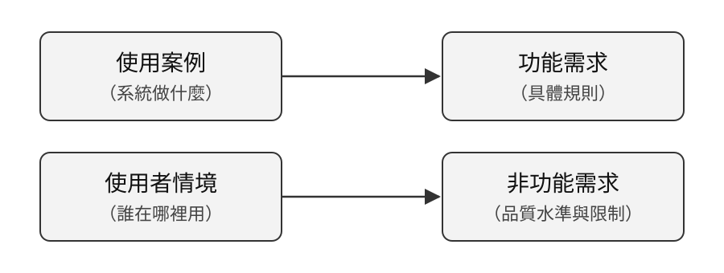

# 系統需求分析

## 系統分析與設計（IE226）115-1

授課教師：呂卓勲

本課程教材：[GitHub](https://github.com/billy1125/system-analysis-and-design)

---

## 本章寫的是系統需求規格

> **本章介紹怎麼寫系統需求規格（System Requirements Specification, SRS）。**

- SRS 是詳細描述並規範系統需求的文件，是系統分析最重要的產出
- 它是後續設計、開發與驗收的共同依據
- 主體是兩份清單：功能需求與非功能需求

本章每一節，都是在說明 SRS 的某一部分怎麼寫、怎麼檢查。

---

## 本章是系統分析中最重要的部分

> **需求清單是系統分析的核心，前面的分析匯進它，後面的分析從它展開。**

- 往前：問題定義與使用者分析的結果，都要落成一條條需求
- 往後：功能清單、使用案例敘述都要填「對應需求」
- 往外：設計、開發與驗收都以它為依據

需求寫錯或寫漏，後面每一項分析都會跟著錯。

---

## 收不收得到錢，看的是需求

合約一定會依據雙方認定的需求書內容核對。

- 系統收不收得到錢，就看當初你和客戶談好的需求有哪些
- 分析不出合適的需求：客戶不滿意
- 訂出模糊的需求，或與實際差異過大、做不出來的需求：賠錢的是你

> **需求書寫了什麼，驗收就核對什麼。**

---

## 期待不是需求

「論壇要能管理會員」是一句期待，不是一項需求。它沒有說明：

- 管理包含哪些動作？
- 誰可以做？
- 管理員能不能對自己做？
- 被停用的人還能做什麼？

> **不在分析階段回答這些問題，它們就會由工程師各自猜測。**

---

## SRS 的需求要寫到可驗證

每一條需求都能在系統做出來之後回答「符合」或「不符合」，沒有第三種答案。

| 主軸 | 回答的問題 | 決定什麼 |
|---|---|---|
| 功能需求 | 系統要做什麼 | 系統有沒有用 |
| 非功能需求 | 要做到什麼程度、在什麼限制下做 | 系統能不能用 |

---

## 本章的順序

本章照 SRS 的撰寫順序走：

1. 從期待到需求：SRS 收哪些級別的需求
2. 功能需求：SRS 的第一份清單
3. 非功能需求：SRS 的第二份清單
4. 判斷需求品質的準則：寫完怎麼檢查
5. 需求的優先順序與追溯
6. 系統需求規格：整份文件的章節架構

---

## 本章的例子

- 課堂範例系統「論壇系統」`sad-forum`
- 上一章已經找出三種角色，畫出使用案例圖與兩條現況流程
- 本章的需求清單對應「系統分析範例報告」〈4. 系統需求分析〉

範例報告共整理出 21 條功能需求（FR-01 到 FR-21）與 9 條非功能需求（NFR-01 到 NFR-09）。

---

## 本章對應範例報告的哪些小節

| 範例報告的小節 | 本章哪一節在講 |
|---|---|
| 〈4.1 功能需求〉 | 二、功能需求 |
| 〈4.2 非功能需求〉 | 三、非功能需求 |
| 〈5.2 功能清單〉的「對應需求」欄 | 五、需求的優先順序與追溯 |
| 〈6.1〉〈6.2〉使用案例敘述的「對應需求」欄 | 一、從期待到需求 |

主體是〈4.1〉與〈4.2〉；另外兩處是需求編號被引用的地方。

---

# 一、從期待到需求

需求不是同一個層次的東西堆在一起。「讓大家能分享資訊」和「系統應拒絕重複的電子郵件註冊」都是需求，但一個在講為什麼要有這套系統，一個在講系統遇到某個情況要怎麼回應。

本節先分清楚需求的級別，再說明處理需求的四個階段，最後接上上一章的使用案例。

---

## 需求的五個級別

| 報告要有 | 級別 | 回答的問題 |
|---|---|---|
| ✅ | 商業需求 | 為什麼要投資這個專案 |
| ✅ | 利害關係人需求 | 各方各自期待得到什麼 |
| ✅ | 功能需求 | 系統要提供哪些能力 |
| ✅ | 非功能需求 | 這些能力要達到什麼水準、受什麼限制 |
| | 過渡需求 | 從現況切換到新系統需要什麼 |

從最抽象到最具體，下層要能追溯到上層。打勾的四個級別，是期中報告必定要寫出來的內容。

---

## 論壇系統的例子

| 級別 | 範例報告寫在哪裡 | 例子 |
|---|---|---|
| 商業需求 | 〈1.3 原本要解決的問題〉 | 讓一群人有一個公開、依主題集中的地方分享資訊（P-01） |
| 利害關係人需求 | 〈2.1 使用者〉與〈2.2 利害關係人〉 | 一般會員希望自己發的內容不會莫名消失 |
| 功能需求 | 〈4.1 功能需求〉 | FR-17 系統應僅允許管理員刪除文章與回覆 |
| 非功能需求 | 〈4.2 非功能需求〉 | NFR-04 刪除一律為軟刪除，資料須保留在資料庫中 |

---

## 下層需求必須能追溯到上層

FR-17「僅允許管理員刪除文章與回覆」往上追：

- 一般會員最在意「自己發的內容不會莫名消失」
- P-04：任一人刪文，其他人的回覆會跟著消失，討論脈絡中斷

> **一項功能需求對應不到任何上層需求，就要問它為什麼存在。**

---

## 需求工程的四個階段

| 階段 | 工作內容 |
|---|---|
| 需求收集 | 從不同來源蒐集需求資訊 |
| 需求分析 | 找出其中的錯誤、矛盾、遺漏或不足 |
| 需求描述 | 以標準格式寫成需求 |
| 需求驗證 | 審查需求是否正確且完整 |

四個階段會反覆疊代。上一章做的是前兩個，本章集中在「描述」與「驗證」。

---

## 使用案例與需求的關係

使用案例圖界定範圍，但它本身還不是需求規格。

---

## UC-03 登入系統展開成五條需求

| 編號 | 需求 |
|---|---|
| FR-02 | 提供圖形驗證碼，每次載入時產生新的答案 |
| FR-06 | 提供登入功能，成功後記錄最後登入時間 |
| FR-07 | 阻擋已停用或已刪除的帳號登入 |
| NFR-02 | 驗證碼應在查詢資料庫之前檢查 |
| NFR-03 | 帳號不存在、已刪除與密碼錯誤，回覆相同的錯誤訊息 |

這五個編號就是使用案例敘述「對應需求」那一欄要填的內容。

---

# 二、功能需求

功能需求描述系統必須提供的行為：在什麼條件下、接收什麼輸入、執行什麼處理、產生什麼輸出。判斷一項敘述是不是功能需求，最簡單的方法是問它描述的是不是「系統會做的一件事」。

本節說明功能需求從哪裡找、怎麼寫，以及期中報告的「依據」欄為什麼重要。

---

## 新系統：功能需求的四個來源

| 來源 | 說明 |
|---|---|
| 使用案例展開 | 每個使用案例的主要流程與例外流程 |
| 事件表 | 每個事件對應的系統回應 |
| 資料的生命週期 | 每一類資料的新增、查詢、修改、刪除與封存 |
| 法規與公司規章 | 外部要求轉成的系統行為 |

這四個來源適用於系統還沒做出來的時候，期末會用到。

---

## 既有系統：需求是查出來的

> **分析一套已經在運作的系統時，需求不是問出來的，是從系統本身查出來的。**

期中的來源換成四種證據：

- 畫面
- 路由與操作路徑
- 資料欄位
- 錯誤訊息

---

## 四種證據各推出什麼（1/2）

| 證據 | 要去看什麼 | 推出來的需求 |
|---|---|---|
| 畫面 | 每頁有哪些欄位、按鈕、清單，哪些依身分而不同 | FR-01 系統應提供首頁，並依登入狀態顯示不同內容 |
| 路由與操作路徑 | 按鈕按下去到哪一頁，哪些網址不登入就打不開 | FR-11 系統應阻擋未登入者進入個人資料頁 |

---

## 四種證據各推出什麼（2/2）

| 證據 | 要去看什麼 | 推出來的需求 |
|---|---|---|
| 資料欄位 | 有哪些欄位、預設值是什麼、哪一欄有唯一限制 | FR-05 系統應拒絕重複的電子郵件註冊 |
| 錯誤訊息 | 故意做錯，把每一則訊息原文抄下來 | FR-04 申請帳號時應檢核電子郵件格式、密碼長度與兩次密碼是否一致 |

---

## 錯誤訊息的產出效率最高

- 順利完成一次操作：只知道系統做得到這件事
- 被擋下一次：知道系統認為什麼情況不合法，那才是規則

分析既有系統的必做功課：

- 每個欄位留空送出
- 填錯格式送出
- 用沒有權限的身分去點

---

## 功能需求的寫法

一條功能需求包含 **條件、主體、行為、對象** 四個成分，並用「應」表示強制要求。

以 FR-07「系統應阻擋已停用或已刪除的帳號登入」為例：

| 成分 | 內容 |
|---|---|
| 條件 | 帳號已停用或已刪除 |
| 主體 | 系統 |
| 行為 | 阻擋 |
| 對象 | 登入 |

---

## 「處理」是什麼意思

❌ 系統要能處理重複註冊的情況。

拒絕？覆蓋舊帳號？把兩個帳號合併？三種做法都符合這句話。

✅ FR-05　系統應拒絕重複的電子郵件註冊。

> **寫得出明確的行為，才能直接轉成測試。**

---

## 功能需求清單的範例

| 編號 | 功能需求 | 依據 |
|---|---|---|
| FR-06 | 系統應提供登入功能，成功後記錄最後登入時間 | 登入流程；`users.last_login_at` 欄位 |
| FR-07 | 系統應阻擋已停用或已刪除的帳號登入 | 以停用種子帳號實測 |
| FR-17 | 系統應僅允許管理員刪除文章與回覆 | 一般會員的文章上沒有刪除按鈕 |
| FR-21 | 系統應禁止管理員對自己執行停用、刪除與角色調整 | 三則自我保護的錯誤訊息 |

---

## 「依據」是期中的評分重點

> **有了依據，讀者才分得出哪幾條是你查到的、哪幾條是你想像的。**

填不出依據的需求只有兩種可能：

- 這個功能根本不存在，你把「應該要有」誤當成「已經有」
- 它存在，但你還沒找到它在哪裡

兩種都不能留著不管。

---

# 三、非功能需求

非功能需求描述系統的品質水準與必須遵守的限制，不描述系統做什麼，而描述系統做得如何。論壇的登入功能做出來了，但密碼若以明文存在資料庫，這套系統一樣不能用。

本節先介紹盤點用的分類，再說明寫法與衝突，最後是期中的重點：既有系統的非功能需求怎麼推。

---

## FURPS+ 分類

| 類別 | 涵蓋內容 | 論壇系統的例子 |
|---|---|---|
| 功能（Functionality） | 能力、安全性 | NFR-01 密碼須經雜湊後保存 |
| 易用性（Usability） | 一致性、說明文件 | NFR-09 錯誤訊息應說明問題所在 |
| 可靠度（Reliability） | 可用性、復原、準確性 | NFR-06 永遠至少存在一個可用的管理員 |

---

## FURPS+ 分類

| 類別 | 涵蓋內容 | 論壇系統的例子 |
|---|---|---|
| 效能（Performance） | 速度、容量 | NFR-07 清單須分頁，每頁筆數固定 |
| 支援性（Supportability） | 可安裝性、彈性 | NFR-08 系統須可於容器中啟動 |

---

## 分類的作用是檢查清單

- FURPS+ 的加號代表四類約束：設計、實作、介面、實體
- 另一套是 ISO/IEC 25010，分成八個品質特性，與 FURPS+ 大幅重疊
- 兩套擇一使用即可

> **重點不在採用哪一套，而在於有一份固定的檢查清單。**

沒有清單，就只會想到效能與安全，其餘全部漏掉。

---

## 非功能需求不能寫成形容詞

| ❌ 不可驗證 | ✅ 可驗證 |
|---|---|
| 系統要安全 | NFR-01 密碼不得以明文儲存，須經雜湊後保存 |
| 錯誤訊息要友善 | NFR-09 錯誤訊息應說明問題所在，但不得洩漏帳號是否存在 |
| 清單不要太長 | NFR-07 會員清單與論壇列表須分頁，每頁筆數固定 |

右邊每一條都查得出系統有沒有做到。

---

## 新系統寫數值，既有系統寫規則

| 情境 | 非功能需求寫什麼 |
|---|---|
| 替新系統訂標準（期末） | 可測量的指標、目標值、測量條件，三者缺一驗收時就有爭議 |
| 分析既有系統（期中） | 規則與不變條件 |

既有系統當初把反應時間訂在幾秒，沒有人告訴你；你量出來的數字也只是這一台機器此刻的表現。

---

## 非功能需求之間會互相衝突

- **安全性與易用性**：登入要輸入圖形驗證碼，申請帳號卻不用；訪客最在意申請流程不要太麻煩
- **說清楚與不洩漏**：NFR-09 要求錯誤訊息說明問題所在，NFR-03 又要求三種登入失敗回同一則訊息

> **沒有記錄理由的取捨，半年後一定會被重新爭論一次。**

---

## 每一條非功能需求都否決了一個做法

| 非功能需求 | 它否決了什麼 |
|---|---|
| NFR-04 刪除一律為軟刪除 | 直接把資料列刪掉：事後查不到這個帳號做過什麼 |
| NFR-02 驗證碼在查詢資料庫之前檢查 | 先驗帳號密碼再驗驗證碼：自動化請求每一次都會查到資料庫 |

只列需求而不寫它砍掉了什麼，讀者看不出這條需求有什麼份量。

---

## 既有系統的非功能需求藏在哪裡

非功能需求不會寫在任何地方，畫面上也看不到。

> **同一個動作，在不同狀況下系統給了不同的回應。**

把那些差異擺在一起，規則就浮出來了。

---

## 推非功能需求的三個步驟

1. **同一件事，換不同狀態做一次**：用正常帳號、被停用的帳號、不存在的帳號各登入一次
2. **比較差異**：帳號不存在與密碼錯誤的訊息一模一樣，帳號已停用的訊息卻不同
3. **問這個差異在保護什麼**

---

## 這個差異在保護什麼

| 觀察到的差異 | 在保護什麼 |
|---|---|
| 帳號不存在、已刪除、密碼錯誤回同一則訊息 | 不讓外人藉此試出哪些 email 註冊過 |
| 帳號已停用單獨給一則訊息 | 停用可以回復，告訴當事人去找管理員是合理的 |

這兩句話寫下來，就是非功能需求。

---

## 推出來的是規則與不變條件

| 編號 | 非功能需求 | 依據 |
|---|---|---|
| NFR-03 | 帳號不存在、已刪除與密碼錯誤，須回覆相同的錯誤訊息 | 三者實測皆顯示「帳號或密碼錯誤」 |
| NFR-05 | 權限檢查須依「已登入 → 帳號可用 → 具管理員身分」的順序執行 | 停用中的管理員被登出，而非收到「無權限」 |
| NFR-06 | 系統中須永遠至少存在一個可用的管理員 | 由三條自我保護規則(下頁會說明)推得 |

---

## NFR-06 不對應任何一個畫面

三條各自獨立的規則：

- 不可停用自己
- 不可刪除自己
- 不可修改自己的角色

合起來才得到「系統中永遠至少存在一個可用的管理員」。

> **功能需求畫面上有，人人抄得出來；這一類要靠交叉比對才推得出來。**

---

## 推不出來的要誠實標示

範例報告〈1.3〉的寫法：

「`users.role` 只有 0 與 1 兩個值，看不出當初是否規劃過第三種角色，需查閱開發紀錄或訪談維護者才能確認。」

這種寫法比編一個理由有價值，被追問時也站得住。

---

# 四、判斷需求品質的準則

需求寫完之後要檢查。功能需求與非功能需求用的是同一套準則，其中最好用的一項是可驗證性：寫完一條，立刻問自己驗收時要怎麼證明它有做到。

本節列出六項準則與三個常見的措辭陷阱。

---

## 六項準則（1/2）

| 準則 | 含義 | 反例 |
|---|---|---|
| 正確 | 確實反映系統或使用者的實況 | 寫「系統應提供忘記密碼功能」，但論壇沒有這個功能 |
| 明確 | 只有一種解讀方式 | 「系統應適當管理會員」 |
| 完整 | 不遺漏必要條件與例外 | 只寫登入成功，沒寫帳號已停用時怎麼辦 |

---

## 六項準則（2/2）

| 準則 | 含義 | 反例 |
|---|---|---|
| 一致 | 不與其他需求矛盾 | 一處寫作者可刪除自己的文章，另一處寫僅管理員可刪除 |
| 可驗證 | 能設計出檢查方法 | 「論壇應該好用」 |
| 可追溯 | 對得到來源與下游 | 填不出依據的需求 |

---

## 三個措辭陷阱

- **模糊量詞**：「快速」「大量」「友善」「適當」「必要時」，一律換成數字或明確條件
- **多重需求擠在一句**：「系統應提供申請帳號、登入與登出功能」是三條，範例報告拆成 FR-03、FR-06、FR-08
- **把解法當需求**：規定了實作方式，把設計空間用掉了

---

## 把解法當需求的例外

NFR-02「驗證碼應在查詢資料庫之前檢查」規定了執行順序，看起來像在指定實作方式。

但它描述的是這套系統現在的事實，而且那個順序有道理：不查資料庫就先擋掉自動化請求。

> **期末替新系統訂需求，不替設計者決定怎麼做；期中描述既有系統，就是要把它怎麼做的寫清楚。**

---

# 五、需求的優先順序與追溯

需求整理出來之後，還有兩件事要做：排出先後，以及確認每一條都對得到來源與下游。排序在期末才會正式用到，追溯則是期中就要做的事，範例報告的功能清單就是一張追溯表。

本節依序說明排序、追溯與驗證。

---

## 排優先順序：MoSCoW

| 等級 | 含義 |
|---|---|
| Must have | 沒有它系統就沒有意義 |
| Should have | 重要，但短期可用人工替代 |
| Could have | 有更好，資源允許才做 |
| Won't have (this time) | 這次明確不做 |

「這次不做」白紙黑字寫下來，是控制專案範圍最有效的工具。期末替新系統排序時使用。

---

## 範例報告怎麼排改善的先後

| 分級 | 問題 | 理由 |
|---|---|---|
| 提出改善建議 | I-01 停用後仍可修改資料、I-02 忘記密碼、I-03 無管理紀錄 | 影響較大且改法明確 |
| 待確認 | I-04 檢舉管道、I-05 帳號還原 | 要先取得管理規範或業務規則 |
| 後續處理 | I-06 內容長度上限 | 改法明確但影響較小 |

期中不排需求的優先順序，但問題要分出先後，而且每一級都寫出理由。

---

## 需求追溯（章節：功能分析會說明）

> **每條需求往上連到它的依據，往下連到使用案例與功能。**

| 需求編號 | 依據 | 對應使用案例 | 對應功能 |
|---|---|---|---|
| FR-07 | 以停用種子帳號實測 | UC-03 登入系統 | F-22 登入 |
| FR-19 | 會員明細頁的操作區 | UC-13 啟用或停用會員 | F-43、F-44 |
| NFR-05 | 停用中的管理員被登出 | UC-13 啟用或停用會員 | F-43 啟用或停用會員 |

---

## 追溯的三個用途

- 需求變更時，立刻查得出會影響哪些使用案例與功能
- 驗收時，證明每條需求都有對應
- 之後的維護人員查得出某項功能當初為什麼這樣做

期中的做法：需求清單填「依據」，功能清單填「對應需求」與「對應使用案例」。

---

## 需求驗證的三種方法

| 方法 | 做法 | 能抓到的問題 |
|---|---|---|
| 同儕審查 | 團隊逐條檢視 | 遺漏、矛盾、模糊 |
| 情境演練 | 拿實際情境走一遍需求 | 流程斷裂、例外未涵蓋 |
| 原型驗證 | 讓使用者實際操作畫面 | 看到才知道不對的需求 |

---

## 情境演練：拿「停用會員」走一遍

- 停用流程的完成後狀態：目標帳號其後無法登入
- FR-11：系統應阻擋未登入者進入個人資料頁
- 情境：會員已經登入，然後被停用

FR-11 只涵蓋「未登入者」，沒有涵蓋這個情況。實測結果是他仍能修改自己的姓名，也就是範例報告的問題 I-01。

---

# 六、系統需求規格

前面五節寫的都是系統需求規格（SRS）的內容，這一節回頭看整份文件的架構：除了功能需求與非功能需求兩份清單，SRS 還有哪些章節。

期中報告不必寫成完整的 SRS，但第 4 章的需求清單就是其中「系統規格」的主體。

---

## SRS 的內容架構

| 章節 | 內容 |
|---|---|
| 背景說明 | 系統開發的緣起與背景 |
| 系統目標 | 主要的開發目的與可衡量的目標 |
| 執行範圍概述 | 專案範圍與系統運作範圍 |
| 系統架構 | 軟硬體環境，以及本系統與外部系統的關係 |
| 使用者需求 | 各利害關係人的需求 |
| 系統規格 | 功能需求與非功能需求的完整條列 |

---

## SRS 不是寫完就凍結

需求會變：法規改了、使用方式調整了、試用後發現原本的想法行不通。

> **SRS 的價值不在於它永遠正確，而在於它讓每一次變更都被記錄、被評估、被決定。**

---

## 本章重點回顧

- 需求要寫到可驗證，每一條都答得出「符合」或「不符合」
- 分析既有系統時，需求從畫面、路由、資料欄位與錯誤訊息查出來
- 「依據」欄分得出哪幾條是查到的、哪幾條是想像的
- 既有系統的非功能需求，來自同一個動作在不同狀況下的不同回應
- 每條需求都要對得到依據、使用案例與功能

---

## 下一章

本章得到的是一份條列式的需求清單。

下一章「功能分析」把它重新組織成有邊界、有層次的功能結構，回答「這套系統的範圍到哪裡、由哪些功能組成」。
