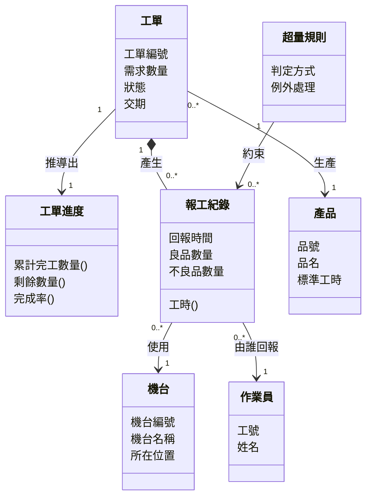

# 物件建模

你已經用實體關聯圖描述過系統要記住什麼。現在要學另一張看起來很像、但問的問題不同的圖：類別圖。

它們像到什麼程度？兩張圖都是方框加連線，方框裡都列著欄位，連線上都標著一對多。**很多學生第一次同時看到這兩張圖時，會直接把 ERD 換個框框重畫一次交上來。** 這樣做等於白花時間，因為它沒有提供任何 ERD 沒有的資訊。

本章要說清楚的就是這件事：類別圖到底多了什麼、什麼時候該用它、以及在這門課裡你需要畫到什麼程度。**答案是「概念層」——只放領域概念與它們的關係，不放方法、不放可見性、不放程式架構的東西。** 這是期末報告第 4 項的必做內容，也是本章前五節的範圍。

第六節之後屬於進階閱讀。有程式背景、想多做的同學可以往下讀，但那不是全班的最低要求，做了也不會取代必做項目的分數。

> **前情提要**：本章假設你已完成[「資料建模與資料庫設計」](07-Data-Modeling.md)的 ERD 與資料字典。**這個順序是刻意的**——先畫過一輪 ERD，才看得出概念類別圖多了什麼。本章沿用同一情境：某金屬沖壓工廠的生產報工與工單追蹤系統。

> **延伸閱讀**：期末報告第 4 項要交什麼，見[「報告內容」](../00-Course-Introduction/Report-Contents.md)。

> **期末必讀標記**：標題後加註 🔵 期末必讀 的小節，是期末小組報告八項產出直接會用到的內容。判準見[「系統設計範例報告說明」](../04-example-reports/Design-Phase-Deliverables.md)，成品的樣子見[「系統設計範例報告」](../04-example-reports/Design-Phase-Sample-Report.md)。未標記的小節仍屬課程範圍，只是期末不會直接產出。

## 一、為什麼要用物件的觀點 🔵 期末必讀

### 1.1 資料與行為原本是分開的

用 ERD 描述系統時，資料與行為是分開的：ERD 說有一張工單表、有哪些欄位；至於「工單怎麼從待分派變成生產中」「誰有權限取消工單」，寫在流程圖與需求文件的另一個地方。

[物件導向](https://zh.wikipedia.org/wiki/面向对象程序设计)（Object-Oriented）的想法是把兩者綁在一起：**工單這個東西，既有它的資料（編號、數量、狀態），也有它自己的行為（開工、暫停、完工）。** 資料與能對它做的事放在同一個地方，改動時比較不容易漏。

對沒有寫過物件導向程式的人，這個觀念其實不陌生。工廠裡的「工單」本來就不只是一張紙上的欄位，它還帶著一套規則：什麼狀態下能改需求量、誰能取消、完工了要做什麼。**物件的觀點只是把這套規則明確地掛在工單身上，而不是散落在各份文件裡。**

### 1.2 這門課要用到什麼程度 🔵 期末必讀

| 層次 | 內容 | 本課程 |
|---|---|---|
| 概念層 | 領域有哪些概念、彼此什麼關係 | **期末必做** |
| 設計層 | 加上方法、可見性、技術類別 | 可選 |
| 實作層 | 寫成程式碼 | 不涉及 |

**只到第一層。** 你要能畫出一張圖，說明這個領域有哪些概念、它們怎麼關聯。這件事不需要任何程式能力，需要的是對業務的理解。

## 二、類別、物件、屬性 🔵 期末必讀

### 2.1 類別與物件 🔵 期末必讀

**類別（Class）是一類東西的定義，物件（Object）是那一類東西的其中一個。**

「工單」是類別，`WO-20260315-001` 這張工單是物件。「機台」是類別，「一號沖床」是物件。類別像是模具，物件是用那個模具做出來的每一件產品。

畫圖時畫的永遠是類別，不是物件。你要描述的是「工單這種東西有哪些特徵」，而不是逐一列出目前的三百張工單。

### 2.2 屬性 🔵 期末必讀

屬性（Attribute）是類別的特徵，也就是每個物件都會有、但值各自不同的東西。工單的屬性包括工單編號、需求數量、狀態、交期。

**概念層的屬性只寫名稱就好**，不必寫型別、長度、可否為空，那些寫在資料字典裡。這一點是概念類別圖與 ERD 的分工：圖負責呈現有哪些概念與關係，細節留給字典。

### 2.3 方法先不管，但推導值要標出來 🔵 期末必讀

方法（Method 或 Operation）是這個類別能做的事，例如工單的「開工」「暫停」「結案」。

**概念類別圖不畫方法。** 理由有兩個：一是這門課要的是領域理解，不是程式設計；二是方法一旦開始畫，很容易滑進實作細節，變成一張只有寫過程式的人看得懂的圖，就失去了拿去和現場人員確認的價值。方法真正的畫法留到第六節，屬於進階內容。

**但有一種括號要畫：推導值。** 概念層上有些看起來像屬性的東西，其實不是記下來的資料，而是算出來的結果——工單的累計完工數量由報工紀錄加總得出，一筆報工的工時由起訖時間與停機分鐘算出。這些在圖上寫成 `累計完工數量()`，用一個空括號與真正的屬性區隔開。

這個標法在下一步就會派上用場：**括號結尾的東西，到了 ERD 要逐一決定它落不落成欄位**，而答案不一定是落。先在概念圖上標出來，這個決定才不會被漏掉；判準見[「資料建模與資料庫設計」](07-Data-Modeling.md)〈四、4.3〉。

## 三、類別之間的關係 🔵 期末必讀

### 3.1 關聯與多重性 🔵 期末必讀

**關聯（Association）表示兩個類別之間有關係**，線上通常標一個動詞說明是什麼關係，兩端標多重性（Multiplicity）說明各對應到幾個。

多重性的寫法：

| 寫法 | 意思 |
|---|---|
| `1` | 剛好一個 |
| `0..1` | 零個或一個 |
| `1..*` | 一個或多個 |
| `0..*` 或 `*` | 零個或多個 |

「一張工單產生零到多筆報工紀錄，一筆報工紀錄屬於剛好一張工單」，就寫成工單這端 `1`、報工紀錄那端 `0..*`。

**多重性會逼你把業務規則講清楚**：一筆報工紀錄可不可以同時屬於兩張工單？一台機台同時間能不能跑兩張工單？這些問題在畫圖時不回答，實作時就會被開發人員自行決定。

### 3.2 聚合與組合 🔵 期末必讀

這兩種是關聯的特殊形式，表示「整體與部分」：

| 關係 | 意思 | 例子 |
|---|---|---|
| 聚合（Aggregation） | 部分可以獨立存在 | 生產線由多台機台組成，但機台搬走還是機台 |
| 組合（Composition） | 部分不能獨立存在 | 工單由多個工序項組成，工單刪了工序項就沒有意義 |

**這兩者在課程報告中點到為止即可。** 實務上連資深工程師都常爭論某個關係該畫聚合還是組合，而畫錯的代價很小。判斷不出來時就畫成一般關聯，不會扣分。

### 3.3 一般化

一般化（Generalization）表示「某類是另一類的特殊情況」，也就是繼承。

報工系統裡，「線長」是「作業員」的特殊化——線長能做作業員的所有事，另外還能分派工單。這與[「使用者分析」](03-User-Analysis.md)〈六、6.3〉使用案例圖上的一般化是同一個概念。

**用不用得到，取決於題目。** 如果你的領域裡有明顯的「某種東西是另一種東西的特例」，畫出來很有幫助；沒有的話不必硬找。

## 四、概念類別圖 🔵 期末必讀

### 4.1 怎麼找出概念 🔵 期末必讀

方法與[「資料建模與資料庫設計」](07-Data-Modeling.md)〈三、3.1〉的名詞分析法相同：從需求、使用案例敘述與流程描述裡圈出名詞，判斷哪些是這個領域的核心概念。

但概念類別圖多問一個問題：**這個概念是不是有自己的規則？**

以「借用額度」為例。在 ERD 上，它可能只是使用者表上的一個欄位 `quota`。但它其實有自己的規則：額度怎麼計算、什麼情況會被凍結、逾期會不會扣減。**當一個東西有自己的一套規則時，它在概念層就值得獨立成一個概念**，即使在資料庫裡它只是一欄。

### 4.2 只放領域概念 🔵 期末必讀

概念類別圖上 **只能出現業務人員聽得懂的東西**。這是一條硬規則，也是判斷你有沒有畫對的最快方法。

| ✅ 可以出現 | ❌ 不該出現 |
|---|---|
| 工單、報工紀錄、機台、作業員 | 資料庫連線、控制器、資料存取物件 |
| 借用單、器材、借用額度 | 登入 Session、快取、設定檔 |

判準是：**把這張圖拿給現場的線長看，他認不認得上面每一個方框？** 認不得的，就是不該出現在概念層的東西。

### 4.3 報工系統的概念類別圖 🔵 期末必讀

每個方框都是現場人員講得出來的東西，方框裡只列屬性名稱、沒有型別，連線上有動詞與多重性。**這樣一張圖就達到期末報告第 4 項的要求了**，不需要更複雜。

真正要看的是這張圖上 **有兩個東西不會變成資料表**：

| 概念 | 為什麼不進資料表 | 那它去了哪裡 |
|---|---|---|
| 工單進度 | 三個屬性全是括號結尾的推導值，本身沒有任何要記下來的資料 | 查詢時由報工紀錄即時加總算出 |
| 超量規則 | 它是一條規則，不是一份資料 | 落在功能模組的檢核邏輯裡，見[「功能分析與模組設計」](05-Functional-Analysis.md)〈六〉 |

**畫得出這兩個方框，這一步才算真的發生了。** 如果你的概念類別圖上每個方框都恰好對應一張資料表，一個都不多，那它就只是 ERD 換了一次框線——這是這張圖最常見、也最容易被看出來的失分方式。反過來說，**把「已知它存在但這次不落地」的概念畫上去並說明它去了哪裡，比乾脆不畫有價值得多**：不畫，讀者以為你沒想到；畫了並說明，讀者知道你評估過。

## 五、概念類別圖與 ERD 差在哪 🔵 期末必讀

這是本章最重要的一節。兩張圖看起來像，但有三個實質差別。

### 5.1 概念類別圖可以放不入庫的東西 🔵 期末必讀

ERD 上的每個實體，最後都要變成一張資料表，它描述的是「要儲存什麼」。概念類別圖描述的是「這個領域有哪些概念」，**其中有些概念不會、也不需要被儲存**。

| 概念 | 在 ERD 上 | 在概念類別圖上 |
|---|---|---|
| 工單 | 一張表 | 一個類別 |
| 借用額度規則 | 沒有對應的表（寫在程式邏輯裡） | 可以是一個類別 |
| 逾期計算方式 | 沒有 | 可以是一個類別 |
| 產量日報 | 通常沒有表（即時算出來） | 可以是一個類別 |

**這是概念類別圖唯一無法被 ERD 取代的地方。** 一個領域裡有規則、有計算方式、有暫時性的概念，它們都是這個領域的一部分，但不見得要存進資料庫。

### 5.2 標的是語意關係，不是外鍵 🔵 期末必讀

ERD 上「報工紀錄」與「工單」之間那條線，代表的是 `work_order_no` 這個外鍵欄位。概念類別圖上那條線代表的是「工單產生報工紀錄」這個業務事實，線上會寫動詞。

差別在於：**ERD 的關係一定是靠欄位實作的，概念類別圖的關係只需要在業務上成立。** 「借用額度規則」與「借用單」之間有關係（規則決定了單子能不能成立），但資料庫裡沒有任何欄位連接它們。

### 5.3 多對多不必拆 🔵 期末必讀

ERD 遇到多對多必須拆成中間表，因為關聯式資料庫存不了多對多。概念類別圖 **不必拆**——它不是資料庫設計，直接畫一條 `*` 對 `*` 的線就好。

當然，如果那段關係本身有需要記錄的資訊（授權日期、授權人），還是要獨立成一個類別。但那是因為它確實是一個概念，不是因為資料庫的限制。

### 5.4 什麼時候該畫哪一張 🔵 期末必讀

| 你想回答 | 用哪張圖 |
|---|---|
| 系統要儲存什麼、存成哪幾張表 | ERD |
| 這個領域有哪些概念、規則掛在誰身上 | 概念類別圖 |
| 資料表之間怎麼串 | ERD |
| 業務概念之間是什麼關係 | 概念類別圖 |

**兩張圖的絕大部分內容會重疊，這是正常的**，因為多數領域概念確實需要被儲存。差別在那少數不重疊的地方——而那正是概念類別圖的價值所在。畫完之後如果發現兩張圖一模一樣，就要問自己：這個領域裡真的沒有任何不入庫的規則或計算嗎？

## 六、設計類別圖（進階閱讀）

以下屬於可選內容。**不做不扣分**，但如果你的組別有人有程式背景、想往下走一層，這一節說明差別在哪。

### 6.1 加上方法與可見性

[類別圖](https://zh.wikipedia.org/wiki/类图)在設計階段會補上兩樣東西。

**方法**：這個類別能做什麼，寫在屬性下方。工單類別可能有 `開工()`、`暫停(原因)`、`結案()`。

**可見性**：屬性與方法能不能被外部存取，用符號標示：`+` 公開、`-` 私有、`#` 受保護。這個概念與封裝有關：把屬性設為私有、只透過方法修改，可以確保狀態改變時該檢查的規則都被檢查過。

### 6.2 加上技術類別

設計類別圖會出現概念層沒有的東西：

| 類別 | 職責 |
|---|---|
| Controller | 接收使用者請求，決定呼叫哪些業務邏輯 |
| Service | 執行跨多個物件的業務流程 |
| Repository | 負責與資料庫溝通，把資料轉成物件 |

這些是軟體架構的分工，不是業務概念。**它們一旦出現在圖上，這張圖就不能拿給現場人員確認了**——這也是為什麼概念層與設計層要分開。

### 6.3 做了要能說明

依[「報告內容」](../00-Course-Introduction/Report-Contents.md)期末的技術深度原則，完整的設計類別圖列為可選項目。**選擇做的話，必須做對，而且要能在個人訪談中說明每個技術類別為什麼存在。** 畫了一張看起來專業但講不出所以然的圖，比不畫更糟。

## 七、類別圖與循序圖互相檢查

概念類別圖畫完之後，與[「行為建模」](06-Behavioral-Modeling.md)的循序圖交叉檢查，可以抓出兩類遺漏。

**循序圖上傳遞的資料，要在類別圖上找得到。** 循序圖的訊息寫成「輸入完工數量(數量, 機台編號)」，那麼「數量」與「機台編號」要能對應到類別的屬性或關聯。對不上，代表類別圖漏了東西。

**類別圖上的每個概念，要在某個流程裡被用到。** 一個類別如果從頭到尾沒有出現在任何流程或畫面上，要問自己：它是真的需要，還是憑感覺加上去的？

這兩條檢查與[「行為建模」](06-Behavioral-Modeling.md)〈七〉的追溯表性質相同，都是在確認各份文件在描述同一套系統。

## 八、學習重點總結

讀完本章後，你應該能夠理解以下核心概念，並將其應用於工業場域的思考與決策：

**物件的觀點是把資料與規則綁在一起**

用 ERD 描述時，工單的欄位在一個地方、工單的規則在另一個地方；物件的觀點把兩者掛在同一個概念上。好處在改動的時候看得出來：規則散在需求文件、流程圖與資料字典三處，改了兩處漏掉一處，就是日後的資料矛盾；掛在同一個概念上，要找的地方只有一個。

**概念類別圖上只能出現業務人員聽得懂的東西**

判斷有沒有畫對，最快的方法是把圖拿給現場的線長看，問他認不認得每一個方框。Controller、Repository、Session 這類東西一旦出現，能替這張圖背書的就只剩開發人員，而他們不知道現場的規則實際上長什麼樣。

**它與 ERD 的差別在那少數不重疊的地方**

兩張圖的多數內容會重疊，因為領域概念確實多半需要儲存。真正的差別有三處：概念類別圖可以放不入庫的規則與計算、標的是語意關係而非外鍵、多對多不必拆成中間表。畫完發現兩張圖一模一樣時，要回頭問這個領域裡真的沒有任何不入庫的規則嗎。

**多重性逼你把業務規則講清楚**

一筆報工紀錄能不能同時屬於兩張工單、一台機台同時能不能跑兩張工單——這些問題在標多重性時就得回答。不回答，實作時開發人員會自行決定，而他的決定不一定符合現場的做法。這是概念類別圖最實際的產出。

**畫到概念層就夠了**

方法、可見性、Controller 與 Repository 屬於設計層，本課程列為可選。往下走一層不會取代必做項目的分數，但會佔掉可觀的時間，而且訪談時說不清楚反而扣分。把概念層畫對、講得出每條關係的理由，比畫一張看起來專業的設計類別圖有價值。

**圖與圖之間要對得起來**

循序圖上傳遞的資料要在類別圖上找得到；類別圖上的每個概念要在某個流程裡被用到。這兩條交叉檢查與前面各章的追溯要求是同一件事：所有的圖都在描述同一套系統，對不上就是有東西漏了或改了沒同步。

> **銜接提示**：本章處理系統內部的概念，下一章[「系統介面與資料交換設計」](11-System-Interface-and-Data-Exchange.md)轉向系統之外：兩套系統之間怎麼交換資料、誰給誰、什麼時候給、給失敗了怎麼辦。那是工廠裡最容易出事、卻最少人負責的一條線。

## 參考文獻

- Ambler, S. W. (2004). *The object primer: Agile model-driven development with UML 2.0* (3rd ed.). Cambridge University Press.
- Arlow, J., & Neustadt, I. (2005). *UML 2 and the unified process: Practical object-oriented analysis and design* (2nd ed.). Addison-Wesley.
- Booch, G. (1994). *Object-oriented analysis and design with applications* (2nd ed.). Benjamin/Cummings.
- Booch, G., Rumbaugh, J., & Jacobson, I. (2005). *The unified modeling language user guide* (2nd ed.). Addison-Wesley.
- Coad, P., & Yourdon, E. (1991). *Object-oriented analysis* (2nd ed.). Yourdon Press.
- Dennis, A., Wixom, B. H., & Tegarden, D. (2015). *Systems analysis and design: An object-oriented approach with UML* (5th ed.). Wiley.
- Evans, E. (2003). *Domain-driven design: Tackling complexity in the heart of software*. Addison-Wesley.
- Fowler, M. (2003). *UML distilled: A brief guide to the standard object modeling language* (3rd ed.). Addison-Wesley.
- Fowler, M. (2002). *Patterns of enterprise application architecture*. Addison-Wesley.
- Gamma, E., Helm, R., Johnson, R., & Vlissides, J. (1994). *Design patterns: Elements of reusable object-oriented software*. Addison-Wesley.
- Jacobson, I., Christerson, M., Jonsson, P., & Övergaard, G. (1992). *Object-oriented software engineering: A use case driven approach*. Addison-Wesley.
- Larman, C. (2004). *Applying UML and patterns: An introduction to object-oriented analysis and design and iterative development* (3rd ed.). Prentice Hall.
- Martin, R. C. (2003). *Agile software development: Principles, patterns, and practices*. Prentice Hall.
- Meyer, B. (1997). *Object-oriented software construction* (2nd ed.). Prentice Hall.
- Object Management Group. (2017). *OMG unified modeling language (OMG UML), version 2.5.1*. https://www.omg.org/spec/UML/2.5.1/
- Parnas, D. L. (1972). On the criteria to be used in decomposing systems into modules. *Communications of the ACM*, *15*(12), 1053–1058. https://doi.org/10.1145/361598.361623
- Rumbaugh, J., Blaha, M., Premerlani, W., Eddy, F., & Lorensen, W. (1991). *Object-oriented modeling and design*. Prentice Hall.
- Rumbaugh, J., Jacobson, I., & Booch, G. (2004). *The unified modeling language reference manual* (2nd ed.). Addison-Wesley.
- Satzinger, J. W., Jackson, R. B., & Burd, S. D. (2016). *Systems analysis and design in a changing world* (7th ed.). Cengage Learning.
- Sommerville, I. (2016). *Software engineering* (10th ed.). Pearson.
- Wirfs-Brock, R., & McKean, A. (2003). *Object design: Roles, responsibilities, and collaborations*. Addison-Wesley.

---

*本章的必讀範圍到〈五〉為止，那是期末報告第 4 項的要求。建議的延伸練習是：拿自己組已經畫好的 ERD，改畫成概念類別圖，然後比對兩張圖的差異——如果完全一樣，回頭找找這個領域裡有沒有哪條規則、哪個計算方式、哪份即時產生的報表，是資料庫裡沒有但業務上確實存在的。找到的那幾個，就是 ERD 表達不出來、只有概念類別圖裝得下的東西。*
