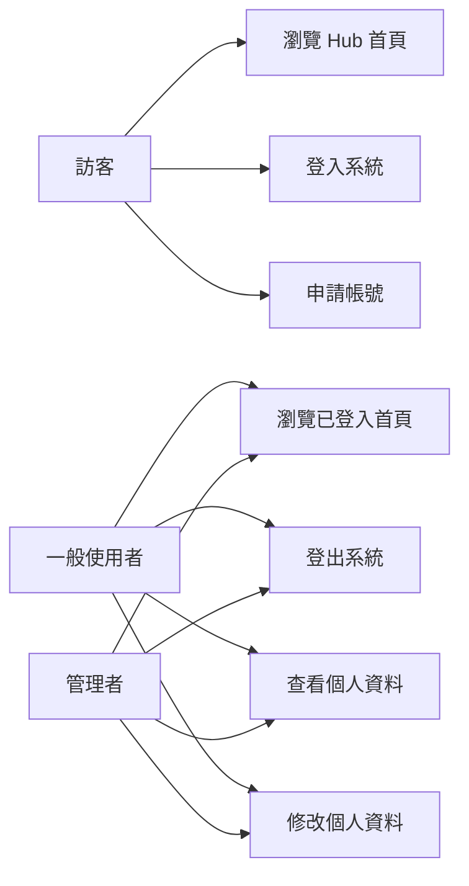
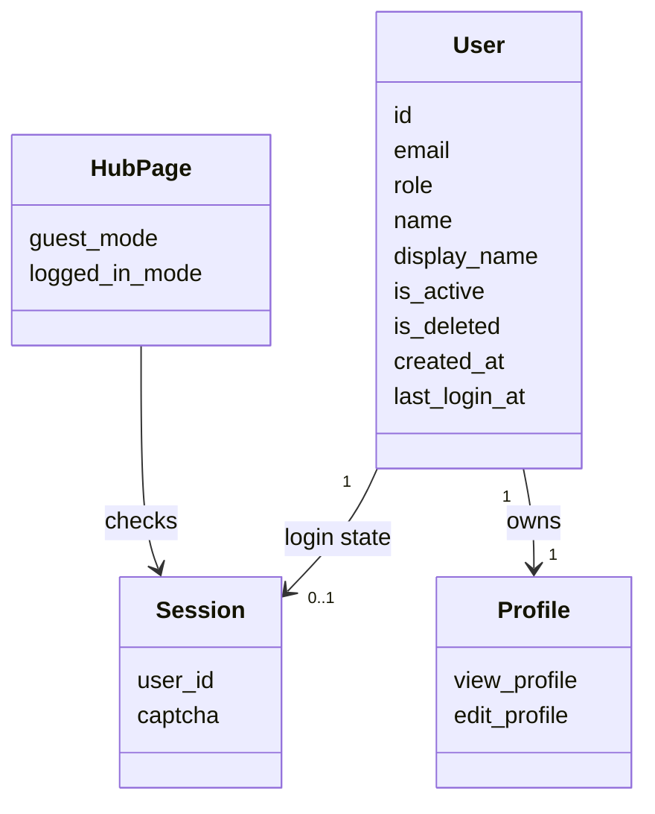
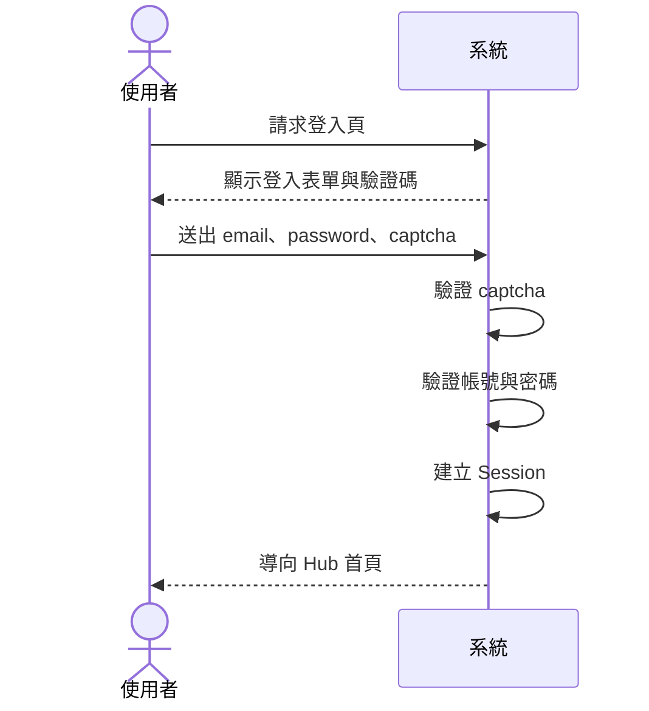
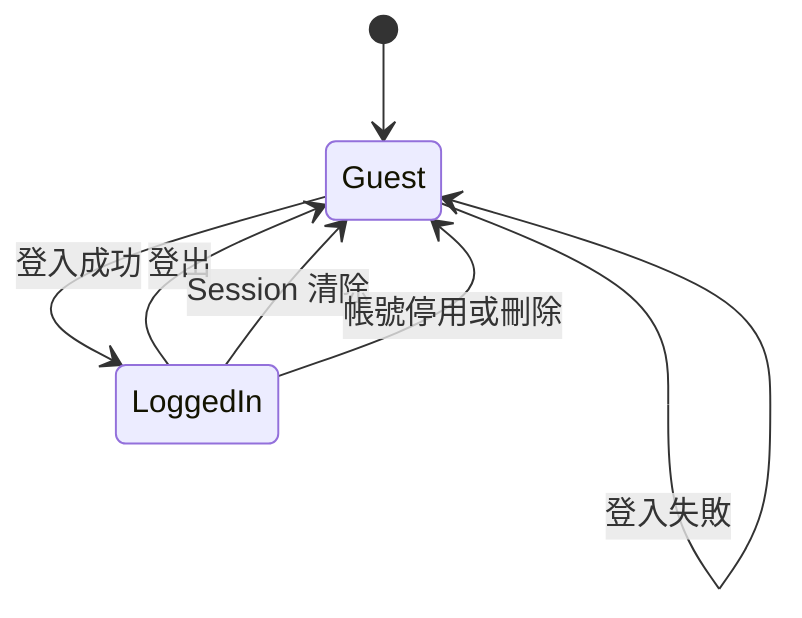

# 系統分析階段繳交規範

## 一、階段定位

系統分析階段的重點是「理解問題與需求」，不是急著設計畫面或撰寫程式。學生需要能說明系統為什麼存在、誰會使用、目前有哪些流程、系統應該提供哪些功能，以及需求的優先順序。

本課程提供一套可以實際操作的範例系統，並附上完整程式碼。請實際操作這套系統並對照程式碼，從中歸納出它可能有哪些需求，了解它的基本結構，釐清資料儲存與流動的方式。做完這幾件事，就能初步理解系統分析在做的是什麼事。

若以範例系統 `Course-SAD-Sample-System` 為基準，分析範圍可限定為以下三個子系統：

| 子系統 | 文件 |
|---|---|
| Hub 首頁 | `document/hub.md` |
| 登入與帳號 | `document/auth.md` |
| 個人資料管理 | `document/profile.md` |

這套範例是上課講解用的會員系統，各組拿到的題目不同，可以參考它的架構，但不必每一項都照做，也不限於這些項目，該分析哪些內容由你們自己的題目決定。

遇到不確定的地方，請多思考、翻課本、找資料，也可以請 AI 幫你梳理與釐清思路。但你必須看懂 AI 給你的東西，採用之前要能自己說明那些概念是什麼，不能複製貼上就收工。使用 AI 的揭露義務見[「SAD 課程介紹」](../00-Course-Introduction/Course-Introduction.md)〈AI 工具使用揭露〉。

就算你動用 Claude Code、Codex 這類進階工具，直接把這份範本丟給 AI，叫它照格式生出一份報告書，老師其實不介意，這件事也沒什麼好遮掩的，你手上這份文件本身就是老師用 AI 協助梳理與撰寫出來的。問題在於，AI 生給你的這些東西，你真的懂嗎？懂或不懂，會在口頭報告與期末個人訪談的問答裡直接顯現出來。

---

## 二、學生應繳交項目

## 1. 問題定義書（這個其實可以最後再做）

學生需說明系統背景、欲解決的問題、目標使用者、使用情境、目前痛點與系統預期價值。

這一項排在第 1，是因為它是報告書的第一章，讀者要先看到；編號是閱讀順序，不是你動手的順序。真正要寫進去的東西，例如這個系統在解決什麼問題、對誰有價值，都得把後面幾項（角色、現況流程、需求、優先順序）盤過一遍才答得出來。太早動筆，多半只能寫出「提升效率」、「改善流程」這種換到任何一個系統都成立的句子。

建議先寫一份草稿當作分析方向，等第 2 到第 8 項做完，再回頭改成說得出理由的版本。你會發現一開始寫的問題定義，跟做完分析後的版本往往差很多，這個落差本身就是分析的成果。

### 建議內容

| 項目 | 說明 |
|---|---|
| 系統背景 | 說明這是一個什麼系統，為何需要此系統 |
| 分析範圍 | 說明本階段分析哪些子系統或功能 |
| 欲解決問題 | 說明使用者目前遇到什麼問題 |
| 目標使用者 | 說明主要使用者與相關角色 |
| 使用情境 | 說明使用者在什麼情況下會使用系統 |
| 系統價值 | 說明系統完成後能帶來什麼效益 |

### 範例方向

以 Hub、Auth、Profile 三個子系統為例，學生應能說明：

| 項目 | 範例 |
|---|---|
| 系統背景 | 這是一個課程用的 SAD 範例系統 |
| 分析範圍 | Hub 首頁、登入與帳號、個人資料管理 |
| 欲解決問題 | 讓使用者能進入系統、登入帳號、查看服務、管理個人資料 |
| 目標使用者 | 訪客、一般使用者、管理者、系統維護者 |
| 系統價值 | 提供一個可觀察登入狀態、資料流與模組分工的範例系統 |

---

## 2. 利害關係人與使用者分析

學生需列出與系統有關的所有角色，並說明每個角色的需求、權限與使用情境。

**利害關係人（stakeholder）** 指的是會影響系統、或會被系統影響的人，範圍比「使用者」大。直接操作畫面的是使用者；出錢決定要不要做這套系統、負責維護資料庫、事後要調閱紀錄的人，多半不會碰到畫面，但他們的要求一樣會變成系統的需求。以工廠的生產排程系統為例，現場操作員是使用者，生管主管、資訊人員與稽核人員則是不操作系統卻有話語權的利害關係人。

這一項要早點做，因為需求是跟著角色長出來的：漏掉一個角色，就會連帶漏掉他那一組功能、權限規則與例外情況。這張表還會直接延伸到後面兩處，〈5. Use Case 或 User Story 文件〉的主要角色欄位，以及〈三、分析階段建議 UML 圖樣〉裡使用案例圖（Use Case Diagram）旁邊那排 actor（角色），都是從這裡搬過去的。角色沒列全，圖上就會缺人，跟著缺的是那個人會用到的功能。

找角色的方法是把流程從頭走一遍，逐一問：誰輸入資料、誰查看資料、誰維護系統、誰為結果負責。

### 建議角色

| 角色 | 主要需求 |
|---|---|
| 訪客 | 瀏覽首頁、查看公開服務、登入、申請帳號 |
| 一般使用者 | 登入、登出、查看個人資料、修改個人資料 |
| 管理者 | 具有不同角色身分，未來可擴充管理功能 |
| 系統維護者 | 維護帳號資料、登入流程、資料庫與程式模組 |
| 教師 / 助教 | 使用系統作為教學與分析範例 |

### 建議分析欄位

| 欄位 | 說明 |
|---|---|
| 角色名稱 | 使用者或利害關係人的名稱 |
| 使用目標 | 此角色使用系統的主要目的 |
| 主要需求 | 此角色需要系統提供哪些功能 |
| 權限範圍 | 此角色可以使用哪些功能、不能使用哪些功能 |
| 使用限制 | 可能遇到的操作、資訊或權限限制 |

---

## 3. 現況流程分析

學生需描述目前系統或原始流程如何運作。若系統已存在，應分析既有流程；若是新系統，則分析使用者目前如何處理問題。

### 建議至少分析的流程

| 流程 | 說明 |
|---|---|
| 訪客進入 Hub 首頁 | 未登入使用者看到公開服務與登入入口 |
| 已登入者進入 Hub 首頁 | 系統根據 Session 顯示已登入首頁 |
| 使用者登入流程 | 輸入 email、password、captcha，通過驗證後建立 Session |
| 使用者申請帳號流程 | 輸入帳號資料，通過驗證後建立使用者 |
| 使用者登出流程 | 清除 Session 並返回登入頁 |
| 查看個人資料流程 | 已登入使用者查看自己的資料 |
| 修改個人資料流程 | 已登入使用者修改姓名與顯示名稱 |

### 建議描述格式

每一個流程可用以下格式描述：

```text
流程名稱：
主要角色：
前置條件：
主要步驟：
例外情況：
流程完成後狀態：
```

---

## 4. 需求規格初稿

學生需整理功能需求與非功能需求。需求應盡量具體，避免只寫「系統要好用」或「系統要安全」這類無法驗證的描述。

## 4.1 功能需求

功能需求說明系統應該提供哪些功能。

### 範例

| 編號 | 功能需求 |
|---|---|
| FR-01 | 系統應提供首頁入口 |
| FR-02 | 系統應支援訪客模式 |
| FR-03 | 系統應支援已登入模式 |
| FR-04 | 系統應提供登入功能 |
| FR-05 | 系統應提供驗證碼功能 |
| FR-06 | 系統應提供申請帳號功能 |
| FR-07 | 系統應提供登出功能 |
| FR-08 | 系統應提供個人資料檢視功能 |
| FR-09 | 系統應提供個人資料修改功能 |
| FR-10 | 系統應阻擋未登入者進入個人資料頁 |

## 4.2 非功能需求

非功能需求說明系統品質、限制、效能、安全性、可維護性等要求。

### 範例

| 編號 | 非功能需求 |
|---|---|
| NFR-01 | 密碼不得以明文儲存 |
| NFR-02 | 登入需進行驗證碼檢查 |
| NFR-03 | 系統需以 Session 維持登入狀態 |
| NFR-04 | 未登入者不得查看個人資料 |
| NFR-05 | 帳號停用或刪除後不得繼續使用系統 |
| NFR-06 | 錯誤訊息應清楚但避免洩漏過多帳號資訊 |
| NFR-07 | 系統模組應清楚分工，方便維護 |

---

## 5. Use Case 或 User Story 文件

學生至少需提供主要使用情境。

### 建議 Use Case

| Use Case | 主要角色 |
|---|---|
| UC-01 訪客瀏覽 Hub 首頁 | 訪客 |
| UC-02 使用者登入系統 | 訪客 / 一般使用者 |
| UC-03 使用者申請帳號 | 訪客 |
| UC-04 使用者登出系統 | 一般使用者 |
| UC-05 使用者查看個人資料 | 一般使用者 |
| UC-06 使用者修改個人資料 | 一般使用者 |

### Use Case 建議欄位

| 欄位 | 說明 |
|---|---|
| Use Case 名稱 | 例如：使用者登入系統 |
| 主要角色 | 執行此功能的人 |
| 前置條件 | 執行前必須成立的條件 |
| 觸發條件 | 何時開始此 Use Case |
| 主要流程 | 正常情況下的操作步驟 |
| 例外流程 | 錯誤、失敗或特殊情況 |
| 後置條件 | 流程完成後的狀態 |
| 對應需求 | 對應到哪些 FR / NFR |

---

## 6. 需求優先順序表

學生需將需求分級，避免專題範圍失控。

### 建議使用 MoSCoW 分類

| 類型 | 說明 | 範例 |
|---|---|---|
| Must have | 必須完成 | 登入、登出、Session、個人資料查看 |
| Should have | 應該完成 | 首頁登入表單、表單錯誤提示 |
| Could have | 可以完成 | 忘記密碼、修改密碼、登入失敗次數限制 |
| Won’t have | 本階段不做 | 第三方登入、多因素驗證、完整管理後台 |

---

## 7. 資料需求分析

學生需說明系統需要哪些資料、資料來源、資料用途與資料更新時機。

### users 資料表範例

| 欄位 | 用途 |
|---|---|
| id | 使用者唯一識別碼 |
| email | 登入帳號 |
| hash | 密碼雜湊 |
| role | 使用者角色 |
| name | 使用者姓名 |
| display_name | 顯示名稱 |
| is_active | 帳號是否啟用 |
| is_deleted | 帳號是否刪除 |
| created_at | 帳號建立時間 |
| last_login_at | 最後登入時間 |

### Session 資料範例

| Session Key | 用途 |
|---|---|
| `session['user_id']` | 判斷目前登入使用者 |
| `session['captcha']` | 儲存驗證碼答案 |

---

## 8. 風險分析

學生需列出系統可能遇到的風險與因應策略。

### 範例

| 風險 | 說明 | 因應策略 |
|---|---|---|
| Session 與帳號狀態不一致 | 使用者登入後帳號被停用或刪除 | 每次進入重要頁面都重新檢查帳號狀態 |
| 密碼安全風險 | 密碼不可明文儲存 | 使用 bcrypt 雜湊 |
| 使用者忘記密碼 | 目前系統未提供忘記密碼 | 列為後續擴充需求 |
| 個人資料可被清空 | name 與 display_name 可能被清空 | 後續可加入欄位規則 |
| 驗證碼影響便利性 | 每次登入都需輸入 captcha | 可評估是否只在登入失敗後啟用 |

---

## 9. 分析階段簡報

學生需將分析結果上台說明。

### 建議報告時間

每組 8 至 10 分鐘，問答 3 至 5 分鐘。

### 建議報告內容

| 時間 | 報告內容 |
|---:|---|
| 1 分鐘 | 專題背景與分析範圍 |
| 1 分鐘 | 使用者與利害關係人 |
| 2 分鐘 | 現況流程與主要問題 |
| 2 分鐘 | 功能需求與非功能需求 |
| 2 分鐘 | Use Case 重點 |
| 1 分鐘 | 資料需求與風險 |
| 3 至 5 分鐘 | 問答 |

---

# 三、分析階段建議 UML 圖樣

分析階段不需要太多技術細節，圖的重點是讓學生能描述「誰使用系統」、「系統提供什麼功能」、「流程如何發生」。

## 1. Use Case Diagram：使用案例圖

用途：呈現使用者角色與系統功能的關係。

建議一定要有。

### 建議內容



正式 UML 可用橢圓表示 Use Case，系統邊界框標示為「Course SAD Sample System」。

---

## 2. Activity Diagram：活動圖

用途：呈現使用者完成某個任務的流程。

建議至少要有 2 至 3 張。

### 建議繪製

| 活動圖 | 用途 |
|---|---|
| 登入活動圖 | 描述 captcha、帳密驗證、Session 建立 |
| 註冊活動圖 | 描述資料輸入、格式檢查、建立帳號 |
| 個人資料更新活動圖 | 描述登入檢查、資料輸入、更新資料庫 |
| Hub 首頁狀態判斷活動圖 | 描述訪客與已登入者看到不同畫面 |

---

## 3. Domain Model / Conceptual Class Diagram：概念類別圖

用途：分析系統中有哪些重要概念，以及概念之間的關係。

分析階段建議使用「概念類別圖」，不急著放方法或程式類別。

### 範例



---

## 4. System Sequence Diagram：系統循序圖

用途：描述外部使用者與系統之間的互動，不必進入太細的內部物件呼叫。

分析階段可選擇 1 至 2 張作為加分。

### 建議繪製

| 系統循序圖 | 說明 |
|---|---|
| 使用者登入系統 | 使用者送出登入資料，系統回應成功或失敗 |
| 使用者修改個人資料 | 使用者送出資料，系統更新後回到個人資料頁 |

### 簡化範例



---

## 5. State Machine Diagram：狀態機圖

用途：說明使用者登入狀態或帳號狀態如何轉換。

分析階段可列為加分。

### 使用者登入狀態圖



---

# 四、分析階段最低繳交標準

| 項目 | 必備 |
|---|---|
| 問題定義書 | 是 |
| 利害關係人與使用者分析 | 是 |
| 現況流程分析 | 是 |
| 功能需求與非功能需求 | 是 |
| Use Case 文件 | 是 |
| 需求優先順序表 | 是 |
| 資料需求分析 | 建議必備 |
| 風險分析 | 建議必備 |
| Use Case Diagram | 是 |
| Activity Diagram | 是 |
| Conceptual Class Diagram / Domain Model | 建議 |
| System Sequence Diagram | 加分 |
| State Machine Diagram | 加分 |
| 分析階段簡報 | 是 |

---

# 五、建議繳交檔案結構

```text
analysis/
├── 01_problem-definition.md
├── 02_stakeholder-user-analysis.md
├── 03_current-process-analysis.md
├── 04_requirements-specification.md
├── 05_use-cases.md
├── 06_requirement-priority.md
├── 07_data-requirements.md
├── 08_risk-analysis.md
└── analysis-presentation.pdf

diagrams/
├── use-case-diagram.png
├── activity-login.png
├── activity-profile-update.png
├── conceptual-class-diagram.png
├── system-sequence-login.png
└── state-login.png
```

---

# 六、教師評閱重點

| 評閱面向 | 檢查重點 |
|---|---|
| 問題理解 | 是否清楚說明系統目的、使用者與問題 |
| 需求完整性 | 是否涵蓋主要功能與非功能需求 |
| 流程合理性 | 是否能清楚描述使用者與系統互動 |
| Use Case 品質 | 是否包含前置條件、主要流程、例外流程與後置條件 |
| 圖表品質 | UML 圖是否能輔助說明，而不是只是裝飾 |
| 範圍控制 | 是否能區分 Must、Should、Could、Won’t have |
| 分析深度 | 是否說明資料、權限、風險與限制 |
