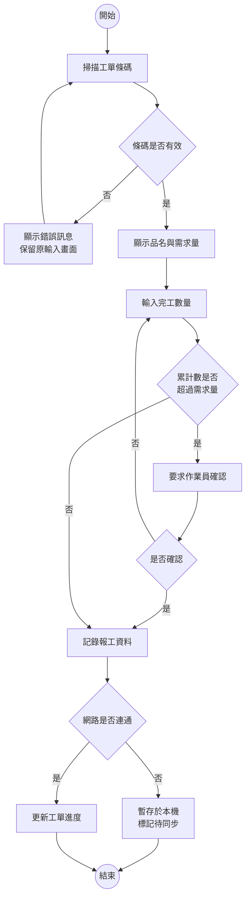
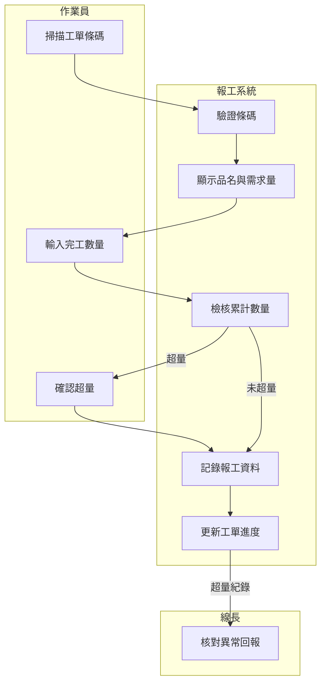
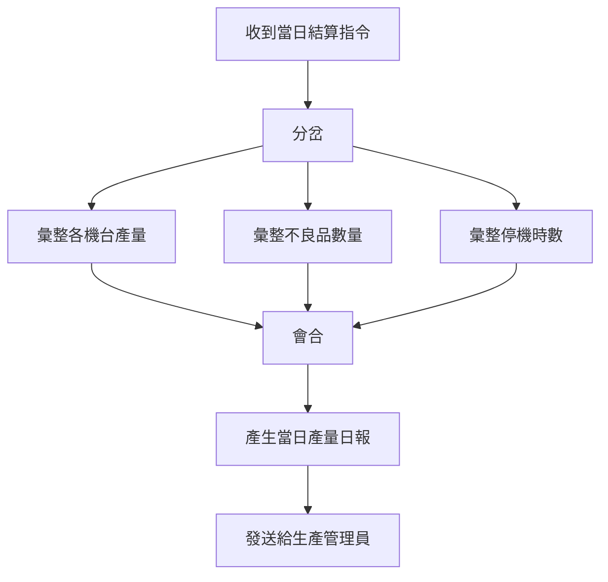
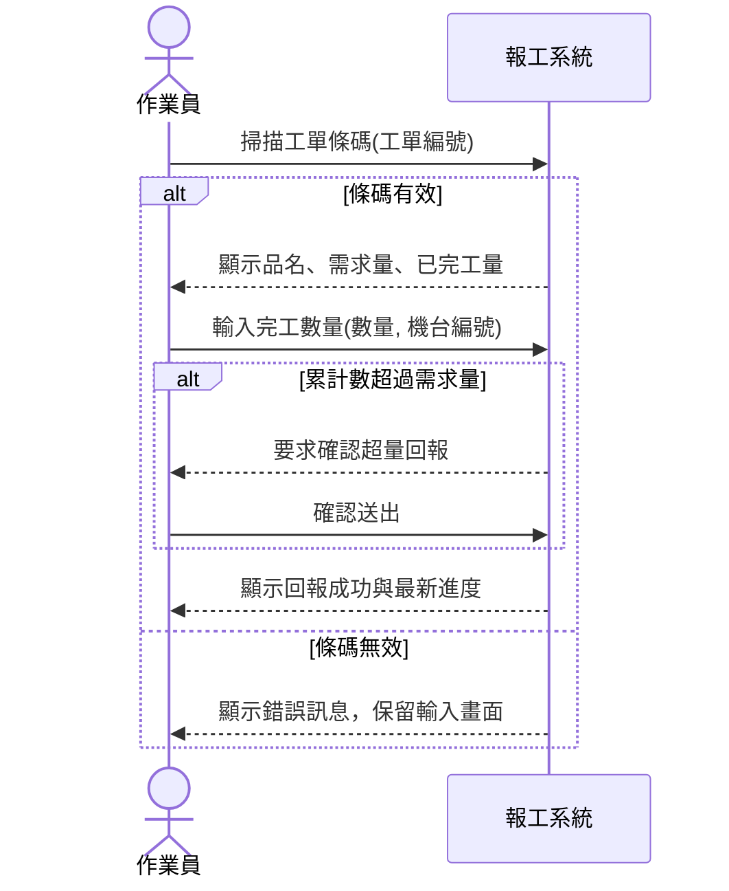
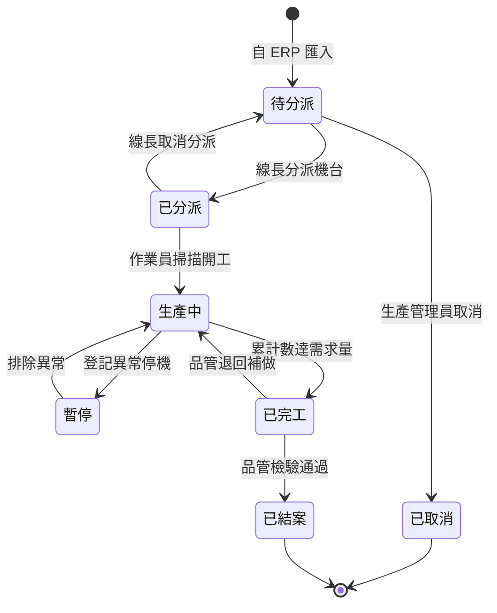
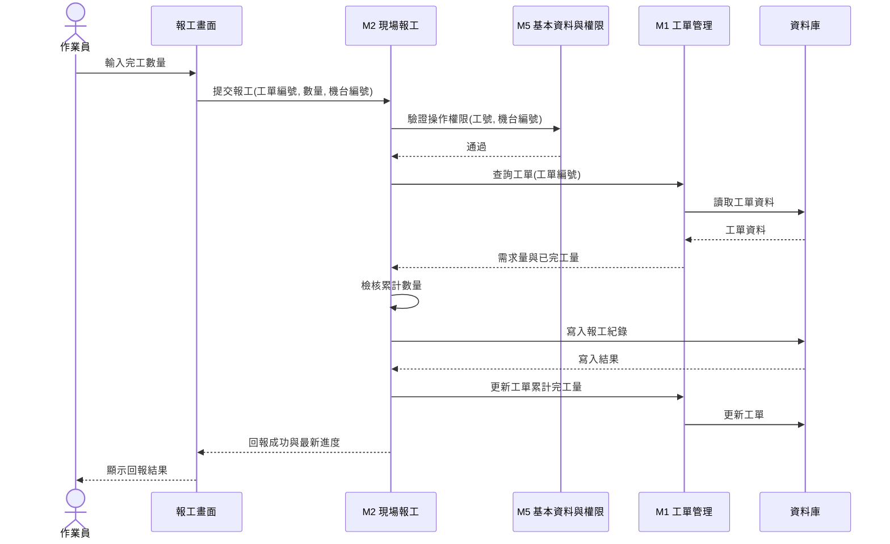

# 行為建模

功能清單上有一行寫著「F-022　回報完工數量」。這一行看起來已經把事情交代清楚了，但把它交給開發人員，第一個問題就會冒出來：作業員掃了條碼之後，系統是先檢核數量還是先寫入資料庫？如果數量超過需求量，是擋下來還是讓他確認？網路斷線的那三十秒裡，作業員按下的送出鍵去了哪裡？

這些問題的答案都不在功能結構裡。功能分解回答的是「系統由哪些部分組成」，而上面每一個問題問的都是「事情按什麼次序發生」。前者是靜態的結構，後者是動態的行為，兩者是同一套系統的兩個切面，缺一份都做不出可以實作的規格。

本章補上行為這一面，介紹三張圖：**活動圖** 描述流程怎麼走與在哪裡分岔，**循序圖** 描述參與者與系統之間來回傳遞了什麼訊息，**狀態機圖** 描述一個資料物件從誕生到結束經歷哪些狀態。三張圖看的是同一件事的不同角度，也各自能抓出不同類型的遺漏。

> **前情提要**：本章假設你已完成[「使用者分析」](User-Analysis.md)的使用案例分析、[「系統需求分析」](System-Requirements-Analysis.md)的需求條列，以及[「功能分析」](Functional-Analysis.md)的系統邊界與功能結構。本章沿用同一情境（某金屬沖壓工廠導入生產報工與工單追蹤系統）與同一套編號體例（UC-01 為「回報完工數量」、FR-010 起為其展開的功能需求、F-021 起為功能代號）。

> **延伸閱讀**：這三張圖在各組報告中的繳交格式與最低標準，見[「系統分析階段繳交規範」](../example-system/Analysis-Phase-Deliverables.md)〈三、分析階段建議 UML 圖樣〉與[「系統設計階段繳交規範」](../example-system/Design-Phase-Deliverables.md)。

## 一、結構之外還要描述行為

### 1.1 為什麼系統邊界確定之後才能畫

行為建模必須排在功能分析之後，理由在於這三張圖都需要一個已經確定的系統邊界。

循序圖要畫「參與者對系統說了什麼、系統回了什麼」，那個「系統」是一個方塊，方塊的範圍就是系統邊界。邊界還沒定的時候畫這張圖，圖上那個方塊代表什麼其實是含糊的——它可能包含 ERP，也可能不包含，兩種畫法會得到完全不同的訊息序列。活動圖同理：哪些動作畫在系統的泳道裡、哪些留在人的泳道裡，取決於這件事是不是系統的責任。

所以順序是：先有使用案例（誰要做什麼）、再有需求（做到什麼程度）、再有邊界與功能結構（系統負責哪些事），最後才能描述行為。跳過前面直接畫圖，畫出來的東西沒有可以對照檢查的依據。

### 1.2 三張圖各回答什麼問題

| 圖 | 回答的問題 | 主角 | 最能抓出什麼遺漏 |
|---|---|---|---|
| 活動圖 | 這道流程怎麼走？在哪裡分岔？ | 動作與判斷 | 沒想過的例外分支 |
| 循序圖 | 誰對誰說了什麼？按什麼順序？ | 訊息 | 沒定義的輸入或回應 |
| 狀態機圖 | 這個東西的一生經歷哪些狀態？ | 狀態與轉移 | 不該發生卻沒被擋住的操作 |

三張圖的關係可以這樣理解：活動圖是俯視的，看得到整條流程的全貌與所有岔路；循序圖是側視的，看得到時間軸上一來一往的細節；狀態機圖則是把鏡頭對準單一個資料物件，追蹤它自己的變化。

其中活動圖與循序圖是本課程要求每一組都要會畫的三張圖裡的後兩張。三張圖依分析的推進排列，各自回答一個問題：

| 順序 | 圖 | 回答的問題 | 在哪一章 |
|---|---|---|---|
| 1 | 使用案例圖 | 誰要做什麼 | [使用者分析](User-Analysis.md)〈六〉 |
| 2 | 活動圖 | 事情怎麼做 | 本章〈二〉 |
| 3 | 系統循序圖 | 使用者與系統怎麼互動 | 本章〈四〉 |

本章承接第一張圖的成果：使用案例圖上的每一個橢圓，都是本章活動圖與循序圖的候選題材。同一項需求應該能在文字敘述、活動圖與循序圖三種表達方式之間互相對照，任何一環對不上，都代表有東西被漏掉或改過卻沒有同步。

至於「系統管理哪些資料與概念」這個問題，期中用實體關聯圖與資料字典回答，見[「資料建模與資料庫設計」](Data-Modeling.md)；期末另外要求一張概念類別圖，見[「物件建模」](Object-Modeling.md)。兩張圖容易混淆，先畫過一輪 ERD 再學概念類別圖，差別才看得出來。

### 1.3 要畫幾張

不需要每個使用案例都畫三張圖，那會產出幾十張沒有人讀的圖。實務上的取捨是：

- **活動圖**：畫有分支的流程。線性走到底、沒有任何判斷的流程，用使用案例敘述的文字描述就夠了，畫成圖只是把文字重排一遍。
- **循序圖**：畫核心的、牽涉多方往返的使用案例。報工系統裡值得畫的是「回報完工數量」與「匯入生產工單」，前者是主力流程，後者牽涉外部系統。
- **狀態機圖**：只畫有明確生命週期的物件。報工系統裡只有工單值得畫——它會經歷待分派、已分派、生產中、已完工等狀態，而每個狀態允許的操作不同。報工紀錄則不需要，它建立之後除了修正沒有其他狀態。

## 二、活動圖

**[活動圖](https://zh.wikipedia.org/wiki/活动图)（Activity Diagram）是 [統一塑模語言](https://zh.wikipedia.org/wiki/统一建模语言)（Unified Modeling Language, UML）中描述流程步驟與控制流向的圖。** 它與傳統流程圖最大的差別在於能表達平行進行的工作，以及能用泳道標示每個動作由誰執行。

### 2.1 符號

| 符號 | 畫法 | 含義 |
|---|---|---|
| 起始節點 | 實心圓 | 流程的起點，一張圖只有一個 |
| 動作 | 圓角方框 | 一個有明確起訖的步驟，寫成動詞加受詞 |
| 判斷節點 | 菱形，一進多出 | 依條件選擇其中一條路徑，每條出線都要標示條件 |
| 合併節點 | 菱形，多進一出 | 分岔的路徑重新合流 |
| 分岔（fork） | 粗橫線，一進多出 | 之後的路徑同時進行 |
| 會合（join） | 粗橫線，多進一出 | 等所有平行路徑都完成才繼續 |
| 結束節點 | 內含實心圓的空心圓 | 流程的終點，可以有多個 |

判斷節點與分岔節點最常被混用，但兩者意義相反：判斷是 **選一條走**，分岔是 **每條都走**。報工流程中「數量是否超過需求量」是判斷，而「記錄報工資料」與「更新工單進度」如果可以同時進行，那是分岔。

### 2.2 從使用案例敘述展開成活動圖

活動圖不是憑空畫的，它的來源是使用案例敘述的主要流程與例外流程。轉換方式很機械：**主要流程的每一個步驟變成一個動作，每一條例外流程變成一個判斷節點加上一條分支。**

以 UC-01「回報完工數量」為例，[「使用者分析」](User-Analysis.md)〈六、6.5〉列出的主要流程是掃描工單條碼、顯示品名與需求量、輸入完工數量、檢核數量、記錄並更新進度，例外流程則有條碼無法辨識、數量超過需求量、網路中斷三種。把它們畫成活動圖：

這張圖對照 FR-010 到 FR-014 逐條檢查，每一條需求都應該能在圖上找到對應的動作或判斷。FR-012（條碼不存在時顯示錯誤訊息並保留原輸入畫面）對應的是 D1 判斷加上 A2 動作，FR-013（累計數超過需求量時要求確認）對應 D2 與 A5——這種逐條對照是活動圖最直接的檢核用途。

A7「暫存於本機、標記待同步」不在原本的使用案例敘述裡，是畫圖時才被逼出來的：既然例外流程提到網路中斷，圖上就必須有一條路徑處理它，而畫這條路徑時才會發現「暫存之後呢？誰負責補送？」這個沒人想過的問題。**活動圖的價值有一半來自這種畫圖過程中冒出來的問題。**

### 2.3 用泳道標示責任

當流程牽涉多個角色，或需要區分哪些動作由人執行、哪些由系統執行時，加上泳道。

這裡要與[「使用者分析」](User-Analysis.md)〈五、5.3〉的泳道圖區分清楚。那一章畫的是 **現況流程（AS-IS）**，泳道全是人與單位，目的是盤點現在誰在做什麼、交接發生在哪裡；本章畫的是 **系統參與之後的流程（TO-BE）**，泳道裡多了「系統」這一條，目的是界定哪些動作被系統接手。同一道業務流程在兩章各畫一次，看的是導入前後的對照：把兩張圖並排，跨泳道的箭頭少了幾條，就是這個專案實際消除了幾次人工交接。

### 2.4 平行工作怎麼畫

前面的例子都是單線流程。當數件事可以同時進行時，用分岔與會合表達：

上圖以流程圖語法示意，正式的 UML 活動圖中，分岔與會合畫成一條粗橫線（同步桿），而不是空白方框。

平行的判準是 **這幾件事之間沒有先後依賴**。彙整產量不需要等彙整停機時數做完，所以可以分岔；但產生日報必須等三者都完成，所以要會合。學生最常犯的錯是把所有動作串成一長條直線，那會讓後續估算工期時看不出哪些工作可以同時進行。

## 三、活動圖的常見錯誤

| 錯誤 | 症狀 | 修正方向 |
|---|---|---|
| 判斷節點沒標條件 | 菱形出來兩條線，都沒寫字 | 每條出線都要標條件，且條件要互斥且窮盡 |
| 只畫順利的那條路 | 整張圖沒有任何菱形 | 回到使用案例敘述的例外流程，逐條補上分支 |
| 畫成畫面操作流程 | 出現「點選左側選單」「切換到第二頁」 | 那是介面設計，活動圖描述的是業務動作 |
| 動作寫成名詞 | 出現「工單資料」「報工作業」 | 改成動詞加受詞，例如「記錄報工資料」 |
| 沒有結束節點 | 某條分支走到一半就斷了 | 每條路徑都要有出口，斷掉的地方通常代表漏了一段流程 |
| 泳道分給部門而非角色 | 出現「生產部」「品管部」 | 改成角色，組織改組時圖才不會失效 |

其中第二項最要緊。一張沒有菱形的活動圖，幾乎可以斷定是把使用案例敘述的主要流程原樣搬過來，而 **活動圖該畫的正是例外流程** ——系統上線後出問題的地方多半在這裡，順利的那條路早在開發時就走過幾百次了。

## 四、系統循序圖

**[循序圖](https://zh.wikipedia.org/wiki/时序图)（Sequence Diagram）描述數個參與方在時間軸上互相傳遞訊息的順序。** 分析階段使用的是它的簡化版本，稱為 **系統循序圖（System Sequence Diagram, SSD）**：把整套系統當成單一個黑箱，只畫參與者與系統之間的往返，不畫系統內部發生了什麼。

### 4.1 黑箱的意義

把系統畫成黑箱是分析階段刻意的紀律。分析階段要回答的是「系統對外承諾了什麼」，而不是「系統內部怎麼做到」。前者是可以拿去和使用者確認的，後者不是——沒有作業員關心報工資料是存進哪張資料表。

這條紀律的實際好處是，黑箱畫出來的每一條訊息，都會變成後續的一項系統責任。訊息進去了卻沒有回應，代表這個操作做完使用者不知道成功了沒；回應出去了卻沒有對應的進入訊息，代表這份資料憑空產生。這兩種漏洞在功能清單上看不出來，在循序圖上一眼就能看到。

### 4.2 符號

| 符號 | 含義 |
|---|---|
| 參與者 | 圖左側的人形符號，發起互動的角色 |
| 物件（分析階段只有一個：系統） | 上方的方框，代表被呼叫的一方 |
| 生命線 | 從方框往下的虛線，代表時間往下推進 |
| 訊息 | 實線箭頭，寫成動詞加參數，代表一次請求 |
| 回傳 | 虛線箭頭，寫成回傳的資料，代表回應 |
| 片段 | 包住數條訊息的方框，標示 `loop`、`alt`、`opt` 等控制條件 |

三種常用片段的差別：`loop` 是重複，`alt` 是二選一或多選一（對應活動圖的判斷節點），`opt` 是可有可無的選擇性步驟（對應使用案例的 «extend»）。

### 4.3 UC-01 的系統循序圖

畫這張圖時有三條規則要守住。

**訊息名稱要寫出攜帶的資料。** 只寫「輸入數量」不夠，要寫成 `輸入完工數量(數量, 機台編號)`。括號裡的參數就是這個操作需要的輸入欄位，它會直接變成後續資料庫設計與介面設計的依據。多數學生在這裡只寫動作不寫參數，結果這張圖對後面的工作沒有任何貢獻。

**每一條進入的訊息都要有回應。** 上圖中作業員每送出一次，系統都回一次。如果某條訊息送進去沒有回傳箭頭，要問自己：使用者怎麼知道這件事做完了？

**黑箱裡不要出現內部動作。** 圖上不該有「系統呼叫資料庫」或「系統驗證權限」這類自己對自己的箭頭，那些屬於設計階段。

### 4.4 與活動圖的分工

同一個使用案例既畫活動圖又畫循序圖，會不會重複？不會，因為兩者記錄的資訊不同。

| | 活動圖 | 系統循序圖 |
|---|---|---|
| 強項 | 分支、平行、誰執行 | 訊息內容、往返次數、時序 |
| 弱項 | 看不出每次互動傳了什麼資料 | 複雜分支畫起來很擠 |
| 產出的下游依據 | 業務規則、權限規劃 | 介面欄位、API 的雛形 |

實務上的搭配方式是：流程複雜的使用案例以活動圖為主，互動頻繁的以循序圖為主，核心的使用案例兩張都畫。報工系統中 UC-01 兩張都畫是合理的，因為它既有多個例外分支，又是主力互動。

## 五、狀態機圖

**[狀態機圖](https://zh.wikipedia.org/wiki/状态图)（State Machine Diagram）描述單一個物件在生命週期中會處於哪些狀態，以及什麼事件會讓它從一個狀態轉移到另一個狀態。** 它的理論基礎是 [有限狀態機](https://zh.wikipedia.org/wiki/有限状态机)（Finite State Machine），在製造業其實不陌生——機台的待機、運轉、故障、保養就是一組狀態。

### 5.1 什麼樣的東西需要狀態圖

判準只有一條：**這個物件在不同時期，允許做的操作是不是不同。**

工單符合這個判準。工單還在「待分派」時可以修改需求量，一旦進入「生產中」就不行，因為已經有報工紀錄掛在上面；「已完工」的工單不能再回報數量。這些規則如果不畫成狀態圖，就會零散地藏在各個功能的描述裡，而且幾乎一定會漏掉幾條。

報工紀錄則不符合。它建立之後只有「可修正」與「已鎖定」兩種情況，用一條規則（送出後 30 分鐘內可修正，見 FR-015）就講完了，不需要一張圖。

### 5.2 工單的狀態機圖

### 5.3 狀態圖抓出的漏洞

畫完之後，用兩個問題檢查，每一個都能抓出實實在在的功能遺漏。

**每一條轉移，是不是都有一項功能負責觸發它？** 對照[「功能分析」](Functional-Analysis.md)〈三、3.3〉的功能階層圖逐條檢查，會發現「線長取消分派」與「品管退回補做」這兩條轉移在功能清單上沒有對應的功能——這是兩項被漏掉的功能，而且都是實際運作中一定會發生的事。

**每一個狀態，是不是都想清楚了哪些操作要被擋住？** 「暫停」狀態下作業員能不能回報數量？如果沒想過這個問題，實作時開發人員會自行決定，而他的決定不一定符合現場的做法。

狀態圖的另一個實際用途是資料庫設計：圖上的狀態名稱會直接變成工單資料表的狀態欄位值域，這一點在後續的資料建模會再用到。

## 六、設計階段的深化

以上三張圖畫的都是分析階段的版本。到了設計階段，同樣三張圖要往下推進一層，成為期末報告的「主要流程設計」。

### 6.1 黑箱打開

分析階段的系統循序圖只有一個方塊，設計階段要把這個方塊拆開，畫出內部的呼叫。拆的依據是[「功能分析」](Functional-Analysis.md)〈六、模組設計〉的模組規格：圖上每一個方塊對應一個模組，每一條跨方塊的訊息，都應該在該模組「對外提供的服務」那一欄找得到。

比較這張圖與 4.3 的系統循序圖，兩者描述的是同一件事：作業員送出一次報工。差別在於分析階段只承諾「送進去會有回應」，設計階段則說明這個回應是怎麼被做出來的——經過哪幾個模組、讀寫了哪幾份資料、檢核發生在哪一步。

設計循序圖上的方塊名稱，必須與功能模組設計的模組對得起來；讀寫的資料必須與資料庫設計的資料表對得起來。這幾份文件不一致，是期末報告最常見的扣分點。

**要不要再往下拆到 Controller、Service、Repository 這一層？** 本課程不要求。依[「報告內容」](../00-Course-Introduction/Report-Contents.md)期末的技術深度原則，那屬於可選範圍。畫到模組層級、每條訊息都對得回模組規格，就達到「主要流程設計」的要求了。

### 6.2 設計階段要交的東西

| 產出 | 分析階段 | 設計階段 |
|---|---|---|
| 活動圖 | 業務流程與例外分支 | 加上系統內部的處理步驟與錯誤處理 |
| 循序圖 | 系統為黑箱，只有參與者與系統 | 黑箱打開，畫出模組之間的呼叫鏈 |
| 狀態機圖 | 業務狀態（工單的待分派、生產中） | 加上狀態欄位的實際值與轉移時的資料異動 |

三者合起來就是期末報告的「主要流程設計」。要選哪幾條流程來畫，判準是 **選會影響架構決策的**：牽涉多個模組、有交易一致性要求、或效能敏感的流程優先。把五條增刪改查流程各畫一張，圖很多但沒有資訊量。

## 七、三張圖如何與前後文件對得起來

行為建模的產出必須能雙向追溯，往前追到使用案例與需求，往後接到資料與介面設計。完成後用下表逐項檢查：

| 方向 | 檢查問題 | 對不上代表 |
|---|---|---|
| 使用案例 → 活動圖 | 敘述裡的每一條例外流程，圖上是否都有對應的分支 | 例外沒被處理，或敘述寫了卻沒實作 |
| 需求 → 活動圖 | 每一條 Must have 的功能需求，是否都落在某個動作或判斷上 | 需求漏了，或圖畫得不夠細 |
| 循序圖 → 功能清單 | 圖上每一條訊息，是否都對應得到一項功能 | 冒出了功能清單沒有的功能 |
| 循序圖 → 介面欄位 | 訊息括號裡的參數，是否都能在畫面上找到輸入的地方 | 要求使用者提供一份他手上沒有的資料 |
| 狀態機圖 → 功能清單 | 每一條狀態轉移，是否都有功能負責觸發 | 漏了功能，如前述的「線長取消分派」 |
| 狀態機圖 → 資料模型 | 圖上的狀態，是否都在資料表的狀態欄位值域裡 | 資料設計與業務規則脫節 |

這六條與[「功能分析」](Functional-Analysis.md)〈七〉的五條檢核性質相同：它們不檢查圖畫得漂不漂亮，只檢查各份文件是不是在描述同一套系統。

## 八、學習重點總結

讀完本章後，你應該能夠理解以下核心概念，並將其應用於工業場域的思考與決策：

**結構與行為是同一套系統的兩個切面**

功能分解說得出系統由哪些部分組成，卻說不出一次操作按什麼次序發生；行為模型補上後者。兩者都不能單獨構成可實作的規格：只有結構，開發人員得自行猜測流程；只有行為，就看不出整套系統的全貌與工作量。行為建模必須排在系統邊界確定之後，原因也在這裡——沒有邊界，就不知道該把哪些動作畫進系統這一側。

**例外分支才是行為模型的價值所在**

一張沒有任何判斷節點的活動圖等於把文字重排一次，技術增量為零。真正值得畫圖的是那些「如果條碼讀不到怎麼辦」「如果網路斷了怎麼辦」的岔路，因為系統上線後出問題的地方幾乎都在這裡。畫圖的過程會逼出使用案例敘述沒寫到的問題——例如資料暫存之後由誰負責補送——這些問題在分析階段被問出來，成本是幾分鐘的討論；到實作階段才發現，成本是重寫。

**黑箱是分析階段刻意的紀律**

分析階段的循序圖只有一個方塊，因為這個階段要交出的是系統對外的承諾，而承諾必須是作業員與線長聽得懂、確認得了的。守住這條紀律，圖上每一條訊息都會變成一項可驗收的責任；一旦畫進內部呼叫，看得懂這張圖的就只剩開發團隊，而他們正是最不該單獨決定系統要做什麼的一群人。

**訊息要寫出攜帶的資料**

循序圖上的箭頭若只寫動作名稱，這張圖對後續工作沒有貢獻；寫出括號裡的參數，它就成為介面欄位與資料設計的直接依據。這一點是循序圖與活動圖最實際的分工——活動圖告訴你流程往哪裡走，循序圖告訴你每一次往返實際搬動了哪些資料。

**狀態決定了哪些操作應該被擋住**

有生命週期的物件，在不同狀態下允許的操作不同：待分派的工單可以改需求量，生產中的不行。這些規則若不畫成狀態機圖，就會零散地藏在各項功能的描述裡而漏掉大半。狀態圖同時是一張檢查表——每一條轉移都應該有一項功能負責觸發，對不上的轉移就是一項被漏掉的功能。

**行為模型的每一條線都要追溯得回去**

活動圖的分支追溯到使用案例的例外流程，循序圖的訊息追溯到功能清單，狀態轉移追溯到功能與資料欄位。這種雙向對照要做，是因為對不上的地方只有兩種可能：圖畫錯了，或有東西被漏掉了。兩種都值得在動工前查清楚。

> **銜接提示**：本章描述的是系統怎麼動，下一章[「資料建模與資料庫設計」](Data-Modeling.md)接著處理系統記得什麼——把流程中來回傳遞的資料，整理成實體關聯圖、資料表與資料字典。本章狀態機圖上的那幾個狀態，到下一章會變成資料表裡一個欄位的值域。

## 參考文獻

- Ambler, S. W. (2005). *The elements of UML 2.0 style*. Cambridge University Press. https://doi.org/10.1017/CBO9780511817533
- Arlow, J., & Neustadt, I. (2005). *UML 2 and the unified process: Practical object-oriented analysis and design* (2nd ed.). Addison-Wesley.
- Bittner, K., & Spence, I. (2003). *Use case modeling*. Addison-Wesley.
- Booch, G., Rumbaugh, J., & Jacobson, I. (2005). *The unified modeling language user guide* (2nd ed.). Addison-Wesley.
- Cockburn, A. (2001). *Writing effective use cases*. Addison-Wesley.
- Dennis, A., Wixom, B. H., & Roth, R. M. (2018). *Systems analysis and design* (7th ed.). Wiley.
- Dennis, A., Wixom, B. H., & Tegarden, D. (2015). *Systems analysis and design: An object-oriented approach with UML* (5th ed.). Wiley.
- Dumas, M., La Rosa, M., Mendling, J., & Reijers, H. A. (2018). *Fundamentals of business process management* (2nd ed.). Springer. https://doi.org/10.1007/978-3-662-56509-4
- Eriksson, H.-E., Penker, M., Lyons, B., & Fado, D. (2004). *UML 2 toolkit*. Wiley.
- Fowler, M. (2003). *UML distilled: A brief guide to the standard object modeling language* (3rd ed.). Addison-Wesley.
- Harel, D. (1987). Statecharts: A visual formalism for complex systems. *Science of Computer Programming*, *8*(3), 231–274. https://doi.org/10.1016/0167-6423(87)90035-9
- Harel, D., & Naamad, A. (1996). The STATEMATE semantics of statecharts. *ACM Transactions on Software Engineering and Methodology*, *5*(4), 293–333. https://doi.org/10.1145/235321.235322
- Jacobson, I., Christerson, M., Jonsson, P., & Övergaard, G. (1992). *Object-oriented software engineering: A use case driven approach*. Addison-Wesley.
- Kendall, K. E., & Kendall, J. E. (2019). *Systems analysis and design* (10th ed.). Pearson.
- Larman, C. (2004). *Applying UML and patterns: An introduction to object-oriented analysis and design and iterative development* (3rd ed.). Prentice Hall.
- Object Management Group. (2013). *Business process model and notation (BPMN), version 2.0.2*. https://www.omg.org/spec/BPMN/2.0.2/
- Object Management Group. (2017). *OMG unified modeling language (OMG UML), version 2.5.1*. https://www.omg.org/spec/UML/2.5.1/
- Pilone, D., & Pitman, N. (2005). *UML 2.0 in a nutshell*. O'Reilly Media.
- Pressman, R. S., & Maxim, B. R. (2020). *Software engineering: A practitioner's approach* (9th ed.). McGraw-Hill.
- Rumbaugh, J., Jacobson, I., & Booch, G. (2004). *The unified modeling language reference manual* (2nd ed.). Addison-Wesley.
- Satzinger, J. W., Jackson, R. B., & Burd, S. D. (2016). *Systems analysis and design in a changing world* (7th ed.). Cengage Learning.
- Sommerville, I. (2016). *Software engineering* (10th ed.). Pearson.
- Wiegers, K., & Beatty, J. (2013). *Software requirements* (3rd ed.). Microsoft Press.
- Yourdon, E. (1989). *Modern structured analysis*. Yourdon Press.

---

*本章是分析階段從靜態結構走向動態行為的轉折點：功能分析交出了系統的組成，本章交出的是這些組成如何隨時間互相作用。建議的延伸練習是拿自己組的題目挑一個核心使用案例，先畫活動圖再畫系統循序圖，然後用〈七〉的六條逐項對照。特別留意「循序圖 → 介面欄位」那一條：訊息括號裡的每一個參數，使用者在那個時點真的拿得到嗎？*
