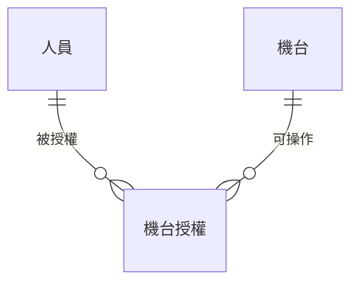
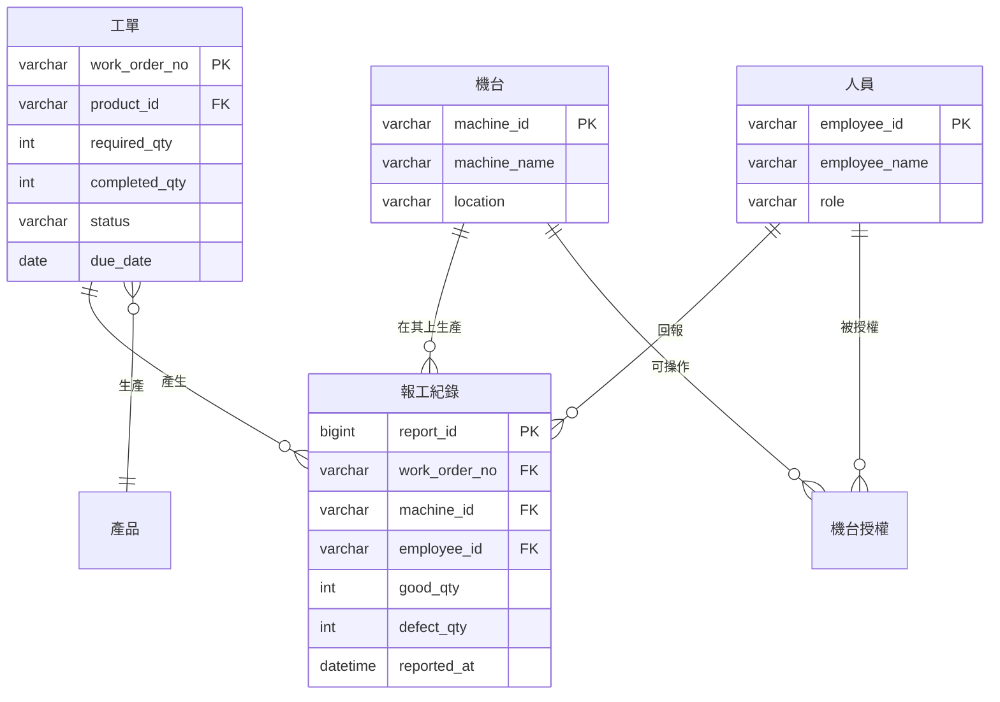

# 資料建模與資料庫設計

前面幾章談的都是動作：誰做什麼、流程怎麼走、系統怎麼回應。但動作做完之後，總得有東西被記下來——作業員回報的數量、工單的目前狀態、誰在什麼時候改過什麼。

功能可以改寫，介面可以重做，但資料一旦存錯了結構，後面每一個功能都要跟著扭曲。一個系統用了三年之後想加一項統計，卻發現當初沒有分開存「不良品」與「試作品」的數量。你這時候要補救，得先把三年份的舊資料一筆一筆判讀回來。**資料模型是系統裡最難改的部分，所以值得在動工前想清楚。**

本章要做的事是把「系統需要記住什麼」轉成一套一致的資料結構。這件事不是程式設計——決定要記錄哪些欄位、哪些欄位不能空白、狀態有哪幾種，靠的是對業務的理解，不是寫程式的能力。這正是工業工程背景的人最有把握的部分。

> **前情提要**：本章假設你已完成[「功能分析」](Functional-Analysis.md)的功能清單與 CRUD 矩陣，以及[「行為建模」](Behavioral-Modeling.md)的流程與狀態分析。本章沿用同一情境（某金屬沖壓工廠導入生產報工與工單追蹤系統）與同一套編號體例。

> **延伸閱讀**：這一項在各組報告中要交出什麼、欄位怎麼填，見[「報告內容」](../00-Course-Introduction/Report-Contents.md)期中第 7 項與期末第 4 項。

## 一、資料是系統的骨架

### 1.1 三份產出是同一件事的三個層次

期中報告的資料需求分析要交三份東西。它們是同一件事看三次，一次比一次細：

| 層次 | 回答的問題 | 產出 |
|---|---|---|
| 1 | 這個領域有哪些東西？彼此什麼關係？ | 實體關聯圖（ERD） |
| 2 | 這些東西存成哪幾張表？怎麼串起來？ | Schema 與資料表 |
| 3 | 每一欄到底存什麼？ | 資料字典 |

**三者必須互相對得起來**：ERD 上的每個實體，要在 Schema 找得到對應的資料表；Schema 每張表的每一欄，要在資料字典裡找得到定義。少一層或對不上，代表你的資料模型還沒想清楚——這也是報告最容易被追問的地方。

### 1.2 資料模型與功能模型的分工

前面幾章畫的圖都在描述「系統做什麼」，本章的圖描述「系統記得什麼」。兩者的關係是互相檢查的：

- 每一項功能都要有它讀寫的資料，否則那項功能沒有東西可處理。
- 每一份資料都要有建立它、維護它的功能，否則系統上線時那張表是空的。

第二條正是[「功能分析」](Functional-Analysis.md)〈五、5.3〉CRUD 矩陣在檢查的事。本章不重複那套做法，但會在第三節用它來驗證實體有沒有找齊。

## 二、實體、屬性與關係

### 2.1 三個基本元素

**[實體關聯模型](https://zh.wikipedia.org/wiki/ER模型)（Entity-Relationship Model）** 由 Peter Chen 在 1976 年提出，用三個元素描述資料：

| 元素 | 意義 | 報工系統的例子 |
|---|---|---|
| 實體（Entity） | 需要被記錄的人、事、物 | 工單、報工紀錄、機台、人員 |
| 屬性（Attribute） | 實體的特徵 | 工單編號、品名、需求數量 |
| 關係（Relationship） | 實體之間的關聯 | 一張工單產生多筆報工紀錄 |

判斷一個東西該不該當實體，最實用的判準是：**這個東西需要單獨被查詢、被統計，或是有自己的一組屬性嗎？** 「機台」需要，因為要查某台機的產出；「顏色」通常不需要，它只是工單的一個屬性。

### 2.2 識別碼

每個實體要有一個能唯一辨識它的屬性，稱為 **[主鍵](https://zh.wikipedia.org/wiki/主键)（Primary Key, PK）**。工單編號、員工工號、機台編號都是。

主鍵有兩種來源：

**自然鍵** 是業務上本來就有的編號，例如工單編號 `WO-20260315-001`。好處是現場的人看得懂、對得起紙本；壞處是業務規則一變（例如編碼規則改版、或發現會重複）就麻煩。

**代理鍵** 是系統自己產生的流水號，與業務無關。好處是穩定、不會因為業務規則改變而失效；壞處是人看不懂，查資料時得多繞一層。

實務上常見的做法是兩者都留：用代理鍵當主鍵，另外保留業務編號並設為唯一。**期中報告不必糾結這個選擇，說得出你用的是哪一種、為什麼即可。**

當一張表的紀錄要指向另一張表時，用 **[外鍵](https://zh.wikipedia.org/wiki/外鍵)（Foreign Key, FK）** 記錄對方的主鍵。報工紀錄裡的「工單編號」就是指向工單表的外鍵。

### 2.3 基數：一對一、一對多、多對多

關係要標明兩邊各能對應到幾筆，這稱為 **基數（Cardinality）**：

| 基數 | 意義 | 例子 |
|---|---|---|
| 1:1 | 一邊只對應一筆 | 一位員工對應一組登入帳號 |
| 1:N | 一邊對應多筆 | 一張工單產生多筆報工紀錄 |
| M:N | 兩邊都對應多筆 | 一位作業員能操作多台機、一台機有多位作業員能操作 |

**多對多在資料庫裡沒辦法直接存**，必須拆成兩個一對多，中間放一張關聯表。「作業員」與「機台」的多對多，要拆成「作業員—機台授權」這張中間表：

拆出來的中間表往往不只是牽線，它自己會長出屬性——授權日期、授權人、有效期限。**你看到多對多就要想：這段關係本身有沒有需要記錄的資訊？** 有的話，它其實是一個被漏掉的實體。

### 2.4 兩種畫法

ERD 有兩套常見的符號：

| 記法 | 特徵 | 適用 |
|---|---|---|
| Chen 記法 | 實體用方框、關係用菱形、屬性用橢圓 | 教學、概念討論 |
| Crow's Foot（鳥爪） | 實體用方框列出欄位，關係用線端符號表示基數 | 實務、工具預設 |

**本課程以 Crow's Foot 為主**，因為多數繪圖工具與資料庫工具用的是它，畫出來的圖也更接近實際的資料表。Chen 記法認得出來即可。

鳥爪記法的線端符號：一橫槓代表「一」，三叉（像鳥爪）代表「多」，圓圈代表「零，可有可無」。所以「零或多」畫成圓圈加鳥爪，「一或多」畫成橫槓加鳥爪。

### 2.5 報工系統的 ERD

圖上的欄位名用英文，是因為它們直接對應資料庫裡的實際欄位；中文名稱與其他細節寫在第五節的資料字典裡。這種分工是實務慣例：**圖負責呈現結構，字典負責承載細節。**

## 三、從需求找實體

### 3.1 名詞分析法

最直接的做法是把需求與使用案例敘述裡的名詞圈出來，逐一判斷它是實體、屬性，還是不必記錄的東西。

以 FR-014（系統應記錄每筆回報的工單編號、機台編號、作業員工號、數量與時間）為例，圈出的名詞是：回報、工單編號、機台編號、作業員工號、數量、時間。判斷結果：

| 名詞 | 判斷 | 理由 |
|---|---|---|
| 回報 | 實體 | 每一筆都要單獨保存與查詢 |
| 工單編號 | 外鍵 | 指向另一個實體 |
| 機台編號 | 外鍵 | 指向另一個實體 |
| 作業員工號 | 外鍵 | 指向另一個實體 |
| 數量 | 屬性 | 回報的特徵，不需單獨存在 |
| 時間 | 屬性 | 同上 |

名詞分析法的價值在於它機械、可重複，不容易漏。缺點是會撈出一堆同義詞與雜訊——「工單」「生產工單」「製令」可能講的是同一件事，要合併；「效率」「狀況」這種抽象名詞則要刪掉。

### 3.2 用 CRUD 矩陣驗證

找完實體之後，用[「功能分析」](Functional-Analysis.md)〈五、5.3〉的 CRUD 矩陣交叉檢查。三種對不上的情況各代表一種遺漏：

| 症狀 | 代表什麼 |
|---|---|
| 某份資料整欄沒有 C | 沒有任何功能會建立它，系統上線時這張表是空的 |
| 某份資料只有 R | 只讀不寫，多半漏了維護功能 |
| 某項功能沒有對應到任何資料 | 這項功能不需要資料？通常是實體漏了 |

第一種最常出現，而且幾乎都發生在同一類資料上：機台、人員、產品這些 **基本資料**。你的注意力集中在業務流程，很容易忘記這些資料本身也需要有人新增與維護。

### 3.3 從狀態找出漏掉的欄位

[「行為建模」](Behavioral-Modeling.md)〈五〉的狀態機圖，在這裡有一個直接的用途：**圖上的每一個狀態，都要在資料表裡有地方存。**

工單的狀態機圖上有待分派、已分派、生產中、暫停、已完工、已結案、已取消七個狀態，那麼工單表就要有一個 `status` 欄位，值域正好是這七個。更進一步，每一次狀態轉移如果需要追溯（誰在什麼時候把工單從暫停改回生產中），就需要一張獨立的狀態異動紀錄表。

**要不要留這張異動紀錄表，是一個你要明確決定的問題**，不是可以忽略的細節。留了，儲存量增加但查得到歷程；不留，出事時只知道現在的狀態，不知道經過。

## 四、正規化

### 4.1 為什麼要正規化

**[正規化](https://zh.wikipedia.org/wiki/数据库规范化)（Normalization）是把資料表拆解到「同一件事只存一個地方」的過程。** 它要防的是三種異動異常：

| 異常 | 症狀 |
|---|---|
| 更新異常 | 同一份資料存在多處，改了一處忘了其他處，資料開始互相矛盾 |
| 新增異常 | 想新增一筆資料，卻被迫填入一堆還不知道的欄位 |
| 刪除異常 | 刪掉一筆紀錄，連帶把另一件事的資料也弄丟了 |

用一張沒有正規化的報工表來看：

| 報工單號 | 工單編號 | 品名 | 機台編號 | 機台位置 | 數量 |
|---|---|---|---|---|---|
| R001 | WO-001 | 支架 A | M-01 | 一廠東側 | 120 |
| R002 | WO-001 | 支架 A | M-01 | 一廠東側 | 95 |
| R003 | WO-002 | 蓋板 B | M-01 | 一廠東側 | 200 |

問題一眼可見：機台 M-01 搬到西側時，要改三筆（更新異常）；新買一台還沒開始生產的機台無處可放（新增異常）；刪掉最後一筆與某工單有關的報工紀錄，那張工單的品名就跟著消失了（刪除異常）。

### 4.2 三個範式

| 範式 | 要求 | 白話 |
|---|---|---|
| [第一正規化](https://zh.wikipedia.org/wiki/第一范式)（1NF） | 每一格只放一個值，不能塞清單 | 不要在一格裡寫「M-01, M-02」 |
| 第二正規化（2NF） | 符合 1NF，且非鍵欄位要相依於整個主鍵 | 主鍵是兩欄組成時，不能有欄位只跟其中一欄有關 |
| 第三正規化（3NF） | 符合 2NF，且非鍵欄位之間不能互相相依 | 機台位置跟著機台編號走，不該留在報工表裡 |

上面那張報工表拆成 3NF 之後：報工紀錄只留報工單號、工單編號、機台編號、人員工號、數量、時間；品名回到產品表；機台位置回到機台表。要看報工紀錄的品名時，透過外鍵串回去。

**課程要求做到 3NF 就夠了。** 更高的範式（BCNF、4NF）在實務上很少刻意追求，本課程也不要求。

### 4.3 什麼時候刻意不正規化

正規化到極致會讓查詢時要串很多張表，影響效能。實務上有時會故意留一些重複，稱為反正規化（Denormalization）。最常見的兩種情況：

**歷史值必須凍結。** 訂單上的單價要存訂單成立時的價格，不能每次都去產品表撈現價——否則產品調價之後，去年的訂單金額會跟著變動。這種欄位看起來是重複資料，其實是刻意保存的歷史事實。

**統計值預先算好。** 工單表上的「已完工數量」其實可以由報工紀錄加總得出，但每次查詢都算一次太慢，所以存成欄位、每次報工時同步更新。代價是要確保這個欄位不會與明細對不起來。

**你在報告裡刻意不正規化是可以的，但要寫明理由。** 沒說理由的重複欄位，看起來就是不會正規化。

## 五、資料字典

### 5.1 每一欄要交代什麼

資料字典把每個欄位講到不會有第二種解釋：

| 欄位 | 用途 |
|---|---|
| 欄位名稱 | 資料表裡的實際名稱 |
| 中文名稱 | 給看不懂英文欄位名的人對照 |
| 資料型別與長度 | 文字幾個字、數字幾位、日期或時間 |
| 是否必填 | 可不可以空白 |
| 值域或格式 | 允許哪些值、要符合什麼格式 |
| 資料來源 | 使用者輸入、系統產生，或計算得來 |

以報工紀錄表為例：

| 欄位名稱 | 中文名稱 | 型別 | 長度 | 必填 | 值域／格式 | 來源 |
|---|---|---|---|---|---|---|
| `report_id` | 報工單號 | BIGINT | — | 是 | 主鍵，系統流水號 | 系統產生 |
| `work_order_no` | 工單編號 | VARCHAR | 20 | 是 | 外鍵，對應工單表 | 掃碼帶入 |
| `machine_id` | 機台編號 | VARCHAR | 10 | 是 | 外鍵，對應機台表 | 終端所在機台帶入 |
| `employee_id` | 作業員工號 | VARCHAR | 10 | 是 | 外鍵，對應人員表 | 登入者帶入 |
| `good_qty` | 良品數量 | INT | — | 是 | 0 以上整數 | 使用者輸入 |
| `defect_qty` | 不良品數量 | INT | — | 是 | 0 以上整數，預設 0 | 使用者輸入 |
| `reported_at` | 回報時間 | DATETIME | — | 是 | 系統時間，不可由使用者填 | 系統產生 |
| `remark` | 備註 | TEXT | — | 否 | 空白代表無異常 | 使用者輸入 |

### 5.2 值域是最有價值的一欄

前面幾欄多數人都填得出來，**值域是拉開差距的地方**。它逼你把業務規則寫死：

- `good_qty` 可以是 0 嗎？（開工了但一件都沒做完，可以）
- 可以超過工單的需求量嗎？（可以，但要確認，見 FR-013）
- `defect_qty` 空白與 0 有沒有差別？（沒有，所以預設 0、設為必填）
- `status` 有哪幾個值？（就是狀態機圖上那七個，一字不差）

最後一項要花點時間。**狀態欄位的值域，會同時出現在活動圖的判斷節點、畫面上的狀態標籤，以及資料表裡**。你三個地方寫得不一樣——圖上寫「已完工」、畫面顯示「完成」、資料庫存 `DONE`——就是文件不一致，也是訪談追溯題最好問的切入點。

### 5.3 資料來源那一欄在防什麼

「來源」欄位分成三類：使用者輸入、系統產生、計算得來。填這一欄的用意是提早發現兩種問題。

**要求使用者提供他手上沒有的資料。** 你把某欄標成「使用者輸入」，就要回去對照介面設計與流程：那個人在那個時點真的知道這個值嗎？作業員回報時要填「本批次的訂單編號」，但他手上只有工單，這個欄位就填不出來。

**該由系統決定的值卻開放輸入。** 回報時間如果讓使用者自己填，補登資料的問題就永遠無法從資料上分辨。標成「系統產生」等於做了一個管理決策。

## 六、期中：從既有系統反推資料模型

期中分析的是既有系統，資料模型不是設計出來的，是看出來的。有三個地方可以看。

**從畫面看。** 每一個輸入欄位背後通常對應一個資料欄位，每一張列表對應一次查詢。你把系統的主要畫面逐一截圖、欄位抄下來，八成的資料結構就浮出來了。

**從報表看。** 報表上出現的統計維度，反映資料是怎麼分類儲存的。一張「各機台各班別的產量報表」代表報工紀錄裡至少有機台與班別兩個欄位，或者有辦法推算出班別。

**從限制看。** 系統擋住的操作透露欄位的值域：輸入負數會被擋、超過某個數字要確認、某些狀態下欄位變成唯讀——每一條都是一項值域規則。

推不出來的部分你要標示清楚。**「這個欄位的用途無法從介面判斷，需查看資料庫或訪談維護人員」比硬猜一個用途有價值**，這一點與[「問題定義與現況分析」](Problem-Definition.md)〈一、1.3〉的原則相同。

## 七、期末：從需求推導資料設計

期末的方向相反：系統還不存在，資料模型要從需求推出來。做法是前面第三節的名詞分析法，加上三件期中不做的事。

### 7.1 Schema 落地

把 ERD 轉成實際的資料表定義，明確寫出每張表的主鍵與外鍵。這一步會逼出幾個 ERD 上看不出來的決定：多對多的中間表要叫什麼名字、外鍵允不允許空值、刪除主表時關聯的紀錄要怎麼處理。

### 7.2 與畫面的對應

期末報告要能回答兩個問題：**「這個畫面上的欄位最後存在哪裡」** 與 **「這項需求需要哪些資料」**。前者從畫面往資料查，後者從需求往資料查。

實務上會做一張對照表：

| 畫面 | 欄位 | 對應資料表.欄位 | 讀或寫 |
|---|---|---|---|
| 報工作業 | 工單編號 | 工單.work_order_no | 讀 |
| 報工作業 | 良品數量 | 報工紀錄.good_qty | 寫 |
| 工單進度查詢 | 完工率 | 由工單.completed_qty ÷ required_qty 計算 | 讀 |

這張表是期末第 8 項追溯鏈裡「資料 → 畫面」那一段的直接證據。你做這張表時最常發現的問題是：畫面上有一個欄位，在任何一張表裡都找不到對應——那表示資料設計漏了東西，或那個欄位其實不該出現在畫面上。

### 7.3 不必做到的部分

索引、Trigger、Stored Procedure、分割表、效能調校，這些屬於資料庫實作層次，**本課程列為可選**。做了不會加分在必做項目上，但如果在報告裡出現，要能在訪談時說明為什麼需要。

判斷的界線是：**影響「資料代表什麼意思」的，是必做；只影響「資料庫跑得快不快」的，是可選。** 主鍵、外鍵、必填、值域屬於前者；索引屬於後者。

## 八、學習重點總結

讀完本章後，你應該能夠理解以下核心概念，並將其應用於工業場域的思考與決策：

**資料模型是系統裡最難改的部分**

功能可以重寫、介面可以重做，但資料結構一旦定了、資料一旦存進去，要改就得處理所有既有紀錄。這是資料建模值得在動工前想清楚的唯一理由，也解釋了為什麼分析階段要花時間逐欄確認值域與必填條件——那些看似瑣碎的決定，三年後會變成無法回頭的事實。

**ERD、Schema 與資料字典是同一件事的三個層次**

ERD 說有哪些東西與什麼關係，Schema 說存成哪幾張表，資料字典說每一欄到底存什麼。三者必須互相對得起來：ERD 的實體要在 Schema 找得到表，Schema 的每一欄要在字典裡找得到定義。任何一層對不上，都代表資料模型還沒想清楚。

**多對多關係裡往往藏著一個被漏掉的實體**

作業員與機台的多對多，拆成中間表之後會發現它自己長出授權日期、授權人、有效期限這些屬性——那表示這段關係本身就是一件需要被記錄的事。看到多對多就追問「這段關係有沒有要記的資訊」，是找出遺漏實體最有效的一招。

**正規化防的是資料自相矛盾**

同一份資料存在多個地方，遲早會出現改了一處忘了其他處的情況。三個範式的規則背後只有一個目的：讓每一件事只有一個存放的地方。刻意不正規化是允許的——歷史單價要凍結、統計值要預先算好——但必須寫明理由，否則看起來就是不會正規化。

**值域是資料字典裡最有價值的一欄**

欄位名稱與型別多數人都填得出來，值域則逼你把業務規則寫死：數量可不可以是零、狀態有哪幾個值、空白與零有沒有差別。狀態欄位的值域尤其關鍵，因為同一串值會同時出現在活動圖的判斷節點、畫面的狀態標籤與資料表裡，三處寫得不一樣就是文件不一致。

**每一份資料都要有人建立與維護**

分析時的注意力容易集中在業務流程，而忘記機台、人員、產品這些基本資料本身也需要新增與維護的功能。CRUD 矩陣裡整欄沒有 C 的資料，代表系統上線時那張表是空的——這是最常出現的一種遺漏，也是最容易在交件前自己檢查出來的一種。

> **銜接提示**：本章決定了資料存成什麼結構，下一章[「系統環境與架構」](System-Architecture.md)處理它們實際放在哪裡：資料庫擺在公司機房還是雲端、使用者從什麼裝置存取、與哪些外部系統相連。本章畫的是資料的靜態結構，下一章畫的是承載這些資料的實體環境。

## 參考文獻

- Chen, P. P.-S. (1976). The entity-relationship model: Toward a unified view of data. *ACM Transactions on Database Systems*, *1*(1), 9–36. https://doi.org/10.1145/320434.320440
- Codd, E. F. (1970). A relational model of data for large shared data banks. *Communications of the ACM*, *13*(6), 377–387. https://doi.org/10.1145/362384.362685
- Codd, E. F. (1972). Further normalization of the data base relational model. In R. Rustin (Ed.), *Data base systems* (pp. 33–64). Prentice Hall.
- Connolly, T., & Begg, C. (2015). *Database systems: A practical approach to design, implementation, and management* (6th ed.). Pearson.
- Date, C. J. (2003). *An introduction to database systems* (8th ed.). Addison-Wesley.
- Dennis, A., Wixom, B. H., & Roth, R. M. (2018). *Systems analysis and design* (7th ed.). Wiley.
- Elmasri, R., & Navathe, S. B. (2016). *Fundamentals of database systems* (7th ed.). Pearson.
- Fleming, C. C., & von Halle, B. (1989). *Handbook of relational database design*. Addison-Wesley.
- Halpin, T., & Morgan, T. (2008). *Information modeling and relational databases* (2nd ed.). Morgan Kaufmann.
- Hay, D. C. (1996). *Data model patterns: Conventions of thought*. Dorset House.
- Hoffer, J. A., Ramesh, V., & Topi, H. (2019). *Modern database management* (13th ed.). Pearson.
- Kendall, K. E., & Kendall, J. E. (2019). *Systems analysis and design* (10th ed.). Pearson.
- Kent, W. (1983). A simple guide to five normal forms in relational database theory. *Communications of the ACM*, *26*(2), 120–125. https://doi.org/10.1145/358024.358054
- Kimball, R., & Ross, M. (2013). *The data warehouse toolkit: The definitive guide to dimensional modeling* (3rd ed.). Wiley.
- Silberschatz, A., Korth, H. F., & Sudarshan, S. (2019). *Database system concepts* (7th ed.). McGraw-Hill.
- Simsion, G., & Witt, G. (2005). *Data modeling essentials* (3rd ed.). Morgan Kaufmann.
- Sommerville, I. (2016). *Software engineering* (10th ed.). Pearson.
- Teorey, T. J., Lightstone, S. S., Nadeau, T., & Jagadish, H. V. (2011). *Database modeling and design: Logical design* (5th ed.). Morgan Kaufmann.
- Whitten, J. L., & Bentley, L. D. (2007). *Systems analysis and design methods* (7th ed.). McGraw-Hill.
- Wiegers, K., & Beatty, J. (2013). *Software requirements* (3rd ed.). Microsoft Press.
- Yourdon, E. (1989). *Modern structured analysis*. Yourdon Press.

---

*本章交出的是系統的記憶：有哪些東西要被記住、記成什麼結構、每一欄存什麼。建議的延伸練習是拿自己組的題目畫一張 ERD，然後做兩件事——用 CRUD 矩陣檢查每張表是否都有功能負責建立，再把狀態欄位的值域抄出來，逐一比對活動圖的判斷節點與畫面上的文字是否一致。第二項只要有一處三個地方講法不同，就是訪談時最好問的切入點。*
