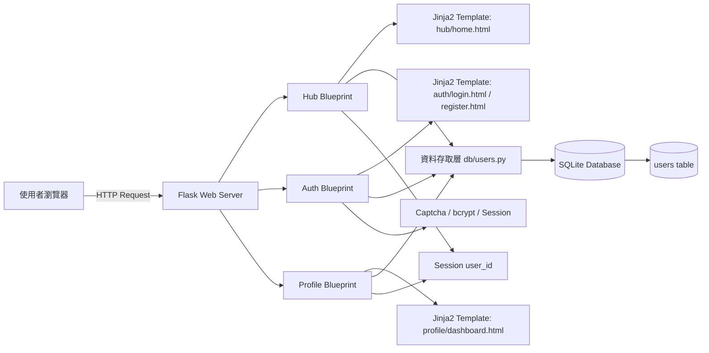
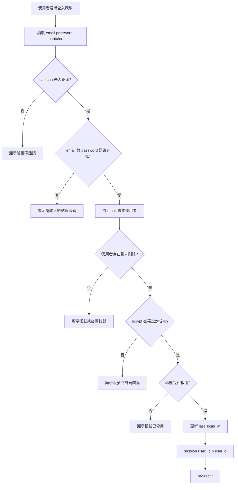
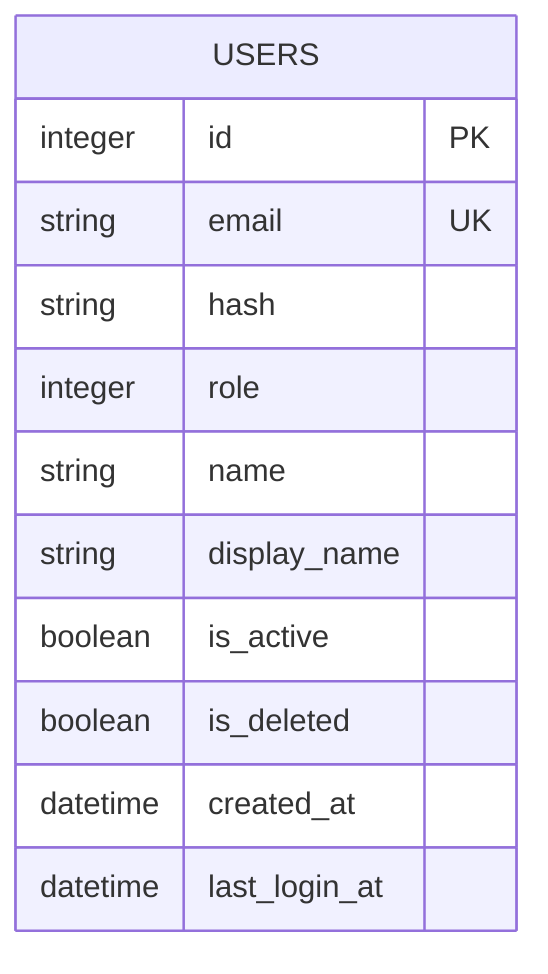
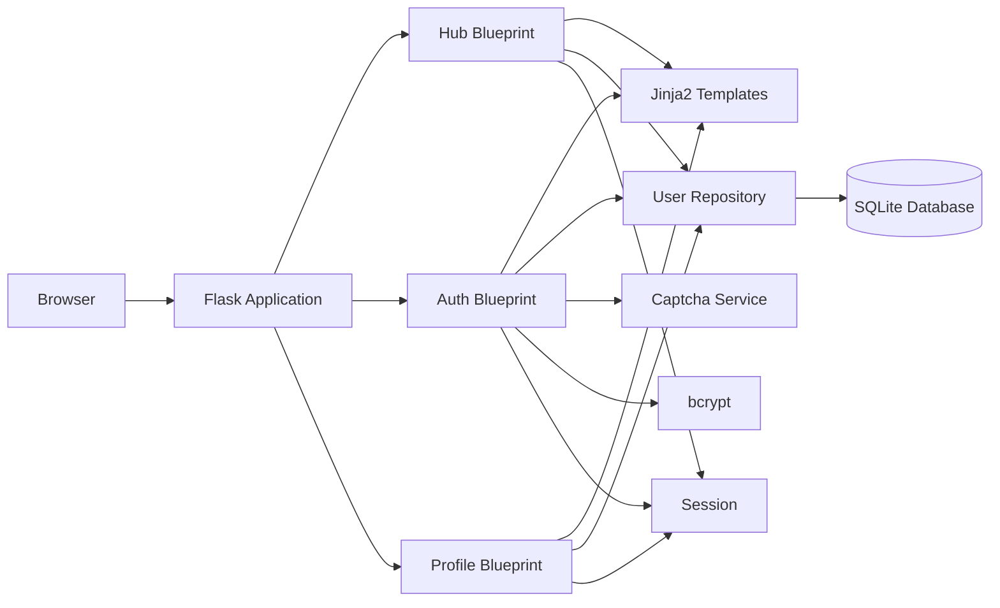
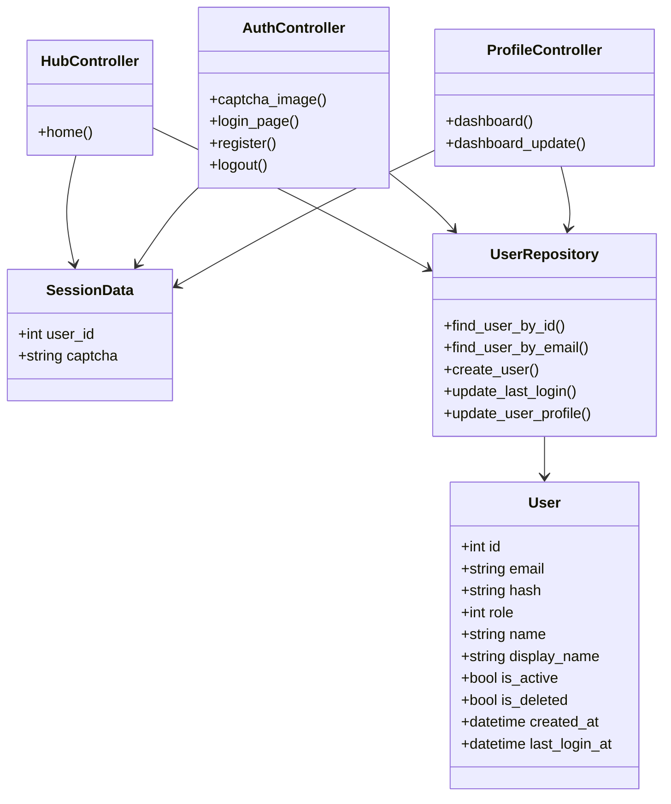
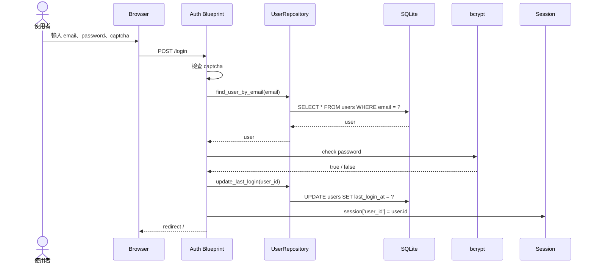
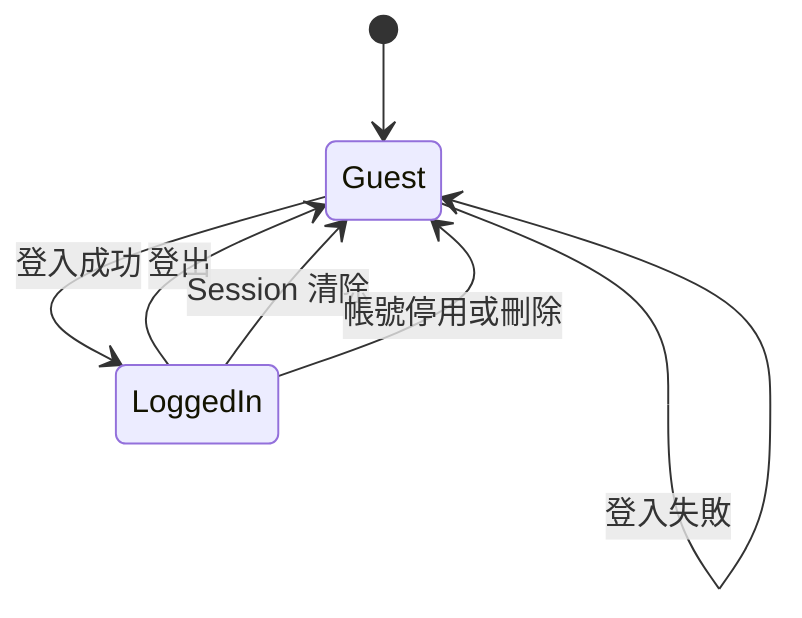
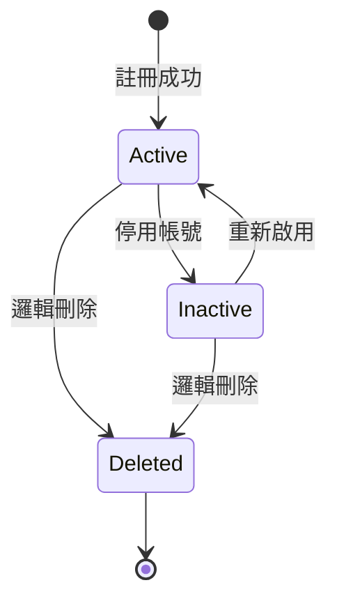
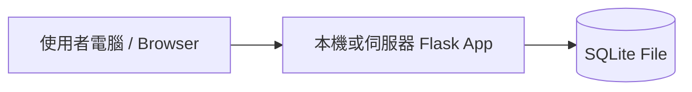

# 系統設計階段繳交規範

## 一、階段定位

系統設計階段的重點是「把需求轉換成可實作的系統結構」。學生要能說明系統由哪些模組組成、每個模組負責什麼、資料如何流動、資料表如何設計、主要流程如何實作。

本課程提供一套可以實際操作的範例系統，並附上完整程式碼。請實際操作這套系統並對照程式碼，看它把功能切成哪些模組、資料表怎麼設計、一個操作從畫面走到資料庫經過哪些環節。看懂這幾件事，就能初步理解系統設計在做的是什麼事。

若以範例系統 `Course-SAD-Sample-System` 為基準，設計範圍可限定為以下三個子系統：

| 子系統 | 文件 |
|---|---|
| Hub 首頁 | `document/hub.md` |
| 登入與帳號 | `document/auth.md` |
| 個人資料管理 | `document/profile.md` |

這套範例是上課講解用的會員系統，各組拿到的題目不同，可以參考它的架構，但不必每一項都照做，也不限於這些項目，該設計哪些內容由你們自己的題目決定。

遇到不確定的地方，請多思考、翻課本、找資料，也可以請 AI 幫你梳理與釐清思路。但你必須看懂 AI 給你的東西，採用之前要能自己說明那些概念是什麼，不能複製貼上就收工。使用 AI 的揭露義務見[「SAD 課程介紹」](../00-Course-Introduction/Course-Introduction.md)〈AI 工具使用揭露〉。

就算你動用 Claude Code、Codex 這類進階工具，直接把這份範本丟給 AI，叫它照格式生出一份設計文件，老師其實不介意，這件事也沒什麼好遮掩的，你手上這份文件本身就是老師用 AI 協助梳理與撰寫出來的。問題在於，AI 生給你的這些東西，你真的懂嗎？懂或不懂，會在口頭報告與期末個人訪談的問答裡直接顯現出來。

---

# 二、學生應繳交項目

## 1. 系統設計規格書

系統設計規格書是設計階段的核心文件，需說明系統整體架構、主要模組、資料流向、使用者操作邏輯與設計原則。

### 至少應包含

| 項目 | 說明 |
|---|---|
| 設計目標 | 說明設計階段要完成哪些子系統 |
| 系統範圍 | 例如 Hub、Auth、Profile |
| 設計原則 | 模組化、登入狀態管理、資料安全、可維護性 |
| 系統分層 | 前端、後端、資料庫、Session |
| 子系統責任 | 各 Blueprint 或模組的職責 |
| 主要資料流 | 登入資料流、註冊資料流、個人資料更新資料流 |
| 設計限制 | 本階段不處理哪些功能 |

### 範例設計原則

| 原則 | 說明 |
|---|---|
| 模組化 | Hub、Auth、Profile 分別處理不同責任 |
| 登入狀態集中管理 | 以 Session 保存目前登入使用者 |
| 密碼安全 | 密碼不得明文儲存，需使用雜湊 |
| 權限檢查 | 個人資料頁不得讓未登入者進入 |
| 可維護性 | 資料存取邏輯與頁面控制邏輯應分離 |

---

## 2. 系統架構圖

學生需用圖像呈現系統組成。即使專題規模較小，也應能說明系統由哪些部分構成。

### 至少應包含

| 元件 | 說明 |
|---|---|
| 使用者瀏覽器 | 操作系統與送出 HTTP Request |
| 前端頁面 / Template | Hub、登入、註冊、個人資料頁 |
| Flask Server | 接收請求與分派路由 |
| Blueprint / Controller | Hub、Auth、Profile |
| 資料存取層 | 使用者資料查詢與更新 |
| SQLite Database | 儲存 users 資料 |
| Session | 維持登入狀態 |
| Captcha | 登入驗證碼 |
| bcrypt | 密碼雜湊與驗證 |

### 架構圖範例



---

## 3. 功能模組設計

學生需依據分析階段的功能需求，將系統拆成主要模組。每個模組應說明其功能、輸入、輸出、使用者角色與和其他模組的關係。

### 建議至少包含

| 模組 | 功能 |
|---|---|
| Hub 首頁模組 | 判斷訪客或登入狀態，顯示對應首頁 |
| 首頁登入模組 | 在首頁直接送出登入資料 |
| 驗證碼模組 | 產生 captcha 並寫入 Session |
| 登入模組 | 驗證帳密並建立 Session |
| 註冊模組 | 建立新帳號 |
| 登出模組 | 清除 Session |
| 個人資料檢視模組 | 顯示目前登入者資料 |
| 個人資料更新模組 | 修改 name 與 display_name |

### 每個模組建議格式

| 欄位 | 說明 |
|---|---|
| 模組名稱 | 例如：登入模組 |
| 使用者角色 | 訪客或一般使用者 |
| 輸入 | email、password、captcha |
| 處理 | 驗證 captcha、查詢使用者、檢查密碼、建立 Session |
| 輸出 | 登入成功導向首頁，失敗顯示錯誤 |
| 關聯模組 | Captcha、Session、users 資料表 |

---

## 4. 流程設計圖

學生需繪製主要功能流程，例如使用者登入流程、資料建立流程、查詢流程、通知流程等。可使用 Activity Diagram、Flowchart 或 BPMN 簡化版。

### 至少應包含

| 流程圖 | 必要性 |
|---|---|
| Hub 首頁流程 | 必備 |
| 登入流程 | 必備 |
| 申請帳號流程 | 必備 |
| 登出流程 | 建議 |
| 查看個人資料流程 | 必備 |
| 修改個人資料流程 | 必備 |
| 驗證碼產生流程 | 建議 |

### 登入流程範例



---

## 5. 資料庫設計或資料結構設計

若系統包含資料儲存，學生至少需提供 ERD、資料表設計或資料欄位規格。內容應包含資料表名稱、欄位名稱、資料型態、主鍵、外鍵與重要限制。

### 至少應包含

| 文件內容 | 說明 |
|---|---|
| ERD | 顯示 users 資料表與未來可能關聯 |
| users 資料表規格 | 欄位名稱、型態、主鍵、唯一限制、是否可空 |
| Session 資料結構 | user_id、captcha |
| 資料生命週期 | 註冊建立資料、登入更新 last_login_at、個人資料更新 name/display_name |
| 欄位限制 | email 唯一、密碼雜湊不可外洩、停用與刪除狀態檢查 |

### ERD 範例



### users 資料表設計範例

| 欄位名稱 | 資料型態 | 鍵值 / 限制 | 是否可空 | 說明 |
|---|---:|---|---|---|
| id | INTEGER | Primary Key | 否 | 使用者唯一識別碼 |
| email | TEXT | Unique | 否 | 登入帳號，註冊時需檢查格式與唯一性 |
| hash | TEXT | - | 否 | bcrypt 後的密碼雜湊 |
| role | INTEGER | - | 否 | 使用者角色，例：0 為管理者，1 為一般使用者 |
| name | TEXT | - | 是 | 姓名，可由使用者編輯 |
| display_name | TEXT | - | 是 | 顯示名稱，可由使用者編輯 |
| is_active | BOOLEAN / INTEGER | - | 否 | 是否啟用，停用帳號不得登入 |
| is_deleted | BOOLEAN / INTEGER | - | 否 | 是否邏輯刪除，已刪除帳號不得登入 |
| created_at | DATETIME | - | 否 | 帳號建立時間 |
| last_login_at | DATETIME | - | 是 | 最後登入時間，登入成功後更新 |

### Session 資料結構範例

| Session Key | 來源 | 用途 | 清除時機 |
|---|---|---|---|
| `session['user_id']` | 登入成功後建立 | 判斷目前登入使用者 | 登出、帳號失效、Session 清除 |
| `session['captcha']` | 產生驗證碼時建立 | 登入時比對使用者輸入的 captcha | 重新產生驗證碼或 Session 清除 |

---

## 6. 介面原型圖

設計階段建議學生至少提供低保真 Wireframe。重點不是美術設計，而是畫面資訊、操作流程與使用者任務是否清楚。

### 至少應包含

| 頁面 | 內容 |
|---|---|
| Hub 訪客首頁 | 公開服務卡片、登入表單、申請帳號連結 |
| Hub 已登入首頁 | 歡迎訊息、服務卡片、登出連結 |
| 登入頁 | email、password、captcha |
| 註冊頁 | email、password、confirm_password、name、display_name |
| 個人資料檢視頁 | email、name、display_name、role、created_at、last_login_at |
| 個人資料編輯頁 | name 與 display_name 輸入框 |

---

## 7. 權限與角色設計

學生需說明不同角色可以使用哪些功能。

### 權限矩陣範例

| 功能 | 訪客 | 一般使用者 | 管理者 |
|---|---:|---:|---:|
| 瀏覽 Hub 首頁 | 可 | 可 | 可 |
| 查看公開服務卡片 | 可 | 可 | 可 |
| 登入 | 可 | 不需要 | 不需要 |
| 申請帳號 | 可 | 不需要 | 不需要 |
| 登出 | 不可 | 可 | 可 |
| 查看個人資料 | 不可 | 可 | 可 |
| 修改個人資料 | 不可 | 可 | 可 |
| 管理帳號 | 不可 | 不可 | 本階段不做 |

---

## 8. 測試規劃初稿

學生需根據功能需求設計測試項目。設計階段不一定要完成測試，但應能說明後續如何驗證系統符合需求。

### 測試案例範例

| 測試類型 | 測試案例 |
|---|---|
| 登入測試 | 正確帳密登入成功 |
| 登入錯誤測試 | 密碼錯誤、captcha 錯誤、帳號停用 |
| 註冊測試 | email 格式錯誤、密碼太短、兩次密碼不同、email 重複 |
| 權限測試 | 未登入者進入 `/profile` 應導向登入頁 |
| 個人資料測試 | 修改 name 與 display_name 後資料正確更新 |
| Session 測試 | 登出後不得繼續存取個人資料 |
| 帳號狀態測試 | 停用或刪除帳號不得繼續使用系統 |

---

## 9. 設計階段簡報

### 建議報告時間

每組 10 至 12 分鐘，問答 3 至 5 分鐘。

### 建議報告內容

| 時間 | 報告內容 |
|---:|---|
| 1 分鐘 | 系統範圍與設計目標 |
| 2 分鐘 | 系統架構圖 |
| 2 分鐘 | 功能模組設計 |
| 2 分鐘 | 主要流程設計 |
| 2 分鐘 | 資料庫與資料結構 |
| 1 分鐘 | 介面原型與權限設計 |
| 1 分鐘 | 測試規劃與限制 |
| 3 至 5 分鐘 | 問答 |

---

# 三、設計階段建議 UML 圖樣

設計階段的 UML 應比分析階段更具體，重點放在「系統如何實作」。

## 1. Component Diagram：元件圖

用途：呈現系統由哪些主要元件組成，以及元件之間如何互動。

設計階段建議一定要有。

### 適合呈現的元件

| 元件 | 說明 |
|---|---|
| Browser | 使用者端 |
| Hub Blueprint | 首頁與導覽 |
| Auth Blueprint | 登入、註冊、登出、驗證碼 |
| Profile Blueprint | 個人資料管理 |
| Template | Jinja2 頁面 |
| User Repository / db/users.py | 使用者資料存取 |
| SQLite Database | 資料儲存 |
| Session | 登入狀態 |
| Captcha Service | 驗證碼 |
| bcrypt | 密碼驗證 |

### 簡化示意



---

## 2. Class Diagram：類別圖

用途：描述系統中的類別、資料結構或主要物件關係。

在 Flask 範例中，不一定有傳統物件導向類別，但仍可用「設計類別圖」或「資料導向類別圖」表示 User、Session、Controller、Repository 等結構。

### 範例



---

## 3. Sequence Diagram：循序圖

用途：呈現物件或元件之間的互動順序。

設計階段建議至少要有 2 張。

### 建議繪製

| 循序圖 | 說明 |
|---|---|
| 登入循序圖 | Browser → Auth Blueprint → UserRepository → Database → bcrypt → Session |
| 註冊循序圖 | Browser → Auth Blueprint → UserRepository → Database |
| 查看個人資料循序圖 | Browser → Profile Blueprint → Session → UserRepository → Database |
| 修改個人資料循序圖 | Browser → Profile Blueprint → UserRepository → Database |
| Hub 首頁載入循序圖 | Browser → Hub Blueprint → Session → UserRepository → Template |

### 登入循序圖範例



---

## 4. Activity Diagram：活動圖

用途：描述功能內部流程與判斷邏輯。

分析與設計階段都可以用，但設計階段應更細，包含更多判斷節點與錯誤流程。

### 建議至少繪製

| 活動圖 | 必要性 |
|---|---|
| 登入活動圖 | 必備 |
| 註冊活動圖 | 必備 |
| 個人資料更新活動圖 | 必備 |
| Hub 首頁判斷活動圖 | 必備 |
| 登出活動圖 | 建議 |

---

## 5. State Machine Diagram：狀態機圖

用途：描述某個物件或使用者狀態如何轉換。

此系統很適合用狀態圖描述「登入狀態」與「帳號狀態」。

建議作為加分圖。

### 使用者登入狀態圖



### 帳號狀態圖



---

## 6. ERD / Data Model Diagram

ERD 不完全屬於 UML，但在系統分析與設計課程中通常非常重要。

設計階段建議一定要有。

### 目前三個子系統至少需要 users 資料表


若未來擴充論壇與活動，可加入：

| 資料表 | 說明 |
|---|---|
| posts | 論壇文章 |
| comments | 留言 |
| events | 校園活動 |
| registrations | 活動報名紀錄 |
| users | 使用者帳號 |

---

## 7. Deployment Diagram：部署圖

用途：呈現系統部署在哪些硬體或執行環境上。

對入門專題而言可列為加分圖，不一定必備。

### 簡化範例



若是正式部署，可再加入：

| 節點 | 說明 |
|---|---|
| Client Browser | 使用者端 |
| Web Server | Nginx / Apache |
| Application Server | Flask / Gunicorn |
| Database Server | SQLite / PostgreSQL / MySQL |
| File Storage | 上傳檔案儲存空間 |

---

# 四、設計階段最低繳交標準

| 項目 | 必備 |
|---|---|
| 系統設計規格書 | 是 |
| 系統架構圖 | 是 |
| 功能模組設計 | 是 |
| 流程設計圖 | 是 |
| 資料庫設計 / ERD | 是 |
| 介面原型圖 | 建議列為必備 |
| 權限與角色設計 | 建議列為必備 |
| 測試規劃初稿 | 建議列為必備 |
| Component Diagram | 是 |
| Sequence Diagram | 是 |
| Activity Diagram | 是 |
| Class Diagram | 建議 |
| State Machine Diagram | 加分 |
| Deployment Diagram | 加分 |
| 設計階段簡報 | 是 |

---

# 五、建議繳交檔案結構

```text
design/
├── 01_system-design-spec.md
├── 02_architecture.md
├── 03_module-design.md
├── 04_process-design.md
├── 05_database-design.md
├── 06_ui-prototype.md
├── 07_permission-design.md
├── 08_test-plan.md
└── design-presentation.pdf

diagrams/
├── component-diagram.png
├── sequence-login.png
├── sequence-profile-update.png
├── activity-login.png
├── activity-register.png
├── activity-profile-update.png
├── class-diagram.png
├── erd.png
├── state-login.png
└── deployment-diagram.png
```

---

# 六、教師評閱重點

| 評閱面向 | 檢查重點 |
|---|---|
| 架構完整性 | 是否清楚說明前端、後端、資料庫、Session 的關係 |
| 模組分工 | Hub、Auth、Profile 是否職責清楚 |
| 流程可實作性 | 流程圖是否足以指導後續開發 |
| 資料設計 | users 資料表欄位、限制與用途是否合理 |
| 權限設計 | 訪客、一般使用者、管理者的可用功能是否清楚 |
| 安全性 | 密碼、Session、帳號狀態是否有合理設計 |
| UML 圖品質 | 圖是否能支援設計說明，而不是只作為裝飾 |
| 需求對應 | 設計是否能回應分析階段提出的功能需求與非功能需求 |
