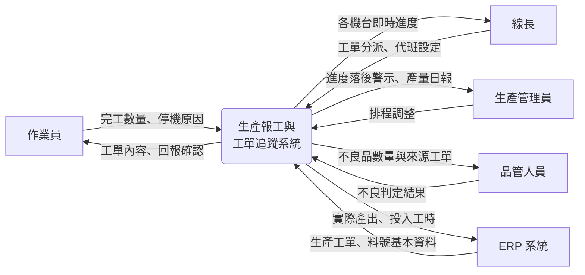
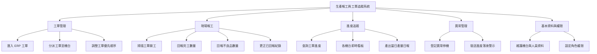
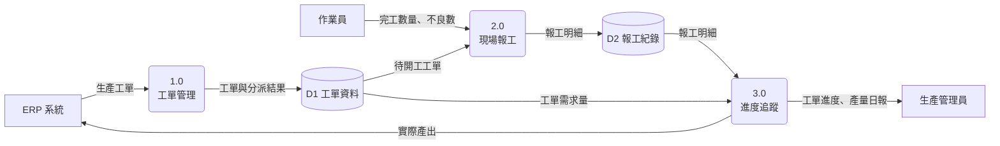
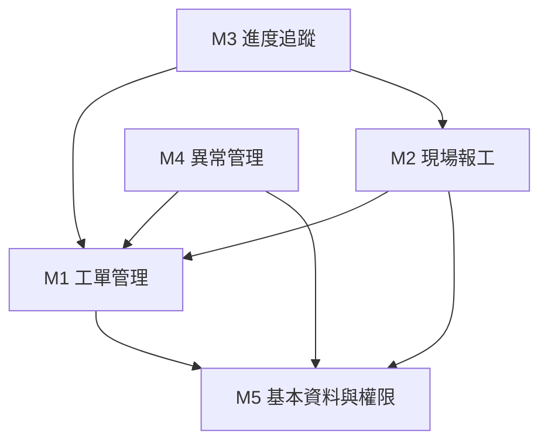

# 功能分析

你的需求清單寫到第三十條的時候，通常會出現一個問題：這三十條加起來，到底是一套什麼樣的系統？條列式的需求彼此平行、沒有從屬關係。讀完可以知道系統該做哪些事，卻看不出這些事怎麼組成一個整體，也看不出哪一件事其實不該由這套系統負責。

功能分析要處理的正是這兩件事：**這套系統的範圍到哪裡**（系統邊界），以及 **範圍內的功能如何組成一個結構**（功能分解與模組劃分）。前者決定專案做多少，後者決定專案怎麼分工。兩者都做完，你才有辦法回答「這個系統要花多少時間做完」這種在提案階段一定會被問到的問題。

本章沿用前兩章的情境：某金屬沖壓工廠導入生產報工與工單追蹤系統。前兩章得到的使用案例與需求清單，在本章會被重新組織成一張有邊界、有層次的功能全貌。

> **前情提要**：本章假設你已完成[「使用者分析」](User-Analysis.md)的使用案例分析與[「系統需求分析」](System-Requirements-Analysis.md)的需求條列。本章沿用該兩章的編號體例（UC-01 為「回報完工數量」、FR-010 起為其展開的功能需求），其餘編號為本章為求範例完整而延伸。

> **延伸閱讀**：功能分析在各組報告中的繳交格式與最低標準，見[「系統分析階段繳交規範」](../example-system/Analysis-Phase-Deliverables.md)。

## 一、功能分析在做什麼

### 1.1 需求是條目，功能是結構

需求與功能不是同一種東西。需求是一句可驗證的敘述，功能是系統實際要建造的組成單位。兩者的關係經常不是一對一：

- FR-010（掃描條碼輸入工單編號）、FR-011（顯示品名與需求量）、FR-012（條碼不存在時的處理）三條需求，在功能結構裡合起來只是「掃描工單開工」這一項功能。
- 反過來，「匯出當月產量報表」可能只對應一條需求，卻必須在功能結構裡獨立成一項——因為它需要單獨的工時、單獨的負責人，也可能單獨延期。

功能分析就是把需求清單重新整理成功能結構的過程，它要回答三個問題：

| 問題 | 產出 |
|---|---|
| 哪些事情是這套系統要做的、哪些不是 | 系統邊界與範圍外清單 |
| 要做的事情怎麼組織成有層次的整體 | 功能分解圖 |
| 每項功能對應誰的需求、由哪個模組承擔 | 功能清單與模組劃分 |

### 1.2 跳過功能分析的後果

分析文件裡若只有需求清單而沒有功能結構，會在三個地方出問題。

**估不出時程**。需求條目的大小差距可以到一百倍，把條目數量乘上平均工時得到的估算沒有意義。能估的單位是功能，不是需求。

**分不了工**。開發要分給不同人做，切分的依據是功能模組。沒有模組劃分，分工只能靠口頭協調，介面上的責任歸屬會反覆爭執。

**擋不住範圍蔓延**。客戶說「順便加一個查詢」時，你手上沒有一張界定範圍的圖，就沒有討論的基礎，只能一路答應到做不完為止。

課程報告最常見的症狀是：需求清單洋洋灑灑，但整份文件沒有任何一張圖說得出「這個系統長什麼樣子」。功能分析就是補上那張圖。

## 二、系統邊界

### 2.1 邊界界定的是責任

**系統邊界（System Boundary）是一條把「本系統負責的部分」與「環境」分開的線。** 界內的東西由本專案設計、實作、維護；界外的東西是本系統必須配合、卻不去改變的既有條件。

要注意這是一個 **責任與範圍的協議，不是技術上的分界**。報工系統要從 ERP 取得工單資料，兩者之間資料往來密切，但 ERP 仍在界外——不是因為它不重要，而是因為這次專案沒有預算與權限去改它。你把 ERP 畫進界內，等於承諾了一件做不到的事。

### 2.2 判斷一件事在界內或界外

實務上用四個問題判斷：

| 問題 | 答「是」代表 |
|---|---|
| 這件事的處理規則是不是由本系統決定 | 界內 |
| 這份資料是不是由本系統儲存與維護 | 界內 |
| 這次專案有沒有預算與權限修改它 | 界內 |
| 出問題時是不是由本專案團隊負責修 | 界內 |

四個都答「是」的，放進系統內；四個都答「否」的，是外部實體。真正需要你注意的是答案混雜的情況，那代表這裡有一個 **介面（interface）**，也就是兩邊交界的地方。介面必須把資料格式、傳輸方式、發生錯誤時誰負責處理都寫清楚，專案後期的爭執有一大半發生在這種地方。

界外的對象通常有三類：

| 類型 | 報工系統的例子 | 常見的疏漏 |
|---|---|---|
| 外部系統 | ERP、人事差勤系統 | 沒問清楚對方能不能提供介接方式 |
| 外部組織或人員 | 客戶、外包代工廠、設備維修廠商 | 忘記他們也需要取得或提供資料 |
| 實體設備與人工作業 | 沖床本身、換模動作、實體點料 | 誤以為系統可以取代，實際上系統只是記錄它的結果 |

第三類最容易搞混。系統不會替人換模，換模是界外的人工作業；但「換模開始與結束的時間」要被記錄下來，所以界上有一個回報功能。**把人工作業與它的資料紀錄分開看，是界定邊界時最實用的一條紀律。**

### 2.3 情境圖

**情境圖（System Context Diagram，又稱環境圖）把整個系統畫成一個處理，四周是外部實體，箭頭是流進流出的資料。** 它是[資料流程圖](https://zh.wikipedia.org/wiki/資料流圖)的最上層，也是表達系統邊界最直接的一張圖。



上圖以流程圖語法示意，正式的資料流程圖中，處理畫成圓形或圓角方框、外部實體畫成方框、資料流為帶名稱的箭頭。

這張圖只有一頁，卻能做到三件事：一頁講完專案範圍、標出每一個必須開發的介面、提供逐一向外部單位確認資料格式的檢查清單。你畫這張圖時，箭頭上一定要寫資料名稱。只畫線不標名稱的情境圖沒有分析價值。

### 2.4 把不做的事寫下來

邊界只畫界內是不夠的，還要有一份明確的 **範圍外清單**：

| 這次不做 | 理由 |
|---|---|
| 不修改 ERP 的工單建立流程 | ERP 由外部廠商維護，本專案無權限 |
| 不含設備預防保養排程 | 屬於設備管理範疇，另有專案 |
| 不含計件薪資計算 | 需人事與會計政策確認，第二期評估 |
| 不含作業員手機 App | 廠區禁帶手機進生產區 |

寫下不做的事，是為了處理 **範圍蔓延（scope creep）**：需求一次追加 5%，沒有人會覺得過分，但十次之後專案就多了一半的工作量而時程不變。你有了這份清單，追加要求就會變成一個必須重新談時程與資源的正式決策，而不是無聲無息地累積。

### 2.5 邊界的三種常見錯誤

| 錯誤 | 症狀 | 後果 |
|---|---|---|
| 邊界畫太大 | 報告裡系統涵蓋報工、排程、倉儲、品質、保養 | 學期做不完，每一塊都只有標題 |
| 邊界畫太小 | 只做報工畫面，工單資料「假設 ERP 會給」 | 系統沒有資料來源，功能無法運作 |
| 邊界會移動 | 每次開會的範圍都不太一樣，沒有書面確認 | 到期末才發現各組員做的不是同一個系統 |

第二種在課程報告中特別常見。凡是你寫「假設由其他系統提供」的資料，都要回頭確認：這個假設有沒有對應的介面設計？沒有的話，那份資料實際上不存在，依賴它的功能就是做不出來的。

## 三、功能分解

### 3.1 由上而下逐層拆解

**功能分解（Functional Decomposition）是把系統的整體目的逐層拆成較小的功能，直到每一項小到可以被指派、估時與驗收。** 典型是三層：

```
系統  →  功能模組（子系統）  →  功能  →  （必要時再拆子功能）
```

拆解的方向必須由上而下。你由下而上把想到的功能一項項堆起來，最後幾乎一定會發現有的重複、有的遺漏，而且看不出來哪些屬於同一類。

### 3.2 分解的四個原則

原則之一牽涉到 **粒度（granularity）** 這個詞：粒度指的是一個項目切得多粗或多細——同一件事可以寫成一項大功能，也可以拆成十項小功能，粒度講的就是你選在哪一個層次描述它。分解的過程實際上就是一層一層調整粒度，直到每一項都落在可以被指派與估算的大小。

| 原則 | 說明 | 違反時的症狀 |
|---|---|---|
| 完整 | 同一層各項合起來要涵蓋上一層的全部 | 上線後才發現沒有人負責維護基本資料 |
| 互斥 | 同一層各項之間不重疊 | 兩個模組都在算當日產量，數字對不起來 |
| 粒度相當 | 同一層的項目大小接近 | 同一層出現「生產報工」與「修改密碼」 |
| 每層 5–9 項 | 超過就再分一層 | 圖橫向拉得很寬，看不出結構 |

前兩項合起來就是常說的不重複、不遺漏（Mutually Exclusive, Collectively Exhaustive, MECE）。檢查方法很簡單：把同一層的項目念一遍，問自己「還有沒有第七類？」以及「這兩項有沒有重疊的部分？」

### 3.3 功能階層圖



這張圖上有兩件事值得注意。第一，「基本資料與權限」這一類最容易被漏掉。它不解決任何業務問題，但沒有它，前面四個模組全都沒有資料可用。第二，「更正已回報紀錄」單獨列為一項功能，來源是上一章人物誌中作業員「擔心按錯會被記過」的那句話。它在功能結構裡佔一個位置，代表它有工時、有人負責，而不是口頭承諾「到時候會處理」。

### 3.4 什麼時候停止分解

下列三個判準任一成立即可停止：

- 這一項對應得到一個使用案例，執行完使用者能得到有意義的結果。
- 這一項可以估出工時。
- 這一項可以指派給一個人，在合理時間內完成。

拆過頭的典型是出現「按下確認鈕」「輸入工單號」這種項目——那是操作步驟，屬於使用案例敘述裡的流程，不是功能。

### 3.5 分解的常見錯誤

| 錯誤 | 症狀 | 修正方向 |
|---|---|---|
| 用畫面當功能 | 出現「首頁」「查詢頁」 | 一個畫面可能承載多項功能，也可能一項功能跨多個畫面，兩者不對等 |
| 用資料表當功能 | 出現「工單檔」「人員檔」 | 那是資料模型；功能要寫成「動詞＋受詞」 |
| 用組織單位當模組 | 出現「生產部功能」「品管部功能」 | 依業務性質分，組織改組時功能結構才不會整份失效 |
| 層級混雜 | 「工單管理」與「匯出 Excel」放在同一層 | 粒度差太多，重新分層 |

## 四、資料流程圖

功能階層圖說明系統「由哪些功能組成」，但看不出這些功能之間的資料怎麼傳遞。**[資料流程圖](https://zh.wikipedia.org/wiki/資料流圖)（Data Flow Diagram, DFD）** 補上這一層：它把系統看成一連串對資料的加工，追蹤資料從哪裡進來、被誰處理、存到哪裡、送到哪裡去。

### 4.1 四個符號

| 元素 | 圖示 | 含義 |
|---|---|---|
| 外部實體（External Entity） | 方框 | 系統邊界之外的資料來源或去處 |
| 處理（Process） | 圓形或圓角方框 | 系統對資料所做的加工 |
| 資料儲存（Data Store） | 開口方框或兩條平行線 | 系統保存資料的地方 |
| 資料流（Data Flow） | 帶名稱的箭頭 | 移動中的資料 |

最關鍵的一條規則：**資料流程圖表達的是資料的流動，不是事情的先後順序。** 圖上的箭頭代表「這份資料從這裡送到那裡」，不代表「做完這步再做下一步」。把它畫成流程圖是最常犯的錯，症狀是你的箭頭上寫著「送出」「確認」這類動作而不是資料名稱。

先後順序、判斷分支與例外處理並不是沒人管，而是由活動圖與系統循序圖負責。功能分析回答的是「系統由什麼組成」，行為建模回答的是「一次互動照什麼次序發生」，兩者視角不同，不能互相取代。

> **延伸閱讀**：活動圖、循序圖與狀態機圖怎麼畫、怎麼與本章的功能結構對照檢查，見[「行為建模」](Behavioral-Modeling.md)。

### 4.2 分層與平衡

資料流程圖依詳細程度分層：

| 層級 | 內容 | 用途 |
|---|---|---|
| 第 0 層（情境圖） | 整個系統為單一處理，只畫外部實體與資料流 | 界定系統邊界 |
| 第 1 層 | 展開為主要處理（通常對應功能模組），加上資料儲存 | 呈現系統的主要資料流動 |
| 第 2 層以下 | 把第 1 層的某個處理再展開 | 只在複雜處理才需要 |

處理的編號依層次遞衍：第 1 層為 1.0、2.0、3.0，第 2 層則是 1.1、1.2。**分層必須遵守平衡（balancing）原則：子圖的對外資料流，必須與父圖中該處理的輸入輸出完全一致**，不能憑空多一條，也不能少一條。平衡是檢查功能有沒有漏掉最有效的機制。



### 4.3 用資料流程圖檢查功能有沒有漏

畫完之後，用三條規則逐一檢查，每一條抓到的都是實實在在的功能遺漏：

| 檢查規則 | 症狀 | 代表漏了什麼 |
|---|---|---|
| 黑洞（black hole） | 某個處理只有輸入、沒有輸出 | 資料進去就消失了，漏了一項輸出或查詢功能 |
| 奇蹟（miracle） | 某個處理只有輸出、沒有輸入 | 資料憑空產生，漏了資料來源 |
| 只讀不寫的資料儲存 | 某份資料只有被讀取，沒有任何處理寫入它 | 漏了建立或維護該資料的功能 |

第三條在課程報告中命中率最高。你畫出一個「機台資料」的資料儲存，全圖卻只有讀取的箭頭，那表示整套系統沒有任何地方可以新增或修改機台，系統上線時資料庫是空的。〈三、3.3〉那張圖裡的「基本資料與權限」模組，正是為了接住這一類功能而存在。

## 五、功能清單與模組劃分

### 5.1 功能清單

功能階層圖呈現結構，功能清單承載細節，兩者搭配使用。清單的欄位至少要有：

| 欄位 | 用途 |
|---|---|
| 功能代號 | 供後續文件引用，建議與模組編號一致 |
| 功能名稱 | 動詞加受詞 |
| 功能說明 | 一兩句話說明做什麼、產出什麼 |
| 使用角色 | 誰會用到，對應使用案例圖的參與者 |
| 對應需求 | 這項功能滿足哪幾條需求 |
| 對應使用案例 | 追溯到分析階段的來源 |
| 優先順序 | 沿用需求的 MoSCoW 分級 |

以「現場報工」模組為例：

| 代號 | 功能名稱 | 使用角色 | 對應需求 | 對應使用案例 | 優先 |
|---|---|---|---|---|---|
| F-021 | 掃描工單開工 | 作業員 | FR-010、FR-011、FR-012 | UC-01 | Must |
| F-022 | 回報完工數量 | 作業員 | FR-013、FR-014 | UC-01 | Must |
| F-023 | 回報不良品數量 | 作業員、品管人員 | FR-020、FR-021 | UC-03 | Must |
| F-024 | 更正已回報紀錄 | 作業員、線長 | FR-015 | UC-01 | Should |

「對應需求」與「對應使用案例」兩欄不可省略。它們是[「系統需求分析」](System-Requirements-Analysis.md)〈五、5.2〉追溯矩陣的延續，讓每一項功能都答得出「我為什麼存在」。

### 5.2 模組怎麼切

模組（或稱子系統）的劃分依據是 **業務領域**，不是畫面、不是使用者身分、也不是技術層次。理由是後三者都會變：畫面會改版、組織會改組、技術會換版本，唯有業務性質相對穩定。

判斷切得好不好，有兩個經典指標：

- **[內聚性](https://zh.wikipedia.org/wiki/内聚性)（Cohesion）**：一個模組裡的功能是不是都在處理同一件事。越高越好。
- **[耦合性](https://zh.wikipedia.org/wiki/耦合性)（Coupling）**：模組之間互相依賴的程度。越低越好。

白話的檢查方法是問一個問題：**如果要修改「不良品的判定規則」，需要動到幾個模組？** 答案是一個，代表切得好；答案是三個，代表這件事被拆散在三處，日後每次規則變動你都要改三個地方，而且很容易漏掉一處。

依這個標準檢查前面的階層圖：「回報不良品數量」放在現場報工，而不良品的判定規則放在異常管理，兩者其實是同一件事被拆開了。實務上會把它調整為判定規則集中在一處，現場報工只負責取得數字。你在寫程式之前做這個調整，改的只是一張圖；等到三個模組都寫完才發現，改的是三份程式。

### 5.3 CRUD 矩陣

把功能與資料交叉排成矩陣，在每格標上該功能對該份資料做的動作——建立（Create）、讀取（Read）、更新（Update）、刪除（Delete）：

| 功能 ＼ 資料 | 工單 | 報工紀錄 | 機台 | 人員 |
|---|---|---|---|---|
| 匯入 ERP 工單 | C | | R | |
| 掃描工單開工 | R | C | R | R |
| 回報完工數量 | U | C U | | R |
| 更正已回報紀錄 | U | U | | R |
| 查詢工單進度 | R | R | R | |
| 維護機台與人員資料 | | | C U D | C U D |

矩陣有三個用途。一是確認每一份資料都有建立者與維護者：該欄若沒有任何 C，就是前一節「只讀不寫」的問題。二是找出被過多功能更新的高風險資料：本例的工單有三處 U，你必須確認這三處的更新規則一致。三是在設計階段作為權限規劃的基礎。

## 六、模組設計

前一節切出了模組，但只有名稱與所屬功能。你要讓不同的人各自認領一個模組去實作，還缺兩件事：每個模組對外承諾提供什麼、模組之間誰依賴誰。補上這兩件事，模組劃分才從一張分類圖變成可分工的規格。這也是期末報告「功能模組設計」這一項要交的東西。

### 6.1 模組規格要寫什麼

每個模組寫一份規格，欄位如下：

| 欄位 | 說明 | 「現場報工」模組的例子 |
|---|---|---|
| 模組名稱與代號 | 沿用功能階層圖 | M2 現場報工 |
| 責任範圍 | 一句話說明這個模組負責什麼，以及不負責什麼 | 負責接收與記錄現場回報的數量；不負責判定不良品是否成立 |
| 包含的功能 | 對應功能清單的代號 | F-021 到 F-024 |
| 對外提供的服務 | 其他模組可以呼叫它做什麼 | 查詢某工單的累計完工量、新增一筆報工紀錄 |
| 依賴的模組 | 它需要別人提供什麼 | 依賴 M1 取得工單資料、依賴 M5 驗證作業員身分 |
| 存取的資料 | 對應 CRUD 矩陣該列 | 工單（R U）、報工紀錄（C U）、人員（R） |

「責任範圍」那一欄要寫出「不負責什麼」，理由與範圍外清單相同：你不寫下來的責任邊界，在分工時就會變成兩個人都以為對方會做的事。

### 6.2 模組相依關係圖

把各模組的依賴畫成一張圖，看的是箭頭的方向與數量：



這張圖有兩個檢查重點。

**有沒有循環依賴。** A 依賴 B、B 又依賴 A，兩個模組就綁死了，無法分開開發也無法分開測試。上圖中所有箭頭都指向下層，沒有循環。你的圖若出現循環，多半是責任切錯了——把兩個模組共用的那部分抽出來獨立成第三個模組，通常就解開了。

**被最多人依賴的是哪一個。** 上圖是 M5 基本資料與權限。被依賴最多的模組要最先做、介面要最早定案、改動時要最謹慎，因為動它會牽連所有人。這一點直接決定開發的排程順序。

### 6.3 分析階段與設計階段的差別

| | 分析階段（期中） | 設計階段（期末） |
|---|---|---|
| 模組劃分 | 依業務領域切，說得出為什麼這樣切 | 同上，但要能對應到實作的目錄或套件結構 |
| 對外服務 | 不必寫 | 要寫出服務名稱與需要的參數 |
| 相依關係 | 不必畫 | 要畫，且要檢查無循環依賴 |
| 內部結構 | 不處理 | 由類別圖與循序圖承接 |

> **延伸閱讀**：模組內部的物件結構與呼叫關係，見[「行為建模」](Behavioral-Modeling.md)〈六、設計階段的深化〉。

## 七、功能分析的自我檢核

功能分析完成後，你往前後兩個方向各檢查一次：

| 方向 | 檢查問題 | 對不上代表 |
|---|---|---|
| 需求 → 功能 | 每一條 Must have 的需求，是否都找得到承接它的功能 | 功能漏了 |
| 功能 → 需求 | 每一項功能，是否都答得出它滿足哪一條需求 | 功能多了，或需求沒寫下來 |
| 使用案例 → 功能 | 每一個使用案例，是否都能對應到一或多項功能 | 分解時漏掉整個使用情境 |
| 邊界 → 介面 | 情境圖上每一個箭頭，是否都有對應的介面說明 | 假設了一份取不到的資料 |
| 資料 → 功能 | 每一份資料儲存，是否都有功能負責建立與維護 | 漏了基本資料維護功能 |

你在報告完成前把這五條跑一遍，對不上的地方就是還沒補完的功能。它們也正是[「課程評量 Rubrics」](../00-Course-Introduction/Rubrics.md)「文件間一致性與可追溯性」這個面向實際在看的東西。

## 八、學習重點總結

讀完本章後，你應該能夠理解以下核心概念，並將其應用於工業場域的思考與決策：

**系統邊界是責任的協議，不是技術的分界**

一件事在界內或界外，取決於這次專案有沒有預算與權限去改它、出了問題由誰負責，而不是取決於它與系統的資料往來有多密切。工廠裡的 ERP、設備控制器、既有的品管系統都與新系統緊密互動，但它們多半在界外；界上留下的是介面，而介面必須被明確描述。把界外的東西畫進界內，等於承諾了一件做不到的事。

**不做的事必須白紙黑字寫下來**

範圍外清單的價值不亞於功能清單。它讓後續的追加要求成為一個需要重新分配時程與資源的正式決策，而不是一次 5%、十次之後專案就爆掉的無聲累積。在期限固定的課程專案裡，這件事的重要性只會更高——寫下「這次不做手機端」，比做出十個半成品有價值。

**功能分解要停在可以被指派的粒度**

拆解的終點不是拆到不能再拆，而是拆到「這一項可以估工時、可以交給一個人做完」。停太早，功能大到無法分工與估算；停太晚，圖上出現的是操作步驟而不是功能。這條判準同時解釋了為什麼功能分析是估算與排程的前提——沒有可指派的單位，就沒有可計算的工期。

**資料流程圖描述資料的流動，不是時間的順序**

這是資料流程圖與流程圖最根本的差別，也是最常畫錯的地方。箭頭上寫的必須是資料名稱而非動作名稱。畫對了，黑洞、奇蹟與只讀不寫的資料儲存這三條檢查規則就能生效，在寫下第一行程式之前抓出功能遺漏——這是功能分析最具體的投資報酬。

**模組依業務領域切，不依組織或畫面切**

畫面會改版、組織會改組、技術會換版本，只有業務性質相對穩定。檢驗方式是問「改一條業務規則要動幾個模組」，答案超過一個就代表同一件事被拆散了。高內聚、低耦合這兩個看似抽象的原則，在這個問題上會變得非常具體。

**功能分析的產出必須雙向追溯得回去**

每一項功能都答得出它滿足哪一條需求、來自哪一個使用案例；每一條必要需求也都找得到承接它的功能。這條雙向檢查是分析階段各份文件之間唯一的黏著劑，一旦斷開，後面的資料庫設計、循序圖與系統架構就會各自長成不同的系統。

> **銜接提示**：本章交出的是系統的靜態結構——有哪些功能、由哪些模組承擔。下一章[「行為建模」](Behavioral-Modeling.md)補上動態的一面：這些功能在一次實際操作中按什麼次序發生、在哪裡分岔、參與者與系統之間來回傳了哪些資料。

## 參考文獻

- Baldwin, C. Y., & Clark, K. B. (2000). *Design rules: The power of modularity*. MIT Press.
- Booch, G., Rumbaugh, J., & Jacobson, I. (2005). *The unified modeling language user guide* (2nd ed.). Addison-Wesley.
- Chen, P. P.-S. (1976). The entity-relationship model: Toward a unified view of data. *ACM Transactions on Database Systems*, *1*(1), 9–36. https://doi.org/10.1145/320434.320440
- DeMarco, T. (1978). *Structured analysis and system specification*. Yourdon Press.
- Dennis, A., Wixom, B. H., & Roth, R. M. (2018). *Systems analysis and design* (7th ed.). Wiley.
- Gane, C., & Sarson, T. (1979). *Structured systems analysis: Tools and techniques*. Prentice Hall.
- Hoffer, J. A., George, J. F., & Valacich, J. S. (2017). *Modern systems analysis and design* (8th ed.). Pearson.
- Institute of Electrical and Electronics Engineers. (1998). *IEEE recommended practice for software requirements specifications* (IEEE Std 830-1998). IEEE. https://doi.org/10.1109/IEEESTD.1998.88286
- International Organization for Standardization. (2018). *Systems and software engineering — Life cycle processes — Requirements engineering* (ISO/IEC/IEEE 29148:2018). ISO.
- Jackson, M. (1995). *Software requirements and specifications: A lexicon of practice, principles and prejudices*. Addison-Wesley.
- Kendall, K. E., & Kendall, J. E. (2019). *Systems analysis and design* (10th ed.). Pearson.
- Larman, C. (2004). *Applying UML and patterns: An introduction to object-oriented analysis and design and iterative development* (3rd ed.). Prentice Hall.
- Martin, J. (1990). *Information engineering: Book II — Planning and analysis*. Prentice Hall.
- Parnas, D. L. (1972). On the criteria to be used in decomposing systems into modules. *Communications of the ACM*, *15*(12), 1053–1058. https://doi.org/10.1145/361598.361623
- Pressman, R. S., & Maxim, B. R. (2020). *Software engineering: A practitioner's approach* (9th ed.). McGraw-Hill.
- Project Management Institute. (2021). *A guide to the project management body of knowledge (PMBOK guide)* (7th ed.). PMI.
- Robertson, S., & Robertson, J. (2012). *Mastering the requirements process: Getting requirements right* (3rd ed.). Addison-Wesley.
- Ross, D. T., & Schoman, K. E. (1977). Structured analysis for requirements definition. *IEEE Transactions on Software Engineering*, *SE-3*(1), 6–15. https://doi.org/10.1109/TSE.1977.229899
- Satzinger, J. W., Jackson, R. B., & Burd, S. D. (2016). *Systems analysis and design in a changing world* (7th ed.). Cengage Learning.
- Sommerville, I. (2016). *Software engineering* (10th ed.). Pearson.
- Stevens, W. P., Myers, G. J., & Constantine, L. L. (1974). Structured design. *IBM Systems Journal*, *13*(2), 115–139. https://doi.org/10.1147/sj.132.0115
- Whitten, J. L., & Bentley, L. D. (2007). *Systems analysis and design methods* (7th ed.). McGraw-Hill.
- Wiegers, K., & Beatty, J. (2013). *Software requirements* (3rd ed.). Microsoft Press.
- Yourdon, E. (1989). *Modern structured analysis*. Yourdon Press.
- Yourdon, E., & Constantine, L. L. (1979). *Structured design: Fundamentals of a discipline of computer program and systems design*. Prentice Hall.

---

*本章是分析階段的收束點：把前兩章得到的使用案例與需求，整理成一份有邊界、有層次、可估算、可追溯的功能全貌。建議的延伸練習是拿自己組的題目畫一張情境圖，把每一個箭頭都標上資料名稱，再用〈七〉的五條檢核逐一比對。標不出名稱的箭頭與對不上的那幾條，就是還沒想清楚的地方。*
