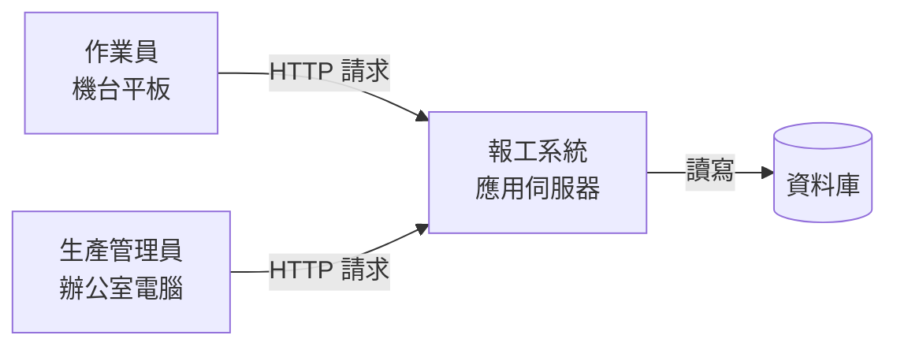
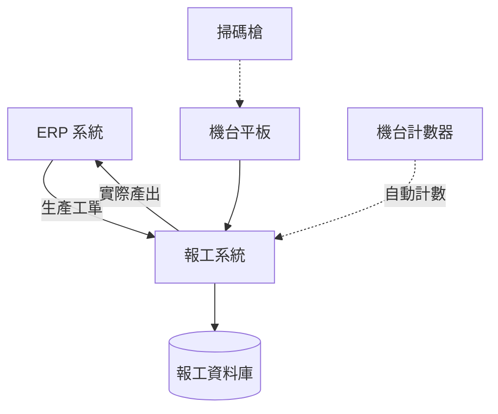

# 系統環境與架構

到目前為止，系統在報告裡一直是一個抽象的東西：它有功能、有流程、有資料，但它到底「放在哪裡」？作業員站在機台旁看到的那個畫面，是從哪裡來的？他按下送出之後，資料跑去哪裡了？如果現場網路斷了，那筆資料還在不在？

這些問題的答案就是系統架構。**架構回答的是「這套系統由哪些部分組成、各部分放在哪裡、彼此怎麼連」**，它把前面幾章的抽象分析，落到看得見摸得著的機器、網路與地點上。

對工業工程背景的人來說，這一章其實比想像中親切。你已經很習慣畫廠房布置圖、物料流動圖——哪個工站在哪裡、東西怎麼從 A 送到 B、中間有沒有瓶頸。系統架構圖是同一種思考方式，只是流動的東西從物料換成資料。

本章不打算把你變成軟體架構師。**期中要能看懂既有系統怎麼組成，期末要能決定新系統放在哪、和誰連接**，做到這兩件事就夠了。微服務、負載平衡這些字眼會出現，但只是讓你聽得懂別人在講什麼，不是要你在報告裡用上。

> **前情提要**：本章假設你已讀過[「系統分析與設計導論」](Systems-and-Analysis.md)〈二、2.3〉工廠常見的資訊系統，並完成[「資料建模與資料庫設計」](Data-Modeling.md)的資料模型。本章沿用同一情境：某金屬沖壓工廠導入生產報工與工單追蹤系統。

> **延伸閱讀**：兩套系統之間實際交換什麼資料、什麼時候換、失敗了怎麼辦，屬於介面設計的範圍，本章只處理「誰跟誰連」這一層。

> **必讀標記**：標題後加註 🔴 期中必讀 的小節，是期中小組報告九項產出直接會用到的內容；加註 🔵 期末必讀 的，是期末八項產出直接會用到的。判準與成品的樣子，期中見[「系統分析階段繳交規範」](../example-system/Analysis-Phase-Deliverables.md)與[「系統分析範例報告」](../example-system/Analysis-Phase-Sample-Report.md)，期末見[「系統設計階段繳交規範」](../example-system/Design-Phase-Deliverables.md)與[「系統設計範例報告」](../example-system/Design-Phase-Sample-Report.md)。未標記的小節仍屬課程範圍，只是報告不會直接產出。

## 一、架構在回答什麼 🔴 期中必讀 🔵 期末必讀

### 1.1 四個問題 🔴 期中必讀 🔵 期末必讀

一張合格的系統架構圖要回答四個問題：

| 問題 | 圖上要看得出 |
|---|---|
| 系統由哪些部分組成 | 使用者端、應用系統、資料庫、外部系統 |
| 各部分在哪裡 | 現場、機房、雲端；哪些在公司內、哪些在外 |
| 彼此怎麼連 | 誰呼叫誰、資料往哪個方向流、走什麼網路 |
| 誰主動 | 箭頭的方向：是誰先開口，另一方只是回應 |

**第二個問題最常被學生略過，卻是實務上最重要的。** 系統放在公司機房或放在雲端，決定了網路斷線時還能不能用、資料出不出得了公司、要不要租頻寬。這些不是技術偏好，是會影響現場作業的決定。

第四個問題看起來瑣碎，答案卻常常出乎意料。多數以瀏覽器操作的系統，一律由使用者發起、系統只負責回應，自己不會主動推送任何東西——這代表使用者不重新整理畫面就看不到別人剛做的變動。你把這件事寫進報告，等於解釋了一整類「為什麼資料看起來不即時」的現象。牽涉到兩套系統時，這一問更關鍵：是甲系統主動把資料推過去，還是乙系統定時去拉？答案不同，失敗時該由誰重試也不同。

### 1.2 架構決策的特徵 🔵 期末必讀

架構決策與一般的設計決策有兩個差別：**難改**，以及 **影響全局**。

按鈕的顏色不喜歡可以隨時換，但「資料庫放在雲端」這個決定一旦做了，改起來要搬資料、改連線、重新測試、重新談網路合約。同樣地，架構決定會限制後面所有的設計：選了現場離線也要能用，報工功能就得設計本機暫存與後續同步；選了純雲端，現場網路品質就成了系統可用性的上限。

判斷一個決定是不是架構決策，可以問：**如果三個月後想改，要動到幾個地方？** 答案是「很多地方」的，就是架構層級的。

## 二、最基本的三段結構 🔴 期中必讀 🔵 期末必讀

### 2.1 使用者端、應用系統、資料庫 🔴 期中必讀 🔵 期末必讀

幾乎所有的商用資訊系統都可以先拆成三段：

| 段 | 負責什麼 | 報工系統的例子 |
|---|---|---|
| 使用者端（前端） | 顯示畫面、接收操作 | 機台旁平板上的瀏覽器畫面 |
| 應用系統（後端） | 執行業務規則、處理請求 | 檢核數量、更新工單進度 |
| 資料庫 | 儲存與查詢資料 | 工單、報工紀錄、機台、人員 |

這三段的分工是：使用者端只管顯示與收集輸入，不做判斷；業務規則集中在應用系統；資料只透過應用系統存取，不讓使用者端直接碰資料庫。

**「業務規則放在哪裡」是這三段裡最關鍵的分工。** 如果「回報數量不得超過需求量」這條規則寫在使用者端的畫面上，那麼繞過畫面就能寫入錯誤資料；寫在應用系統，才擋得住。這也解釋了為什麼分析階段整理出來的需求，多數會落在中間那一段。

### 2.2 主從式架構

**[主從式架構](https://zh.wikipedia.org/wiki/主从式架构)（Client-Server）是最常見的組合方式**：使用者端（Client）發出請求，伺服器（Server）處理後回應。你用瀏覽器開任何一個網站，都是這個模式。

本課程期中分析的系統多半就是這一類：使用者開瀏覽器操作，資料存在後端資料庫。畫成圖是這樣：

這張圖已經回答了第一節的前兩個問題的一部分：有哪些部分、誰跟誰連。**期中報告的最低要求就是畫得出這張圖**，並且說得出每個方框放在哪裡。

### 2.3 分層式架構 🔵 期末必讀

把應用系統內部再切開，就是分層式架構。常見的切法是三層：

| 層 | 負責 |
|---|---|
| 表現層（Presentation） | 產生畫面、處理使用者輸入 |
| 業務邏輯層（Business Logic） | 執行規則、計算、流程控制 |
| 資料存取層（Data Access） | 與資料庫溝通 |

分層的目的是 **讓改動侷限在一層裡**。換一套資料庫，理論上只要改資料存取層；改一條業務規則，只動業務邏輯層。這與[「功能分析」](Functional-Analysis.md)〈五、5.2〉模組劃分講的高內聚、低耦合是同一個原則，只是切的方向不同——模組是依業務領域縱向切，分層是依技術職責橫向切。

**期中不必推導分層決策**，那是替新系統做選擇時的事。但既有系統若明顯看得出這種分工——路由與畫面產生一段、各子系統一段、資料存取一段——把它畫進架構圖裡會讓那張圖有內容得多，因為它同時說明了「業務規則放在哪一層」。期末要說明模組怎麼放時，這個概念會再用到。

## 三、外部系統與現場設備 🔵 期末必讀

### 3.1 系統很少單獨存在 🔵 期末必讀

工廠裡的資訊系統幾乎都要與別的系統往來。以報工系統為例：

圖上要標出三件事：**哪些是外部系統**（ERP 在系統邊界之外）、**資料往哪個方向流**（工單進來、產出回去，是雙向）、**哪些是現場設備**（掃碼槍、計數器）。

### 3.2 現場設備要單獨標出來 🔵 期末必讀

一般的商用系統架構圖只有電腦與伺服器，但工廠場域多了一類東西：**與實體世界接觸的設備**。

| 設備 | 在架構上的角色 |
|---|---|
| 掃碼槍 | 輸入裝置，多半接在平板或電腦上 |
| 機台計數器、PLC | 資料來源，可能自動送出產出數 |
| 標籤印表機 | 輸出裝置 |
| 現場終端（平板、工業電腦） | 使用者端，但環境條件嚴苛 |

這些設備要畫進架構圖，因為它們會帶來一般辦公室系統沒有的限制：**掃碼槍的輸入格式、計數器的通訊協定、平板在油污與手套環境下的可用性**。分析階段忽略它們，設計出來的系統到現場就用不了。

### 3.3 介接的方向與責任 🔵 期末必讀

兩套系統相連時，圖上的箭頭方向代表誰主動。ERP 把工單「推」給報工系統，與報工系統定時去 ERP「拉」工單，是兩種不同的設計，維護責任也不同。

**期中只要標出誰跟誰連、資料往哪個方向流就夠了。** 交換的內容、頻率、失敗怎麼處理，屬於介面設計的範圍，期末才需要展開——而且依[「報告內容」](../00-Course-Introduction/Report-Contents.md)期末第 5 項，那是題目有外部系統時才要交的。

## 四、系統放在哪裡 🔵 期末必讀

### 4.1 地端、雲端與混合 🔵 期末必讀

| 型態 | 意思 | 特點 |
|---|---|---|
| 地端（On-premises） | 伺服器放在自己的機房 | 資料不出公司、網路斷了內部仍可用、要自己維護 |
| 雲端（Cloud） | 租用外部的運算與儲存服務 | 不必自購硬體、可彈性擴充、依賴對外網路 |
| 混合（Hybrid） | 兩者並用 | 敏感資料留地端，其他放雲端 |

[雲端運算](https://zh.wikipedia.org/wiki/云计算)在一般商用系統已是主流，但 **製造現場有兩個因素會把天平拉回地端**：

**網路可靠度。** 產線不能因為對外網路斷線就停止報工。如果系統完全依賴雲端，現場斷網時作業員就無法回報——除非設計本機暫存與後續同步，而那是額外的複雜度。

**資料敏感度。** 生產數量、良率、客戶訂單是製造業的核心機密，有些公司的政策就是不出廠區。這不是技術問題，是管理決策，分析時要問清楚。

### 4.2 網路環境要看清楚 🔵 期末必讀

工廠的網路通常不是一整片，而是分區的：辦公網段、生產網段、機台控制網段之間可能有防火牆隔開，甚至完全不通。

**這件事在期中分析時要問，在期末設計時要納入考量。** 一個把伺服器放在辦公網段、卻要讓生產網段的平板連線的設計，可能在技術上完全行得通，但公司的資安政策不允許。到了實際導入才發現，就得整套重來。

## 五、架構受什麼限制 🔵 期末必讀

### 5.1 非功能需求決定架構 🔵 期末必讀

架構不是憑喜好選的，是被非功能需求逼出來的。[「系統需求分析」](System-Requirements-Analysis.md)〈三〉整理的那些非功能需求，每一條都會轉成架構上的要求：

| 非功能需求 | 對架構的要求 |
|---|---|
| 生產時段可用率 99.5% | 不能有單點故障，或至少要有快速復原機制 |
| 現場斷網仍可回報 | 使用者端要有本機暫存能力 |
| 報工回應時間 2 秒內 | 伺服器要放得夠近，或減少不必要的查詢 |
| 報工紀錄要留修改軌跡 | 資料庫要有異動紀錄的設計 |

**這張對照表直接就是期末報告「架構決策說明」的內容**：不是說「我們採用三層式架構」，而是說「因為要求現場斷網仍可回報，所以使用者端採用可離線暫存的設計」。

### 5.2 取捨無法避免 🔵 期末必讀

非功能需求之間會互相衝突，架構就是在衝突之間做取捨：

- 要高可用，就要多備一套，成本上升。
- 要資料不出廠區，就放棄雲端的彈性與免維護。
- 要回應快，可能要犧牲一部分資料的即時一致性。

**期末報告要說得出你選了什麼、放棄了什麼、為什麼。** 只寫選了什麼而不寫代價，代表沒有真的比較過。

### 5.3 現場條件是硬限制 🔵 期末必讀

前面幾項還可以談，現場條件則多半沒得商量：機台旁沒有網路孔、防爆區不能放一般電腦、作業員戴手套沒辦法用電容式觸控、廠房太吵聽不到提示音。

這些限制在架構階段就要納入，因為它們會直接推翻某些方案。**這也是工管背景的人在架構討論裡最有貢獻的時候**——資訊人員很難憑空知道那一區為什麼不能放設備。

## 六、期中與期末各做到哪裡 🔴 期中必讀 🔵 期末必讀

### 6.1 期中：反推既有系統的組成 🔴 期中必讀

期中分析既有系統，架構是看出來的，不是設計出來的。三個線索：

**從使用情境看。** 使用者在什麼裝置上操作？辦公室電腦、現場平板、手機？這決定了使用者端有哪幾種。

**從網址與登入方式看。** 系統是內部網址還是對外網址，可以推測它放在地端還是雲端；要不要連 VPN 才能用，透露了網路分區的狀況。

**從資料來源看。** 系統上有沒有從別的地方帶進來的資料——例如人員名單來自人事系統、產品資料來自 ERP——那些就是外部系統。

期中的最低要求是畫出使用者端、應用系統、資料庫與外部系統的關係，圖上要標得出〈一、1.1〉那四件事：有哪些部分、各部分在哪裡、彼此怎麼連、誰主動。**不必分析微服務、負載平衡或複雜的雲端服務設計**，那些既看不出來也不是重點。

除了圖，還要用一張表交代 **使用環境**。這一段常被寫成一句「使用者用電腦操作」就結束，但它至少該回答四件事：

| 面向 | 要回答的 |
|---|---|
| 使用裝置 | 桌機、筆電、現場平板還是手機 |
| 行動裝置 | 版面有沒有針對小螢幕調整，手機上能不能實際操作 |
| 網路 | 一定要連線嗎，斷線時能不能暫存、事後補送 |
| 畫面產生方式 | 整頁重新載入，還是在原地更新 |

最後一列需要解釋一下，因為它牽涉到一個沒有實際做過系統的人不容易察覺的差別。**有些系統每次操作都由伺服器產生一整頁完整的畫面回傳**，所以你按下任何按鈕，整個畫面都會閃一下重新載入，網址也跟著換；**另一些系統只在背景要回變動的那一小塊資料，畫面其他地方不動**，操作起來像在同一頁上直接改東西。分辨方法很簡單：按下送出鍵，看整頁會不會重新載入、網址會不會變。

這一列值得寫，因為它解釋了這套系統的操作為什麼是「送出表單然後換頁」而不是原地更新——那是架構決定的行為，不是設計者偷懶。它也影響後面的判斷：整頁重載的系統，使用者永遠看到的是他上次載入時的狀態，別人剛改的東西他不會自動看到。

### 6.2 期末：決定新系統的架構 🔵 期末必讀

期末要自己決定，並說明理由。要交代四件事：

| 要說明 | 具體內容 |
|---|---|
| 系統放在哪裡 | 地端、雲端或混合，以及為什麼 |
| 和誰連接 | 外部系統與現場設備，以及資料流向與誰主動 |
| 主要資料怎麼流動 | 從輸入到儲存到查詢，經過哪些部分 |
| 業務規則放在哪一層 | 檢核與判斷由誰負責，使用者端承不承擔任何判斷 |
| 為什麼選這種架構 | 對應到哪幾條非功能需求或現場限制 |

最後一項是分數的關鍵。**沒有理由的架構圖只是一張示意圖**，看不出你有沒有想過別的選擇。理由要接回第五節的非功能需求與現場限制，而不是「因為三層式架構比較常見」。做法是把非功能需求逐條拿出來，說明它在架構上留下了什麼——〈五、5.1〉那張對照表就是這一段的骨架。

其中最值得單獨寫一段的，是**用架構把可靠性問題隔離掉、而不是用錯誤處理擋掉**的那種決定。與外部系統的同步如果掛在「使用者操作時順便去查一下」的路徑上，對方一慢，你的現場就跟著停；把它改成獨立的一條非同步排程路徑，「外部系統掛掉會不會害現場停工」這個問題在架構圖上就回答掉了。

**除了圖，期末同樣要交一張使用環境表**，欄位比期中多幾項：除了〈六、6.1〉那四項，再加上使用場域的物理條件、操作者狀態、同時使用人數與尖峰時段、資料量與保存年限、備份方式。**這幾項不是背景資訊，它們是設計條件**——「尖峰在交班前十分鐘、二十台終端同時送出」這一句，會直接變成後面風險分析裡估算發生機率的依據。

## 七、聽得懂就好的進階概念

以下幾個名詞在業界討論中常出現，本課程 **不要求在報告裡使用**，但你應該聽得懂。

**單體與[微服務](https://zh.wikipedia.org/wiki/微服務)。** 單體（Monolithic）是把整套應用做成一個程式；微服務是拆成許多獨立的小服務，各自可以單獨更新與擴充。微服務適合超大型、多團隊並行開發的系統，代價是維運複雜度大幅上升。**課程規模的題目一律用單體就好**，在報告裡提微服務多半會在訪談時被追問到答不出來。

**[負載平衡](https://zh.wikipedia.org/wiki/负载均衡)。** 把大量請求分散到多台伺服器，避免單台被打爆。同時上線人數不多的系統用不到。

**高可用（High Availability）。** 用備援設計讓系統在部分故障時仍能運作，例如兩台伺服器互為備援。要不要做，取決於停機一小時的損失有多大——這是成本效益問題，不是技術問題。

**這一節的用意是劃界線。** 這些概念本身沒有錯，但用在規模不對的題目上，會讓報告看起來像在堆名詞。**選一個做得到、說得清楚、對得上需求的架構，比選一個聽起來厲害的架構更能拿分。**

## 八、學習重點總結

讀完本章後，你應該能夠理解以下核心概念，並將其應用於工業場域的思考與決策：

**架構回答的是「放在哪裡、怎麼連」**

前面各章把系統當成一個抽象的東西來分析，架構則把它落到看得見的機器、網路與地點上。一張合格的架構圖要看得出系統由哪些部分組成、各部分在哪裡、彼此怎麼連——其中「在哪裡」最常被略過，卻直接決定了斷網時能不能用、資料出不出得了公司。

**架構決策的特徵是難改且影響全局**

判斷一個決定是不是架構層級，問「三個月後想改要動到幾個地方」。資料庫放雲端、現場要不要能離線作業，這類決定一旦做了就會限制後面所有的設計；而按鈕顏色、欄位排列隨時可以換。難改的決定值得在分析階段多花時間確認。

**業務規則要放在應用系統，不能放在使用者端**

三段結構裡，使用者端只管顯示與收集輸入，判斷與規則集中在應用系統。把「數量不得超過需求量」這種規則寫在畫面上，繞過畫面就能寫入錯誤資料。所以你在分析階段整理出來的那些需求，多數的歸屬地是中間那一段——這也是為什麼看不懂架構圖的人，往往也說不清楚自己的需求最後由誰負責實現。

**製造現場的設備與網路要單獨標出來**

一般商用系統的架構圖只有電腦與伺服器，工廠場域多了掃碼槍、計數器、工業平板這類與實體世界接觸的設備，以及分區隔離的網路。這些會帶來一般辦公室系統沒有的限制，分析時忽略它們，設計出來的系統到現場就用不了。

**架構是被非功能需求逼出來的，不是選喜歡的**

可用率、回應時間、離線需求、資料不得外流，每一條非功能需求都會轉成架構上的要求。說出架構的名稱只是分類，說得出是哪一條需求逼出這個選擇，才算設計。放棄了什麼也要一併寫——比較過才有取捨可寫，只寫選擇的報告等於承認沒比較。

**規模不對的架構是扣分不是加分**

微服務、負載平衡、高可用這些概念本身沒錯，但用在課程規模的題目上，會讓報告看起來像在堆名詞，而且訪談時容易被追問到答不出來。選一個做得到、說得清楚、對得上需求的架構，永遠比選一個聽起來厲害的架構有價值。

> **銜接提示**：架構決定之後，還剩一個問題沒答：這套方案真的做得出來嗎？下一章[「可行性、限制與風險分析」](Feasibility-and-Risk.md)把設計拿去和現實對帳——預算、時程、人力、場地與組織條件撐不撐得住，哪些既定限制不能碰，哪些事情可能出錯。本章談的資料不得離廠、現場網路品質，到下一章會變成限制與風險登記表上的條目。

## 參考文獻

- Bass, L., Clements, P., & Kazman, R. (2021). *Software architecture in practice* (4th ed.). Addison-Wesley.
- Bengtsson, P., Lassing, N., Bosch, J., & van Vliet, H. (2004). Architecture-level modifiability analysis (ALMA). *Journal of Systems and Software*, *69*(1–2), 129–147. https://doi.org/10.1016/S0164-1212(03)00080-3
- Buschmann, F., Meunier, R., Rohnert, H., Sommerlad, P., & Stal, M. (1996). *Pattern-oriented software architecture: A system of patterns*. Wiley.
- Clements, P., Bachmann, F., Bass, L., Garlan, D., Ivers, J., Little, R., Merson, P., Nord, R., & Stafford, J. (2010). *Documenting software architectures: Views and beyond* (2nd ed.). Addison-Wesley.
- Dennis, A., Wixom, B. H., & Roth, R. M. (2018). *Systems analysis and design* (7th ed.). Wiley.
- Fowler, M. (2002). *Patterns of enterprise application architecture*. Addison-Wesley.
- Hohpe, G., & Woolf, B. (2003). *Enterprise integration patterns: Designing, building, and deploying messaging solutions*. Addison-Wesley.
- International Organization for Standardization. (2011). *ISO/IEC/IEEE 42010:2011 — Systems and software engineering: Architecture description*. ISO.
- Kendall, K. E., & Kendall, J. E. (2019). *Systems analysis and design* (10th ed.). Pearson.
- Kruchten, P. (1995). The 4+1 view model of architecture. *IEEE Software*, *12*(6), 42–50. https://doi.org/10.1109/52.469759
- Laudon, K. C., & Laudon, J. P. (2020). *Management information systems: Managing the digital firm* (16th ed.). Pearson.
- Mell, P., & Grance, T. (2011). *The NIST definition of cloud computing* (NIST Special Publication 800-145). National Institute of Standards and Technology. https://doi.org/10.6028/NIST.SP.800-145
- Newman, S. (2021). *Building microservices: Designing fine-grained systems* (2nd ed.). O'Reilly Media.
- Nygard, M. T. (2018). *Release it! Design and deploy production-ready software* (2nd ed.). Pragmatic Bookshelf.
- Parnas, D. L. (1972). On the criteria to be used in decomposing systems into modules. *Communications of the ACM*, *15*(12), 1053–1058. https://doi.org/10.1145/361598.361623
- Richards, M., & Ford, N. (2020). *Fundamentals of software architecture: An engineering approach*. O'Reilly Media.
- Rozanski, N., & Woods, E. (2011). *Software systems architecture: Working with stakeholders using viewpoints and perspectives* (2nd ed.). Addison-Wesley.
- Scholten, U. (2007). *The road to integration: A guide to applying the ISA-95 standard in manufacturing*. ISA.
- Sommerville, I. (2016). *Software engineering* (10th ed.). Pearson.
- Tanenbaum, A. S., & van Steen, M. (2017). *Distributed systems: Principles and paradigms* (3rd ed.). Pearson.
- Whitten, J. L., & Bentley, L. D. (2007). *Systems analysis and design methods* (7th ed.). McGraw-Hill.

---

*本章把前面各章的抽象分析落到實體的機器、網路與地點上。建議的延伸練習是：畫出你實習或打工場域裡某一套系統的架構圖，標出使用者端、應用系統、資料庫與所有外部系統，然後問三個問題——網路斷了還能不能用、資料存在公司內還是外面、哪一個方框壞掉會讓整套系統停擺。第三個問題如果指向某一個方框，那就是這套系統的單點，值得問問看有沒有人為它做過準備。*
