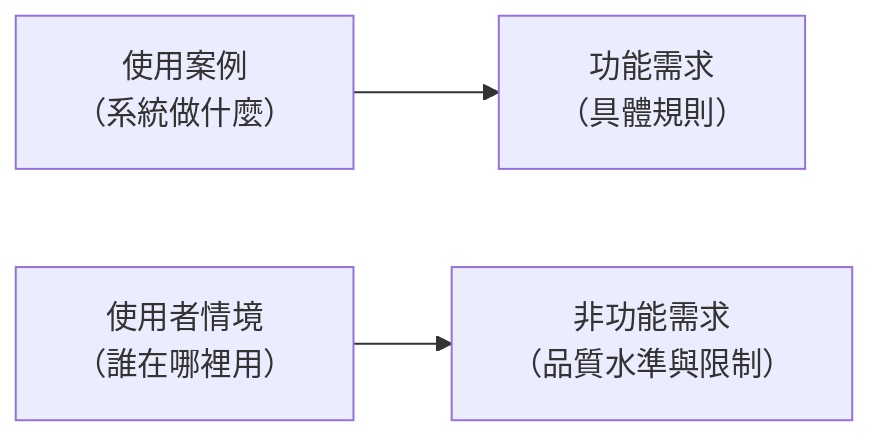

# 系統需求分析

「我們希望系統能即時看到生產進度」是一句期待，不是一項需求。它沒有說明「即時」是三秒還是三十分鐘、「進度」包含哪些欄位、資料由誰輸入、輸入錯了怎麼修正、同時有多少人查詢時系統還撐不撐得住。你不在分析階段回答這些問題，它們就會在開發階段由工程師各自猜測，最後在驗收會議上引爆。

系統需求分析要做的，就是把期待轉換成 **可驗證** 的敘述——每一條都能在系統做出來之後回答「符合」或「不符合」，沒有第三種答案。本章分成兩個主軸：功能需求回答「系統要做什麼」，非功能需求回答「要做到什麼程度、在什麼限制下做」。前者決定系統有沒有用，後者決定系統能不能用。

> **前情提要**：本章假設你已完成[「使用者分析」](User-Analysis.md)所述的利害關係人、流程與使用案例分析。本章沿用同一個情境：某金屬沖壓工廠導入生產報工與工單追蹤系統。

> **延伸閱讀**：需求清單在各組報告中的繳交格式與最低標準，見[「系統分析階段繳交規範」](../example-system/Analysis-Phase-Deliverables.md)〈三、4〉。

> **必讀標記**：標題後加註 🔴 期中必讀 的小節，是期中小組報告九項產出直接會用到的內容；加註 🔵 期末必讀 的，是期末八項產出直接會用到的。判準與成品的樣子，期中見[「系統分析階段繳交規範」](../example-system/Analysis-Phase-Deliverables.md)與[「系統分析範例報告」](../example-system/Analysis-Phase-Sample-Report.md)，期末見[「系統設計階段繳交規範」](../example-system/Design-Phase-Deliverables.md)與[「系統設計範例報告」](../example-system/Design-Phase-Sample-Report.md)。未標記的小節仍屬課程範圍，只是報告不會直接產出。

## 一、從期待到需求 🔴 期中必讀

### 1.1 需求的五個級別

需求不是同一個層次的東西堆在一起。從最抽象到最具體，可分為五個級別：

| 級別 | 回答的問題 | 報工系統的例子 |
|---|---|---|
| 商業需求（Business Requirements） | 公司為什麼要投資這個專案 | 縮短生產進度回報時間，將訂單準交率由 82% 提升至 92% |
| 利害關係人需求（Stakeholder Requirements） | 各方各自期待得到什麼 | 生產管理員希望隨時掌握各機台進度；作業員希望回報不佔用生產時間 |
| 功能需求（Functional Requirements） | 系統要提供哪些能力 | 系統應提供以掃描工單條碼方式回報完工數量的功能 |
| 非功能需求（Non-functional Requirements） | 這些能力要達到什麼水準、受什麼限制 | 回報動作自掃描到顯示完成，反應時間不得超過 2 秒 |
| 過渡需求（Transition Requirements） | 從現況切換到新系統需要什麼 | 需將既有 3 個月的紙本工單資料轉入系統；需為 120 位作業員辦理教育訓練 |

這個層級關係決定了兩件事。第一，**下層需求必須能追溯到上層**。一項功能需求若對應不到任何一項商業需求或利害關係人需求，你就要問它為什麼存在，那通常是有人「順便」加進來的。第二，**過渡需求最常被遺漏**。資料轉換、教育訓練、新舊系統並行期間的作業方式，這些工作在專案末期才發現時，往往已經沒有時間與預算可以安排。

### 1.2 需求工程的四個階段

處理需求的整套過程稱為 **[需求工程](https://zh.wikipedia.org/wiki/需求工程)（Requirements Engineering, RE）**，分四個階段：

| 階段 | 工作內容 | 產出 |
|---|---|---|
| 需求收集 | 確定並蒐集來自不同來源的需求資訊 | 訪談紀錄、觀察筆記、問卷統計 |
| 需求分析 | 提煉、研判與審查已收集的資訊，找出其中的錯誤、矛盾、遺漏或不足 | 需求清單、使用案例、分析模型 |
| 需求描述 | 以標準格式描述系統需求 | 系統需求規格（SRS） |
| 需求驗證 | 審查需求是否正確且完整地表達使用者的需要，並取得客戶確認 | 經簽核的 SRS |

四個階段不是一次走完的直線，而是反覆疊代：驗證時發現遺漏，就退回收集；分析時發現矛盾，就再訪談一次。上一章的工作屬於前兩個階段，本章則集中在「描述」與「驗證」——把已經理解的需要，寫成能被檢查的文字。

### 1.3 使用案例與需求的關係 🔴 期中必讀

上一章畫出的使用案例圖界定了系統範圍，但它本身還不是需求規格。兩者的分工是：

以「回報完工數量」這個使用案例為例，展開後會得到一組功能需求（如何辨識工單、數量如何檢核、資料如何更新），以及一組非功能需求（反應時間多久、離線時如何處理、誰有權限修改已送出的紀錄）。**一個使用案例通常展開成 5 到 15 條功能需求**。你只展開出一兩條，多半是使用案例的 **粒度**（granularity，指一個項目切得多粗或多細）切得太細；展開出五十條，則是那個使用案例應該再拆分。

## 二、功能需求 🔴 期中必讀 🔵 期末必讀

**功能需求描述系統必須提供的行為：在什麼條件下、接收什麼輸入、執行什麼處理、產生什麼輸出。** 判斷一項敘述是不是功能需求，最簡單的方法是問：它描述的是「系統會做的一件事」嗎？

### 2.1 功能需求的來源 🔴 期中必讀

功能需求有四個來源，你逐一盤點可大幅降低遺漏：

| 來源 | 說明 | 例子 |
|---|---|---|
| 使用案例展開 | 每個使用案例的主要流程與例外流程 | 掃描條碼取得工單、輸入數量、檢核、更新進度 |
| 事件表 | 每個事件對應的系統回應，特別是暫時事件與狀態事件 | 每日 24 時自動結算產量；不良率超標時發出通知 |
| 資料的生命週期 | 每一類主要資料的新增、查詢、修改、刪除與封存 | 工單資料、機台資料、人員資料的維護功能 |
| 法規與公司規章 | 外部要求轉成的系統行為 | 生產紀錄須保存三年不得竄改，修改需留下軌跡 |

第三項最常漏。分析時你的注意力都在主要交易流程上，很容易忘了「誰來維護機台基本資料」這類支援性功能，結果系統上線時發現新增一台機器還要請工程師改資料庫。

上面四個來源適用於系統還沒做出來的時候。**分析一套已經在運作的系統時，需求不是問出來的，是從系統本身查出來的**，來源換成另外四種證據：

| 證據型別 | 你要去看什麼 | 推出來的需求長什麼樣 |
|---|---|---|
| 畫面 | 每個頁面上有哪些欄位、按鈕、清單，哪些依身分而不同 | 系統應提供首頁，並依登入狀態顯示不同內容 |
| 路由與操作路徑 | 一個按鈕按下去會到哪一頁，哪些網址不登入就打不開 | 系統應阻擋未登入者進入個人資料頁 |
| 資料欄位 | 資料表有哪些欄位、預設值是什麼、哪一欄有唯一限制 | 新申請的帳號一律為一般會員；系統應拒絕重複的電子郵件註冊 |
| 錯誤訊息 | 故意做錯，把系統回給你的每一則訊息原文抄下來 | 申請帳號時應檢核電子郵件格式、密碼長度與兩次密碼是否一致 |

四種證據裡，**錯誤訊息的產出效率最高**。順利完成一次操作，你只知道系統做得到這件事；被擋下一次，你知道的是系統認為什麼情況不合法，而那才是規則。所以分析既有系統時，把每個欄位留空送出、填錯格式送出、用沒有權限的身分去點，是必做的功課。

### 2.2 功能需求的寫法 🔴 期中必讀 🔵 期末必讀

一條功能需求應包含 **條件、主體、行為、對象** 四個成分，並使用「應（shall）」表示強制要求：

> **FR-012**　當作業員掃描的工單條碼在系統中不存在時，系統應顯示錯誤訊息並保留原輸入畫面，不得清除已輸入的數量。

這條需求把條件（條碼不存在）、主體（系統）、行為（顯示錯誤訊息、保留畫面、不清除數量）都寫明了，因此可以直接轉成測試案例。對照下面這種常見的寫法：

> ❌ 系統要能處理條碼錯誤的情況。

「處理」是什麼意思？顯示訊息？自動略過？跳回首頁？三種做法都符合這句話，但對作業員的影響完全不同。驗收時客戶說不對，開發團隊說有做，爭議就從這裡開始。

### 2.3 功能需求清單的範例 🔴 期中必讀 🔵 期末必讀

以「回報完工數量」使用案例展開的部分功能需求：

| 編號 | 需求敘述 | 來源 |
|---|---|---|
| FR-010 | 系統應提供以掃描一維條碼方式輸入工單編號的功能 | UC-01 主要流程 |
| FR-011 | 系統應在讀取工單後顯示品名、需求數量與已完工數量 | UC-01 主要流程 |
| FR-012 | 當工單條碼不存在時，系統應顯示錯誤訊息並保留原輸入畫面 | UC-01 例外流程 |
| FR-013 | 當輸入的完工數量使累計數超過需求數量時，系統應要求作業員確認後才可送出 | UC-01 例外流程 |
| FR-014 | 系統應記錄每筆回報的工單編號、機台編號、作業員工號、數量與時間 | 資料生命週期 |
| FR-015 | 作業員應能於送出後 30 分鐘內修正自己回報的數量，逾時須由線長代為修正 | 訪談：人物誌「擔心按錯」 |

FR-015 值得注意：它來自上一章人物誌中「擔心按錯會被記過」那句話。一個看似心理層面的觀察，最後落實為一條有明確時限與權限規則的功能需求——這正是使用者分析與需求分析之間的實際連結。

上表最右邊那一欄，在分析既有系統時要改個名字叫 **「依據」**，內容換成你在系統上查到的證據：

| 編號 | 需求敘述 | 依據 |
|---|---|---|
| FR-06 | 系統應提供登入功能，成功後記錄最後登入時間 | 登入流程實測；`users.last_login_at` 欄位 |
| FR-07 | 系統應阻擋已停用或已刪除的帳號登入 | 以停用的測試帳號實際登入，被擋下 |
| FR-17 | 系統應僅允許管理員刪除文章與回覆，刪除文章時一併刪除其所有回覆 | 一般會員的文章上沒有刪除按鈕；刪除一篇文章後其回覆一併消失 |
| FR-21 | 系統應禁止管理員對自己執行停用、刪除與角色調整 | 三則自我保護的錯誤訊息 |

**「依據」這一欄是期中報告的評分重點，也是訪談時最容易被追問的地方。** 有了它，讀者才分得出哪幾條是你查到的、哪幾條是你想像的。填不出依據的需求只有兩種可能：一種是這個功能根本不存在，你把「應該要有」誤當成「已經有」；另一種是它存在，但你還沒找到它在哪裡，那就回去找。兩種都不能留著不管。

## 三、非功能需求 🔴 期中必讀 🔵 期末必讀

**非功能需求描述系統的品質水準與必須遵守的限制，不描述系統做什麼，而描述系統做得如何。** 它們是系統上線後最常被抱怨的部分：功能都有，但慢、當機、難用、資料被亂改，使用者一樣不會用。

### 3.1 FURPS+ 分類 🔵 期末必讀

實務上常用 **FURPS+** 模式盤點非功能需求。前五個字母各代表一類品質特性，加號代表各類約束：

| 類別 | 涵蓋內容 | 報工系統的例子 |
|---|---|---|
| 功能（Functionality） | 能力、可重用性、安全性、利用度 | 只有線長以上職務可修改他人的報工紀錄 |
| 易用性（Usability） | 人因、美觀、一致性、說明文件、回應速度 | 作業員在戴手套狀態下應能完成回報，操作步驟不超過 3 步 |
| 可靠度（Reliability） | 可用性、故障範圍與復原時間、可預測性、準確性 | 生產時段（08:00–20:00）可用率應達 99.5%；故障復原時間不超過 30 分鐘 |
| 效能（Performance） | 速度、效率、資源消耗、流通量、容量、可擴展性 | 尖峰時段 60 人同時操作時，回報反應時間不超過 2 秒 |
| 支援性（Supportability） | 可測試性、彈性、可安裝性、在地化 | 新增機台不需修改程式，由管理者於後台設定即可 |

加號部分是四類 **約束（constraints）** ——不是「做得多好」，而是「不准怎麼做」：

| 約束類型 | 說明 | 例子 |
|---|---|---|
| 設計約束 | 設計上的限制 | 現場端介面須為單一畫面，不得使用多層選單 |
| 實作約束 | 程式碼或執行環境的限制 | 需能在工廠現有的 Windows 平板上執行 |
| 介面約束 | 與外部系統互通的要求 | 工單資料須透過 ERP 提供的 API 取得，不得直接讀取其資料庫 |
| 實體約束 | 硬體或環境的限制 | 現場終端須具備 IP54 防塵防水等級，並可在 40°C 環境運作 |

約束的特徵是它們幾乎都來自現場的物理條件與既有系統，而不是來自使用者的期望。這也是工業場域的系統與一般商業軟體最大的差別——粉塵、油污、手套、噪音、電磁干擾，這些都會變成系統的硬性限制。

### 3.2 另一套參考架構：ISO/IEC 25010

國際標準 [ISO/IEC 25010](https://zh.wikipedia.org/wiki/ISO/IEC_9126) 把軟體品質分為八個特性：功能適用性、效能效率、相容性、易用性、可靠性、資訊安全性、維護性、可攜性。它與 FURPS+ 大幅重疊，差別在於多獨立出「相容性」「資訊安全性」與「可攜性」三項。

實務上兩套擇一使用即可，重點不在採用哪一套，而在於 **有一份固定的檢查清單**。你逐項自問「這個系統在這個面向有沒有要求」；沒有清單，就只會想到效能與安全，其餘全部漏掉。

### 3.3 非功能需求必須量化 🔵 期末必讀

非功能需求最常見的毛病是寫成形容詞：

| ❌ 不可驗證 | ✅ 可驗證 |
|---|---|
| 系統反應要快 | 60 人同時操作時，回報作業自送出至畫面顯示完成，95% 的請求應在 2 秒內完成 |
| 系統要穩定 | 生產時段的月可用率應達 99.5%，即每月非計畫停機不超過 3 小時 |
| 介面要好用 | 未受訓的新進作業員經 5 分鐘說明後，應能獨立完成一次完整回報，錯誤率低於 5% |
| 系統要安全 | 連續登入失敗 5 次應鎖定帳號 15 分鐘；所有報工紀錄的修改須留存修改人、時間與原值 |

量化的方法是找出 **可以測量的指標、目標值與測量條件** 三者。「2 秒」是目標值，「回報作業自送出至畫面顯示完成」是指標定義，「60 人同時操作、95% 的請求」是測量條件。三者缺一，驗收時就會出現爭議。

易用性看起來最難量化，但上表第三列示範了做法：把它轉成一個可以實際執行的測試（找新人來操作，計時、計錯誤率）。凡是你設計得出測試方法的需求，就是可驗證的需求。

**量化的要求適用於你替一套還沒做出來的系統訂標準的時候。** 分析既有系統時，數值目標多半無從得知——沒有人告訴你當初把反應時間訂在幾秒，你量出來的數字也只是這一台機器此刻的表現。這種情況下，非功能需求要寫的不是數值，而是規則與不變條件，詳見下一節。

### 3.4 非功能需求之間會互相衝突 🔵 期末必讀

非功能需求不能各自獨立地訂到最高。常見的衝突包括：

- **安全性 vs 易用性**：每次回報都要輸入密碼最安全，但作業員一班要輸入二十次，結果是大家共用一組帳號登入後整班不登出，安全性反而歸零。
- **效能 vs 成本**：反應時間要求從 2 秒降到 0.5 秒，可能需要升級全廠網路與伺服器，費用超過專案預算。
- **可靠度 vs 時程**：要求 99.99% 可用率意味著需要備援機制，開發時間會拉長數週。

處理方式是你把衝突攤開來，由具備決策權的當責者（見上一章的 RACI）在幾個方案之間選擇，再把選擇的理由記錄在需求文件中。**沒有記錄理由的取捨，半年後一定會被重新爭論一次。**

替新系統寫非功能需求時，還有一個寫法值得學：**每一條後面補一句「它砍掉了哪個看起來很自然的做法」。**

| 非功能需求 | 它否決了什麼 |
|---|---|
| 任一時點顯示的進度，必須與當時的有效報工紀錄一致 | 否決了「在工單表加一個累計數量欄位」——那個欄位查詢最快，但報工被作廢時要跟著改，漏改沒有人會發現 |
| 班別的起訖時間與歸屬規則必須來自資料，不得寫死於程式 | 否決了「晚班是 23:00 到 07:00 寫在程式裡」——換班制度改變時要改程式、重測、重新部署 |

**只列需求而不寫它砍掉了什麼，讀者看不出這條需求有什麼份量。** 這種「一條非功能需求否決一個做法」的關係，也正是設計階段架構決策與資料設計最主要的依據。

### 3.5 既有系統的非功能需求怎麼推 🔴 期中必讀

分析既有系統時，非功能需求不會寫在任何地方，也看不到畫面上。它們藏在一個地方：**同一個動作，在不同狀況下系統給了不同的回應。** 把那些差異擺在一起，規則就浮出來了。

方法是三個步驟：

1. **同一件事，換不同狀態做一次。** 用正常帳號登入一次、用被停用的帳號登入一次、用不存在的帳號登入一次，各記下系統回了什麼。
2. **比較差異。** 前面兩者的訊息不同、後面兩者的訊息卻一模一樣，這就是一個差異。
3. **問這個差異在保護什麼。** 帳號不存在與密碼打錯回同一則訊息，是為了不讓外人藉此試出哪些帳號註冊過；帳號被停用單獨給一則訊息，是因為停用可以回復，告訴當事人去找管理員是合理的。這兩句話寫下來，就是兩條非功能需求。

推出來的需求，長相與量化型的很不一樣，多半是規則或不變條件：

| 編號 | 非功能需求 | 依據 |
|---|---|---|
| NFR-03 | 帳號不存在、已刪除與密碼錯誤三種情況，須回覆相同的錯誤訊息 | 三種情況實測，訊息完全相同 |
| NFR-05 | 權限檢查須依「已登入 → 帳號可用 → 具管理員身分」的順序執行 | 停用中的管理員被登出，而不是收到「權限不足」 |
| NFR-06 | 系統中須永遠至少存在一個可用的管理員 | 由「不可停用自己、不可刪除自己、不可改自己的角色」三條規則推得 |

**這一類需求是整份需求清單裡最有價值的部分。** 功能需求人人抄得出來，因為畫面上有；這幾條要靠交叉比對才推得出來，寫得出來就代表你真的把系統操作過、而且想過為什麼。NFR-06 尤其值得注意——它不對應任何一個畫面、任何一則訊息，是從三條各自獨立的自我保護規則推導出來的結論。

推不出來的部分要誠實標示，不要硬掰。「看不出當初為什麼把角色限定為兩種，需查閱開發紀錄或訪談維護者」這種寫法，比編一個理由有價值得多，被追問時也站得住。

## 四、判斷需求品質的準則 🔴 期中必讀 🔵 期末必讀

無論功能或非功能需求，每一條都應通過下列六項檢查：

| 準則 | 含義 | 反例 |
|---|---|---|
| 正確 | 確實反映使用者的需要 | 把分析師自己的想像寫進去 |
| 明確 | 只有一種解讀方式 | 「系統應適時提醒使用者」——適時是多久？ |
| 完整 | 不遺漏必要條件與例外情況 | 只寫成功情況，沒寫失敗怎麼辦 |
| 一致 | 不與其他需求矛盾 | 一處寫保存三年，另一處寫每年清除 |
| 可驗證 | 能設計出檢查方法 | 「系統應具備良好的使用者體驗」 |
| 可追溯 | 能對應到上層需求與下游設計 | 來源不明、沒人知道為什麼要做的功能 |

實務上最有效的自我檢查是 **可驗證性**：寫完一條需求，立刻問自己「驗收時我要怎麼證明它有做到」。答不出來的，就是還沒寫好。

另外要留意幾個常見的措辭陷阱：

- **模糊量詞**：「快速」「大量」「友善」「適當」「必要時」——你一律要求對方給出數字或明確條件。
- **多重需求擠在一句**：「系統應記錄報工資料並產生日報表且支援匯出 Excel」——這是三條需求，應拆開，否則無法逐項驗收。
- **把解法當需求**：「系統應使用下拉選單選擇機台」——這規定了實作方式。除非有明確理由（如手套操作），否則應寫成「作業員應能從既有機台中選定一台，不需輸入文字」，把設計空間留給設計階段。

最後這一條有個例外：**分析既有系統時，寫下它已經採用的做法，不算把解法當需求。** 「驗證碼應在查詢資料庫之前檢查」規定了執行順序，看起來像在指定實作方式，但它描述的是這套系統現在的事實，而那個順序有它的道理（不查資料庫就先擋掉自動化請求）。差別在於時態：期末替新系統訂需求時，你不該替設計者決定怎麼做；期中描述既有系統時，你的工作正是把它怎麼做的寫清楚。

## 五、需求的優先順序與追溯 🔵 期末必讀

### 5.1 排優先順序 🔵 期末必讀

需求收集的結果幾乎一定超出預算與時程，因此排序是必經步驟。常用的 **MoSCoW** 分類法把需求分成四級：

| 等級 | 含義 | 報工系統的例子 |
|---|---|---|
| Must have | 沒有它系統就沒有意義 | 掃描條碼回報完工數量 |
| Should have | 重要，但短期可用人工替代 | 異常停機原因統計分析 |
| Could have | 有更好，資源允許才做 | 廠長手機端的儀表板 |
| Won't have (this time) | 這次明確不做 | 與設備感測器自動介接 |

第四級的價值不亞於第一級。把「這次不做」白紙黑字寫下來並取得客戶認可，是控制專案範圍最有效的工具——它讓後續的追加要求成為一個需要重新討論資源的決策，而不是理所當然的補充。

排序時要注意：**每一個使用案例至少要有一條 Must have 的功能需求**，否則你就該重新檢討那個使用案例是否該留在系統範圍內。

**替新系統排序時，四個等級要收成一張取捨表，而且「延後」與「不做」要分開寫。**

延後的每一條寫四件事：

| 欄位 | 為什麼要寫 |
|---|---|
| 延後的需求 | — |
| 為什麼延後 | 通常是複雜度、時程，或某個前提還沒談定 |
| **延後的代價** | 這一欄是分數的關鍵 |
| 什麼時候該做 | 什麼條件成立時要回頭處理它 |

**第三欄最常被跳過，也最常在訪談時被追問。** 只寫「這次不做」是逃避，寫出「不做會付出什麼代價」——網路中斷期間現場只能改用紙本、時間與班別會失真——才代表你知道自己在放棄什麼。

**「延後」與「不做」混在一起寫，讀者會以為你只是做不完。** 延後代表認同這件事該做但這次排不進來；明確不做代表你評估過、認為不該做，例如「自動排程」這種會讓演算法吃掉整份設計、而現場仍然會照自己判斷改的功能。兩者的理由性質完全不同，分開寫才看得出哪些是取捨、哪些是判斷。

### 5.2 需求追溯矩陣 🔵 期末必讀

**追溯矩陣把每條需求往上連到它的來源、往下連到實作與測試**，用一張表維持整條鏈的完整：

| 需求編號 | 來源 | 對應使用案例 | 優先級 | 設計文件 | 測試案例 |
|---|---|---|---|---|---|
| FR-012 | 訪談：線長 2026-03-05 | UC-01 回報完工數量 | Must | SD-04 | TC-018 |
| NFR-003 | 現場觀察：戴手套操作 | UC-01 | Must | SD-04 | TC-025 |

它有三個用途。需求變更時，你可以立刻查出會影響哪些設計與測試。驗收時，你可以證明每條需求都有對應的測試。專案結束後，後續維護人員能查出某項功能當初為什麼這樣做。

對課程專案而言，追溯矩陣不需要做得很正式，但 **「每條需求都要寫出來源」** 這件事你一定要做——這是分辨真實需求與想像需求最直接的方法。

### 5.3 需求驗證

需求寫完後要驗證，方法有三種，通常合併使用：

| 方法 | 做法 | 能抓到的問題 |
|---|---|---|
| 同儕審查 | 團隊與客戶共同逐條檢視 | 遺漏、矛盾、模糊 |
| 情境演練 | 拿實際情境走一遍需求，看是否走得通 | 流程斷裂、例外未涵蓋 |
| 原型驗證 | 做出畫面雛型讓使用者操作 | 使用者說不清楚、看到才知道不對的需求 |

第三項在工業場域效果最好。對沒有資訊背景的作業員而言，讀你十頁的需求文件不如摸三分鐘的雛型畫面——多數藏起來的需求，是在使用者實際操作雛型時才被講出來的。

驗證的結束標準是取得客戶正式確認。確認之後的變更，就走變更程序、重新評估時程與成本，而不是口頭答應。

## 六、系統需求規格

上述所有產出最後彙整成 **系統需求規格（System Requirements Specification, SRS）** ——一份技術性文件，詳細描述並規範系統的需求，是系統分析最重要的產出，也是後續設計、開發與驗收的共同依據。它同時具有三種身分：對客戶是驗收的標準，對開發團隊是實作的依據，對後續維護者是變更管理的基礎。

### 6.1 SRS 的內容架構

| 章節 | 內容 |
|---|---|
| 背景說明 | 系統開發的緣起與背景 |
| 系統目標 | 主要的開發目的與可衡量的執行目標 |
| 執行範圍概述 | 專案範圍（人力、時程、資料移轉、上線程序、教育訓練）與系統運作範圍（軟硬體規格、平台種類） |
| 系統架構 | 軟硬體環境架構，可用部署圖或系統關係圖（System Context Diagram）表達本系統與外部系統的關係 |
| 使用者需求 | 依需求調查結果，分別定義各利害關係人的需求 |
| 系統規格 | 功能需求與非功能需求的完整條列，輔以使用案例與領域模型 |

其中「執行範圍概述」對應到前面提過的過渡需求，是最常被寫得草率的一節；而「系統架構」中的系統關係圖，能一眼呈現本系統與 ERP、設備、外部單位之間的邊界，價值很高。

### 6.2 SRS 完成之後

SRS 完成並經確認後，系統分析階段的最後一項工作是擬定可行性方案。內容包括系統發展的優先次序、自行開發或委外的建置方式、軟硬體採購或租賃的選擇等。你與專案管理者確認過這些，才進入設計階段。

需要提醒的是，SRS 不是寫完就凍結的文件。需求會變——法規改了、客戶的產品線調整了、現場試用後發現原本的想法行不通。**SRS 的價值不在於它永遠正確，而在於它讓每一次變更都是一個被記錄、被評估、被決定的動作**，而不是走廊上的一句口頭交代。

## 七、學習重點總結

讀完本章後，你應該能夠理解以下核心概念，並將其應用於工業場域的思考與決策：

**需求的層級決定了追溯的方向**

商業需求、利害關係人需求、功能需求、非功能需求與過渡需求構成一條由抽象到具體的鏈。你寫的任何一條功能需求，都應該能往上回答「這是為了達成哪個商業目標」，答不出來的功能就是應該被砍掉的候選。在資源永遠不足的實務環境裡，這條追溯鏈是判斷取捨的依據，而不只是文件格式的要求。

**可驗證性是需求品質的核心判準**

你的需求寫得好不好，最實際的檢驗方法是問「驗收時要怎麼證明它做到了」。這個問題會自動淘汰掉「快速」「友善」「穩定」這類形容詞，逼出指標、目標值與測量條件。這也是工業工程訓練的直接延伸——無法測量的東西無法管理，需求也不例外。

**非功能需求決定系統能不能用**

功能需求決定系統有沒有用，非功能需求決定系統能不能用。反應時間三十秒的報工畫面，功能完全正確，但現場沒有人會等它。FURPS+ 或 ISO/IEC 25010 這類分類架構的作用，是提供一份逐項盤點的檢查清單，避免團隊只想到效能與安全而漏掉易用性、支援性與各類約束。

**約束來自現場的物理條件**

工業場域的系統需求中，有一大部分不是來自使用者的期望，而是來自環境本身：粉塵、油污、手套、噪音、溫度、既有設備的介接方式。這些約束你無法在會議室裡想出來，只能到現場看見。它們也通常是不可協商的——使用者的期望可以取捨，攝氏 40 度的環境不會因為專案時程緊迫而降溫。

**取捨要被記錄，不做的事要寫下來**

非功能需求之間必然衝突，安全性與易用性、效能與成本、可靠度與時程都要取捨。做了決定卻沒有記錄理由，同一場爭論半年後會重演一次。同理，MoSCoW 中的「這次不做」比「一定要做」更需要白紙黑字——它讓後續的追加需求成為一個需要重新分配資源的正式決策，而不是有人在走廊上口頭答應了就算數。

> **銜接提示**：本章得到的是一份條列式的需求清單，下一章[「功能分析」](Functional-Analysis.md)把它重新組織成有邊界、有層次的功能結構，回答「這套系統的範圍到哪裡、由哪些功能組成」。

## 參考文獻

- Bass, L., Clements, P., & Kazman, R. (2012). *Software architecture in practice* (3rd ed.). Addison-Wesley.
- Boehm, B. W. (1984). Verifying and validating software requirements and design specifications. *IEEE Software*, *1*(1), 75–88. https://doi.org/10.1109/MS.1984.233702
- Boehm, B., & In, H. (1996). Identifying quality-requirement conflicts. *IEEE Software*, *13*(2), 25–35. https://doi.org/10.1109/52.506460
- Chung, L., Nixon, B. A., Yu, E., & Mylopoulos, J. (2000). *Non-functional requirements in software engineering*. Kluwer Academic Publishers.
- Cockburn, A. (2001). *Writing effective use cases*. Addison-Wesley.
- Cohn, M. (2004). *User stories applied: For agile software development*. Addison-Wesley.
- Davis, A. M. (1993). *Software requirements: Objects, functions, and states*. Prentice Hall.
- Dennis, A., Wixom, B. H., & Roth, R. M. (2018). *Systems analysis and design* (7th ed.). Wiley.
- Glinz, M. (2007). On non-functional requirements. In *Proceedings of the 15th IEEE International Requirements Engineering Conference* (pp. 21–26). IEEE. https://doi.org/10.1109/RE.2007.45
- Gottesdiener, E. (2002). *Requirements by collaboration: Workshops for defining needs*. Addison-Wesley.
- Hull, E., Jackson, K., & Dick, J. (2017). *Requirements engineering* (4th ed.). Springer. https://doi.org/10.1007/978-3-319-61073-3
- Institute of Electrical and Electronics Engineers. (1998). *IEEE Std 830-1998: IEEE recommended practice for software requirements specifications*. IEEE.
- International Organization for Standardization. (2011). *ISO/IEC 25010:2011 Systems and software engineering — Systems and software Quality Requirements and Evaluation (SQuaRE) — System and software quality models*. ISO.
- International Organization for Standardization. (2018). *ISO/IEC/IEEE 29148:2018 Systems and software engineering — Life cycle processes — Requirements engineering*. ISO.
- Jackson, M. (1995). *Software requirements & specifications: A lexicon of practice, principles and prejudices*. Addison-Wesley.
- Kendall, K. E., & Kendall, J. E. (2019). *Systems analysis and design* (10th ed.). Pearson.
- Kotonya, G., & Sommerville, I. (1998). *Requirements engineering: Processes and techniques*. Wiley.
- Larman, C. (2004). *Applying UML and patterns: An introduction to object-oriented analysis and design and iterative development* (3rd ed.). Prentice Hall.
- Nuseibeh, B., & Easterbrook, S. (2000). Requirements engineering: A roadmap. In *Proceedings of the Conference on the Future of Software Engineering* (pp. 35–46). ACM. https://doi.org/10.1145/336512.336523
- Pohl, K. (2010). *Requirements engineering: Fundamentals, principles, and techniques*. Springer.
- Pressman, R. S., & Maxim, B. R. (2020). *Software engineering: A practitioner's approach* (9th ed.). McGraw-Hill.
- Robertson, S., & Robertson, J. (2012). *Mastering the requirements process: Getting requirements right* (3rd ed.). Addison-Wesley.
- Sommerville, I. (2016). *Software engineering* (10th ed.). Pearson.
- Wiegers, K., & Beatty, J. (2013). *Software requirements* (3rd ed.). Microsoft Press.
- Zave, P., & Jackson, M. (1997). Four dark corners of requirements engineering. *ACM Transactions on Software Engineering and Methodology*, *6*(1), 1–30. https://doi.org/10.1145/237432.237434

---

*本章可作為期中書面報告中系統需求規格一節的撰寫依據。建議的延伸練習是：接續上一章畫出的使用案例圖，挑一個使用案例展開成 8 至 10 條功能需求，再用 FURPS+ 逐類盤點對應的非功能需求，最後把每一條非功能需求改寫成含指標、目標值與測量條件的可驗證敘述，並自我檢查是否有任何一條答不出「驗收時怎麼證明」。*
