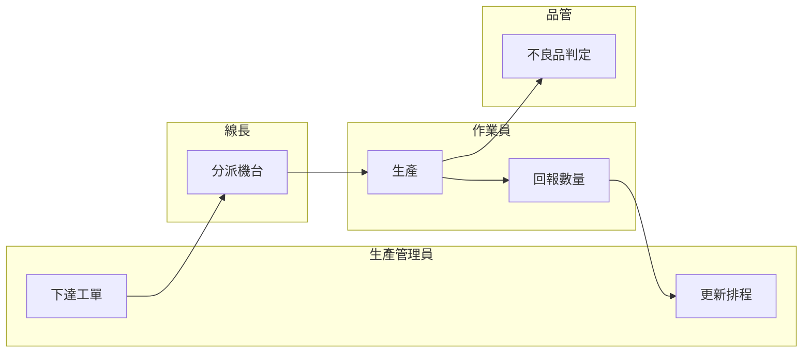
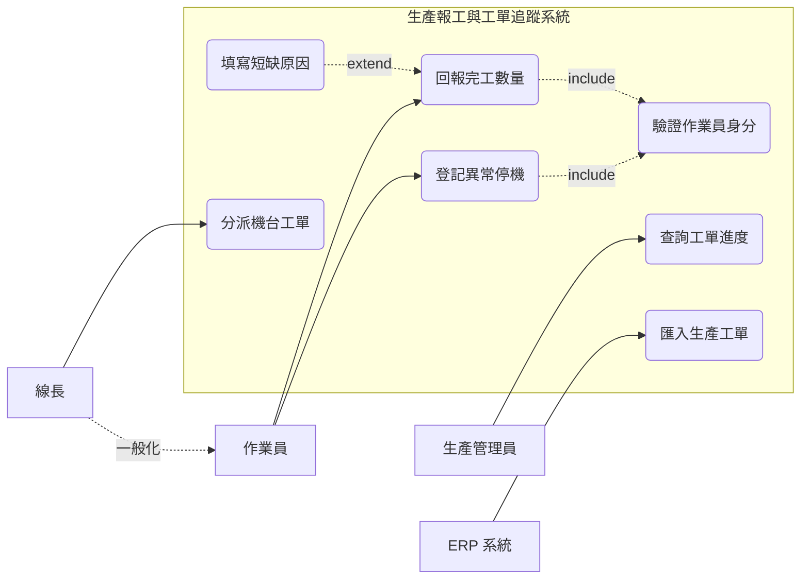
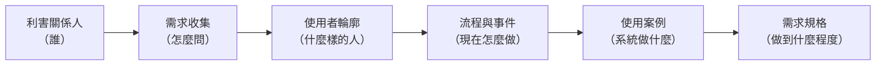

# 使用者分析

多數失敗的資訊系統，並不是程式寫壞了，而是一開始就搞錯了「誰要用、用來做什麼」。一套排程系統若只問過生產主管、沒問過現場線長，很可能做出一個報表漂亮但沒人願意輸入資料的系統；一套報工系統若假設作業員戴著手套也能順利點選小按鈕，上線第一天就會被退回。你在分析階段的第一項工作，因此不是畫系統架構，而是把「人」與「事」看清楚。

本章處理分析階段的第一個區塊——使用者分析。內容依你實際執行的順序展開：先找出誰會受這套系統影響（利害關係人分析），決定用什麼方法向他們蒐集資訊（需求收集方法），再刻畫出這些人的輪廓（使用者分析）。接著看他們現在是怎麼把工作做完的（流程分析），最後把「誰需要系統幫他做什麼」用一張圖固定下來（使用案例圖）。順序不能顛倒，因為後一項的正確性完全建立在前一項之上。

本章從頭到尾使用同一個情境：一家生產金屬沖壓件的中型工廠，現場仍以紙本工單記錄生產進度，管理者要到隔天才知道昨天各機台實際完成多少。工廠決定導入一套「生產報工與工單追蹤系統」，讓作業員在現場直接回報進度。以下各節都以這個案子為例。

> **延伸閱讀**：本章談的是這些分析要怎麼做，各組實際要繳交哪些文件、格式與最低標準，見[「系統分析階段繳交規範」](../example-system/Analysis-Phase-Deliverables.md)。

> **必讀標記**：標題後加註 🔴 期中必讀 的小節，是期中小組報告九項產出直接會用到的內容；加註 🔵 期末必讀 的，是期末八項產出直接會用到的。判準與成品的樣子，期中見[「系統分析階段繳交規範」](../example-system/Analysis-Phase-Deliverables.md)與[「系統分析範例報告」](../example-system/Analysis-Phase-Sample-Report.md)，期末見[「系統設計階段繳交規範」](../example-system/Design-Phase-Deliverables.md)與[「系統設計範例報告」](../example-system/Design-Phase-Sample-Report.md)。未標記的小節仍屬課程範圍，只是報告不會直接產出。

## 一、為什麼分析要從人開始

### 1.1 沒有一套資訊系統與人無關

資訊系統是給人用的。這句話聽起來像廢話，卻是整個分析階段的出發點。

有人會反問：全自動的系統呢？無人搬運車自己決定路線、視覺檢測設備自己判定良品與不良品、批次程式在半夜自己跑完月結——過程中確實沒有人動手。但把時間軸拉開來看，是人決定要自動化哪一段、自動到什麼程度、判定標準怎麼設、出狀況時誰接手、結果報給誰看。**自動化取消的是人的操作動作，取消不了人的目的。** 檢測設備替代的是原本站在產線上目視挑件的作業員，它服務的仍是「不要把不良品出給客戶」這件事，而這是人訂下的目標。

再往上一層看，資訊系統本身不創造價值。它把資料從一個地方搬到另一個地方、算出一個數字、擋掉一個錯誤動作——這些事之所以有意義，是因為某個人接下來要據此做決定或採取行動。沒有人接手，系統的輸出就只是硬碟裡的一堆位元。

所以判斷一套系統該不該存在、能不能存在下去，判準不在技術做不做得到，而在 **它是否符合人的需要與期望**。做得出來卻沒有人需要的系統，上線後會被繞過去；做得到但與使用者期望不合的系統，會被抱怨、被消極抵制。兩者最後都是同一個結局——停用，或是變成一套「大家都在用另一套 Excel 私下作業」的空殼。系統的價值由使用它的人給定，不是由它的功能數量給定。

這就是分析階段必須從人開始的根本原因：**你要判斷一套系統該做成什麼樣子，只能回到那些需要它的人身上去問。**

### 1.2 從人開始的三個理由

[系統分析](https://zh.wikipedia.org/wiki/系統分析)的目的，是把一個含糊的期待——「我們想要一套能即時看到生產進度的系統」——轉換成開發人員做得出來、使用者也真的願意用的具體描述。這個轉換的第一道關卡是 **需求來源**：需求不會自己浮現，它附著在人身上，附著在這些人每天實際執行的作業裡。

從人開始有三個理由。第一，**需求的正確性取決於問對人**。工廠裡的生產進度，廠長關心的是達交率，線長關心的是今天的人力夠不夠，作業員關心的是回報動作會不會打斷手上的工作。你只問廠長，就只會得到報表需求，做出來的系統在現場一定卡住。

第二，**同一件事在不同人眼中是不同的問題**。「進度不準」對生產管理員而言是資料太晚進系統，對品管人員而言是不良品沒有即時標記，對業務而言是無法回答客戶的交期詢問。三種說法指向三組不同的功能，而它們未必都在這次專案的範圍內。你在分析階段要做的正是把它們攤開來，再決定做哪些。

第三，**願不願意用，決定系統的成敗**。資訊系統的效益來自持續被使用，而使用者是否配合，取決於新做法相對於舊做法是不是真的比較省事。這個判斷你只能從理解使用者的實際工作情境得到，無法從技術規格推導。

也因為需求來自人，需求收集過程中的典型困難幾乎都是溝通問題而非技術問題：不同使用者對同一功能的要求互相衝突、客戶認為開發者理應已具備該行業的知識而略去不談、使用者說不清楚自己要什麼、訪談雙方對同一個詞的理解不同。本章介紹的各項工具，本質上都是在降低這幾類誤差。

## 二、利害關係人分析 🔴 期中必讀

**[利害關係人](https://zh.wikipedia.org/wiki/利害關係人)（Stakeholder）是指任何直接或間接受到系統成敗影響、或能影響系統成敗的個人或團體。** 注意這個定義比「使用者」寬：不會碰鍵盤的人也可能是關鍵利害關係人。以報工系統為例，資訊室負責日後維護、卻不會天天使用系統。你在分析階段沒問過他們，系統很可能選用工廠內部無法維運的技術。

### 2.1 找出利害關係人 🔴 期中必讀

實務上依下列順序展開，越後面找到的人越容易被漏掉：

| 步驟 | 做法 | 在報工系統案例中找到的對象 |
|---|---|---|
| 分析專案文件 | 從組織圖、作業流程書、專案立案文件中找出相關單位與職務；若無文件可參考則直接進入下一步 | 生產部、品管部、資訊室、廠長室 |
| 腦力激盪 | 召集專案團隊，針對文件未涵蓋的受影響範圍進行討論 | 夜班線長、外包代工廠、設備維修人員 |
| 客戶分析 | 訪談客戶或目標對象，每訪談一位就追問「這件事還牽涉到誰」 | 負責月結的會計、要看報表的業務 |
| 製作表單 | 列出前三步得到的利害關係人清單，逐一說明其受專案影響的方式 | —— |

最後一欄「受影響的方式」你不可省略。只寫「品管部」沒有分析價值，寫成「品管部——需要在報工資料上標記不良品數量，否則無法計算當日良率」才構成後續需求的線索。

期中報告分析的是一套已經存在的系統，沒有立案文件也沒有人可以訪談，上表的四個步驟要換成另一種問法：把作業流程從頭走一遍，逐一問 **誰輸入資料、誰查看資料、誰維護系統、誰為結果負責**。四個問題各自對應一群人，答得出來就找得齊。

找齊之後要分成兩張表，不要混在同一張裡：

| 表 | 收哪些人 | 該有的欄位 |
|---|---|---|
| 使用者 | 會直接操作畫面的人 | 角色、使用目標、主要需求、權限範圍、最在意什麼 |
| 利害關係人 | 不碰畫面、但會影響系統或被系統影響的人 | 利害關係人、是否操作系統、受影響的方式 |

利害關係人那張表的「是否操作系統」欄看起來多餘，作用是逼你正視答「否」的那幾列。**不碰系統卻被系統影響的角色最容易被漏掉，而漏掉他就等於漏掉他那一整組功能。** 報工系統的設備維修人員是典型例子：他不回報產量、不看排程，但作業員登記的異常停機原因會決定他被派工的先後；系統若不給他一個查閱的管道，那些異常紀錄就只是躺在資料庫裡，「異常通知與派工」這一整組功能也就無聲無息地缺席了。

### 2.2 利害關係人的分類

找齊之後要分類，因為不同類別的人需要投入的溝通程度不同。最基本的分類是依 **所在位置** 與 **職能** 交叉切分：

| | 操作類型 | 管理類型 | 技術類型 |
|---|---|---|---|
| **內部（internal）** | 作業員、線長 | 生產部主管、廠長 | 資訊室 |
| **外部（external）** | 外包代工廠的現場人員 | 客戶的採購窗口 | 系統廠商、ERP 維護商 |

另一種分類方式是依「能影響專案」與「被專案影響」區分為直接與間接利害關係人。實務上更常用的是把 **影響力** 與 **受影響程度** 當成兩個維度，交叉後得到四種處置方式：

| | 受影響程度低 | 受影響程度高 |
|---|---|---|
| **影響力高** | 維持滿意：定期告知進度即可，例如廠長 | 密切管理：全程參與需求確認，例如生產部主管 |
| **影響力低** | 最低限度關注：例如外包代工廠 | 充分告知：需求要問、決策不必參與，例如現場作業員 |

要特別注意左下與右下的差別。現場作業員影響力低但受影響極大——系統上線後每天要多做十幾次回報動作的正是他們。這一格的人最常被跳過，也是系統上線後抗拒最強的來源。

### 2.3 用 RACI 釐清權責

需求確認階段常見的僵局是「大家都有意見，但沒有人能拍板」。[RACI 責任分配矩陣](https://zh.wikipedia.org/wiki/責任分配矩陣) 用來把這件事講明白：

| 代號 | 角色 | 含義 |
|---|---|---|
| R | 責任者（Responsible） | 實際執行工作的人 |
| A | 當責者（Accountable） | 最終負責正確完成可交付成果、並負責簽核的人，每項工作只能有一位 |
| C | 事先諮詢者（Consulted） | 事前徵詢意見的對象，通常是領域專家，雙向溝通 |
| I | 事後告知者（Informed） | 需要隨時了解進展的人，單向告知 |

以「確認報工畫面的欄位」這項工作為例：生產管理員是 R（提出欄位需求），生產部主管是 A（簽核定案），現場線長與品管人員是 C（提供現場與品質面的意見），廠長與資訊室是 I。矩陣裡「A 只能有一位」這條限制最有價值——它強迫你在動工前就找出那個能做決定的人。

## 三、需求收集方法

找出利害關係人之後，你要決定用什麼方法向他們取得資訊。方法的選擇取決於對象是誰：

| 來源 | 主要調查對象 | 主要方法 |
|---|---|---|
| 內部 | 利害關係人 | 質化（qualitative）方法為主，以訪談為核心 |
| 外部 | 終端使用者 | 量化（quantitative）方法為主，以問卷調查為核心 |

這個分工的道理在於人數與目的不同。內部利害關係人數量有限但每個人的資訊量大，需要深入挖掘；外部使用者人數眾多但每個人的資訊量小，需要的是分布與比例。

**質化方法** 用於理解「為什麼」，適合需求還不明確的階段：

| 方法 | 適用時機 | 在報工系統中的應用 |
|---|---|---|
| 訪談 | 需要深入理解個別對象的想法 | 逐一訪談線長，問出各班次的作業差異 |
| 觀察 | 對象說不清楚、或說的與做的不一致時 | 站在沖床旁看作業員實際怎麼填工單 |
| 文件分析 | 需要掌握既有規則與資料格式 | 蒐集現行工單、日報表、ERP 的工單欄位 |
| 焦點團體討論 | 需要讓不同角色當場對焦衝突 | 找生產、品管、資訊三方共同確認流程 |
| 個案研究 | 需要參考同業做法 | 研究同業導入報工系統的成效與踩過的坑 |

其中 **觀察** 在工廠場域的價值特別高。訪談時作業員會說「我們每完成一批就登記」，你實際到現場看，會發現多數人是累積到休息時間才一次補登——這個落差正是系統設計必須面對的真實條件。

**量化方法** 用於確認「有多少、多嚴重」，適合需求方向已定、要驗證普遍性的階段，包括調查（問卷）、相關分析與實驗。例如發問卷給全廠 120 位作業員，統計「每天因找工單而中斷作業」的平均次數，得到的數字既能支持專案立案，也能作為上線後的效益比較基準。

實務上兩類方法搭配使用：先以質化方法發現問題與假設，再以量化方法驗證其普遍程度。

## 四、使用者分析 🔴 期中必讀 🔵 期末必讀

利害關係人回答的是「誰被影響」，使用者分析進一步回答「這些人是什麼樣的人、在什麼情境下操作系統」。同樣是使用者，特性差距可能極大：辦公室裡的生產管理員坐在雙螢幕前操作，現場作業員站在沖床旁、戴著手套、環境吵雜、每次操作只能花幾秒鐘。你忽略這個差距，設計出來的介面就會只適合前者。

### 4.1 使用者分群 🔴 期中必讀 🔵 期末必讀

分群的依據不是職稱，而是 **與系統互動的方式**。判斷方法很直接：兩群人使用的功能不同、操作頻率不同、或所處環境不同，你就該把他們分成兩群。報工系統的分群結果如下：

| 使用者群 | 使用頻率 | 操作情境 | 主要關切 |
|---|---|---|---|
| 現場作業員 | 每人每班 10–20 次 | 站立、戴手套、機台旁、光線與噪音不佳 | 動作要快，不能中斷生產 |
| 線長 | 每班數次 | 現場辦公桌，需同時看多台機況 | 一眼看出哪台落後 |
| 生產管理員 | 每日持續 | 辦公室電腦 | 資料完整、可調整排程 |
| 品管人員 | 不定時 | 現場與辦公室交替 | 不良品能追溯到工單與機台 |
| 廠長 | 每週數次 | 辦公室或手機 | 彙總指標，不需明細 |

這張表直接決定了後續的設計約束。作業員那一列的「戴手套、幾秒鐘」會轉成介面需求（大按鈕、掃描條碼取代打字），廠長那一列的「手機」會轉成技術需求（報表需支援行動裝置瀏覽）。

上表的欄位是為了推導介面與非功能需求。期中報告的角色表另外要求兩欄，**主要需求** 與 **權限範圍**，回答的是「這個角色需要系統提供什麼、可以做到哪裡為止」：

| 角色 | 使用目標 | 主要需求 | 權限範圍 | 最在意 |
|---|---|---|---|---|
| 作業員 | 把當班的量做完並回報 | 掃描工單、回報完工數量、登記異常停機 | 只能回報自己所屬機台的工單；不能修改已結算的紀錄 | 動作要快，不能中斷生產 |
| 線長 | 掌握整條線的進度 | 分派機台工單、查看當班進度、代為更正回報 | 作業員的全部權限，再加上分派與更正；不能更改工單的需求量 | 一眼看出哪台落後 |
| 生產管理員 | 維持排程與交期 | 匯入工單、調整排程、查詢與匯出報表 | 可維護工單資料；不能代替作業員回報數量 | 資料完整、可追溯 |

**「權限範圍」這一欄要正反兩面都寫**：可以做什麼寫一半，不能做什麼寫另一半。分號後面那半句才是真正有價值的部分。它是非功能需求的來源，「不能修改已結算的紀錄」會變成一條資料完整性的規則；它也是後續找出系統問題的入口，權限規則與流程的後置條件對不上的地方，通常就是一個沒被發現的漏洞。

### 4.2 目標受眾與 STP

當系統是對外提供服務時（例如給客戶查詢訂單進度的入口網站），使用者分析要再往外延伸一層，處理 **[目標受眾](https://zh.wikipedia.org/wiki/目標市場)（Target Audience, TA）** ——最主要使用該項服務的族群。可能的類型包括現有客戶、新客戶、訪客、影響者與外部利害關係人。

分析目標受眾常借用行銷領域的 **STP** 三步驟：

| 步驟 | 含義 | 在客戶查詢入口的應用 |
|---|---|---|
| Segmentation（市場區隔） | 把廣泛的對象切分成需求與特徵相近的區段 | 依下單量分為長期大量客戶、零星小量客戶 |
| Targeting（目標市場選擇） | 從各區段中選出最值得投入的一或多個 | 優先服務貢獻八成營收的長期客戶 |
| Positioning（產品定位） | 確立本服務相對於其他選擇的獨特價值 | 主打即時進度查詢，而非低價 |

對內部系統而言，STP 的意義在於提醒團隊 **資源有限，不可能同時服務所有人**。報工系統若試圖同時滿足全廠五類使用者的所有期待，結果通常是每一類都做得半吊子。你先確定核心是作業員，其餘功能依序退讓，才做得出真正被使用的系統。

### 4.3 人物誌

**[人物誌](https://zh.wikipedia.org/wiki/人物誌_(使用者體驗))（Persona）是把某一群使用者的共同特徵，濃縮成一個具體、有名字的虛構人物。** 它的作用不是增加文件厚度，而是讓你們在爭論設計時有共同的判準：與其爭論「使用者應該看得懂吧」，不如問「陳師傅看得懂嗎」。製作方法是運用同理心（empathy）理解該族群，再把他們描繪成數個具代表性、易於辨別的人物原型，目的在增加團隊對目標客群的真實感、喚起共鳴並聚焦其特質。

一份人物誌通常包含姓名與照片、人口資料、簡介、目標與困難、使用偏好、獲得消息的管道。以報工系統的核心使用者為例：

> **陳志明，48 歲，沖壓課資深作業員，年資 22 年**
>
> 高職畢業，操作三台沖床，對機台狀況瞭若指掌。平常用智慧型手機看影片與通訊軟體，但不太打字，公司電腦只在年度考核時碰過。
>
> **目標**：把當班的量做完、不出不良品、準時下班。
>
> **困難**：紙本工單常被油汙弄髒或掉在地上，換模時要跑到辦公室拿新工單；他不反對用系統，但擔心「按錯了會不會被記過」。
>
> **使用偏好**：習慣掃條碼、按實體按鈕；抗拒需要輸入文字的介面。
>
> **獲得消息的管道**：班前朝會、休息室公布欄、同事口耳相傳。

這份描述裡最有價值的是「擔心按錯會被記過」。它不是介面問題，而是會直接影響資料品質的組織問題。你的系統若不提供簡單的修正機制，作業員的因應方式會是先不回報、等確定沒問題再一次補登，而這正好摧毀了系統即時性的初衷。這類洞察只有透過理解具體的人才會浮現。

製作人物誌時，除了人口資料等靜態特徵，還要補上四項與使用行為直接相關的內容：使用情境（環境與影響行為的因素）、目標與目的（使用本系統的主要原因）、行為和行動模式（可據以預測其反應）、痛點和需求（解決方案的著力點）。

人物誌一般為每個主要使用者群各做一份，總數控制在三到五份。做太多會失去聚焦效果，而其中應指定一份為 **主要人物誌** ——當不同人物誌的需求衝突時，以它為優先。報工系統的主要人物誌就是陳師傅，因為他不用，系統就沒有資料。

## 五、流程分析 🔴 期中必讀 🔵 期末必讀

知道了誰在用，接著要看他們現在是怎麼把事情做完的。**流程分析是把工作拆解成一連串有順序的活動，標示出每個活動由誰執行、需要什麼輸入、產出什麼結果。** 這一步的產物是後續使用案例的直接來源。

### 5.1 現況流程與目標流程 🔴 期中必讀 🔵 期末必讀

流程分析一定要區分兩種流程：

- **現況流程（AS-IS）**：目前實際運作的方式，包含所有臨時補丁與私下變通。
- **目標流程（TO-BE）**：導入系統後預期的運作方式。

先畫現況、再設計目標，順序不能省略。原因是現況流程裡那些看似不合理的動作，往往藏著沒被說出口的限制。報工系統的現況流程中，作業員每完成一批就在紙本工單上畫記，下班前交給線長彙整，隔天早上由生產管理員謄打進 Excel。看起來多此一舉，但訪談後發現線長在彙整時會順手修正明顯的登錄錯誤。你在 TO-BE 流程中直接刪掉這道人工檢核，系統得到的資料品質反而會比紙本時代更差。

現況流程也是效益評估的基準。「導入後可省下每天一小時的謄打時間」這種說法，只有在現況流程被記錄下來之後才成立。

期中報告的分析對象是一套已經在運作的系統，這時的「現況流程」指的是 **系統目前實際的行為**，不是系統以外的紙本作業。你要走的是畫面上跑得出來的那條路，包含它在每一個關卡擋下你的方式；TO-BE 是期末重新設計時的工作，期中不做。

### 5.2 流程的四個要素 🔴 期中必讀

描述任何一道流程，至少要交代四件事：

| 要素 | 說明 | 報工流程中的例子 |
|---|---|---|
| 活動 | 一個有明確起訖的動作 | 領取工單、回報完工數量、標記不良品 |
| 角色 | 執行該活動的人或單位 | 作業員、線長、生產管理員 |
| 觸發與流向 | 什麼事件啟動流程，活動之間的先後與分支 | 工單下達後啟動；若有不良品則轉品管判定 |
| 資訊 | 每個活動需要的輸入與產生的輸出 | 輸入工單號與機台號，輸出完工數量與時間 |

其中最容易漏掉的是 **分支**。多數人描述流程時只講一路順暢的走法，但真正會讓系統上線後出問題的，往往是例外分支：換模中途暫停怎麼辦？同一張工單跨班次未完成怎麼辦？作業員回報錯數量怎麼修正？這些你在流程分析階段就要問出來。

期中報告的流程分析，除了上述四要素，還規定了一組固定的文字欄位。**先把每條流程寫成這個格式，再畫成圖**，順序顛倒過來的話，圖上一定會缺東西：

```text
流程名稱：
主要角色：
觸發事件：
前置條件：
主要步驟：
例外情況：
完成後狀態：
```

四要素裡沒有、這裡卻多出來的是 **前置條件** 與 **完成後狀態**：流程開始前系統必須處於什麼狀態，跑完之後又變成什麼狀態。它們是後續交叉比對時最好用的兩欄。舉例來說，某條流程的完成後狀態寫著「該作業員其後無法登入」，你就可以逐一去試那些需要登入的功能是不是真的都被擋住了；試到一個沒被擋住的，那就是一項分析發現。

數量上至少要兩條流程：**主要角色一條、次要角色一條**。只寫主要角色那一條，等於只證明了系統的正常路徑跑得動。

### 5.3 用泳道圖表達跨角色流程 🔴 期中必讀 🔵 期末必讀

當流程牽涉多個角色時，適合用 **[泳道圖](https://zh.wikipedia.org/wiki/泳道圖)（Swimlane Diagram）** ——把圖面橫向切成數條「泳道」，每條代表一個角色，活動畫在執行者的泳道內，跨泳道的箭頭就代表工作的移交。



泳道圖的分析價值在於 **箭頭跨越泳道的次數**。每一次跨越都代表一次交接，而交接正是延遲、遺漏與資訊失真最容易發生的地方。上圖中「回報數量」到「更新排程」跨了兩條泳道、中間隔了一個工作天，這正是整個專案要解決的核心問題。

上圖畫的是還沒有系統的年代，泳道全是人與單位。期中報告分析的是既有系統，這時 **「系統」自己就是一條泳道**：使用者送出動作之後，接手做檢核、寫入與回應的是系統，那些動作要畫在系統那一條裡，不能混進使用者的泳道。跨進系統泳道的箭頭代表責任從人移交給系統，跨出來的箭頭則代表系統把結果交還給人。畫法與範例見[「行為建模」](Behavioral-Modeling.md)〈二、活動圖〉。

### 5.4 從事件到事件表

流程畫出來之後，需要一個機制把它轉成系統要處理的項目，這個機制是 **事件**。**事件是在特定時間或地點發生、可以描述且值得注意的特定事情。** 你只要列得出「什麼事發生時系統需要做出回應」，就等於掌握了系統要做哪些事。

事件分三類：

| 類型 | 說明 | 報工系統中的例子 |
|---|---|---|
| 外部事件（External event） | 發生在系統外部、由參與者啟動 | 作業員完成一批產品要回報數量 |
| 暫時事件（Temporal event） | 到了特定時間，系統自動處理，不需外部觸發 | 每日 24 時自動結算當日產量 |
| 狀態事件（State event） | 系統內部達到某種狀態而必須處理，與時間無關 | 某工單累計不良率超過 5% 時發出警示 |

尋找事件有三種角度可以交叉使用：依類型逐類尋找、依利害關係人的目標逐項對應、依參與者需要的服務逐項展開。

找到事件後要判斷合併與拆分。**若數個動作總是同時或固定接續發生，視為單一事件** ——「商品出貨作業」可涵蓋取貨、包裝、扣庫存、建立物流單，不必拆成四個。**若動作發生時間各自獨立但性質相近，可合併為一個事件** ——工單基本資料的新增、刪除、修改都屬資料異動，合併為「維護工單資料」即可。

把事件與其對應的使用案例編列成表格，就是 **事件表（event table）**：

| 事件 | 類型 | 觸發者 | 系統回應 | 對應使用案例 |
|---|---|---|---|---|
| 作業員完成一批產品 | 外部 | 作業員 | 記錄完工數量與時間，更新工單進度 | 回報完工數量 |
| 機台異常停機 | 外部 | 作業員 | 記錄停機原因與起訖時間 | 登記異常停機 |
| 每日 24 時 | 暫時 | 系統 | 結算當日各機台產量並產生日報 | 結算當日產量 |
| 不良率超過門檻 | 狀態 | 系統 | 通知品管人員 | 發送品質異常通知 |

事件表的目的是找出系統作業的各個使用案例。通常一個事件對應一個使用案例，但相關或接續的多個事件也可以合併到同一個使用案例中。完成後你要用下列問題檢核：哪些事件重複、可合併或該拆開？事件是否涵蓋所有利害關係人的目標？所有使用案例合起來是否涵蓋整體系統功能？有沒有功能被遺漏？

事件名稱建議寫成「觸發狀態（動詞）＋處理的作業（名詞）」，使用案例名稱則建議寫成「事情（名詞）＋處理方式（動詞）」，以最清楚明白為原則。

## 六、使用案例圖 🔴 期中必讀

**[使用案例圖](https://zh.wikipedia.org/wiki/用例圖)（Use Case Diagram）是 [統一塑模語言](https://zh.wikipedia.org/wiki/统一建模语言)（Unified Modeling Language, UML）中用來描述「誰能用這個系統做什麼」的圖。** 它刻意不描述系統內部怎麼運作，只呈現外部使用者與系統之間的互動，因此是分析階段最適合拿去和不懂技術的使用者確認需求的一張圖。

這是期中報告要求的三張圖裡的第一張，回答「誰要做什麼」。另外兩張依序回答「事情怎麼做」（活動圖）與「使用者與系統怎麼互動」（系統循序圖），都以本節的產出為起點——使用案例圖上的每一個橢圓，都是後續兩張圖的題材來源。期末報告另外要求一張概念類別圖，回答「系統管理哪些概念與規則」，見[「物件建模」](Object-Modeling.md)。

### 6.1 四個構成元素 🔴 期中必讀

| 元素 | 圖示 | 含義 |
|---|---|---|
| 參與者（Actor） | 人形符號 | 與系統互動的角色，可以是人，也可以是其他系統或設備 |
| 使用案例（Use Case） | 橢圓 | 系統提供的一項完整功能，執行完後參與者應得到一個有意義的結果 |
| 系統邊界（System Boundary） | 方框 | 框內是本系統負責的範圍，框外是環境 |
| 關係 | 連線 | 參與者與使用案例的關聯，或使用案例之間的關係 |

**參與者是角色而非個人。** 同一位陳師傅，在回報生產進度時是「作業員」，代班時處理分派工作則是「線長」——這是兩個參與者。反過來，若三個不同職稱的人對系統做的事完全相同，他們就是同一個參與者。這個判準能大幅簡化圖面。

參與者也包含非人的對象。報工系統要從既有的 [企業資源規劃](https://zh.wikipedia.org/wiki/企业资源计划)（Enterprise Resource Planning, ERP）系統取得工單資料，ERP 就是一個參與者；若機台裝有計數器可自動送出產出數，計數器同樣是參與者。

找出參與者可從下列問題著手：誰使用系統的主要功能（主要角色）？誰需要靠系統完成日常作業？誰負責維護與管理系統以確保正常運作（次要角色）？系統要與哪些硬體設備或其他系統互通？哪些人或單位對系統產生的結果有興趣或受其影響？

### 6.2 使用案例的命名與粒度 🔴 期中必讀

使用案例的名稱一律寫成 **動詞加受詞**，且必須是從參與者角度看得懂的一件完整的事：

| ✅ 適當 | ❌ 不適當 | 為什麼 |
|---|---|---|
| 回報完工數量 | 資料輸入 | 太籠統，看不出做什麼 |
| 查詢工單進度 | 按下查詢鈕 | 這是操作步驟，不是完整目的 |
| 登記異常停機 | 停機管理 | 名詞化，看不出參與者做了什麼 |
| 核發生產工單 | 資料庫寫入 | 這是系統內部實作，不是使用者的目的 |

名稱之外還要決定 **粒度（granularity）**。粒度指的是一個項目切得多粗或多細——同一件事可以描述成一個大項目，也可以拆成十個小項目，粒度講的就是你選在哪一個層次描述它。粒度切得太粗，一個使用案例包山包海，看不出系統實際提供什麼；切得太細，圖上會出現一堆操作步驟。

順帶一提，「粒度」原本是材料與地質領域描述顆粒大小的名詞（如粒度分布），中文資訊領域拿它來翻譯 granularity，是循日語技術文件的用法而來——日文以「粒度（りゅうど）」形容一件事被切分得多細，這個講法後來進入中文的軟體工程用語。理解字面意思會比較好記：把一塊石頭磨成粗砂或細粉，材料沒變，變的是顆粒的大小，而在分析文件裡變的是描述的層次。

粒度的判準是 **完成之後，參與者能不能就此離開系統去做別的事**。「登入系統」單獨存在時不符合這個判準——沒有人登入只為了登入。而「回報完工數量」符合：回報完，作業員就回去顧機台了。

這條判準有兩個例外，分析既有系統時一定會遇到。**被 «include» 進來的使用案例不受此判準約束**：「驗證作業員身分」沒有人會為它本身而來，但它是每次回報都必經的一步，抽出來畫才看得出回報這件事實際做了幾件事。**作為權限前提的使用案例也不受約束**：一套區分角色的系統裡，「登入系統」是其他所有使用案例的入口，圖上不畫它，未登入者與登入者的界線就無處可標。判準要擋掉的是「按下確認鈕」這種操作步驟，不是這兩類。

從角色出發找使用案例時，可以逐一自問：這個角色需要從系統獲得什麼功能？他需要讀取、產生、刪除、修改或儲存哪些資訊？系統中發生的事件需要通知他嗎？他需要通知系統某件事嗎？

### 6.3 三種關係 🔴 期中必讀

使用案例之間有三種標準關係，實務上前兩種最常用：

| 關係 | 標記 | 用途 | 例子 |
|---|---|---|---|
| 包含 | «include» | 多個使用案例共用的必要步驟，抽出來避免重複描述 | 「回報完工數量」與「登記異常停機」都包含「驗證作業員身分」 |
| 延伸 | «extend» | 只在特定條件下才發生的選擇性行為 | 「回報完工數量」在數量不足時延伸出「填寫短缺原因」 |
| 一般化 | 空心三角箭頭 | 一般與特殊的關係，可用於參與者或使用案例 | 「線長」是「作業員」的特殊化，具備作業員的全部能力再加上分派工作 |

兩者的差別在於 **必要性與方向**：«include» 的目標一定會被執行，箭頭從主案例指向被包含的案例；«extend» 的目標不一定會被執行，箭頭反過來從延伸案例指向被延伸的主案例。你拿不準時，優先使用 «include»；過度使用 «extend» 會讓圖面變得難懂。

一般化在期中最常用到，也最常畫錯，三件事要記住：

- **子角色不重畫父角色的連線。** 線長既然一般化自作業員，圖上就不要再把線長連到作業員的每一個使用案例，只連他自己多出來的那幾個。初學者最常見的錯誤是兩邊都連，圖面立刻多出十幾條線，而且看不出線長究竟多了什麼能力。
- **一般化可以串成多層。** 例如「訪客 ← 一般會員 ← 管理員」，管理員一般化自一般會員、一般會員又一般化自訪客，能力逐層累加。畫成一條鏈，比讓每個角色各連一次清楚得多。
- **不畫一般化也不算錯**，代價是重複的連線要老實畫出來。角色只有兩三個、共用的功能又不多時，直接畫反而好讀。

### 6.4 報工系統的使用案例圖 🔴 期中必讀



圖中「線長」指向「作業員」的虛線表示一般化：線長可以做作業員能做的所有事，另外還能分派機台工單。ERP 系統以參與者身分出現在邊界之外，代表工單資料來自外部、不是本系統產生。上圖以流程圖語法繪製示意，正式的 UML 使用案例圖中，使用案例畫成橢圓、參與者畫成人形符號，«include» 與 «extend» 則以帶標記的虛線箭頭表示。

### 6.5 使用案例敘述 🔴 期中必讀

圖負責呈現全貌與範圍，細節則由 **使用案例敘述** 承載——把圖上一個橢圓展開成文字。UML 並未規定敘述的格式，但歸納各家做法，完整版本應包含下列項目：

| 項目 | 說明 |
|---|---|
| 編號與名稱 | 便於後續追溯 |
| 簡要描述 | 一兩句話說明這個使用案例做什麼 |
| 主要參與者、次要參與者 | 誰發起、誰協同 |
| 利害關係人與目標 | 各方期待從中得到什麼 |
| 前置條件 | 執行前系統必須處於什麼狀態 |
| 觸發 | 啟動這個使用案例的事件 |
| 主要流程 | 一切順利時的步驟順序 |
| 例外與替代流程 | 失敗、異常或其他走法 |
| 後置條件 | 執行完成後系統的狀態或達成的效益 |
| 對應需求 | 這個使用案例涵蓋哪幾條功能需求與非功能需求 |

敘述的詳略分為簡略（brief）、中等（medium）、詳細（detail）三種形式。專案初期以簡略或中等方式描述即可，需求收集告一段落後再展開為詳細版本。撰寫時要把系統當作黑箱，只描述參與者做什麼、系統回應什麼，不涉及內部如何實作，也不描述按鈕與畫面配置。

以「回報完工數量」為例，主要流程是：作業員掃描工單條碼 → 系統顯示該工單的品名與需求量 → 作業員輸入完工數量 → 系統檢核數量未超過剩餘需求量 → 系統記錄並更新進度。例外流程則包含：條碼無法辨識、輸入數量超過需求量、網路中斷無法即時上傳。這些細節你不寫下來，開發人員只能自行猜測，而猜錯的代價要到驗收時才會顯現。

期中報告對「主要流程」與「例外流程」兩欄另有寫法規定，因為後面兩張圖都要靠它們對照。

**主要流程要編號，而且每一步都寫明主詞是參與者還是系統**，兩者交替出現：

> **主要流程**：1. 作業員掃描工單條碼　2. 系統顯示品名與需求量　3. 作業員輸入完工數量　4. 系統檢核數量未超過剩餘需求量　5. 系統記錄並更新進度

主詞交替不只是排版習慣，它決定了系統循序圖上箭頭的方向：主詞是參與者的那幾步，箭頭從參與者指向系統；主詞是系統的那幾步，箭頭反過來。

**例外流程要掛在主要流程的步驟編號上**，寫成「數字加小寫字母」的形式。數字是它發生在主要流程的第幾步，字母是同一步的第幾個例外：

> **例外流程**：1a 條碼無法辨識　3a 數量欄位空白　4a 輸入數量超過剩餘需求量　5a 網路中斷無法即時上傳

這組編號直接決定了活動圖上要有幾個判斷節點：第 4 步若有 `4a` 與 `4b` 兩個例外，圖上該處就要分出兩個判斷。交件前把敘述的例外編號與活動圖的菱形數目對一次，少一個就是有一種情況沒被處理。

### 6.6 常見的畫法錯誤 🔴 期中必讀

| 錯誤 | 症狀 | 修正方向 |
|---|---|---|
| 把流程圖畫成使用案例圖 | 橢圓之間用箭頭串成先後順序 | 使用案例圖不表達時間順序，順序寫在使用案例敘述的流程裡 |
| 粒度過細 | 出現「輸入工單號」「按下確認」等橢圓 | 合併成一個對參與者有意義的完整目的 |
| 把系統內部功能畫進去 | 出現「寫入資料庫」「產生流水號」 | 刪除，這些屬於設計階段 |
| 參與者用人名或部門名 | 出現「陳師傅」「生產部」 | 改成角色名稱 |
| 邊界不明 | 沒畫方框，分不清哪些是本系統的責任 | 補上系統邊界，這是釐清專案範圍的關鍵 |

使用案例圖在專案中最實際的用途，往往不是描述功能，而是 **界定範圍**：方框之內是這次要做的，方框之外不做。客戶事後要求增加功能時，這張圖就是你討論範圍變更的依據。

> **延伸閱讀**：系統邊界怎麼判定、界外的對象有哪幾類、範圍外清單怎麼寫，見[「功能分析」](Functional-Analysis.md)〈二、系統邊界〉。

## 七、各項分析如何串接 🔴 期中必讀

本章的各項工具並非互不相干的文件，而是一條有明確傳遞關係的鏈：



- 利害關係人清單 **決定要訪談誰**，漏掉一類人，就漏掉一整批流程。
- 需求收集方法 **決定資訊的品質**，只靠訪談會得到「應該怎麼做」，加上觀察才會得到「實際怎麼做」。
- 使用者分群與人物誌 **決定參與者的劃分**，並提供後續介面設計與非功能需求的依據。
- 流程中的活動經由事件表 **轉成使用案例的候選**：凡是需要系統協助才能完成的活動，就是一個使用案例；純人工的活動（例如實際操作沖床）則留在系統邊界之外。
- 使用案例圖界定的範圍，接著逐一展開成可驗證的需求條目。

你反過來檢查也同樣有效：使用案例圖上每個參與者，都應該能在利害關係人清單中找到對應；清單上每位主要使用者，也都應該至少對應一個使用案例。對不上的地方，不是圖畫錯了，就是有人被漏掉了。

串接得起來的前提是編號一致。期中報告的各項產出各有一組編號，跨文件互相引用時只認編號、不認名稱：

| 編號 | 代表什麼 | 出現在哪一項 |
|---|---|---|
| UC-xx | 使用案例 | 使用案例圖、使用案例敘述 |
| FR-xx | 功能需求 | 功能需求清單 |
| NFR-xx | 非功能需求 | 非功能需求清單 |
| F-xx | 功能 | 功能階層圖、功能清單 |
| P-xx | 反推出來的原本問題 | 問題與系統背景 |
| I-xx | 分析後找到的現況問題 | 現況問題與改善建議 |

編號一經指定就不要再改，因為別的表格已經在引用它了。功能清單上的一列會同時掛著「對應需求 FR-06、NFR-02」與「對應使用案例 UC-03」，你改動任何一個編號，都得回頭修改所有引用它的地方。**編號一律用固定寬度的兩位數**，FR-6 與 FR-06 混著用，交件前搜尋核對時會漏掉一半。

> **延伸閱讀**：使用案例接下來如何展開成功能需求與非功能需求，以及如何彙整為系統需求規格，見[「系統需求分析」](System-Requirements-Analysis.md)。

## 八、學習重點總結

讀完本章後，你應該能夠理解以下核心概念，並將其應用於工業場域的思考與決策：

**需求附著在人身上**

系統需求不會自動出現在文件裡，它存在於每天執行該項作業的人的工作習慣中。這決定了分析的起手式必須是找人、問人、觀察人，而不是先畫架構圖。在工廠場域，這意味著你要走到機台旁，看作業員實際怎麼填工單、什麼時候會跳過、遇到異常時的真正做法是什麼。

**影響力與受影響程度是兩件事**

現場作業員通常沒有決策權，卻是受系統影響最深的一群人；高階主管則相反。你把這兩個維度分開評估，才不會把溝通資源全放在會議室裡而忽略了現場。系統上線後最常見的失敗——「大家都不用」——幾乎都源自於這一格的人在分析階段沒有被認真對待。

**質化與量化方法回答的是不同問題**

訪談與觀察回答「為什麼會這樣」，問卷與統計回答「有多普遍、多嚴重」。只做前者會把個別意見誤當成全體需求，只做後者則會得到一堆數字卻不知道背後的原因。實務上的標準做法是先質化發現問題，再量化驗證規模，兩者的產出共同構成專案立案的依據。

**現況流程的不合理處往往有隱藏的理由**

目標流程不是把現況流程裡的人工步驟直接刪光。那些看似多餘的人工檢核、重複謄寫，可能承擔著沒有被寫進作業標準的品質把關功能。你改動任何一個步驟之前，先問清楚它現在為什麼存在，是流程分析最核心的紀律。

**事件是流程與系統功能之間的轉換器**

流程描述的是人怎麼工作，使用案例描述的是系統要提供什麼，兩者之間需要一個橋樑，而事件正是這個橋樑：問「什麼事情發生時系統必須有所反應」，答案就是系統的功能清單。外部、暫時、狀態三種事件類型提供了逐類盤點的檢查表，能有效降低功能遺漏——尤其是最容易被忘記的暫時事件（定時結算、定期通知）與狀態事件（超過門檻的警示）。

**使用案例圖的價值在於界定範圍**

在專案實務中，這張圖被翻出來的時機多半是客戶要求追加功能的時候。系統邊界方框把「這次要做的」與「這次不做的」畫成一條看得見的線，讓範圍變更成為一個可以攤開來討論的決策，而不是無聲無息地壓垮時程的暗流。

> **銜接提示**：本章處理的是「誰要用、要用來做什麼」，下一章[「系統需求分析」](System-Requirements-Analysis.md)接著處理「系統要做到什麼程度才算合格」，把使用案例展開成可驗證的功能需求與非功能需求。

## 參考文獻

- Alexander, I. F., & Beus-Dukic, L. (2009). *Discovering requirements: How to specify products and services*. Wiley.
- Bittner, K., & Spence, I. (2003). *Use case modeling*. Addison-Wesley.
- Booch, G., Rumbaugh, J., & Jacobson, I. (2005). *The unified modeling language user guide* (2nd ed.). Addison-Wesley.
- Cockburn, A. (2001). *Writing effective use cases*. Addison-Wesley.
- Constantine, L. L., & Lockwood, L. A. D. (1999). *Software for use: A practical guide to the models and methods of usage-centered design*. Addison-Wesley.
- Cooper, A. (2004). *The inmates are running the asylum: Why high-tech products drive us crazy and how to restore the sanity*. Sams Publishing.
- Cooper, A., Reimann, R., Cronin, D., & Noessel, C. (2014). *About face: The essentials of interaction design* (4th ed.). Wiley.
- Davenport, T. H., & Short, J. E. (1990). The new industrial engineering: Information technology and business process redesign. *Sloan Management Review*, *31*(4), 11–27.
- Dennis, A., Wixom, B. H., & Roth, R. M. (2018). *Systems analysis and design* (7th ed.). Wiley.
- Dumas, M., La Rosa, M., Mendling, J., & Reijers, H. A. (2018). *Fundamentals of business process management* (2nd ed.). Springer. https://doi.org/10.1007/978-3-662-56509-4
- Fowler, M. (2003). *UML distilled: A brief guide to the standard object modeling language* (3rd ed.). Addison-Wesley.
- Freeman, R. E. (1984). *Strategic management: A stakeholder approach*. Pitman.
- Goguen, J. A., & Linde, C. (1993). Techniques for requirements elicitation. In *Proceedings of the IEEE International Symposium on Requirements Engineering* (pp. 152–164). IEEE. https://doi.org/10.1109/ISRE.1993.324822
- Hammer, M. (1990). Reengineering work: Don't automate, obliterate. *Harvard Business Review*, *68*(4), 104–112.
- Jacobson, I., Christerson, M., Jonsson, P., & Övergaard, G. (1992). *Object-oriented software engineering: A use case driven approach*. Addison-Wesley.
- Kendall, K. E., & Kendall, J. E. (2019). *Systems analysis and design* (10th ed.). Pearson.
- Kotler, P., & Keller, K. L. (2016). *Marketing management* (15th ed.). Pearson.
- Larman, C. (2004). *Applying UML and patterns: An introduction to object-oriented analysis and design and iterative development* (3rd ed.). Prentice Hall.
- Mitchell, R. K., Agle, B. R., & Wood, D. J. (1997). Toward a theory of stakeholder identification and salience: Defining the principle of who and what really counts. *Academy of Management Review*, *22*(4), 853–886. https://doi.org/10.2307/259247
- Nielsen, J. (1993). *Usability engineering*. Academic Press.
- Object Management Group. (2017). *OMG unified modeling language (OMG UML), version 2.5.1*. https://www.omg.org/spec/UML/2.5.1/
- Pruitt, J., & Adlin, T. (2006). *The persona lifecycle: Keeping people in mind throughout product design*. Morgan Kaufmann.
- Rumbaugh, J., Jacobson, I., & Booch, G. (2004). *The unified modeling language reference manual* (2nd ed.). Addison-Wesley.
- Sharp, H., Finkelstein, A., & Galal, G. (1999). Stakeholder identification in the requirements engineering process. In *Proceedings of the 10th International Workshop on Database and Expert Systems Applications* (pp. 387–391). IEEE. https://doi.org/10.1109/DEXA.1999.795198
- Sommerville, I. (2016). *Software engineering* (10th ed.). Pearson.
- Yourdon, E. (1989). *Modern structured analysis*. Yourdon Press.

---

*本章可作為分析階段第一份產出——使用者與流程分析報告——的撰寫依據。建議的延伸練習是：選一項你熟悉的校內或工讀場域作業（例如系辦公室的借用申請、便利商店的補貨作業），完成利害關係人清單、一份主要人物誌、AS-IS 泳道圖與事件表，最後畫出一張使用案例圖，並檢查圖上每個參與者是否都能在清單中找到對應。*
