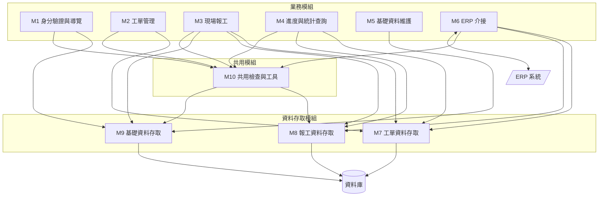
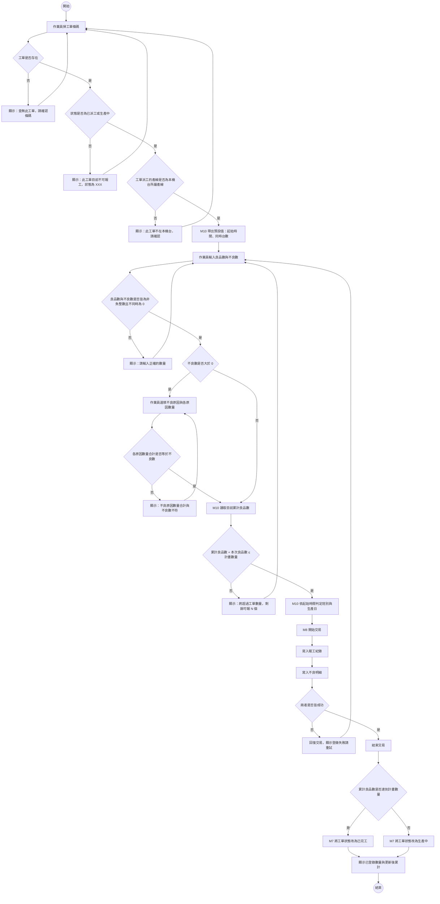
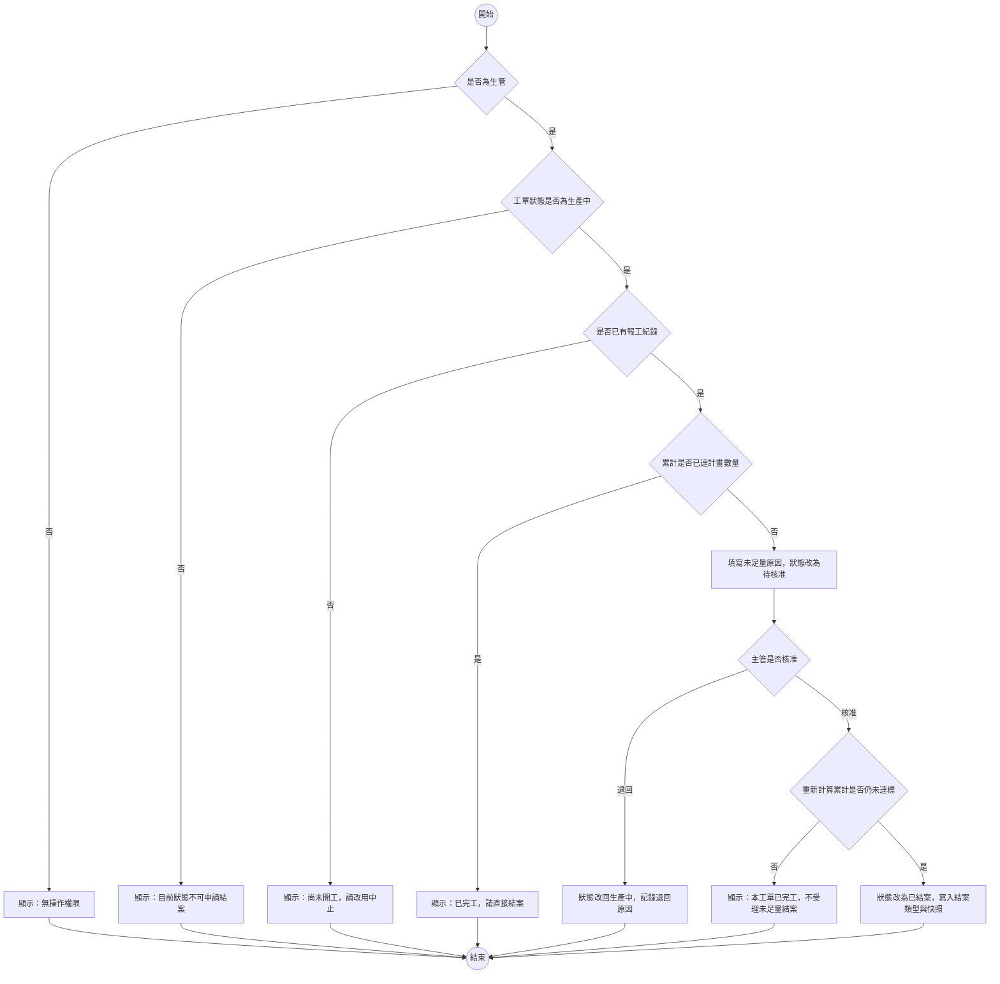
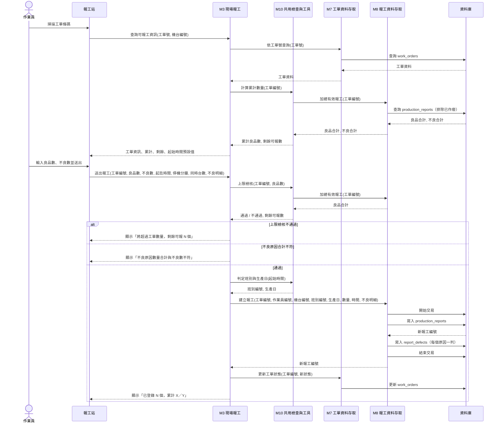
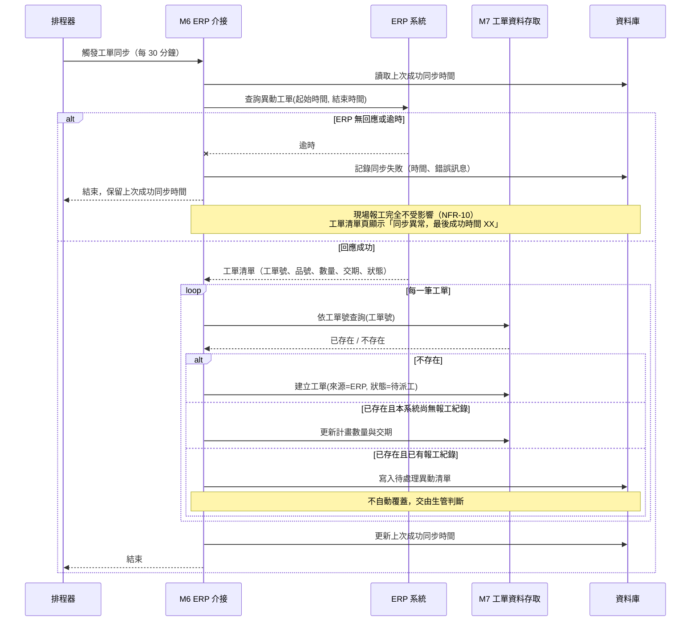
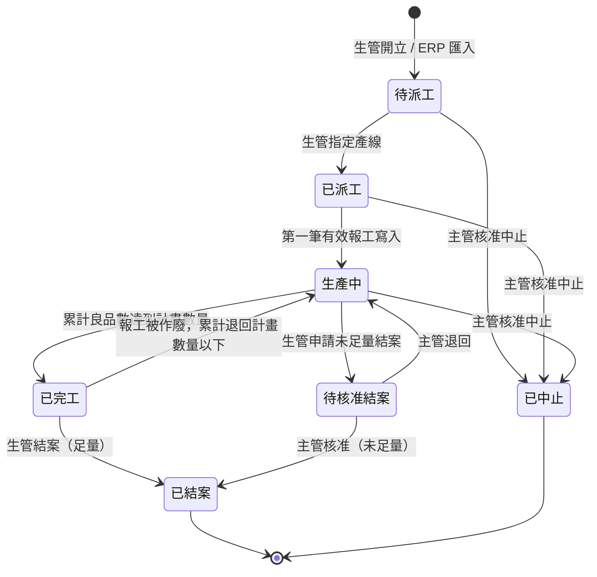
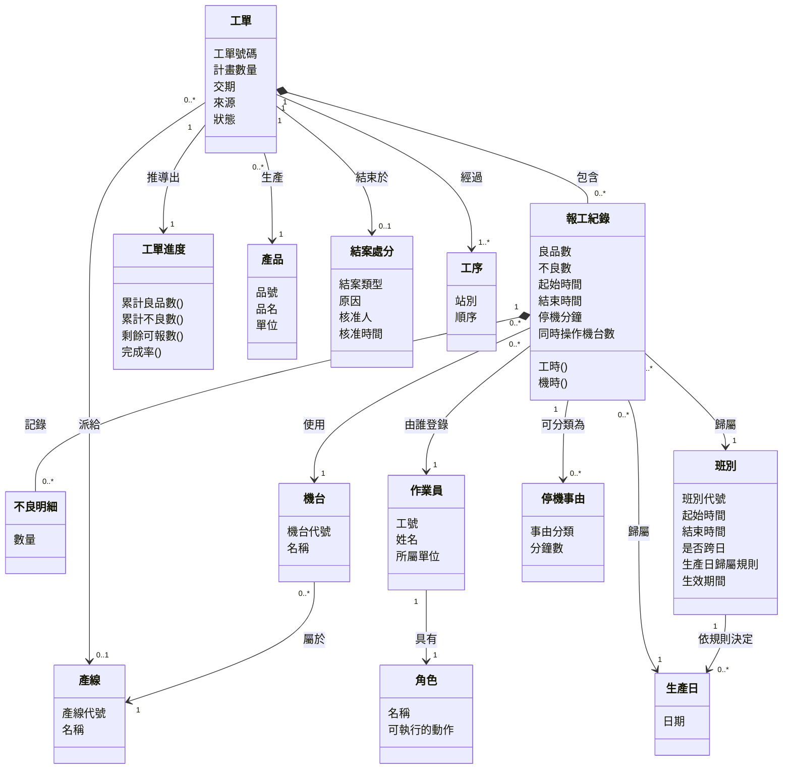
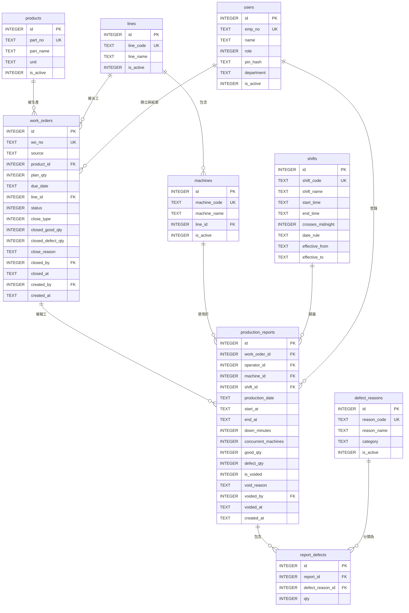
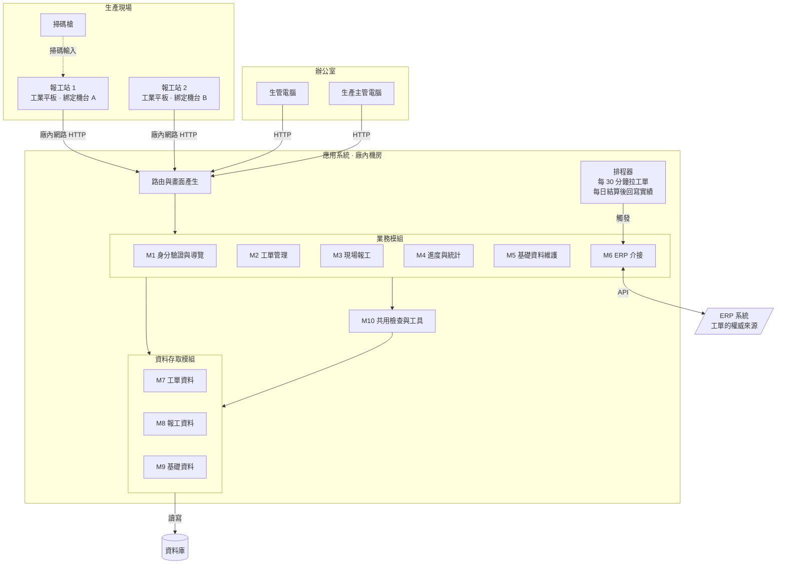

# 系統設計範例報告說明

這份文件是[「報告內容」](../00-Course-Introduction/Report-Contents.md)〈二、期末小組報告〉那八項的示範。八項的定義以那份文件為準，這裡只回答一件事：**每一項實際寫出來長什麼樣子**。

示範對象是[「工單派工與現場報工系統」](../02-Project-Topics/Work-Order-and-Reporting.md)，也就是五份期末題目說明書中最難的那一題。一份照著這份說明寫完的成品，見[「系統設計範例報告」](Design-Phase-Sample-Report.md)。

**兩份的詳細程度不一樣，這是刻意的。** 這份說明把每一項能寫到多細都攤開來，成品則是一份收斂過的版本：八項與必做圖表一項不少，但模組、需求、資料表與風險的數量都少一半，是一組四個人真的做得完的份量。所以兩邊的編號不會一一對應（說明的 FR-08 在成品裡是 FR-07），**對照時看的是結構與寫法，不是編號**。

## 一、這份文件怎麼用

### 1.1 為什麼期中與期末用不同的示範系統

期中的[「系統分析範例報告說明」](Analysis-Phase-Deliverables.md)用的是課堂範例系統（一套校園論壇），這一份換成工廠的工單系統。**換掉不是為了變化，是因為兩個階段的工作性質不同：**

| | 期中：分析 | 期末：設計 |
|---|---|---|
| 面對的東西 | 一套已經跑起來的系統 | 一組需求，系統還不存在 |
| 要做的事 | 看懂它、反推它為什麼這樣設計 | 產出一份別人照著就做得出來的設計 |
| 適合的示範對象 | **有原始碼可以對照的系統**，才驗證得出你有沒有看懂 | **貼近你們期末題目的情境**，才示範得出真正會遇到的難處 |

各組的期末題目全部落在製造現場，那裡有校園系統不會出現的東西：外部系統介接、班別與跨日歸屬、戴手套的使用者、現場網路死角。**這些正是最容易失分的地方，所以示範對象要有它們。**

這一題還有一個特別的價值：**它有一個本課程明講「你不必解決」的問題**（並行報工造成的超量），但要求你說得出它為什麼存在、評估它多嚴重、並決定這次要不要處理。**「知道有問題、評估過、決定不處理」與「不知道有問題」是完全不同的兩件事**，而這個區別只有在夠難的題目上才示範得出來。

### 1.2 四件事要先講清楚

**範例寫得精簡，那是為了讓你一眼看懂結構，不是篇幅標準。** 每一項只放到「看得出該有哪些欄位、圖上該有哪些東西」為止。你的報告該寫多少就寫多少。

**這一題的難點是刻意設計的，不要繞開它。** 題目說明書第六節攤開了三個取捨：並行報工造成的超量、累計數量該存還是該算、未足量結案要不要允許。三個都沒有標準答案，但三個都必須在你的報告裡出現。繞開它們，這份報告就只剩下一個增刪查改的資料登錄系統。

**各組抽到的題目不一樣。** 就算你抽到的也是這一題，角色、模組、資料表、畫面仍要重新推導——下面的每一個決定都附了理由，而你的現場條件可能讓同一個理由推出相反的結論。能沿用的是方法：怎麼切模組、怎麼判斷該存還是該算、怎麼把畫面欄位對回資料字典、怎麼檢查文件之間是否一致。

**這裡示範的是「設計一套還不存在的系統」。** 期中你面對的是一套已經跑起來的系統，工作是看懂它；期末你面對的是一組需求，工作是產出一份別人照著就做得出來的設計。

### 1.3 沒有程式碼可以對照，用什麼判準

期中的示範對象有一個好處：它已經寫出來了，你可以拿分析結果去對原始碼，問「我理解的跟它實際做的一樣嗎」。**期末沒有這個對照物**——你設計的系統還不存在，沒有任何東西可以驗證你寫得夠不夠具體。

**替代的判準有兩個，各組寫自己的報告時也適用：**

**第一，逐句問「這句話有沒有可能被兩種人做成兩種東西」。** 「報工時要檢查數量」會被做成兩種東西——有人檢查良品數、有人檢查良品加不良；有人在寫入前檢查、有人在寫入後檢查。這種句子就是還沒設計完。改成「寫入前檢核『該工單目前有效報工的良品數合計 + 本次良品數 ≤ 工單計畫數量』，不含不良數」，兩種人做出來才會一樣。

**第二，把每一個數字追到它的來源。** 畫面上顯示「進度 96%」，這個 96% 是哪兩個數字相除、那兩個數字各自從哪裡來、什麼時候算的？追不到底的數字，就是設計裡的洞。

這兩個判準在第 8 項會變成具體的檢查清單。

### 1.4 期末與期中的分界

同一批圖、同一批表，兩個階段問的問題不一樣：

| 產出 | 期中問 | 期末問 |
|---|---|---|
| 活動圖 | 現在報工是怎麼做的 | 系統做出來以後，報工要怎麼做 |
| 循序圖 | 作業員送什麼進去、系統回什麼出來（系統是黑箱） | 系統內部哪幾個模組互相呼叫、誰負責檢核、誰負責寫入（黑箱打開） |
| ERD | 既有的報工表單長什麼樣、反推它為什麼這樣設計 | 這些需求需要哪些資料、該切成哪幾張表 |
| 架構圖 | 這套系統由哪些部分組成 | 這套系統該由哪些部分組成，以及為什麼是這樣切 |

一句話：**期中的答案在系統裡，期末的答案在你身上。** 期末每一項設計都要說得出「為什麼選這個而不是另一個」，這就是第 8 項的設計決策紀錄要收的東西。

### 1.5 做了清單以外的東西要登記

做了標示 **可選** 的項目、或做了八項以外的東西，在書面最前面放一張 **額外項目對照表**：做了什麼、對應哪一項、放在第幾章。**老師只認表上的項目**，沒列出來的視同沒做。額度與認定條件見[「額外投入加分」](../00-Course-Introduction/Bonus-Rules.md)。

可選項目一項都不做，必做項目的分數不會因此扣減。但做了就必須做對，而且要能在個人訪談中說明——**做了一張自己講不出所以然的圖，比不做更糟**。

### 1.6 關於 AI

遇到不確定的地方，翻課本、找資料，也可以請 AI 幫你梳理思路。但你必須看懂 AI 給你的東西，採用之前要能自己說明那些概念是什麼。使用揭露義務見[「SAD 課程介紹」](../00-Course-Introduction/Course-Introduction.md)〈AI 工具使用揭露〉。

這一題有一個 AI 幫不上忙的地方值得先講：**AI 不知道你們工廠的班別怎麼排、一張工單通常幾個人做、不良原因分幾類才夠用。** 這些答案只在現場，而它們會直接決定你的資料表長什麼樣。問 AI 之前，先去問一位實習過的學長姐。

---

## 二、示範題目速覽

### 2.1 這一題要設計什麼

一套給生產現場用的**工單派工與報工系統**：生管開立工單並派給產線，作業員在機台旁的報工站登記做了幾個良品、幾個不良、花多久，生管隨時看得到進度，主管核准未足量結案與中止。

規模：

| 面向 | 規模 |
|---|---|
| 功能模組 | 6 個業務模組 + 4 個共用模組 |
| 角色 | 3 種（生管人員、現場作業員、生產主管） |
| 資料表 | 9 張（3 張交易資料 + 5 張基礎資料 + 1 張人員） |
| 畫面 | 9 個（其中 3 個在現場報工站，6 個在辦公室） |
| 外部系統 | **1 個（ERP），雙向介接** |

### 2.2 這一題的三個難點會出現在哪幾項

題目說明書〈六〉列的三個難點，不是三段獨立的討論，它們會滲進八項裡的六項。**先知道它們會在哪裡出現，寫的時候才不會漏。**

| 難點 | 出現在哪幾項 |
|---|---|
| 並行報工造成累計超量 | 第 2 項（上限檢核收斂在哪個模組）、第 3 項（循序圖上「讀取累計」與「寫入」之間的空隙）、第 7 項（風險 R-01，本題核心）、第 8 項（待解問題） |
| 累計數量該存還是該算 | 第 1 項（NFR-04）、第 4 項（工單表要不要有累計欄位）、第 5 項（清單查詢的效能）、第 8 項（設計決策 D-02） |
| 未足量結案要不要允許 | 第 1 項（需求取捨）、第 3 項（狀態機圖的轉移）、第 4 項（結案類型欄位）、第 7 項（組織可行性）、第 8 項（設計決策 D-06 與指標定義） |

第三個難點還有一個容易被忽略的下游影響：**「未足量結案的工單算不算做完」會改變管理報表的數字。** 你在設計資料的時候，同時替管理者定義了一個指標。這件事要寫進第 8 項。

### 2.3 這一題最容易走偏的地方

題目說明書〈七〉列了八條，其中三條在設計文件上特別容易發生：

| 走偏 | 在文件上長什麼樣 | 怎麼修 |
|---|---|---|
| 做成自動排程系統 | 第 2 項出現「排程演算法模組」，第 3 項有一張排序流程圖 | 派工是人工決定，系統只記錄結果。把那個模組刪掉，改成生管手動指定產線 |
| 一張工單只報一次工 | 第 4 項的報工表對工單是一對一，沒有明細結構 | 一對多是這一題的前提。工單與報工是主檔／明細關係 |
| 把進度百分比存成欄位 | 資料字典裡出現 `progress_rate` | 它是算出來的。**存了就要維護，而維護漏掉的錯誤沒有人會發現** |

---

## 三、八項書面內容的示範

以下依[「報告內容」](../00-Course-Introduction/Report-Contents.md)的順序展開。每一項先列該有的欄位，再給範例。

**這八個編號是閱讀順序，不完全是動手順序。** 建議的動手順序是 1 → 4 → 2 → 3 → 5 → 6 → 7 → 8：先把資料模型立起來，模組與流程才有東西可以搬；畫面在模組與資料都定了之後才畫得準；第 8 項一定最後，因為它是前面七項的縫合。

**這一題還有一個額外的建議：第 6 項的報工畫面早一點畫。** 不必等到第五步，第一週就可以先畫一版。理由是這個畫面會反過來決定資料表——你砍掉的每一個欄位，都必須說得出它的值從哪裡來，而那個「哪裡來」就是資料設計。

---

### 報告基本資料

八項之前，書面最前面同樣要有一張基本資料表。欄位見[「報告內容」](../00-Course-Introduction/Report-Contents.md)〈一、1.1〉，期末的示範如下：

| 項目 | 內容 |
|---|---|
| 課程 | 系統分析與設計（IE226）115-1 |
| 報告階段 | 期末小組報告（系統設計） |
| 設計題目 | 工單派工與現場報工系統 |
| 組別 | 第 3 組 |
| 組員 | 小明（1130001）、阿花（1130002）、阿宏（1130003）、阿凱（1130005，第 11 週轉入；小美於同期轉出） |
| 書面繳交日 | 2026/12/18 |
| 口頭報告日 | 2026/12/23 |

與期中的差別只有兩處：「分析對象」改成「設計題目」，以及 **期中之後有組員異動的，在組員那一格註明轉入或轉出的時間**。這一組期中是小明、阿花、阿宏、小美四人，小美轉出後由阿凱補進來，人數維持四人。異動的細節寫在文末的分工紀錄裡。

### 1. 設計基礎與需求摘要

#### 這一項不是縮小版的期中報告

它的用途只有一個：**讓讀者在不看期中報告的情況下，看得懂後面七項的設計為什麼長那樣**。所以判準很簡單——**這一項寫的每一句話，後面都要用得到**。寫了一堆背景卻沒有任何一項設計引用它，那些字就該刪掉。

反過來說也成立：後面某一項設計如果找不到依據，就是這一項漏了東西。

#### 該交代什麼

| 項目 | 說明 |
|---|---|
| 問題背景 | 要解決什麼問題、誰在什麼場域遇到它 |
| 主要角色 | 三到五個，附使用目標與權限範圍 |
| 核心流程 | 條列即可，每條一句話；細節留給第 3 項 |
| 關鍵需求 | 功能需求與非功能需求各列出會影響設計的那幾條，**要編號** |
| 系統邊界與設計範圍 | 系統做什麼、不做什麼、界線在哪一段 |
| 需求取捨 | 哪些納入本次設計、哪些延後，**理由要寫** |

**需求一定要編號。** 第 8 項的追溯鏈全靠這組編號串起來，沒編號就追不了。

#### 範例：問題背景

> 工單目前印成紙本，貼在機台旁的看板上。作業員每個班別結束時，在工單背面手寫做了幾個、幾個不良、幾點到幾點；班長下班前收單，隔天早上交給生管，生管再把數字輸入電腦。
>
> 這條路徑產生四個問題。**進度隔天才知道**，客戶下午打電話問「我那批貨做得怎樣了」，生管答不出來。**紙本會掉**，工單在現場放三天會被油污弄髒、被當廢紙丟掉。**報工超量沒人擋**，一張 5,000 個的工單被三個人分別報 2,000、2,000、1,500，加起來 5,500，這個錯誤要到月底盤點才發現。**工時失真**，「幾點到幾點」是下班前憑印象補寫的，中間換線、待料、休息的時間都算進去了。
>
> 需要一套系統，讓作業員在現場直接登記、生管即時看得到進度、超量當場被擋下、不良有原因可查。

四段話對應四個問題，而**四個問題各自生出一組設計**：第一個生出即時查詢與 ERP 回寫，第二個生出報工站與工單條碼，第三個生出上限檢核（以及它的風險 R-01），第四個生出起訖時間、停機分鐘與同時操作機台數三個欄位。

**問題背景要寫成這樣才有用。** 只寫「現行作業效率不佳、資訊不即時」，後面的設計就沒有東西可以回應。

#### 範例：主要角色

| 角色 | 使用目標 | 權限範圍 | 最在意 |
|---|---|---|---|
| 生管人員 | 排產、開單、追進度 | 開立與修改工單、派工、查詢全部進度與報表、作廢報工紀錄、維護基礎資料 | 進度要準；異常要一眼看得出來 |
| 現場作業員 | 把剛做完的一批登記掉 | 只能對自己所在機台的工單報工、查自己當班的紀錄 | **要快。** 戴手套、站在噪音裡、交班前只剩三分鐘 |
| 生產主管 | 掌握交期風險、核准例外 | 查詢全部進度與報表、核准未足量結案與中止 | 交期會不會延誤；哪條線效率有問題 |

**作業員那一列的「最在意」是這一題的關鍵，而且它會直接推翻設計。** 如果報工畫面要填十個欄位、要用下拉選單捲很久，他就會回去用紙本，這整套系統就白做了。這一句話生出了 NFR-01 與 NFR-06 兩條非功能需求，也生出第 6 項那個「只留三個必填」的畫面。

**角色最在意什麼，通常就是非功能需求的來源。** 現場題目比辦公室題目更明顯，因為它的使用者處在一個會拒絕你的環境裡——設計不合用，他就退回紙本，而你攔不住他。

#### 範例：關鍵需求

功能需求只列會影響設計結構的，不必把每個按鈕都列出來：

| 編號 | 需求 | 觸發角色 |
|---|---|---|
| FR-02 | 系統定期由 ERP 匯入新工單與工單變更 | 系統（排程觸發） |
| FR-03 | 生管可將工單派給指定產線 | 生管 |
| FR-06 | 作業員可對工單登錄報工，含良品數、不良數、起訖時間與停機分鐘 | 作業員 |
| FR-07 | 不良數大於 0 時須登記不良原因與各原因數量，合計須等於不良數 | 作業員 |
| FR-08 | 報工寫入前須檢核「該工單有效報工的良品數合計 + 本次良品數 ≤ 工單計畫數量」 | 系統 |
| FR-10 | 報工紀錄不得修改；更正一律由生管作廢原紀錄後重新登錄 | 生管 |
| FR-12 | 生產主管可核准未足量結案，須填未足量原因 | 主管 |
| FR-17 | 每個生產日結算後，將當日生產實績回寫 ERP | 系統（排程觸發） |

**FR-08 的寫法值得單獨看。** 它不是「檢查數量不要超過」，而是把三件事寫死了：檢核的時機（寫入前）、參與計算的資料（有效報工，不含已作廢）、以及**只算良品數不算不良數**。這三件事任何一件沒寫清楚，兩個人會做出兩套不同的系統。

第三件事尤其容易漏。工單 5,000 個指的是要交 5,000 個**好的**，不良品不算在內，所以做了 5,000 良品加 200 不良時，工單是完成的而不是超量的。這條規則沒寫下來，實作時只能猜。

非功能需求是設計階段的重頭戲，**它們決定架構長什麼樣**：

| 編號 | 需求 | 會決定什麼 |
|---|---|---|
| NFR-01 | 正常情況下，一次報工從掃碼到送出不超過三個輸入動作 | 報工畫面只留三個必填欄位，其餘一律由身分、裝置或前一筆紀錄推得預設值 |
| NFR-02 | 所有數量檢核與權限檢核必須在伺服器端執行 | 畫面上的限制只是提示，後端一律重驗 |
| NFR-03 | 報工紀錄不得實體刪除，更正一律以作廢加重報留痕 | 報工表需要作廢旗標與作廢原因欄，且所有加總一律排除已作廢者 |
| NFR-04 | 任一時點顯示的工單進度，必須與當時的有效報工紀錄一致 | 未結案工單的累計數量**不得存成可獨立更新的欄位** |
| NFR-05 | 班別的起訖時間與生產日歸屬規則必須來自資料，不得寫死於程式 | 需要一張班別主檔，且判定邏輯收斂於一個共用模組 |
| NFR-06 | 報工站須能在戴手套的情況下操作 | 可點擊元件最小 48×48 像素；數字用大型鍵盤輸入；不使用下拉選單 |
| NFR-07 | 報工站不以鍵盤輸入密碼 | 以工號條碼加四位數 PIN 登入；PIN 不得以明文儲存 |
| NFR-08 | 工單的計畫數量與交期以 ERP 為權威來源 | 由 ERP 匯入的工單，這兩個欄位在本系統唯讀 |
| NFR-09 | 報工紀錄須保存三年且可追溯到人、機、時 | 報工表的人員、機台、時間、生產日四組欄位皆不可空 |
| NFR-10 | 與 ERP 的任一方向同步失敗，不得影響現場報工 | 同步為非同步批次，失敗只影響資料新鮮度，不阻斷寫入路徑 |

**NFR-04 與 NFR-05 是這一題影響最深的兩條**，因為它們各自否決了一個看起來很自然的做法：

- NFR-04 否決了「在工單表加一個累計數量欄位」。那個欄位查詢最快，但報工被作廢時它要跟著改，而漏改的錯誤沒有任何人會發現。
- NFR-05 否決了「晚班是 23:00 到 07:00 寫在程式裡」。換班制度改變時，寫死的版本要改程式、要重新測試、要重新部署。

**這種「一條非功能需求砍掉一個做法」的關係，正是第 1 項最該寫出來的東西。** 只列需求不寫它砍掉了什麼，讀者看不出這條需求有什麼份量。

#### 範例：系統邊界與設計範圍

| 範圍內 | 範圍外 | 界線畫在哪 |
|---|---|---|
| 工單的登錄、派工、結案、中止 | **排產順序的決定** | 排什麼順序由生管判斷，系統只記錄結果 |
| 單一工序的報工 | 多工序流程（沖壓 → 焊接 → 烤漆各自報工） | 在製品不在站別之間流動；多工序列為可選擴充 |
| 作業員手動登記數量與時間 | 由 PLC 或設備自動取數 | 凡是需要接設備訊號的一律界外 |
| 與 ERP 交換工單與生產實績 | 與 MES、WMS 的其他介接 | 只做工單來源與實績去向這兩條 |
| 不良數與不良原因分類 | 不良品的後續處理（重工、報廢、挑選） | 本系統只記錄「發生了幾個、為什麼」 |
| 良品數、不良數、工時、機時 | 標準工時比對與效率指標計算 | 資料備齊即可，指標計算留給下一版 |

**「排產順序的決定」放在範圍外要用粗體標出來**，因為這是這一題最常見也最嚴重的走偏。把它明確寫進範圍外清單，等於替自己畫了一道防線。

#### 範例：需求取捨

| 延後的需求 | 為什麼延後 | 延後的代價 | 什麼時候該做 |
|---|---|---|---|
| 離線報工暫存與補傳 | 需要在報工站保存本地佇列、處理補送時的順序與衝突，複雜度高於本次時程 | 網路中斷期間現場無法報工，只能改用紙本事後補登，時間與班別會失真 | 現場網路實測有死角時必須做，見風險 R-05 |
| 停機事由分類 | 目前只記停機總分鐘數，分類的類別還沒談定 | 知道停了 40 分鐘，但不知道是換線、待料還是故障，改善無從下手 | 不良原因分類上線並穩定後 |
| 多工序流程 | 在製品要在站別之間流動，資料模型會跳一級 | 只看得到最後一站的產出，中間站的進度看不到 | 單工序版本上線且現場接受後 |
| 標準工時與效率指標 | 標準工時的資料來源與維護責任未定 | 有工時資料但算不出效率，主管仍需自行用試算表計算 | 基礎資料維護責任釐清後 |

**「延後的代價」這一欄是分數的關鍵。** 只寫「這次不做」是逃避，寫出不做會付出什麼代價，才代表你知道自己在放棄什麼。訪談時這一欄最常被追問。

兩件事是**明確不做**，不是延後：

| 不做的事 | 理由 |
|---|---|
| 自動排程（系統決定工單先後順序與派給哪台機台） | 排產要考慮換線時間、模具、人力、客戶臨時插單，這些條件多半不在系統裡。做成自動排程會讓演算法吃掉整份設計，而現場仍然會照自己的判斷改 |
| 允許直接修改報工紀錄 | 報工紀錄是品質追溯文件（NFR-09），修改會使追溯斷掉。更正一律以「作廢原紀錄 + 重新登錄」處理，兩筆都留著 |

**「延後」與「不做」要分開寫。** 延後代表認同但排不進來，不做代表評估後認為不該做。兩者混在一起，讀者會以為你只是做不完。

方法見教材[「問題定義與現況分析」](../01-Course-Materials/02-Problem-Definition.md)與[「系統需求分析」](../01-Course-Materials/04-System-Requirements-Analysis.md)；系統邊界與範圍外清單見[「功能分析與模組設計」](../01-Course-Materials/05-Functional-Analysis.md)〈一〉。

---

### 2. 功能與模組設計

#### 模組不是選單名稱換皮

這是這一項最常見的失分方式：把畫面上的選單抄下來，每一項後面加「模組」兩個字，就當作模組設計交出去。

真正的模組切分要通過三個檢查：

| 檢查 | 問題 | 沒通過的徵兆 |
|---|---|---|
| 內聚 | 這個模組裡的東西，是不是為了同一件事而放在一起 | 一個模組同時處理報工登錄和 ERP 同步 |
| 耦合 | 抽掉一個模組，其他模組要改幾個地方 | 改一個模組要連帶改四個 |
| 有沒有看不見的模組 | 有些模組不對應任何選單 | 模組數量剛好等於選單數量 |

**第三個檢查在這一題特別有東西可挖。** 這套系統有兩個模組完全沒有畫面入口，卻是全系統最關鍵的：一個是資料存取，另一個是**班別與生產日的判定**。後者不是任何一個功能，它是一段被十幾個地方呼叫的判斷邏輯，如果散在各處各寫一次，換班制度改變時你會漏掉其中幾處。

#### 該交代什麼

模組清單一張表，加上每個模組各一張規格表，最後一張相依關係圖與一張 CRUD 矩陣。

每個模組的規格欄位：

| 欄位 | 說明 |
|---|---|
| 模組編號與名稱 | 編號要能被第 8 項的追溯鏈引用 |
| 目的 | 一句話，說明它為什麼存在 |
| 使用角色 | 哪些角色會觸發它 |
| 主要輸入 | 從哪裡來、有哪些欄位 |
| 主要處理 | 條列，含檢查與判斷，**順序就是設計** |
| 主要輸出 | 產出什麼、寫到哪裡、畫面看到什麼 |
| 相依模組 | 呼叫誰、被誰呼叫 |
| 對應需求 | FR／NFR 編號 |

#### 範例：模組清單

| 編號 | 模組 | 類型 | 目的 | 對應需求 |
|---|---|---|---|---|
| M1 | 身分驗證與導覽 | 業務 | 報工站登入、辦公室登入、登出、依身分決定入口 | FR-05、FR-18、NFR-07 |
| M2 | 工單管理 | 業務 | 開立、修改、派工、結案、中止 | FR-01、FR-03、FR-04、FR-12、FR-13 |
| M3 | 現場報工 | 業務 | 報工登錄、當班查詢、作廢與重報 | FR-06、FR-07、FR-09、FR-10 |
| M4 | 進度與統計查詢 | 業務 | 工單進度、日產量報表、不良原因統計 | FR-11、FR-14、FR-15 |
| M5 | 基礎資料維護 | 業務 | 產品、產線與機台、班別、不良原因 | FR-16 |
| M6 | ERP 介接 | 業務 | 匯入工單、回寫生產實績 | FR-02、FR-17、NFR-08、NFR-10 |
| M7 | 工單資料存取 | 共用 | `work_orders` 表的所有讀寫 | 支撐 M2、M4、M6 |
| M8 | 報工資料存取 | 共用 | `production_reports` 與 `report_defects` 兩表的所有讀寫 | 支撐 M3、M4、M6 |
| M9 | 基礎資料存取 | 共用 | 五張基礎資料表的所有讀寫 | 支撐全部 |
| M10 | 共用檢查與工具 | 共用 | 權限檢查、班別與生產日判定、累計數量計算、上限檢核、工時推導 | NFR-02、NFR-04、NFR-05 |

M7 到 M10 就是上面說的「看不見的模組」。M6 也沒有自己的畫面，但它是業務模組不是共用模組——**判準是「它有沒有自己的業務規則」**：M6 要決定哪些工單該匯入、變更怎麼處理、同步失敗怎麼辦，這些是業務判斷；M7 到 M9 只是把資料讀出來寫進去，不做判斷。

**四個模組切分決定值得寫出理由：**

| 決定 | 理由 |
|---|---|
| 資料存取獨立成 M7～M9，不併進業務模組 | 資料庫語法只出現在這三個模組裡，換資料庫時只改這三處 |
| 五張基礎資料表合成一個 M9，不像 M7、M8 那樣一表一模組 | 基礎資料的**寫入路徑只有 M5 一條**，讀取則遍布全系統。「一表一模組」這條規則的用意是避免兩個模組寫同一張表，基礎資料不存在這個風險，因此合併 |
| 上限檢核放在 M10 而不是 M3 | 未來若新增「批次補登報工」或「由 ERP 回傳實績」等其他寫入路徑，檢核規則只有一份。放在 M3 裡，第二條路徑就會複製一份 |
| ERP 介接獨立成 M6，不併進 M2 工單管理 | M2 的規則是「人怎麼操作工單」，M6 的規則是「兩套系統怎麼對帳」，兩者變動的原因完全不同。ERP 換版本時只動 M6 |

第二條是**規則的用意比規則本身重要**的示範。照字面套「一表一模組」會生出五個只有幾行的模組，反而讓模組清單失焦；回到規則想解決什麼問題，就知道這裡可以合併。**這種判斷寫進報告會加分，但前提是理由要寫出來**，不寫的話讀起來就只是沒照規則做。

#### 範例：模組規格（M3 現場報工）

| 欄位 | 內容 |
|---|---|
| 編號與名稱 | M3 現場報工 |
| 目的 | 讓作業員把剛做完的一批數量與時間登記進系統 |
| 使用角色 | 現場作業員（登錄、查當班）；生管（作廢） |
| 主要輸入 | 登錄：工單號碼（掃碼）、良品數、不良數、起訖時間、停機分鐘、同時操作機台數、不良原因與各原因數量<br>作廢：報工編號、作廢原因 |
| 主要處理 | 1. 身分與機台檢查：作業員已登入；報工站已綁定機台<br>2. 工單檢查：工單存在、狀態為已派工或生產中、且派工的產線與本機台所屬產線相同<br>3. 數量檢查：良品數與不良數皆為非負整數，且不得同時為 0<br>4. 不良原因檢查：不良數大於 0 時，原因至少一筆，且各原因數量合計等於不良數<br>5. **呼叫 M10 取得目前累計良品數，檢核加上本次是否超過計畫數量**<br>6. 呼叫 M10 依起始時間判定班別與生產日<br>7. 於單一交易內寫入報工紀錄與不良明細<br>8. 若累計良品數達到計畫數量，將工單狀態改為已完工<br>9. 回傳結果並顯示更新後的累計與剩餘數量 |
| 主要輸出 | 成功時顯示「已登錄 N 個，本工單累計 X／Y」；失敗時原頁保留已輸入的數字並顯示錯誤 |
| 相依模組 | 呼叫 M7（讀工單、更新狀態）、M8（寫報工與不良明細）、M9（讀機台與班別）、M10（檢核與判定）；被 M1 導向 |
| 對應需求 | FR-06、FR-07、FR-08、FR-09、FR-10、NFR-01～NFR-05 |

「主要處理」那一欄的**順序是設計，不是流水帳**。這一題有三個順序是刻意的，都要在報告裡說明：

| 順序決定 | 理由 |
|---|---|
| 工單與機台的產線一致性檢查（第 2 步）排在數量檢查之前 | 掃錯工單是現場最常見的錯誤。先擋掉，作業員才不會把數字打完了才被退回 |
| 不良原因的合計檢查（第 4 步）排在上限檢核之前 | 不良原因不需要查詢資料庫就能驗證，上限檢核則必須先加總全部報工紀錄。先做便宜的檢查 |
| 工單狀態改為已完工（第 8 步）排在寫入之後，且在同一交易內 | 狀態是由累計數量推出來的結果，必須在數量確定寫進去之後才判斷。放在寫入前會出現「狀態說完工但數量還沒進去」的瞬間 |

**第 5 步是這一題的核心，也是風險 R-01 的位置。** 讀取累計與寫入之間存在一個空隙，兩個同時發生的報工會讀到同一個舊值，各自通過檢核，加起來超量。這件事在第 7 項要完整推演，這裡只要在規格上把「讀」與「寫」兩個動作分開寫出來，讓那個空隙看得見。

#### 範例：模組規格（M10 共用檢查與工具）

沒有畫面的模組更需要規格，因為讀者無法從畫面反推它做什麼。

| 欄位 | 內容 |
|---|---|
| 編號與名稱 | M10 共用檢查與工具 |
| 目的 | 收斂所有「會被多個模組用到、且改一次要全部一起改」的判斷邏輯 |
| 使用角色 | 無直接使用者，由其他模組呼叫 |
| 對外提供 | 1. 權限檢查（登入狀態、角色）<br>2. **班別與生產日判定**：輸入一個時間點，回傳班別編號與生產日<br>3. **累計數量計算**：輸入工單編號，回傳有效報工的良品數與不良數合計<br>4. **上限檢核**：輸入工單編號與本次良品數，回傳是否通過與剩餘數量<br>5. 工時與機時推導：輸入起訖時間、停機分鐘、同時操作機台數，回傳工時與機時 |
| 主要處理 | 班別判定：查詢生效中的班別主檔，找出起始時間落在哪一個班別的區間，再依該班別的生產日歸屬規則決定生產日<br>累計計算：對報工表以工單編號分組加總，**排除已作廢的紀錄** |
| 相依模組 | 呼叫 M8（讀報工）、M9（讀班別）；被 M2～M6 呼叫 |
| 對應需求 | NFR-02、NFR-04、NFR-05 |

**這張表要看的是「對外提供」那五項為什麼會被放在一起。** 它們的共通點不是功能相似，而是**每一項都會被兩個以上的模組用到，而且規則改變時必須一次全改**。班別規則改了，報工登錄、日產量報表、ERP 回寫三處都要跟著變——收在一個模組裡，改一次就好。

反過來說，只被一個模組用到的邏輯不該放進來。**共用模組變成雜物間，是這一項另一種失分方式。**

#### 範例：模組相依關係圖



**這張圖要檢查三件事：**

1. **箭頭有沒有往回指。** 資料存取模組不該反過來呼叫業務模組。圖上出現雙向箭頭，通常代表切分錯了——本圖唯一的雙向箭頭是 M6 對外連 ERP，那是跨系統的往返，不是內部循環。
2. **業務模組之間有沒有互相呼叫。** 這張圖上六個業務模組彼此完全不呼叫，只透過共用模組與資料存取模組間接發生關係。這是刻意的，代表模組邊界切得乾淨。
3. **M10 同時被業務模組呼叫、又去呼叫資料存取模組。** 它落在中間層，不是最底層。這一點要在報告裡講明，否則讀者會以為共用模組應該是最底下那一層。

#### 範例：CRUD 矩陣

模組與資料表的對照表，用來檢查有沒有模組偷寫別人的資料：

| 模組 | `work_orders` | `production_reports` | `report_defects` | 五張基礎資料表 |
|---|:---:|:---:|:---:|:---:|
| M1 身分驗證與導覽 | — | — | — | R |
| M2 工單管理 | C R U | R | — | R |
| M3 現場報工 | R U | C R U | C R | R |
| M4 進度與統計查詢 | R | R | R | R |
| M5 基礎資料維護 | — | — | — | C R U |
| M6 ERP 介接 | C R U | R | R | R |

C 建立、R 讀取、U 更新、D 刪除。

**這張矩陣有三件事值得指出：**

- **整張表沒有任何一個 D。** 報工紀錄依 NFR-03 不得實體刪除，工單也一樣，基礎資料則以停用旗標取代刪除。矩陣上一個 D 都沒有，本身就是一項設計決策的證據。
- **M3 對 `work_orders` 有 U。** 這一格看起來像是越界——報工模組為什麼要改工單？因為累計數量達標時要把工單狀態改成已完工。**這種「跨出自己主表的更新」一定要在報告裡解釋**，否則讀者會判定為邊界破裂。
- **M2 與 M6 都對 `work_orders` 有 C 和 U。** 兩個模組寫同一張表，是這份設計上唯一需要注意的地方。分工是：M6 只寫由 ERP 匯入的工單，M2 只寫廠內自建的臨時工單，兩者以工單來源欄位區隔，且 M2 不得修改 ERP 來源工單的計畫數量與交期（NFR-08）。**規則寫下來，這一格就不是問題；沒寫下來，它遲早會變成問題。**

模組規格欄位與相依檢查見教材[「功能分析與模組設計」](../01-Course-Materials/05-Functional-Analysis.md)〈四〉、〈五〉。

---

### 3. 主要流程與互動設計

這一項要交兩種圖：**活動圖**回答「事情按什麼順序做、在哪裡分岔」，**循序圖**回答「系統內部哪幾個模組互相呼叫」。狀態機圖在課程規定上是可選，**但這一題強烈建議做**——工單有六個狀態、九條轉移，還有一條會往回走，不畫圖講不清楚。

#### 3.1 活動圖

##### 該畫幾張、畫什麼

至少兩張，挑核心功能。挑的標準是**有判斷、有例外**——一路順下去沒有分岔的流程畫出來沒有資訊量。

這一題最值得畫的三條：**報工登錄**（檢核最多）、**未足量結案**（跨三個角色）、**報工作廢與重報**（會讓工單狀態往回走）。

設計階段的活動圖比期中細，差別在三處：

| 面向 | 期中（現況） | 期末（設計） |
|---|---|---|
| 判斷節點 | 畫出主要分岔即可 | 每一個檢查都要是一個節點，且**順序就是設計** |
| 例外路徑 | 畫出重要的幾條 | 每個判斷的「否」都要有去處，不能斷在空中 |
| 動作的主詞 | 使用者做了什麼 | 哪個模組做了什麼 |

##### 泳道怎麼畫：先確認這條流程需不需要泳道

泳道的用途只有一個：**標出每個動作由誰執行**。所以判準很簡單——

| 情況 | 要不要泳道 |
|---|---|
| 流程只有「使用者」與「系統」兩方 | **不要**。每個動作是誰做的一看就知道，加了泳道只是多兩個框 |
| 流程跨兩個以上的角色，或有次要角色承受後果 | 要。這時「誰做什麼」才是需要標示的資訊 |

**Mermaid 沒有原生泳道。** 用 `subgraph` 當泳道是常見做法，但 `subgraph` 的語意是「一群節點」而不是「一條道」，佈局引擎經常把它排成上下堆疊而不是並排，跨道的箭頭也會亂竄。

本課程建議的做法是**表格式泳道**：

| 做法 | 怎麼做 | 為什麼建議 |
|---|---|---|
| **表格式泳道**（建議） | 欄 = 角色，列 = 步驟序號，格子裡填該角色在那一步做的事 | 欄位本身就是泳道，不依賴任何繪圖引擎，各種預覽工具呈現一致 |
| 搭配一張不帶泳道的活動圖 | 用 mermaid 專門畫分岔與例外邏輯，不管誰執行 | 兩張圖分工：表回答「誰做」，圖回答「怎麼分岔」 |
| 真的要畫圖形泳道 | 用 draw.io、Visio、Figma 之類的工具畫好，存成圖片插入 | 圖形泳道要好看，用專門的繪圖工具比跟 mermaid 搏鬥快 |

**用哪一種都不影響分數。** 評分看的是「每個動作標得出執行者」與「每個判斷的否都有去處」。

##### 範例：報工登錄（只有作業員與系統兩方，不需泳道）



**動作前面掛模組編號，就替代掉了泳道。** `A5[M10 讀取目前累計良品數]` 已經說清楚這件事由誰做，不必再為 M10 開一條道。

這張圖上有四個地方是**設計決定**，報告要各寫一句話說明：

| 圖上的位置 | 設計決定 | 理由 |
|---|---|---|
| D1～D3 三個檢查排在輸入數量之前 | 先驗工單，再讓人打字 | 掃錯工單是現場最常見的錯誤。等數字都打完才退回，作業員會很不耐煩 |
| E6 的訊息帶出「剩餘可報 N 個」 | 錯誤訊息要說得出下一步 | 只寫「超過工單數量」，作業員不知道該改成幾個。**錯誤訊息也是設計** |
| D7 到 T2 之間沒有任何保護 | **這裡就是 R-01 的位置** | 讀取累計（A5）與寫入（T2）之間有空隙，兩個同時進行的報工會讀到同一個舊值。這一段刻意不加保護，理由與評估寫在第 7 項 |
| D9 判斷放在交易之後 | 狀態由數量推出 | 必須先確定數量寫進去了，才判斷得出工單完工沒有 |

**第三列是這一題與其他四題最不一樣的地方。** 一般的活動圖是「畫出系統會怎麼做」，這裡還要畫出「系統做不到的地方在哪一段」。能在圖上指出那個空隙的位置，第 7 項的風險分析就有了具體依據，而不是憑空寫一條「可能會超量」。

##### 範例：未足量結案（跨三個角色，用泳道表）

這條流程有三個角色：生管提出、主管核准、作業員承受後果（工單消失在報工站的可選清單上）。第三個角色從頭到尾沒有任何動作，卻是這條流程的目的所在。

**第一張表：泳道**

| 步驟 | 生管 | 系統 | 生產主管 | 現場作業員 |
|:--:|---|---|---|---|
| 1 | 在工單明細頁點選「申請未足量結案」 | | | |
| 2 | | 檢查：工單狀態為生產中、已有報工紀錄、累計未達計畫數量 | | |
| 3 | 填寫未足量原因並送出 | | | |
| 4 | | 將工單標記為「待核准結案」，通知主管 | | |
| 5 | | | 檢視工單、累計數量與原因 | |
| 6 | | | 核准或退回 | |
| 7 | | 核准：狀態改為已結案，寫入結案類型、原因、核准人與時間，並將累計數量寫入結案快照 | | |
| 8 | | 退回：狀態改回生產中，記錄退回原因 | | |
| 9 | | | | 該工單不再出現於報工站的可報工清單 |

**第二張表：例外分支**

| 在哪一步 | 例外 | 系統的處置 |
|:--:|---|---|
| 2 | 工單尚無任何報工紀錄 | 顯示「本工單尚未開工，請改用中止」，不進入結案流程 |
| 2 | 累計已達計畫數量 | 顯示「本工單已完工，請直接結案」 |
| 2 | 工單已是待核准狀態 | 顯示「已有一筆結案申請待核准」 |
| 5 | 核准期間有新的報工進來，使累計達標 | **見下方說明** |
| 6 | 主管不在，超過兩個工作日未處理 | 本次設計無自動升級機制，工單停在待核准；列為風險 R-08 |

**第 5 步那個例外要特別想過。** 主管在看核准畫面的同時，現場又報了一筆工，累計剛好達到計畫數量——這時核准下去，會產生一張「未足量結案但其實做滿了」的工單。

本設計的處置是：**核准當下重新計算一次累計，若已達標則不接受核准，改提示「本工單已完工」。** 這是把「檢核要在動作發生的那一刻做，而不是在畫面載入的時候做」這條原則寫進設計裡，跟 R-01 是同一類問題的不同表現。

**這種例外要自己找出來，不會有人提醒你。** 找法很單純：流程裡只要出現「人看了畫面、隔一段時間才做決定」，就去問「這段時間內資料變了會怎樣」。

**第三張：分岔邏輯的活動圖**

泳道表讀不出「哪個檢查先做」，所以檢核順序另外畫一張圖：



**注意 C4 與 C6 是同一個檢查做了兩次。** 第一次在申請時，第二次在核准時。重複不是冗餘，因為兩次之間隔了主管的思考時間，而現場不會停下來等他。

#### 3.2 循序圖

##### 期中的 SSD 與期末的循序圖差在哪

| | 期中：系統循序圖（SSD） | 期末：設計階段循序圖 |
|---|---|---|
| 生命線 | 使用者、系統（一條，黑箱） | 使用者、各模組、資料庫（多條） |
| 訊息 | 使用者送什麼、系統回什麼 | 模組之間互相呼叫什麼、回傳什麼 |
| 回答的問題 | 系統對外的介面長什麼樣 | 系統內部誰負責哪一段 |

**期末畫成期中那樣（只有兩條生命線）會被視為沒做。** 判斷方法很簡單：把第 2 項的模組清單拿來對，圖上的生命線應該都在那張清單裡找得到。

##### 該畫幾張

一到兩張，挑**跨最多模組**的流程。這一題最該畫的是報工登錄（跨五個模組，且含交易與例外），第二張建議畫 ERP 同步（跨系統邊界，且失敗處置與一般流程不同）。

##### 範例：報工登錄



**訊息括號裡的參數要寫。** 沒寫參數的循序圖只是箭頭練習——`計算累計()` 和 `計算累計(工單編號)` 傳達的資訊量差很多。而且第 8 項的一致性檢查會要求：**括號裡的每個參數，都要在資料字典裡找得到對應欄位**。

這張圖藏著兩個值得寫的東西：

**第一，累計數量被查了兩次。** 一次在掃碼時（為了顯示剩餘可報數），一次在送出時（為了檢核）。看起來重複，但兩次的用途不同：前者是給人看的參考值，後者是判斷的依據。**如果只查一次、用畫面上顯示的那個數字來判斷，作業員停在畫面上五分鐘的期間別人報了工，這個判斷就是錯的。**

**第二，`M8 開始交易` 到 `結束交易` 之間包住了兩張表的寫入，但沒有包住上面的上限檢核。** 這是圖上看得出來的空隙，也就是 R-01。**交易邊界畫在哪裡，是設計決定，不是實作細節**——把它畫出來，讀者才看得到你知道它在哪。

##### 範例：ERP 工單同步

跨系統的循序圖有一個內部流程沒有的重點：**對方沒有回應的時候你怎麼辦。**



**最後那個 `else 已存在且已有報工紀錄` 分支是這張圖的重點。** ERP 把一張已經做了 3,000 個的工單從 5,000 改成 4,000，系統該直接改嗎？直接改的話，累計 3,000 對計畫 4,000 仍然合理，看起來沒事；但如果改成 2,000，就會出現「累計超過計畫」的狀態，而且不是任何人報錯造成的。

本設計的選擇是**不自動覆蓋，寫進待處理清單由生管判斷**。理由與代價要寫進第 8 項的設計決策。

#### 3.3 狀態機圖

課程把這張圖列為可選，**但這一題建議做**。工單有六個狀態、九條轉移，其中一條會往回走，用文字描述會漏。

##### 範例：工單狀態



畫這張圖的價值在於它逼出四個問題：

| 圖上看得出來的 | 要回答的問題 |
|---|---|
| 「已完工 → 生產中」有一條**往回走**的箭頭 | 狀態可以倒退嗎？倒退的時候要不要通知誰？ |
| 「生產中 → 已中止」存在，但已經做了 3,000 個 | 那 3,000 個怎麼算？中止的工單進不進當月產量？ |
| 「已結案」與「已中止」都是終態 | 誤結案怎麼辦？要不要有撤銷？ |
| 「待派工 → 生產中」沒有箭頭 | 沒派工的工單不能報工，這是刻意的還是漏了？ |

**第一個問題是這張圖最有價值的地方。** 報工被作廢會讓累計退回，工單從已完工變回生產中——這條轉移不畫出來，實作時很可能被漏掉，結果是一張明明還沒做完的工單永遠掛在已完工，而且沒有人會發現。

**第三個問題要注意它與資料設計的連動。** 結案時會把累計數量寫成快照存進工單表（見第 4 項），如果允許撤銷結案，那個快照就要跟著清掉。本設計的選擇是：**已結案的工單不接受報工作廢，要作廢必須先由主管撤銷結案。** 這條規則讓「快照永遠等於重算值」這件事成立，也讓 NFR-04 不被打破。

**這種「狀態機圖上的一條轉移，牽動資料設計的一個欄位」的關係，是第 8 項追溯鏈最好的材料。**

活動圖、循序圖與狀態機圖的畫法見教材[「行為建模」](../01-Course-Materials/06-Behavioral-Modeling.md)。

---

### 4. 資料設計

這一項要交四份東西：**概念類別圖 → ERD → Schema → 資料字典**，再加一張**畫面欄位對照表**。四份要一路對得起來。

這一題還要多交一張表：**推導欄位清單**，也就是「畫面上看得到、資料表裡卻沒有」的那些數字。理由見〈4.2〉。

#### 4.1 概念類別圖

##### 它跟 ERD 差在哪

這是期末新增的一張圖，也是最容易畫成「ERD 換個框線」的一張。兩者的差別：

| | 概念類別圖 | ERD |
|---|---|---|
| 畫的是 | 這個領域裡有哪些概念 | 資料庫裡要存哪幾張表 |
| 可以放 | **還沒決定要不要存的概念**、規則、算出來的東西 | 只放真的要存的 |
| 有沒有 | 屬性、關聯、多重性 | 欄位、型別、主鍵外鍵 |
| 什麼時候畫 | ERD 之前 | 概念類別圖之後 |

**「可以放還沒決定要不要存的概念」是關鍵。** 畫出來跟 ERD 一模一樣，代表這一步沒有發生——你只是把資料表重畫了一次。

##### 範例：概念類別圖



這張圖上有**六個概念不會變成資料表**，正是它存在的價值：

| 概念 | 為什麼不進資料表 | 那它去了哪裡 |
|---|---|---|
| 工單進度 | 它的四個屬性全部是括號結尾的推導值，不是資料 | 由報工紀錄即時加總算出，見〈4.2〉 |
| 工時、機時（報工紀錄上的兩個方法） | 由同一筆紀錄上的起訖時間、停機分鐘與同時台數算出 | 查詢時計算，不落成欄位 |
| 角色 | 只有三種且不會增減 | 變成 `users` 表上的一個整數欄位，不另建角色表 |
| 結案處分 | 一張工單最多只有一筆，且大部分工單沒有 | 併成 `work_orders` 上的四個可空欄位，不另建表 |
| 停機事由 | **本次決定不做** | 只記停機總分鐘數，不記分類。見第 1 項的需求取捨表與風險 R-07 |
| 工序 | **本次明確簡化為單工序** | 完全不落地。多工序列為範圍外，見第 1 項的系統邊界表 |

**「生產日」是這張圖上最值得討論的一個概念，因為它跟上面六個相反——它是算出來的，但本設計把它存了下來。** 理由見下一節。

**把「已知需要但這次不做」的概念畫在圖上、標明它沒有落到資料表，比直接不畫它有價值得多。** 直接不畫，讀者會以為你沒想到；畫了並說明，讀者知道你評估過。

#### 4.2 這一題的核心問題：該存還是該算

題目說明書〈六〉的第二個難點就是這件事，而它在這份設計裡出現了四次，答案還不一樣。**與其每次單獨判斷，不如先訂一條判準：**

> **推導值要不要存下來，看它的計算依據會不會隨時間改變。依據不會變，就用算的；依據會被人改，就存快照。**

用這條判準把四個推導值一次處理掉：

| 推導值 | 計算依據 | 依據會不會變 | 決定 | 理由 |
|---|---|---|:--:|---|
| 未結案工單的累計良品數與不良數 | 該工單所有未作廢的報工紀錄 | **不會**。報工不得修改，只能作廢，而作廢也留在表裡 | **用算的** | 任何時間重算都得到同一個答案。存成欄位反而多一份要維護、且維護漏掉時沒有人會發現（NFR-04） |
| 報工的工時與機時 | 同一筆報工紀錄上的起訖時間、停機分鐘、同時操作機台數 | **不會**。全部在同一筆不可變的紀錄裡 | **用算的** | 同上。而且存下來還會出現「三個欄位改了但工時沒改」的不一致 |
| 報工的班別與生產日 | 班別主檔的起訖時間與生產日歸屬規則 | **會**。換班制度改變、班別區間調整，主檔就會被改 | **存快照** | 若每次重算，去年的報工會用今年的班表重新歸屬，歷史報表的數字會自己變動 |
| 已結案工單的累計數量 | 同第一列，但工單已結案 | **不會，而且不再增加** | **存快照** | 純為效能。結案工單佔多數，每次查歷史報表都重新加總全部報工紀錄不划算 |

**第一列與第三列是這一題最能拉開差距的對照。** 兩個都是算出來的數字，一個不存一個存，理由完全相反——而且兩個理由都成立。能寫出這一組對照，代表你不是在套規則，是真的在判斷。

第四列還有一個前提要一併寫出來：**存快照的做法只有在「結案後累計不再變動」成立時才安全**。所以設計上必須配套一條規則：**已結案的工單不接受報工作廢，要作廢必須先由主管撤銷結案。** 這條規則在第 3 項的狀態機圖上看得到，在這裡變成資料設計的前提。

**這種「A 的設計成立，是因為 B 那邊有一條規則擋住」的依賴關係，一定要寫下來。** 半年後有人放寬了 B，A 就會靜靜地壞掉，而且不會有任何錯誤訊息。

概念類別圖與 ERD 的差別見教材[「物件建模」](../01-Course-Materials/10-Object-Modeling.md)〈四〉。

#### 4.3 ERD

從概念類別圖走到 ERD，做的是三件事：**決定哪些概念要落地、把關聯換成主外鍵、把屬性換成欄位與型別。**



##### 三個該寫理由的設計決定

| 決定 | 一張表也做得到，為什麼拆 |
|---|---|
| 工單與報工拆成主檔／明細兩張表 | 一張工單會有幾十筆報工，數量與時間屬於「一次報工」而不屬於「一張工單」。這是這一題的前提，併成一張就沒有題目了 |
| 不良明細再拆一張 `report_defects` | 一次報工的 30 個不良可能有三種原因。塞回報工紀錄只能記一個原因，統計會失真——而不良原因統計是這套系統的主要價值之一 |
| 產線與機台分成兩張表 | 派工的對象是產線（粗），報工要記到機台（細）。合成一張的話，工單的派工欄位與報工的機台欄位會指向同一張表卻代表不同粒度的東西 |

第二條的代價要一併寫：**報工畫面多了一層輸入**，而作業員只有三分鐘。這個代價在第 6 項用「不良數為 0 時整區不顯示」化解掉——**代價在資料設計這裡產生，在介面設計那裡被吸收，兩處要互相指過去。**

##### 為什麼是三層而不是兩層

`work_orders` → `production_reports` → `report_defects` 是三層結構，比常見的主檔／明細多一層。判準是：**每一層的「一筆」代表的東西不同**——一張工單是一個生產指令，一筆報工是一個人在一段時間做的一批，一筆不良明細是那一批裡的一種不良。三個層次的數量各自獨立變動，因此各自成表。

**如果你的題目裡某兩層永遠一對一，那就不該分成兩張表。** 分層的依據是多重性，不是概念上聽起來像不像兩件事。

#### 4.4 資料表與鍵值

| 資料表 | 用途 | 主鍵 | 對外參照 | 其他約束 |
|---|---|---|---|---|
| `work_orders` | 工單主檔 | `id` | `product_id`、`line_id`、`created_by`、`closed_by` | `wo_no` 唯一；`plan_qty` 須大於 0；`status` 限六個值 |
| `production_reports` | 報工紀錄 | `id` | `work_order_id`、`operator_id`、`machine_id`、`shift_id` | 四個外鍵欄與 `production_date` 皆不可空（NFR-09）；`good_qty`、`defect_qty` 須為非負整數 |
| `report_defects` | 報工不良明細 | `id` | `report_id`、`defect_reason_id` | `qty` 須大於 0；同一筆報工的同一原因不得重複 |
| `products`／`lines`／`machines`／`defect_reasons` | 基礎資料 | `id` | `machines.line_id` → `lines.id` | 各自的代號欄唯一；以 `is_active` 停用，不刪除 |
| `shifts` | 班別主檔 | `id` | 無 | 同一代號的生效期間不得重疊 |
| `users` | 人員帳號 | `id` | 無 | `emp_no` 唯一；`pin_hash` 不儲存明文（NFR-07） |

##### 一個必須寫進報告的設計決定

**外鍵要不要真的在資料庫裡宣告？**

這一題的答案是**宣告**。理由是報工紀錄依 NFR-09 是品質追溯文件，必須保證「每一筆報工都指得到一張真實存在的工單、一台真實存在的機台、一個真實存在的人」。這個保證交給程式自律太脆弱，交給資料庫才可靠。

代價與配套：

| 項目 | 說明 |
|---|---|
| 刪除行為 | 一律設為禁止刪除（`RESTRICT`），**不設級聯刪除**。基礎資料要退場一律改 `is_active`，不刪紀錄 |
| 匯入順序 | 上線時基礎資料必須先建，工單才進得來，ERP 同步在找不到品號時要退回待處理清單而不是硬寫 |
| 效能 | 每次寫入報工要多驗四個外鍵。以本題的資料量（每日數百筆報工）可以接受 |

**但「宣告外鍵」不是通則，換一組需求答案就會相反。** 如果某個系統要求「刪除帳號時不得抹除他既有的內容」，宣告外鍵並設成級聯刪除就會直接違反它，那時正確的選擇是不宣告、由程式維護關聯。**設計決策要跟著需求走，不是跟著習慣走**——這一點在訪談時常被問到，答「因為資料庫本來就該宣告外鍵」會被追問到底。

#### 4.5 資料字典：`production_reports`

每一張表各一份。這裡示範最核心的一張：

| 欄位名稱 | 中文名稱 | 型別 | 必填 | 值域／格式 | 資料來源 | 寫入時機 |
|---|---|---|---|---|---|---|
| `id` | 報工編號 | INTEGER | 是 | 主鍵，系統流水號 | 系統產生 | 報工登錄時 |
| `work_order_id` | 工單編號 | INTEGER | 是 | 對應 `work_orders.id` | 掃碼帶入 | 報工登錄時 |
| `operator_id` | 作業員編號 | INTEGER | 是 | 對應 `users.id` | **由登入身分帶入，不由畫面輸入** | 報工登錄時 |
| `machine_id` | 機台編號 | INTEGER | 是 | 對應 `machines.id` | **由報工站的裝置設定帶入** | 報工登錄時 |
| `shift_id` | 班別編號 | INTEGER | 是 | 對應 `shifts.id` | 由 M10 依 `start_at` 判定 | 報工登錄時，**判定後即固定** |
| `production_date` | 生產日 | TEXT | 是 | `YYYY-MM-DD` | 由 M10 依班別的歸屬規則判定 | 同上 |
| `start_at` | 起始時間 | TEXT | 是 | `YYYY-MM-DD HH:MM` | 預設為同工單同機台前一筆的 `end_at`，可修改 | 報工登錄時 |
| `end_at` | 結束時間 | TEXT | 是 | 同上；須晚於 `start_at` | 預設為當下時間，可修改 | 報工登錄時 |
| `down_minutes` | 停機分鐘 | INTEGER | 是 | 非負整數；預設 `0`；不得大於起訖時間差 | 使用者輸入 | 報工登錄時 |
| `concurrent_machines` | 同時操作機台數 | INTEGER | 是 | 大於 0 的整數；預設 `1`，記住同一作業員上次的值 | 使用者輸入 | 報工登錄時 |
| `good_qty` | 良品數 | INTEGER | 是 | 非負整數 | 使用者輸入 | 報工登錄時 |
| `defect_qty` | 不良數 | INTEGER | 是 | 非負整數；大於 0 時 `report_defects` 的 `qty` 合計須等於本欄 | 使用者輸入 | 報工登錄時 |
| `is_voided` | 是否已作廢 | INTEGER | 是 | `1` 已作廢、`0` 有效；預設 `0` | 生管執行作廢 | 作廢時 |
| `void_reason` | 作廢原因 | TEXT | 否 | 作廢時必填 | 生管輸入 | 作廢時 |
| `voided_by` | 作廢人 | INTEGER | 否 | 對應 `users.id` | 由登入身分帶入 | 作廢時 |
| `voided_at` | 作廢時間 | TEXT | 否 | `YYYY-MM-DD HH:MM:SS` | 系統產生 | 作廢時 |
| `created_at` | 登錄時間 | TEXT | 是 | 同上 | 系統產生 | 報工登錄時 |

**「資料來源」這一欄在這一題特別重要**，因為 NFR-01 只准作業員做三個輸入動作，其他欄位的值全部得從別的地方生出來。把這一欄從上往下讀一次，就看得出那三個動作以外的欄位各自從哪裡來：

| 來源 | 欄位 | 為什麼能這樣拿 |
|---|---|---|
| 登入身分 | `operator_id` | 作業員登入後才報工，人是誰系統已經知道 |
| 裝置設定 | `machine_id` | **報工站是固定在機台旁的**，一台裝置對一台機台，裝機時設定一次 |
| 前一筆紀錄 | `start_at` | 同一台機台上同一張工單，這一批的開始通常就是上一批的結束 |
| 推導 | `shift_id`、`production_date` | 由 `start_at` 算出來 |
| 預設值 | `down_minutes`、`concurrent_machines` | 多數情況是 0 與 1，例外時才改 |

**第二列是這一題最漂亮的一個設計：用部署位置換掉一個輸入欄位。** 報工站鎖在機台旁，機台編號就不必問人。這種「把資訊藏在環境裡而不是問使用者」的做法，是現場系統與辦公室系統最大的差別，值得在報告裡單獨寫一段。

**「寫入時機」欄有兩列標了「判定後即固定」**，那是〈4.2〉那條判準的落地：班別與生產日一旦判定就不再重算，班別主檔之後怎麼改都不影響已經寫進去的紀錄。

#### 4.6 資料字典：`shifts`

這張表小，但它是 NFR-05 的全部：

| 欄位名稱 | 中文名稱 | 型別 | 必填 | 值域／格式 | 說明 |
|---|---|---|---|---|---|
| `id` | 班別編號 | INTEGER | 是 | 主鍵 | — |
| `shift_code` | 班別代號 | TEXT | 是 | 唯一 | 例如 `A`、`B`、`C` |
| `shift_name` | 班別名稱 | TEXT | 是 | — | 早班、中班、晚班 |
| `start_time` | 起始時間 | TEXT | 是 | `HH:MM` | 例如晚班 `23:00` |
| `end_time` | 結束時間 | TEXT | 是 | `HH:MM` | 例如晚班 `07:00` |
| `crosses_midnight` | 是否跨日 | INTEGER | 是 | `1` 跨日、`0` 不跨日 | 由起訖時間可推得，仍存成欄位以便判定邏輯直接使用 |
| `date_rule` | 生產日歸屬規則 | TEXT | 是 | `START_DAY` 歸屬起始日、`END_DAY` 歸屬結束日 | **這一欄是整套班別設計的核心** |
| `effective_from` | 生效起日 | TEXT | 是 | `YYYY-MM-DD` | 換班制度時新增一列，不修改舊列 |
| `effective_to` | 生效迄日 | TEXT | 否 | 同上；空值代表目前仍生效 | 同上 |

**`date_rule` 這一欄回答了題目說明書〈五〉那個「晚班 23:00 開始、07:00 結束，算哪一天」的問題**，而且它把答案放在資料裡而不是程式裡。本廠的設定是晚班為 `START_DAY`，也就是 23:00 到隔天 07:00 的產出全部算前一天——但這是本廠的選擇，換一間廠可能相反，改資料就好。

**最後兩欄的用法要寫清楚：換班制度改變時新增一列、把舊列的 `effective_to` 填上，而不是修改舊列。** 這樣舊資料的判定依據還在，稽核時查得出「當時是照哪一套班表算的」。這一點與〈4.2〉存快照的決定是互補的：**存快照保證數字不變，保留歷史班表保證解釋得出那個數字怎麼來的。**

#### 4.7 推導欄位清單

這是這一題特有的一張表，用來回答「畫面上這個數字在資料庫的哪裡」——答案是「不在，它是算出來的」。

| 推導值 | 出現在哪些畫面 | 算式 | 資料來源 |
|---|---|---|---|
| 累計良品數 | UI-02 報工登錄、UI-04 工單清單、UI-06 工單明細 | 該工單所有 `is_voided = 0` 的報工的 `good_qty` 合計 | `production_reports` |
| 累計不良數 | UI-04、UI-06、UI-08 | 同上，改加總 `defect_qty` | 同上 |
| 剩餘可報數 | UI-02 | `plan_qty` − 累計良品數 | 兩表 |
| 完成率 | UI-04、UI-06 | 累計良品數 ÷ `plan_qty` | 兩表 |
| 工時（分） | UI-03 當班紀錄、UI-08 日產量報表 | (`end_at` − `start_at` − `down_minutes`) ÷ `concurrent_machines` | `production_reports` 單筆 |
| 機時（分） | UI-08 | `end_at` − `start_at` − `down_minutes` | 同上 |
| 是否逾期 | UI-04 | `due_date` 早於今天且狀態未結案 | `work_orders` |

**這張表要跟第 8 項的一致性檢查配著看。** 交件前拿畫面上的每一個數字問一次「它在資料字典裡嗎」，不在的話就必須出現在這張表上。**兩邊都找不到的數字，就是設計裡的洞。**

「工時」那一列還藏著一個要說明的事：**一個人顧三台機，八小時的工時對應二十四小時的機時**。他會在同一時段對三台機各報一筆工，每筆的 `concurrent_machines` 都填 3，於是三筆的工時各為 8÷3 小時、合計 8 小時，而機時各為 8 小時、合計 24 小時。**這個算式只多要一個輸入欄位，就把題目說明書〈三〉那個「工時與機時不一樣」的問題解決掉了。**

代價是那個欄位會被填錯（作業員忘了改回 1），列為風險 R-09。

#### 4.8 畫面欄位與資料表對照

| 畫面 | 畫面欄位 | 存到哪裡 | 誰產生 |
|---|---|---|---|
| UI-02 報工登錄 | 工單號碼 | `production_reports.work_order_id`（掃碼後轉為編號） | 掃碼槍 |
| | 品號、品名、計畫數量 | `work_orders` 與 `products`（唯讀顯示） | 帶出 |
| | 累計／剩餘 | **不存**，見〈4.7〉 | 推導 |
| | 良品數、不良數 | `good_qty`、`defect_qty` | 使用者輸入 |
| | 起始／結束時間 | `start_at`、`end_at` | 預設帶出，可改 |
| | 停機分鐘、同時台數 | `down_minutes`、`concurrent_machines` | 預設帶出，可改 |
| | 不良原因與各原因數量 | `report_defects.defect_reason_id`、`qty` | 使用者輸入 |
| | 作業員、機台 | `operator_id`、`machine_id` | **畫面上只顯示不可改**，由身分與裝置帶入 |
| UI-04 工單清單 | 工單號碼、品號、計畫數量、交期、產線、狀態 | `work_orders` 與兩張基礎表 | 帶出 |
| | 完成率、是否逾期 | **不存**，見〈4.7〉 | 推導 |
| UI-06 工單明細 | 報工紀錄列表 | `production_reports` 全欄 | — |
| | 工時 | **不存**，見〈4.7〉 | 推導 |
| | 已作廢的紀錄 | `is_voided = 1` 者以刪除線顯示，**不從畫面上消失** | NFR-03 |

**最後一列要特別想過。** 多數系統的軟刪除是「標記之後就從畫面上消失」，這一題相反：作廢的報工紀錄仍然顯示，只是畫成刪除線並標明作廢人與原因。理由是 NFR-09 要求可追溯，而「這筆為什麼被作廢」正是稽核時最想看的東西。

**同一個技術做法（旗標標記），在不同的需求下會有相反的畫面行為。** 決定「標記之後要不要顯示」的是需求，不是那個做法本身。這種判斷要寫進報告，它證明你的設計是從需求推出來的，不是從別的系統抄來的。

ERD、正規化與資料字典見教材[「資料建模與資料庫設計」](../01-Course-Materials/07-Data-Modeling.md)。

---

### 5. 系統環境、架構與資料交換設計

#### 5.1 架構圖

期中的架構圖回答「這套系統由哪些部分組成」，期末要多回答一件事：**為什麼是這樣切**。

##### 該標出來的東西

| 要標的 | 這一題的情況 |
|---|---|
| 有哪些部分 | 現場報工站、辦公室電腦、應用系統（十個模組）、資料庫、排程器、ERP |
| 各部分在哪裡 | 應用系統與資料庫在廠內機房；報工站在產線現場；ERP 在另一台既有主機 |
| 彼此怎麼連 | 報工站與辦公室以廠內網路連應用系統；應用系統以 API 連 ERP |
| 誰主動 | 使用者操作一律由用戶端發起；**與 ERP 的兩條同步由排程器發起，不由使用者觸發** |
| 業務規則放在哪一層 | 全部在應用系統。報工站只負責顯示、收集輸入與掃碼 |
| 外部系統 | ERP 一個，雙向 |



##### 非功能需求怎麼決定架構

**這一節是期末架構圖與期中最大的差別**，一定要寫。做法是把第 1 項的非功能需求逐條拿出來，說明它在架構上留下了什麼：

| 需求 | 架構上的結果 |
|---|---|
| NFR-01 報工三個動作內完成 | 報工站綁定機台，機台編號由裝置設定提供，**架構上多出「一台裝置對一台機台」的部署約束** |
| NFR-02 檢核在伺服器端 | 報工站不承擔任何判斷。畫面上的剩餘數量只是提示，繞過畫面直接送出請求一樣會被 M10 擋下 |
| NFR-04 進度與有效報工一致 | 累計數量不落成欄位，因此**每次查工單清單都要對報工表做分組加總**。這是架構上的效能負擔，用結案快照與只加總未結案工單化解 |
| NFR-05 班別規則來自資料 | 判定邏輯收斂到 M10 一處，班別主檔成為系統的組態來源之一 |
| NFR-07 報工站不打密碼 | 報工站與辦公室走**兩套不同的登入方式**，因此 M1 要處理兩條路徑 |
| NFR-10 同步失敗不影響報工 | **ERP 同步一律非同步、由排程器觸發**，不掛在任何使用者操作的路徑上。這是架構層級的隔離，不是程式裡的錯誤處理 |

最後一列值得單獨寫。**它把「ERP 掛掉會不會害現場停工」這個問題，在架構圖上就回答掉了**——同步是獨立的一條線，現場報工那條路徑上完全沒有 ERP。如果同步是掛在「作業員掃工單時順便去 ERP 查一下」，那 ERP 一慢，整條產線就報不了工。

**這種「把可靠性問題用架構隔離掉，而不是用錯誤處理擋掉」的思路，是這一項最該展現的東西。**

#### 5.2 使用環境

| 面向 | 這一題的情況 |
|---|---|
| 使用裝置 | 現場：13 吋固定式工業平板，觸控，配掃碼槍，無實體鍵盤<br>辦公室：一般桌上型電腦 |
| 使用場域 | **產線旁。噪音約 85 分貝、有油污、部分區域照度偏低** |
| 操作者狀態 | 戴棉紗手套，站姿，常常一手拿料一手操作 |
| 網路 | 廠內無線網路。產線區訊號穩定，**倉庫與外側走道有死角** |
| 同時使用人數 | 報工站約 20 台，尖峰在交班前十分鐘同時送出 |
| 資料量 | 每日工單數十張、報工紀錄數百筆；三年保存約數十萬筆 |
| 資料重置 | 不適用。**本系統是品質追溯文件的載體，不提供整體清除機制** |

**「尖峰在交班前十分鐘」這一列不是背景資訊，它是設計條件。** 二十台報工站在同一個十分鐘內集中送出，正好放大了 R-01 那個並行問題發生的機率——**第 7 項評估 R-01「多久發生一次」的時候，依據就是這一列。**

#### 5.3 系統間資料交換

##### 這一題有真的外部系統

ERP 是工單的權威來源，本系統是生產實績的產生者，兩邊要對帳。**五件事各寫一次：**

| 項目 | 介接一：工單匯入 | 介接二：生產實績回寫 |
|---|---|---|
| **資料來源** | ERP | 本系統 |
| **資料去向** | 本系統 | ERP |
| **交換內容** | 工單號碼、品號、計畫數量、交期、ERP 端狀態 | 工單號碼、生產日、良品數、不良數、工時合計、機時合計 |
| **交換時機或頻率** | 每 30 分鐘一次批次拉取，取上次成功時間之後的異動 | 每個生產日結算後（次日 08:00）一次批次回寫 |
| **失敗怎麼處理** | 保留上次成功同步時間，不推進；工單清單頁顯示「同步異常，最後成功時間 XX」；生管可手動建立臨時工單先讓現場開工 | 寫入待重送佇列，重試三次後標記為需人工處理；**不得因回寫失敗而回滾或鎖住任何報工紀錄** |

**「失敗怎麼處理」是這張表最容易漏、也最重要的一欄。** 它逼你回答一個設計問題：外部系統掛掉的時候，我的系統要停下來，還是要繼續？

上表兩個介接的答案都是「繼續」，但**繼續的方式不同**：

- 工單拉不到時，現場可能沒有工單可報。因此要留一條人工路徑（臨時工單），否則產線會被一個外部系統的故障停住。這條人工路徑會生出新問題——臨時工單事後怎麼跟 ERP 對上？這要一併設計，本設計的做法是臨時工單標記來源為「本廠」，待 ERP 恢復後由生管手動勾稽。
- 實績回寫失敗時，現場的報工已經發生了、資料也在，回滾它毫無意義。因此只重送，不影響任何既有資料。

**注意這兩條處置背後是同一個原則：現場實際發生的事情是事實，外部系統知不知道是另一回事。** 系統設計不能因為對方沒收到，就假裝事情沒發生。

##### 你的題目如果沒有外部系統

**「沒有」也要寫，而且要寫出判斷依據**，不能整節留白。判斷依據的寫法是：逐一檢視所有畫面欄位與資料字典，說明沒有任何欄位的資料來源在系統之外。

架構圖見教材[「系統環境與架構」](../01-Course-Materials/08-System-Architecture.md)；資料交換的五件事見[「系統介面與資料交換設計」](../01-Course-Materials/11-System-Interface-and-Data-Exchange.md)。

---

### 6. 使用者介面原型

#### 先講清楚評分方式

**這一項不評美術。** 用什麼工具畫都可以——Figma、簡報軟體拉方框、用 AI 生靜態網頁、紙筆手繪拍照上傳，同樣計分。手繪的線歪了不扣分，**但欄位對不上資料字典會**。

老師看四件事：畫面上有哪些欄位與按鈕、這些欄位從哪裡來、按下去會發生什麼事、這個畫面服務哪個角色與哪一項需求。

**這一題還多看第五件事：現場限制有沒有真的影響到畫面。** 一張在工廠現場用的畫面如果長得跟辦公室的一模一樣，就代表第 6.6 節那張檢查表只是抄上去的。

#### 每個畫面要交代什麼

| 欄位 | 說明 |
|---|---|
| 畫面名稱與編號 | 編號要能被第 8 項追溯鏈引用 |
| 服務角色 | 哪些角色看得到這個畫面 |
| 對應需求 | FR／NFR 編號 |
| 對應流程 | 第 3 項哪一張活動圖的哪一段 |
| 畫面欄位 | 每一欄的名稱、可否編輯、資料來源 |
| 操作與後果 | 每一顆按鈕按下去會發生什麼、去哪一頁 |
| 依身分的差異 | 同一個畫面對不同角色顯示的差別 |

**「操作與後果」是最常漏的一欄。** 畫了按鈕卻沒說按下去會怎樣，資訊人員照著做不出來。

#### 範例：UI-02 報工登錄（現場，這一題的主畫面）

```text
┌─────────────────────────────────────────────────────────────┐
│ 報工站 · 機台 A-03（沖床 3 號）        張大明（作業員） 登出 │
├─────────────────────────────────────────────────────────────┤
│ 工單  WO-2026-0815-003                     [ 重新掃碼 ]      │
│ 品號  PN-4471  側板外殼                                      │
│ 計畫  5,000     已報 4,120     剩餘 880                      │
├─────────────────────────────────────────────────────────────┤
│                                                              │
│  良品數  ┌────────────────┐      ┌─────┬─────┬─────┐        │
│          │          120   │      │  1  │  2  │  3  │        │
│          └────────────────┘      ├─────┼─────┼─────┤        │
│                                  │  4  │  5  │  6  │        │
│  不良數  ┌────────────────┐      ├─────┼─────┼─────┤        │
│          │            0   │      │  7  │  8  │  9  │        │
│          └────────────────┘      ├─────┼─────┼─────┤        │
│                                  │  ←  │  0  │  C  │        │
│                                  └─────┴─────┴─────┘        │
├─────────────────────────────────────────────────────────────┤
│ ▸ 時間與停機   08:00–10:30 ・ 停機 0 分 ・ 同時 1 台   [修改]│
├─────────────────────────────────────────────────────────────┤
│        [         送  出         ]        [ 本班紀錄 ]        │
└─────────────────────────────────────────────────────────────┘
```

不良數大於 0 時，畫面才長出下面這一區：

```text
├─────────────────────────────────────────────────────────────┤
│ 不良原因（合計須等於 12）                        已填 12 ✓   │
│  ┌──────────────┐ ┌──────┐   ┌──────────────┐ ┌──────┐     │
│  │ D01 尺寸超差 │ │   8  │   │ D04 毛邊     │ │   4  │     │
│  └──────────────┘ └──────┘   └──────────────┘ └──────┘     │
│  [ + 新增一項原因 ]                                          │
├─────────────────────────────────────────────────────────────┤
```

| 項目 | 內容 |
|---|---|
| 服務角色 | 現場作業員 |
| 對應需求 | FR-06、FR-07、FR-08、NFR-01、NFR-02、NFR-06 |
| 對應流程 | 第 3 項活動圖「報工登錄」全流程 |
| 畫面欄位 | 見〈4.8〉。頂端三列為唯讀顯示；「已報／剩餘」是推導值（〈4.7〉） |
| 操作與後果 | 掃碼 → 帶出工單資訊與預設值<br>數字鍵盤 → 填入目前作用中的數量欄<br>「修改」→ 展開時間與停機三欄<br>「送出」→ 通過全部檢核後寫入，成功則清空數量欄並更新累計，停在本頁準備下一批<br>「本班紀錄」→ 導向 UI-03 |
| 依身分的差異 | 本畫面只有作業員看得到。生管在辦公室看到的是 UI-06，含作廢按鈕 |

**這個畫面的每一個設計都在回應現場限制，逐項寫出來：**

| 設計 | 回應哪一個限制 |
|---|---|
| 只有兩個必填欄位（良品數、不良數） | 交班前三分鐘。其餘欄位由身分、裝置、前一筆紀錄推得（NFR-01） |
| 大型數字鍵盤取代系統鍵盤 | 戴手套（NFR-06）。手套點不準小按鍵，也叫不出系統鍵盤 |
| 時間與停機收在摺疊區 | 多數情況不必改。**把不常用的東西藏起來，不是把它刪掉** |
| 不良原因用大方塊按鈕，不用下拉選單 | 下拉選單要點開、捲動、再點一次，戴手套做這三個動作很慢 |
| 不良數為 0 時整區不顯示 | 化解〈4.3〉那個「多一層資料就多一層輸入」的代價 |
| 送出後停在本頁並清空數量 | 同一台機台常常連續報好幾批。**跳走再回來是多餘的兩次操作** |
| 頂端固定顯示機台名稱 | 報工站綁定機台，作業員要看得到自己在哪一台，才不會走錯站還照報 |

**「送出後停在本頁」那一列是很多人會漏的。** 它不是介面偏好，是從「一張工單會被同一個人分好幾批報完」這個業務事實推出來的。**畫面的流轉方式也是設計，要說得出理由。**

#### 範例：UI-04 工單清單（辦公室）

```text
┌──────────────────────────────────────────────────────────────────────┐
│ 生產報工系統 · 工單管理        基礎資料 | 報表 | 王生管 | 登出        │
├──────────────────────────────────────────────────────────────────────┤
│ ⚠ ERP 同步異常，最後成功時間 08-09 10:30     [ 建立臨時工單 ]         │
├──────────────────────────────────────────────────────────────────────┤
│ [全部][待派工][已派工][生產中][已完工][待核准][已結案] ┌──────┐[搜尋] │
│                                                       │工單／品號│    │
├──────────────────────────────────────────────────────────────────────┤
│ 工單號          │品號   │計畫 │已報 │完成率│交期   │產線│狀態  │操作  │
│─────────────────┼───────┼─────┼─────┼──────┼───────┼────┼──────┼──────│
│ WO-2026-0815-003│PN-4471│5,000│4,120│ 82%  │08-12  │L-A │生產中│明細  │
│ WO-2026-0815-007│PN-2210│1,200│1,200│100%  │08-10  │L-B │已完工│結案  │
│ WO-2026-0816-001│PN-4471│3,000│    0│  0%  │08-09❗│ —  │待派工│派工  │
│ WO-2026-0812-004│PN-3390│2,000│1,880│ 94%  │08-08❗│L-A │待核准│核准  │
├──────────────────────────────────────────────────────────────────────┤
│                       « 上一頁   1 / 4   下一頁 »                     │
└──────────────────────────────────────────────────────────────────────┘
```

| 項目 | 內容 |
|---|---|
| 服務角色 | 生管人員、生產主管 |
| 對應需求 | FR-03、FR-11、FR-12、FR-13、NFR-04、NFR-10 |
| 對應流程 | 第 3 項「未足量結案」的第 1 步；派工流程的起點 |
| 畫面欄位 | 見〈4.8〉。「已報」「完成率」「逾期標記」三欄為推導值（〈4.7〉） |
| 操作與後果 | 狀態頁籤 → 重新載入清單<br>「明細」→ 導向 UI-06<br>「派工」→ 開啟產線選擇，確認後狀態改為已派工<br>「結案」→ 足量結案，寫入結案快照<br>「核准」→ 導向未足量結案核准頁（僅主管可見）<br>「建立臨時工單」→ **僅在 ERP 同步異常時出現** |
| 依身分的差異 | 生管看得到全部工單但「核准」按鈕不顯示；主管兩者皆可見；作業員完全看不到本畫面 |

**這個畫面上有兩件事值得寫進報告：**

**第一，最上面那條 ERP 同步警示。** 它不是錯誤訊息，是**狀態顯示**——同步異常時系統照常運作，只是資料不是最新的，而生管必須知道這件事，否則他會以為「今天沒有新工單」。**把外部系統的健康狀態顯示給使用者看，是有外部介接的系統必須做的一件事**，而多數人的設計裡完全沒有它。

**第二，「建立臨時工單」按鈕只在同步異常時出現。** 平常藏起來，因為工單的權威來源是 ERP（NFR-08），隨手就能建臨時工單會讓兩邊的資料很快對不上。**按鈕的出現條件本身就是一項設計決定**，要寫在「操作與後果」那一欄裡。

#### 現場限制檢查表

這一題的答案幾乎每一列都是「有」，而且每一列都推翻了某個預設做法。**逐項問一次，把答案與影響都寫出來：**

| 限制 | 這一題的答案 | 推翻了什麼 |
|---|---|---|
| 手套 | 戴棉紗手套 | 小按鈕、下拉選單、系統鍵盤全部不能用。可點擊元件最小 48×48 像素（NFR-06） |
| 輸入方式 | 掃碼槍 + 觸控，無實體鍵盤 | 工單號碼不手打，掃碼後直接進欄位並自動查詢；數字用畫面上的大鍵盤 |
| 光線 | 部分區域照度偏低，機台旁有反光 | 高對比配色，不用淺灰字；重要數字加大 |
| 噪音 | 約 85 分貝 | 提示音聽不到。成功與失敗一律用**顏色與大字**回饋，不依賴聲音 |
| 螢幕尺寸 | 13 吋工業平板 | 寬表格放不下。報工畫面改為單欄由上而下，不做左右並排 |
| 網路品質 | 產線區穩定，倉庫與走道有死角 | 報工站都在產線區，**本次不做離線暫存**；判斷依據與代價見第 1 項的需求取捨表與風險 R-05 |
| 姿勢與距離 | 站姿，距螢幕約 50 公分 | 主要數字字級加大，單頁只放一件事 |
| 雙手是否空著 | 常常一手拿料 | **整個報工流程必須單手可完成**：掃碼、打數字、按送出，三個動作都在螢幕右半邊 |

**最後一列是這張表最有價值的一項，也是最少人想到的。** 一手拿料代表操作要集中在單側，而這會決定按鈕擺在畫面的哪一邊——**這種細節寫出來，代表你真的把使用者當成站在機台旁的人，而不是坐在辦公室填表單的人。**

**這張表要在報告裡出現，即使某幾列的答案是「不適用」。** 逐項問過並寫下答案，跟根本沒想過，在文件上看得出差別。

畫面怎麼從需求推出來、欄位怎麼對回資料字典，見教材[「使用者介面設計」](../01-Course-Materials/12-UI-Design.md)。

---

### 7. 可行性、限制與風險分析

期中不做這一項，因為分析對象已經存在，沒有「做不做得出來」的問題。期末要做，因為你的設計還不存在，必須先回答它做不做得出來、值不值得做、做出來會不會沒人用。

**這一題的第 7 項比其他四題重要，因為它承載了題目最核心的那個難點。** 題目說明書〈六之二〉寫得很清楚：並行超量這件事你不必解決，但必須在這裡指出它存在、說明它為什麼發生、並判斷這次要不要處理。

#### 7.1 四個面向

每個面向都要有**結論**，不能只列考量。結論有三種：可行、有條件可行、不可行。

##### 範例：技術可行性

| 問題 | 這一題的答案 |
|---|---|
| 現有設備與網路支援嗎 | 支援。廠內已有無線網路，工業平板為既有設備，掃碼槍現場已在使用 |
| 需要的技術，團隊會嗎 | 大致會。網頁後端、資料庫、批次排程都有成熟做法 |
| 有沒有沒把握的部分 | **有兩項。** 一是跨兩張表的交易保護（報工與不良明細必須同時成功）；二是與 ERP 的介接方式，對方提供什麼介面、有沒有測試環境，目前未確認 |

> **結論：有條件可行。** 條件是 ERP 端必須提供可用的介面與測試環境。建議在設計定案後立刻確認這件事，**因為它若不成立，第 5 項整節與 FR-02、FR-17 兩條需求都要重寫**。交易保護則建議先做一個最小範例驗證。

**「有沒有沒把握的部分」這一欄不能空著。** 全部都有把握，代表你沒有仔細看自己的設計。而且要區分兩種沒把握：**技術上做不做得出來**（交易保護）與**對方配不配合**（ERP 介面）。後者不是技術問題，卻更容易讓專案卡住。

##### 範例：經濟可行性

| 項目 | 估算 | 說明 |
|---|---|---|
| 新增設備 | 20 台工業平板 × 約 1.5 萬元 | 若沿用現有平板則為 0 |
| 軟體授權 | 無 | 所用套件皆為免費授權 |
| 開發人力 | 約 3 人 × 8 週 | 課程時程內，不計薪資 |
| 維護成本 | 每月約 4 小時 | 基礎資料維護、同步異常處理 |
| 主要效益 | 生管每日省下約 1.5 小時的紙本輸入 | 每日 200 筆報工，每筆輸入約 25 秒 |
| 主要效益 | 超量報工當場擋下 | 現行每月約發生 2 到 3 次，每次盤點與帳務更正約耗 2 小時 |
| 主要效益 | 進度即時可查 | 客戶詢問可當場回答，無法直接換算金額 |

> **結論：經濟可行。** 主要成本為一次性的設備支出，主要效益是每日固定的人力節省。以生管每日省 1.5 小時計，一年約 350 小時，回收期在一年以內。第三項效益無法量化，不計入回收計算但應在報告中說明。

**工業題目的經濟可行性通常算得出比較硬的數字**，能算就算：省下的工時、減少的重工、降低的錯誤次數。**但不要把算不出來的東西硬掰成數字**，「無法直接換算」也是誠實的答案。

##### 範例：組織可行性

| 問題 | 答案 |
|---|---|
| 使用者要改變作業方式嗎 | 要，而且是三個角色都要改。作業員從下班前補寫改成當場登記；班長不再收單；生管不再輸入 |
| 阻力在哪 | **主要阻力在作業員。** 紙本可以事後憑印象補寫，系統要當場填；紙本可以寫得含糊，系統會擋下超量。**對他個人來說，這套系統只是增加了約束** |
| 需要教育訓練嗎 | 作業員端需要，但不能用上課的方式。建議前兩週由班長在現場帶著操作 |
| 需要跨部門協調嗎 | 要。ERP 屬資訊部門管轄，介接需要對方配合排時程 |

> **結論：有條件可行。** 條件有二：一是資訊部門願意配合 ERP 介接；二是**生產主管必須明確要求「報工只走系統」**，否則紙本與系統會並行，而並行的結果通常是兩邊都不準。這是管理措施，系統本身無法解決。

**這一段最容易寫成場面話。** 判準是：有沒有寫出**阻力**與**條件**。這一題的阻力欄那句「對他個人來說只是增加了約束」是關鍵——**看得出使用者為什麼不想用，才有可能設計出他願意用的東西。**

##### 範例：時程可行性

| 階段 | 週次 | 產出 |
|---|---|---|
| 設計定案與 ERP 介面確認 | 第 1～2 週 | 本文件八項；ERP 端介面規格確認書 |
| 基礎資料與身分驗證 | 第 3 週 | M1、M5、M9 |
| 工單管理 | 第 4 週 | M2、M7 |
| 現場報工 | 第 5～6 週 | M3、M8、M10 |
| 進度與報表 | 第 7 週 | M4 |
| ERP 介接與整合 | 第 8 週 | M6，可操作的系統 |

> **結論：可行，但風險集中在最後一週。** ERP 介接排在最後，而它是唯一依賴外部單位配合的部分。若對方無法及時配合，優先砍掉 FR-17（實績回寫），保留 FR-02（工單匯入）——**工單進不來系統就沒得用，實績回不去只是生管多做一次匯出。**

**「進度落後先砍哪一項」要事先寫好，而且要寫出砍的順序背後的判準。** 這一題的判準是「哪一條斷掉會讓系統無法使用」，不是「哪一條比較好砍」。

#### 7.2 系統限制

限制與需求不一樣：**需求是你決定要做到的，限制是你沒得選的。** 兩者混在一起是常見錯誤。

| 類別 | 這一題的限制 | 影響 |
|---|---|---|
| 既有系統 | ERP 是工單的權威來源，計畫數量與交期由它決定 | 本系統不得自行變更這兩個欄位（NFR-08）；ERP 掛掉時只能走臨時工單 |
| 設備 | 現場只有 13 吋工業平板與掃碼槍，無實體鍵盤 | 所有輸入必須觸控或掃碼可完成 |
| 資料 | 無既有報工歷史可匯入 | 上線時報表是空的，前三個月的趨勢分析做不出來 |
| 場域 | 噪音、油污、手套、部分區域照度低 | 見第 6 項的現場限制檢查表 |
| 人員 | 作業員平均年資高，多數不熟觸控介面；生管僅一人 | 介面要極簡；生管一人請假時無人處理作廢與異常 |
| 政策 | 報工紀錄屬品質追溯文件，須保存三年且不得刪除 | 一切刪除改為作廢旗標（NFR-03）；資料量三年約數十萬筆 |

最後一列來自公司的品質政策，**它不是你能選的，但它直接決定了 NFR-03 與整張資料表的設計**。這條線要在報告裡連起來。

#### 7.3 風險分析

風險與問題不同：**問題已經發生，風險是還沒發生但可能發生。** 「時間不足」「組員不合作」是課堂專題管理問題，不是系統設計風險，寫了不得分。

##### R-01：這一題的核心風險，要單獨寫一段

其他風險用表格一列帶過即可，**但 R-01 必須完整推演**，因為題目說明書把它列為「你不必解決、但必須說得出為什麼」的那一條。

> **風險敘述：** 兩筆報工在極短時間內同時送出時，數量上限的檢核會同時通過，導致累計良品數超過工單計畫數量。
>
> **為什麼會發生：** 檢核的做法是「讀出目前累計 → 加上本次 → 比較是否超過計畫」。讀與寫是兩個分開的動作，中間有空隙。
>
> 一張工單計畫 5,000 個，目前累計 4,980，剩餘 20。作業員甲與乙在同一瞬間各報 15 個：
>
> | 步驟 | 甲 | 乙 |
> |---|---|---|
> | 讀出目前累計 | 4,980 | 4,980（**同一個數字，因為甲還沒寫進去**） |
> | 計算 | 4,980 + 15 = 4,995 | 4,980 + 15 = 4,995 |
> | 判斷 | 4,995 ≤ 5,000，通過 | 4,995 ≤ 5,000，通過 |
> | 寫入 | 寫進 15 個 | 寫進 15 個 |
>
> 兩人都通過了檢核，實際累計變成 5,010，超量 10 個。
>
> **根源：兩個請求各自讀到同一個舊值。** 甲讀完之後、寫進去之前的那個瞬間，乙也讀了，讀到的還是舊的 4,980。這個空隙在第 3 項的循序圖上看得到——`上限檢核` 與 `寫入 production_reports` 是兩次分開的往返，交易只包住了寫入那一段。

**接下來是可行性判斷，不是技術判斷：**

| 要問的 | 這一題的評估 |
|---|---|
| 多久發生一次 | 需要兩個人在同一秒對同一張工單報工。同一張工單同時有多人做的情況存在，且〈5.2〉指出尖峰集中在交班前十分鐘。估計每月一到兩次 |
| 後果多嚴重 | 累計比計畫多幾個。不影響出貨（出貨依實際包裝數），但會讓工單完成率超過 100%，且物料帳的投入產出比對會出現差異 |
| 有沒有其他把關 | 有。包裝時會清點實際數量，出貨前會盤點。這個錯誤會被下游攔下，不會流到客戶端 |
| 這次要不要處理 | **不處理。** 發生頻率低、後果可由下游攔下、而處理它需要資料庫層的鎖定或交易隔離控制，超出本次設計範圍 |

> **因應方式：** 一、報工成功後在畫面上顯示更新後的累計與剩餘，讓下一個報工的人看得到最新數字，降低同時報工的機會。二、生管的工單清單每日檢視一次「完成率超過 100%」的異常清單，發現後由生管作廢多餘的報工並重新登錄。
>
> **殘餘風險：** 超量仍會發生，系統不擋，只能事後發現與更正。且事後更正需要生管介入，生管僅一人（〈7.2〉），請假期間異常會累積。
>
> **重新評估的條件：** 若未來一張工單同時作業的人數增加、或工單計畫數量成為對客戶的硬性承諾，本項風險必須重新評估並改為在資料庫層處理。

**「知道有問題、評估過、決定這次不處理」與「不知道有問題」是完全不同的兩件事。** 前者是工程判斷，後者是疏漏。這一段就是在示範前者長什麼樣——它有推演、有頻率與後果的估計、有替代的把關、有殘餘風險，最後還有「什麼情況下這個決定要推翻」。

**這一段寫得出來，這一題就做對了一半。**

##### 其他風險

| 編號 | 風險 | 來自哪個設計決策 | 機率 | 衝擊 | 因應方式 | 殘餘風險 |
|---|---|---|:--:|:--:|---|---|
| R-02 | 班別主檔被修改後，新舊資料的歸屬基準不同，跨期報表無法直接比較 | 〈4.2〉生產日存快照 | 中 | 中 | 班別異動一律新增列並填上舊列的生效迄日；報表加註「本期間使用的班表版本」 | 使用者仍可能直接比較兩個不同班表期間的數字 |
| R-03 | 報工被作廢後資料改對了，但已依錯誤進度做出的排產決定不會自動還原 | 第 1 項取捨：允許作廢重報 | 中 | 中 | 作廢時在工單明細留下顯著標記；生管每日檢視作廢清單 | **無法消除。** 這是資訊系統的固有限制，不是設計缺陷 |
| R-04 | ERP 同步長時間中斷，新工單進不來，現場只能用臨時工單 | 〈5.3〉工單以 ERP 為來源 | 中 | 高 | 提供臨時工單路徑；同步異常在工單清單頁顯著顯示 | 臨時工單事後要人工與 ERP 勾稽，會產生對帳工作 |
| R-05 | 現場網路中斷時無法報工，作業員回退到紙本，事後補登的時間與班別會失真 | 第 1 項取捨：不做離線暫存 | 中 | 高 | 報工站部署在訊號穩定的產線區；中斷時以紙本記錄並在恢復後補登，補登須註記為事後補登 | 補登資料的時間精確度低於現場即時登錄 |
| R-06 | 作業員以他人工號登入報工，追溯到錯的人 | 第 1 項 NFR-07：報工站以工號加 PIN 登入 | 中 | 中 | PIN 不共用；報工站閒置五分鐘自動登出 | 借卡與告知 PIN 無法由系統防止，屬管理措施 |
| R-07 | 不良原因分類過粗，統計出來無法用於改善 | 第 1 項取捨：停機事由延後 | 高 | 中 | 上線前與品管一起訂出第一版分類；上線三個月後檢討一次 | 分類調整後，前後期的統計無法直接比較 |
| R-08 | 未足量結案僅主管一人可核准，主管不在時工單停在待核准 | 〈3.1〉核准權集中 | 中 | 低 | 設定代理人；待核准超過兩個工作日在清單頁標紅 | 代理人機制本次未實作，仍需人工提醒 |
| R-09 | 同時操作機台數由作業員自填，忘記改回會使工時統計失真 | 〈4.7〉工時由該欄位推導 | 高 | 中 | 該欄記住同一作業員上次的值並顯著顯示；報表提供「工時異常偏低」的檢視 | 錯誤仍會發生，只能事後發現 |

##### 這張表怎麼檢查

| 檢查 | 說明 |
|---|---|
| 每一條都指得回一個設計決策嗎 | 指不回去的，多半不是設計風險 |
| 因應方式改變了機率還是衝擊 | 兩者都沒改變的，不算因應 |
| 殘餘風險欄有沒有偷懶寫「無」 | 做了因應就完全沒風險，通常是沒想清楚 |

**R-03 特別值得學，因為它的殘餘風險欄寫的是「無法消除」。** 資料改對了，但基於錯資料做出的決定已經發生了——生管以為快做完了、排了下一張工單，這個決定不會因為報工被作廢而自動還原。**這是資訊系統的限制，不是你的設計不好，但要指出來。** 寫得出這一條，代表你知道系統能做什麼、不能做什麼。

四個面向、限制的六類盤點與風險寫法見教材[「可行性、限制與風險分析」](../01-Course-Materials/09-Feasibility-and-Risk.md)。

---

### 8. 整體設計規格與追溯

這一項是「文件間一致性與可追溯性」最直接的證據，也是整份報告的縫合。它要交四樣東西：**追溯鏈、追溯矩陣、設計決策紀錄、待解問題清單。**

#### 8.1 追溯鏈

Report-Contents 的最低要求是：**至少能從一項關鍵需求一路追溯到「功能模組 → 流程／互動 → 資料 → 畫面」。**

##### 範例一：功能需求

> **FR-08 報工寫入前須檢核累計良品數不得超過工單計畫數量**
>
> | 環節 | 追到哪裡 |
> |---|---|
> | 需求 | FR-08；相關 NFR-02、NFR-04 |
> | 角色 | 現場作業員觸發，生管承受後果（要處理超量） |
> | 模組 | M3 現場報工呼叫 M10 的上限檢核；M10 呼叫 M8 加總 |
> | 流程 | 第 3 項活動圖「報工登錄」的 D7 節點與 E6 錯誤訊息 |
> | 互動 | 第 3 項循序圖「報工登錄」的 `上限檢核(工單編號, 良品數)` 訊息 |
> | 資料 | `work_orders.plan_qty` 與 `production_reports.good_qty` 的合計（**後者是推導值，見〈4.7〉**） |
> | 畫面 | UI-02 頂端的「已報／剩餘」顯示；超量時的錯誤訊息帶出剩餘可報數 |
> | 風險 | **R-01。這條需求做得到，但做不完全** |
>
> **這條追溯鏈的終點是一條風險，而不是一個完成的功能。** 這正是這一題的特色：需求寫得出來、模組切得出來、圖畫得出來、資料對得上、畫面做得到，但最後一步告訴你它在並行情況下會失效。**追溯鏈能追到這種結論，才叫真的追過。**

##### 範例二：非功能需求

非功能需求的追溯比功能需求難，也更能區分程度。**只追一條功能需求的報告，追溯這一項拿不到高分。**

> **NFR-05 班別的起訖時間與生產日歸屬規則必須來自資料，不得寫死於程式**
>
> | 環節 | 追到哪裡 |
> |---|---|
> | 需求 | NFR-05 |
> | 模組 | M10 提供「班別與生產日判定」；M3、M4、M6 三個模組都呼叫它，各自不重寫 |
> | 流程 | 第 3 項活動圖「報工登錄」的 A6 節點 |
> | 互動 | 第 3 項循序圖「報工登錄」的 `判定班別與生產日(起始時間)` 訊息 |
> | 資料 | `shifts` 表的 `start_time`、`end_time`、`date_rule` 三欄；判定結果寫入 `production_reports.shift_id` 與 `production_date` 兩欄 |
> | 畫面 | UI-09 基礎資料維護的班別頁；UI-08 日產量報表的班別篩選 |
> | 設計決策 | D-03（生產日存快照而非每次重算） |
> | 風險 | R-02（班表改動後跨期報表不可直接比較） |
>
> **追這一條會逼出一件事：它同時牽動三個模組、兩張表、兩個畫面，還連出一項設計決策與一項風險。** 一條看起來只是「不要寫死」的需求，實際上是這份設計裡連結最多的一條。**追溯鏈的價值不只是證明文件一致，它會主動幫你找出哪些需求最脆弱。**

#### 8.2 追溯矩陣

追溯鏈是縱向的一條，追溯矩陣是橫向的全表。用它來檢查有沒有孤兒：

| 需求 | 模組 | 流程／互動 | 資料 | 畫面 |
|---|---|---|---|---|
| FR-02 ERP 匯入工單 | M6、M7 | 循序圖：ERP 同步 | `work_orders` 全欄 | UI-04 的同步狀態列 |
| FR-03 派工 | M2、M7、M9 | — | `work_orders.line_id`、`status` | UI-04、UI-05 |
| FR-06 報工登錄 | M3、M7～M10 | 活動圖 + 循序圖：報工登錄 | `production_reports` 全欄 | UI-02 |
| FR-07 不良原因 | M3、M8、M9 | 活動圖：報工登錄 D5～D6 | `report_defects` 全欄 | UI-02 不良原因區 |
| FR-08 上限檢核 | M3、M10 | 活動圖 D7、循序圖上限檢核訊息 | 推導值（〈4.7〉） | UI-02 |
| FR-10 作廢與重報 | M2、M3、M8 | 狀態機圖的回退轉移 | `is_voided` 等四欄 | UI-06 |
| FR-12 未足量結案 | M2、M7、M10 | 活動圖：未足量結案 | `close_type`、`close_reason`、結案快照 | UI-04、UI-07 |
| FR-14 日產量報表 | M4、M8、M10 | — | `production_date`、`shift_id`、數量欄 | UI-08 |
| FR-17 實績回寫 | M6、M8、M10 | 循序圖：ERP 同步（同結構） | 推導值 + `production_date` | UI-04 的同步狀態列 |
| NFR-01 三個動作內完成 | M3 | 活動圖：報工登錄 | 五個欄位的預設值來源（〈4.5〉） | UI-02 全畫面 |
| NFR-03 不得實體刪除 | M8 + 全部查詢路徑 | 狀態機圖 | 三張交易表的作廢旗標 | UI-06（作廢紀錄仍顯示） |
| NFR-04 進度與有效報工一致 | M10 + 全部查詢路徑 | 全部流程圖 | **不存累計欄位** | UI-02、UI-04、UI-06 |
| NFR-05 班別規則來自資料 | M10、M9 | 活動圖 A6 | `shifts` 三欄 | UI-08、UI-09 |
| NFR-06 戴手套可操作 | — | — | — | UI-01～UI-03 |
| NFR-09 三年可追溯 | M8 | — | `production_reports` 四個不可空欄 | UI-06 |
| NFR-10 同步失敗不影響報工 | M6 | 循序圖：ERP 同步的失敗分支 | 同步狀態紀錄 | UI-04 的同步狀態列 |

**這張矩陣要檢查兩個方向：**

| 方向 | 問題 | 發現了代表什麼 |
|---|---|---|
| 由左往右 | 有沒有需求對不到任何模組、資料或畫面 | 這條需求沒有被設計出來 |
| 由右往左 | 有沒有模組、資料表或畫面對不到任何需求 | 這個東西是憑空多出來的 |

第二個方向很少人做，卻常常有收穫。**設計時很容易「順手」多加一張表或一個畫面**，回頭對矩陣才會發現它不對應任何需求。

**NFR-06 那一列值得注意：它的模組、流程、資料三欄都是「—」，只對應到畫面。** 這是正常的，因為它是一條純粹的介面需求。**空格本身不是問題，但要看得出空得有道理**——如果一條功能需求的模組欄是空的，那就是真的漏了。

#### 8.3 設計決策紀錄

這是期末特有的產出。**每一條要有：面對什麼問題、有哪些選項、選了哪個、為什麼、代價是什麼。**

| 編號 | 決策 | 考慮過的選項 | 選擇與理由 | 代價 |
|---|---|---|---|---|
| D-01 | 工單與報工的關係 | (A) 一張工單一筆報工 (B) 主檔／明細，一對多 | 選 B。一張工單會跨三天、三班、五個人陸續做完，這是本題的前提 | 進度必須由明細加總得出，衍生 D-02 |
| D-02 | 累計數量該存還是該算 | (A) 存在工單上的累計欄位 (B) 每次由報工紀錄加總 | 選 B。報工可作廢，存欄位就要同步維護，而漏同步的錯誤沒有人會發現（NFR-04） | 每次查工單清單都要分組加總；以「已結案工單存快照」化解 |
| D-03 | 生產日該存還是該算 | (A) 每次依班別主檔重算 (B) 判定後存成欄位 | 選 B。班別主檔會被修改，重算會讓歷史資料的歸屬自己變動 | 班表改動後，新舊資料的基準不同，見 R-02。**與 D-02 結論相反，判準見〈4.2〉** |
| D-04 | 不良原因一筆報工記幾個 | (A) 一個原因 (B) 多個原因各記數量 | 選 B。一批 30 個不良常有多種原因，強制單選會讓統計失真 | 多一張表、多一層輸入；以「不良為 0 時整區不顯示」化解 |
| D-05 | 上限檢核放哪個模組 | (A) M3 現場報工 (B) M10 共用檢查 | 選 B。未來若新增批次補登等其他寫入路徑，規則只有一份 | M3 多一次跨模組呼叫 |
| D-06 | 未足量結案要不要允許 | (A) 不允許，做滿才能結案 (B) 允許，任何人可結 (C) 允許，須主管核准並填原因 | 選 C。A 會讓工單永遠掛在生產中，三個月後累積一堆殭屍工單；B 會讓工單數量不再是承諾 | 主管多一件事要做，且核准權集中在一人，見 R-08 |
| D-07 | 未足量結案的工單，完成率算幾% | (A) 一律算 100%（已結案就是做完） (B) 照實算（1,880 ÷ 2,000 = 94%） | 選 B。報表分成「結案張數」與「達成張數」兩欄，未足量結案計入前者不計入後者 | 管理者要理解兩個數字的差別，需要在報表上加註說明 |
| D-08 | 外鍵要不要在資料庫宣告 | (A) 宣告 (B) 不宣告，由程式維護 | 選 A，且刪除行為設為禁止。NFR-09 要求報工可追溯到人、機、時，這個保證交給資料庫才可靠 | 每次寫入多驗四個外鍵；基礎資料必須先建才進得了工單 |
| D-09 | ERP 改了已開工工單的數量怎麼辦 | (A) 直接覆蓋 (B) 拒絕變更 (C) 寫入待處理清單由生管判斷 | 選 C。直接覆蓋可能產生「累計已超過新計畫」的狀態；拒絕則會讓兩邊長期不一致 | 生管多一項待辦；清單沒人看的話變更會被積壓 |

**D-02 與 D-03 要放在一起看，這是這張表的示範重點。** 兩個都是「算出來的東西該不該存」，結論相反，理由卻是同一條判準推出來的。**設計決策紀錄真正的用途，是讓半年後接手的人看得懂當時在權衡什麼**——只寫結論不寫判準，接手的人只會覺得這份設計前後不一致。

**D-07 則是這一題最容易被忽略的一條，因為它看起來不像技術決定。** 但「未足量結案算不算做完」會直接改變管理報表的數字，而那個數字會被拿去評估產線績效。**你在設計資料的時候，同時替管理者定義了一個指標**——這件事要意識到，而且要寫下來。

#### 8.4 待解問題清單

**設計不會全部解決乾淨，剩下的要列出來。** 藏起來不會加分，被訪談問出來反而扣分。

| 編號 | 待解問題 | 為什麼還沒解決 | 誰該決定 | 什麼時候要有答案 |
|---|---|---|---|---|
| O-01 | 並行報工造成的超量，下一版要不要在資料庫層處理 | 需要資料庫的鎖定或交易隔離控制，超出本次範圍；且目前評估頻率低、可由下游攔下（R-01） | 開發團隊與生產主管 | 一張工單同時作業人數增加時 |
| O-02 | 中止的工單，已做出的數量算不算當月產量 | 兩種算法都說得通，會影響產線績效數字 | 生產主管與會計 | 第一張工單被中止之前 |
| O-03 | 停機事由要分幾類 | 分太粗沒有改善價值，分太細作業員不會選 | 生產主管與現場班長 | 實作停機分類之前 |
| O-04 | 事後補登的報工要不要與現場即時登錄分開標示 | 目前兩者在資料上無法區分，但補登資料的時間精確度較低（R-05） | 品管與生管 | 網路死角問題釐清之前 |
| O-05 | 一張工單同時派給兩條產線的情況要不要支援 | 現況偶爾發生，但支援它會讓派工欄位變成一對多，資料模型要改 | 生管 | 下一版規劃時 |
| O-06 | 報工站閒置多久自動登出 | 太短會干擾連續報工，太長會讓借用他人身分變容易（R-06） | 生產主管 | 上線前 |

**O-02 這種問題最有價值。** 它不是「還沒做」，而是「做出來之後會產生一種當初沒想到的狀態」——中止的工單既不是完工也不是失敗，那 3,000 個實際做出來的東西要怎麼記在報表上？這種問題只有把設計整個走過一遍才會浮出來。

**O-04 也值得注意：它是從一條風險（R-05）長出來的待解問題。** 風險與待解問題不是兩份獨立的清單，很多時候一條風險的因應方式會留下一個沒回答的問題。

#### 8.5 文件不一致的自我檢查

交件前把八項擺在一起，逐項核對：

| 檢查 | 對照的兩份產出 |
|---|---|
| 每個模組都對應得到至少一條需求 | 第 1 項需求表 ↔ 第 2 項模組清單 |
| 循序圖上的每條生命線，都在模組清單裡 | 第 2 項 ↔ 第 3 項 |
| 循序圖訊息括號裡的參數，都在資料字典或推導欄位清單裡找得到 | 第 3 項 ↔ 第 4 項 |
| 活動圖的每個判斷節點，都對應得到一條需求或規則 | 第 1 項 ↔ 第 3 項 |
| 狀態機圖上的每一條轉移，都有一個模組負責觸發 | 第 2 項 ↔ 第 3 項 |
| ERD 的每個實體在 Schema 找得到表，每一欄在資料字典找得到定義 | 第 4 項內部 |
| 概念類別圖上沒有落到資料表的概念，都說明了去了哪裡 | 第 4.1 ↔ 第 4.2 |
| **畫面上的每個數字，不是在資料字典裡，就是在推導欄位清單裡** | 第 4.5～4.7 ↔ 第 6 項 |
| 每一條風險都指得回一個設計決策 | 第 7 項 ↔ 第 1～6 項 |
| 追溯矩陣裡沒有孤兒（兩個方向都檢查） | 第 8.2 項 |

粗體那一條是這一題特有的。**這套系統畫面上有七個數字不存在任何資料表裡**（〈4.7〉），如果沒有那張推導欄位清單，這七個數字在文件上就是憑空出現的。

追溯鏈怎麼做、交件前怎麼自我檢查，見教材[「系統設計規格與追溯」](../01-Course-Materials/13-Design-Specification.md)。

### 附錄：分工紀錄

這一份不在八項之內，但 **同樣必做**，放在書面最後。欄位定義見[「報告內容」](../00-Course-Introduction/Report-Contents.md)的「附錄：分工紀錄」，寫法與期中相同，差別只有兩點：**期末重記一份，涵蓋第 10 週到繳交當天**；**期中之後有組員異動的，把異動與接手情形寫進去**。

| 工作項目 | 負責人 | 期間 | 產出與佐證 |
|---|---|---|---|
| 題目研讀、名詞釐清、需求摘要與取捨表 | 小明 | 第 10–11 週 | 報告第 1 章；名詞問題清單與釐清結果 |
| 第 2 項 模組清單、模組規格、相依圖、CRUD 矩陣 | 阿花 | 第 11–12 週 | 報告第 2 章；圖 2-1 模組相依關係圖 |
| 第 3 項 活動圖、循序圖、狀態機圖 | 阿宏 | 第 12–13 週 | 報告第 3 章；兩張活動圖、兩張循序圖與一張狀態機圖 |
| 第 4 項 概念類別圖、ERD、Schema、資料字典 | 阿宏、小明 | 第 12–13 週 | 報告第 4 章；圖 4-1 概念類別圖、圖 4-2 實體關聯圖 |
| 第 4 項 推導欄位清單與畫面欄位對照 | 小明、阿凱 | 第 14 週 | 報告 4.6–4.7；七個推導值的存或算判斷紀錄 |
| 第 5 項 架構圖、使用環境、ERP 介接規格 | 阿花 | 第 13 週 | 報告第 5 章；圖 5-1 架構圖；欄位對應表 |
| 第 6 項 介面原型與現場限制檢查表 | 阿凱 | 第 14 週 | 報告第 6 章；六張介面線框圖 |
| 第 7 項 四面向可行性、限制、風險（R-01 並行超量推演） | 小明 | 第 14 週 | 報告第 7 章；推演過程的討論紀錄 |
| 第 8 項 追溯鏈、追溯矩陣、設計決策紀錄 D-01～D-09 | 阿花、小明 | 第 14–15 週 | 報告第 8 章；矩陣兩個方向的檢查結果 |
| 全份一致性檢查、格式統一、PDF 產出與上傳 | 阿凱 | 第 15 週 | 交件前檢查清單；Portal 上傳截圖 |
| 投影片製作、口頭報告分工與排練 | 全員 | 第 15 週 | 投影片；兩次排練的錄音 |

**組員異動**：小美於第 10 週申請轉出至第 5 組，阿凱同時自第 7 組申請轉入，兩案於 11/18 經老師核准，自第 11 週起生效，本組人數維持四人。小美期中負責的資料設計改由阿宏與小明接手。

期末這一份最容易漏的是 **異動那一列**。人力減損或轉組時，老師會依異動時間、剩餘人力與實際完成情況調整對報告完整性的期待（見[「分組規範」](../00-Course-Introduction/Group-Rules.md)的「人力減損」），而判斷依據就是這份紀錄——沒寫，等於放棄那個調整。

---

## 四、期末的圖表要求

### 必做

| 圖 | 回答的問題 | 在哪一項 | 數量與要求 |
|---|---|---|---|
| 活動圖 | 事情按什麼順序做、在哪裡分岔 | 第 3 項 | 至少 2 張核心功能，含例外分支；跨角色的流程另附泳道表（見〈3.1〉） |
| 循序圖 | 系統內部哪幾個模組互相呼叫 | 第 3 項 | 1 至 2 張；**生命線必須是模組，不是黑箱** |
| 概念類別圖 | 這個領域有哪些概念、彼此什麼關係 | 第 4 項 | 1 張；要看得出哪些概念沒有落到資料表 |
| ERD | 要存哪幾張表、彼此什麼關係 | 第 4 項 | 1 張；與 Schema、資料字典三者一致 |
| 架構圖 | 系統由哪些部分組成、為什麼這樣切 | 第 5 項 | 1 張；要說明非功能需求在架構上留下了什麼 |
| 模組相依關係圖 | 模組之間誰呼叫誰 | 第 2 項 | 1 張 |
| 介面原型 | 畫面上有什麼、按下去會怎樣 | 第 6 項 | 主要畫面皆須；工具不限，不評美術 |

### 這一題強烈建議加做

| 圖或項目 | 為什麼 |
|---|---|
| **狀態機圖** | 工單有六個狀態、九條轉移，其中一條會往回走。不畫圖，那條回退轉移一定會被漏掉 |
| **推導欄位清單** | 畫面上有七個數字不在任何資料表裡。沒有這張表，第 8 項的一致性檢查會過不了 |

兩者都不算在必做項目裡，但這一題不做它們，文件會有洞。

### 可選

做了要登記在額外項目對照表，而且要能在訪談中說明。

| 圖或項目 | 說明 |
|---|---|
| 設計類別圖 | 含方法、可見性與 Controller／Service／Repository 這類技術類別 |
| 元件圖 | 系統由哪些可獨立部署的元件組成 |
| 部署圖 | 報工站、應用系統、資料庫、ERP 各自跑在哪裡 |
| ERP 介接的詳細規格 | 含欄位對照表、傳輸方式、重試策略 |
| 測試規劃 | 每條需求怎麼驗證，含正常與例外案例 |
| 可操作的雛型或程式實作 | 加分額度最高，見[「額外投入加分」](../00-Course-Introduction/Bonus-Rules.md) |

### 三張新圖的常見錯誤

期末第一次接觸的三張圖，各有一個典型錯法：

| 圖 | 錯法 | 怎麼看出來 |
|---|---|---|
| 概念類別圖 | 畫成 ERD 的複製品 | 圖上每個類別都恰好對應一張資料表，一個都不多 |
| 設計階段循序圖 | 畫成期中的 SSD | 只有「使用者」與「系統」兩條生命線 |
| 介面原型 | 只畫版面，沒寫欄位來源與按鈕後果 | 畫面旁邊沒有任何對照表 |

---

## 五、最低繳交標準

交件前逐項核對：

| 項目 | 必備 | 檢查重點 |
|---|---|---|
| 報告基本資料 | 是 | 放在書面最前面；組員姓名與學號齊全，有異動的註明時間 |
| 1 設計基礎與需求摘要 | 是 | 需求有編號；取捨表寫得出「延後的代價」；「明確不做」與「延後」分開寫 |
| 2 功能與模組設計 | 是 | 有不對應任何選單的共用模組；模組規格八欄齊全；CRUD 矩陣裡跨表的更新有解釋 |
| 3 主要流程與互動設計 | 是 | 活動圖每個判斷的「否」都有去處；循序圖生命線是模組；交易邊界畫得出來 |
| 4 資料設計 | 是 | 概念類別圖有沒落到資料表的概念；**每個推導值都說得出為什麼存或為什麼不存** |
| 5 系統環境、架構與資料交換設計 | 是 | 說明了非功能需求怎麼決定架構；資料交換寫滿五件事，**失敗處置不可留白** |
| 6 使用者介面原型 | 是 | 每個畫面都有欄位來源與按鈕後果；現場限制檢查表逐項答過且看得出影響 |
| 7 可行性、限制與風險分析 | 是 | 四面向各有結論；**並行超量那條要完整推演**；限制與需求分得開 |
| 8 整體設計規格與追溯 | 是 | 至少一條功能需求與一條非功能需求的完整追溯鏈；矩陣兩個方向都檢查過 |
| 活動圖、循序圖、概念類別圖、ERD、架構圖、資料字典、介面原型 | 是 | — |
| 狀態機圖、推導欄位清單 | 建議 | 這一題不做會有洞，但不列入必做 |
| 設計類別圖、部署圖、介接規格、雛型實作 | 可選 | 做了要登記 |
| 額外項目對照表 | 有做可選項目時必備 | 放在書面最前面 |
| 附錄：分工紀錄 | 是 | 期末重記一份，不沿用期中；有組員異動的組別要寫進去 |

**口頭報告講的就是這八項，沒有另一份內容要準備。報告時間與期中相同，是規定不是建議。**

不必平均分配每一項的時間。這一題建議的講法是：**用一半的時間講三個難點怎麼處理的**（該存還是該算、未足量結案怎麼定義、並行超量為什麼不解決），剩下一半帶過其他項目。**中間五項的細節在書面裡，講了也記不住；三個難點的取捨才是只有你們講得出來的東西。**

---

## 六、建議的章節結構

**交出去的是一份 PDF，不是一包檔案。** 章節名稱可以自己調整，這裡只是一個能對上八項的排法：

```text
報告基本資料
額外項目對照表（有做可選項目才需要）
1 設計基礎與需求摘要
2 功能與模組設計          模組清單、規格、相依圖、CRUD 矩陣
3 主要流程與互動設計      活動圖、循序圖、狀態機圖
4 資料設計                概念類別圖、ERD、Schema、資料字典、推導欄位、畫面對照
5 系統環境、架構與資料交換設計
6 使用者介面原型          各畫面線框與規格、現場限制檢查表
7 可行性、限制與風險分析  R-01 並行超量單獨一節
8 整體設計規格與追溯      追溯鏈、矩陣、決策紀錄、待解問題
附錄 分工紀錄
```

期末的圖比期中多，**每一張都插在講到它的那一節裡**，並給編號與圖說（例如「圖 4-2 工單與報工的實體關聯圖」），內文才引用得到。介面原型那一章的線框圖尤其不要另外附一包圖檔或雲端連結——老師手上只有這份 PDF。

圖用什麼工具畫都可以。**唯一的要求是圖上的字要看得清楚**——一張縮到看不見文字的圖等於沒交，而訪談時老師會請你解讀自己的圖。

---

## 七、交件前的最後一輪

這八件事在交件前一天做一遍：

1. **拿一條非功能需求追一次到底。** 大多數組別只追得動功能需求，非功能需求追不動的地方就是設計的破口。這一題建議追 NFR-04 或 NFR-05。
2. **循序圖上的每條生命線，在模組清單裡找得到。** 找不到的代表模組漏了，或者圖上出現了你沒設計的東西。
3. **活動圖上每個判斷的「否」都有去處。** 斷在空中的分支，實作時只能由開發者自己猜。
4. **畫面上的每個數字，追得到資料字典或推導欄位清單。** 兩邊都找不到的數字，就是設計裡的洞。
5. **每一條風險都指得回一個設計決策。** 指不回去的多半是專題管理問題，該刪。
6. **追溯矩陣由右往左也掃一次。** 找出不對應任何需求的模組、資料表與畫面。
7. **把報工畫面拿給沒參與設計的組員看，請他假裝戴手套、在三分鐘內報一次工。** 卡住的地方就是現場會卡住的地方。
8. **問自己一次：只拿這份文件，做得出這套系統嗎？** 做不出來的那幾段，就是資訊人員會回頭來問你的地方。

**第八項是這一階段的總判準。** 期中的判準是「看懂了沒有」，期末的判準是「別人照著做得出來嗎」。整份文件如果有一段你自己都答不出「照這樣寫會做出什麼」，那一段就還沒完成。

**這一題還有第九項，只有這一題有：** 把〈7.3〉那個並行超量的推演唸給組員聽，如果他聽完問「那為什麼不修」，而你答得出來，這一題就做完了。

---

*這份文件示範的是結構，不是篇幅。八項每一項該有哪些欄位、圖上該有哪些東西，照著做就對了；內容一律換成你那一題的。一份寫好的成品長什麼樣見[「系統設計範例報告」](Design-Phase-Sample-Report.md)，評分標準見[「報告評量 Rubrics」](../00-Course-Introduction/Rubrics.md)，繳交方式與期限見[「報告規範」](../00-Course-Introduction/Report-Rules.md)。*
