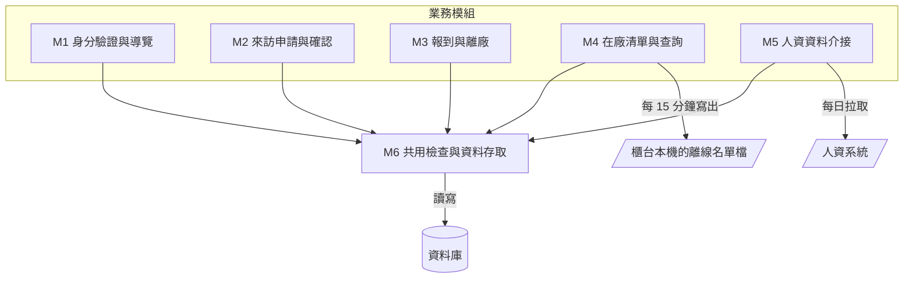
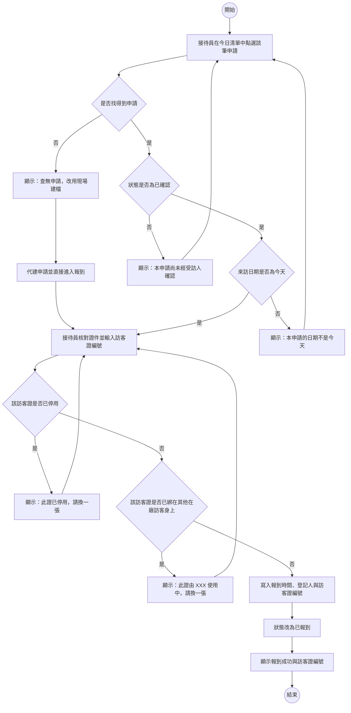
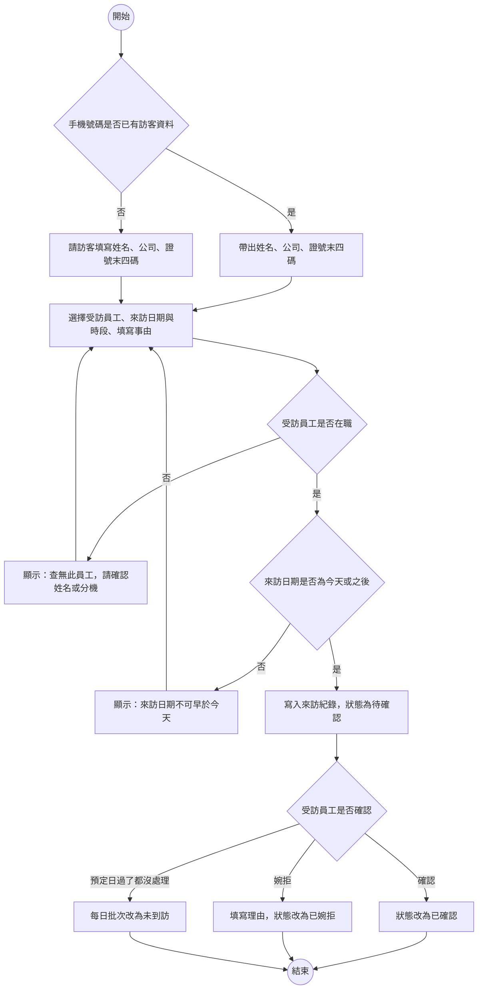
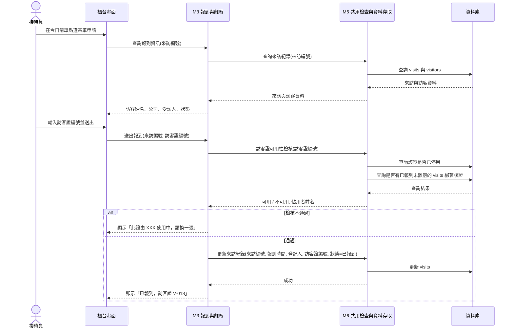
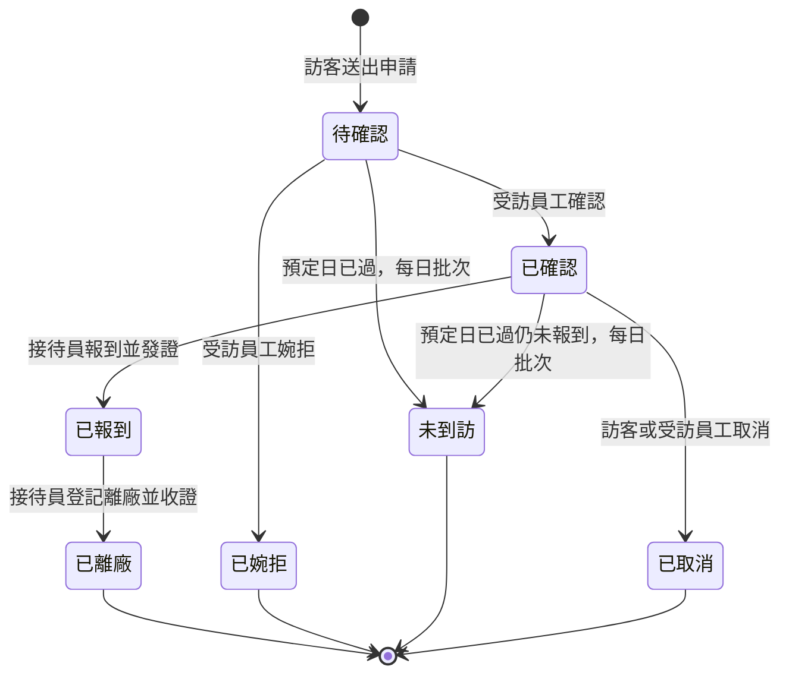
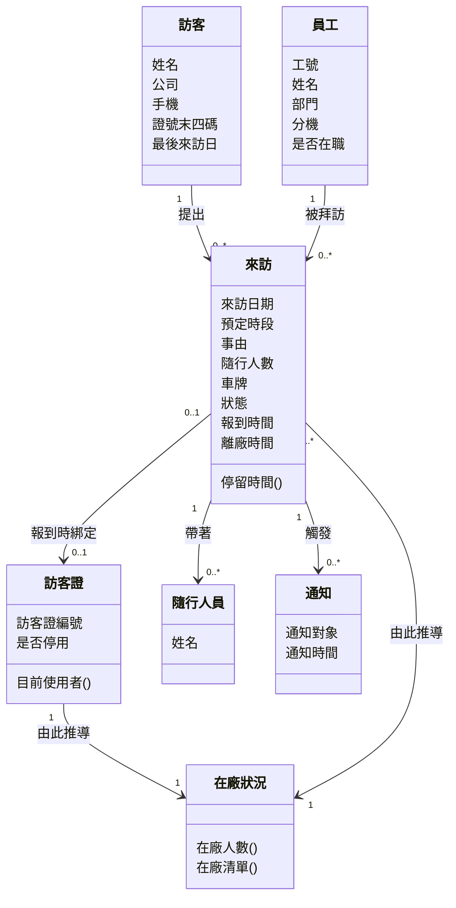
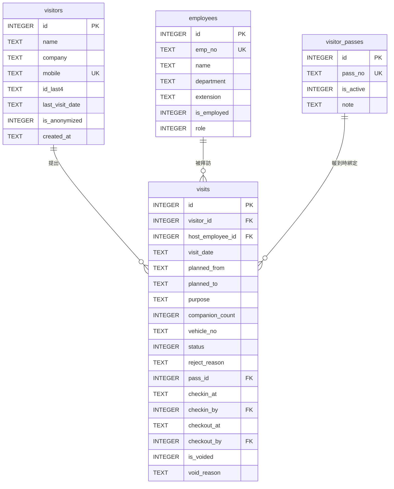
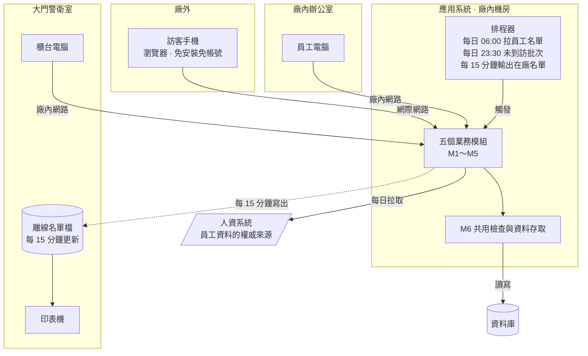

# 系統設計報告：工廠訪客進出登記系統

> 這是一份寫好的期末書面報告，內容依[「報告內容」](../00-Course-Introduction/Report-Contents.md)〈二、期末小組報告〉的八項排列，最後附上必做的分工紀錄。每一項該有哪些欄位、為什麼要這樣寫、方法出自哪一章，見[「系統設計範例報告說明」](Design-Phase-Deliverables.md)；這份只放成品。
>
> **示範的題目是上課帶著大家做的「工廠訪客進出登記系統」，刻意不在[五份期末題目](../02-Project-Topics/README.md)之中。** 結構與寫法可以照抄，內容抄不到。
>
> **篇幅不是標準——這裡每一項都收得很緊。** 你的報告該寫多少就寫多少。

---

## 報告基本資料

| 項目 | 內容 |
|---|---|
| 課程 | 系統分析與設計（IE226）115-1 |
| 報告階段 | 期末小組報告（系統設計） |
| 設計題目 | 工廠訪客進出登記系統 |
| 組別 | 第 3 組 |
| 組員 | 小明（1130001）、阿花（1130002）、阿宏（1130003）、阿凱（1130005，第 11 週轉入；小美於同期轉出） |
| 書面繳交日 | 2026/12/18 |
| 口頭報告日 | 2026/12/23 |

各成員負責的章節與圖表、組員異動的接手情形，見文末的〈附錄：分工紀錄〉。

**本報告用到的名詞**：**訪客**是所有非本廠員工而需要進入廠區的人，包含供應商、客戶與外部維修人員；**受訪人**是訪客要找的本廠員工；**來訪申請**是一次預定來訪的紀錄；**報到**是訪客抵達大門、由接待員確認身分並發給訪客證的動作；**訪客證**是一張掛在身上的實體識別證，一張證同一時間只能給一位訪客；**去識別化**是把個人資料改成無法辨識特定個人的形式，但保留統計用的欄位。

---

## 1. 設計基礎與需求摘要

### 1.1 問題背景

這一節說明現在的作業方式有什麼問題，以及本設計打算怎麼回應。

目前的做法是大門警衛室放一本登記簿。訪客到了填寫姓名、公司、身分證字號、電話、要找誰，警衛打電話進廠找人，確認之後發一張訪客證，離開時把證交回、在同一列補上離開時間。

| 編號 | 問題 | 本設計如何回應 |
|---|---|---|
| P-01 | 訪客到了才臨時找受訪人，找不到人時訪客在門口等十幾分鐘 | 改成事前提出來訪申請並由受訪人確認，到廠時只做報到 |
| P-02 | 登記簿攤開在櫃台，前一位訪客的姓名、公司與身分證號，下一位看得到 | 個資輸入一次即存入系統，畫面不顯示完整證號，只留末四碼 |
| P-03 | 訪客證發出去沒收回，月底盤點少三張，查不出是誰帶走的 | 發證與收證都對應到一筆來訪紀錄，未收回的查得出對象 |
| P-04 | 消防演練時說不出廠內現在有哪些訪客 | 在廠訪客清單即時可查，並固定輸出一份離線名單到櫃台電腦 |

**P-04 是本設計最主要的價值。** 前三項是效率與個資問題，第四項是安全問題——真的失火的時候，沒有人知道廠裡還有幾個外人。

### 1.2 主要角色

| 角色 | 使用目標 | 權限範圍 | 最在意 |
|---|---|---|---|
| 訪客 | 事前提出來訪申請、到廠後快速進去 | 只能填寫與查看自己的申請 | **不要填太多欄位。** 用自己的手機、站在廠外、第一次用、沒有人教 |
| 接待員 | 讓訪客快速進場，並掌握廠內有誰 | 報到、發證、離廠、代建申請、查全部紀錄、維護訪客證 | **要快。** 早上八點五十，五到八位訪客同時到 |
| 受訪員工 | 知道有人要來找我、確認或婉拒 | 確認自己被指定的申請、查自己的來訪紀錄 | 不要多一件麻煩事；訪客到了要有人通知我 |

「最在意」那一欄各自決定了一項設計：訪客那條使申請畫面只留五個必填欄位（NFR-01）；接待員那條使報到成為單一按鈕的動作；受訪員工那條使確認可以在清單頁一鍵完成，不必進入明細。

### 1.3 核心流程

| 編號 | 流程 | 主要角色 | 起點 | 終點 |
|---|---|---|---|---|
| PR-01 | 來訪申請 | 訪客（或員工代填） | 填寫申請表單並送出 | 建立來訪紀錄，狀態為待確認 |
| PR-02 | 申請確認 | 受訪員工 | 在待確認清單點選確認或婉拒 | 狀態改為已確認或已婉拒 |
| PR-03 | 報到與發證 | 接待員 | 訪客抵達大門櫃台 | 狀態改為已報到，訪客證綁定本次來訪 |
| PR-04 | 離廠與收證 | 接待員 | 訪客交回訪客證 | 狀態改為已離廠，訪客證釋出 |
| PR-05 | 未到訪結案 | 系統 | 每日 23:30 批次 | 預定日已過仍未報到的申請標記為未到訪 |
| PR-06 | 員工主檔同步 | 系統 | 每日 06:00 批次 | 由人資系統更新員工名單 |

### 1.4 關鍵需求

#### 功能需求

| 編號 | 功能需求 | 觸發角色 |
|---|---|---|
| FR-01 | 訪客可填寫來訪申請，含來訪日期、預定時段、事由、受訪員工、隨行人數與車牌 | 訪客 |
| FR-02 | 系統以手機號碼辨識回頭訪客，帶出既有的姓名、公司與證號末四碼 | 訪客 |
| FR-03 | 受訪員工可確認或婉拒指定給自己的申請，婉拒須填理由 | 受訪員工 |
| FR-04 | 接待員可代替臨時來訪的訪客建立申請並直接報到 | 接待員 |
| FR-05 | 報到時須指定一張訪客證；**已綁定其他在廠訪客的證不得再發** | 接待員 |
| FR-06 | 離廠登記時解除訪客證綁定，並記錄離廠時間與登記人 | 接待員 |
| FR-07 | 系統可隨時列出目前在廠的訪客清單 | 接待員、受訪員工 |
| FR-08 | 預定來訪日結束仍未報到的申請，由系統標記為未到訪 | 系統 |
| FR-09 | 接待員可維護訪客證清單，遺失的證停用後不得再發 | 接待員 |
| FR-10 | 可依日期區間、訪客、受訪單位查詢歷史來訪紀錄 | 接待員、受訪員工 |

#### 非功能需求

| 編號 | 非功能需求 | 對設計的決定 |
|---|---|---|
| NFR-01 | 訪客的申請表單在手機上單手可完成，必填欄位不超過五個 | 其餘欄位由回頭訪客的既有資料帶出或設為選填 |
| NFR-02 | 訪客證的可用性檢核與所有權限檢核都要在伺服器端做 | 畫面上的限制只是提示，後端一律重驗一次 |
| NFR-03 | 訪客個人資料自最後一次來訪起保存兩年，逾期由系統去識別化 | 訪客主檔要有最後來訪日與去識別化旗標；來訪紀錄本身不刪除 |
| NFR-04 | 在廠訪客清單必須在系統或網路中斷時仍取得得到 | 每 15 分鐘自動輸出一份名單檔案到櫃台電腦本機，可直接列印 |
| NFR-05 | 來訪紀錄不得刪除，更正一律以作廢加重登留下痕跡 | 來訪紀錄表要有作廢旗標、作廢人、作廢時間與原因四欄 |

NFR-03 與 NFR-04 是影響最深的兩條，它們各自否決了一個看起來很自然的做法：前者否決「訪客資料就一直留著」，因為個人資料的蒐集有目的與期限，留著不用不是免費的；後者否決「在廠清單在系統上看得到就好」，因為需要那份清單的時刻，正好是系統可能不能用的時刻。

### 1.5 系統邊界與設計範圍

| 範圍內 | 範圍外 | 界線 |
|---|---|---|
| 來訪申請、確認、報到、離廠、查詢 | 大門閘門與門禁刷卡的控制 | 凡是要接硬體訊號的一律界外；訪客證是實體卡片，靠人核對 |
| 訪客證的發放與回收登記 | 訪客證的製卡、補發與費用 | 卡片實體由總務管理，本系統只管它現在綁在誰身上 |
| 由人資系統匯入員工名單 | 員工資料的維護 | 員工資料的權威來源在人資系統 |
| 訪客的姓名、公司、聯絡方式與證號末四碼 | 完整身分證號的儲存 | 見〈4.6〉的個資最小化決定 |
| 訪客本人 | 隨行人員的個別資料 | 本次只記隨行人數，代價見〈1.6〉與 R-02 |

本系統與人資系統交換資料，介接內容見〈5.4〉。

### 1.6 需求取捨

#### 延後處理

| 需求 | 延後理由 | 延後的代價 | 何時該做 |
|---|---|---|---|
| 隨行人員各自建檔 | 一次來訪最多七、八人，逐一輸入會讓報到時間翻倍，與 NFR-01 衝突 | **疏散名單會少算人。** 系統說廠內有 3 位訪客，實際可能是 9 位，見 R-02 | 一次來訪超過三人成為常態時 |
| 簡訊或電子郵件通知受訪員工 | 需要外部通知服務與費用，本次以系統內的待確認清單代替 | 員工不會主動登入看清單，確認會拖 | 廠內導入通訊軟體或郵件整合之後 |
| 訪客自助報到機 | 要多一台設備與另一套畫面，本次時程排不下 | 早上尖峰全部集中在一個櫃台，見 R-06 | 每日訪客量翻倍時 |
| 車輛與停車位管理 | 目前只記車牌供警衛放行，停車位不足不是靠系統解決的 | 車牌記了但沒有用途 | 廠區實施停車位管制時 |

#### 明確不做

| 項目 | 理由 |
|---|---|
| 與門禁閘門連動（刷訪客證開門） | 需要門禁廠商配合開放介面並改動既有設備，成本與協調時間都遠超本次範圍。**這條的代價很具體：訪客從人走的大門離開時，系統攔不住他，見 R-01** |
| 人臉辨識報到 | 蒐集生物特徵的目的與必要性說不通，個資風險遠高於它省下的十秒鐘 |

---

## 2. 功能與模組設計

### 2.1 模組清單

這一節把需求整理成六個模組，並說明為什麼這樣切。

| 編號 | 模組 | 類型 | 目的 | 對應需求 |
|---|---|---|---|---|
| M1 | 身分驗證與導覽 | 業務 | 訪客以手機號碼加驗證碼查看自己的申請；接待員與員工以帳號登入 | FR-02 |
| M2 | 來訪申請與確認 | 業務 | 建立、修改、確認、婉拒、取消申請，以及每日的未到訪結案 | FR-01、FR-03、FR-04、FR-08 |
| M3 | 報到與離廠 | 業務 | 報到、發證、離廠、收證 | FR-05、FR-06 |
| M4 | 在廠清單與查詢 | 業務 | 在廠訪客清單、歷史查詢、離線名單輸出 | FR-07、FR-10、NFR-04 |
| M5 | 人資資料介接 | 業務 | 每日匯入員工主檔 | PR-06 |
| M6 | 共用檢查與資料存取 | 共用 | 權限檢查、訪客證可用性檢核、在廠狀態判定、個資保存期限判定，以及所有資料表的讀寫 | NFR-02、NFR-03 |

**M6 在畫面上沒有任何入口**，它只被其他模組呼叫。三項切分決定：

| 決定 | 理由 |
|---|---|
| 訪客證的可用性檢核放在 M6，不放在 M3 | 報到（M3）與換發訪客證（M4 的例外處理）是兩條會用到同一條規則的路徑，規則只能有一份 |
| 資料庫讀寫全部收在 M6 | 資料庫語法只出現在一個模組，換資料庫時只改這裡 |
| 人資介接獨立成 M5，不併進 M2 | M2 的規則是「人怎麼申請來訪」，M5 的規則是「兩套系統怎麼對名單」，兩者變動的原因不一樣 |

### 2.2 模組規格

#### M2 來訪申請與確認

| 欄位 | 內容 |
|---|---|
| 模組編號 | M2 |
| 目的 | 讓訪客提出來訪申請、讓受訪員工確認或婉拒，並在預定日過後收尾未到訪的申請 |
| 使用角色 | 訪客、受訪員工、接待員 |
| 主要輸入 | 申請：手機號碼、姓名、公司、證號末四碼、來訪日期與時段、事由、受訪員工、隨行人數、車牌<br>確認：來訪編號、確認或婉拒、婉拒理由 |
| 主要處理 | 1. 以手機號碼查詢訪客主檔，找到就帶出資料、找不到就新建 2. 檢查受訪員工存在且在職 3. 檢查來訪日期不早於今天 4. 寫入來訪紀錄，狀態為待確認 5. 確認時檢查操作者就是被指定的受訪員工或接待員 6. 每日 23:30 掃出預定日已過且狀態仍為待確認或已確認的紀錄，改為未到訪 |
| 主要輸出 | 訪客端顯示申請編號與目前狀態；員工端的待確認清單 |
| 相依模組 | 呼叫 M6 |
| 對應需求 | FR-01、FR-03、FR-04、FR-08 |

第 6 步的批次是本模組唯一不由人觸發的處理。它存在的理由見〈4.3〉：未到訪要存成一個狀態，不能每次查詢時算。

#### M3 報到與離廠

| 欄位 | 內容 |
|---|---|
| 模組編號 | M3 |
| 目的 | 讓接待員在三十秒內完成報到與發證，並在訪客離開時收回訪客證 |
| 使用角色 | 接待員 |
| 主要輸入 | 報到：來訪編號、訪客證編號<br>離廠：來訪編號 |
| 主要處理 | 1. 檢查操作者為接待員 2. 檢查來訪紀錄狀態為已確認 3. 檢查來訪日期就是今天 4. 請 M6 檢核這張訪客證目前沒有綁在任何在廠訪客身上，且未停用 5. 寫入報到時間、登記人與訪客證編號，狀態改為已報到 6. 離廠時寫入離廠時間與登記人，狀態改為已離廠，訪客證因而釋出 |
| 主要輸出 | 成功時顯示「已報到，訪客證 V-018」；失敗時保留畫面並顯示原因 |
| 相依模組 | 呼叫 M6 |
| 對應需求 | FR-05、FR-06、NFR-02 |

檢查的順序是刻意排的：狀態與日期的檢查排在訪客證之前，因為接待員通常先點錯人再拿證，先擋掉便宜的錯誤，他才不會白拿一張證。

第 6 步值得注意：**離廠登記不需要另外把訪客證改回「可用」**。一張證能不能發，是由「有沒有一筆已報到未離廠的紀錄綁著它」決定的，寫入離廠時間之後它自然就釋出了。這是〈4.3〉那條判準的直接結果。

#### M6 共用檢查與資料存取

| 欄位 | 內容 |
|---|---|
| 模組編號 | M6 |
| 目的 | 集中放「不只一個模組會用到、而且規則改了要一次改完」的邏輯與資料存取 |
| 使用角色 | 無直接使用者，只被其他模組呼叫 |
| 主要輸入 | 各模組傳入的來訪編號、訪客證編號、身分與資料內容 |
| 主要處理 | 1. 權限檢查 2. 訪客證可用性檢核 3. 在廠狀態判定（已報到且未離廠） 4. 個資保存期限判定與去識別化 5. 各資料表的查詢、新增與更新 |
| 主要輸出 | 判定類回傳成立與否；查詢類回傳資料或新編號 |
| 相依模組 | 直接讀寫資料庫 |
| 對應需求 | NFR-02、NFR-03 |

第 4 項是唯一定時執行、而且會改動既有資料的處理：每月一次掃出最後來訪日超過兩年的訪客，把姓名、手機與證號末四碼清空並標記為已去識別化，來訪紀錄本身不動。

### 2.3 模組相依關係



五個業務模組彼此不互相呼叫，全部透過 M6 發生關係。圖上有兩條往系統外的線：M5 去人資系統拉員工名單，M4 把在廠名單寫到櫃台電腦的本機檔案。**第二條是 NFR-04 在架構圖上留下的痕跡**——它不是一個功能，是一條為了「系統掛掉時還有東西可看」而存在的線。

### 2.4 CRUD 矩陣

| 模組 | `visits` | `visitors` | `visitor_passes` | `employees` |
|---|:---:|:---:|:---:|:---:|
| M1 身分驗證與導覽 | R | R | — | R |
| M2 來訪申請與確認 | C R U | C R U | — | R |
| M3 報到與離廠 | R U | R | R | R |
| M4 在廠清單與查詢 | R | R | R | R |
| M5 人資資料介接 | — | — | — | C R U |
| M6 訪客證維護（由接待員經 M4 進入） | — | — | C R U | — |

C 建立、R 讀取、U 更新、D 刪除。

**整張矩陣沒有任何一個 D。** 來訪紀錄依 NFR-05 不能實體刪除；訪客資料依 NFR-03 是去識別化而不是刪除；訪客證與員工用停用旗標取代刪除。

兩格需要說明：

| 位置 | 說明 |
|---|---|
| M3 對 `visitor_passes` 只有 R | 報到與離廠都不改訪客證這張表。**綁定關係存在 `visits` 上，不存在證上**，理由見〈4.3〉 |
| M2 對 `visitors` 有 C 與 U | 新訪客第一次申請時建檔，回頭訪客更新公司與聯絡方式。這是本系統唯一會新增訪客的路徑 |

---

## 3. 主要流程與互動設計

### 3.1 活動圖：報到與發證（PR-03）

> **主要角色**：接待員
> **觸發事件**：訪客抵達大門櫃台
> **前置條件**：接待員已登入；當日有該訪客的已確認申請
> **例外情況**：查無申請、申請未經確認、日期不是今天、訪客證已被別人用、訪客證已停用
> **完成後狀態**：來訪紀錄寫入報到時間與訪客證編號，狀態改為已報到



三項設計決定：三個申請檢查（D1～D3）排在拿訪客證之前，避免接待員白拿一張證；D1 的「否」不是死路，而是導向現場建檔，因為臨時來訪在現場是常態；D5 的錯誤訊息帶出目前是誰在用那張證，接待員才知道要去追誰。

### 3.2 活動圖：來訪申請與確認（PR-01、PR-02）

> **主要角色**：訪客（申請）、受訪員工（確認）
> **觸發事件**：訪客在手機上填寫來訪申請
> **前置條件**：無，訪客不需要帳號
> **完成後狀態**：來訪紀錄狀態為已確認或已婉拒

這條流程跨三個角色，用泳道表呈現誰做什麼：

| 步驟 | 訪客 | 系統 | 受訪員工 |
|:--:|---|---|---|
| 1 | 輸入手機號碼 | | |
| 2 | | 以手機號碼查訪客主檔，找到就帶出姓名、公司與證號末四碼 | |
| 3 | 補齊或修改資料，選擇受訪員工與來訪日期時段，送出 | | |
| 4 | | 檢查受訪員工在職、日期不早於今天，寫入來訪紀錄（待確認） | |
| 5 | | 在該員工的待確認清單顯示這筆申請 | |
| 6 | | | 檢視申請內容 |
| 7 | | | 確認或婉拒，婉拒須填理由 |
| 8 | | 狀態改為已確認或已婉拒 | |
| 9 | 在申請查詢頁看到結果 | | |



A7 那條分支是這張圖最容易被漏掉的一條：**受訪員工不做任何動作，也是一種結局。** 沒有這條路徑，待確認的申請會永遠累積在清單上。

### 3.3 循序圖：報到與發證（PR-03）

這張圖的生命線是模組，不是「系統」這個黑箱，看得出一次報到在系統內部走過哪幾個模組。



訪客證的可用性在圖上被拆成兩次查詢：一次問這張證有沒有停用，一次問它有沒有被佔用。兩者的資料在不同的表裡——**前者在 `visitor_passes`，後者在 `visits`**，這件事在〈4.3〉會說明理由。

### 3.4 狀態機圖：來訪紀錄的狀態



| 狀態 | `status` 值 | 可確認 | 可報到 | 可離廠 | 算在廠 |
|---|:--:|:--:|:--:|:--:|:--:|
| 待確認 | 10 | 是 | 否 | 否 | 否 |
| 已確認 | 20 | 否 | 是 | 否 | 否 |
| 已報到 | 30 | 否 | 否 | 是 | **是** |
| 已離廠 | 40 | 否 | 否 | 否 | 否 |
| 已婉拒 | 80 | 否 | 否 | 否 | 否 |
| 未到訪 | 85 | 否 | 否 | 否 | 否 |
| 已取消 | 90 | 否 | 否 | 否 | 否 |

三項要點：

- **這張圖沒有任何一條往回走的轉移。** 訪客一旦報到就不能退回已確認，因為報到這件事真的發生了。要更正只能作廢整筆重登（NFR-05）。
- **「已報到」是唯一算在廠的狀態**，最右邊那一欄就是〈4.3〉「在廠」推導規則的完整定義。這一欄要跟資料設計對得起來。
- **有三個終態代表「沒有來成」**：已婉拒、未到訪、已取消。三者要分開，因為管理上想知道的是不同的事——婉拒是受訪人不同意，未到訪是訪客沒出現，取消是事前就說了。合成一個值會讓統計失去意義。

---

## 4. 資料設計

### 4.1 概念類別圖

這一節先問「這個領域有哪些概念」，再決定哪些要存進資料庫。



**括號結尾的屬性是算出來的，不是存下來的**，例如「停留時間()」、訪客證的「目前使用者()」與在廠狀況的兩個屬性。

### 4.2 從概念到資料表的落地決定

| 概念 | 是否成為資料表 | 落到哪裡 |
|---|---|---|
| 訪客 | 是 | `visitors` |
| 來訪 | 是 | `visits` |
| 訪客證 | 是 | `visitor_passes` |
| 員工 | 是 | `employees`，由人資系統匯入 |
| **在廠狀況** | **否** | 兩個屬性都是算出來的，由來訪紀錄的狀態與時間推導，見〈4.3〉 |
| **停留時間** | **否** | 由同一筆來訪的報到與離廠時間相減 |
| **訪客證的目前使用者** | **否** | 由來訪紀錄反查，不存在訪客證那張表上，見〈4.3〉 |
| **隨行人員** | **否** | 本次只記人數，不逐一建檔。理由與代價見〈1.6〉與 R-02 |
| **通知** | **否** | 本次不做主動通知，改以待確認清單代替，見〈1.6〉 |

「隨行人員」與「通知」畫在圖上卻不落地，是刻意留下的紀錄：本設計知道它們存在，也知道現在不做的代價是什麼，不是漏掉了。

### 4.3 推導值該存還是該算

本設計有三個推導值需要決定，判準統一如下：

> **推導值要不要存下來，看它的計算依據會不會隨時間改變。依據不會變就用算的，依據會變就存下來。**

| 推導值 | 計算依據 | 依據會不會變 | 決定 | 理由 |
|---|---|:--:|:--:|---|
| 某位訪客是否在廠 | 該筆來訪紀錄的狀態是否為已報到 | 不會。報到與離廠時間寫進去就不再改 | **用算的** | 任何時候重算都得到同一個答案。存成欄位反而多一份要維護，而漏維護的錯誤沒有人會發現 |
| 某張訪客證目前能不能發 | 有沒有一筆已報到未離廠的來訪紀錄綁著它 | 不會，同上 | **用算的** | 存在訪客證表上就要在報到與離廠時兩邊都改，漏改一次那張證就永遠發不出去 |
| 一筆申請是否未到訪 | 預定來訪日與**今天**比較 | **會。今天每天都不一樣** | **存下來** | 若用算的，同一筆紀錄今天算出來是未到訪、明天還是未到訪，但「什麼時候判定的、由誰判定的」永遠留不下來。而且訪客真的隔天補來的話，算出來的結果會自己翻轉 |

第一、二列與第三列的結論相反，但用的是同一條判準。差別在於前兩者的依據是已經固定的事實，第三者的依據裡有一個會走動的東西——今天。

### 4.4 實體關聯圖



兩項拆表決定：

| 決定 | 理由 | 代價 |
|---|---|---|
| 訪客與來訪拆成兩張表 | 同一位供應商業務一年來十幾次，姓名、公司、手機不必重複輸入十幾次，也才有「回頭訪客」這件事 | 訪客資料改了，過去的來訪紀錄會跟著顯示新的公司名。這是刻意接受的，見〈4.6〉 |
| 訪客證獨立一張表，綁定關係放在 `visits` | 訪客證是有限的實體物品，需要一張清單管理停用與備註；但「現在誰在用」是來訪的屬性，不是證的屬性 | 要知道一張證現在能不能發，得反查來訪紀錄，比讀一個欄位麻煩 |

第二條的代價是〈4.3〉那條判準換來的：多一次查詢，換到「兩張表永遠不會對不起來」。

### 4.5 資料表與鍵值

| 資料表 | 用途 | 主鍵 | 對外參照 | 其他約束 |
|---|---|---|---|---|
| `visitors` | 訪客主檔 | `id` | 無 | `mobile` 唯一；已去識別化的資料列不得再被 `mobile` 查到 |
| `visits` | 來訪紀錄 | `id` | `visitor_id`、`host_employee_id`、`pass_id`、`checkin_by`、`checkout_by` | `status` 限七個值；`checkin_at` 有值時 `pass_id` 不可空；`checkout_at` 須晚於 `checkin_at` |
| `visitor_passes` | 訪客證主檔 | `id` | 無 | `pass_no` 唯一；停用改 `is_active`，不刪除 |
| `employees` | 員工名單 | `id` | 無 | `emp_no` 唯一；由人資系統匯入，本系統不新增 |

**「`checkin_at` 有值時 `pass_id` 不可空」這條約束是本設計的核心規則之一**：報到與發證是同一個動作，不能只做一半。允許報到卻不發證，在廠訪客身上就沒有識別證，這正是這套系統要消滅的狀況。

外鍵在資料庫層宣告，刪除行為設為禁止。理由是來訪紀錄要能追溯到人、證、時間，必須保證每一筆都指得到真實存在的訪客、員工與訪客證。

### 4.6 資料字典：`visitors`

| 欄位名稱 | 中文名稱 | 型別 | 必填 | 值域／格式 | 資料來源 |
|---|---|---|---|---|---|
| `id` | 訪客編號 | INTEGER | 是 | 主鍵，系統流水號 | 系統產生 |
| `name` | 姓名 | TEXT | 是 | 去識別化後為空 | 訪客輸入 |
| `company` | 公司 | TEXT | 是 | 個人身分來訪時填「個人」 | 訪客輸入 |
| `mobile` | 手機 | TEXT | 是 | 唯一；去識別化後為空 | 訪客輸入 |
| `id_last4` | 證號末四碼 | TEXT | 是 | 四位數字或英數；**完整證號不儲存** | 訪客輸入 |
| `last_visit_date` | 最後來訪日 | TEXT | 否 | `YYYY-MM-DD` | 報到時由系統更新 |
| `is_anonymized` | 是否已去識別化 | INTEGER | 是 | `1` 已去識別化、`0` 未；預設 `0` | 保存期限批次更新 |
| `created_at` | 建檔時間 | TEXT | 是 | `YYYY-MM-DD HH:MM:SS` | 系統產生 |

`id_last4` 這一欄是本設計最主要的個資決定：**現場核對身分需要一個可以比對的東西，但不需要完整的身分證號。** 末四碼足以在櫃台確認「站在面前的人就是申請的人」，而萬一資料外洩，它的傷害遠低於完整證號。這條決定的代價是無法用證號唯一識別一個人，所以改用手機號碼當作辨識鍵。

`last_visit_date` 是為 NFR-03 而存在的：保存期限從最後一次來訪起算，而不是從建檔起算，否則常來的訪客會在還在往來的期間被去識別化。

### 4.7 資料字典：`visits`

| 欄位名稱 | 中文名稱 | 型別 | 必填 | 值域／格式 | 資料來源 |
|---|---|---|---|---|---|
| `id` | 來訪編號 | INTEGER | 是 | 主鍵，系統流水號 | 系統產生 |
| `visitor_id` | 訪客編號 | INTEGER | 是 | 對應 `visitors.id` | 由手機號碼帶入或新建 |
| `host_employee_id` | 受訪員工編號 | INTEGER | 是 | 對應 `employees.id`，須為在職 | 訪客選擇 |
| `visit_date` | 來訪日期 | TEXT | 是 | `YYYY-MM-DD`；不早於申請當天 | 訪客輸入 |
| `planned_from` | 預定起始時間 | TEXT | 是 | `HH:MM` | 訪客輸入 |
| `planned_to` | 預定結束時間 | TEXT | 是 | `HH:MM`；須晚於 `planned_from` | 訪客輸入 |
| `purpose` | 來訪事由 | TEXT | 是 | 不超過 100 字 | 訪客輸入 |
| `companion_count` | 隨行人數 | INTEGER | 是 | 非負整數；預設 `0` | 訪客輸入 |
| `vehicle_no` | 車牌 | TEXT | 否 | 開車進廠才填 | 訪客輸入 |
| `status` | 狀態 | INTEGER | 是 | `10`／`20`／`30`／`40`／`80`／`85`／`90`，對照見〈3.4〉 | 系統依事件轉移 |
| `reject_reason` | 婉拒理由 | TEXT | 否 | 婉拒時必填 | 受訪員工輸入 |
| `pass_id` | 訪客證編號 | INTEGER | 否 | 對應 `visitor_passes.id`；報到時必填 | 接待員輸入 |
| `checkin_at` | 報到時間 | TEXT | 否 | `YYYY-MM-DD HH:MM:SS` | 系統產生 |
| `checkin_by` | 報到登記人 | INTEGER | 否 | 對應 `employees.id` | 由登入身分帶入 |
| `checkout_at` | 離廠時間 | TEXT | 否 | 同上；須晚於 `checkin_at` | 系統產生 |
| `checkout_by` | 離廠登記人 | INTEGER | 否 | 對應 `employees.id` | 由登入身分帶入 |
| `is_voided` | 是否已作廢 | INTEGER | 是 | `1` 已作廢、`0` 有效；預設 `0` | 接待員執行作廢時改 |
| `void_reason` | 作廢原因 | TEXT | 否 | 作廢時必填 | 接待員輸入 |

NFR-01 要求訪客的必填欄位不超過五個，所以這張表多數欄位不由訪客輸入：

| 來源 | 欄位 | 怎麼取得 |
|---|---|---|
| 訪客主檔 | `visitor_id` 連帶的姓名、公司、證號末四碼 | 以手機號碼查到回頭訪客就整組帶出 |
| 登入身分 | `checkin_by`、`checkout_by` | 接待員登入後才能操作，身分已經知道 |
| 系統產生 | `checkin_at`、`checkout_at`、`status` | 由動作發生的時間與事件決定 |

訪客實際要填的五個必填欄位是：手機、受訪員工、來訪日期、預定時段、事由。第一次來的訪客多填三個（姓名、公司、證號末四碼），這是無法再省的下限。

### 4.8 資料字典：`visitor_passes`

| 欄位名稱 | 中文名稱 | 型別 | 必填 | 值域／格式 |
|---|---|---|---|---|
| `id` | 訪客證編號 | INTEGER | 是 | 主鍵，系統流水號 |
| `pass_no` | 訪客證號碼 | TEXT | 是 | 唯一；卡片上印的號碼，例如 `V-018` |
| `is_active` | 是否可用 | INTEGER | 是 | `1` 可用、`0` 已停用；預設 `1` |
| `note` | 備註 | TEXT | 否 | 停用時記原因，例如「2026-11-04 遺失」 |

**這張表沒有「目前使用者」或「是否在外面」的欄位**，理由見〈4.3〉。它只回答「這張證還在不在服役」，不回答「它現在在誰身上」。

### 4.9 推導欄位清單

下列數字會出現在畫面上，但不存在任何資料表裡：

| 推導值 | 出現在哪些畫面 | 算式 | 資料來源 |
|---|---|---|---|
| 在廠訪客清單 | UI-03、離線名單檔 | `visits` 中 `status = 30` 且 `is_voided = 0` 的紀錄 | `visits` |
| 在廠人數 | UI-02、UI-03 | 上列的筆數 ＋ 各筆的 `companion_count` 合計 | 同上 |
| 停留時間 | UI-03、UI-04 | 目前時間 − `checkin_at`；已離廠者為 `checkout_at` − `checkin_at` | `visits` 單筆 |
| 逾時未離廠 | UI-03 | `checkin_at` 當日的 `planned_to` 已過，且仍為已報到 | `visits` 單筆 |
| 訪客證是否可發 | UI-02 | `is_active = 1` 且沒有 `status = 30` 的紀錄綁著它 | 兩表 |

**這五個值沒有一個存在資料表裡，所以第 8 項的一致性檢查要靠這張表才對得起來。**

「在廠人數」那一列要特別注意：它把隨行人數加進去了，但隨行的人沒有姓名。**所以在廠人數是準的，在廠清單卻列不全**——這個落差是〈1.6〉那個取捨造成的，寫在 R-02。

### 4.10 畫面欄位與資料表對照

| 畫面 | 畫面欄位 | 存到哪裡 | 誰產生 |
|---|---|---|---|
| UI-01 來訪申請 | 手機 | `visitors.mobile` | 訪客輸入 |
| | 姓名、公司、證號末四碼 | `visitors` 的三個欄位 | 新訪客輸入，回頭訪客帶出 |
| | 受訪員工 | `visits.host_employee_id` | 訪客從名單選擇 |
| | 來訪日期、預定時段、事由 | `visit_date`、`planned_from`、`planned_to`、`purpose` | 訪客輸入 |
| | 隨行人數、車牌 | `companion_count`、`vehicle_no` | 訪客輸入，可留白 |
| UI-02 今日來訪與報到 | 訪客姓名、公司、受訪人、預定時段 | 由 `visits`、`visitors`、`employees` 帶出（唯讀） | 帶出 |
| | 訪客證編號 | `visits.pass_id` | 接待員輸入 |
| | 該證可不可發 | **不存**，見〈4.9〉 | 推導 |
| | 目前在廠人數 | **不存**，見〈4.9〉 | 推導 |
| UI-03 在廠訪客與離廠 | 在廠清單、停留時間、逾時標記 | **不存**，見〈4.9〉 | 推導 |
| | 離廠時間、登記人 | `checkout_at`、`checkout_by` | 系統與身分帶入 |
| UI-04 來訪紀錄查詢 | 各欄位 | `visits` 與兩張關聯表 | — |
| | 已作廢的紀錄 | 由 `is_voided` 顯示為刪除線並附作廢原因，**不從畫面上消失** | NFR-05 |
| | 已去識別化的訪客 | 姓名與手機欄顯示「已去識別化」，公司仍顯示 | NFR-03 |

最後兩列是同一個道理的兩種表現：**資料不再需要，不代表紀錄要消失。** 作廢的來訪仍然看得到，去識別化的訪客仍然看得到那一次來訪發生過——刪掉的只有辨識得出特定個人的欄位。

---

## 5. 系統環境、架構與資料交換設計

### 5.1 整體架構



| 面向 | 本設計 |
|---|---|
| 有哪些部分 | 訪客手機、櫃台電腦與印表機、員工電腦、應用系統、資料庫、排程器、人資系統 |
| 各部分在哪裡 | 應用系統與資料庫在廠內機房；櫃台在大門；訪客在廠外 |
| 彼此怎麼連 | 訪客走網際網路，只連得到申請與查詢兩個頁面；櫃台與辦公室走廠內網路 |
| 誰主動 | 使用者操作由用戶端發起；三項批次由排程器發起 |
| 業務規則放在哪 | 全部在應用系統。櫃台電腦只負責顯示與收集輸入 |

**訪客的手機在廠外、走的是網際網路，這件事在架構圖上要標出來。** 它是本設計唯一從外部網路進來的入口，因此訪客端能連到的頁面必須明確限制在兩個，而且不能帶任何員工名單以外的內部資料。

### 5.2 非功能需求對架構的決定

| 需求 | 架構上的結果 |
|---|---|
| NFR-01 訪客必填不超過五個欄位 | 需要以手機號碼查回頭訪客，因此 `visitors.mobile` 成為對外的查詢鍵，也因此必須限制查詢頻率避免被拿來試探他人資料 |
| NFR-02 檢核在伺服器端 | 櫃台畫面不做任何判斷；就算有人繞過畫面直接送資料，一樣會被 M6 擋下 |
| NFR-03 個資保存兩年 | 需要一個每月執行的批次，以及訪客主檔上的兩個欄位（最後來訪日、去識別化旗標） |
| NFR-04 在廠清單要能離線取得 | **多出一條把資料寫到櫃台本機的路徑**，這是架構層級的冗餘，不是程式裡的錯誤處理 |
| NFR-05 不得刪除 | 來訪紀錄用作廢旗標，訪客證與員工用停用旗標 |

最後兩列各值得單獨看。NFR-04 那條線的用意是：**需要在廠名單的時刻，正好是系統可能不能用的時刻**——停電、火災、網路中斷。把名單放在櫃台電腦的本機檔案，等於承認「應用系統本身也可能是災難的一部分」。代價是那份名單最多會舊 15 分鐘，這個誤差寫進了 R-05。

### 5.3 使用環境與部署

| 面向 | 本設計 |
|---|---|
| 使用裝置 | 訪客：自己的手機，5 到 6 吋直式螢幕<br>櫃台：一般桌上型電腦與一台印表機<br>辦公室：一般桌上型電腦 |
| 使用場域 | 大門警衛室，白天有日照直射螢幕；門口有車輛進出，交談需提高音量 |
| 操作者狀態 | 訪客常提著東西，只有一隻手能操作手機；接待員坐在櫃台，雙手可用 |
| 網路 | 廠內為有線網路，穩定；**訪客在廠外用行動網路，訊號不保證** |
| 同時使用人數 | 每日訪客約 20 到 30 人次，尖峰在早上 08:40 到 09:00，五到八位同時抵達 |
| 資料量 | 每年來訪紀錄約 7,000 筆，訪客主檔約 800 筆 |
| 部署方式 | 應用系統與資料庫放在廠內機房的一台伺服器；櫃台與員工以瀏覽器連線；訪客以網址或 QR Code 進入申請頁 |
| 備份 | 每日全量備份保留 30 日 |

「尖峰在 08:40 到 09:00」是設計條件而不是背景資訊：一位接待員要在 20 分鐘內處理五到八位訪客，這正是 NFR-01 與 R-06 的依據。

### 5.4 系統間資料交換

本系統與人資系統單向交換資料，介接要交代五件事：

| 項目 | 員工主檔匯入 |
|---|---|
| 資料來源 | 人資系統 |
| 資料去向 | 本系統 |
| 交換內容 | 工號、姓名、部門、分機、在職狀態 |
| 交換時機或頻率 | 每日 06:00 一次，取全量名單 |
| 失敗如何處理 | 保留上一次匯入的員工名單繼續運作；櫃台與申請頁顯示「員工名單最後更新時間」；連續兩日失敗通知資訊人員。**不因匯入失敗而阻擋任何來訪申請或報到** |

失敗處置的原則跟前面幾項一樣：**訪客真的來了是事實，員工名單新不新是另一回事。** 名單舊一天的後果是「昨天到職的新人選不到」，這由接待員代建申請就能繞過；但如果匯入失敗就擋住報到，訪客會全部卡在大門口。

這條介接是單向的，本系統不回寫任何資料給人資系統。欄位對照表與傳輸格式屬於介接詳細規格，列為可選項目，本次未做。

---

## 6. 使用者介面原型

### 6.1 畫面清單

| 編號 | 畫面 | 服務角色 | 對應需求 | 對應流程 |
|---|---|---|---|---|
| UI-01 | 來訪申請頁（手機） | 訪客 | FR-01、FR-02、NFR-01 | PR-01 |
| UI-02 | 今日來訪與報到頁（櫃台） | 接待員 | FR-04、FR-05 | PR-03 |
| UI-03 | 在廠訪客與離廠登記頁（櫃台） | 接待員 | FR-06、FR-07、NFR-04 | PR-04 |
| UI-04 | 來訪紀錄查詢頁 | 接待員、受訪員工 | FR-10、NFR-05 | — |

受訪員工的待確認清單（PR-02）與訪客證維護（FR-09）兩個畫面結構單純（清單加兩顆按鈕），本次不另附線框圖。

### 6.2 UI-01 來訪申請頁（手機）

```text
┌───────────────────────────┐
│  ○○工廠 · 來訪申請        │
├───────────────────────────┤
│                           │
│  手機                     │
│  ┌─────────────────────┐  │
│  │ 0912-345-678        │  │
│  └─────────────────────┘  │
│  ✓ 找到您的資料           │
│    王大同／大同機電        │
│    證號末四碼 ****        │
│                    [修改] │
│                           │
│  要找誰                   │
│  ┌─────────────────────┐  │
│  │ 輸入姓名或分機搜尋   │  │
│  └─────────────────────┘  │
│                           │
│  哪一天                   │
│  ┌─────────────────────┐  │
│  │ 2026-12-22          │  │
│  └─────────────────────┘  │
│                           │
│  幾點到幾點               │
│  ┌────────┐  ┌────────┐  │
│  │ 09:00  │  │ 11:00  │  │
│  └────────┘  └────────┘  │
│                           │
│  來做什麼                 │
│  ┌─────────────────────┐  │
│  │ 空壓機定期保養       │  │
│  └─────────────────────┘  │
│                           │
│  ▸ 隨行人數與車牌（選填） │
│                           │
│  ┌─────────────────────┐  │
│  │       送 出         │  │
│  └─────────────────────┘  │
└───────────────────────────┘
```

| 項目 | 內容 |
|---|---|
| 畫面欄位 | 見〈4.10〉。回頭訪客的姓名、公司、證號末四碼整組帶出並唯讀，點「修改」才展開 |
| 操作與後果 | 輸入手機並離開欄位 → 查詢訪客主檔並帶出資料<br>受訪人搜尋 → 輸入兩個字即列出符合的員工，只顯示姓名、部門與分機<br>「送出」→ 建立來訪紀錄並顯示申請編號，同時提示「等候 XXX 確認」 |

每一項設計都在回應一個限制：

| 設計 | 回應的限制 |
|---|---|
| 手機號碼放在第一個 | 回頭訪客填完這一欄就少填三欄（NFR-01） |
| 單欄由上而下，不左右並排 | 手機直式螢幕，而且訪客常常只有一隻手 |
| 受訪人用搜尋而不是下拉選單 | 全廠三百多人，下拉選單捲不完 |
| 搜尋結果只顯示姓名、部門與分機 | 這是對外開放的頁面，不能讓外部的人把整份員工名冊撈走 |
| 隨行人數與車牌收在摺疊區 | 多數訪客不需要，把不常用的藏起來而不是刪掉 |
| 送出後顯示「等候確認」而不是「申請成功」 | **申請不等於可以來。** 訪客要知道還有一關 |

### 6.3 UI-02 今日來訪與報到頁（櫃台）

```text
┌────────────────────────────────────────────────────────────────┐
│ 訪客登記系統 · 今日來訪    在廠 7 人 | 陳接待 | 登出            │
├────────────────────────────────────────────────────────────────┤
│ ⚠ 員工名單最後更新 12-22 06:00                [ 現場建檔報到 ]  │
├────────────────────────────────────────────────────────────────┤
│ 2026-12-22（星期二）        [全部][待確認][已確認][已報到]      │
├────────────────────────────────────────────────────────────────┤
│ 時段        │訪客        │公司      │受訪人    │狀態  │操作     │
│─────────────┼────────────┼──────────┼──────────┼──────┼─────────│
│ 09:00-11:00 │王大同      │大同機電  │設備課 林 │已確認│[報到]   │
│ 10:00-12:00 │李美惠      │全新科技  │採購 張   │待確認│ —       │
│ 13:30-15:00 │黃志成 +2   │志成工程  │廠務 陳   │已確認│[報到]   │
│ 08:30-10:00 │周文彬      │文彬儀器  │品保 吳   │已報到│明細     │
├────────────────────────────────────────────────────────────────┤
│                                                                │
│  ┌──────────────────────────────────────────────────────────┐  │
│  │ 報到：王大同（大同機電）→ 設備課 林工程師                 │  │
│  │                                                          │  │
│  │ 核對證件末四碼  8 8 3 1                                   │  │
│  │                                                          │  │
│  │ 訪客證  ┌──────────┐                                     │  │
│  │         │ V-018    │  ✓ 可發                             │  │
│  │         └──────────┘                                     │  │
│  │                                                          │  │
│  │              [ 確 認 報 到 ]      [ 取 消 ]              │  │
│  └──────────────────────────────────────────────────────────┘  │
└────────────────────────────────────────────────────────────────┘
```

| 項目 | 內容 |
|---|---|
| 畫面欄位 | 見〈4.10〉。「在廠 7 人」與訪客證的「可發」都是推導值（〈4.9〉） |
| 操作與後果 | 「報到」→ 展開報到區塊<br>輸入訪客證編號 → 立即檢核並顯示可發或佔用者<br>「確認報到」→ 寫入報到時間與訪客證，該列狀態改為已報到<br>「現場建檔報到」→ 走 FR-04，建完申請直接進入報到區塊 |
| 依身分的差異 | 只有接待員看得到本畫面 |

三項要點：

- **「待確認」的那一列沒有報到按鈕**，這是 FR-05 的規則直接畫在畫面上。接待員看得到有這筆申請，但受訪人沒確認就不能進來。
- **訪客證的檢核在輸入當下就做，不是按下確認才做。** 尖峰時段一個人要處理八位訪客，讓他打完整串再被退回是最糟的設計。
- **「+2」是隨行人數。** 在廠 7 人這個數字包含了他們，但清單上他們沒有名字——這個落差在 R-02。

### 6.4 UI-03 在廠訪客與離廠登記頁（櫃台）

```text
┌────────────────────────────────────────────────────────────────┐
│ 訪客登記系統 · 在廠訪客        在廠 7 人 | 陳接待 | 登出        │
├────────────────────────────────────────────────────────────────┤
│ 目前在廠 4 位訪客 + 3 位隨行         [ 列印名單 ]  [ 離線名單 ] │
├────────────────────────────────────────────────────────────────┤
│ 訪客證│訪客      │公司      │受訪人    │報到    │停留  │操作   │
│───────┼──────────┼──────────┼──────────┼────────┼──────┼───────│
│ V-011 │周文彬    │文彬儀器  │品保 吳   │08:42   │2h18m │[離廠] │
│ V-018 │王大同    │大同機電  │設備課 林 │09:05   │1h55m │[離廠] │
│ V-004 │黃志成 +2 │志成工程  │廠務 陳   │13:35   │0h12m │[離廠] │
│ V-007 │林秀娟    │秀娟企業  │業務 何   │昨 16:20│18h40m│[離廠] │
│                                                    ❗逾時      │
├────────────────────────────────────────────────────────────────┤
│ 離線名單檔最後更新 15:42（每 15 分鐘自動輸出至櫃台電腦）        │
└────────────────────────────────────────────────────────────────┘
```

| 項目 | 內容 |
|---|---|
| 畫面欄位 | 見〈4.10〉。清單、停留時間與逾時標記全部是推導值（〈4.9〉） |
| 操作與後果 | 「離廠」→ 確認後寫入離廠時間與登記人，該列從清單消失，訪客證釋出<br>「列印名單」→ 直接送印目前這份清單<br>「離線名單」→ 開啟櫃台電腦本機的那份檔案，**不經過應用系統** |
| 依身分的差異 | 接待員可離廠登記；受訪員工只看得到自己的訪客，且沒有離廠按鈕 |

最下面那一列是 NFR-04 在畫面上的樣子：**它告訴接待員那份離線檔案存在、最後一次更新是什麼時候。** 沒有這一行，離線名單的存在只有寫程式的人知道，真的停電時沒有人會想到去開它。

「昨 16:20」那一列是 R-01 的典型長相：這位訪客極可能昨天就走了，只是沒有登記。系統無法分辨他是還在裡面還是已經離開，只能標記逾時，由接待員每日確認。

### 6.5 操作環境考量

本題的使用者分成廠外的訪客與櫃台的接待員，兩邊條件不同，逐項檢視結果如下：

| 限制 | 本題情況 | 對設計的影響 |
|---|---|---|
| 手套 | **不適用。** 訪客與接待員都不戴手套 | 逐項確認過，本題不因此調整按鈕尺寸 |
| 輸入方式 | 訪客用手機觸控；櫃台用鍵盤滑鼠 | 訪客端全部用大欄位與搜尋，不用下拉；櫃台端可以用鍵盤連續輸入 |
| 光線 | 警衛室白天有日照直射螢幕 | 高對比配色，狀態不只用顏色表示，另加文字與符號 |
| 噪音 | 門口有車輛進出，交談要提高音量 | 成功與失敗一律用畫面回饋，不依賴聲音 |
| 螢幕尺寸 | 訪客 5 到 6 吋直式；櫃台 24 吋 | 兩套完全不同的版面：訪客端單欄，櫃台端清單加操作區 |
| 網路品質 | 訪客在廠外用行動網路，訊號不保證 | 申請頁不放圖片與大量前端程式，送出失敗要能原樣重送 |
| 停電或斷網 | **大門是最早受影響的地方** | 在廠名單每 15 分鐘輸出到櫃台本機，見 NFR-04 |
| 使用者熟悉度 | 訪客第一次用，沒有人教 | 每個欄位都有中文標籤與一句提示，不用專有名詞 |
| 雙手是否空著 | 訪客常提著東西 | 申請頁單手可完成，重要按鈕放在下方拇指構得到的位置 |

**「手套」那一列的答案是不適用，但仍然列出來。** 逐項問過並寫下答案，跟根本沒想過，在文件上看得出差別。

---

## 7. 可行性、限制與風險分析

### 7.1 技術可行性

| 問題 | 評估 |
|---|---|
| 現有設備與網路是否支援 | 支援。櫃台已有電腦與印表機，廠內有網路，訪客用自己的手機 |
| 技術團隊是否具備 | 具備。網頁前後端、資料庫與定時批次都有成熟做法 |
| 有沒有沒把握的部分 | 有兩項：一是人資系統提供什麼介面、有沒有測試環境，目前未確認；二是訪客端的頁面要開放到網際網路，防護做法要與資訊部門確認 |

> **結論：有條件可行。** 條件是人資系統提供可用的介面，以及資訊部門同意開放一個對外的網頁入口。第二項若不成立，訪客就必須到現場才能填申請，UI-01 會退化成櫃台的一個畫面，NFR-01 與整條 PR-01 都要重寫。

### 7.2 經濟可行性

| 項目 | 估算 | 說明 |
|---|---|---|
| 新增設備 | 0 | 櫃台電腦與印表機都是既有的 |
| 軟體授權 | 無 | 所需套件都是免費授權 |
| 開發人力 | 約 3 人 × 8 週 | 課程時程內，不計薪資 |
| 主要效益 | 接待員每日省下約 40 分鐘 | 每日 25 人次，每次抄寫與打電話約 100 秒 |
| 主要效益 | 訪客證不再遺失 | 現行每季少 2 到 3 張，每張製卡成本約 150 元 |
| 主要效益 | 疏散時說得出廠內有誰 | **無法換算金額，但這是本系統最主要的存在理由** |

> **結論：經濟可行，但理由不在金錢。** 可量化的效益（每年約 160 小時人力、約 2,000 元卡片成本）本身撐不起一套系統。真正的理由是第三項——它是一件平常沒有價值、出事時價值極高的事，這種效益不該硬塞進回收期計算。

### 7.3 組織可行性

| 問題 | 評估 |
|---|---|
| 使用者要不要改變作業方式 | 要。訪客要事前申請，員工要確認，接待員從抄寫改成點選 |
| 阻力在哪 | **主要在受訪員工。** 對他來說這只是多一件事要做，而好處（大門不塞車、疏散名單準確）落在別人身上 |
| 要不要教育訓練 | 訪客端不需要，設計上就假設沒有人教；接待員與員工需要一次半小時的說明 |
| 要不要跨部門協調 | 要。員工名單歸人資管，對外的網頁入口歸資訊部門，訪客證實體歸總務 |

> **結論：有條件可行。** 條件是廠長明確宣布「沒有事前申請一律現場建檔並通知受訪人主管」，讓不確認的成本回到員工身上。若沒有這條，員工不確認、接待員照樣放人，系統會退化成一本電子登記簿。這屬於管理措施，系統本身解決不了。

### 7.4 時程可行性

| 階段 | 週次 | 產出 |
|---|---|---|
| 設計定案與人資介面確認 | 第 1～2 週 | 本報告八項；人資端介面規格確認書 |
| 基礎資料與身分驗證 | 第 3 週 | M1、M6 的資料存取部分 |
| 來訪申請與確認 | 第 4～5 週 | M2、UI-01 |
| 報到與離廠 | 第 6 週 | M3、UI-02、UI-03 |
| 在廠清單、查詢與離線名單 | 第 7 週 | M4 |
| 人資介接與整合 | 第 8 週 | M5，可操作的系統 |

> **結論：可行。** 風險最低的一題，因為唯一依賴外部單位的只有第 8 週的人資介接。對方來不及時，員工名單改用一次性的 CSV 匯入即可上線，系統的核心功能完全不受影響。

### 7.5 系統限制

限制是本設計沒得選的既定條件，跟需求（決定要做到的目標）不一樣。

| 類別 | 限制 | 影響 |
|---|---|---|
| 既有系統 | 員工資料的權威來源是人資系統 | 本系統不得新增或修改員工資料；名單有一天的延遲 |
| 設備 | 大門櫃台只有一台電腦，且沒有不斷電系統 | 停電時完全不能用，因此需要 NFR-04 的離線名單 |
| 資料 | 沒有既有的來訪歷史可以匯入 | 上線時所有訪客都是新訪客，第一個月每個人都要完整填一次 |
| 場域 | 訪客在廠外，走的是外部網路 | 對外入口的安全防護必須另外處理，且不能帶出員工名冊 |
| 人員 | 接待員一班一人，尖峰 20 分鐘內要處理五到八位訪客 | 報到必須快，見 NFR-01 與 R-06 |
| 政策 | 訪客個資的蒐集有特定目的與保存期限（個人資料保護法） | 一切刪除改成去識別化與作廢旗標，並需要一個定期執行的批次（NFR-03、NFR-05） |

最後一列來自法規，不是本設計可以選的，但它直接決定了 `visitors` 的兩個欄位與那個每月批次。

### 7.6 風險分析

#### R-01：訪客沒有登記就離開，系統上永遠顯示他還在廠內

這是本設計已知、而且沒有解決的核心限制，單獨說明。

> **風險敘述：** 訪客離開時沒有到櫃台交回訪客證與登記離廠，該筆來訪紀錄會一直停在「已報到」，在廠清單因此比實際多算人。
>
> **為什麼會發生：** 離廠登記是一個需要訪客主動配合的動作，但系統對大門沒有任何控制力。最常見的三種情況：
>
> | 情況 | 說明 |
> |---|---|
> | 跟著受訪員工一起走 | 受訪人送客到大門，兩人邊聊邊走出去，警衛以為是員工帶人 |
> | 下班尖峰 | 17:30 大批員工同時出廠，接待員忙不過來 |
> | 從別的門走 | 廠區有側門與貨車出入口，訪客跟著車出去 |
>
> **根源是系統邊界之外的事實。** 報到之所以記錄得到，是因為訪客一定要經過櫃台才拿得到訪客證；離廠沒有這個必經的動作，於是「他走了」這件事沒有任何人會告訴系統。**這不是程式沒寫好，是設計上就攔不住。**

評估：

| 要問的 | 本設計的評估 |
|---|---|
| 多久發生一次 | 每週兩到三次。下班時段與送客同行是主要來源 |
| 後果多嚴重 | 在廠清單失真，而那正是本系統存在的理由（P-04）；訪客證帳面也會對不上 |
| 有沒有其他把關 | 有一項管理措施：報到時押證件，訪客交回訪客證才拿得回證件。**這比任何系統設計都有效**，但它擋不住忘記拿證件的人 |
| 這次要不要處理 | **不處理。** 要真正解決得接門禁閘門，需要門禁廠商配合並改動既有設備，成本與協調時間都超出本次範圍（見〈1.6〉明確不做） |

> **因應方式：** 一、每日 20:00 由系統列出仍為已報到的紀錄，接待員逐一確認並補登離廠，補登的紀錄在畫面上標示為事後補登。二、超過預定結束時間兩小時仍未離廠的，在 UI-03 標記逾時，讓接待員當下就能發現。
>
> **殘餘風險：** 補登的離廠時間不準確，只能填當日下班時間；而且**當天營業時間內的在廠清單仍然是錯的**——真的失火在下午三點，那份名單上會有已經離開的人。這是本設計最主要的殘餘風險。
>
> **重新評估的條件：** 若廠區導入門禁閘門，或訪客量成長到接待員無法逐一確認時，本項必須重新評估，見 O-01。

#### 其他風險

| 編號 | 風險 | 來自哪個設計決策 | 機率 | 衝擊 | 因應方式 | 殘餘風險 |
|---|---|---|:--:|:--:|---|---|
| R-02 | 隨行人員沒有姓名，疏散時清單列不出他們是誰 | 〈1.6〉隨行只記人數 | 高 | 高 | 在廠人數把隨行算進去，清單上以「+2」顯示；名單交給消防隊時一併說明 | **人數對得上，名字對不上。** 這是本次取捨換來的直接後果 |
| R-03 | 人資名單每日更新一次，昨天到職的新人選不到、昨天離職的人還選得到 | 〈5.4〉每日批次匯入 | 中 | 低 | 接待員可代建申請繞過；離職者被選中時在確認階段就會發現 | 一天的延遲無法消除，除非改成即時介接 |
| R-04 | 訪客個資去識別化之後，稽核或事故調查時查不出當時來的人是誰 | NFR-03 保存兩年 | 低 | 中 | 保存期限設為兩年而非法定最低；去識別化前一個月產出一份待處理清單供確認 | 兩年前的事件確實查不到人。**這是法規與追溯需求的衝突，不是設計可以兩全的** |
| R-05 | 離線名單最多會舊 15 分鐘，剛報到的訪客可能不在上面 | NFR-04 定時輸出 | 中 | 中 | 輸出間隔設為 15 分鐘；名單上印出產出時間，讓使用者知道它有多舊 | 縮短間隔只能減少誤差，不能消除 |
| R-06 | 早上尖峰一位接待員處理五到八位訪客，隊伍會排到廠外 | 〈1.6〉不做自助報到機 | 中 | 中 | 報到設計成單一按鈕加一個輸入欄；已確認的申請可提前調出 | 人流量再成長就必須做自助報到機 |

R-02 的殘餘風險寫的是「人數對得上，名字對不上」：這是〈1.6〉那個取捨的直接後果，不是意外。**取捨的代價要在風險表上找得到，否則那個取捨等於沒有被評估過。**

---

## 8. 整體設計規格與追溯

### 8.1 追溯鏈：FR-07 系統可隨時列出目前在廠的訪客清單

| 環節 | 追到哪裡 |
|---|---|
| 需求 | FR-07；相關 NFR-04 |
| 問題來源 | P-04 消防演練時說不出廠內有哪些訪客（〈1.1〉） |
| 角色 | 接待員查詢；受訪員工查自己的訪客 |
| 流程 | PR-03 報到與 PR-04 離廠共同決定這份清單的內容（〈1.3〉） |
| 模組 | M4 在廠清單與查詢，呼叫 M6 的在廠狀態判定（〈2.1〉、〈2.2〉） |
| 流程圖 | 〈3.4〉狀態機圖最右欄「算在廠」，那一欄就是這份清單的定義 |
| 資料 | **不存在任何欄位裡**，由 `visits.status = 30` 推導（〈4.9〉） |
| 畫面 | UI-03 全畫面；UI-02 頂端的「在廠 7 人」 |
| 架構 | 〈5.1〉多出一條寫到櫃台本機的離線名單路徑（NFR-04） |
| 限制 | 大門櫃台沒有不斷電系統（〈7.5〉） |
| 風險 | **R-01。這條需求做得到，但它的正確性取決於系統管不到的一個動作** |

這條追溯鏈的終點是一項風險，不是一個完成的功能：需求寫得出來、模組切得出來、狀態定義得出來、資料推導得出來、畫面做得到，最後一步指出它在訪客不配合時會失準。

### 8.2 追溯鏈：NFR-03 訪客個資自最後一次來訪起保存兩年

| 環節 | 追到哪裡 |
|---|---|
| 需求 | NFR-03 |
| 限制來源 | 個人資料保護法對蒐集目的與保存期限的要求（〈7.5〉） |
| 模組 | M6 的個資保存期限判定，每月執行一次（〈2.2〉） |
| 資料 | `visitors.last_visit_date` 決定起算點；`is_anonymized` 記錄已處理；姓名、手機、證號末四碼三欄被清空 |
| 相關決定 | 完整證號本來就不儲存，只存末四碼（〈4.6〉），使去識別化要清的欄位變少 |
| 畫面 | UI-04 對已去識別化的訪客顯示「已去識別化」，公司與來訪日期仍在（〈4.10〉） |
| 設計決策 | D-03（只存末四碼）、D-05（去識別化而非刪除） |
| 風險 | R-04（兩年前的事故查不出人是誰） |

這條需求牽動一個模組、三個欄位、一個畫面與兩項設計決策，還連出一項無法兩全的風險，是本設計裡連結最多的一條非功能需求。

### 8.3 追溯矩陣

| 需求 | 模組 | 流程／互動 | 資料 | 畫面 |
|---|---|---|---|---|
| FR-01 來訪申請 | M2、M6 | PR-01、〈3.2〉 | `visits` 多數欄位 | UI-01 |
| FR-02 回頭訪客辨識 | M1、M2、M6 | 〈3.2〉步驟 1～2 | `visitors.mobile` | UI-01 |
| FR-03 確認與婉拒 | M2、M6 | PR-02、〈3.2〉 | `status`、`reject_reason` | 員工待確認清單 |
| FR-04 現場建檔 | M2、M3、M6 | 〈3.1〉D1 的否分支 | 同 FR-01 | UI-02 |
| FR-05 報到與發證 | M3、M6 | PR-03、〈3.1〉、〈3.3〉 | `pass_id`、`checkin_at`、`checkin_by` | UI-02 |
| FR-06 離廠與收證 | M3、M6 | PR-04 | `checkout_at`、`checkout_by` | UI-03 |
| FR-07 在廠清單 | M4、M6 | 〈3.4〉狀態表 | 推導值（〈4.9〉） | UI-02、UI-03 |
| FR-08 未到訪結案 | M2、M6 | PR-05、〈3.2〉A7 | `status = 85` | UI-04 |
| FR-09 訪客證維護 | M6 | — | `visitor_passes` 全欄 | 訪客證維護頁 |
| FR-10 歷史查詢 | M4、M6 | — | `visits` 全欄 | UI-04 |
| NFR-01 必填不超過五個 | M2 | 〈3.2〉 | 〈4.7〉的欄位來源表 | UI-01 全畫面 |
| NFR-02 檢核在伺服器端 | M6 ＋ 全部業務模組 | 全部流程圖 | — | UI-01、UI-02 的畫面限制只是提示 |
| NFR-03 個資保存兩年 | M6 | — | `last_visit_date`、`is_anonymized` | UI-04 |
| NFR-04 在廠清單可離線取得 | M4 | — | 推導值輸出成檔案 | UI-03 的離線名單列 |
| NFR-05 不得刪除 | M2、M3、M6 | — | `is_voided`、`void_reason` | UI-04（作廢紀錄仍顯示） |

由左往右檢查，每條需求都對應得到模組或畫面；由右往左檢查，六個模組、四張資料表與四個畫面也都對應得到至少一條需求，沒有孤兒。

### 8.4 主要設計決策

| 編號 | 決策 | 考慮過的選項 | 選擇與理由 | 代價 |
|---|---|---|---|---|
| D-01 | 訪客與來訪的關係 | (A) 每次來訪各自建一筆完整資料 (B) 訪客主檔加來訪紀錄，一對多 | 選 B。同一位供應商業務一年來十幾次，資料重複輸入且改一次要改十幾筆 | 訪客資料更新後，過去的來訪紀錄會顯示新的公司名 |
| D-02 | 「在廠」與「訪客證能不能發」該存還是該算 | (A) 各存一個狀態欄位 (B) 由來訪紀錄推導 | 選 B。報到與離廠時間寫進去就不再變，重算永遠得到同一個答案；存欄位則要在兩處同步維護 | 每次查在廠清單都要對來訪紀錄做條件查詢 |
| D-03 | 訪客身分怎麼記 | (A) 存完整身分證號 (B) 只存末四碼 (C) 完全不存 | 選 B。櫃台核對身分需要一個可比對的東西，但不需要完整證號；外洩時的傷害差很多 | 無法用證號唯一識別一個人，改以手機號碼為辨識鍵 |
| D-04 | 未到訪該存還是該算 | (A) 每次查詢時把預定日與今天比較 (B) 每日批次判定後存成狀態 | 選 B。計算依據裡有「今天」這個會走動的東西，算出來的結果會自己翻轉，也留不下判定時間 | 多一個每日批次；批次沒跑的那天，清單上會有一批該收尾而沒收尾的申請。**與 D-02 結論相反，判準見〈4.3〉** |
| D-05 | 個資到期怎麼處理 | (A) 刪除訪客資料 (B) 刪除整筆來訪紀錄 (C) 去識別化，保留來訪紀錄 | 選 C。B 會讓歷年來訪統計消失，A 會讓來訪紀錄指不到訪客而壞掉 | 資料表要多一個旗標與一個批次；已去識別化的紀錄查不出人是誰（R-04） |

D-02 與 D-04 的結論相反，但出自〈4.3〉同一條判準——這正是判準的價值：兩個看起來一樣的問題，用同一把尺量出不同的答案。

D-03 表面上像是資料庫欄位長度的決定，實際上是在回答「這套系統為了達成目的，最少需要知道關於一個人的多少事」。**蒐集得越少，出事時要負的責任越小**，而這件事在設計階段決定，上線後很難回頭。

### 8.5 尚未解決的問題

| 編號 | 待解問題 | 為何尚未解決 | 應由誰決定 | 何時要有答案 |
|---|---|---|---|---|
| O-01 | 訪客未登記離廠，下一版要不要接門禁閘門 | 需要門禁廠商配合開放介面並改動既有設備，超出本次範圍；目前以押證件與每日確認因應（R-01） | 廠務與資訊部門 | 廠區更新門禁設備時 |
| O-02 | 訪客資料去識別化之後，同一個人再來要不要重新建檔 | 手機號碼被清空，系統認不出他是同一個人，於是他會變成一位新訪客，歷年來訪次數會斷開 | 資訊部門與法務 | 系統上線滿兩年之前 |
| O-03 | 隨行人員要不要各自建檔 | 逐一輸入會讓報到時間翻倍，與 NFR-01 衝突；但疏散名單因此列不全（R-02） | 廠務與職安人員 | 一次來訪超過三人成為常態時 |

O-02 是從一項設計決策長出來的問題：規則訂了（兩年去識別化），但執行那條規則會產生一個當初沒想到的副作用（回頭訪客的歷史會斷開）。這種問題寫出來比藏起來好，因為它遲早會發生——而且它會在上線滿兩年的那一天，一次全部發生。

---

## 附錄：分工紀錄

| 工作項目 | 負責人 | 期間 | 產出與佐證 |
|---|---|---|---|
| 題目研讀、名詞釐清、需求摘要與取捨表 | 小明 | 第 10–11 週 | 報告第 1 章；到警衛室訪談的筆記與現行登記簿照片 |
| 第 2 項 模組清單、模組規格、相依圖、CRUD 矩陣 | 阿花 | 第 11–12 週 | 報告第 2 章；圖 2-1 模組相依關係圖 |
| 第 3 項 兩張活動圖、循序圖、狀態機圖 | 阿宏 | 第 12–13 週 | 報告第 3 章；圖 3-1～3-4 |
| 第 4 項 概念類別圖、ERD、資料字典 | 阿宏、小明 | 第 12–13 週 | 報告第 4 章；圖 4-1 概念類別圖、圖 4-2 實體關聯圖 |
| 第 4 項 推導欄位清單與畫面欄位對照 | 小明、阿凱 | 第 14 週 | 報告 4.9–4.10；三個推導值的存或算判斷紀錄 |
| 第 5 項 架構圖、使用環境、人資介接設計 | 阿花 | 第 13 週 | 報告第 5 章；圖 5-1 架構圖 |
| 第 6 項 介面原型與操作環境檢查表 | 阿凱 | 第 14 週 | 報告第 6 章；三張介面線框圖 |
| 第 7 項 四面向可行性、限制、風險 R-01～R-06 | 小明 | 第 14 週 | 報告第 7 章；R-01 三種情境的訪談紀錄 |
| 第 8 項 追溯鏈、追溯矩陣、設計決策 D-01～D-05 | 阿花、小明 | 第 14–15 週 | 報告第 8 章；矩陣兩個方向的檢查結果 |
| 全份一致性檢查、格式統一、PDF 產出與上傳 | 阿凱 | 第 15 週 | 交件前檢查清單；Portal 上傳截圖 |
| 投影片製作、口頭報告分工與排練 | 全員 | 第 15 週 | 投影片；兩次排練的錄音 |

**組員異動**：小美於第 10 週申請轉出至第 5 組，阿凱同時自第 7 組申請轉入，兩案於 11/18 經老師核准，自第 11 週起生效，本組人數維持四人。小美期中負責的資料設計改由阿宏與小明接手。

第 10 週至第 15 週每週開會一次，共 6 次，會議紀錄與各版草稿留在小組共用資料夾，檔名以 `_v1`、`_v2` 標示版本。以下附三張截圖：第 11 週決定模組切法的會議紀錄、ERD `v2` 與 `v4` 的對照、第 15 週交件前的檢查清單。

（截圖略，實際報告請貼上圖片。）

---

*本報告為課堂範例。各組題目不同，角色、模組、流程、資料表、畫面與風險皆須依自己的題目重新推導。*
