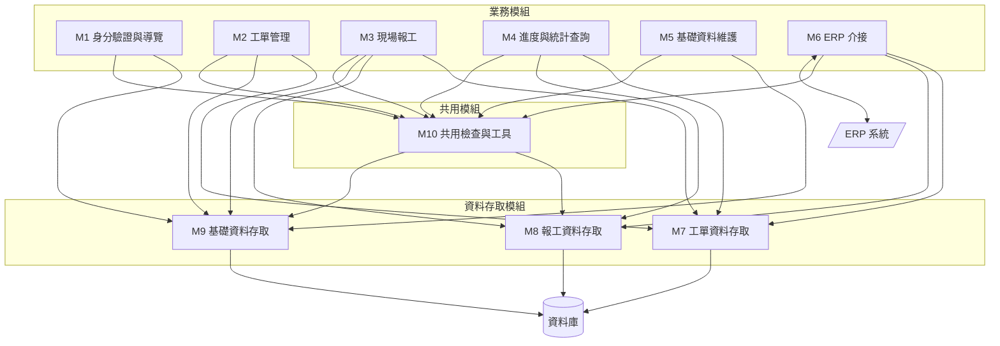
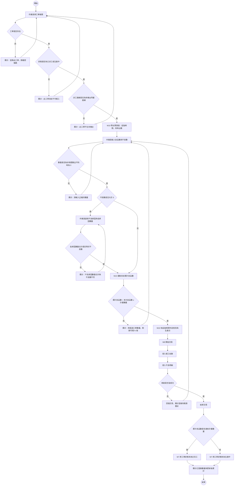
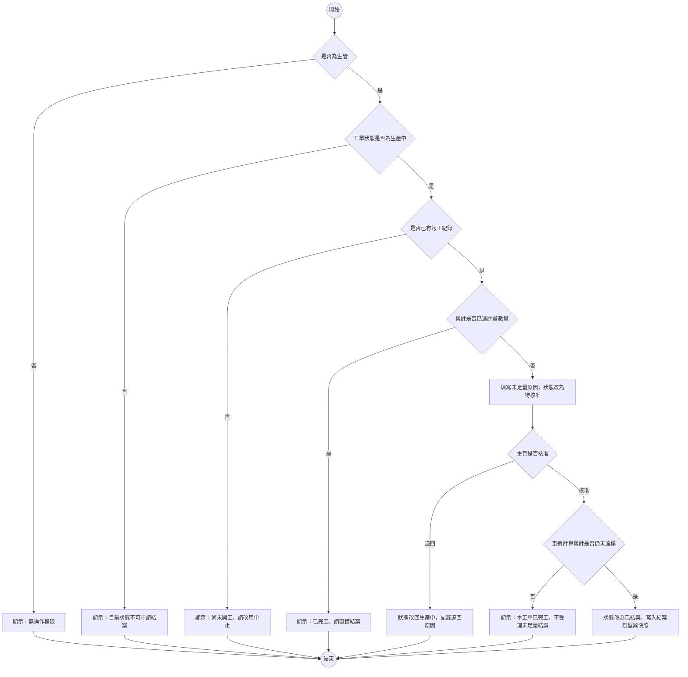
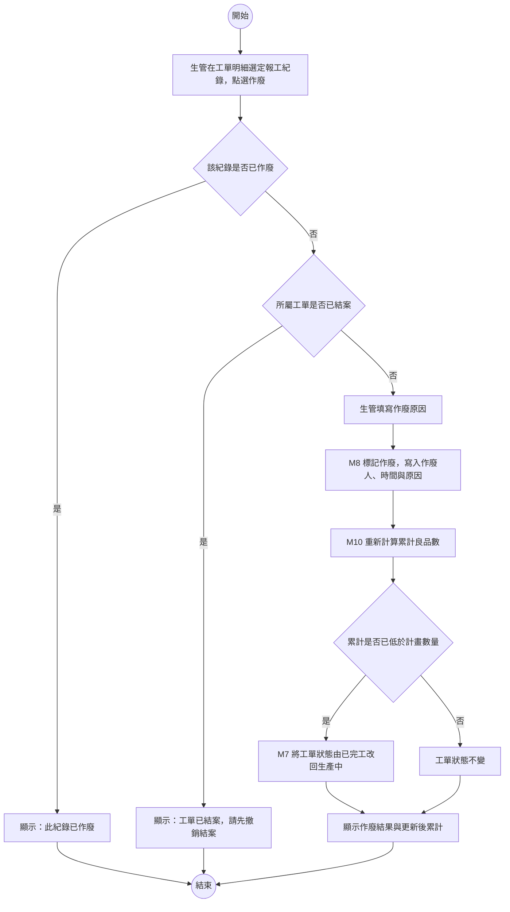
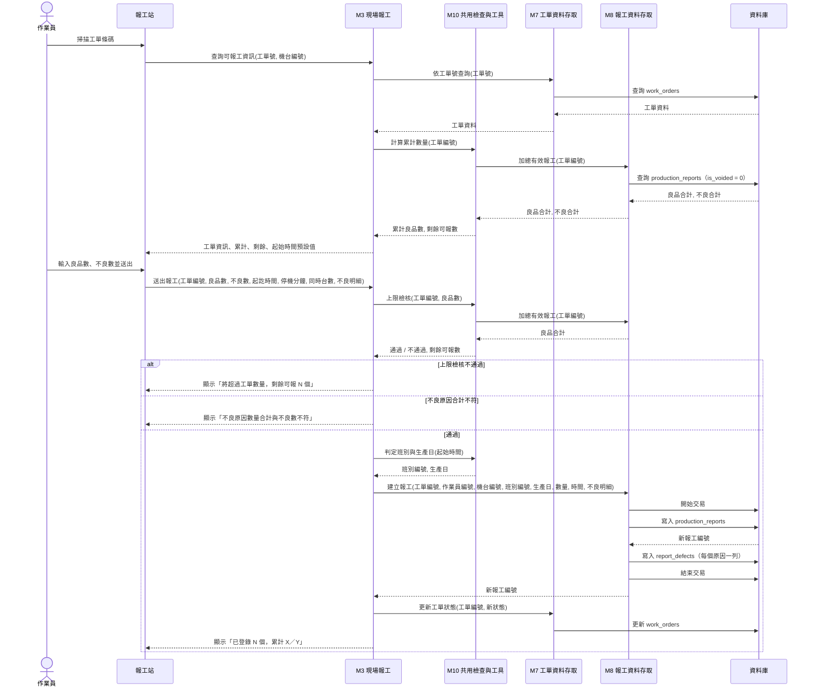
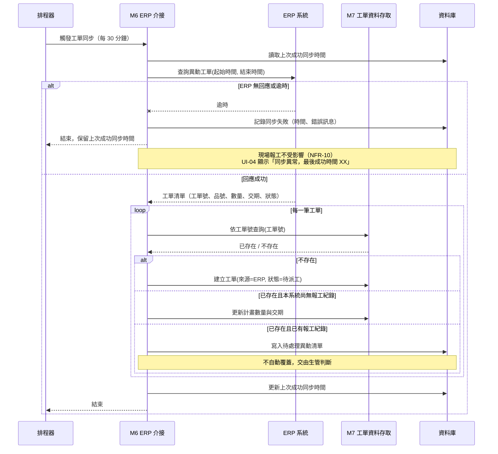
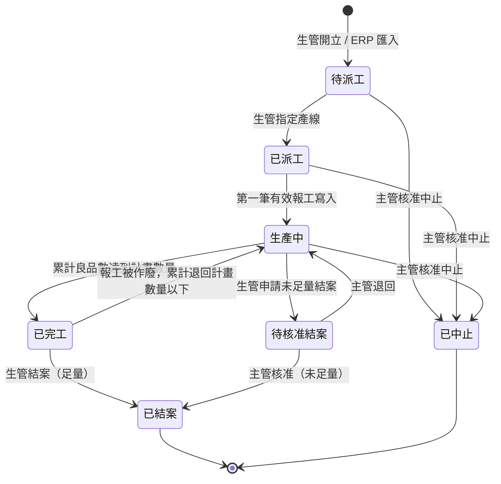
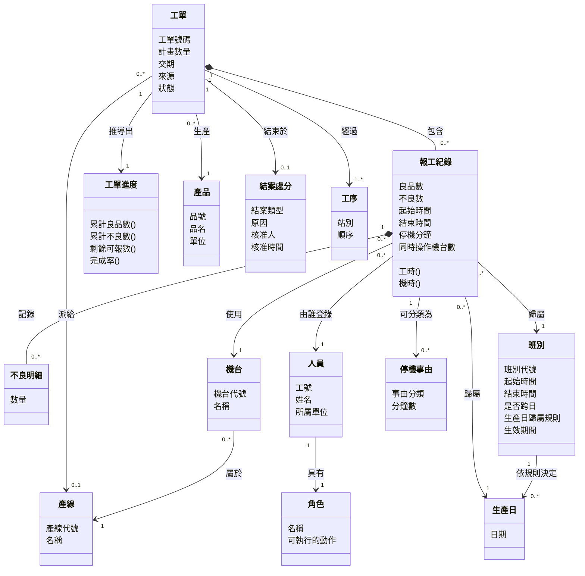
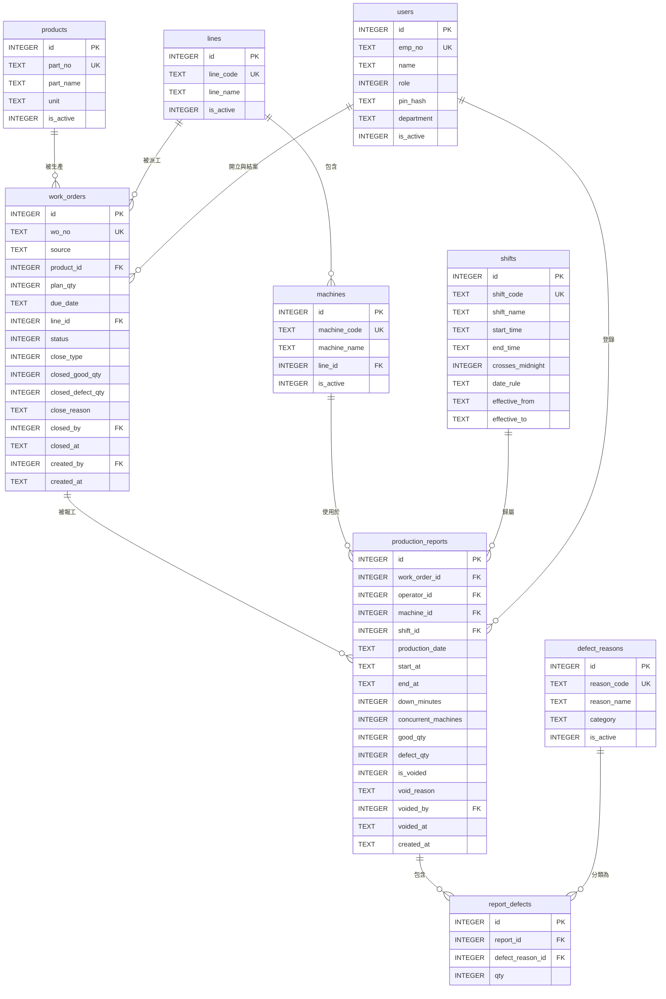
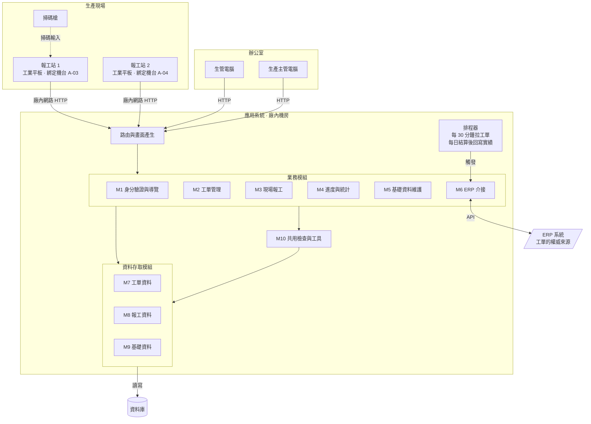

# 系統設計報告：工單派工與現場報工系統

> 這是一份寫好的期末書面報告，內容依[「報告內容」](../00-Course-Introduction/Report-Contents.md)〈二、期末小組報告〉的八項排列，最後附上必做的分工紀錄。每一項該有哪些欄位、為什麼要這樣寫、方法出自哪一章，見[「系統設計範例報告說明」](Design-Phase-Deliverables.md)；這份只放成品。
>
> 題目本身的情境、名詞與設計難點，見[「工單派工與現場報工系統」](../02-Project-Topics/Work-Order-and-Reporting.md)。
>
> **各組題目不同，內容要換成自己那一題的。** 篇幅也不是標準——這裡每一項都收得很緊。

---

## 報告基本資料

| 項目 | 內容 |
|---|---|
| 課程 | 系統分析與設計（IE226）115-1 |
| 報告階段 | 期末小組報告（系統設計） |
| 設計題目 | 工單派工與現場報工系統 |
| 組別 | 第 3 組 |
| 組員 | 小明（1130001）、阿花（1130002）、阿宏（1130003）、阿凱（1130005，第 11 週轉入；小美於同期轉出） |
| 書面繳交日 | 2026/12/18 |
| 口頭報告日 | 2026/12/23 |

各成員負責的章節與圖表、組員異動的接手情形，見文末的〈附錄：分工紀錄〉。

---

## 1. 設計基礎與需求摘要

### 1.1 問題背景

工單目前印成紙本，貼在機台旁的看板上。作業員每個班別結束時，在工單背面手寫做了幾個、幾個不良、幾點到幾點；班長下班前收單，隔天早上交給生管，生管再把數字輸入電腦。

| 編號 | 問題陳述 | 本設計如何回應 |
|---|---|---|
| P-01 | 進度隔天才知道，客戶詢問時生管答不出來 | 作業員在現場直接登錄，工單進度即時由報工紀錄加總得出 |
| P-02 | 紙本工單在現場放三天會弄髒、遺失 | 工單以條碼識別，資料存於系統，紙本只作為現場張貼的識別用 |
| P-03 | 多人報工加總超過工單數量，到月底盤點才發現 | 每次報工寫入前檢核累計數量上限（本項有已知限制，見〈7.6〉R-01） |
| P-04 | 工時憑印象補寫，換線、待料、休息全算進去 | 報工須填起訖時間與停機分鐘，另填同時操作機台數以區分工時與機時 |
| P-05 | 不良只記一個數字，不知道原因，改善無從下手 | 不良數大於 0 時須登記原因分類與各原因數量 |
| P-06 | 晚班跨日的產出算哪一天，各班說法不一 | 班別的起訖時間與生產日歸屬規則定義為資料，由系統統一判定 |

### 1.2 主要角色

| 角色 | 使用目標 | 權限範圍 | 最在意 |
|---|---|---|---|
| 生管人員 | 排產、開單、追進度 | 開立與修改工單、派工、查詢全部進度與報表、作廢報工紀錄、維護基礎資料 | 進度要準；異常要一眼看得出來 |
| 現場作業員 | 把剛做完的一批登記掉 | 只能對自己所在機台的工單報工、查自己當班的紀錄 | **要快。** 戴手套、站在噪音裡、交班前只剩三分鐘 |
| 生產主管 | 掌握交期風險、核准例外 | 查詢全部進度與報表、核准未足量結案與中止 | 交期會不會延誤；哪條線效率有問題 |

「最在意」一欄各自決定了一項設計：作業員那條使報工畫面砍到只剩兩個必填欄位（NFR-01）並改用大型數字鍵盤（NFR-06）；生管那條使工單清單以完成率與逾期標記排序，並在頂端顯示 ERP 同步狀態；主管那條使未足量結案與中止都必須經他核准，而非由生管自行決定。

### 1.3 核心流程

| 編號 | 流程 | 主要角色 | 起點 | 終點 |
|---|---|---|---|---|
| PR-01 | 工單匯入 | 系統（排程觸發） | 排程器每 30 分鐘觸發 | 新工單建立，狀態為待派工 |
| PR-02 | 開立臨時工單 | 生管 | ERP 同步異常時手動建立 | 工單建立，來源標記為本廠 |
| PR-03 | 派工 | 生管 | 在工單清單點選派工 | 指定產線，狀態改為已派工 |
| PR-04 | 報工站登入 | 作業員 | 掃工號條碼並輸入 PIN | 建立登入狀態，進入報工畫面 |
| PR-05 | 報工登錄 | 作業員 | 掃工單條碼 | 報工紀錄與不良明細寫入，工單狀態與累計更新 |
| PR-06 | 報工作廢與重報 | 生管 | 在工單明細點選作廢 | 原紀錄標記為已作廢，累計退回，必要時工單狀態回退 |
| PR-07 | 足量結案 | 生管 | 累計達標後在清單點選結案 | 狀態改為已結案，寫入結案快照 |
| PR-08 | 未足量結案 | 生管申請、主管核准 | 生管在工單明細申請 | 主管核准後結案，記錄未足量原因 |
| PR-09 | 工單中止 | 生管申請、主管核准 | 客戶取消或停產 | 狀態改為已中止，已產出數量保留 |
| PR-10 | 生產實績回寫 | 系統（排程觸發） | 生產日結算後次日 08:00 | 當日實績送達 ERP |

### 1.4 關鍵需求

#### 功能需求

| 編號 | 功能需求 | 觸發角色 |
|---|---|---|
| FR-01 | 生管可開立工單，內容含品號、計畫數量、交期 | 生管 |
| FR-02 | 系統定期由 ERP 匯入新工單與工單變更 | 系統 |
| FR-03 | 生管可將工單派給指定產線 | 生管 |
| FR-04 | 生管可修改尚無任何報工紀錄的工單；ERP 來源工單的計畫數量與交期除外 | 生管 |
| FR-05 | 作業員以工號條碼與 PIN 於報工站登入 | 作業員 |
| FR-06 | 作業員可對工單登錄報工，含良品數、不良數、起訖時間、停機分鐘與同時操作機台數 | 作業員 |
| FR-07 | 不良數大於 0 時須登記不良原因與各原因數量，合計須等於不良數 | 作業員 |
| FR-08 | 報工寫入前須檢核「該工單有效報工的良品數合計 + 本次良品數 ≤ 工單計畫數量」 | 系統 |
| FR-09 | 作業員可查看自己當班已登錄的報工紀錄 | 作業員 |
| FR-10 | 報工紀錄不得修改；更正一律由生管作廢原紀錄後重新登錄，作廢須填原因 | 生管 |
| FR-11 | 生管與主管可查詢任一工單的即時進度與其所有報工紀錄 | 生管、主管 |
| FR-12 | 生產主管可核准未足量結案，須填未足量原因 | 主管 |
| FR-13 | 生產主管可核准工單中止 | 主管 |
| FR-14 | 生管與主管可查詢日產量報表，可依生產日、產線、班別彙總 | 生管、主管 |
| FR-15 | 生管與主管可查詢不良原因統計 | 生管、主管 |
| FR-16 | 生管可維護產品、產線與機台、班別、不良原因四類基礎資料 | 生管 |
| FR-17 | 每個生產日結算後，將當日生產實績回寫 ERP | 系統 |
| FR-18 | 系統依登入者身分決定可用的功能入口 | 全部 |

#### 非功能需求

| 編號 | 非功能需求 | 對設計的決定 |
|---|---|---|
| NFR-01 | 正常情況下，一次報工從掃碼到送出不超過三個輸入動作 | 報工畫面只留兩個必填欄位，其餘由身分、裝置或前一筆紀錄推得預設值 |
| NFR-02 | 所有數量檢核與權限檢核必須在伺服器端執行 | 畫面上的限制僅為提示，後端一律重驗 |
| NFR-03 | 報工紀錄不得實體刪除，更正一律以作廢加重報留痕 | 報工表需作廢旗標、作廢人、作廢時間與原因四欄；所有加總一律排除已作廢者 |
| NFR-04 | 任一時點顯示的工單進度，必須與當時的有效報工紀錄一致 | 未結案工單的累計數量不得存成可獨立更新的欄位 |
| NFR-05 | 班別的起訖時間與生產日歸屬規則必須來自資料，不得寫死於程式 | 需要班別主檔，判定邏輯收斂於單一共用模組 |
| NFR-06 | 報工站須能在戴手套的情況下操作 | 可點擊元件最小 48×48 像素；數字以大型鍵盤輸入；不使用下拉選單 |
| NFR-07 | 報工站不以鍵盤輸入密碼 | 以工號條碼加四位數 PIN 登入；PIN 以雜湊儲存，不存明文 |
| NFR-08 | 工單的計畫數量與交期以 ERP 為權威來源 | ERP 來源工單的這兩個欄位在本系統唯讀 |
| NFR-09 | 報工紀錄須保存三年且可追溯到人、機、時 | 報工表的作業員、機台、班別、生產日四欄不可空，且外鍵在資料庫層宣告 |
| NFR-10 | 與 ERP 的任一方向同步失敗，不得影響現場報工 | 同步一律非同步、由排程器觸發，不掛在任何使用者操作路徑上 |

NFR-04 與 NFR-05 是本設計影響最深的兩條，它們各自否決了一個看起來自然的做法：前者否決「在工單表加一個累計數量欄位」，因為報工可作廢時該欄位要同步維護，而漏改的錯誤無人會發現；後者否決「把晚班 23:00 到 07:00 寫在程式裡」，因為換班制度改變時就得改程式。

### 1.5 系統邊界與設計範圍

| 範圍內 | 範圍外 | 界線 |
|---|---|---|
| 工單的登錄、派工、結案、中止 | **排產順序的決定** | 排什麼順序由生管判斷，系統只記錄結果 |
| 單一工序的報工 | 多工序流程（各站別分別報工） | 在製品不在站別之間流動 |
| 作業員手動登記數量與時間 | 由 PLC 或設備自動取數 | 凡需接設備訊號者一律界外 |
| 與 ERP 交換工單與生產實績 | 與 MES、WMS 的其他介接 | 只做工單來源與實績去向兩條 |
| 不良數與不良原因分類 | 不良品的後續處理（重工、報廢、挑選） | 本系統只記錄發生了幾個、為什麼 |
| 良品數、不良數、工時、機時 | 標準工時比對與效率指標計算 | 資料備齊即可，指標計算留給下一版 |

本系統與 ERP 交換資料，介接內容見〈5.4〉。

### 1.6 需求取捨

#### 延後處理

| 需求 | 延後理由 | 延後的代價 | 何時該做 |
|---|---|---|---|
| 離線報工暫存與補傳 | 需在報工站保存本地佇列並處理補送順序與衝突，複雜度高於本次時程 | 網路中斷期間無法報工，只能改用紙本事後補登，時間與班別會失真 | 現場網路實測有死角時必須做，見 R-05 |
| 停機事由分類 | 目前只記停機總分鐘數，分類的類別尚未談定 | 知道停了 40 分鐘，但不知是換線、待料或故障，改善無從下手 | 不良原因分類上線並穩定後，見 O-03 |
| 多工序流程 | 在製品要在站別之間流動，資料模型會跳一級 | 只看得到最後一站的產出，中間站的進度看不到 | 單工序版本上線且現場接受後 |
| 標準工時與效率指標 | 標準工時的資料來源與維護責任未定 | 有工時資料但算不出效率，主管仍需自行以試算表計算 | 基礎資料維護責任釐清後 |
| 未足量結案的核准代理人 | 代理規則須先由生產主管訂定 | 主管不在時工單停在待核准，見 R-08 | 第一次發生卡單之前 |

#### 明確不做

| 項目 | 理由 |
|---|---|
| 自動排程（系統決定工單先後順序與派給哪台機台） | 排產要考慮換線時間、模具、人力與臨時插單，這些條件多半不在系統裡。做成自動排程會讓演算法吃掉整份設計，而現場仍會照自己的判斷改 |
| 允許直接修改報工紀錄 | 報工紀錄是品質追溯文件（NFR-09），修改會使追溯斷掉。更正一律以「作廢原紀錄 + 重新登錄」處理，兩筆都留著 |

---

## 2. 功能與模組設計

### 2.1 模組清單

| 編號 | 模組 | 類型 | 目的 | 對應需求 |
|---|---|---|---|---|
| M1 | 身分驗證與導覽 | 業務 | 報工站登入、辦公室登入、登出、依身分決定入口 | FR-05、FR-18、NFR-07 |
| M2 | 工單管理 | 業務 | 開立、修改、派工、結案、中止 | FR-01、FR-03、FR-04、FR-12、FR-13 |
| M3 | 現場報工 | 業務 | 報工登錄、當班查詢、作廢與重報 | FR-06、FR-07、FR-09、FR-10 |
| M4 | 進度與統計查詢 | 業務 | 工單進度、日產量報表、不良原因統計 | FR-11、FR-14、FR-15 |
| M5 | 基礎資料維護 | 業務 | 產品、產線與機台、班別、不良原因 | FR-16 |
| M6 | ERP 介接 | 業務 | 匯入工單、回寫生產實績 | FR-02、FR-17、NFR-08、NFR-10 |
| M7 | 工單資料存取 | 共用 | `work_orders` 表的所有讀寫 | 支撐 M2、M4、M6 |
| M8 | 報工資料存取 | 共用 | `production_reports` 與 `report_defects` 兩表的所有讀寫 | 支撐 M3、M4、M6 |
| M9 | 基礎資料存取 | 共用 | 五張基礎資料表的所有讀寫 | 支撐全部 |
| M10 | 共用檢查與工具 | 共用 | 權限檢查、班別與生產日判定、累計數量計算、上限檢核、工時推導 | NFR-02、NFR-04、NFR-05 |

M7 至 M10 在畫面上沒有任何入口。M6 也沒有專屬畫面（其狀態顯示於 UI-04），但它歸類為業務模組而非共用模組，因為它有自己的業務規則：哪些工單該匯入、變更如何處理、同步失敗如何因應。M7 至 M9 只做讀寫，不做判斷。

四項切分決定：

| 決定 | 理由 |
|---|---|
| 資料存取獨立成 M7～M9，不併入業務模組 | 資料庫語法只出現在這三個模組，更換資料庫時只需改此三處 |
| 五張基礎資料表合成一個 M9，而非一表一模組 | 「一表一模組」的用意是避免兩個模組寫同一張表。基礎資料的寫入路徑只有 M5 一條，不存在此風險，故合併以免模組清單失焦 |
| 上限檢核放在 M10 而非 M3 | 未來若新增批次補登等其他寫入路徑，檢核規則只有一份 |
| ERP 介接獨立成 M6，不併入 M2 | M2 的規則是「人怎麼操作工單」，M6 的規則是「兩套系統怎麼對帳」，兩者變動的原因不同。ERP 換版本時只動 M6 |

### 2.2 模組規格

#### M1 身分驗證與導覽

| 欄位 | 內容 |
|---|---|
| 目的 | 辨識操作者身分，並依身分決定可用的功能入口 |
| 使用角色 | 全部 |
| 主要輸入 | 報工站：工號條碼、四位數 PIN<br>辦公室：帳號、密碼 |
| 主要處理 | 1. 依來源裝置決定走哪一條登入路徑 2. 查詢人員並比對憑證雜湊 3. 檢查帳號啟用狀態 4. 報工站另需檢查該裝置已綁定機台 5. 建立登入狀態，記錄角色與（報工站）機台編號 |
| 主要輸出 | 報工站導向 UI-02；辦公室依角色導向 UI-04；失敗時原頁顯示錯誤 |
| 相依模組 | 呼叫 M9、M10 |
| 對應需求 | FR-05、FR-18、NFR-07 |

報工站與辦公室走兩條不同的登入路徑，因為兩邊的裝置條件不同：現場無實體鍵盤，密碼改為掃碼加四位數 PIN。兩條路徑的憑證皆以雜湊儲存，不存明文。

#### M2 工單管理

| 欄位 | 內容 |
|---|---|
| 目的 | 讓生管管理工單的整個生命週期，讓主管核准例外 |
| 使用角色 | 生管、生產主管 |
| 主要輸入 | 開立：品號、計畫數量、交期<br>派工：工單編號、產線編號<br>結案：工單編號、（未足量時）原因<br>中止：工單編號、原因 |
| 主要處理 | 1. 權限檢查（生管或主管）2. 工單狀態檢查，不同動作各有允許的來源狀態 3. 修改時檢查該工單是否已有報工紀錄；ERP 來源工單的計畫數量與交期一律拒絕修改 4. 未足量結案與中止須主管核准，核准當下重新計算累計 5. 結案時寫入結案類型、原因、核准人與累計快照 |
| 主要輸出 | 清單頁與明細頁；操作後導回原頁並顯示結果訊息 |
| 相依模組 | 呼叫 M7、M9、M10 |
| 對應需求 | FR-01、FR-03、FR-04、FR-12、FR-13、NFR-08 |

未足量結案在核准當下必須重新計算累計數量。原因是主管檢視畫面到按下核准之間，現場可能又報了工使累計達標，此時應改為足量結案而非未足量結案。

#### M3 現場報工

| 欄位 | 內容 |
|---|---|
| 目的 | 讓作業員把剛做完的一批數量與時間登記進系統 |
| 使用角色 | 現場作業員（登錄、查當班）；生管（作廢） |
| 主要輸入 | 登錄：工單號碼（掃碼）、良品數、不良數、起訖時間、停機分鐘、同時操作機台數、不良原因與各原因數量<br>作廢：報工編號、作廢原因 |
| 主要處理 | 1. 身分與機台檢查：作業員已登入；報工站已綁定機台<br>2. 工單檢查：工單存在、狀態為已派工或生產中、且派工產線與本機台所屬產線相同<br>3. 數量檢查：良品數與不良數皆為非負整數，且不得同時為 0<br>4. 不良原因檢查：不良數大於 0 時原因至少一筆，且各原因數量合計等於不良數<br>5. 呼叫 M10 取得累計良品數，檢核加上本次是否超過計畫數量<br>6. 呼叫 M10 依起始時間判定班別與生產日<br>7. 於單一交易內寫入報工紀錄與不良明細<br>8. 依新的累計數量更新工單狀態<br>9. 回傳結果並顯示更新後的累計與剩餘 |
| 主要輸出 | 成功時顯示「已登錄 N 個，累計 X／Y」，清空數量欄並停留於本頁；失敗時保留已輸入的數字並顯示錯誤 |
| 相依模組 | 呼叫 M7、M8、M9、M10 |
| 對應需求 | FR-06～FR-10、NFR-01～NFR-05 |

三項順序決定：工單與機台的一致性檢查排在數量輸入之前，因為掃錯工單是現場最常見的錯誤，等數字打完才退回會使作業員不耐；不良原因合計檢查排在上限檢核之前，因為前者不需查詢資料庫，後者必須加總全部報工紀錄，先做成本低的檢查；工單狀態更新排在交易之後，因為狀態由累計數量推得，必須先確定數量已寫入。

第 5 步與第 7 步之間存在一個空隙：讀取累計與寫入是兩個分開的動作，兩筆同時進行的報工會讀到同一個舊值。此為已知限制，完整推演與評估見〈7.6〉R-01。

#### M4 進度與統計查詢

| 欄位 | 內容 |
|---|---|
| 目的 | 提供工單進度與生產統計，供生管與主管判斷 |
| 使用角色 | 生管、生產主管 |
| 主要輸入 | 工單清單：狀態篩選、關鍵字、頁碼<br>日產量報表：生產日區間、產線、班別<br>不良統計：生產日區間、產品、原因分類 |
| 主要處理 | 1. 權限檢查 2. 未結案工單的累計由 M10 即時加總；已結案工單直接讀結案快照 3. 完成率、剩餘可報數、逾期標記皆為查詢時推導 4. 報表以生產日與班別欄位分組，不重新判定班別 |
| 主要輸出 | 工單清單與分頁；日產量報表；不良原因統計 |
| 相依模組 | 呼叫 M7、M8、M10 |
| 對應需求 | FR-11、FR-14、FR-15、NFR-04 |

報表分組直接使用報工紀錄上的 `production_date` 與 `shift_id` 兩欄，不在查詢時重新判定班別。理由見〈4.3〉。

#### M5 基礎資料維護

| 欄位 | 內容 |
|---|---|
| 目的 | 維護產品、產線與機台、班別、不良原因四類參照資料 |
| 使用角色 | 生管 |
| 主要輸入 | 各表的欄位；停用時為目標編號 |
| 主要處理 | 1. 權限檢查（限生管）2. 代號唯一性檢查 3. 停用改旗標，不刪除紀錄 4. 班別異動一律新增一列並填上舊列的生效迄日，不修改舊列 5. 機台須指定所屬產線 |
| 主要輸出 | 各類基礎資料的清單與編輯表單 |
| 相依模組 | 呼叫 M9、M10 |
| 對應需求 | FR-16、NFR-05 |

第 4 點是本設計唯一一處「不允許修改既有紀錄」的基礎資料規則。班別的起訖時間被直接改掉時，舊報工紀錄的判定依據就消失了，稽核時無法解釋當時的歸屬是怎麼算出來的。

#### M6 ERP 介接

| 欄位 | 內容 |
|---|---|
| 目的 | 由 ERP 取得工單，並將生產實績送回 ERP |
| 使用角色 | 無直接使用者，由排程器觸發 |
| 主要輸入 | 匯入：上次成功同步時間<br>回寫：待回寫的生產日 |
| 主要處理 | 匯入：1. 讀取上次成功同步時間 2. 向 ERP 查詢該時間之後的異動工單 3. 逐筆處理：不存在則建立；已存在且本系統尚無報工紀錄則更新計畫數量與交期；已存在且已有報工紀錄則寫入待處理異動清單，不自動覆蓋 4. 全部成功才更新上次成功同步時間<br>回寫：1. 彙總該生產日的良品數、不良數、工時與機時 2. 送出至 ERP 3. 失敗則寫入待重送佇列 |
| 主要輸出 | 匯入結果寫入同步紀錄；異常狀態顯示於 UI-04 頂端 |
| 相依模組 | 呼叫 M7、M8、M10；對外連 ERP |
| 對應需求 | FR-02、FR-17、NFR-08、NFR-10 |

兩個方向的失敗處置不同：匯入失敗時保留上次成功同步時間、不推進，並允許生管手動建立臨時工單先讓現場開工；回寫失敗時只重送，不得回滾或鎖住任何既有報工紀錄。理由見〈5.4〉。

#### M7～M10 共用模組

| 編號 | 對外提供 | 回傳約定 |
|---|---|---|
| M7 工單資料存取 | 依編號查詢、依工單號查詢、建立、更新工單內容、更新狀態、寫入結案快照、清單查詢（含篩選與分頁） | 查詢回傳單筆或空值；清單查詢回傳（該頁資料，總筆數）；建立回傳新編號 |
| M8 報工資料存取 | 依工單查詢報工、依作業員與班別查詢、建立報工（含不良明細，單一交易）、標記作廢、依生產日彙總 | 同上；彙總類回傳（良品合計，不良合計，工時合計，機時合計） |
| M9 基礎資料存取 | 五張表各自的查詢、建立、更新、停用；班別另提供「取得某時點生效的班別清單」 | 同上 |
| M10 共用檢查與工具 | 權限檢查、班別與生產日判定、累計數量計算、上限檢核、工時與機時推導 | 判定類回傳真假與附帶資訊；計算類回傳數值 |

M8 有一個操作必須在單一交易內完成：建立報工時同時寫入報工紀錄與其不良明細。一筆有不良數卻沒有不良明細的報工是無效狀態，因此兩者必須同時成功或同時失敗。這是本設計唯一需要交易保護的地方。

M10 的五項功能放在一起的共通點不是功能相似，而是每一項都會被兩個以上的模組使用，且規則改變時必須一次全改。班別規則改動會同時影響報工登錄、日產量報表與 ERP 回寫三處。

### 2.3 模組相依關係



六個業務模組彼此不呼叫，只透過共用模組與資料存取模組間接發生關係。M10 落在中間層：它被業務模組呼叫，也呼叫資料存取模組。圖上唯一的雙向箭頭是 M6 對外連 ERP，屬跨系統往返，不是內部循環。

### 2.4 CRUD 矩陣

| 模組 | `work_orders` | `production_reports` | `report_defects` | 五張基礎資料表 |
|---|:---:|:---:|:---:|:---:|
| M1 身分驗證與導覽 | — | — | — | R |
| M2 工單管理 | C R U | R | — | R |
| M3 現場報工 | R U | C R U | C R | R |
| M4 進度與統計查詢 | R | R | R | R |
| M5 基礎資料維護 | — | — | — | C R U |
| M6 ERP 介接 | C R U | R | R | R |

C 建立、R 讀取、U 更新、D 刪除。

整張矩陣沒有任何一個 D。報工紀錄與工單依 NFR-03 與 NFR-09 不得實體刪除，基礎資料則以停用旗標取代刪除。

兩格需要說明：

| 位置 | 說明 |
|---|---|
| M3 對 `work_orders` 有 U | 累計良品數達到計畫數量時，報工模組要把工單狀態改為已完工。這是跨出自己主表的更新，僅限狀態欄，不得更動工單的其他欄位 |
| M2 與 M6 都對 `work_orders` 有 C、U | 分工以來源欄位區隔：M6 只寫由 ERP 匯入的工單，M2 只寫廠內自建的臨時工單。M2 不得修改 ERP 來源工單的計畫數量與交期（NFR-08） |

---

## 3. 主要流程與互動設計

### 3.1 活動圖：報工登錄（PR-05）

> **主要角色**：現場作業員
> **觸發事件**：作業員在報工站掃描工單條碼
> **前置條件**：已登入報工站；該報工站已綁定機台
> **例外情況**：工單不存在、狀態不可報工、工單不在本機台、數量格式錯誤、不良原因合計不符、超過工單數量、寫入失敗
> **完成後狀態**：報工紀錄與不良明細各新增一筆且同時成立；工單狀態依新的累計數量更新



四項設計決定：三個工單檢查（D1～D3）排在數量輸入之前，避免作業員打完數字才被退回；超量訊息帶出剩餘可報數，否則作業員不知道該改成幾個；D7 到 T2 之間未加保護，是已知限制 R-01；D9 排在交易之後，因為工單狀態由累計數量推得。

### 3.2 活動圖：未足量結案（PR-08）

> **主要角色**：生管（申請）、生產主管（核准）
> **次要角色**：現場作業員（該工單自報工站的可選清單消失）
> **觸發事件**：工單做不下去，生管在工單明細頁申請未足量結案
> **前置條件**：工單狀態為生產中、已有報工紀錄、累計未達計畫數量
> **例外情況**：尚無報工紀錄、累計已達標、已有待核准申請、核准期間累計達標、主管未處理
> **完成後狀態**：工單狀態為已結案，結案類型為未足量，並寫入原因、核准人與累計快照

本流程跨三個角色，以泳道表呈現責任分工：

| 步驟 | 生管 | 系統 | 生產主管 | 現場作業員 |
|:--:|---|---|---|---|
| 1 | 在工單明細頁點選「申請未足量結案」 | | | |
| 2 | | 檢查：狀態為生產中、已有報工紀錄、累計未達標 | | |
| 3 | 填寫未足量原因並送出 | | | |
| 4 | | 狀態改為待核准結案，於主管的清單頁標示 | | |
| 5 | | | 檢視工單、累計數量與原因 | |
| 6 | | | 核准或退回 | |
| 7 | | 核准：**重新計算累計**，仍未達標才結案，寫入結案類型、原因、核准人與快照 | | |
| 8 | | 退回：狀態改回生產中，記錄退回原因 | | |
| 9 | | | | 該工單不再出現於報工站的可報工清單 |

例外分支：

| 在哪一步 | 例外 | 系統的處置 |
|:--:|---|---|
| 2 | 工單尚無任何報工紀錄 | 顯示「本工單尚未開工，請改用中止」，不進入結案流程 |
| 2 | 累計已達計畫數量 | 顯示「本工單已完工，請直接結案」 |
| 2 | 工單已是待核准狀態 | 顯示「已有一筆結案申請待核准」 |
| 7 | 核准期間有新報工進來使累計達標 | 不接受核准，顯示「本工單已完工，不受理未足量結案」 |
| 6 | 主管超過兩個工作日未處理 | 本次設計無自動升級機制，工單停在待核准，於清單頁標紅；見 R-08 |

檢核邏輯的分岔結構：



C4 與 C6 是同一個檢查做了兩次。兩次之間隔著主管的思考時間，而現場不會停下來等他。

### 3.3 活動圖：報工作廢與重報（PR-06）

> **主要角色**：生管
> **觸發事件**：作業員報錯數量（例如 150 打成 15），隔天發現要更正
> **前置條件**：該報工紀錄未作廢；所屬工單未結案
> **例外情況**：工單已結案、紀錄已作廢
> **完成後狀態**：原紀錄標記為已作廢並記錄作廢人與原因；累計退回；工單狀態必要時回退



D2 是本設計成立的關鍵條件：已結案工單的累計數量存成快照（見〈4.3〉），若允許結案後作廢，快照就會與實際不符。因此結案工單一律不接受作廢，要更正必須先由主管撤銷結案。

A3 到 A5 之間沒有補償動作：作廢會讓累計退回，但生管在錯誤累計下已做出的排產決定不會自動還原。此為資訊系統的固有限制，列為 R-03。

### 3.4 循序圖：報工登錄（PR-05）



累計數量在本流程中被查詢兩次：掃碼時為了顯示剩餘可報數，送出時為了檢核。兩次用途不同，不可合併——作業員停在畫面上的期間別人可能已報了工，用畫面上顯示的舊數字判斷會是錯的。

交易邊界包住 `production_reports` 與 `report_defects` 兩張表的寫入，但未包住上限檢核。此空隙即 R-01。

### 3.5 循序圖：ERP 工單同步（PR-01）



最後一個分支是本流程的核心判斷。ERP 把一張已做 3,000 個的工單從 5,000 改為 2,000 時，直接覆蓋會產生「累計超過計畫」的狀態，且不是任何人報錯造成的；直接拒絕則會讓兩邊長期不一致。本設計選擇寫入待處理清單由生管判斷，理由與代價見〈8.4〉D-09。

### 3.6 狀態機圖：工單狀態



四項要點：

| 圖上的位置 | 說明 |
|---|---|
| 「已完工 → 生產中」是唯一往回走的轉移 | 報工被作廢會使累計退回。此轉移若在實作時被漏掉，會出現一張未做完卻永遠掛在已完工的工單，且無人察覺 |
| 「待派工 → 生產中」沒有箭頭 | 刻意的。未派工的工單不接受報工，因為報工要靠「工單派工產線 = 本機台所屬產線」來確認掃對了工單 |
| 「已結案」與「已中止」皆為終態 | 本次設計不提供撤銷結案的畫面路徑，必要時由維護者直接處理；此限制使結案快照的正確性得以成立 |
| 中止的工單保留已產出數量 | 報工紀錄不因中止而失效，但該工單的產出是否計入當月產量尚未定義，見 O-02 |

| 狀態 | `status` 值 | 可報工 | 可派工 | 可結案 | 可中止 |
|---|:--:|:--:|:--:|:--:|:--:|
| 待派工 | 10 | 否 | 是 | 否 | 是 |
| 已派工 | 20 | 是 | 是（改派） | 否 | 是 |
| 生產中 | 30 | 是 | 否 | 申請未足量結案 | 是 |
| 已完工 | 40 | 否 | 否 | 是 | 否 |
| 待核准結案 | 50 | 否 | 否 | 由主管核准 | 否 |
| 已結案 | 90 | 否 | 否 | 否 | 否 |
| 已中止 | 99 | 否 | 否 | 否 | 否 |

狀態值刻意不連號，中間留出號碼供未來插入新狀態（例如「暫停」），避免屆時整組值重編。

---

## 4. 資料設計

### 4.1 概念類別圖



### 4.2 從概念到資料表的落地決定

| 概念 | 是否成為資料表 | 落到哪裡 |
|---|---|---|
| 工單 | 是 | `work_orders` |
| 報工紀錄 | 是 | `production_reports` |
| 不良明細 | 是 | `report_defects` |
| 產品、產線、機台、班別、人員 | 是 | `products`、`lines`、`machines`、`shifts`、`users` |
| 不良原因（圖上隱含於不良明細的關聯端） | 是 | `defect_reasons` |
| 工單進度 | 否 | 四個屬性全為推導值，由報工紀錄即時加總，見〈4.3〉 |
| 工時、機時 | 否 | 由同一筆報工紀錄上的起訖時間、停機分鐘與同時台數推導，見〈4.11〉 |
| 角色 | 否 | 只有三種且不會增減，成為 `users.role` 一個整數欄位，不另建角色表 |
| 結案處分 | 否 | 一張工單最多一筆且多數工單沒有，併為 `work_orders` 上的五個可空欄位 |
| 生產日 | **是，成為欄位** | 雖然是算出來的，仍存入 `production_reports.production_date`，理由見〈4.3〉 |
| 停機事由 | **否（本次不做）** | 只記停機總分鐘數，不記分類。見〈1.6〉與 R-07、O-03 |
| 工序 | **否（明確簡化）** | 本次為單工序，完全不落地。多工序見〈1.5〉範圍外 |

「停機事由」與「工序」列在圖上而不落地，是刻意保留的紀錄：本設計知道這兩個概念存在，也知道少了它們的後果，而不是沒想到。

### 4.3 推導值該存還是該算

本設計出現四個推導值，處理方式不同，判準統一如下：

> **推導值要不要存下來，看它的計算依據會不會隨時間改變。依據不會變就用算的，依據會被人改就存快照。**

| 推導值 | 計算依據 | 依據會不會變 | 決定 | 理由 |
|---|---|:--:|:--:|---|
| 未結案工單的累計良品數與不良數 | 該工單所有未作廢的報工紀錄 | 不會。報工不得修改，只能作廢，作廢也留在表裡 | **用算的** | 任何時間重算都得到同一個答案。存成欄位反而多一份要維護，且漏維護的錯誤無人會發現（NFR-04） |
| 報工的工時與機時 | 同一筆報工紀錄上的起訖時間、停機分鐘、同時操作機台數 | 不會。全部在同一筆不可變的紀錄裡 | **用算的** | 同上；存下來還會出現「三個欄位改了但工時沒改」的不一致 |
| 報工的班別與生產日 | 班別主檔的起訖時間與生產日歸屬規則 | **會。** 換班制度改變、班別區間調整時主檔會被改 | **存快照** | 若每次重算，去年的報工會用今年的班表重新歸屬，歷史報表的數字會自己變動 |
| 已結案工單的累計數量 | 同第一列，但工單已結案 | 不會，且不再增加 | **存快照** | 純為效能。結案工單佔多數，每次查歷史報表重新加總全部報工紀錄不划算 |

第一列與第三列的結論相反，但出自同一條判準。

第四列成立的前提是「結案後累計不再變動」，因此配套一條規則：**已結案的工單不接受報工作廢，要作廢必須先撤銷結案**（見〈3.3〉D2 節點與〈3.6〉）。此規則若被放寬，結案快照會與實際不符，而且不會有任何錯誤訊息。

### 4.4 實體關聯圖



三項拆表決定：

| 決定 | 理由 | 代價 |
|---|---|---|
| 工單與報工拆成主檔／明細 | 一張工單會跨三天、三班、五個人陸續做完，數量與時間屬於「一次報工」而非「一張工單」 | 進度必須由明細加總得出，衍生〈4.3〉的取捨 |
| 不良明細再拆一張表 | 一次報工的 30 個不良可能有三種原因，塞回報工紀錄只能記一個，統計會失真 | 報工畫面多一層輸入，以「不良為 0 時整區不顯示」化解（見〈6.3〉） |
| 產線與機台分成兩張表 | 派工的對象是產線（粗），報工要記到機台（細） | 多一層外鍵；機台異動時要確認所屬產線 |

三層結構的判準是每一層的「一筆」代表的東西不同：一張工單是一個生產指令，一筆報工是一個人在一段時間做的一批，一筆不良明細是那一批裡的一種不良。三個層次的數量各自獨立變動。

### 4.5 資料表與鍵值

| 資料表 | 用途 | 主鍵 | 對外參照 | 其他約束 |
|---|---|---|---|---|
| `work_orders` | 工單主檔 | `id` | `product_id`、`line_id`、`created_by`、`closed_by` | `wo_no` 唯一；`plan_qty` 大於 0；`status` 限七個值 |
| `production_reports` | 報工紀錄 | `id` | `work_order_id`、`operator_id`、`machine_id`、`shift_id` | 四個外鍵欄與 `production_date` 不可空（NFR-09）；數量為非負整數；`end_at` 晚於 `start_at` |
| `report_defects` | 報工不良明細 | `id` | `report_id`、`defect_reason_id` | `qty` 大於 0；同一報工的同一原因不得重複 |
| `products` | 產品主檔 | `id` | 無 | `part_no` 唯一；以 `is_active` 停用 |
| `lines` | 產線主檔 | `id` | 無 | `line_code` 唯一；以 `is_active` 停用 |
| `machines` | 機台主檔 | `id` | `line_id` → `lines.id` | `machine_code` 唯一；以 `is_active` 停用 |
| `shifts` | 班別主檔 | `id` | 無 | 同一 `shift_code` 的生效期間不得重疊 |
| `defect_reasons` | 不良原因主檔 | `id` | 無 | `reason_code` 唯一；以 `is_active` 停用 |
| `users` | 人員帳號 | `id` | 無 | `emp_no` 唯一；`pin_hash` 不存明文（NFR-07） |

本設計**在資料庫層宣告外鍵約束**，刪除行為一律設為禁止刪除，不設級聯。理由是 NFR-09 要求報工紀錄可追溯到人、機、時，必須保證每一筆報工都指得到真實存在的工單、機台與人員；此保證交給程式自律過於脆弱。

配套三項：基礎資料要退場一律改 `is_active` 而非刪除；上線時基礎資料必須先建，ERP 同步遇到找不到的品號時退回待處理清單而非硬寫；每次寫入報工多驗四個外鍵，以每日數百筆的資料量可以接受。

### 4.6 資料字典：`work_orders`

| 欄位名稱 | 中文名稱 | 型別 | 必填 | 值域／格式 | 資料來源 | 寫入時機 |
|---|---|---|---|---|---|---|
| `id` | 工單編號 | INTEGER | 是 | 主鍵，系統流水號 | 系統產生 | 建立時 |
| `wo_no` | 工單號碼 | TEXT | 是 | 唯一；ERP 來源沿用 ERP 編碼，本廠來源為 `T` 開頭 | ERP 或系統產生 | 建立時 |
| `source` | 來源 | TEXT | 是 | `ERP`、`LOCAL` | 系統依建立途徑決定 | 建立時 |
| `product_id` | 產品編號 | INTEGER | 是 | 對應 `products.id` | ERP 帶入或使用者選擇 | 建立時 |
| `plan_qty` | 計畫數量 | INTEGER | 是 | 大於 0；**來源為 `ERP` 時本系統唯讀**（NFR-08） | ERP 或使用者輸入 | 建立時，ERP 來源可由同步更新 |
| `due_date` | 交期 | TEXT | 是 | `YYYY-MM-DD`；同上唯讀規則 | 同上 | 同上 |
| `line_id` | 派工產線 | INTEGER | 否 | 對應 `lines.id`；未派工時為空 | 生管指定 | 派工時 |
| `status` | 狀態 | INTEGER | 是 | `10`／`20`／`30`／`40`／`50`／`90`／`99`，對照見〈3.6〉 | 系統依事件轉移 | 建立時預設 `10`，之後隨事件更新 |
| `close_type` | 結案類型 | INTEGER | 否 | `1` 足量、`2` 未足量、`3` 中止 | 系統依結案途徑決定 | 結案或中止時 |
| `closed_good_qty` | 結案良品快照 | INTEGER | 否 | 結案當下的累計良品數 | 系統計算後寫入 | 結案或中止時 |
| `closed_defect_qty` | 結案不良快照 | INTEGER | 否 | 同上 | 同上 | 同上 |
| `close_reason` | 結案原因 | TEXT | 否 | `close_type` 為 `2` 或 `3` 時必填 | 生管輸入 | 同上 |
| `closed_by` | 核准人 | INTEGER | 否 | 對應 `users.id`；足量結案時為執行的生管，未足量與中止時為核准的主管 | 由登入身分帶入 | 同上 |
| `closed_at` | 結案時間 | TEXT | 否 | `YYYY-MM-DD HH:MM:SS` | 系統產生 | 同上 |
| `created_by` | 開立人 | INTEGER | 是 | 對應 `users.id`；ERP 來源者記為系統帳號 | 由登入身分或系統帶入 | 建立時 |
| `created_at` | 建立時間 | TEXT | 是 | `YYYY-MM-DD HH:MM:SS` | 系統產生 | 建立時 |

`plan_qty` 與 `due_date` 的唯讀規則依 `source` 而定：來源為 `ERP` 的工單，這兩欄在本系統的畫面上不可編輯，只能由同步更新；來源為 `LOCAL` 的臨時工單則可由生管修改，但同樣受「已有報工紀錄後不得修改」的限制。

### 4.7 資料字典：`production_reports`

| 欄位名稱 | 中文名稱 | 型別 | 必填 | 值域／格式 | 資料來源 | 寫入時機 |
|---|---|---|---|---|---|---|
| `id` | 報工編號 | INTEGER | 是 | 主鍵，系統流水號 | 系統產生 | 報工登錄時 |
| `work_order_id` | 工單編號 | INTEGER | 是 | 對應 `work_orders.id` | 掃碼帶入 | 報工登錄時 |
| `operator_id` | 作業員編號 | INTEGER | 是 | 對應 `users.id` | **由登入身分帶入，不由畫面輸入** | 報工登錄時 |
| `machine_id` | 機台編號 | INTEGER | 是 | 對應 `machines.id` | **由報工站的裝置設定帶入** | 報工登錄時 |
| `shift_id` | 班別編號 | INTEGER | 是 | 對應 `shifts.id` | 由 M10 依 `start_at` 判定 | 報工登錄時，判定後即固定 |
| `production_date` | 生產日 | TEXT | 是 | `YYYY-MM-DD` | 由 M10 依班別的 `date_rule` 判定 | 同上 |
| `start_at` | 起始時間 | TEXT | 是 | `YYYY-MM-DD HH:MM` | 預設為同工單同機台前一筆的 `end_at`，可修改 | 報工登錄時 |
| `end_at` | 結束時間 | TEXT | 是 | 同上；須晚於 `start_at` | 預設為當下時間，可修改 | 報工登錄時 |
| `down_minutes` | 停機分鐘 | INTEGER | 是 | 非負整數；預設 `0`；不得大於起訖時間差 | 使用者輸入 | 報工登錄時 |
| `concurrent_machines` | 同時操作機台數 | INTEGER | 是 | 大於 0；預設 `1`，記住同一作業員上次的值 | 使用者輸入 | 報工登錄時 |
| `good_qty` | 良品數 | INTEGER | 是 | 非負整數 | 使用者輸入 | 報工登錄時 |
| `defect_qty` | 不良數 | INTEGER | 是 | 非負整數；大於 0 時 `report_defects.qty` 合計須等於本欄 | 使用者輸入 | 報工登錄時 |
| `is_voided` | 是否已作廢 | INTEGER | 是 | `1` 已作廢、`0` 有效；預設 `0` | 生管執行作廢 | 作廢時 |
| `void_reason` | 作廢原因 | TEXT | 否 | 作廢時必填 | 生管輸入 | 作廢時 |
| `voided_by` | 作廢人 | INTEGER | 否 | 對應 `users.id` | 由登入身分帶入 | 作廢時 |
| `voided_at` | 作廢時間 | TEXT | 否 | `YYYY-MM-DD HH:MM:SS` | 系統產生 | 作廢時 |
| `created_at` | 登錄時間 | TEXT | 是 | 同上 | 系統產生 | 報工登錄時 |

NFR-01 要求作業員只做三個輸入動作，因此本表多數欄位不由畫面輸入。各欄的來源分為五類：

| 來源 | 欄位 | 取得方式 |
|---|---|---|
| 登入身分 | `operator_id` | 作業員登入後才報工，身分已知 |
| 裝置設定 | `machine_id` | 報工站固定在機台旁，一台裝置對一台機台，裝機時設定一次 |
| 前一筆紀錄 | `start_at` | 同機台同工單，這一批的開始通常就是上一批的結束 |
| 系統推導 | `shift_id`、`production_date` | 由 `start_at` 與班別主檔算出 |
| 預設值 | `down_minutes`、`concurrent_machines` | 多數情況為 0 與 1，例外時才改 |

`shift_id` 與 `production_date` 標明「判定後即固定」：班別主檔之後如何修改，都不影響已寫入的紀錄。

### 4.8 資料字典：`report_defects`

| 欄位名稱 | 中文名稱 | 型別 | 必填 | 值域／格式 | 資料來源 | 寫入時機 |
|---|---|---|---|---|---|---|
| `id` | 明細編號 | INTEGER | 是 | 主鍵，系統流水號 | 系統產生 | 報工登錄時 |
| `report_id` | 報工編號 | INTEGER | 是 | 對應 `production_reports.id` | 系統帶入 | 報工登錄時 |
| `defect_reason_id` | 不良原因編號 | INTEGER | 是 | 對應 `defect_reasons.id` | 使用者選擇 | 報工登錄時 |
| `qty` | 數量 | INTEGER | 是 | 大於 0；同一報工的各列合計須等於 `production_reports.defect_qty` | 使用者輸入 | 報工登錄時 |

本表不設作廢旗標。報工紀錄被作廢時，其不良明細隨主檔一併失效，所有統計皆以 `production_reports.is_voided = 0` 為前提過濾，不需在明細上重複標記。

### 4.9 資料字典：`shifts`

| 欄位名稱 | 中文名稱 | 型別 | 必填 | 值域／格式 | 說明 |
|---|---|---|---|---|---|
| `id` | 班別編號 | INTEGER | 是 | 主鍵 | — |
| `shift_code` | 班別代號 | TEXT | 是 | 唯一（與生效期間合併判斷） | `A`、`B`、`C` |
| `shift_name` | 班別名稱 | TEXT | 是 | — | 早班、中班、晚班 |
| `start_time` | 起始時間 | TEXT | 是 | `HH:MM` | 晚班為 `23:00` |
| `end_time` | 結束時間 | TEXT | 是 | `HH:MM` | 晚班為 `07:00` |
| `crosses_midnight` | 是否跨日 | INTEGER | 是 | `1` 跨日、`0` 不跨日 | 可由起訖時間推得，仍存成欄位供判定邏輯直接使用 |
| `date_rule` | 生產日歸屬規則 | TEXT | 是 | `START_DAY` 歸屬起始日、`END_DAY` 歸屬結束日 | 本廠晚班設為 `START_DAY` |
| `effective_from` | 生效起日 | TEXT | 是 | `YYYY-MM-DD` | 換班制度時新增一列 |
| `effective_to` | 生效迄日 | TEXT | 否 | 同上；空值代表目前仍生效 | 新增新列時填上舊列的迄日 |

本廠目前的班別設定：

| 代號 | 名稱 | 起 | 迄 | 跨日 | 生產日歸屬 |
|---|---|---|---|:--:|---|
| A | 早班 | 07:00 | 15:00 | 否 | 起始日 |
| B | 中班 | 15:00 | 23:00 | 否 | 起始日 |
| C | 晚班 | 23:00 | 07:00 | 是 | **起始日**（23:00 至隔日 07:00 的產出全部算前一天） |

`date_rule` 回答了「晚班跨日的產出算哪一天」，且答案放在資料裡而非程式裡（NFR-05）。班別異動一律新增列並填上舊列的生效迄日，不修改舊列，如此稽核時仍查得出當時是照哪一套班表判定的。

### 4.10 其他基礎資料表與人員表

| 資料表 | 主要欄位 | 值域重點 |
|---|---|---|
| `products` | `part_no` 品號、`part_name` 品名、`unit` 單位、`is_active` | 品號唯一；停用後不可用於新工單，既有工單不受影響 |
| `lines` | `line_code` 產線代號、`line_name`、`is_active` | 停用後不可再派工 |
| `machines` | `machine_code` 機台代號、`machine_name`、`line_id` 所屬產線、`is_active` | 機台必屬於一條產線；報工時以此判斷工單是否掃錯機台 |
| `defect_reasons` | `reason_code` 原因代號、`reason_name`、`category` 大類、`is_active` | 大類供統計彙總；停用後不可用於新報工 |
| `users` | `emp_no` 工號、`name` 姓名、`role` 角色、`pin_hash`、`department`、`is_active` | `role`：`1` 生管、`2` 作業員、`3` 生產主管；PIN 以雜湊儲存 |

五張表皆以 `is_active` 停用而不刪除，因為既有的工單與報工紀錄仍參照它們（NFR-09）。

### 4.11 推導欄位清單

下列數字出現在畫面上，但不存在任何資料表中：

| 推導值 | 出現在哪些畫面 | 算式 | 資料來源 |
|---|---|---|---|
| 累計良品數 | UI-02、UI-04、UI-06 | 該工單所有 `is_voided = 0` 的報工的 `good_qty` 合計；工單已結案時改讀 `closed_good_qty` | `production_reports` 或 `work_orders` |
| 累計不良數 | UI-04、UI-06、UI-08 | 同上，改加總 `defect_qty` | 同上 |
| 剩餘可報數 | UI-02 | `plan_qty` − 累計良品數 | 兩表 |
| 完成率 | UI-04、UI-06 | 累計良品數 ÷ `plan_qty` | 兩表 |
| 工時（分） | UI-03、UI-06、UI-08 | (`end_at` − `start_at` − `down_minutes`) ÷ `concurrent_machines` | `production_reports` 單筆 |
| 機時（分） | UI-08 | `end_at` − `start_at` − `down_minutes` | 同上 |
| 是否逾期 | UI-04 | `due_date` 早於今天且狀態未結案 | `work_orders` |

工時與機時的算式回答了題目中「一個人顧三台機，工時 8 小時但機時 24 小時」的情境：該作業員在同一時段對三台機各報一筆工，每筆的 `concurrent_machines` 皆填 3，於是三筆的工時各為 8÷3 小時、合計 8 小時，機時各為 8 小時、合計 24 小時。此設計只增加一個輸入欄位，代價是該欄填錯會使工時統計失真（R-09）。

### 4.12 畫面欄位與資料表對照

| 畫面 | 畫面欄位 | 存到哪裡 | 誰產生 |
|---|---|---|---|
| UI-01 報工站登入 | 工號 | 比對 `users.emp_no`，**不存** | 掃碼槍 |
| | PIN | 比對 `users.pin_hash`，**不存明文** | 使用者輸入 |
| UI-02 報工登錄 | 工單號碼 | `production_reports.work_order_id`（掃碼後轉為編號） | 掃碼槍 |
| | 品號、品名、計畫數量 | `work_orders` 與 `products`（唯讀顯示） | 帶出 |
| | 累計、剩餘 | **不存**，見〈4.11〉 | 推導 |
| | 良品數、不良數 | `good_qty`、`defect_qty` | 使用者輸入 |
| | 起始／結束時間 | `start_at`、`end_at` | 預設帶出，可改 |
| | 停機分鐘、同時台數 | `down_minutes`、`concurrent_machines` | 預設帶出，可改 |
| | 不良原因與各原因數量 | `report_defects.defect_reason_id`、`qty` | 使用者輸入 |
| | 作業員、機台 | `operator_id`、`machine_id`（畫面只顯示，不可改） | 身分與裝置帶入 |
| UI-03 本班紀錄 | 時間、工單、良品、不良 | `production_reports` 對應欄 | — |
| | 工時 | **不存**，見〈4.11〉 | 推導 |
| | 狀態 | 由 `is_voided` 顯示為「有效」或「已作廢」 | 不對應單一欄位 |
| UI-04 工單清單 | 工單號碼、品號、計畫數量、交期、產線、狀態 | `work_orders` 與兩張基礎表 | 帶出 |
| | 已報、完成率、逾期標記 | **不存**，見〈4.11〉 | 推導 |
| | ERP 同步狀態 | 同步紀錄的最後成功時間 | 系統 |
| UI-06 工單明細 | 報工紀錄列表 | `production_reports` 全欄 | — |
| | 已作廢的紀錄 | `is_voided = 1` 者以刪除線顯示並附作廢原因，**不從畫面上消失** | NFR-03、NFR-09 |

兩處畫面欄位與資料欄位並非一對一：PIN 只用於比對而不儲存；「狀態」「完成率」「是否逾期」皆為推導顯示值。

已作廢的報工紀錄仍顯示於畫面上，與一般系統「標記後即從畫面消失」的軟刪除相反。理由是 NFR-09 要求可追溯，而「這筆為什麼被作廢」正是稽核時最需要的資訊。

### 4.13 需求與資料對照

| 需求 | 需要的資料 |
|---|---|
| FR-01／FR-02 建立工單 | `work_orders` 的 `wo_no`、`source`、`product_id`、`plan_qty`、`due_date`、`status`、`created_by`、`created_at` |
| FR-03 派工 | `work_orders.line_id`、`status`；`lines` 全欄 |
| FR-06 報工登錄 | `production_reports` 全欄；`machines`、`shifts` 供判定 |
| FR-07 不良原因 | `report_defects` 全欄；`defect_reasons` 全欄 |
| FR-08 上限檢核 | `work_orders.plan_qty`；`production_reports.good_qty` 與 `is_voided` |
| FR-10 作廢與重報 | `production_reports` 的 `is_voided`、`void_reason`、`voided_by`、`voided_at` |
| FR-11 工單進度 | 同 FR-08，另加 `work_orders.status` 與結案快照三欄 |
| FR-12 未足量結案 | `work_orders` 的 `close_type`、`close_reason`、`closed_by`、`closed_at` 與兩個快照欄 |
| FR-14 日產量報表 | `production_reports` 的 `production_date`、`shift_id`、數量與時間欄；`lines`、`machines` |
| FR-15 不良原因統計 | `report_defects` 全欄；`defect_reasons.category` |
| FR-17 實績回寫 | 同 FR-14，彙總後送出 |
| NFR-05 班別規則來自資料 | `shifts` 的 `start_time`、`end_time`、`date_rule`、生效期間兩欄 |
| NFR-09 三年可追溯 | `production_reports` 的 `operator_id`、`machine_id`、`shift_id`、`production_date` 四欄不可空 |

---

## 5. 系統環境、架構與資料交換設計

### 5.1 整體架構



| 面向 | 本設計 |
|---|---|
| 有哪些部分 | 現場報工站、辦公室電腦、應用系統（十個模組）、資料庫、排程器、ERP |
| 各部分在哪裡 | 應用系統與資料庫在廠內機房；報工站在產線現場；ERP 在另一台既有主機 |
| 彼此怎麼連 | 報工站與辦公室以廠內網路連應用系統；應用系統以 API 連 ERP |
| 誰主動 | 使用者操作一律由用戶端發起；**與 ERP 的兩條同步由排程器發起，不由使用者觸發** |
| 業務規則放在哪一層 | 全部在應用系統。報工站只負責顯示、收集輸入與掃碼 |
| 外部系統 | ERP 一個，雙向 |

### 5.2 非功能需求對架構的決定

| 需求 | 架構上的結果 |
|---|---|
| NFR-01 三個動作內完成報工 | 報工站綁定機台，機台編號由裝置設定提供。架構上多出「一台裝置對一台機台」的部署約束 |
| NFR-02 檢核在伺服器端 | 報工站不承擔任何判斷。畫面上的剩餘數量僅為提示，繞過畫面直接送出請求一樣會被 M10 擋下 |
| NFR-04 進度與有效報工一致 | 累計數量不落成欄位，每次查工單清單都要對報工表分組加總。以「已結案工單讀快照、只即時加總未結案工單」化解效能負擔 |
| NFR-05 班別規則來自資料 | 判定邏輯收斂於 M10，班別主檔成為系統的組態來源之一 |
| NFR-07 報工站不打密碼 | 報工站與辦公室走兩套登入路徑，M1 需處理兩條分支 |
| NFR-09 三年可追溯 | 外鍵於資料庫層宣告；三年約數十萬筆報工紀錄，資料庫需規劃索引與備份策略 |
| NFR-10 同步失敗不影響報工 | **ERP 同步一律非同步、由排程器觸發**，不掛在任何使用者操作路徑上 |

最後一列是架構層級的隔離而非程式層級的錯誤處理：現場報工那條路徑上完全沒有 ERP，因此 ERP 變慢或無回應時，產線不會受影響。若同步改成「作業員掃工單時順便向 ERP 查詢」，ERP 一慢，整條產線就報不了工。

### 5.3 使用環境與部署

| 面向 | 本設計 |
|---|---|
| 使用裝置 | 現場：13 吋固定式工業平板，觸控，配掃碼槍，無實體鍵盤<br>辦公室：一般桌上型電腦 |
| 使用場域 | 產線旁。噪音約 85 分貝、有油污、部分區域照度偏低 |
| 操作者狀態 | 戴棉紗手套，站姿，常常一手拿料一手操作 |
| 網路 | 廠內無線網路。產線區訊號穩定，倉庫與外側走道有死角 |
| 同時使用人數 | 報工站約 20 台；尖峰在交班前十分鐘同時送出 |
| 資料量 | 每日工單數十張、報工紀錄數百筆；三年保存約數十萬筆 |
| 部署方式 | 應用系統與資料庫部署於廠內機房的單一伺服器；報工站以瀏覽器連線，裝機時設定所綁定的機台編號 |
| 資料重置 | 不提供。報工紀錄為品質追溯文件，須保存三年（NFR-09） |
| 備份 | 每日全量備份，保留 30 日；每月封存一次，保留三年 |

「尖峰在交班前十分鐘」是設計條件而非背景資訊：二十台報工站在同一個十分鐘內集中送出，正是 R-01 發生機率的評估依據。

### 5.4 系統間資料交換

本系統與 ERP 雙向交換資料。

| 項目 | 介接一：工單匯入 | 介接二：生產實績回寫 |
|---|---|---|
| 資料來源 | ERP | 本系統 |
| 資料去向 | 本系統 | ERP |
| 交換內容 | 工單號碼、品號、計畫數量、交期、ERP 端狀態 | 工單號碼、生產日、良品數、不良數、工時合計、機時合計 |
| 交換時機或頻率 | 每 30 分鐘一次批次拉取，取上次成功同步時間之後的異動 | 每個生產日結算後（次日 08:00）一次批次回寫 |
| 失敗如何處理 | 保留上次成功同步時間、不推進；UI-04 顯示「同步異常，最後成功時間 XX」；生管可手動建立臨時工單先讓現場開工 | 寫入待重送佇列，重試三次後標記為需人工處理；**不得因回寫失敗而回滾或鎖住任何報工紀錄** |

兩個介接的失敗處置都是「繼續」，但方式不同：

- 工單拉不到時現場可能沒有工單可報，因此必須留一條人工路徑（臨時工單），否則一個外部系統的故障會停住整條產線。臨時工單標記來源為 `LOCAL`，待 ERP 恢復後由生管手動勾稽。
- 實績回寫失敗時，現場的報工已經發生、資料也在，回滾毫無意義，因此只重送、不影響任何既有資料。

兩條處置背後是同一個原則：現場實際發生的事情是事實，外部系統知不知道是另一回事。

欄位對照與傳輸格式屬介接的詳細規格，列為可選項目，本次未實作。

---

## 6. 使用者介面原型

### 6.1 畫面清單

| 編號 | 畫面 | 服務角色 | 對應需求 | 對應流程 |
|---|---|---|---|---|
| UI-01 | 報工站登入頁 | 作業員 | FR-05、NFR-06、NFR-07 | PR-04 |
| UI-02 | 報工登錄頁 | 作業員 | FR-06～FR-08、NFR-01～NFR-02 | PR-05 |
| UI-03 | 本班報工紀錄頁 | 作業員 | FR-09 | PR-05 |
| UI-04 | 工單清單頁 | 生管、主管 | FR-03、FR-11～FR-13、NFR-10 | PR-03、PR-07～PR-09 |
| UI-05 | 工單開立與派工頁 | 生管 | FR-01、FR-03、FR-04 | PR-02、PR-03 |
| UI-06 | 工單明細與報工紀錄頁 | 生管、主管 | FR-10～FR-12 | PR-06、PR-08 |
| UI-07 | 未足量結案核准頁 | 主管 | FR-12、FR-13 | PR-08、PR-09 |
| UI-08 | 日產量與不良統計頁 | 生管、主管 | FR-14、FR-15 | — |
| UI-09 | 基礎資料維護頁 | 生管 | FR-16、NFR-05 | — |

### 6.2 UI-01 報工站登入頁

```text
┌─────────────────────────────────────────────────────────────┐
│                    報工站 · 機台 A-03                        │
│                      （沖床 3 號）                           │
├─────────────────────────────────────────────────────────────┤
│                                                              │
│      工號   ┌────────────────────────┐                       │
│             │  請掃描工號條碼         │                       │
│             └────────────────────────┘                       │
│                                                              │
│      PIN    ┌────────┐   ┌─────┬─────┬─────┐                │
│             │ ● ● ● ●│   │  1  │  2  │  3  │                │
│             └────────┘   ├─────┼─────┼─────┤                │
│                          │  4  │  5  │  6  │                │
│                          ├─────┼─────┼─────┤                │
│                          │  7  │  8  │  9  │                │
│                          ├─────┼─────┼─────┤                │
│                          │  ←  │  0  │  C  │                │
│                          └─────┴─────┴─────┘                │
│                                                              │
│              [           登  入           ]                  │
└─────────────────────────────────────────────────────────────┘
```

| 項目 | 內容 |
|---|---|
| 畫面欄位 | 工號（掃碼輸入，比對 `users.emp_no`）、PIN（四位數字，比對 `users.pin_hash`）。兩者皆不儲存 |
| 操作與後果 | 掃碼 → 工號填入並自動跳至 PIN 欄<br>數字鍵 → 輸入 PIN，滿四碼自動送出<br>「登入」→ 成功導向 UI-02，失敗顯示「工號或 PIN 錯誤」 |
| 依身分的差異 | 本畫面只在報工站出現。辦公室使用者以帳號密碼登入另一個入口 |

頂端固定顯示本站綁定的機台名稱，作業員走錯站時看得出來。工號與 PIN 錯誤共用同一則訊息，避免以回應差異試出哪些工號存在。

### 6.3 UI-02 報工登錄頁

```text
┌─────────────────────────────────────────────────────────────┐
│ 報工站 · 機台 A-03（沖床 3 號）        張大明（作業員） 登出 │
├─────────────────────────────────────────────────────────────┤
│ 工單  WO-2026-0815-003                     [ 重新掃碼 ]      │
│ 品號  PN-4471  側板外殼                                      │
│ 計畫  5,000     已報 4,120     剩餘 880                      │
├─────────────────────────────────────────────────────────────┤
│                                                              │
│  良品數  ┌────────────────┐      ┌─────┬─────┬─────┐        │
│          │          120   │      │  1  │  2  │  3  │        │
│          └────────────────┘      ├─────┼─────┼─────┤        │
│                                  │  4  │  5  │  6  │        │
│  不良數  ┌────────────────┐      ├─────┼─────┼─────┤        │
│          │            0   │      │  7  │  8  │  9  │        │
│          └────────────────┘      ├─────┼─────┼─────┤        │
│                                  │  ←  │  0  │  C  │        │
│                                  └─────┴─────┴─────┘        │
├─────────────────────────────────────────────────────────────┤
│ ▸ 時間與停機   08:00–10:30 ・ 停機 0 分 ・ 同時 1 台   [修改]│
├─────────────────────────────────────────────────────────────┤
│        [         送  出         ]        [ 本班紀錄 ]        │
└─────────────────────────────────────────────────────────────┘
```

不良數大於 0 時，畫面長出不良原因區：

```text
├─────────────────────────────────────────────────────────────┤
│ 不良原因（合計須等於 12）                        已填 12 ✓   │
│  ┌──────────────┐ ┌──────┐   ┌──────────────┐ ┌──────┐     │
│  │ D01 尺寸超差 │ │   8  │   │ D04 毛邊     │ │   4  │     │
│  └──────────────┘ └──────┘   └──────────────┘ └──────┘     │
│  [ + 新增一項原因 ]                                          │
├─────────────────────────────────────────────────────────────┤
```

| 項目 | 內容 |
|---|---|
| 畫面欄位 | 見〈4.12〉。頂端三列唯讀；「已報／剩餘」為推導值（〈4.11〉） |
| 操作與後果 | 掃碼 → 帶出工單資訊與預設值<br>數字鍵盤 → 填入目前作用中的數量欄<br>「修改」→ 展開時間、停機與同時台數三欄<br>「送出」→ 通過全部檢核後寫入；成功則清空數量欄、更新累計，**停留於本頁準備下一批**<br>「本班紀錄」→ 導向 UI-03 |
| 依身分的差異 | 只有作業員看得到。生管在辦公室看到的是 UI-06，含作廢按鈕 |

每一項設計都回應一個現場限制：

| 設計 | 回應的限制 |
|---|---|
| 只有兩個必填欄位 | 交班前三分鐘，其餘欄位由身分、裝置與前一筆紀錄推得（NFR-01） |
| 大型數字鍵盤取代系統鍵盤 | 戴手套點不準小按鍵，也叫不出系統鍵盤（NFR-06） |
| 時間與停機收在摺疊區 | 多數情況不必改，把不常用的東西藏起來而非刪掉 |
| 不良原因用大方塊按鈕，不用下拉選單 | 下拉要點開、捲動、再點一次，戴手套很慢 |
| 不良數為 0 時整區不顯示 | 化解〈4.4〉「多一層資料就多一層輸入」的代價 |
| 送出後停在本頁並清空數量 | 同一台機台常連續報好幾批，跳走再回來是多餘的兩次操作 |
| 頂端固定顯示機台名稱 | 走錯站時看得出來 |
| 主要操作集中在畫面右半 | 作業員常一手拿料，整個流程須單手可完成 |

### 6.4 UI-03 本班報工紀錄頁

```text
┌─────────────────────────────────────────────────────────────┐
│ 報工站 · 機台 A-03        張大明 · 早班 · 08-09      [返回]  │
├─────────────────────────────────────────────────────────────┤
│ 本班已登錄 4 筆（有效 3 筆）  良品 465、不良 12、工時 4.3 小時│
├─────────────────────────────────────────────────────────────┤
│ 時間        │ 工單             │ 良品 │不良│ 工時 │ 狀態     │
│─────────────┼──────────────────┼──────┼────┼──────┼──────────│
│ 08:00–10:30 │ WO-2026-0815-003 │  120 │  0 │ 2.5h │ 有效     │
│ 10:30–11:15 │ WO-2026-0815-003 │  150 │ 12 │ 0.8h │ 有效     │
│ 11:15–12:00 │ WO-2026-0815-003 │   15 │  0 │ 0.7h │ 已作廢   │
│ 13:00–14:00 │ WO-2026-0815-003 │  195 │  0 │ 1.0h │ 有效     │
└─────────────────────────────────────────────────────────────┘
```

| 項目 | 內容 |
|---|---|
| 畫面欄位 | 見〈4.12〉。工時為推導值；「狀態」由 `is_voided` 顯示 |
| 操作與後果 | 「返回」→ 回到 UI-02。**本頁為唯讀，作業員不可自行作廢或修改**（FR-10） |
| 依身分的差異 | 只顯示目前登入者在本班別、本機台的紀錄，看不到其他人的 |

頂端統計只計入有效紀錄，已作廢者列出但不計入，因此列表有 4 筆而統計寫「有效 3 筆」。

### 6.5 UI-04 工單清單頁

```text
┌──────────────────────────────────────────────────────────────────────┐
│ 生產報工系統 · 工單管理        基礎資料 | 報表 | 王生管 | 登出        │
├──────────────────────────────────────────────────────────────────────┤
│ ⚠ ERP 同步異常，最後成功時間 08-09 10:30     [ 建立臨時工單 ]         │
├──────────────────────────────────────────────────────────────────────┤
│ [全部][待派工][已派工][生產中][已完工][待核准][已結案] ┌────────┐[搜尋]│
│                                                       │工單／品號│    │
├──────────────────────────────────────────────────────────────────────┤
│ 工單號          │品號   │計畫 │已報 │完成率│交期   │產線│狀態  │操作  │
│─────────────────┼───────┼─────┼─────┼──────┼───────┼────┼──────┼──────│
│ WO-2026-0815-003│PN-4471│5,000│4,120│ 82%  │08-12  │L-A │生產中│明細  │
│ WO-2026-0815-007│PN-2210│1,200│1,200│100%  │08-10  │L-B │已完工│結案  │
│ WO-2026-0816-001│PN-4471│3,000│    0│  0%  │08-09❗│ —  │待派工│派工  │
│ WO-2026-0812-004│PN-3390│2,000│1,880│ 94%  │08-08❗│L-A │待核准│核准  │
├──────────────────────────────────────────────────────────────────────┤
│                       « 上一頁   1 / 4   下一頁 »                     │
└──────────────────────────────────────────────────────────────────────┘
```

| 項目 | 內容 |
|---|---|
| 畫面欄位 | 見〈4.12〉。「已報」「完成率」「逾期標記」為推導值（〈4.11〉） |
| 操作與後果 | 狀態頁籤 → 重新載入清單<br>「明細」→ 導向 UI-06<br>「派工」→ 開啟產線選擇，確認後狀態改為已派工<br>「結案」→ 足量結案，寫入結案快照<br>「核准」→ 導向 UI-07<br>「建立臨時工單」→ **僅在 ERP 同步異常時出現**，導向 UI-05<br>分頁 → 保留目前的篩選與關鍵字 |
| 依身分的差異 | 生管看得到全部工單，但「核准」按鈕不顯示；主管兩者皆可見；作業員完全看不到本畫面 |

頂端的 ERP 同步警示不是錯誤訊息而是狀態顯示：同步異常時系統照常運作，只是工單資料不是最新的，生管必須知道這件事，否則會誤以為今天沒有新工單。

「建立臨時工單」平常隱藏，因為工單的權威來源是 ERP（NFR-08），隨手建立臨時工單會使兩邊很快對不上。

### 6.6 UI-06 工單明細與報工紀錄頁

```text
┌───────────────────────────────────────────────────────────────────────┐
│ 工單明細 WO-2026-0815-003             返回清單 | 王生管 | 登出         │
├───────────────────────────────────────────────────────────────────────┤
│ 品號 PN-4471 側板外殼   計畫 5,000   交期 08-12   產線 L-A   生產中    │
│ 累計良品 4,120（82%）   累計不良 96   剩餘 880                        │
│                            [ 申請未足量結案 ]   [ 申請中止 ]          │
├───────────────────────────────────────────────────────────────────────┤
│ 報工紀錄（12 筆，含已作廢 1 筆）                                       │
│ 編號│生產日 │班別│機台 │作業員│良品│不良│工時 │操作                    │
│─────┼───────┼────┼─────┼──────┼────┼────┼─────┼────────────────────────│
│ 118 │08-09  │早班│A-03 │張大明│ 195│  0 │1.0h │作廢                    │
│ 117 │08-09  │早班│A-03 │張大明│ ~15~│ 0 │0.7h │已作廢・數量誤植（王生管）│
│ 116 │08-09  │早班│A-03 │張大明│ 150│ 12 │0.8h │作廢                    │
│ 115 │08-08  │晚班│A-03 │李小華│ 210│  4 │2.0h │作廢                    │
└───────────────────────────────────────────────────────────────────────┘
```

| 項目 | 內容 |
|---|---|
| 畫面欄位 | 見〈4.12〉。工時為推導值；已作廢紀錄的數量以刪除線顯示 |
| 操作與後果 | 「作廢」→ 跳出確認並要求填寫原因，確認後標記作廢、累計退回，必要時工單狀態回退（PR-06）<br>「申請未足量結案」→ 進入 PR-08，僅在狀態為生產中且已有報工紀錄時顯示<br>「申請中止」→ 進入 PR-09 |
| 依身分的差異 | 生管可作廢與申請；主管可核准但不可作廢；作業員看不到本畫面 |

已作廢的紀錄仍列在表上，並顯示作廢原因與作廢人。工單已結案時，全部「作廢」按鈕隱藏，並提示「工單已結案，如需更正請先撤銷結案」（見〈3.3〉）。

### 6.7 操作環境考量

本題為生產現場情境，逐項檢視結果：

| 限制 | 本題情況 | 對設計的影響 |
|---|---|---|
| 手套 | 戴棉紗手套 | 可點擊元件最小 48×48 像素；不使用下拉選單與小按鈕（NFR-06） |
| 輸入方式 | 掃碼槍加觸控，無實體鍵盤 | 工單號碼與工號一律掃碼；數字用畫面上的大型鍵盤 |
| 光線 | 部分區域照度偏低，機台旁有反光 | 高對比配色，不用淺灰字，重要數字加大 |
| 噪音 | 約 85 分貝 | 提示音聽不到，成功與失敗一律以顏色與大字回饋 |
| 螢幕尺寸 | 13 吋工業平板 | 報工畫面為單欄由上而下，不做左右並排；寬表格只出現在辦公室畫面 |
| 網路品質 | 產線區穩定，倉庫與走道有死角 | 報工站全部部署於產線區；本次不做離線暫存，代價見 R-05 |
| 姿勢與距離 | 站姿，距螢幕約 50 公分 | 主要數字字級加大，單頁只放一件事 |
| 雙手是否空著 | 常常一手拿料 | 掃碼、輸入、送出三個動作集中在畫面右半，單手可完成 |

其中「網路品質」一項是本設計唯一以部署位置迴避而非以功能解決的限制：報工站不進倉庫區，因此死角不影響報工。若日後需在倉庫區報工，離線暫存必須補上。

---

## 7. 可行性、限制與風險分析

### 7.1 技術可行性

| 問題 | 評估 |
|---|---|
| 現有設備與網路是否支援 | 支援。廠內已有無線網路，工業平板為既有設備，掃碼槍現場已在使用 |
| 所需技術團隊是否具備 | 大致具備。網頁後端、資料庫與批次排程皆有成熟做法 |
| 有無沒把握的部分 | 有兩項：一是跨兩張表的交易保護（報工與不良明細須同時成功）；二是 ERP 端提供什麼介面、有無測試環境，目前未確認 |

> **結論：有條件可行。** 條件是 ERP 端必須提供可用的介面與測試環境。此條件若不成立，〈5.4〉整節與 FR-02、FR-17 兩條需求都要重寫，因此應在設計定案後立即確認。交易保護建議先以最小範例驗證寫入失敗時兩張表都不會留下半筆資料。

### 7.2 經濟可行性

| 項目 | 估算 | 說明 |
|---|---|---|
| 新增設備 | 20 台工業平板 × 約 1.5 萬元 | 若沿用現有平板則為 0 |
| 軟體授權 | 無 | 所需套件皆為免費授權 |
| 開發人力 | 約 3 人 × 8 週 | 課程時程內，不計薪資 |
| 維護成本 | 每月約 4 小時 | 基礎資料維護、同步異常處理 |
| 主要效益 | 生管每日省下約 1.5 小時的紙本輸入 | 每日約 200 筆報工，每筆輸入約 25 秒 |
| 主要效益 | 超量報工當場擋下 | 現行每月約 2 至 3 次，每次盤點與帳務更正約耗 2 小時 |
| 主要效益 | 進度即時可查 | 客戶詢問可當場回答，無法直接換算金額 |

> **結論：經濟可行。** 主要成本為一次性設備支出，主要效益為每日固定的人力節省。以生管每日省 1.5 小時計，一年約 350 小時，回收期在一年以內。第三項效益無法量化，不計入回收計算。

### 7.3 組織可行性

| 問題 | 評估 |
|---|---|
| 使用者是否須改變作業方式 | 須改變，且三個角色都要改。作業員從下班前補寫改為當場登記；班長不再收單；生管不再輸入 |
| 阻力在哪 | 主要在作業員。紙本可事後憑印象補寫、可寫得含糊，系統要當場填且會擋下超量。**對他個人而言，這套系統只是增加了約束** |
| 是否需要教育訓練 | 作業員端需要，但不宜用上課的方式。建議前兩週由班長在現場帶著操作 |
| 是否需要跨部門協調 | 需要。ERP 屬資訊部門管轄，介接須對方配合排時程 |

> **結論：有條件可行。** 條件有二：一是資訊部門願意配合 ERP 介接；二是生產主管必須明確要求「報工只走系統」，否則紙本與系統會並行，而並行的結果通常是兩邊都不準。第二項屬管理措施，系統本身無法解決。

### 7.4 時程可行性

| 階段 | 週次 | 產出 |
|---|---|---|
| 設計定案與 ERP 介面確認 | 第 1～2 週 | 本報告八項；ERP 端介面規格確認書 |
| 基礎資料與身分驗證 | 第 3 週 | M1、M5、M9 |
| 工單管理 | 第 4 週 | M2、M7 |
| 現場報工 | 第 5～6 週 | M3、M8、M10 |
| 進度與報表 | 第 7 週 | M4 |
| ERP 介接與整合 | 第 8 週 | M6，可操作的系統 |

> **結論：可行，但風險集中在最後一週。** ERP 介接排在最後，而它是唯一依賴外部單位配合的部分。若對方無法及時配合，優先移除 FR-17（實績回寫），保留 FR-02（工單匯入）——工單進不來系統就無法使用，實績回不去只是生管多做一次匯出。

### 7.5 系統限制

限制是本設計沒得選的既定條件，與需求（決定要做到的目標）不同。

| 類別 | 限制 | 影響 |
|---|---|---|
| 既有系統 | ERP 是工單的權威來源，計畫數量與交期由它決定 | 本系統不得自行變更這兩欄（NFR-08）；ERP 中斷時只能走臨時工單 |
| 設備 | 現場只有 13 吋工業平板與掃碼槍，無實體鍵盤 | 所有輸入必須觸控或掃碼可完成 |
| 資料 | 無既有報工歷史可匯入 | 系統上線時報表為空，前三個月做不出趨勢分析 |
| 場域 | 噪音、油污、手套、部分區域照度低 | 見〈6.7〉整張表 |
| 人員 | 作業員平均年資高，多數不熟觸控介面；生管僅一人 | 介面須極簡；生管請假時無人處理作廢與異常 |
| 政策 | 報工紀錄屬品質追溯文件，須保存三年且不得刪除 | 一切刪除改為作廢旗標（NFR-03）；三年資料量約數十萬筆 |

最後一列來自公司的品質政策，不是本設計可選的，但它直接決定了 NFR-03、NFR-09 與整張報工表的欄位結構。

### 7.6 風險分析

#### R-01：並行報工使數量上限檢核失效

本項為本設計已知且未解決的核心限制，單獨說明。

> **風險敘述：** 兩筆報工在極短時間內同時送出時，數量上限的檢核會同時通過，導致累計良品數超過工單計畫數量。
>
> **為什麼會發生：** 檢核的做法是「讀出目前累計 → 加上本次 → 比較是否超過計畫」。讀與寫是兩個分開的動作，中間有空隙。
>
> 一張工單計畫 5,000 個，目前累計 4,980，剩餘 20。作業員甲與乙在同一瞬間各報 15 個：
>
> | 步驟 | 甲 | 乙 |
> |---|---|---|
> | 讀出目前累計 | 4,980 | 4,980（同一個數字，因為甲還沒寫進去） |
> | 計算 | 4,980 + 15 = 4,995 | 4,980 + 15 = 4,995 |
> | 判斷 | 4,995 ≤ 5,000，通過 | 4,995 ≤ 5,000，通過 |
> | 寫入 | 寫進 15 個 | 寫進 15 個 |
>
> 兩人都通過檢核，實際累計變成 5,010，超量 10 個。
>
> **根源：兩個請求各自讀到同一個舊值。** 甲讀完之後、寫進去之前的那個瞬間，乙也讀了，讀到的仍是舊的 4,980。此空隙在〈3.4〉循序圖上看得到：`上限檢核` 與 `寫入 production_reports` 是兩次分開的往返，交易只包住了寫入那一段。

評估：

| 要問的 | 本設計的評估 |
|---|---|
| 多久發生一次 | 需要兩人在同一秒對同一張工單報工。同一張工單同時多人作業的情況存在，且〈5.3〉指出尖峰集中於交班前十分鐘。估計每月一至兩次 |
| 後果多嚴重 | 累計比計畫多幾個。不影響出貨（出貨依實際包裝數），但會使完成率超過 100%，且物料帳的投入產出比對出現差異 |
| 有沒有其他把關 | 有。包裝時會清點實際數量，出貨前會盤點，此錯誤會被下游攔下，不會流到客戶端 |
| 這次要不要處理 | **不處理。** 頻率低、後果可由下游攔下，而處理它需要資料庫層的鎖定或交易隔離控制，超出本次設計範圍 |

> **因應方式：** 一、報工成功後在畫面上顯示更新後的累計與剩餘，讓下一位報工者看得到最新數字，降低同時報工的機會。二、生管每日檢視一次「完成率超過 100%」的異常清單，發現後作廢多餘的報工並重新登錄。
>
> **殘餘風險：** 超量仍會發生，系統不擋，只能事後發現與更正。且更正須生管介入，而生管僅一人（〈7.5〉），請假期間異常會累積。
>
> **重新評估的條件：** 若一張工單同時作業的人數增加、或工單計畫數量成為對客戶的硬性承諾，本項必須重新評估並改為在資料庫層處理，見 O-01。

#### 其他風險

| 編號 | 風險 | 來自哪個設計決策 | 機率 | 衝擊 | 因應方式 | 殘餘風險 |
|---|---|---|:--:|:--:|---|---|
| R-02 | 班別主檔被修改後，新舊資料的歸屬基準不同，跨期報表無法直接比較 | 〈4.3〉生產日存快照 | 中 | 中 | 班別異動一律新增列並填上舊列的生效迄日；報表加註本期間使用的班表版本 | 使用者仍可能直接比較兩個不同班表期間的數字 |
| R-03 | 報工被作廢後資料改對了，但已依錯誤進度做出的排產決定不會自動還原 | 〈1.6〉允許作廢重報 | 中 | 中 | 作廢時於工單明細留下顯著標記；生管每日檢視作廢清單 | **無法消除。** 此為資訊系統的固有限制，非設計缺陷 |
| R-04 | ERP 同步長時間中斷，新工單進不來，現場只能用臨時工單 | 〈5.4〉工單以 ERP 為權威來源 | 中 | 高 | 提供臨時工單路徑；同步異常於 UI-04 顯著顯示 | 臨時工單事後須人工與 ERP 勾稽，產生對帳工作 |
| R-05 | 現場網路中斷時無法報工，作業員回退到紙本，事後補登的時間與班別會失真 | 〈1.6〉不做離線暫存 | 中 | 高 | 報工站全部部署於訊號穩定的產線區；中斷時以紙本記錄並於恢復後補登 | 補登資料的時間精確度低於現場即時登錄，且目前無法與即時登錄區分，見 O-04 |
| R-06 | 作業員以他人工號登入報工，追溯到錯的人 | 〈1.4〉報工站以工號加 PIN 登入 | 中 | 中 | PIN 不共用；報工站閒置一段時間自動登出 | 借卡與告知 PIN 無法由系統防止，屬管理措施 |
| R-07 | 不良原因分類過粗，統計出來無法用於改善 | 〈1.6〉停機事由延後、不良原因由現場自訂 | 高 | 中 | 上線前與品管一起訂出第一版分類；上線三個月後檢討一次 | 分類調整後，前後期統計無法直接比較 |
| R-08 | 未足量結案僅主管一人可核准，主管不在時工單停在待核准 | 〈3.2〉核准權集中 | 中 | 低 | 待核准超過兩個工作日於清單頁標紅 | 代理人機制本次未實作，仍需人工提醒 |
| R-09 | 同時操作機台數由作業員自填，忘記改回會使工時統計失真 | 〈4.11〉工時由該欄位推導 | 高 | 中 | 該欄記住同一作業員上次的值並顯著顯示；報表提供「工時異常偏低」檢視 | 錯誤仍會發生，只能事後發現 |

R-03 的殘餘風險欄寫的是「無法消除」：資料改對了，但基於錯資料做出的決定已經發生。生管以為工單快做完、排了下一張工單，這個決定不會因為報工被作廢而自動還原。這是資訊系統能力的邊界，不是本設計的缺陷，但必須指出。

---

## 8. 整體設計規格與追溯

### 8.1 追溯鏈：FR-08 報工寫入前檢核累計數量上限

| 環節 | 追到哪裡 |
|---|---|
| 需求 | FR-08；相關 NFR-02、NFR-04 |
| 角色 | 現場作業員觸發；生管承受後果（須處理超量） |
| 流程 | PR-05（〈1.3〉） |
| 模組 | M3 現場報工呼叫 M10 的上限檢核；M10 呼叫 M8 加總（〈2.1〉、〈2.2〉） |
| 流程圖 | 〈3.1〉活動圖的 D7 節點與 E6 錯誤訊息 |
| 互動 | 〈3.4〉循序圖的 `上限檢核(工單編號, 良品數)` 訊息 |
| 資料 | `work_orders.plan_qty` 與 `production_reports.good_qty` 的合計；後者為推導值（〈4.11〉） |
| 畫面 | UI-02 頂端的「已報／剩餘」；超量時的錯誤訊息帶出剩餘可報數（〈6.3〉） |
| 限制 | 尖峰集中於交班前十分鐘（〈7.5〉），提高並行發生機率 |
| 風險 | **R-01。本需求做得到，但在並行情況下做不完全** |
| 待解問題 | O-01 |

這條追溯鏈的終點是一項風險而非一個完成的功能：需求寫得出來、模組切得出來、圖畫得出來、資料對得上、畫面做得到，最後一步指出它在並行情況下會失效。

### 8.2 追溯鏈：NFR-05 班別規則必須來自資料

| 環節 | 追到哪裡 |
|---|---|
| 需求 | NFR-05 |
| 模組 | M10 提供班別與生產日判定；M3、M4、M6 三個模組皆呼叫它，各自不重寫（〈2.1〉、〈2.2〉） |
| 流程圖 | 〈3.1〉活動圖的 A6 節點 |
| 互動 | 〈3.4〉循序圖的 `判定班別與生產日(起始時間)` 訊息 |
| 資料 | `shifts` 的 `start_time`、`end_time`、`date_rule` 三欄；判定結果寫入 `production_reports.shift_id` 與 `production_date`（〈4.7〉、〈4.9〉） |
| 畫面 | UI-09 基礎資料維護的班別頁；UI-08 日產量報表的班別篩選 |
| 設計決策 | D-03（生產日存快照而非每次重算） |
| 風險 | R-02（班表改動後跨期報表不可直接比較） |

本需求牽動三個模組、兩張表、兩個畫面，並連出一項設計決策與一項風險，是本設計中連結最多的一條非功能需求。M5 的「班別異動一律新增列、不修改舊列」也是為它配套的規則。

### 8.3 追溯矩陣

| 需求 | 模組 | 流程／互動 | 資料 | 畫面 |
|---|---|---|---|---|
| FR-01 開立工單 | M2、M7、M9 | PR-02 | `work_orders` 建立時的八欄 | UI-05 |
| FR-02 ERP 匯入工單 | M6、M7 | 〈3.5〉 | `work_orders` 全欄 | UI-04 的同步狀態列 |
| FR-03 派工 | M2、M7、M9 | PR-03 | `work_orders.line_id`、`status` | UI-04、UI-05 |
| FR-04 修改工單 | M2、M7 | — | 同 FR-01，受 `source` 與報工紀錄限制 | UI-05 |
| FR-05 報工站登入 | M1、M9、M10 | PR-04 | `users.emp_no`、`pin_hash`、`is_active` | UI-01 |
| FR-06 報工登錄 | M3、M7～M10 | 〈3.1〉、〈3.4〉 | `production_reports` 全欄 | UI-02 |
| FR-07 不良原因 | M3、M8、M9 | 〈3.1〉D5～D6 | `report_defects` 全欄 | UI-02 不良原因區 |
| FR-08 上限檢核 | M3、M10 | 〈3.1〉D7、〈3.4〉檢核訊息 | 推導值（〈4.11〉） | UI-02 |
| FR-09 查當班紀錄 | M3、M8 | — | `production_reports` 依作業員與班別篩選 | UI-03 |
| FR-10 作廢與重報 | M2、M3、M8、M10 | 〈3.3〉、〈3.6〉回退轉移 | `is_voided` 等四欄 | UI-06 |
| FR-11 工單進度 | M4、M7、M8、M10 | — | 推導值 + 結案快照 | UI-04、UI-06 |
| FR-12 未足量結案 | M2、M7、M10 | 〈3.2〉 | `close_type`、`close_reason`、`closed_by`、兩個快照欄 | UI-04、UI-06、UI-07 |
| FR-13 工單中止 | M2、M7 | PR-09（同 FR-12 結構） | 同上，`close_type` 為 `3` | UI-04、UI-07 |
| FR-14 日產量報表 | M4、M8、M10 | — | `production_date`、`shift_id`、數量與時間欄 | UI-08 |
| FR-15 不良原因統計 | M4、M8、M9 | — | `report_defects`、`defect_reasons.category` | UI-08 |
| FR-16 基礎資料維護 | M5、M9 | — | 五張基礎資料表 | UI-09 |
| FR-17 實績回寫 | M6、M8、M10 | 〈3.5〉同結構 | 推導值 + `production_date` | UI-04 的同步狀態列 |
| FR-18 依身分顯示入口 | M1 | — | `users.role` | 各頁導覽列 |
| NFR-01 三個動作內完成 | M3 | 〈3.1〉 | 五個欄位的預設值來源（〈4.7〉） | UI-02 全畫面 |
| NFR-02 檢核在伺服器端 | M10 + 全部業務模組 | 全部流程圖 | — | UI-02、UI-04 的畫面限制僅為提示 |
| NFR-03 不得實體刪除 | M8 + 全部查詢路徑 | 〈3.3〉 | 作廢四欄；基礎資料的 `is_active` | UI-06（作廢紀錄仍顯示） |
| NFR-04 進度與有效報工一致 | M10 + 全部查詢路徑 | 全部流程圖 | **不存累計欄位** | UI-02、UI-04、UI-06 |
| NFR-05 班別規則來自資料 | M9、M10 | 〈3.1〉A6 | `shifts` 五欄 | UI-08、UI-09 |
| NFR-06 戴手套可操作 | — | — | — | UI-01～UI-03 |
| NFR-07 報工站不打密碼 | M1、M9 | PR-04 | `users.pin_hash` | UI-01 |
| NFR-08 ERP 為權威來源 | M2、M6 | 〈3.5〉 | `work_orders.source`、`plan_qty`、`due_date` | UI-04、UI-05 |
| NFR-09 三年可追溯 | M8 | — | `production_reports` 四個不可空欄；資料庫層外鍵 | UI-06 |
| NFR-10 同步失敗不影響報工 | M6 | 〈3.5〉失敗分支 | 同步紀錄 | UI-04 的同步狀態列 |

由左往右檢查，每條需求皆對應得到模組或畫面；由右往左檢查，十個模組、九張資料表與九個畫面皆對應得到至少一條需求，無孤兒項目。

NFR-06 的模組、流程、資料三欄皆為「—」，只對應到畫面，因為它是純粹的介面需求。「流程／互動」欄中的其他「—」代表該需求未單獨繪製流程圖，其行為已由模組規格（〈2.2〉）與資料字典（〈4.6〉～〈4.9〉）界定。

### 8.4 主要設計決策

| 編號 | 決策 | 考慮過的選項 | 選擇與理由 | 代價 |
|---|---|---|---|---|
| D-01 | 工單與報工的關係 | (A) 一張工單一筆報工 (B) 主檔／明細一對多 | 選 B。一張工單會跨三天、三班、五個人陸續做完 | 進度必須由明細加總得出，衍生 D-02 |
| D-02 | 累計數量該存還是該算 | (A) 存在工單上的累計欄位 (B) 每次由報工紀錄加總 | 選 B。報工可作廢，存欄位就要同步維護，而漏同步的錯誤無人會發現（NFR-04） | 每次查工單清單都要分組加總；以「已結案工單存快照」化解 |
| D-03 | 生產日該存還是該算 | (A) 每次依班別主檔重算 (B) 判定後存成欄位 | 選 B。班別主檔會被修改，重算會使歷史資料的歸屬自己變動 | 班表改動後新舊資料基準不同，見 R-02。**與 D-02 結論相反，判準見〈4.3〉** |
| D-04 | 不良原因一筆報工記幾個 | (A) 一個原因 (B) 多個原因各記數量 | 選 B。一批 30 個不良常有多種原因，強制單選會使統計失真 | 多一張表與一層輸入；以「不良為 0 時整區不顯示」化解 |
| D-05 | 上限檢核放哪個模組 | (A) M3 現場報工 (B) M10 共用檢查 | 選 B。未來若新增批次補登等寫入路徑，規則只有一份 | M3 多一次跨模組呼叫 |
| D-06 | 未足量結案要不要允許 | (A) 不允許 (B) 允許，任何人可結 (C) 允許，須主管核准並填原因 | 選 C。A 會使工單永遠掛在生產中，累積殭屍工單；B 會使工單數量不再是承諾 | 主管多一件事要做，核准權集中於一人，見 R-08 |
| D-07 | 未足量結案的工單完成率算多少 | (A) 一律算 100% (B) 照實算 | 選 B。報表分為「結案張數」與「達成張數」兩欄，未足量結案計入前者、不計入後者 | 管理者須理解兩個數字的差別，報表須加註說明 |
| D-08 | 外鍵要不要在資料庫宣告 | (A) 宣告，刪除設為禁止 (B) 不宣告，由程式維護 | 選 A。NFR-09 要求報工可追溯到人、機、時，此保證交給資料庫才可靠 | 每次寫入多驗四個外鍵；基礎資料必須先建才進得了工單 |
| D-09 | ERP 改了已開工工單的數量怎麼辦 | (A) 直接覆蓋 (B) 拒絕變更 (C) 寫入待處理清單由生管判斷 | 選 C。直接覆蓋可能產生「累計已超過新計畫」的狀態；拒絕則使兩邊長期不一致 | 生管多一項待辦；清單無人檢視時變更會被積壓 |
| D-10 | 已結案工單是否接受報工作廢 | (A) 接受，作廢後重算快照 (B) 不接受，須先撤銷結案 | 選 B。此規則使「快照恆等於重算值」成立，D-02 的效能折衷才安全 | 更正結案工單須多一道撤銷手續，而撤銷本次未提供畫面路徑 |

D-02 與 D-03 的結論相反，但出自〈4.3〉同一條判準。D-10 是 D-02 成立的前提：放寬它，結案快照就會與實際不符，且不會有任何錯誤訊息。

D-07 表面上不像技術決定，但「未足量結案算不算做完」會直接改變管理報表的數字，而那個數字會被用於評估產線績效。本設計在此替管理者定義了一個指標。

### 8.5 尚未解決的問題

| 編號 | 待解問題 | 為何尚未解決 | 應由誰決定 | 何時須有答案 |
|---|---|---|---|---|
| O-01 | 並行報工造成的超量，下一版是否在資料庫層處理 | 需要資料庫的鎖定或交易隔離控制，超出本次範圍；目前評估頻率低且可由下游攔下（R-01） | 開發團隊與生產主管 | 一張工單同時作業人數增加時 |
| O-02 | 中止的工單，已做出的數量算不算當月產量 | 兩種算法都說得通，會影響產線績效數字 | 生產主管與會計 | 第一張工單被中止之前 |
| O-03 | 停機事由要分幾類 | 分太粗沒有改善價值，分太細作業員不會選 | 生產主管與現場班長 | 實作停機分類之前 |
| O-04 | 事後補登的報工是否與現場即時登錄分開標示 | 目前兩者在資料上無法區分，但補登資料的時間精確度較低（R-05） | 品管與生管 | 網路死角問題釐清之前 |
| O-05 | 一張工單同時派給兩條產線的情況是否支援 | 現況偶爾發生，但支援它會使派工欄位變成一對多，資料模型須改 | 生管 | 下一版規劃時 |
| O-06 | 報工站閒置多久自動登出 | 太短會干擾連續報工，太長會使借用他人身分變容易（R-06） | 生產主管 | 上線前 |
| O-07 | 撤銷結案要不要提供畫面路徑，由誰執行 | D-10 使撤銷成為更正結案工單的唯一途徑，但本次未設計該畫面 | 生產主管 | 第一次需要更正結案工單之前 |

O-02 並非「還沒做」，而是本設計走完一輪後才浮現的狀態：中止的工單既不是完工也不是失敗，那些實際做出來的數量要怎麼記在報表上，〈3.6〉的狀態機圖沒有回答。

O-07 則是從一項設計決策（D-10）長出來的問題：規則訂了，但執行那條規則所需的畫面沒有一併設計。

---

## 附錄：分工紀錄

| 工作項目 | 負責人 | 期間 | 產出與佐證 |
|---|---|---|---|
| 題目研讀、現場名詞釐清、需求摘要與取捨表 | 小明 | 第 10–11 週 | 報告第 1 章；名詞問題清單與釐清結果 |
| 第 2 項 模組清單、模組規格、相依圖、CRUD 矩陣 | 阿花 | 第 11–12 週 | 報告第 2 章；圖 2-1 模組相依關係圖 |
| 第 3 項 活動圖、循序圖、狀態機圖 | 阿宏 | 第 12–13 週 | 報告第 3 章；圖 3-1～3-5，含兩張活動圖、兩張循序圖與一張狀態機圖 |
| 第 4 項 概念類別圖、ERD、Schema、資料字典 | 阿宏、小明 | 第 12–13 週 | 報告第 4 章；圖 4-1 概念類別圖、圖 4-2 實體關聯圖 |
| 第 4 項 推導欄位清單與畫面欄位對照 | 小明、阿凱 | 第 14 週 | 報告 4.6–4.7；七個推導值的存或算判斷紀錄 |
| 第 5 項 架構圖、使用環境、ERP 介接設計 | 阿花 | 第 13 週 | 報告第 5 章；圖 5-1 架構圖；欄位對應表 |
| 第 6 項 介面原型與現場限制檢查表 | 阿凱 | 第 14 週 | 報告第 6 章；六張介面線框圖 |
| 第 7 項 四面向可行性、限制、風險 R-01～R-06 | 小明 | 第 14 週 | 報告第 7 章；並行超量推演的討論紀錄 |
| 第 8 項 追溯鏈、追溯矩陣、設計決策紀錄 D-01～D-10 | 阿花、小明 | 第 14–15 週 | 報告第 8 章；矩陣兩個方向的檢查結果 |
| 全份一致性檢查、格式統一、PDF 產出與上傳 | 阿凱 | 第 15 週 | 交件前檢查清單；Portal 上傳截圖 |
| 投影片製作、口頭報告分工與排練 | 全員 | 第 15 週 | 投影片；兩次排練的錄音 |

**組員異動**：小美於第 10 週申請轉出至第 5 組，阿凱同時自第 7 組申請轉入，兩案於 11/18 經老師核准，自第 11 週起生效，本組人數維持四人。小美期中負責的資料設計改由阿宏與小明接手。

第 10 週至第 15 週每週開會一次，共 6 次，會議紀錄與各版草稿留在小組共用資料夾，檔名以 `_v1`、`_v2` 標示版本。以下附三張截圖：第 11 週決定模組切法的會議紀錄、ERD `v2` 與 `v4` 的對照、第 15 週交件前的檢查清單。

（截圖略，實際報告請貼上圖片。）

---

*本報告為課堂範例。各組題目不同，角色、模組、流程、資料表、畫面與風險皆須依自己的題目重新推導。*
