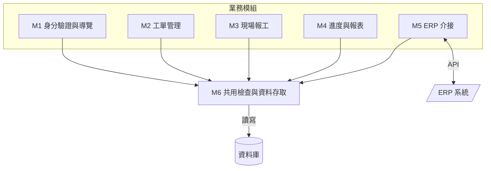
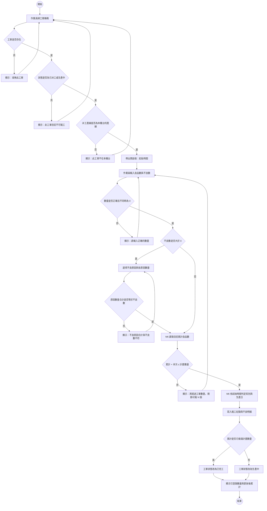
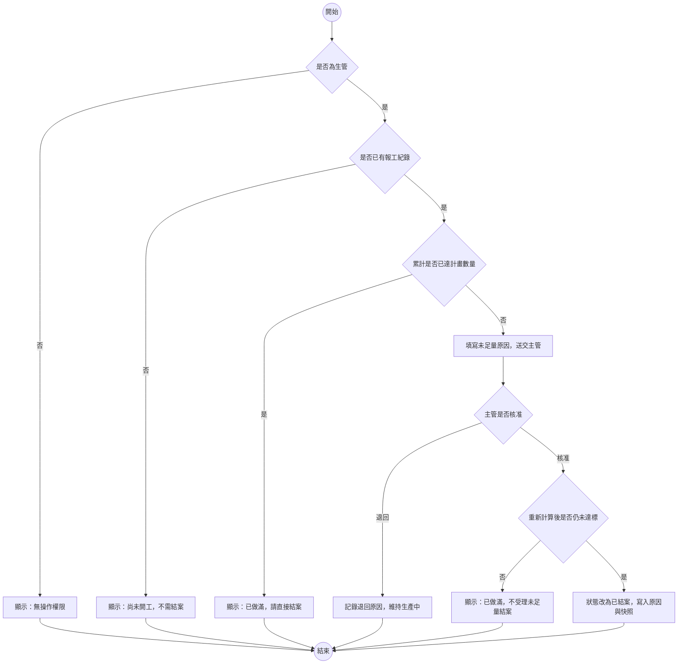
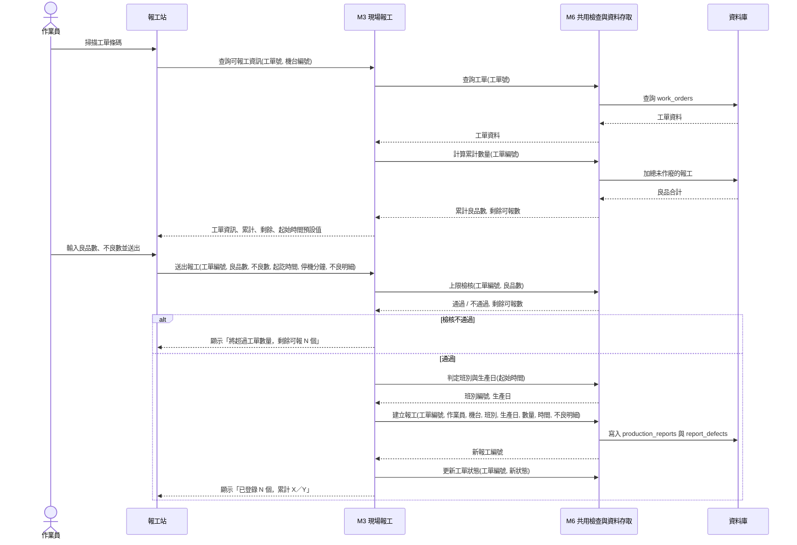
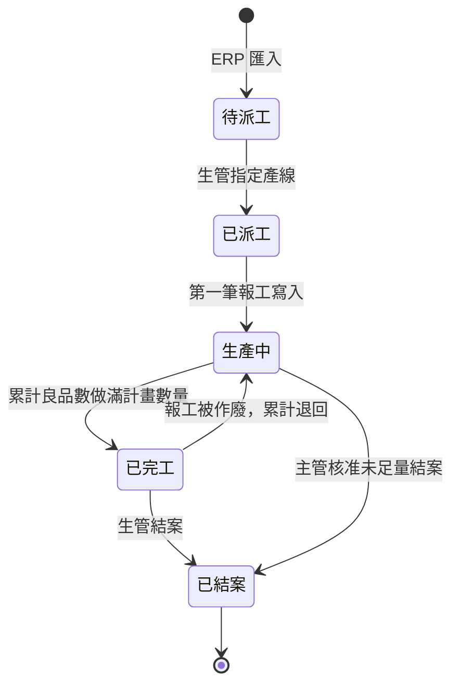
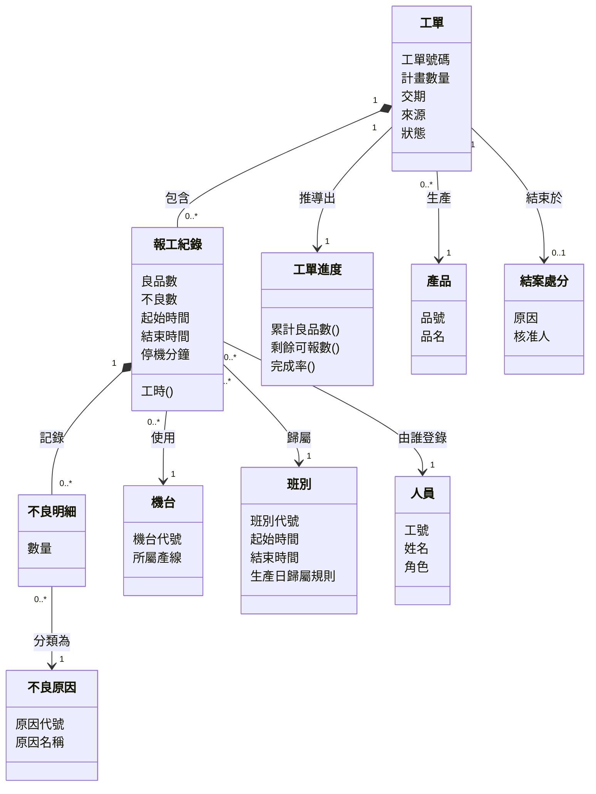
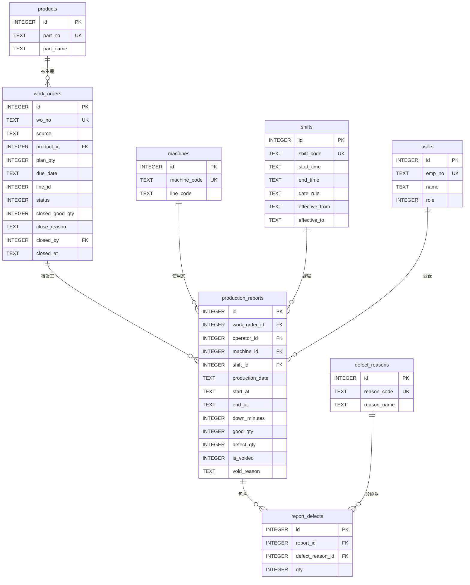
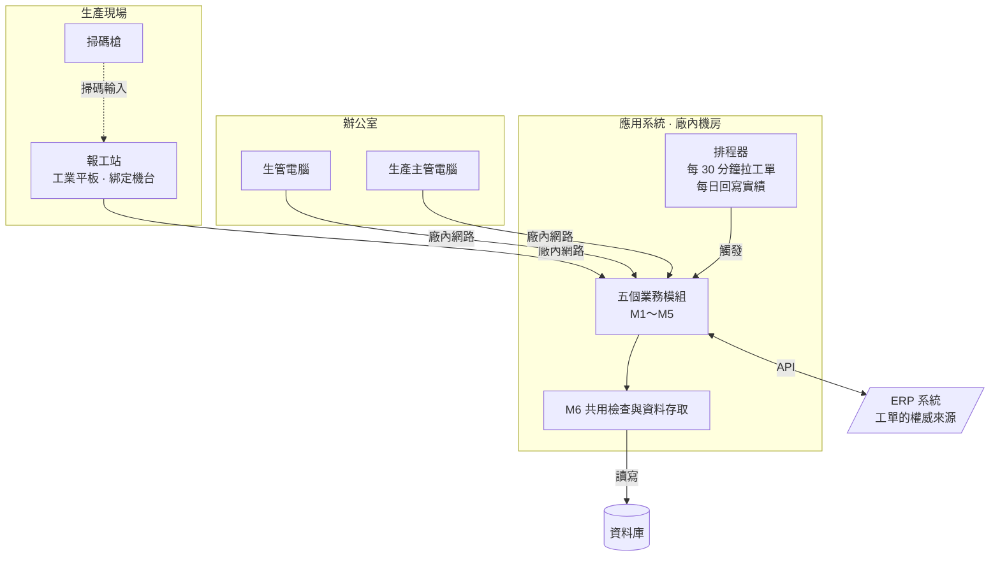

# 系統設計報告：工單派工與現場報工系統

> 這是一份寫好的期末書面報告，內容依[「報告內容」](../00-Course-Introduction/Report-Contents.md)〈二、期末小組報告〉的八項排列，最後附上必做的分工紀錄。每一項該有哪些欄位、為什麼要這樣寫、方法出自哪一章，見[「系統設計範例報告說明」](Design-Phase-Deliverables.md)；這份只放成品。
>
> 題目本身的情境、名詞與設計難點，見[「工單派工與現場報工系統」](../02-Project-Topics/Work-Order-and-Reporting.md)。
>
> **各組題目不同，內容要換成自己那一題的。** 篇幅也不是標準——這裡每一項都收得很緊。

---

## 報告基本資料

| 項目 | 內容 |
|---|---|
| 課程 | 系統分析與設計（IE226）115-1 |
| 報告階段 | 期末小組報告（系統設計） |
| 設計題目 | 工單派工與現場報工系統 |
| 組別 | 第 3 組 |
| 組員 | 小明（1130001）、阿花（1130002）、阿宏（1130003）、阿凱（1130005，第 11 週轉入；小美於同期轉出） |
| 書面繳交日 | 2026/12/18 |
| 口頭報告日 | 2026/12/23 |

各成員負責的章節與圖表、組員異動的接手情形，見文末的〈附錄：分工紀錄〉。

**本報告用到的現場名詞**：**工單**是一張生產指令，寫明要做哪個產品、做幾個、什麼時候要交；**報工**是作業員把剛做完的一批數量與時間登記進系統；**良品**是做出來合格的、**不良**是不合格的；**班別**是早、中、晚三班的上班時段；**ERP**（Enterprise Resource Planning，企業資源規劃系統）是公司既有的管理系統，工單原本就開在那裡。

---

## 1. 設計基礎與需求摘要

### 1.1 問題背景

這一節說明現在的作業方式有什麼問題，以及本設計打算怎麼回應。

工單目前印成紙本，貼在機台旁的看板上。作業員每個班別結束時，在工單背面手寫做了幾個、幾個不良、幾點做到幾點；班長下班前收單，隔天早上交給生管，生管再把數字輸入電腦。

| 編號 | 問題 | 本設計如何回應 |
|---|---|---|
| P-01 | 進度隔天才知道，客戶打電話來問，生管答不出來 | 作業員在現場直接登錄，進度由報工紀錄即時加總得出 |
| P-02 | 多人報工加總超過工單數量，到月底盤點才發現 | 每次報工寫入前先檢核累計數量（本項有已知限制，見〈7.6〉R-01） |
| P-03 | 不良只記一個數字，不知道原因，改善無從下手 | 不良數大於 0 時，必須登記原因分類與各原因的數量 |
| P-04 | 晚班從 23:00 做到隔天 07:00，產出算哪一天各班說法不一 | 班別的起訖時間與生產日歸屬規則存成資料，由系統統一判定 |

### 1.2 主要角色

| 角色 | 使用目標 | 權限範圍 | 最在意 |
|---|---|---|---|
| 生管人員 | 排產、派工、追進度 | 派工、查全部進度與報表、作廢報工紀錄、維護基礎資料 | 進度要準，異常要一眼看得出來 |
| 現場作業員 | 把剛做完的一批登記掉 | 只能對自己機台的工單報工、查自己當班的紀錄 | **要快。** 戴手套、站在噪音裡，交班前只剩三分鐘 |
| 生產主管 | 掌握交期風險、核准例外 | 查全部進度與報表、核准未足量結案 | 交期會不會延誤 |

「最在意」那一欄各自決定了一項設計：作業員那條使報工畫面只留兩個必填欄位（NFR-01）；生管那條使工單清單以完成率與逾期標記排序；主管那條使未足量結案必須經他核准，不由生管自行決定。

### 1.3 核心流程

| 編號 | 流程 | 主要角色 | 起點 | 終點 |
|---|---|---|---|---|
| PR-01 | 工單匯入 | 系統 | 排程每 30 分鐘觸發一次 | 新工單建立，狀態為待派工 |
| PR-02 | 派工 | 生管 | 在工單清單點選派工 | 指定產線，狀態改為已派工 |
| PR-03 | 報工登錄 | 作業員 | 掃工單條碼 | 報工紀錄寫入，工單狀態與累計更新 |
| PR-04 | 報工作廢與重報 | 生管 | 在工單明細點選作廢 | 原紀錄標記為已作廢，累計退回 |
| PR-05 | 結案 | 生管；未足量時需主管核准 | 在工單清單或明細點選結案 | 狀態改為已結案，寫入累計快照 |
| PR-06 | 生產實績回寫 | 系統 | 生產日結算後次日 08:00 | 當日實績送到 ERP |

### 1.4 關鍵需求

#### 功能需求

| 編號 | 功能需求 | 觸發角色 |
|---|---|---|
| FR-01 | 系統定期由 ERP 匯入新工單與工單變更 | 系統 |
| FR-02 | 每個生產日結算後，系統把當日生產實績回寫 ERP | 系統 |
| FR-03 | 生管可把工單派給指定產線 | 生管 |
| FR-04 | 作業員以工號條碼加四位數 PIN 於報工站登入 | 作業員 |
| FR-05 | 作業員可對工單登錄報工，含良品數、不良數、起訖時間與停機分鐘 | 作業員 |
| FR-06 | 不良數大於 0 時須登記不良原因與各原因數量，合計須等於不良數 | 作業員 |
| FR-07 | 報工寫入前須檢核「該工單有效報工的良品數合計 ＋ 本次良品數 ≤ 計畫數量」 | 系統 |
| FR-08 | 報工紀錄不得修改；要更正一律由生管作廢原紀錄後重新登錄，作廢須填原因 | 生管 |
| FR-09 | 未做滿計畫數量就要結案時，須由生產主管核准並填寫原因 | 生管、主管 |
| FR-10 | 生管與主管可查詢工單進度，以及依生產日、產線、班別彙總的日產量報表 | 生管、主管 |

#### 非功能需求

| 編號 | 非功能需求 | 對設計的決定 |
|---|---|---|
| NFR-01 | 報工站須能戴手套單手操作，一次報工不超過三個輸入動作 | 畫面只留兩個必填欄位，其餘由身分、裝置或前一筆紀錄帶出；可點擊的按鈕最小 48×48 像素 |
| NFR-02 | 所有數量檢核與權限檢核都要在伺服器端做 | 畫面上的限制只是提示，後端一律重驗一次 |
| NFR-03 | 報工紀錄不得刪除，更正一律以作廢加重報留下痕跡 | 報工表要有作廢旗標、作廢人、作廢時間與原因四欄；所有加總都排除已作廢的 |
| NFR-04 | 畫面上顯示的工單進度，必須等於當時有效報工紀錄的加總 | 未結案工單的累計數量不存成欄位，每次查詢時重算 |
| NFR-05 | 班別的起訖時間與生產日歸屬規則必須來自資料，不能寫死在程式裡 | 需要班別主檔，判定邏輯集中在同一個共用模組 |

NFR-04 與 NFR-05 是影響最深的兩條，它們各自否決了一個看起來很自然的做法：前者否決「在工單表加一個累計數量欄位」，因為報工可以作廢，那個欄位要跟著改，漏改了沒有人會發現；後者否決「把晚班 23:00 到 07:00 寫在程式裡」，因為換班制度一改就得改程式。

### 1.5 系統邊界與設計範圍

| 範圍內 | 範圍外 | 界線 |
|---|---|---|
| 工單的派工、報工、結案 | 排產順序的決定 | 排什麼順序由生管判斷，系統只記錄結果 |
| 單一工序的報工 | 多工序（每一站分別報工） | 在製品不在站別之間流動 |
| 作業員手動登記數量與時間 | 由機台自動取數 | 凡是要接設備訊號的一律界外 |
| 與 ERP 交換工單與生產實績 | 與其他系統的介接 | 只做工單進來、實績出去兩條 |

本系統與 ERP 交換資料，介接內容見〈5.4〉。

### 1.6 需求取捨

#### 延後處理

| 需求 | 延後理由 | 延後的代價 | 何時該做 |
|---|---|---|---|
| 離線報工暫存與補傳 | 要在報工站存一份待送資料，複雜度高於本次時程 | 網路斷線期間報不了工，只能先寫紙本事後補登，時間會失真 | 現場網路實測有死角時必須做，見 R-04 |
| 停機事由分類 | 目前只記停機總分鐘數，分幾類還沒談定 | 知道停了 40 分鐘，但不知道是換線、待料還是故障 | 不良原因分類上線並穩定後，見 O-02 |
| 一人顧多台機時的工時分攤 | 要多一個「同時操作幾台機台」的欄位，而那個欄位很容易被忘記改回來 | 一個人顧三台機時，三筆報工的工時會各記八小時，工時統計會偏高 | 工時要用於績效評估之前 |
| 標準工時與效率指標 | 標準工時的資料來源與維護責任未定 | 有工時資料但算不出效率，主管仍要自己用試算表算 | 基礎資料的維護責任釐清後 |

#### 明確不做

| 項目 | 理由 |
|---|---|
| 自動排程（由系統決定工單先後順序） | 排產要考慮換線時間、模具、人力與臨時插單，這些條件多半不在系統裡；做成自動排程會吃掉整份設計，現場還是會照自己的判斷改 |
| 允許直接修改報工紀錄 | 報工紀錄是品質追溯用的文件，改掉就追不回來。更正一律用「作廢原紀錄＋重新登錄」，兩筆都留著 |

---

## 2. 功能與模組設計

### 2.1 模組清單

這一節把需求整理成六個模組，並說明為什麼這樣切。

| 編號 | 模組 | 類型 | 目的 | 對應需求 |
|---|---|---|---|---|
| M1 | 身分驗證與導覽 | 業務 | 報工站登入、辦公室登入、依身分決定看得到哪些功能 | FR-04 |
| M2 | 工單管理 | 業務 | 派工、結案、未足量結案的申請與核准 | FR-03、FR-09 |
| M3 | 現場報工 | 業務 | 報工登錄、作廢與重報 | FR-05～FR-08 |
| M4 | 進度與報表 | 業務 | 工單進度、日產量報表 | FR-10 |
| M5 | ERP 介接 | 業務 | 匯入工單、回寫生產實績 | FR-01、FR-02 |
| M6 | 共用檢查與資料存取 | 共用 | 權限檢查、班別與生產日判定、累計數量計算、上限檢核，以及所有資料表的讀寫 | NFR-02、NFR-04、NFR-05 |

**M6 在畫面上沒有任何入口**，它只被其他模組呼叫。三項切分決定：

| 決定 | 理由 |
|---|---|
| 上限檢核放在 M6，不放在 M3 | 以後若多一條批次補登的寫入路徑，檢核規則只要有一份 |
| 資料庫讀寫全部收在 M6 | 資料庫語法只出現在一個模組，換資料庫時只改這裡 |
| ERP 介接獨立成 M5，不併進 M2 | M2 的規則是「人怎麼操作工單」，M5 的規則是「兩套系統怎麼對帳」，兩者變動的原因不一樣 |

### 2.2 模組規格

#### M2 工單管理

| 欄位 | 內容 |
|---|---|
| 模組編號 | M2 |
| 目的 | 讓生管管理工單從派工到結案的過程，讓主管核准例外 |
| 使用角色 | 生管、生產主管 |
| 主要輸入 | 派工：工單編號、產線編號<br>結案：工單編號、未足量時的原因 |
| 主要處理 | 1. 權限檢查 2. 檢查工單目前狀態允不允許這個動作 3. 未足量結案要主管核准，核准當下重新算一次累計 4. 結案時寫入累計快照與原因 |
| 主要輸出 | 工單清單頁與明細頁；動作完成後回到原頁並顯示結果 |
| 相依模組 | 呼叫 M6 |
| 對應需求 | FR-03、FR-09 |

未足量結案在核准的當下必須重新算一次累計。原因是主管從看到畫面到按下核准之間，現場可能又報了工使數量剛好做滿，這時候應該改成一般結案。

#### M3 現場報工

| 欄位 | 內容 |
|---|---|
| 模組編號 | M3 |
| 目的 | 讓作業員把剛做完的一批數量與時間登記進系統 |
| 使用角色 | 現場作業員（登錄）；生管（作廢） |
| 主要輸入 | 登錄：工單號碼（掃碼）、良品數、不良數、起訖時間、停機分鐘、不良原因與各原因數量<br>作廢：報工編號、作廢原因 |
| 主要處理 | 1. 檢查已登入、報工站已綁定機台 2. 檢查工單狀態可報工，且派工產線就是本機台所屬產線 3. 檢查數量格式 4. 不良數大於 0 時檢查原因合計 5. 請 M6 算累計並做上限檢核 6. 請 M6 依起始時間判定班別與生產日 7. 寫入報工紀錄與不良明細 8. 依新的累計更新工單狀態 |
| 主要輸出 | 成功時顯示「已登錄 N 個，累計 X／Y」，清空數量欄；失敗時保留已輸入的數字並顯示錯誤 |
| 相依模組 | 呼叫 M6 |
| 對應需求 | FR-05～FR-08、NFR-01～NFR-04 |

檢查的順序是刻意排的：工單與機台的檢查排在數量輸入之前，因為掃錯工單是現場最常見的錯誤，等數字都打完才退回來，作業員會很不耐煩。

第 5 步與第 7 步之間有一個空隙：算累計和寫入資料是兩個分開的動作，兩筆同時進來的報工會讀到同一個舊數字。這是本設計已知的限制，完整推演見〈7.6〉R-01。

#### M6 共用檢查與資料存取

| 欄位 | 內容 |
|---|---|
| 模組編號 | M6 |
| 目的 | 集中放「不只一個模組會用到、而且規則改了要一次改完」的邏輯與資料存取 |
| 使用角色 | 無直接使用者，只被其他模組呼叫 |
| 主要輸入 | 各模組傳入的工單編號、時間、身分與資料內容 |
| 主要處理 | 1. 權限檢查 2. 依起始時間與班別主檔判定班別與生產日 3. 累計良品數與不良數計算（只算未作廢的） 4. 上限檢核 5. 各資料表的查詢、新增與更新 |
| 主要輸出 | 判定類回傳成立與否；計算類回傳數字；資料存取回傳查到的資料或新編號 |
| 相依模組 | 直接讀寫資料庫 |
| 對應需求 | NFR-02、NFR-04、NFR-05 |

寫入報工紀錄與它的不良明細必須一次完成：一筆有不良數卻沒有不良明細的報工是壞掉的資料，所以兩者要嘛都成功、要嘛都不寫進去。這是本設計唯一需要這種保護的地方。

其餘三個模組（M1 身分驗證與導覽、M4 進度與報表、M5 ERP 介接）的規格格式相同，因篇幅在此省略；M5 的處理內容見〈5.4〉。

### 2.3 模組相依關係



五個業務模組彼此不互相呼叫，全部透過 M6 發生關係。圖上唯一的雙向箭頭是 M5 對外連 ERP，那是兩套系統之間的往返，不是內部的循環呼叫。

### 2.4 CRUD 矩陣

| 模組 | `work_orders` | `production_reports` | `report_defects` | 基礎資料表 |
|---|:---:|:---:|:---:|:---:|
| M1 身分驗證與導覽 | — | — | — | R |
| M2 工單管理 | R U | R | — | R |
| M3 現場報工 | R U | C R U | C R | R |
| M4 進度與報表 | R | R | R | R |
| M5 ERP 介接 | C R U | R | — | R |

C 建立、R 讀取、U 更新、D 刪除。M6 不列在表上，因為它是替上面五個模組執行讀寫的，權限跟著呼叫它的模組走。

**整張矩陣沒有任何一個 D。** 報工紀錄與工單依 NFR-03 不能實體刪除，基礎資料則用停用旗標取代刪除。

兩格需要說明：

| 位置 | 說明 |
|---|---|
| M3 對 `work_orders` 有 U | 累計良品數做滿計畫數量時，報工模組要把工單狀態改成已完工。這是跨出自己主表的更新，**只限狀態這一欄** |
| M2 與 M5 都對 `work_orders` 有 C、U | 以來源欄位區隔：M5 只寫由 ERP 匯入的工單，M2 只寫廠內自建的臨時工單，且 M2 不得改動 ERP 來源工單的計畫數量與交期 |

---

## 3. 主要流程與互動設計

### 3.1 活動圖：報工登錄（PR-03）

> **主要角色**：現場作業員
> **觸發事件**：作業員在報工站掃描工單條碼
> **前置條件**：已登入報工站；該報工站已綁定機台
> **例外情況**：工單不存在、狀態不可報工、工單不在本機台、數量格式錯誤、不良原因合計不符、超過工單數量
> **完成後狀態**：報工紀錄與不良明細寫入；工單狀態依新的累計更新



三項設計決定：三個工單檢查（D1～D3）排在輸入數量之前，避免打完數字才被退回；超量的訊息要帶出剩餘可報數，否則作業員不知道該改成幾個；D8 排在寫入之後，因為工單狀態是由累計數量算出來的，要先確定數量已經寫進去。

D7 到 A7 之間沒有保護，這是已知限制 R-01。

### 3.2 活動圖：未足量結案（PR-05）

> **主要角色**：生管（申請）、生產主管（核准）
> **觸發事件**：工單做不下去了，生管在工單明細頁申請未足量結案
> **前置條件**：工單已有報工紀錄，且累計未達計畫數量
> **完成後狀態**：工單狀態為已結案，寫入原因、核准人與累計快照

這條流程跨三個角色，用泳道表呈現誰做什麼：

| 步驟 | 生管 | 系統 | 生產主管 |
|:--:|---|---|---|
| 1 | 在工單明細頁點選「申請未足量結案」 | | |
| 2 | | 檢查：已有報工紀錄、累計未達標 | |
| 3 | 填寫未足量原因並送出 | | |
| 4 | | 在主管的清單頁標示這張工單待核准 | |
| 5 | | | 檢視工單、累計數量與原因 |
| 6 | | | 核准或退回 |
| 7 | | 核准：**重新算一次累計**，仍未達標才結案並寫入快照 | |
| 8 | | 退回：記錄退回原因，工單維持生產中 | |



C3 與 C5 是同一個檢查做了兩次。兩次之間隔著主管的思考時間，而現場不會停下來等他。

### 3.3 循序圖：報工登錄（PR-03）

這張圖的生命線是模組，不是「系統」這個黑箱，看得出一次報工在系統內部走過哪幾個模組。



累計數量在這張圖裡被查了兩次：掃碼時是為了顯示剩餘可報數，送出時是為了檢核。兩次不能合併——作業員停在畫面上的期間，別人可能已經報了工，用畫面上的舊數字判斷會是錯的。

### 3.4 狀態機圖：工單狀態



| 狀態 | `status` 值 | 可報工 | 可派工 | 可結案 |
|---|:--:|:--:|:--:|:--:|
| 待派工 | 10 | 否 | 是 | 否 |
| 已派工 | 20 | 是 | 是（改派） | 否 |
| 生產中 | 30 | 是 | 否 | 未足量結案需核准 |
| 已完工 | 40 | 否 | 否 | 是 |
| 已結案 | 90 | 否 | 否 | 否 |

三項要點：

- **「已完工 → 生產中」是唯一往回走的轉移。** 報工被作廢會讓累計退回。這條轉移如果實作時漏掉，就會出現一張還沒做完卻永遠掛在已完工的工單，而且沒有人會察覺。
- **「待派工 → 生產中」沒有箭頭**，這是刻意的。沒派工的工單不接受報工，因為報工要靠「工單的派工產線＝本機台的產線」來確認掃對了工單。
- **狀態值不連號**，中間留出號碼給以後可能加進來的狀態（例如「暫停」），免得到時候整組值重編。

---

## 4. 資料設計

### 4.1 概念類別圖

這一節先問「這個領域有哪些概念」，再決定哪些要存進資料庫。



**括號結尾的屬性是算出來的，不是存下來的**，例如「工時()」與工單進度的三個屬性。

### 4.2 從概念到資料表的落地決定

| 概念 | 是否成為資料表 | 落到哪裡 |
|---|---|---|
| 工單 | 是 | `work_orders` |
| 報工紀錄 | 是 | `production_reports` |
| 不良明細 | 是 | `report_defects` |
| 班別 | 是 | `shifts` |
| 產品、機台、人員、不良原因 | 是 | 四張基礎資料表，見〈4.5〉 |
| **工單進度** | **否** | 三個屬性全是算出來的，由報工紀錄即時加總，見〈4.3〉 |
| **工時** | **否** | 由同一筆報工的起訖時間與停機分鐘算出，見〈4.10〉 |
| **結案處分** | **否** | 一張工單最多一筆、多數工單沒有，併成 `work_orders` 上的四個可空欄位 |
| **生產日** | **是，成為欄位** | 雖然是算出來的，仍存進 `production_reports.production_date`，理由見〈4.3〉 |

「工單進度」與「工時」列在圖上卻不落地，是刻意留下的紀錄：本設計知道它們存在，也知道它們是算出來的，不是漏掉了。

### 4.3 推導值該存還是該算

本設計有三個推導值需要決定，判準統一如下：

> **推導值要不要存下來，看它的計算依據會不會隨時間改變。依據不會變就用算的，依據會被人改就存下來。**

| 推導值 | 計算依據 | 依據會不會變 | 決定 | 理由 |
|---|---|:--:|:--:|---|
| 未結案工單的累計良品數 | 該工單所有未作廢的報工紀錄 | 不會。報工不能改，只能作廢，作廢的紀錄也留在表裡 | **用算的** | 任何時候重算都得到同一個答案。存成欄位反而多一份要維護，而且漏維護的錯誤沒有人會發現（NFR-04） |
| 報工的工時 | 同一筆報工上的起訖時間與停機分鐘 | 不會，全部在同一筆不會變的紀錄裡 | **用算的** | 同上。存下來還會出現「時間改了但工時沒改」的不一致 |
| 報工的班別與生產日 | 班別主檔的起訖時間與歸屬規則 | **會。** 換班制度改變時主檔會被改 | **存下來** | 如果每次重算，去年的報工會用今年的班表重新歸屬，歷史報表的數字會自己變動 |

第一列與第三列的結論相反，但用的是同一條判準。

已結案的工單另外存一份累計快照，純粹是為了效能：結案的工單佔多數，每次查歷史報表都重新加總不划算。這件事成立的前提是「結案後累計不再變動」，所以配套一條規則：**已結案的工單不接受報工作廢，要更正必須先撤銷結案**（撤銷的畫面本次未設計，見 O-03）。

### 4.4 實體關聯圖



兩項拆表決定：

| 決定 | 理由 | 代價 |
|---|---|---|
| 工單與報工拆成主檔／明細兩張表 | 一張工單會跨三天、三班、五個人陸續做完，數量與時間屬於「一次報工」而不是「一張工單」 | 進度必須由明細加總得出，於是有了〈4.3〉的取捨 |
| 不良明細再拆一張表 | 一次報工的 12 個不良可能有兩三種原因，塞回報工紀錄只記得下一種，統計會失真 | 報工畫面多一層輸入，用「不良為 0 時整區不顯示」化解（見〈6.3〉） |

三層結構的判準是每一層的「一筆」代表的東西不同：一張工單是一個生產指令，一筆報工是一個人在一段時間做的一批，一筆不良明細是那一批裡的一種不良。

### 4.5 資料表與鍵值

| 資料表 | 用途 | 主鍵 | 對外參照 | 其他約束 |
|---|---|---|---|---|
| `work_orders` | 工單主檔 | `id` | `product_id`、`closed_by` | `wo_no` 唯一；`plan_qty` 大於 0；`status` 限五個值 |
| `production_reports` | 報工紀錄 | `id` | `work_order_id`、`operator_id`、`machine_id`、`shift_id` | 四個外鍵欄與 `production_date` 不可空；數量為非負整數；`end_at` 晚於 `start_at` |
| `report_defects` | 報工不良明細 | `id` | `report_id`、`defect_reason_id` | `qty` 大於 0；同一筆報工的同一原因不得重複 |
| `shifts` | 班別主檔 | `id` | 無 | 同一班別代號的生效期間不得重疊 |

另有四張基礎資料表：`products` 產品、`machines` 機台（含所屬產線）、`users` 人員、`defect_reasons` 不良原因。四張表的結構都是「代號＋名稱＋停用旗標」，**要退場一律改停用旗標，不刪除**，因為既有的工單與報工紀錄還參照著它們。

外鍵在資料庫層宣告，刪除行為設為禁止。理由是報工紀錄要能追溯到人、機、時，必須保證每一筆報工都指得到真實存在的工單、機台與人員，這個保證交給程式自律太脆弱。

### 4.6 資料字典：`work_orders`

| 欄位名稱 | 中文名稱 | 型別 | 必填 | 值域／格式 | 資料來源 |
|---|---|---|---|---|---|
| `id` | 工單編號 | INTEGER | 是 | 主鍵，系統流水號 | 系統產生 |
| `wo_no` | 工單號碼 | TEXT | 是 | 唯一；ERP 來源沿用 ERP 編碼，本廠來源為 `T` 開頭 | ERP 或系統產生 |
| `source` | 來源 | TEXT | 是 | `ERP`、`LOCAL` | 系統依建立途徑決定 |
| `product_id` | 產品編號 | INTEGER | 是 | 對應 `products.id` | ERP 帶入或使用者選擇 |
| `plan_qty` | 計畫數量 | INTEGER | 是 | 大於 0；來源為 `ERP` 時本系統唯讀 | ERP 或使用者輸入 |
| `due_date` | 交期 | TEXT | 是 | `YYYY-MM-DD`；同上唯讀規則 | 同上 |
| `line_code` | 派工產線 | TEXT | 否 | 未派工時為空 | 生管指定 |
| `status` | 狀態 | INTEGER | 是 | `10`／`20`／`30`／`40`／`90`，對照見〈3.4〉 | 系統依事件轉移 |
| `closed_good_qty` | 結案良品快照 | INTEGER | 否 | 結案當下的累計良品數 | 系統計算後寫入 |
| `close_reason` | 結案原因 | TEXT | 否 | 未足量結案時必填 | 生管輸入 |
| `closed_by` | 核准人 | INTEGER | 否 | 對應 `users.id` | 由登入身分帶入 |
| `closed_at` | 結案時間 | TEXT | 否 | `YYYY-MM-DD HH:MM:SS` | 系統產生 |

`plan_qty` 與 `due_date` 的唯讀規則看 `source`：來源是 ERP 的工單，這兩欄在本系統不可編輯，只能由同步更新；本廠自建的臨時工單才可以由生管修改。

### 4.7 資料字典：`production_reports`

| 欄位名稱 | 中文名稱 | 型別 | 必填 | 值域／格式 | 資料來源 |
|---|---|---|---|---|---|
| `id` | 報工編號 | INTEGER | 是 | 主鍵，系統流水號 | 系統產生 |
| `work_order_id` | 工單編號 | INTEGER | 是 | 對應 `work_orders.id` | 掃碼帶入 |
| `operator_id` | 作業員編號 | INTEGER | 是 | 對應 `users.id` | **由登入身分帶入，不由畫面輸入** |
| `machine_id` | 機台編號 | INTEGER | 是 | 對應 `machines.id` | **由報工站的裝置設定帶入** |
| `shift_id` | 班別編號 | INTEGER | 是 | 對應 `shifts.id` | 由 M6 依 `start_at` 判定，判定後即固定 |
| `production_date` | 生產日 | TEXT | 是 | `YYYY-MM-DD` | 由 M6 依班別的 `date_rule` 判定，同上 |
| `start_at` | 起始時間 | TEXT | 是 | `YYYY-MM-DD HH:MM`；預設為同機台前一筆的結束時間 | 預設帶出，可改 |
| `end_at` | 結束時間 | TEXT | 是 | 同上；須晚於 `start_at` | 預設為當下時間，可改 |
| `down_minutes` | 停機分鐘 | INTEGER | 是 | 非負整數；預設 `0` | 使用者輸入 |
| `good_qty` | 良品數 | INTEGER | 是 | 非負整數 | 使用者輸入 |
| `defect_qty` | 不良數 | INTEGER | 是 | 非負整數；大於 0 時明細合計須等於本欄 | 使用者輸入 |
| `is_voided` | 是否已作廢 | INTEGER | 是 | `1` 已作廢、`0` 有效；預設 `0` | 生管執行作廢時改 |
| `void_reason` | 作廢原因 | TEXT | 否 | 作廢時必填 | 生管輸入 |

NFR-01 要求作業員只做三個輸入動作，所以這張表多數欄位不由畫面輸入：

| 來源 | 欄位 | 怎麼取得 |
|---|---|---|
| 登入身分 | `operator_id` | 作業員登入後才能報工，身分已經知道 |
| 裝置設定 | `machine_id` | 報工站固定在機台旁，一台裝置對一台機台，裝機時設定一次 |
| 前一筆紀錄 | `start_at` | 同一台機台，這一批的開始通常就是上一批的結束 |
| 系統推導 | `shift_id`、`production_date` | 由 `start_at` 與班別主檔算出來 |

`shift_id` 與 `production_date` 標明「判定後即固定」：班別主檔之後怎麼改，都不影響已經寫進去的紀錄。

### 4.8 資料字典：`report_defects`

| 欄位名稱 | 中文名稱 | 型別 | 必填 | 值域／格式 |
|---|---|---|---|---|
| `id` | 明細編號 | INTEGER | 是 | 主鍵，系統流水號 |
| `report_id` | 報工編號 | INTEGER | 是 | 對應 `production_reports.id` |
| `defect_reason_id` | 不良原因編號 | INTEGER | 是 | 對應 `defect_reasons.id` |
| `qty` | 數量 | INTEGER | 是 | 大於 0；同一筆報工的各列合計須等於 `production_reports.defect_qty` |

本表不設作廢旗標。報工被作廢時它的不良明細跟著失效，所有統計都以「報工未作廢」為前提過濾，不必在明細上再標一次。

### 4.9 資料字典：`shifts`

| 欄位名稱 | 中文名稱 | 型別 | 必填 | 值域／格式 | 說明 |
|---|---|---|---|---|---|
| `id` | 班別編號 | INTEGER | 是 | 主鍵 | — |
| `shift_code` | 班別代號 | TEXT | 是 | 與生效期間合併判斷唯一 | `A`、`B`、`C` |
| `shift_name` | 班別名稱 | TEXT | 是 | — | 早班、中班、晚班 |
| `start_time` | 起始時間 | TEXT | 是 | `HH:MM` | 晚班為 `23:00` |
| `end_time` | 結束時間 | TEXT | 是 | `HH:MM` | 晚班為 `07:00` |
| `date_rule` | 生產日歸屬規則 | TEXT | 是 | `START_DAY` 算起始日、`END_DAY` 算結束日 | 本廠晚班設為 `START_DAY` |
| `effective_from` | 生效起日 | TEXT | 是 | `YYYY-MM-DD` | 換班制度時新增一列 |
| `effective_to` | 生效迄日 | TEXT | 否 | 空值代表目前仍生效 | 新增新列時填上舊列的迄日 |

本廠目前的班別設定：

| 代號 | 名稱 | 起 | 迄 | 生產日歸屬 |
|---|---|---|---|---|
| A | 早班 | 07:00 | 15:00 | 起始日 |
| B | 中班 | 15:00 | 23:00 | 起始日 |
| C | 晚班 | 23:00 | 07:00 | **起始日**（23:00 到隔天 07:00 的產出全算前一天） |

`date_rule` 回答了「晚班跨日的產出算哪一天」，而且答案放在資料裡而不是程式裡（NFR-05）。班別要異動一律新增一列並填上舊列的生效迄日，不改舊列，這樣事後查得出當時是照哪一套班表判定的。

### 4.10 推導欄位清單

下列數字會出現在畫面上，但不存在任何資料表裡：

| 推導值 | 出現在哪些畫面 | 算式 | 資料來源 |
|---|---|---|---|
| 累計良品數 | UI-02、UI-03、UI-04 | 該工單所有未作廢報工的 `good_qty` 合計；工單已結案時改讀 `closed_good_qty` | `production_reports` 或 `work_orders` |
| 剩餘可報數 | UI-02 | `plan_qty` − 累計良品數 | 兩表 |
| 完成率 | UI-03、UI-04 | 累計良品數 ÷ `plan_qty` | 兩表 |
| 工時（分） | UI-04 | `end_at` − `start_at` − `down_minutes` | `production_reports` 單筆 |

**這四個數字沒有一個存在資料表裡，所以第 8 項的一致性檢查要靠這張表才對得起來。**

### 4.11 畫面欄位與資料表對照

| 畫面 | 畫面欄位 | 存到哪裡 | 誰產生 |
|---|---|---|---|
| UI-01 報工站登入 | 工號、PIN | 比對 `users` 的對應欄位，**都不存** | 掃碼槍與使用者輸入 |
| UI-02 報工登錄 | 工單號碼 | `production_reports.work_order_id` | 掃碼槍 |
| | 品號、品名、計畫數量 | `work_orders` 與 `products`（唯讀顯示） | 帶出 |
| | 累計、剩餘 | **不存**，見〈4.10〉 | 推導 |
| | 良品數、不良數 | `good_qty`、`defect_qty` | 使用者輸入 |
| | 起始／結束時間、停機分鐘 | `start_at`、`end_at`、`down_minutes` | 預設帶出，可改 |
| | 不良原因與各原因數量 | `report_defects` 的兩欄 | 使用者輸入 |
| | 作業員、機台 | `operator_id`、`machine_id`（只顯示，不可改） | 身分與裝置帶入 |
| UI-03 工單清單 | 工單號碼、品號、計畫數量、交期、產線、狀態 | `work_orders` 與 `products` | 帶出 |
| | 已報、完成率、逾期標記 | **不存**，見〈4.10〉 | 推導 |
| UI-04 工單明細 | 報工紀錄列表 | `production_reports` 各欄 | — |
| | 工時 | **不存**，見〈4.10〉 | 推導 |
| | 已作廢的紀錄 | 由 `is_voided` 顯示為刪除線並附作廢原因，**不從畫面上消失** | NFR-03 |

已作廢的報工紀錄仍然顯示在畫面上，跟一般系統「標記後就從畫面消失」相反。理由是報工紀錄要能追溯，而「這筆為什麼被作廢」正是事後最需要知道的資訊。

---

## 5. 系統環境、架構與資料交換設計

### 5.1 整體架構



| 面向 | 本設計 |
|---|---|
| 有哪些部分 | 現場報工站、辦公室電腦、應用系統、資料庫、排程器、ERP |
| 各部分在哪裡 | 應用系統與資料庫在廠內機房；報工站在產線現場；ERP 在另一台既有主機 |
| 彼此怎麼連 | 報工站與辦公室走廠內網路連應用系統；應用系統以 API 連 ERP |
| 誰主動 | 使用者操作由用戶端發起；**與 ERP 的兩條同步由排程器發起，不由使用者觸發** |
| 業務規則放在哪 | 全部在應用系統。報工站只負責顯示、收集輸入與掃碼 |

### 5.2 非功能需求對架構的決定

| 需求 | 架構上的結果 |
|---|---|
| NFR-01 三個動作內完成報工 | 報工站綁定機台，機台編號由裝置設定提供，於是多出「一台裝置對一台機台」的部署約束 |
| NFR-02 檢核在伺服器端 | 報工站不做任何判斷；就算有人繞過畫面直接送資料，一樣會被 M6 擋下 |
| NFR-04 進度等於有效報工的加總 | 累計不存成欄位，每次查工單清單都要對報工表加總；以「已結案讀快照、只即時加總未結案」化解效能負擔 |
| NFR-05 班別規則來自資料 | 判定邏輯集中在 M6，班別主檔成為系統的設定來源之一 |
| ERP 同步不得影響現場報工 | **同步一律由排程器單獨觸發**，不掛在任何使用者的操作路徑上 |

最後一列是架構層級的隔離，不是程式裡的錯誤處理：現場報工那條路徑上根本沒有 ERP，所以 ERP 變慢或連不上時，產線不會受影響。如果改成「作業員掃工單時順便去問 ERP」，ERP 一慢，整條產線就報不了工。

### 5.3 使用環境與部署

| 面向 | 本設計 |
|---|---|
| 使用裝置 | 現場：13 吋固定式工業平板，觸控，配掃碼槍，沒有實體鍵盤<br>辦公室：一般桌上型電腦 |
| 使用場域 | 產線旁，噪音約 85 分貝、有油污、部分區域照度偏低 |
| 操作者狀態 | 戴棉紗手套，站姿，常常一手拿料一手操作 |
| 網路 | 廠內無線網路，產線區穩定，倉庫與走道有死角 |
| 同時使用人數 | 報工站約 20 台，尖峰在交班前十分鐘同時送出 |
| 資料量 | 每日工單數十張、報工數百筆；三年保存約數十萬筆 |
| 部署方式 | 應用系統與資料庫放在廠內機房的一台伺服器；報工站以瀏覽器連線，裝機時設定綁定的機台 |
| 備份 | 每日全量備份保留 30 日，每月封存一次保留三年 |

「尖峰在交班前十分鐘」是設計條件而不是背景資訊：二十台報工站在同一個十分鐘內集中送出，正是評估 R-01 發生機率的依據。

### 5.4 系統間資料交換

本系統與 ERP 雙向交換資料，兩個介接各自要交代五件事：

| 項目 | 介接一：工單匯入 | 介接二：生產實績回寫 |
|---|---|---|
| 資料來源 | ERP | 本系統 |
| 資料去向 | 本系統 | ERP |
| 交換內容 | 工單號碼、品號、計畫數量、交期 | 工單號碼、生產日、良品數、不良數、工時合計 |
| 交換時機或頻率 | 每 30 分鐘一次，取上次成功同步之後的異動 | 每個生產日結算後（次日 08:00）一次 |
| 失敗如何處理 | 保留上次成功同步時間、不往前推進；工單清單頁顯示「同步異常，最後成功時間 XX」；生管可先建臨時工單讓現場開工 | 寫入待重送清單，重試三次後標記為需人工處理；**不因回寫失敗而回滾或鎖住任何報工紀錄** |

兩個介接的失敗處置都是「繼續」，但方式不同：

- 工單拉不到時現場可能沒有工單可報，所以必須留一條人工路徑（臨時工單），否則一個外部系統故障就會停住整條產線。臨時工單標記來源為 `LOCAL`，等 ERP 恢復後由生管手動核對。
- 實績回寫失敗時，現場的報工已經發生、資料也在，回滾沒有意義，所以只重送，不動任何既有資料。

兩條處置背後是同一個原則：**現場實際發生的事情是事實，外部系統知不知道是另一回事。**

欄位對照表與傳輸格式屬於介接的詳細規格，列為可選項目，本次未做。

---

## 6. 使用者介面原型

### 6.1 畫面清單

| 編號 | 畫面 | 服務角色 | 對應需求 | 對應流程 |
|---|---|---|---|---|
| UI-01 | 報工站登入頁 | 作業員 | FR-04、NFR-01 | — |
| UI-02 | 報工登錄頁 | 作業員 | FR-05～FR-07、NFR-01、NFR-02 | PR-03 |
| UI-03 | 工單清單頁 | 生管、主管 | FR-03、FR-09、FR-10 | PR-02、PR-05 |
| UI-04 | 工單明細與報工紀錄頁 | 生管、主管 | FR-08、FR-09、FR-10 | PR-04、PR-05 |

基礎資料維護與日產量報表兩個畫面結構單純（清單加表單、條件加表格），本次不另附線框圖。

### 6.2 UI-01 報工站登入頁

```text
┌─────────────────────────────────────────────┐
│              報工站 · 機台 A-03              │
├─────────────────────────────────────────────┤
│                                             │
│   工號  ┌──────────────────────┐            │
│         │  請掃描工號條碼       │            │
│         └──────────────────────┘            │
│                                             │
│   PIN   ┌────────┐  ┌─────┬─────┬─────┐    │
│         │ ● ● ● ●│  │  1  │  2  │  3  │    │
│         └────────┘  ├─────┼─────┼─────┤    │
│                     │  4  │  5  │  6  │    │
│                     ├─────┼─────┼─────┤    │
│                     │  7  │  8  │  9  │    │
│                     ├─────┼─────┼─────┤    │
│                     │  ←  │  0  │  C  │    │
│                     └─────┴─────┴─────┘    │
│                                             │
│           [        登  入        ]          │
└─────────────────────────────────────────────┘
```

| 項目 | 內容 |
|---|---|
| 畫面欄位 | 工號（掃碼輸入）、PIN（四位數字）。兩者都只用來比對，不儲存 |
| 操作與後果 | 掃碼 → 工號填入並跳到 PIN 欄<br>數字鍵 → 輸入 PIN，滿四碼自動送出<br>「登入」→ 成功導向 UI-02，失敗顯示「工號或 PIN 錯誤」 |

頂端固定顯示本站綁定的機台，作業員走錯站時看得出來。工號錯與 PIN 錯共用同一則訊息，避免有人靠訊息差異試出哪些工號存在。

### 6.3 UI-02 報工登錄頁

```text
┌─────────────────────────────────────────────────────────┐
│ 報工站 · 機台 A-03              張大明（作業員）  登出   │
├─────────────────────────────────────────────────────────┤
│ 工單  WO-2026-0815-003                   [ 重新掃碼 ]    │
│ 品號  PN-4471  側板外殼                                  │
│ 計畫  5,000     已報 4,120     剩餘 880                  │
├─────────────────────────────────────────────────────────┤
│                                                         │
│  良品數  ┌──────────────┐    ┌─────┬─────┬─────┐        │
│          │        120   │    │  1  │  2  │  3  │        │
│          └──────────────┘    ├─────┼─────┼─────┤        │
│                              │  4  │  5  │  6  │        │
│  不良數  ┌──────────────┐    ├─────┼─────┼─────┤        │
│          │          0   │    │  7  │  8  │  9  │        │
│          └──────────────┘    ├─────┼─────┼─────┤        │
│                              │  ←  │  0  │  C  │        │
│                              └─────┴─────┴─────┘        │
├─────────────────────────────────────────────────────────┤
│ ▸ 時間與停機   08:00–10:30 ・ 停機 0 分         [修改]   │
├─────────────────────────────────────────────────────────┤
│               [        送  出        ]                   │
└─────────────────────────────────────────────────────────┘
```

不良數大於 0 時，畫面才長出不良原因區：

```text
├─────────────────────────────────────────────────────────┤
│ 不良原因（合計須等於 12）                    已填 12 ✓   │
│  ┌────────────┐ ┌──────┐   ┌────────────┐ ┌──────┐     │
│  │ D01 尺寸超差│ │   8  │   │ D04 毛邊   │ │   4  │     │
│  └────────────┘ └──────┘   └────────────┘ └──────┘     │
│  [ + 新增一項原因 ]                                      │
├─────────────────────────────────────────────────────────┤
```

| 項目 | 內容 |
|---|---|
| 畫面欄位 | 見〈4.11〉。頂端三列唯讀，「已報／剩餘」是推導值（〈4.10〉） |
| 操作與後果 | 掃碼 → 帶出工單資訊與預設值<br>數字鍵盤 → 填入目前作用中的數量欄<br>「修改」→ 展開時間與停機分鐘<br>「送出」→ 通過全部檢核後寫入，成功則清空數量欄、更新累計，**停留在本頁準備下一批** |

每一項設計都在回應一個現場限制：

| 設計 | 回應的限制 |
|---|---|
| 只有兩個必填欄位 | 交班前只剩三分鐘，其餘欄位由身分、裝置與前一筆紀錄帶出（NFR-01） |
| 大型數字鍵盤取代系統鍵盤 | 戴手套點不準小按鍵 |
| 時間與停機收在摺疊區 | 多數情況不必改，把不常用的藏起來而不是刪掉 |
| 不良原因用大方塊按鈕，不用下拉選單 | 下拉要點開、捲動、再點一次，戴手套很慢 |
| 不良數為 0 時整區不顯示 | 化解〈4.4〉「多一張表就多一層輸入」的代價 |
| 送出後停在本頁並清空數量 | 同一台機台常連續報好幾批，跳走再回來是多餘的兩次操作 |

### 6.4 UI-03 工單清單頁

```text
┌────────────────────────────────────────────────────────────────┐
│ 生產報工系統 · 工單管理          報表 | 王生管 | 登出           │
├────────────────────────────────────────────────────────────────┤
│ ⚠ ERP 同步異常，最後成功時間 08-09 10:30   [ 建立臨時工單 ]     │
├────────────────────────────────────────────────────────────────┤
│ [全部][待派工][已派工][生產中][已完工][已結案]   ┌────┐ [搜尋] │
├────────────────────────────────────────────────────────────────┤
│ 工單號          │品號   │計畫 │已報 │完成率│交期  │狀態  │操作 │
│─────────────────┼───────┼─────┼─────┼──────┼──────┼──────┼─────│
│ WO-2026-0815-003│PN-4471│5,000│4,120│ 82%  │08-12 │生產中│明細 │
│ WO-2026-0815-007│PN-2210│1,200│1,200│100%  │08-10 │已完工│結案 │
│ WO-2026-0816-001│PN-4471│3,000│    0│  0%  │08-09❗│待派工│派工 │
├────────────────────────────────────────────────────────────────┤
│                    « 上一頁   1 / 4   下一頁 »                  │
└────────────────────────────────────────────────────────────────┘
```

| 項目 | 內容 |
|---|---|
| 畫面欄位 | 見〈4.11〉。「已報」「完成率」「逾期標記」都是推導值（〈4.10〉） |
| 操作與後果 | 狀態頁籤 → 重新載入清單<br>「明細」→ 導向 UI-04<br>「派工」→ 選產線，確認後狀態改為已派工<br>「結案」→ 寫入累計快照<br>「建立臨時工單」→ **只在 ERP 同步異常時出現** |
| 依身分的差異 | 生管看得到全部工單；主管另可核准未足量結案；作業員看不到本畫面 |

頂端的 ERP 同步警示不是錯誤訊息，是狀態顯示：同步異常時系統照常運作，只是工單資料不是最新的，生管必須知道這件事，否則會以為今天沒有新工單。

### 6.5 UI-04 工單明細與報工紀錄頁

```text
┌─────────────────────────────────────────────────────────────────┐
│ 工單明細 WO-2026-0815-003          返回清單 | 王生管 | 登出      │
├─────────────────────────────────────────────────────────────────┤
│ 品號 PN-4471 側板外殼   計畫 5,000   交期 08-12   狀態 生產中    │
│ 累計良品 4,120（82%）   累計不良 96   剩餘 880                   │
│                                   [ 申請未足量結案 ]            │
├─────────────────────────────────────────────────────────────────┤
│ 報工紀錄（12 筆，含已作廢 1 筆）                                 │
│ 編號│生產日│班別│機台 │作業員│良品 │不良│工時 │操作              │
│─────┼──────┼────┼─────┼──────┼─────┼────┼─────┼──────────────────│
│ 118 │08-09 │早班│A-03 │張大明│ 195 │  0 │1.0h │作廢              │
│ 117 │08-09 │早班│A-03 │張大明│ ~15~│  0 │0.7h │已作廢・數量誤植   │
│ 116 │08-09 │早班│A-03 │張大明│ 150 │ 12 │0.8h │作廢              │
└─────────────────────────────────────────────────────────────────┘
```

| 項目 | 內容 |
|---|---|
| 畫面欄位 | 見〈4.11〉。工時是推導值；已作廢紀錄的數量以刪除線顯示 |
| 操作與後果 | 「作廢」→ 要求填原因，確認後標記作廢、累計退回，必要時工單狀態退回生產中（PR-04）<br>「申請未足量結案」→ 進入 PR-05，只在狀態為生產中且已有報工紀錄時出現 |
| 依身分的差異 | 生管可作廢與申請；主管可核准但不可作廢 |

工單已結案時，全部「作廢」按鈕隱藏，並提示「工單已結案，如需更正請先撤銷結案」，理由見〈4.3〉。

### 6.6 操作環境考量

本題是生產現場的情境，逐項檢視結果如下：

| 限制 | 本題情況 | 對設計的影響 |
|---|---|---|
| 手套 | 戴棉紗手套 | 可點擊的按鈕最小 48×48 像素，不用下拉選單與小按鈕 |
| 輸入方式 | 掃碼槍加觸控，沒有實體鍵盤 | 工單號碼與工號一律掃碼，數字用畫面上的大鍵盤 |
| 光線 | 部分區域照度偏低，機台旁有反光 | 高對比配色，不用淺灰字，重要數字加大 |
| 噪音 | 約 85 分貝 | 提示音聽不到，成功與失敗一律用顏色與大字回饋 |
| 螢幕尺寸 | 13 吋工業平板 | 報工畫面單欄由上而下，不左右並排；寬表格只出現在辦公室畫面 |
| 網路品質 | 產線區穩定，倉庫與走道有死角 | 報工站全部裝在產線區；本次不做離線暫存，代價見 R-04 |
| 雙手是否空著 | 常常一手拿料 | 掃碼、輸入、送出三個動作集中在畫面右半，單手可完成 |

其中「網路品質」是本設計唯一用部署位置迴避、而不是用功能解決的限制：報工站不進倉庫區，所以死角不影響報工。哪天要在倉庫區報工，離線暫存就必須補上。

---

## 7. 可行性、限制與風險分析

### 7.1 技術可行性

| 問題 | 評估 |
|---|---|
| 現有設備與網路是否支援 | 支援。廠內已有無線網路，工業平板是既有設備，掃碼槍現場也在用 |
| 技術團隊是否具備 | 大致具備。網頁後端、資料庫與定時批次都有成熟做法 |
| 有沒有沒把握的部分 | 有一項：ERP 端提供什麼介面、有沒有測試環境，目前還沒確認 |

> **結論：有條件可行。** 條件是 ERP 端要提供可用的介面與測試環境。這個條件如果不成立，〈5.4〉整節與 FR-01、FR-02 兩條需求都要重寫，所以設計定案後應立刻確認。

### 7.2 經濟可行性

| 項目 | 估算 | 說明 |
|---|---|---|
| 新增設備 | 20 台工業平板 × 約 1.5 萬元 | 沿用現有平板則為 0 |
| 軟體授權 | 無 | 所需套件都是免費授權 |
| 開發人力 | 約 3 人 × 8 週 | 課程時程內，不計薪資 |
| 主要效益 | 生管每日省下約 1.5 小時的紙本輸入 | 每日約 200 筆報工，每筆輸入約 25 秒 |
| 主要效益 | 超量報工當場擋下 | 現行每月約 2 至 3 次，每次盤點與更正約耗 2 小時 |

> **結論：經濟可行。** 主要成本是一次性的設備支出，主要效益是每日固定的人力節省。以生管每日省 1.5 小時計，一年約 350 小時，回收期在一年以內。

### 7.3 組織可行性

| 問題 | 評估 |
|---|---|
| 使用者要不要改變作業方式 | 要，而且三個角色都要改。作業員從下班前補寫改成當場登記，班長不再收單，生管不再輸入 |
| 阻力在哪 | 主要在作業員。紙本可以事後憑印象補寫、可以寫得含糊，系統要當場填而且會擋下超量。**對他個人來說，這套系統只是多了約束** |
| 要不要教育訓練 | 作業員端需要，但不適合用上課的方式，建議前兩週由班長在現場帶著操作 |
| 要不要跨部門協調 | 要。ERP 歸資訊部門管，介接要對方配合排時程 |

> **結論：有條件可行。** 條件有兩個：資訊部門願意配合 ERP 介接；生產主管必須明確要求「報工只走系統」，否則紙本與系統會並行，而並行的結果通常是兩邊都不準。第二項屬於管理措施，系統本身解決不了。

### 7.4 時程可行性

| 階段 | 週次 | 產出 |
|---|---|---|
| 設計定案與 ERP 介面確認 | 第 1～2 週 | 本報告八項；ERP 端介面規格確認書 |
| 基礎資料與身分驗證 | 第 3 週 | M1、M6 的資料存取部分 |
| 工單管理 | 第 4 週 | M2 |
| 現場報工 | 第 5～6 週 | M3、M6 的檢查與計算 |
| 進度與報表 | 第 7 週 | M4 |
| ERP 介接與整合 | 第 8 週 | M5，可操作的系統 |

> **結論：可行，但風險集中在最後一週。** ERP 介接排在最後，而它是唯一要靠外部單位配合的部分。對方來不及時，優先移除 FR-02（實績回寫）、保留 FR-01（工單匯入）——工單進不來系統就沒得用，實績回不去只是生管多做一次匯出。

### 7.5 系統限制

限制是本設計沒得選的既定條件，跟需求（決定要做到的目標）不一樣。

| 類別 | 限制 | 影響 |
|---|---|---|
| 既有系統 | ERP 是工單的權威來源，計畫數量與交期由它決定 | 本系統不得自行更動這兩欄；ERP 中斷時只能走臨時工單 |
| 設備 | 現場只有 13 吋工業平板與掃碼槍，沒有實體鍵盤 | 所有輸入必須用觸控或掃碼完成 |
| 資料 | 沒有既有的報工歷史可以匯入 | 系統上線時報表是空的，前三個月做不出趨勢 |
| 場域 | 噪音、油污、手套、部分區域照度低 | 見〈6.6〉整張表 |
| 人員 | 作業員平均年資高，多數不熟觸控介面；生管只有一人 | 介面要極簡；生管請假時沒有人處理作廢與異常 |
| 政策 | 報工紀錄屬品質追溯文件，要保存三年且不得刪除 | 一切刪除改成作廢旗標（NFR-03） |

最後一列來自公司的品質政策，不是本設計可以選的，但它直接決定了 NFR-03 與整張報工表的欄位結構。

### 7.6 風險分析

#### R-01：兩個人同時報工時，數量上限檢核會失效

這是本設計已知、而且沒有解決的核心限制，單獨說明。

> **風險敘述：** 兩筆報工在極短的時間內同時送出時，數量上限的檢核會同時通過，累計良品數因此超過工單計畫數量。
>
> **為什麼會發生：** 檢核的做法是「讀出目前累計 → 加上這次的數量 → 比較有沒有超過計畫」。讀跟寫是兩個分開的動作，中間有空隙。
>
> 一張工單計畫 5,000 個，目前累計 4,980，剩餘 20。作業員甲與乙在同一瞬間各報 15 個：
>
> | 步驟 | 甲 | 乙 |
> |---|---|---|
> | 讀出目前累計 | 4,980 | 4,980（同一個數字，因為甲還沒寫進去） |
> | 計算 | 4,980 + 15 = 4,995 | 4,980 + 15 = 4,995 |
> | 判斷 | 4,995 ≤ 5,000，通過 | 4,995 ≤ 5,000，通過 |
> | 寫入 | 寫進 15 個 | 寫進 15 個 |
>
> 兩個人都通過檢核，實際累計變成 5,010，超量 10 個。
>
> **根源是兩個請求讀到同一個舊數字。** 甲讀完之後、寫進去之前的那個瞬間，乙也讀了，讀到的還是舊的 4,980。這個空隙在〈3.3〉循序圖上看得到：上限檢核與寫入是兩次分開的往返。

評估：

| 要問的 | 本設計的評估 |
|---|---|
| 多久發生一次 | 要兩個人在同一秒對同一張工單報工。同一張工單多人一起做的情況存在，而〈5.3〉指出尖峰集中在交班前十分鐘。估計每月一至兩次 |
| 後果多嚴重 | 累計比計畫多幾個。不影響出貨（出貨照實際包裝數），但完成率會超過 100%，物料帳的投入產出比對會出現差異 |
| 有沒有其他把關 | 有。包裝時會清點實際數量，出貨前會盤點，這個錯誤會被下游攔下，不會流到客戶端 |
| 這次要不要處理 | **不處理。** 發生頻率低、後果可由下游攔下，而要處理它得動到資料庫層的鎖定機制，超出本次設計範圍 |

> **因應方式：** 一、報工成功後在畫面上顯示更新後的累計與剩餘，讓下一個報工的人看得到最新數字。二、生管每日檢視一次「完成率超過 100%」的異常清單，發現後作廢多餘的報工並重新登錄。
>
> **殘餘風險：** 超量還是會發生，系統不擋，只能事後發現與更正；而更正要生管介入，生管只有一人，請假期間異常會累積。
>
> **重新評估的條件：** 一張工單同時作業的人數增加，或工單數量變成對客戶的硬性承諾時，本項必須重新評估，見 O-01。

#### 其他風險

| 編號 | 風險 | 來自哪個設計決策 | 機率 | 衝擊 | 因應方式 | 殘餘風險 |
|---|---|---|:--:|:--:|---|---|
| R-02 | 班別主檔被改過之後，前後期報表的歸屬基準不同，不能直接比較 | 〈4.3〉生產日存下來 | 中 | 中 | 班別異動一律新增列並填上舊列的生效迄日；報表加註本期間用的班表版本 | 使用者仍可能直接比較兩個不同班表期間的數字 |
| R-03 | 報工被作廢後資料改對了，但已經依錯誤進度做出的排產決定不會自動還原 | 〈1.6〉允許作廢重報 | 中 | 中 | 作廢時在工單明細留下明顯標記；生管每日檢視作廢清單 | **無法消除。** 這是資訊系統的固有限制，不是設計缺陷 |
| R-04 | 現場網路中斷時報不了工，作業員退回紙本，事後補登的時間會失真 | 〈1.6〉不做離線暫存 | 中 | 高 | 報工站全部裝在訊號穩定的產線區；中斷時先寫紙本，恢復後補登 | 補登資料的時間精確度比現場即時登錄低 |
| R-05 | 作業員用別人的工號登入報工，追溯到錯的人 | 〈1.4〉報工站以工號加 PIN 登入 | 中 | 中 | PIN 不共用；報工站閒置一段時間自動登出 | 借卡與告知 PIN 沒辦法由系統防止，屬管理措施 |

R-03 的殘餘風險寫的是「無法消除」：資料改對了，但基於錯資料做出的決定已經發生了。生管以為工單快做完、先排了下一張工單，這個決定不會因為報工被作廢而自動還原。這是資訊系統能力的邊界，不是本設計的缺陷，但必須指出來。

---

## 8. 整體設計規格與追溯

### 8.1 追溯鏈：FR-07 報工寫入前檢核數量上限

| 環節 | 追到哪裡 |
|---|---|
| 需求 | FR-07；相關 NFR-02、NFR-04 |
| 角色 | 現場作業員觸發；生管承受後果（要處理超量） |
| 流程 | PR-03（〈1.3〉） |
| 模組 | M3 現場報工呼叫 M6 的上限檢核（〈2.1〉、〈2.2〉） |
| 流程圖 | 〈3.1〉活動圖的 D7 節點與 E6 錯誤訊息 |
| 互動 | 〈3.3〉循序圖的「上限檢核」訊息 |
| 資料 | `work_orders.plan_qty` 與 `production_reports.good_qty` 的合計，後者是推導值（〈4.10〉） |
| 畫面 | UI-02 頂端的「已報／剩餘」；超量訊息帶出剩餘可報數（〈6.3〉） |
| 限制 | 尖峰集中在交班前十分鐘（〈5.3〉），提高同時報工的機會 |
| 風險 | **R-01。這條需求做得到，但在兩人同時報工時做不完全** |

這條追溯鏈的終點是一項風險，不是一個完成的功能：需求寫得出來、模組切得出來、圖畫得出來、資料對得上、畫面做得到，最後一步指出它在並行的情況下會失效。

### 8.2 追溯鏈：NFR-05 班別規則必須來自資料

| 環節 | 追到哪裡 |
|---|---|
| 需求 | NFR-05 |
| 模組 | M6 提供班別與生產日的判定，M3、M4、M5 三個模組都呼叫它，各自不重寫（〈2.1〉、〈2.2〉） |
| 流程圖 | 〈3.1〉活動圖的 A6 節點 |
| 互動 | 〈3.3〉循序圖的「判定班別與生產日」訊息 |
| 資料 | `shifts` 的 `start_time`、`end_time`、`date_rule` 三欄；判定結果寫進 `production_reports` 的兩個欄位（〈4.7〉、〈4.9〉） |
| 畫面 | 基礎資料維護的班別頁；日產量報表的班別篩選 |
| 設計決策 | D-03（生產日存下來，不每次重算） |
| 風險 | R-02（班表改動後前後期報表不能直接比較） |

這條需求牽動三個模組、兩張表與兩個畫面，還連出一項設計決策與一項風險，是本設計裡連結最多的一條非功能需求。

### 8.3 追溯矩陣

| 需求 | 模組 | 流程／互動 | 資料 | 畫面 |
|---|---|---|---|---|
| FR-01 ERP 匯入工單 | M5、M6 | PR-01 | `work_orders` 全欄 | UI-03 的同步狀態列 |
| FR-02 實績回寫 | M4、M5、M6 | PR-06 | 推導值 ＋ `production_date` | UI-03 的同步狀態列 |
| FR-03 派工 | M2、M6 | PR-02 | `work_orders` 的產線與狀態 | UI-03 |
| FR-04 報工站登入 | M1、M6 | — | `users` 的工號與 PIN | UI-01 |
| FR-05 報工登錄 | M3、M6 | 〈3.1〉、〈3.3〉 | `production_reports` 全欄 | UI-02 |
| FR-06 不良原因 | M3、M6 | 〈3.1〉D5～D6 | `report_defects` 全欄 | UI-02 不良原因區 |
| FR-07 上限檢核 | M3、M6 | 〈3.1〉D7、〈3.3〉檢核訊息 | 推導值（〈4.10〉） | UI-02 |
| FR-08 作廢與重報 | M3、M6 | PR-04、〈3.4〉回退轉移 | `is_voided`、`void_reason` | UI-04 |
| FR-09 未足量結案 | M2、M6 | 〈3.2〉 | `close_reason`、`closed_by`、`closed_at`、快照欄 | UI-03、UI-04 |
| FR-10 進度與報表 | M4、M6 | — | 推導值 ＋ `production_date`、`shift_id` | UI-03、UI-04 |
| NFR-01 三個動作內完成 | M3 | 〈3.1〉 | 四個欄位的預設值來源（〈4.7〉） | UI-02 全畫面 |
| NFR-02 檢核在伺服器端 | M6 ＋ 全部業務模組 | 全部流程圖 | — | UI-02、UI-03 的畫面限制只是提示 |
| NFR-03 不得刪除 | M3、M6 | PR-04 | 作廢兩欄；基礎資料的停用旗標 | UI-04（作廢紀錄仍顯示） |
| NFR-04 進度等於有效報工加總 | M4、M6 | 全部查詢路徑 | **不存累計欄位** | UI-02、UI-03、UI-04 |
| NFR-05 班別規則來自資料 | M6 | 〈3.1〉A6 | `shifts` 的三欄 | 基礎資料維護頁 |

由左往右檢查，每條需求都對應得到模組或畫面；由右往左檢查，六個模組、四張主要資料表與四個畫面也都對應得到至少一條需求，沒有孤兒。

### 8.4 主要設計決策

| 編號 | 決策 | 考慮過的選項 | 選擇與理由 | 代價 |
|---|---|---|---|---|
| D-01 | 工單與報工的關係 | (A) 一張工單一筆報工 (B) 主檔／明細一對多 | 選 B。一張工單會跨三天、三班、五個人陸續做完 | 進度必須由明細加總得出，於是有了 D-02 |
| D-02 | 累計數量該存還是該算 | (A) 存在工單上的累計欄位 (B) 每次由報工紀錄加總 | 選 B。報工可以作廢，存欄位就要跟著維護，而漏維護的錯誤沒有人會發現（NFR-04） | 每次查工單清單都要加總；以「已結案的工單存快照」化解 |
| D-03 | 生產日該存還是該算 | (A) 每次依班別主檔重算 (B) 判定後存成欄位 | 選 B。班別主檔會被改，重算會讓歷史資料的歸屬自己變動 | 班表改動後前後期基準不同，見 R-02。**與 D-02 結論相反，判準見〈4.3〉** |
| D-04 | 不良原因一筆報工記幾個 | (A) 一個原因 (B) 多個原因各記數量 | 選 B。一批 12 個不良常有兩三種原因，強制只能選一個會讓統計失真 | 多一張表與一層輸入；用「不良為 0 時整區不顯示」化解 |
| D-05 | 未足量結案要不要允許 | (A) 不允許 (B) 允許，任何人可結 (C) 允許，須主管核准並填原因 | 選 C。A 會讓做不完的工單永遠掛在生產中；B 會讓計畫數量不再是承諾 | 主管多一件事要做，核准權集中在一人身上 |

D-02 與 D-03 的結論相反，但出自〈4.3〉同一條判準——這正是判準的價值：兩個看起來一樣的問題，用同一把尺量出不同的答案。

D-05 表面上不像技術決定，但「未做滿算不算做完」會直接改變管理報表的數字，而那個數字會被拿來評估產線績效。本設計在這裡替管理者定義了一個指標：報表分「結案張數」與「達成張數」兩欄，未足量結案計入前者、不計入後者。

### 8.5 尚未解決的問題

| 編號 | 待解問題 | 為何尚未解決 | 應由誰決定 | 何時要有答案 |
|---|---|---|---|---|
| O-01 | 同時報工造成的超量，下一版要不要在資料庫層處理 | 需要資料庫的鎖定機制，超出本次範圍；目前評估頻率低且可由下游攔下（R-01） | 開發團隊與生產主管 | 一張工單同時作業的人數增加時 |
| O-02 | 停機事由要分幾類 | 分太粗沒有改善價值，分太細作業員不會選 | 生產主管與現場班長 | 實作停機分類之前 |
| O-03 | 撤銷結案要不要提供畫面路徑，由誰執行 | 〈4.3〉的規則使撤銷成為更正結案工單的唯一途徑，但本次沒有設計那個畫面 | 生產主管 | 第一次需要更正結案工單之前 |

O-03 是從一項設計決策長出來的問題：規則訂了，但執行那條規則所需要的畫面沒有一起設計。這種問題寫出來比藏起來好，因為它遲早會發生。

---

## 附錄：分工紀錄

| 工作項目 | 負責人 | 期間 | 產出與佐證 |
|---|---|---|---|
| 題目研讀、現場名詞釐清、需求摘要與取捨表 | 小明 | 第 10–11 週 | 報告第 1 章；名詞問題清單與釐清結果 |
| 第 2 項 模組清單、模組規格、相依圖、CRUD 矩陣 | 阿花 | 第 11–12 週 | 報告第 2 章；圖 2-1 模組相依關係圖 |
| 第 3 項 兩張活動圖、循序圖、狀態機圖 | 阿宏 | 第 12–13 週 | 報告第 3 章；圖 3-1～3-4 |
| 第 4 項 概念類別圖、ERD、資料字典 | 阿宏、小明 | 第 12–13 週 | 報告第 4 章；圖 4-1 概念類別圖、圖 4-2 實體關聯圖 |
| 第 4 項 推導欄位清單與畫面欄位對照 | 小明、阿凱 | 第 14 週 | 報告 4.10–4.11；四個推導值的存或算判斷紀錄 |
| 第 5 項 架構圖、使用環境、ERP 介接設計 | 阿花 | 第 13 週 | 報告第 5 章；圖 5-1 架構圖 |
| 第 6 項 介面原型與現場限制檢查表 | 阿凱 | 第 14 週 | 報告第 6 章；四張介面線框圖 |
| 第 7 項 四面向可行性、限制、風險 R-01～R-05 | 小明 | 第 14 週 | 報告第 7 章；同時報工推演的討論紀錄 |
| 第 8 項 追溯鏈、追溯矩陣、設計決策 D-01～D-05 | 阿花、小明 | 第 14–15 週 | 報告第 8 章；矩陣兩個方向的檢查結果 |
| 全份一致性檢查、格式統一、PDF 產出與上傳 | 阿凱 | 第 15 週 | 交件前檢查清單；Portal 上傳截圖 |
| 投影片製作、口頭報告分工與排練 | 全員 | 第 15 週 | 投影片；兩次排練的錄音 |

**組員異動**：小美於第 10 週申請轉出至第 5 組，阿凱同時自第 7 組申請轉入，兩案於 11/18 經老師核准，自第 11 週起生效，本組人數維持四人。小美期中負責的資料設計改由阿宏與小明接手。

第 10 週至第 15 週每週開會一次，共 6 次，會議紀錄與各版草稿留在小組共用資料夾，檔名以 `_v1`、`_v2` 標示版本。以下附三張截圖：第 11 週決定模組切法的會議紀錄、ERD `v2` 與 `v4` 的對照、第 15 週交件前的檢查清單。

（截圖略，實際報告請貼上圖片。）

---

*本報告為課堂範例。各組題目不同，角色、模組、流程、資料表、畫面與風險皆須依自己的題目重新推導。*
