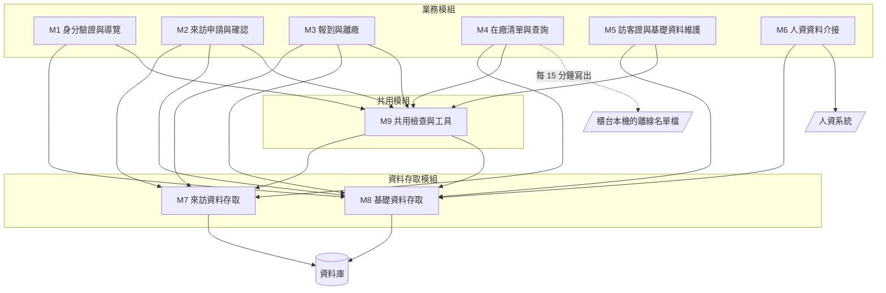
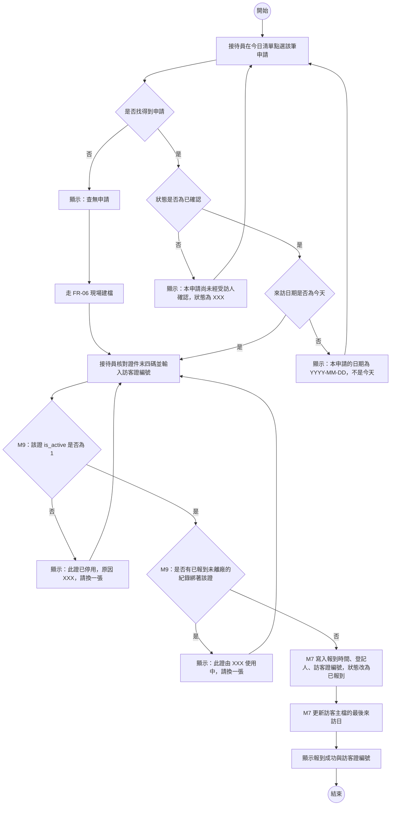
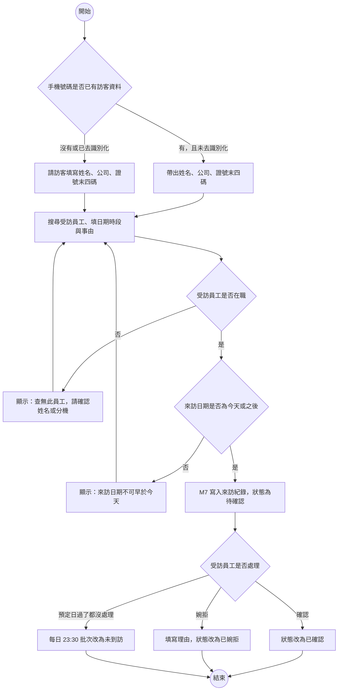
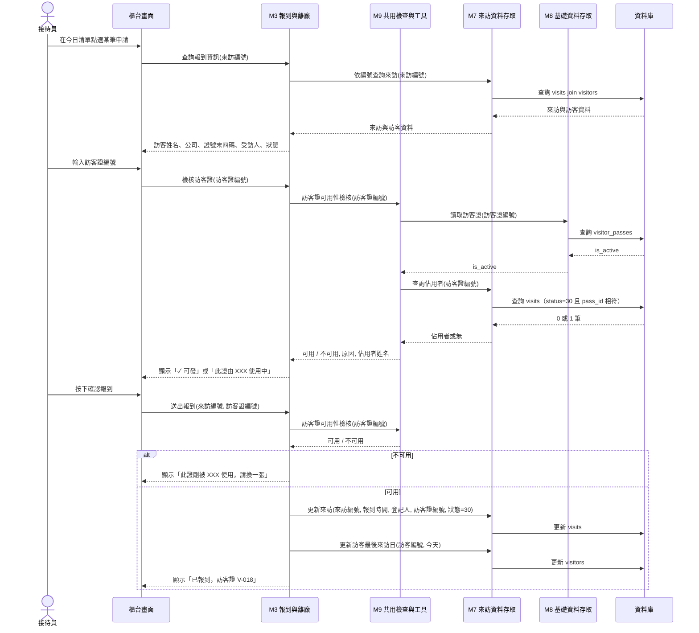
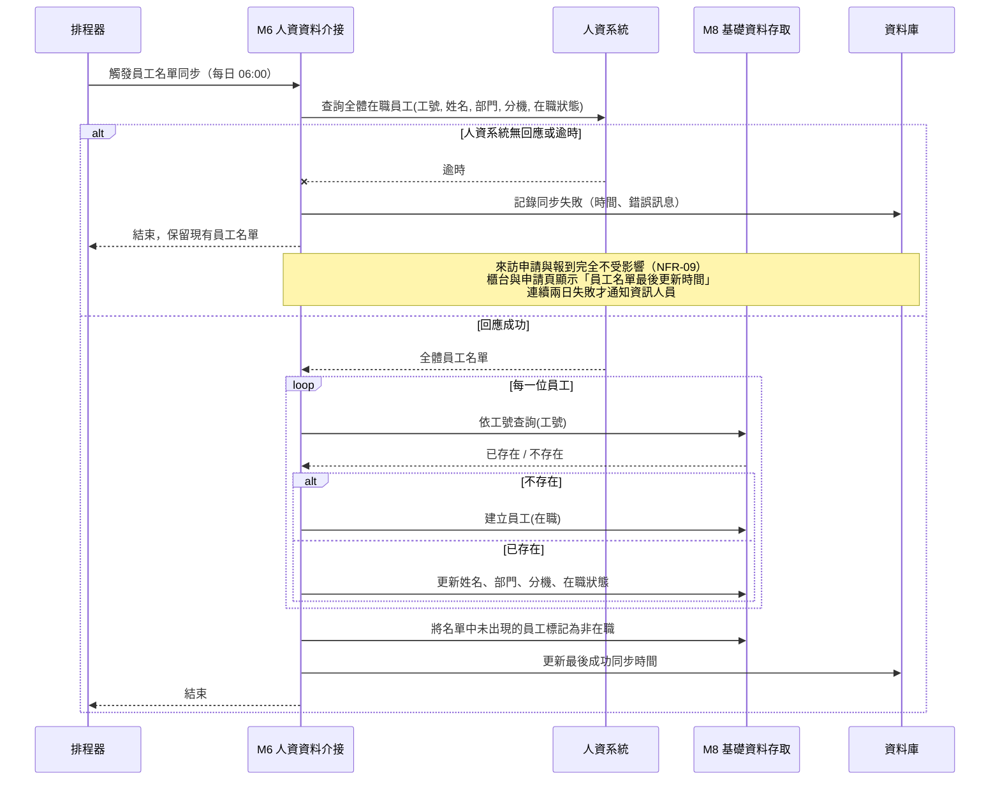
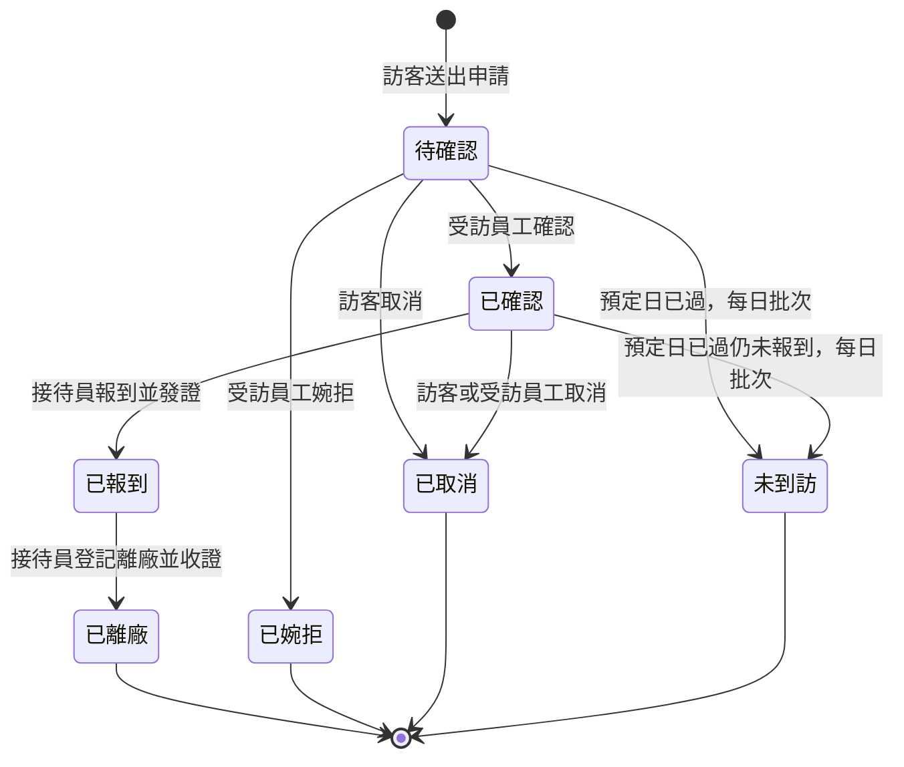
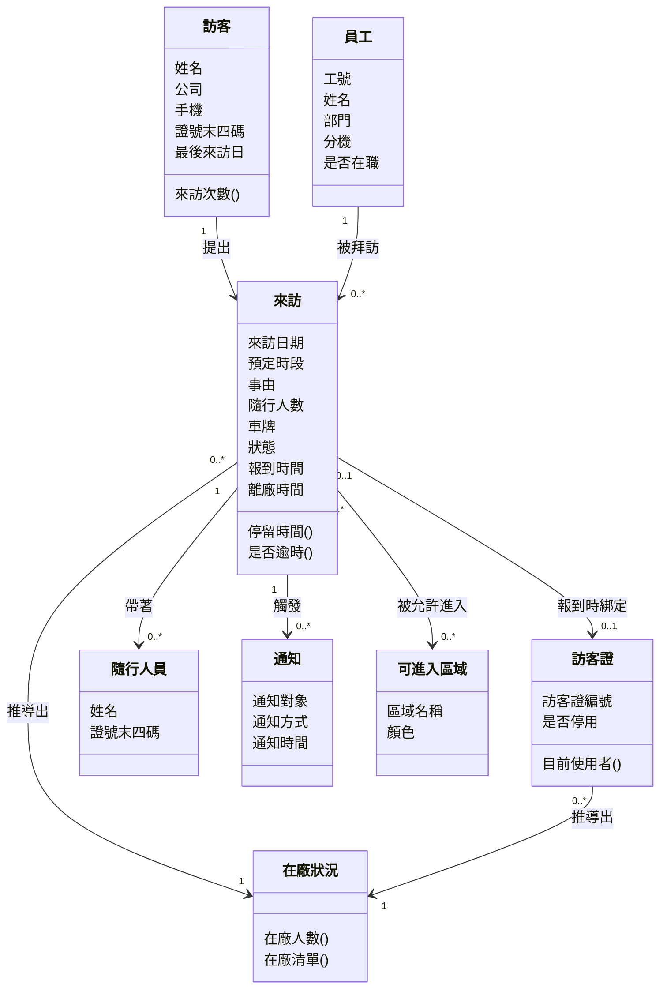
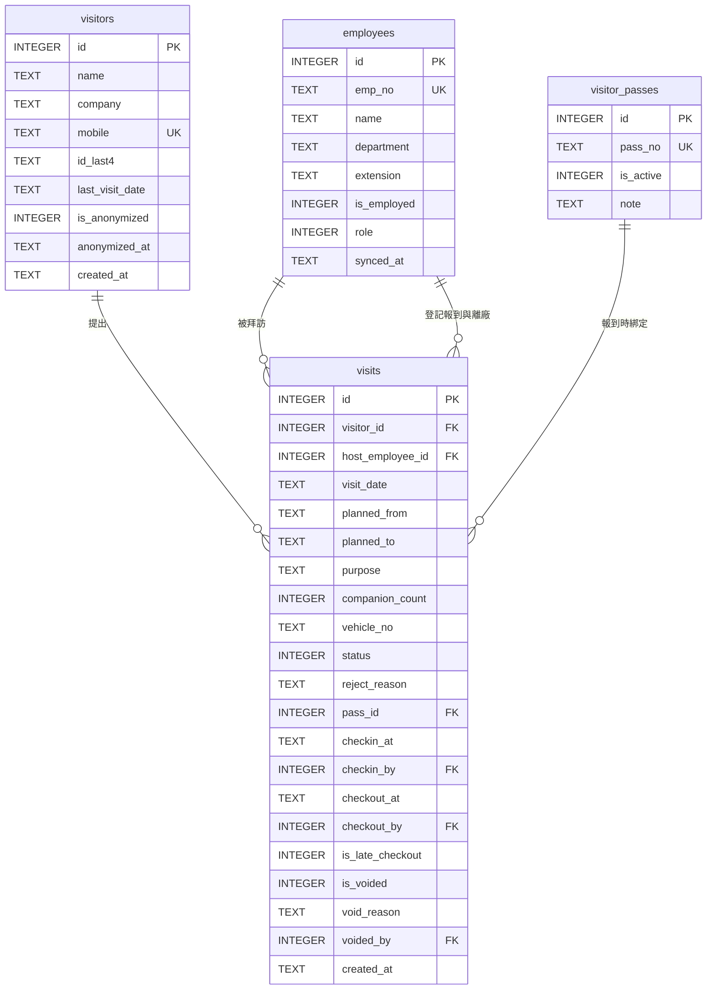
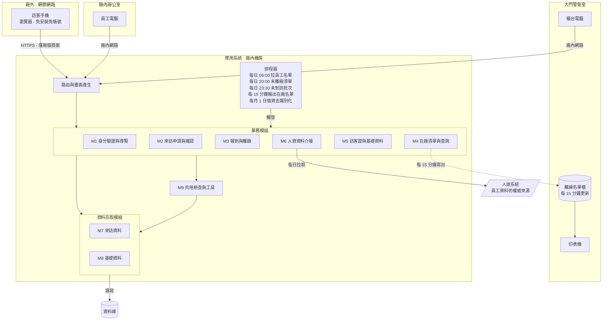

# 系統設計範例報告說明

這份文件是[「報告內容」](../00-Course-Introduction/Report-Contents.md)〈二、期末小組報告〉那八項的示範。八項的定義以那份文件為準，這裡只回答一件事：**每一項實際寫出來長什麼樣子**。

示範對象是**工廠訪客進出登記系統**，也就是上課帶著大家一路做下來的那一題。**它刻意不在[五份期末題目](../05-Final-Project-Topics/README.md)之中**，所以你可以照抄它的結構與寫法，但抄不到答案。一份照著這份說明寫完的成品，見[「系統設計範例報告」](Design-Phase-Sample-Report.md)。

**兩份的詳細程度不一樣，這是刻意的。** 這份說明把每一項能寫到多細都攤開來，成品則是一份收斂過的版本：八項與必做圖表一項不少，但模組、需求、資料表與風險的數量都少一半，是一組四個人真的做得完的份量。所以兩邊的編號不會一一對應（說明的 FR-09 在成品裡是 FR-07），**對照時看的是結構與寫法，不是編號**。

## 一、這份文件怎麼用

### 1.1 為什麼期中與期末用不同的示範系統

期中的[「系統分析範例報告說明」](../02-Midterm-Project-Example-Reports/Analysis-Phase-Deliverables.md)用的是課堂範例系統（一套校園論壇），這一份換成工廠的訪客登記系統。**換掉不是為了變化，是因為兩個階段的工作性質不同：**

| | 期中：分析 | 期末：設計 |
|---|---|---|
| 面對的東西 | 一套已經跑起來的系統 | 一組需求，系統還不存在 |
| 要做的事 | 看懂它、反推它為什麼這樣設計 | 產出一份別人照著就做得出來的設計 |
| 適合的示範對象 | **有原始碼可以對照的系統**，才驗證得出你有沒有看懂 | **貼近你們期末題目的情境**，才示範得出真正會遇到的難處 |

各組的期末題目全部落在工廠，那裡有校園系統不會出現的東西：外部系統介接、法規對資料的限制、現場的環境條件，以及**一條系統管不到的邊界**。這些正是最容易失分的地方，所以示範對象要有它們。

這一題還有一個特別的價值：**它有一個本課程明講「你不必解決」的問題**（訪客沒登記就離廠），但要求你說得出它為什麼存在、評估它多嚴重、並決定這次要不要處理。**「知道有問題、評估過、決定不處理」與「不知道有問題」是完全不同的兩件事**，而這個區別只有在有這種問題的題目上才示範得出來。

### 1.2 四件事要先講清楚

**範例寫得精簡，那是為了讓你一眼看懂結構，不是篇幅標準。** 每一項只放到「看得出該有哪些欄位、圖上該有哪些東西」為止。你的報告該寫多少就寫多少。

**這一題的難點是刻意挑的，你的題目也會有自己的。** 訪客系統的三個難點是：訪客沒登記就離廠、「在廠」該存還是該算、個資要蒐集到什麼程度。你那一題的難點寫在[題目說明書](../05-Final-Project-Topics/README.md)各自的第六節，**三個都必須在你的報告裡出現**。繞開它們，報告就只剩下一個增刪查改的資料登錄系統。

**這一題不是你們的題目，所以連情境都不能搬。** 能沿用的是方法：怎麼切模組、怎麼判斷該存還是該算、怎麼把畫面欄位對回資料字典、怎麼檢查文件之間是否一致。下面每一個決定都附了理由，而你的題目條件可能讓同一個理由推出相反的結論。

**這裡示範的是「設計一套還不存在的系統」。** 期中你面對的是一套已經跑起來的系統，工作是看懂它；期末你面對的是一組需求，工作是產出一份別人照著就做得出來的設計。

### 1.3 沒有程式碼可以對照，用什麼判準

期中的示範對象有一個好處：它已經寫出來了，你可以拿分析結果去對原始碼，問「我理解的跟它實際做的一樣嗎」。**期末沒有這個對照物**——你設計的系統還不存在，沒有任何東西可以驗證你寫得夠不夠具體。

**替代的判準有兩個，各組寫自己的報告時也適用：**

**第一，逐句問「這句話有沒有可能被兩種人做成兩種東西」。** 「報到時要檢查訪客證」會被做成兩種東西——有人檢查這張證有沒有停用，有人檢查它是不是已經在別人身上；有人在按下確認時檢查，有人在輸入當下檢查。這種句子就是還沒設計完。改成「輸入訪客證編號的當下即檢核『該證未停用，且沒有任何一筆已報到未離廠的來訪紀錄綁著它』」，兩種人做出來才會一樣。

**第二，把每一個數字追到它的來源。** 畫面上顯示「在廠 7 人」，這 7 是怎麼算出來的、算式裡的每一項各自從哪張表來、隨行人數算不算進去？追不到底的數字，就是設計裡的洞。

這兩個判準在第 8 項會變成具體的檢查清單。

### 1.4 期末與期中的分界

同一批圖、同一批表，兩個階段問的問題不一樣：

| 產出 | 期中問 | 期末問 |
|---|---|---|
| 活動圖 | 現在訪客進廠是怎麼登記的 | 系統做出來以後，報到要怎麼走 |
| 循序圖 | 接待員送什麼進去、系統回什麼出來（系統是黑箱） | 系統內部哪幾個模組互相呼叫、誰負責檢核、誰負責寫入（黑箱打開） |
| ERD | 既有的登記簿長什麼樣、反推它為什麼有那幾欄 | 這些需求需要哪些資料、該切成哪幾張表 |
| 架構圖 | 這套系統由哪些部分組成 | 這套系統該由哪些部分組成，以及為什麼是這樣切 |

一句話：**期中的答案在系統裡，期末的答案在你身上。** 期末每一項設計都要說得出「為什麼選這個而不是另一個」，這就是第 8 項的設計決策紀錄要收的東西。

### 1.5 做了清單以外的東西要登記

做了標示 **可選** 的項目、或做了八項以外的東西，在書面最前面放一張 **額外項目對照表**：做了什麼、對應哪一項、放在第幾章。**老師只認表上的項目**，沒列出來的視同沒做。額度與認定條件見[「額外投入加分」](../00-Course-Introduction/Bonus-Rules.md)。

可選項目一項都不做，必做項目的分數不會因此扣減。但做了就必須做對，而且要能在個人訪談中說明——**做了一張自己講不出所以然的圖，比不做更糟**。

### 1.6 關於 AI

遇到不確定的地方，翻課本、找資料，也可以請 AI 幫你梳理思路。但你必須看懂 AI 給你的東西，採用之前要能自己說明那些概念是什麼。使用揭露義務見[「SAD 課程介紹」](../00-Course-Introduction/Course-Introduction.md)〈AI 工具使用揭露〉。

這一題有一個 AI 幫不上忙的地方值得先講：**AI 不知道你們工廠有幾個門、訪客都從哪裡走、警衛下班之後誰在管、隨行的師傅通常幾個人。** 這些答案只在現場，而它們會直接決定你的資料表長什麼樣。問 AI 之前，先去大門口站十分鐘。

---

## 二、示範題目速覽

### 2.1 這一題要設計什麼

一套給工廠大門用的**訪客進出登記系統**：訪客事前用手機提出來訪申請，受訪員工確認，訪客到廠後由接待員報到並發給訪客證，離開時交回訪客證登記離廠，而系統隨時列得出「現在廠內有哪些訪客」。

規模：

| 面向 | 規模 |
|---|---|
| 功能模組 | 6 個業務模組 + 3 個共用模組 |
| 角色 | 3 種（訪客、接待員、受訪員工） |
| 資料表 | 4 張 |
| 畫面 | 6 個（1 個在訪客手機，4 個在櫃台，1 個在辦公室） |
| 外部系統 | **1 個（人資系統），單向介接** |

**四張資料表是本題的規模上限，不是簡化。** 題目只有三個角色、六件事要做，硬要拆成十張表反而會出現一堆一對一的表。**表的數量不是分數，該分才分。**

### 2.2 這一題的三個難點會出現在哪幾項

這一題的三個難點不是三段獨立的討論，它們會滲進八項裡的六項。**先知道它們會在哪裡出現，寫的時候才不會漏。**

| 難點 | 出現在哪幾項 |
|---|---|
| 訪客沒登記就離廠 | 第 3 項（狀態機圖為什麼沒有回頭路）、第 6 項（逾時標記與每日確認）、第 7 項（風險 R-01，本題核心）、第 8 項（待解問題） |
| 「在廠」與「訪客證能不能發」該存還是該算 | 第 1 項（NFR-04）、第 2 項（檢核收斂在哪個模組）、第 4 項（訪客證表要不要有狀態欄位）、第 8 項（設計決策 D-02） |
| 個資要蒐集到什麼程度、留多久 | 第 1 項（NFR-06）、第 4 項（末四碼與去識別化）、第 6 項（畫面不顯示完整證號）、第 7 項（政策限制與 R-05）、第 8 項（設計決策 D-04 與 D-07） |

第三個難點還有一個容易被忽略的下游影響：**「留多久」這個決定會在上線滿兩年的那一天一次生效。** 你在設計資料的時候，同時替兩年後的自己排了一件事。這件事要寫進第 8 項的待解問題。

### 2.3 這一題最容易走偏的地方

| 走偏 | 在文件上長什麼樣 | 怎麼修 |
|---|---|---|
| 做成門禁系統 | 第 2 項出現「閘門控制模組」，第 5 項架構圖上接了讀卡機 | 訪客證是一張實體卡片，靠人核對。**要接硬體訊號的一律界外**，而這條界線本身要寫進第 1 項 |
| 訪客資料每次來訪重填一次 | 第 4 項只有一張來訪紀錄表，沒有訪客主檔 | 同一位供應商一年來十幾次。訪客與來訪是一對多 |
| 把「在廠」存成訪客證上的一個欄位 | 資料字典裡出現 `pass_status` | 它是算出來的。**存了就要在報到與離廠兩處維護，漏一次那張證就永遠發不出去** |
| 把完整身分證號存進資料庫 | 資料字典裡出現 `id_number` | 先問「櫃台核對身分需要知道多少」。答案是末四碼，不是全部 |

---

## 三、八項書面內容的示範

以下依[「報告內容」](../00-Course-Introduction/Report-Contents.md)的順序展開。每一項先列該有的欄位，再給範例。

**這八個編號是閱讀順序，不完全是動手順序。** 建議的動手順序是 1 → 4 → 2 → 3 → 5 → 6 → 7 → 8：先把資料模型立起來，模組與流程才有東西可以搬；畫面在模組與資料都定了之後才畫得準；第 8 項一定最後，因為它是前面七項的縫合。

**這一題還有一個額外的建議：第 6 項的訪客申請畫面早一點畫。** 不必等到第五步，第一週就可以先畫一版。理由是這個畫面會反過來決定資料表——你砍掉的每一個欄位，都必須說得出它的值從哪裡來，而那個「哪裡來」就是資料設計。

---

### 報告基本資料

八項之前，書面最前面同樣要有一張基本資料表。欄位見[「報告內容」](../00-Course-Introduction/Report-Contents.md)〈一、1.1〉，期末的示範如下：

| 項目 | 內容 |
|---|---|
| 課程 | 系統分析與設計（IE226）115-1 |
| 報告階段 | 期末小組報告（系統設計） |
| 設計題目 | 工廠訪客進出登記系統 |
| 組別 | 第 3 組 |
| 組員 | 小明（1130001）、阿花（1130002）、阿宏（1130003）、阿凱（1130005，第 11 週轉入；小美於同期轉出） |
| 書面繳交日 | 2026/12/18 |
| 口頭報告日 | 2026/12/23 |

與期中的差別只有兩處：「分析對象」改成「設計題目」，以及 **期中之後有組員異動的，在組員那一格註明轉入或轉出的時間**。這一組期中是小明、阿花、阿宏、小美四人，小美轉出後由阿凱補進來，人數維持四人。異動的細節寫在文末的分工紀錄裡。

### 1. 設計基礎與需求摘要

#### 這一項不是縮小版的期中報告

它的用途只有一個：**讓讀者在不看期中報告的情況下，看得懂後面七項的設計為什麼長那樣**。所以判準很簡單——**這一項寫的每一句話，後面都要用得到**。寫了一堆背景卻沒有任何一項設計引用它，那些字就該刪掉。

反過來說也成立：後面某一項設計如果找不到依據，就是這一項漏了東西。

#### 該交代什麼

| 項目 | 說明 |
|---|---|
| 問題背景 | 要解決什麼問題、誰在什麼場域遇到它 |
| 主要角色 | 三到五個，附使用目標與權限範圍 |
| 核心流程 | 條列即可，每條一句話；細節留給第 3 項 |
| 關鍵需求 | 功能需求與非功能需求各列出會影響設計的那幾條，**要編號** |
| 系統邊界與設計範圍 | 系統做什麼、不做什麼、界線在哪一段 |
| 需求取捨 | 哪些納入本次設計、哪些延後，**理由要寫** |

**需求一定要編號。** 第 8 項的追溯鏈全靠這組編號串起來，沒編號就追不了。

#### 範例：問題背景

> 目前的做法是大門警衛室放一本登記簿。訪客到了填寫姓名、公司、身分證字號、電話、要找誰，警衛打電話進廠找人，確認之後發一張訪客證，離開時把證交回、在同一列補上離開時間。
>
> 這條路徑產生四個問題。**訪客到了才臨時找人**，受訪人在開會或在產線上，訪客站在門口等十幾分鐘。**個資攤在櫃台上**，前一位訪客的姓名、公司與身分證號，下一位低頭就看得到。**訪客證收不回來**，月底盤點發現少了三張，查不出是誰帶走的。**演練時說不出廠內有誰**，登記簿上有二十幾列，要一列一列比對哪些填了離開時間，火場前面沒有人做得到這件事。
>
> 需要一套系統，讓訪客事前申請、到廠只做報到、訪客證的去向查得到，而且隨時列得出現在廠內有哪些訪客。

四段話對應四個問題，而**四個問題各自生出一組設計**：第一個生出來訪申請與受訪員工確認，第二個生出「只存證號末四碼」的資料決定，第三個生出訪客證與來訪紀錄的綁定關係，第四個生出在廠清單與那份離線名單。

**問題背景要寫成這樣才有用。** 只寫「現行作業效率不佳、資訊不即時」，後面的設計就沒有東西可以回應。

**這一題的第四個問題還要單獨提一句：它跟前三個不同類。** 前三個是效率與便利，第四個是安全——它平常一點價值都沒有，出事的那一次價值極高。**這種效益要在第 7 項的經濟可行性裡誠實處理，不要硬換算成金額。**

#### 範例：主要角色

| 角色 | 使用目標 | 權限範圍 | 最在意 |
|---|---|---|---|
| 訪客 | 事前提出來訪申請、到廠後快速進去 | 只能填寫與查看自己的申請 | **不要填太多欄位。** 用自己的手機、站在廠外、第一次用、沒有人教 |
| 接待員 | 讓訪客快速進場，並掌握廠內有誰 | 報到、發證、離廠、代建申請、查全部紀錄、維護訪客證 | **要快。** 早上八點五十，五到八位訪客同時到 |
| 受訪員工 | 知道有人要來找我、確認或婉拒 | 確認自己被指定的申請、查自己的來訪紀錄 | 不要多一件麻煩事；訪客到了要有人通知我 |

**訪客那一列的「最在意」是這一題的關鍵，而且它會直接推翻設計。** 如果申請表單要填十二個欄位、要註冊帳號才能填，訪客就會直接開車到大門口說「我沒填，你幫我填」，這整套事前申請的機制就白做了。這一句話生出了 NFR-01 與 NFR-02 兩條非功能需求，也生出第 6 項那個「回頭訪客只填五欄」的畫面。

**受訪員工那一列則是這一題的組織難題。** 他要多做一個確認動作，而好處（大門不塞車、疏散名單準確）全部落在別人身上。**角色最在意什麼，通常就是非功能需求與組織可行性的來源**——看得出使用者為什麼不想用，才有可能設計出他願意用的東西。

#### 範例：關鍵需求

功能需求只列會影響設計結構的，不必把每個按鈕都列出來：

| 編號 | 需求 | 觸發角色 |
|---|---|---|
| FR-01 | 訪客可填寫來訪申請，含來訪日期、預定時段、事由、受訪員工、隨行人數與車牌 | 訪客 |
| FR-02 | 系統以手機號碼辨識回頭訪客，帶出既有的姓名、公司與證號末四碼 | 訪客 |
| FR-04 | 受訪員工可確認或婉拒指定給自己的申請，婉拒須填理由 | 受訪員工 |
| FR-06 | 接待員可代替臨時來訪的訪客建立申請並直接報到 | 接待員 |
| FR-09 | 報到時須指定一張訪客證，且該證**未停用**、**未綁在任何一位在廠訪客身上** | 接待員 |
| FR-10 | 離廠登記時記錄離廠時間與登記人，該訪客證因而釋出 | 接待員 |
| FR-11 | 系統可隨時列出目前在廠的訪客清單，含訪客、受訪人、報到時間與停留時間 | 接待員、受訪員工 |
| FR-12 | 預定來訪日結束仍未報到的申請，由系統標記為未到訪 | 系統（排程觸發） |
| FR-14 | 系統每日固定時間列出仍為已報到的紀錄，供接待員確認與補登離廠 | 系統（排程觸發） |

**FR-09 的寫法值得單獨看。** 它不是「檢查訪客證可不可以用」，而是把兩件事寫死了：一是這張證有沒有被停用（遺失、損壞），二是它現在有沒有在別人身上。這是兩個不同的資料來源、兩種不同的錯誤訊息、兩個不同的處理方式——**寫成一句「檢查可用性」，兩個人會做出兩套不同的系統。**

第二件事尤其容易漏。「被停用」是訪客證自己的屬性，「在別人身上」是來訪紀錄推出來的——**同一個檢核跨了兩張表**，這件事在第 4 項會變成一個明確的設計決定。

非功能需求是設計階段的重頭戲，**它們決定架構長什麼樣**：

| 編號 | 需求 | 會決定什麼 |
|---|---|---|
| NFR-01 | 訪客的申請表單在手機上單手可完成，必填欄位不超過五個 | 需要以手機號碼查回頭訪客，`visitors.mobile` 因此成為對外的查詢鍵 |
| NFR-02 | 訪客不需要註冊帳號即可提出申請與查詢 | 查詢自己的申請改用手機號碼加一次性驗證碼，不做密碼 |
| NFR-03 | 所有權限檢核與訪客證檢核必須在伺服器端執行 | 畫面上的限制只是提示，後端一律重驗 |
| NFR-04 | 任一時點顯示的在廠清單，必須與當時的來訪紀錄一致 | 在廠狀態**不得存成可獨立更新的欄位** |
| NFR-05 | 在廠訪客清單必須在系統或網路中斷時仍取得得到 | **架構上多出一條把資料寫到櫃台本機的路徑**，並固定輸出 |
| NFR-06 | 訪客個人資料自最後一次來訪起保存兩年，逾期由系統去識別化 | 訪客主檔要有最後來訪日與去識別化旗標，並需要一個定期批次 |
| NFR-07 | 系統不儲存完整身分證號或護照號碼 | 只存末四碼，且辨識鍵改用手機號碼 |
| NFR-08 | 來訪紀錄不得實體刪除，更正一律以作廢加重登留痕 | 來訪紀錄表需要作廢旗標、作廢人、作廢時間與原因四欄 |
| NFR-09 | 訪客端的頁面不得帶出員工名冊 | 受訪人以搜尋方式取得，且一次只回傳有限筆數與有限欄位 |

**NFR-04 與 NFR-05 是這一題影響最深的兩條**，因為它們各自否決了一個看起來很自然的做法：

- NFR-04 否決了「在訪客證表上加一個狀態欄位」。那個欄位查詢最快，但報到與離廠時它要跟著改，而漏改的結果是那張證永遠發不出去，還沒有人知道為什麼。
- NFR-05 否決了「在廠清單在系統上看得到就好」。**需要那份清單的時刻，正好是系統可能不能用的時刻**——停電、火災、網路中斷。

**這種「一條非功能需求砍掉一個做法」的關係，正是第 1 項最該寫出來的東西。** 只列需求不寫它砍掉了什麼，讀者看不出這條需求有什麼份量。

NFR-06 與 NFR-07 這一組則示範另一件事：**限制不一定來自技術，也可能來自法規。** 個人資料保護法規定蒐集個資要有特定目的、不得逾越必要範圍，這兩條需求就是把法規翻譯成設計語言的結果。你的題目如果碰到法規（工安、品質稽核、勞動法規），同樣要翻譯一次。

#### 範例：系統邊界與設計範圍

| 範圍內 | 範圍外 | 界線畫在哪 |
|---|---|---|
| 來訪申請、確認、報到、離廠、查詢 | **大門閘門與門禁刷卡的控制** | 凡是要接硬體訊號的一律界外；訪客證是實體卡片，靠人核對 |
| 訪客證的發放與回收登記 | 訪客證的製卡、補發與費用 | 卡片實體由總務管理，本系統只管它現在綁在誰身上 |
| 由人資系統匯入員工名單 | 員工資料的維護 | 員工資料的權威來源在人資系統 |
| 訪客的姓名、公司、聯絡方式與證號末四碼 | 完整身分證號的儲存 | 見第 4 項的個資最小化決定 |
| 訪客本人 | 隨行人員的個別資料 | 本次只記隨行人數 |
| 廠區出入的登記 | 廠內動線與可進入區域的管制 | 訪客證上印區域，靠人看，系統不管 |

**「門禁閘門的控制」放在範圍外要用粗體標出來**，因為這是這一題最常見也最嚴重的走偏。把它明確寫進範圍外清單，等於替自己畫了一道防線——而且這條線會在第 7 項變成風險 R-01 的直接來源。

**範圍外的東西不是消失了，是換一個人負責。** 上表六列，每一列都指得出「那件事由誰處理」：門禁由既有設備、製卡由總務、員工資料由人資、隨行人員由帶隊的人、動線由訪客證上的顏色。**寫得出接手的人，這條界線才算畫完。**

#### 範例：需求取捨

| 延後的需求 | 為什麼延後 | 延後的代價 | 什麼時候該做 |
|---|---|---|---|
| 隨行人員各自建檔 | 一次來訪最多七、八人，逐一輸入會讓報到時間翻倍，與 NFR-01 衝突 | **疏散名單會少算人。** 系統說廠內有 3 位訪客，實際可能是 9 位 | 一次來訪超過三人成為常態時 |
| 簡訊或電子郵件通知受訪員工 | 需要外部通知服務與費用，本次以系統內的待確認清單代替 | 員工不會主動登入看清單，確認會拖到訪客都到了還沒處理 | 廠內導入通訊軟體或郵件整合之後 |
| 訪客自助報到機 | 要多一台設備與另一套畫面，本次時程排不下 | 早上尖峰全部集中在一個櫃台，隊伍會排到廠外 | 每日訪客量翻倍時 |
| 車輛與停車位管理 | 目前只記車牌供警衛放行，停車位不足不是靠系統解決的 | 車牌記了但沒有用途 | 廠區實施停車位管制時 |

**「延後的代價」這一欄是分數的關鍵。** 只寫「這次不做」是逃避，寫出不做會付出什麼代價，才代表你知道自己在放棄什麼。訪談時這一欄最常被追問。

兩件事是**明確不做**，不是延後：

| 不做的事 | 理由 |
|---|---|
| 與門禁閘門連動（刷訪客證開門） | 需要門禁廠商配合開放介面並改動既有設備，成本與協調時間都遠超本次範圍。**這條的代價很具體：訪客從人走的大門離開時，系統攔不住他** |
| 人臉辨識報到 | 蒐集生物特徵的目的與必要性說不通，個資風險遠高於它省下的十秒鐘 |

**「延後」與「不做」要分開寫。** 延後代表認同但排不進來，不做代表評估後認為不該做。兩者混在一起，讀者會以為你只是做不完。

第二列還示範了一件事：**不做的理由可以是「不該做」，不只是「做不到」。** 人臉辨識技術上完全做得到，本設計不做它是因為蒐集生物特徵這件事在這個場景說不通。**這種以必要性為由的取捨，比「時間不夠」有份量得多。**

方法見教材[「問題定義與現況分析」](../01-Course-Materials/02-Problem-Definition.md)與[「系統需求分析」](../01-Course-Materials/04-System-Requirements-Analysis.md)；系統邊界與範圍外清單見[「功能分析與模組設計」](../01-Course-Materials/05-Functional-Analysis.md)〈二〉。

---

### 2. 功能與模組設計

#### 模組不是選單名稱換皮

這是這一項最常見的失分方式：把畫面上的選單抄下來，每一項後面加「模組」兩個字，就當作模組設計交出去。

真正的模組切分要通過三個檢查：

| 檢查 | 問題 | 沒通過的徵兆 |
|---|---|---|
| 內聚 | 這個模組裡的東西，是不是為了同一件事而放在一起 | 一個模組同時處理報到與人資名單同步 |
| 耦合 | 抽掉一個模組，其他模組要改幾個地方 | 改一個模組要連帶改四個 |
| 有沒有看不見的模組 | 有些模組不對應任何選單 | 模組數量剛好等於選單數量 |

**第三個檢查在這一題有東西可挖。** 這套系統有兩個模組完全沒有畫面入口，卻是全系統最關鍵的：一個是資料存取，另一個是**訪客證可用性與在廠狀態的判定**。後者不是任何一個功能，它是一段被四個地方呼叫的判斷邏輯（報到、離廠、在廠清單、每日確認清單），如果散在各處各寫一次，規則一改你會漏掉其中幾處。

#### 該交代什麼

模組清單一張表，加上每個模組各一張規格表，最後一張相依關係圖與一張 CRUD 矩陣。

每個模組的規格欄位：

| 欄位 | 說明 |
|---|---|
| 模組編號與名稱 | 編號要能被第 8 項的追溯鏈引用 |
| 目的 | 一句話，說明它為什麼存在 |
| 使用角色 | 哪些角色會觸發它 |
| 主要輸入 | 從哪裡來、有哪些欄位 |
| 主要處理 | 條列，含檢查與判斷，**順序就是設計** |
| 主要輸出 | 產出什麼、寫到哪裡、畫面看到什麼 |
| 相依模組 | 呼叫誰、被誰呼叫 |
| 對應需求 | FR／NFR 編號 |

#### 範例：模組清單

| 編號 | 模組 | 類型 | 目的 | 對應需求 |
|---|---|---|---|---|
| M1 | 身分驗證與導覽 | 業務 | 訪客以手機號碼加驗證碼查自己的申請；接待員與員工帳號登入 | FR-02、NFR-02 |
| M2 | 來訪申請與確認 | 業務 | 建立、修改、取消申請；受訪員工確認或婉拒；每日的未到訪結案 | FR-01、FR-04、FR-06、FR-12 |
| M3 | 報到與離廠 | 業務 | 報到、發證、離廠、收證、作廢與重登 | FR-09、FR-10、NFR-08 |
| M4 | 在廠清單與查詢 | 業務 | 在廠訪客清單、歷史查詢、每日未離廠確認清單、離線名單輸出 | FR-11、FR-14、NFR-05 |
| M5 | 訪客證與基礎資料維護 | 業務 | 訪客證的新增、停用、備註 | FR-13 |
| M6 | 人資資料介接 | 業務 | 每日匯入員工主檔 | FR-08、NFR-09 |
| M7 | 來訪資料存取 | 共用 | `visits` 與 `visitors` 兩張表的所有讀寫 | 支撐 M1～M4、M6 |
| M8 | 基礎資料存取 | 共用 | `visitor_passes` 與 `employees` 兩張表的所有讀寫 | 支撐全部 |
| M9 | 共用檢查與工具 | 共用 | 權限檢查、訪客證可用性檢核、在廠狀態判定、停留時間推導、個資保存期限判定 | NFR-03、NFR-04、NFR-06 |

M7 到 M9 就是上面說的「看不見的模組」。M6 也沒有自己的畫面，但它是業務模組不是共用模組——**判準是「它有沒有自己的業務規則」**：M6 要決定離職的員工怎麼處理、名單拉不到怎麼辦，這些是業務判斷；M7 與 M8 只是把資料讀出來寫進去，不做判斷。

**四個模組切分決定值得寫出理由：**

| 決定 | 理由 |
|---|---|
| 資料存取獨立成 M7、M8，不併進業務模組 | 資料庫語法只出現在這兩個模組裡，換資料庫時只改這兩處 |
| `visitors` 與 `visits` 合成一個 M7，不一表一模組 | 兩張表永遠一起被讀寫——查來訪一定要帶出訪客資料，建來訪可能要順便建訪客。**拆開會讓每一次呼叫都變成兩次** |
| 訪客證可用性檢核放在 M9 而不是 M3 | 報到（M3）、每日未離廠確認（M4）與訪客證停用（M5）三條路徑都要問「這張證現在誰在用」。放在 M3 裡，另外兩條就會各複製一份 |
| 人資介接獨立成 M6，不併進 M2 | M2 的規則是「人怎麼申請來訪」，M6 的規則是「兩套系統怎麼對名單」，兩者變動的原因完全不同。人資系統換版本時只動 M6 |

第二條是**規則的用意比規則本身重要**的示範。照字面套「一表一模組」會生出兩個永遠成對出現的模組；回到規則想解決什麼問題（避免兩個模組寫同一張表），就知道這裡可以合併。**這種判斷寫進報告會加分，但前提是理由要寫出來**，不寫的話讀起來就只是沒照規則做。

#### 範例：模組規格（M3 報到與離廠）

| 欄位 | 內容 |
|---|---|
| 編號與名稱 | M3 報到與離廠 |
| 目的 | 讓接待員在三十秒內完成報到與發證，並在訪客離開時收回訪客證 |
| 使用角色 | 接待員 |
| 主要輸入 | 報到：來訪編號、訪客證編號<br>離廠：來訪編號<br>作廢：來訪編號、作廢原因 |
| 主要處理 | 1. 權限檢查：操作者為接待員<br>2. 狀態檢查：來訪紀錄狀態為已確認<br>3. 日期檢查：`visit_date` 為今天<br>4. **呼叫 M9 檢核訪客證：未停用，且沒有任何一筆已報到未離廠的紀錄綁著它**<br>5. 寫入報到時間、登記人與訪客證編號，狀態改為已報到<br>6. 由 M7 更新訪客主檔的最後來訪日（NFR-06 的起算點）<br>7. 離廠時寫入離廠時間與登記人，狀態改為已離廠<br>8. 回傳結果並顯示訪客證編號 |
| 主要輸出 | 成功時顯示「已報到，訪客證 V-018」；失敗時保留畫面並顯示原因與佔用者 |
| 相依模組 | 呼叫 M7（讀寫來訪與訪客）、M8（讀訪客證）、M9（檢核）；被 M1 導向 |
| 對應需求 | FR-09、FR-10、NFR-03、NFR-04、NFR-06、NFR-08 |

「主要處理」那一欄的**順序是設計，不是流水帳**。這一題有三個順序是刻意的，都要在報告裡說明：

| 順序決定 | 理由 |
|---|---|
| 狀態與日期檢查（第 2、3 步）排在訪客證檢核之前 | 接待員通常先點錯人再拿證。先擋掉便宜的錯誤，他才不會白拿一張證出來 |
| 訪客證檢核（第 4 步）排在寫入之前 | 這是唯一會跨兩張表的檢核，也是本模組的核心規則 |
| 更新最後來訪日（第 6 步）掛在報到而不是申請 | **申請不等於真的來了。** 掛在申請上的話，一個申請了卻沒來的訪客，個資保存期限會被無故延後兩年 |

**第 6 步是這一題最容易被忽略、但最能看出理解深度的一步。** 它是一個「跨出本模組主要職責」的動作——報到模組為什麼要去改訪客主檔？因為 NFR-06 的起算點定義在「最後一次來訪」，而「來訪」這件事只有在報到那一刻才成立。**這種跨界的更新一定要在報告裡解釋，否則讀者會判定為邊界破裂。**

**第 7 步也值得單獨寫一句：離廠登記不需要把訪客證改回「可用」。** 一張證能不能發，是由「有沒有一筆已報到未離廠的紀錄綁著它」決定的，寫入離廠時間之後它自然就釋出了。**這是第 4 項那條「該存還是該算」判準的直接結果，兩處要互相指過去。**

#### 範例：模組規格（M9 共用檢查與工具）

沒有畫面的模組更需要規格，因為讀者無法從畫面反推它做什麼。

| 欄位 | 內容 |
|---|---|
| 編號與名稱 | M9 共用檢查與工具 |
| 目的 | 收斂所有「會被多個模組用到、且改一次要全部一起改」的判斷邏輯 |
| 使用角色 | 無直接使用者，由其他模組呼叫 |
| 對外提供 | 1. 權限檢查（登入狀態、角色）<br>2. **訪客證可用性檢核**：輸入訪客證編號，回傳可用與否、不可用時回傳原因與佔用者<br>3. **在廠狀態判定**：輸入來訪編號回傳是否在廠；不帶參數時回傳整份在廠清單<br>4. 停留時間推導：輸入報到與離廠時間，回傳停留時數<br>5. **個資保存期限判定**：掃出最後來訪日超過兩年且未去識別化的訪客 |
| 主要處理 | 訪客證檢核：先讀 `visitor_passes.is_active`，再查 `visits` 有無 `status = 30` 且 `pass_id` 相同的紀錄<br>在廠判定：`visits.status = 30` 且 `is_voided = 0` |
| 相依模組 | 呼叫 M7（讀來訪）、M8（讀訪客證）；被 M2～M6 呼叫 |
| 對應需求 | NFR-03、NFR-04、NFR-06 |

**這張表要看的是「對外提供」那五項為什麼會被放在一起。** 它們的共通點不是功能相似，而是**每一項都會被兩個以上的模組用到，而且規則改變時必須一次全改**。「在廠」的定義改了（例如未來多一個「暫離」狀態），在廠清單、每日確認清單、報到檢核三處都要跟著變——收在一個模組裡，改一次就好。

反過來說，只被一個模組用到的邏輯不該放進來。**共用模組變成雜物間，是這一項另一種失分方式。**

#### 範例：模組相依關係圖



**這張圖要檢查三件事：**

1. **箭頭有沒有往回指。** 資料存取模組不該反過來呼叫業務模組。本圖沒有雙向箭頭——**這一題的介接是單向的，所以連 M6 對人資系統都是單箭頭**，跟雙向介接的題目不一樣。
2. **業務模組之間有沒有互相呼叫。** 這張圖上六個業務模組彼此完全不呼叫，只透過共用模組與資料存取模組間接發生關係。這是刻意的，代表模組邊界切得乾淨。
3. **M9 同時被業務模組呼叫、又去呼叫資料存取模組。** 它落在中間層，不是最底層。這一點要在報告裡講明，否則讀者會以為共用模組應該是最底下那一層。

**圖上那條虛線（M4 寫出離線名單檔）值得單獨說。** 它不是一個功能，也不是使用者觸發的動作，它是 NFR-05 在架構上留下的痕跡——**一條為了「系統掛掉時還有東西可看」而存在的線**。非功能需求會在圖上留下這種看起來多餘的東西，把它畫出來並說明，比讓讀者自己猜好。

#### 範例：CRUD 矩陣

模組與資料表的對照表，用來檢查有沒有模組偷寫別人的資料：

| 模組 | `visits` | `visitors` | `visitor_passes` | `employees` |
|---|:---:|:---:|:---:|:---:|
| M1 身分驗證與導覽 | R | R | — | R |
| M2 來訪申請與確認 | C R U | C R U | — | R |
| M3 報到與離廠 | R U | R **U** | R | R |
| M4 在廠清單與查詢 | R | R | R | R |
| M5 訪客證與基礎資料維護 | — | — | C R U | — |
| M6 人資資料介接 | — | — | — | C R U |

C 建立、R 讀取、U 更新、D 刪除。

**這張矩陣有三件事值得指出：**

- **整張表沒有任何一個 D。** 來訪紀錄依 NFR-08 不得實體刪除，訪客資料依 NFR-06 是去識別化而不是刪除，訪客證與員工則以停用旗標取代刪除。**矩陣上一個 D 都沒有，本身就是一項設計決策的證據。**
- **M3 對 `visitors` 有 U。** 這一格看起來像是越界——報到模組為什麼要改訪客主檔？因為報到時要更新最後來訪日（NFR-06 的起算點）。**這種「跨出自己主表的更新」一定要在報告裡解釋**，而且要說明它只限那一個欄位。
- **M3 對 `visitor_passes` 只有 R，沒有 U。** 這一格是這一題最能展現設計理解的地方：報到與離廠都不改訪客證那張表。**綁定關係存在 `visits` 上，不存在證上**——這一格如果出現了 U，就代表你選了「存狀態」那條路，第 4 項的判準會跟著改。

模組規格欄位與相依檢查見教材[「功能分析與模組設計」](../01-Course-Materials/05-Functional-Analysis.md)〈四〉、〈五〉。

---

### 3. 主要流程與互動設計

這一項要交兩種圖：**活動圖**回答「事情按什麼順序做、在哪裡分岔」，**循序圖**回答「系統內部哪幾個模組互相呼叫」。狀態機圖在課程規定上是可選，**但這一題強烈建議做**——來訪紀錄有七個狀態，其中三個都代表「沒來成」，不畫圖分不清楚。

#### 3.1 活動圖

##### 該畫幾張、畫什麼

至少兩張，挑核心功能。挑的標準是**有判斷、有例外**——一路順下去沒有分岔的流程畫出來沒有資訊量。

這一題最值得畫的三條：**報到與發證**（檢核最多，且有跨表檢核）、**來訪申請與確認**（跨三個角色，且有一條「沒有人做任何事」的分支）、**離廠與每日補登**（同一件事有兩條路徑走得到）。

設計階段的活動圖比期中細，差別在三處：

| 面向 | 期中（現況） | 期末（設計） |
|---|---|---|
| 判斷節點 | 畫出主要分岔即可 | 每一個檢查都要是一個節點，且**順序就是設計** |
| 例外路徑 | 畫出重要的幾條 | 每個判斷的「否」都要有去處，不能斷在空中 |
| 動作的主詞 | 使用者做了什麼 | 哪個模組做了什麼 |

##### 泳道怎麼畫：先確認這條流程需不需要泳道

泳道的用途只有一個：**標出每個動作由誰執行**。所以判準很簡單——

| 情況 | 要不要泳道 |
|---|---|
| 流程只有「使用者」與「系統」兩方 | **不要**。每個動作是誰做的一看就知道，加了泳道只是多兩個框 |
| 流程跨兩個以上的角色，或有次要角色承受後果 | 要。這時「誰做什麼」才是需要標示的資訊 |

**Mermaid 沒有原生泳道。** 用 `subgraph` 當泳道是常見做法，但 `subgraph` 的語意是「一群節點」而不是「一條道」，佈局引擎經常把它排成上下堆疊而不是並排，跨道的箭頭也會亂竄。

本課程建議的做法是**表格式泳道**：

| 做法 | 怎麼做 | 為什麼建議 |
|---|---|---|
| **表格式泳道**（建議） | 欄 = 角色，列 = 步驟序號，格子裡填該角色在那一步做的事 | 欄位本身就是泳道，不依賴任何繪圖引擎，各種預覽工具呈現一致 |
| 搭配一張不帶泳道的活動圖 | 用 mermaid 專門畫分岔與例外邏輯，不管誰執行 | 兩張圖分工：表回答「誰做」，圖回答「怎麼分岔」 |
| 真的要畫圖形泳道 | 用 draw.io、Visio、Figma 之類的工具畫好，存成圖片插入 | 圖形泳道要好看，用專門的繪圖工具比跟 mermaid 搏鬥快 |

**用哪一種都不影響分數。** 評分看的是「每個動作標得出執行者」與「每個判斷的否都有去處」。

##### 範例：報到與發證（只有接待員與系統兩方，不需泳道）



**動作前面掛模組編號，就替代掉了泳道。** `A3[M7 寫入報到時間...]` 已經說清楚這件事由誰做，不必再為 M7 開一條道。

這張圖上有四個地方是**設計決定**，報告要各寫一句話說明：

| 圖上的位置 | 設計決定 | 理由 |
|---|---|---|
| D1～D3 三個檢查排在拿訪客證之前 | 先驗申請，再拿卡片 | 接待員通常先點錯人再拿證。等證拿出來才退回，那張證要放回去 |
| **D1 的「否」不是死路，而是導向現場建檔** | 例外要有出口 | 臨時來訪在大門是常態。**一個「查無申請」就把人擋在外面的系統，警衛會直接放棄它** |
| D4 與 D5 是兩個分開的判斷節點 | 兩種不可用是兩件事 | 訊息不同、處理不同：停用要換一張，被佔用則要去追誰沒還 |
| E5 的訊息帶出佔用者姓名 | 錯誤訊息要說得出下一步 | 只寫「此證不可用」，接待員不知道要去找誰。**錯誤訊息也是設計** |

**第二列是這一題最值得學的一條。** 活動圖上的例外分支，最容易被畫成一條「顯示錯誤 → 結束」的死路。但現場的例外通常有替代路徑，而那條替代路徑本身就是一項功能（FR-06）。**畫得出替代路徑，代表你想過使用者被擋下來之後要做什麼。**

##### 範例：來訪申請與確認（跨三個角色，用泳道表）

這條流程有三個角色：訪客提出、受訪員工確認、接待員承受後果（沒確認的申請他不能放行）。第三個角色從頭到尾沒有任何動作，卻是這條流程的目的所在。

**第一張表：泳道**

| 步驟 | 訪客 | 系統 | 受訪員工 | 接待員 |
|:--:|---|---|---|---|
| 1 | 輸入手機號碼 | | | |
| 2 | | M7 查訪客主檔，找到就帶出姓名、公司、證號末四碼 | | |
| 3 | 補齊或修改資料，搜尋並選擇受訪員工，填日期時段與事由，送出 | | | |
| 4 | | M2 檢查：受訪員工在職、來訪日期不早於今天 | | |
| 5 | | M7 寫入來訪紀錄，狀態為待確認 | | |
| 6 | | 在該員工的待確認清單顯示這筆申請 | | |
| 7 | | | 檢視申請內容 | |
| 8 | | | 確認或婉拒，婉拒須填理由 | |
| 9 | | M7 更新狀態為已確認或已婉拒 | | |
| 10 | 在申請查詢頁看到結果 | | | |
| 11 | | | | 該申請出現在今日清單，且「報到」按鈕才會出現 |

**第二張表：例外分支**

| 在哪一步 | 例外 | 系統的處置 |
|:--:|---|---|
| 2 | 手機號碼查到的訪客已被去識別化 | 視同新訪客，重新建檔。**歷史來訪紀錄因此斷開**，列為待解問題 O-04 |
| 4 | 受訪員工已離職 | 顯示「查無此員工」，不透露該員工曾經在職 |
| 4 | 來訪日期早於今天 | 顯示「來訪日期不可早於今天」 |
| 7 | 受訪員工到預定日都沒處理 | **見下方說明** |
| 8 | 受訪員工婉拒，但訪客已經在路上了 | 本次設計無主動通知，訪客要自己回查詢頁才會知道；列為風險 R-06 |

**第 7 步那個例外要特別想過。** 受訪員工什麼都不做，這筆申請會怎樣？

如果沒有處理，它會永遠停在「待確認」，一年後清單上累積幾百筆。本設計的處置是：**每日 23:30 由 M2 掃出預定日已過、狀態仍為待確認或已確認的紀錄，改為未到訪。**

**「使用者什麼都不做」是最容易被漏掉的一條路徑。** 找法很單純：流程裡只要出現「等某個人做決定」，就去問「他不做決定會怎樣」。答不出來，那條流程就還沒設計完。

**第三張：分岔邏輯的活動圖**

泳道表讀不出「哪個檢查先做」，所以檢核順序另外畫一張圖：



**C4 有三條出口，第三條不是使用者選的。** 一般的判斷節點只有是與否，這裡多了一條「時間到了自動走」的路徑。**圖上畫得出這條路，第 4 項的「未到訪該存還是該算」才有討論的基礎。**

#### 3.2 循序圖

##### 期中的 SSD 與期末的循序圖差在哪

| | 期中：系統循序圖（SSD） | 期末：設計階段循序圖 |
|---|---|---|
| 生命線 | 使用者、系統（一條，黑箱） | 使用者、各模組、資料庫（多條） |
| 訊息 | 使用者送什麼、系統回什麼 | 模組之間互相呼叫什麼、回傳什麼 |
| 回答的問題 | 系統對外的介面長什麼樣 | 系統內部誰負責哪一段 |

**期末畫成期中那樣（只有兩條生命線）會被視為沒做。** 判斷方法很簡單：把第 2 項的模組清單拿來對，圖上的生命線應該都在那張清單裡找得到。

##### 該畫幾張

一到兩張，挑**跨最多模組**的流程。這一題最該畫的是報到與發證（跨四個模組，且含跨表檢核），第二張建議畫人資名單同步（跨系統邊界，且失敗處置與一般流程不同）。

##### 範例：報到與發證



**訊息括號裡的參數要寫。** 沒寫參數的循序圖只是箭頭練習——`檢核()` 和 `檢核(訪客證編號)` 傳達的資訊量差很多。而且第 8 項的一致性檢查會要求：**括號裡的每個參數，都要在資料字典裡找得到對應欄位**。

這張圖藏著兩個值得寫的東西：

**第一，訪客證的可用性檢核跨了兩張表。** M9 先問 M8 這張證有沒有停用，再問 M7 有沒有人正在用它。**這兩個資料在不同的表裡，是第 4 項那個設計決定造成的**——如果當初選擇在訪客證表上存一個狀態欄位，這裡就只有一次查詢。**圖上多出來的這一段往返，就是那個決定的代價，要把它畫出來。**

**第二，可用性檢核做了兩次。** 一次在輸入訪客證編號的當下（為了立即給接待員回饋），一次在按下確認報到時（為了真的判斷）。看起來重複，但兩次的用途不同：前者是給人看的提示，後者是寫入前的把關。**如果只查一次、用畫面上顯示的那個結果來判斷，接待員停在畫面上兩分鐘的期間別人用掉了那張證，這個判斷就是錯的。**

##### 範例：人資名單同步

跨系統的循序圖有一個內部流程沒有的重點：**對方沒有回應的時候你怎麼辦。**



**最後那個 `將名單中未出現的員工標記為非在職` 是這張圖的重點。** 人資給的是全量名單，沒有出現在名單裡就代表離職了——但**這件事要靠推論，人資不會主動告訴你「這個人走了」**。

推論會出錯：如果人資系統當天只送出一半的資料，本系統會把另一半全部標成離職，隔天全廠一半的人選不到。**所以這個動作要有保護**，本設計的做法是「回傳筆數少於現有在職人數的八成時，整批不處理並記為失敗」。這條規則要寫進第 8 項的設計決策。

**你的題目如果有任何「全量覆蓋」的介接，都要問同一個問題：對方送來的資料不完整時，我會不會把好的資料蓋掉？**

#### 3.3 狀態機圖

課程把這張圖列為可選，**但這一題建議做**。來訪紀錄有七個狀態，其中三個都代表「沒來成」，用文字描述分不清楚。

##### 範例：來訪紀錄的狀態



畫這張圖的價值在於它逼出四個問題：

| 圖上看得出來的 | 要回答的問題 |
|---|---|
| 有**三個終態代表「沒有來成」**：已婉拒、已取消、未到訪 | 這三個要不要分開？合成一個「未完成」會少掉什麼？ |
| **沒有任何一條往回走的箭頭** | 報到之後發現點錯人怎麼辦？ |
| 「已報到 → 已離廠」是唯一的出口 | 訪客不登記就走了，這筆紀錄要怎麼收尾？ |
| 「待確認 → 已報到」沒有箭頭 | 沒確認的訪客不能報到，這是刻意的還是漏了？ |

**第一個問題的答案要寫進報告。** 三者要分開，因為管理上想知道的是不同的事：婉拒是受訪人不同意（可能要追為什麼常常婉拒），取消是事前就說了（沒有成本），未到訪是訪客沒出現（可能要追這家供應商是不是常放鴿子）。**合成一個值會讓統計失去意義，而那正是這套系統的產出之一。**

**第二個問題是這一題與其他題最不一樣的地方。** 一般的單據狀態機常有回退轉移（例如審核退回），這張圖刻意一條都沒有——**因為報到是一件真的發生過的事，不能假裝沒發生**。要更正只能整筆作廢重登（NFR-08），兩筆都留著。這條規則要寫下來，否則實作的人會順手加一個「取消報到」按鈕。

**第三個問題導向本題的核心風險。** 圖上「已報到」只有一個出口，而走那個出口需要訪客主動配合。**狀態機圖畫得出這件事，第 7 項的 R-01 就有了具體依據，而不是憑空寫一條「訪客可能不登記」。**

活動圖、循序圖與狀態機圖的畫法見教材[「行為建模」](../01-Course-Materials/06-Behavioral-Modeling.md)。

---

### 4. 資料設計

這一項要交四份東西：**概念類別圖 → ERD → Schema → 資料字典**，再加一張**畫面欄位對照表**。四份要一路對得起來。

這一題還要多交一張表：**推導欄位清單**，也就是「畫面上看得到、資料表裡卻沒有」的那些值。理由見〈4.2〉。

#### 4.1 概念類別圖

##### 它跟 ERD 差在哪

這是期末新增的一張圖，也是最容易畫成「ERD 換個框線」的一張。兩者的差別：

| | 概念類別圖 | ERD |
|---|---|---|
| 畫的是 | 這個領域裡有哪些概念 | 資料庫裡要存哪幾張表 |
| 可以放 | **還沒決定要不要存的概念**、規則、算出來的東西 | 只放真的要存的 |
| 有沒有 | 屬性、關聯、多重性 | 欄位、型別、主鍵外鍵 |
| 什麼時候畫 | ERD 之前 | 概念類別圖之後 |

**「可以放還沒決定要不要存的概念」是關鍵。** 畫出來跟 ERD 一模一樣，代表這一步沒有發生——你只是把資料表重畫了一次。

##### 範例：概念類別圖



這張圖上有**五個概念不會變成資料表**，正是它存在的價值：

| 概念 | 為什麼不進資料表 | 那它去了哪裡 |
|---|---|---|
| 在廠狀況 | 兩個屬性都是括號結尾的推導值，不是資料 | 由來訪紀錄的狀態即時算出，見〈4.2〉 |
| 停留時間、是否逾時、來訪次數、目前使用者 | 全部由已經存在的欄位算得出來 | 查詢時計算，不落成欄位 |
| 隨行人員 | **本次決定不做** | 只記人數，不逐一建檔。見第 1 項的取捨表與風險 R-02 |
| 通知 | **本次決定不做** | 以系統內的待確認清單代替。見第 1 項的取捨表 |
| 可進入區域 | **本次明確簡化** | 印在訪客證上，靠人看。系統不管動線，見第 1 項的邊界表 |

**「訪客證的目前使用者」是這張圖上最值得討論的一個屬性。** 它畫在訪客證這個概念上，卻是括號結尾的——**這代表「一張證現在誰在用」是訪客證的一個性質，但那個性質的資料不存在訪客證身上**。這句話寫出來，第 4.2 節的判斷就有了鋪陳。

**把「已知需要但這次不做」的概念畫在圖上、標明它沒有落到資料表，比直接不畫它有價值得多。** 直接不畫，讀者會以為你沒想到；畫了並說明，讀者知道你評估過。

#### 4.2 這一題的核心問題：該存還是該算

這一題有三個推導值需要決定，答案還不一樣。**與其每次單獨判斷，不如先訂一條判準：**

> **推導值要不要存下來，看它的計算依據會不會隨時間改變。依據不會變，就用算的；依據會變，就存下來。**

用這條判準把三個推導值一次處理掉：

| 推導值 | 計算依據 | 依據會不會變 | 決定 | 理由 |
|---|---|:--:|:--:|---|
| 某位訪客是否在廠 | 該筆來訪紀錄的狀態是否為已報到 | **不會。** 報到與離廠時間寫進去就不再改（NFR-08 不得修改） | **用算的** | 任何時間重算都得到同一個答案。存成欄位反而多一份要維護，而漏維護的錯誤沒有人會發現（NFR-04） |
| 某張訪客證目前能不能發 | 有沒有一筆已報到未離廠的來訪紀錄綁著它 | **不會**，同上 | **用算的** | 存在訪客證表上就要在報到與離廠時兩邊都改。**漏改一次，那張證就永遠發不出去，而且沒有任何錯誤訊息** |
| 一筆申請是否未到訪 | 預定來訪日與**今天**比較 | **會。今天每天都不一樣** | **存下來** | 若用算的，「什麼時候判定的、由誰判定的」永遠留不下來；而且訪客隔天補來報到的話，算出來的結果會自己翻轉 |

**前兩列與第三列是這一題最能拉開差距的對照。** 三個都是算出來的數字，兩個不存一個存，理由完全相反——而且三個理由都成立。能寫出這一組對照，代表你不是在套規則，是真的在判斷。

第二列還有一個具體的失效情境要一併寫出來，因為它是這條判準最有說服力的證據：

> 假設訪客證表上有一欄 `is_in_use`。接待員發證時把它改成 1，收證時改回 0。某天離廠登記寫入了，但改 `is_in_use` 那一步失敗了（或程式漏寫了那一行）。
>
> 結果是：來訪紀錄說這位訪客已經離廠，訪客證表說這張證還在外面。**這張證從此再也發不出去，而且不會有任何錯誤訊息，因為兩張表各自看起來都很正常。**
>
> 一個月後接待員發現「V-018 這張證明明就在抽屜裡，系統卻說它在外面」，這時候要查是哪一天壞的、要怎麼修，都沒有依據。

**這種「兩份資料講同一件事」的設計，錯誤不會當場出現，而是慢慢累積。** 用算的則不可能出現這個問題，因為只有一份資料。

第三列的決定也要寫出它的代價：**多一個每日批次，而批次沒跑的那天，清單上會有一批該收尾而沒收尾的申請。** 這個代價比第一、二列的「查詢麻煩一點」嚴重，但它換到的是「判定時間留得下來」——**兩害相權，判準給的是方向，不是免除你評估代價的責任。**

概念類別圖與 ERD 的差別見教材[「物件建模」](../01-Course-Materials/10-Object-Modeling.md)〈四〉。

#### 4.3 ERD

從概念類別圖走到 ERD，做的是三件事：**決定哪些概念要落地、把關聯換成主外鍵、把屬性換成欄位與型別。**



##### 三個該寫理由的設計決定

| 決定 | 一張表也做得到，為什麼拆 |
|---|---|
| 訪客與來訪拆成兩張表 | 同一位供應商業務一年來十幾次。合成一張的話，他的姓名與公司要重複十幾次，改一次公司名要改十幾筆，而且「回頭訪客」這個功能（FR-02）根本不存在 |
| 訪客證獨立一張表 | 訪客證是有限的實體物品，需要一份清單管理停用與備註。**但注意它跟 `visits` 的關係是一對多，不是一對一**——同一張證會被不同的來訪重複使用 |
| 員工單獨一張表，不與訪客共用一張「人員表」 | 兩者的資料來源、生命週期與可執行的動作完全不同：員工由人資匯入、訪客自己填。**硬合成一張會讓一半的欄位對一半的資料列永遠是空的** |

第三條值得展開。初學者常見的做法是「反正都是人，做一張 `persons` 表就好」，然後加一個 `person_type` 欄位區分。**這種合併的代價是每一次查詢都要多一個條件，而且欄位的必填規則變成「視類型而定」**——這種規則資料庫檢查不了，只能靠程式自律。

**判準是：兩組資料的欄位重疊超過八成、生命週期相同、而且會出現在同一份清單上，才考慮合併。** 這一題三個條件一個都不成立。

##### 為什麼是四張表而不是六張

`visits` 這張表有二十個欄位，看起來很胖，很容易想再拆一層（例如把報到與離廠的四個欄位拆成一張「進出紀錄」表）。**本設計不拆，理由是多重性：一筆來訪最多只有一次報到與一次離廠。**

> **分層的依據是多重性，不是概念上聽起來像不像兩件事。**

如果哪天訪客可以在同一天內多次進出（例如出去吃飯再回來），那就真的要拆——因為那時候一筆來訪會對應多筆進出。**這個假設要寫在報告裡**，它是本設計成立的前提之一，而前提是會變的。

#### 4.4 資料表與鍵值

| 資料表 | 用途 | 主鍵 | 對外參照 | 其他約束 |
|---|---|---|---|---|
| `visitors` | 訪客主檔 | `id` | 無 | `mobile` 唯一；`is_anonymized = 1` 時 `name`、`mobile`、`id_last4` 須為空 |
| `visits` | 來訪紀錄 | `id` | `visitor_id`、`host_employee_id`、`pass_id`、`checkin_by`、`checkout_by`、`voided_by` | `status` 限七個值；**`checkin_at` 有值時 `pass_id` 不可空**；`checkout_at` 須晚於 `checkin_at`；`visit_date` 不早於建立日 |
| `visitor_passes` | 訪客證主檔 | `id` | 無 | `pass_no` 唯一；以 `is_active` 停用，不刪除 |
| `employees` | 員工名單 | `id` | 無 | `emp_no` 唯一；由人資系統匯入，本系統不新增也不刪除 |

##### 兩個必須寫進報告的設計決定

**第一，外鍵要不要真的在資料庫裡宣告？**

這一題的答案是**宣告**。理由是來訪紀錄要能追溯到「誰、什麼時候、拿哪一張證、由誰登記」，必須保證每一筆都指得到真實存在的訪客、員工與訪客證。這個保證交給程式自律太脆弱。

代價與配套：

| 項目 | 說明 |
|---|---|
| 刪除行為 | 一律設為禁止刪除（`RESTRICT`），**不設級聯刪除**。訪客證要退場一律改 `is_active`，員工改 `is_employed` |
| 匯入順序 | 上線時員工名單與訪客證必須先建，來訪紀錄才進得來 |
| 效能 | 每次寫入來訪要多驗五個外鍵。以本題的資料量（每年約 7,000 筆）完全不是問題 |

**但「宣告外鍵」不是通則，換一組需求答案就會相反。** 如果某個系統要求「刪除帳號時不得抹除他既有的內容」，宣告外鍵並設成級聯刪除就會直接違反它。**設計決策要跟著需求走，不是跟著習慣走**——這一點在訪談時常被問到，答「因為資料庫本來就該宣告外鍵」會被追問到底。

**第二，那條「`checkin_at` 有值時 `pass_id` 不可空」的約束。**

這是本設計唯一一條跨欄位的約束，它把一條業務規則寫進了資料庫：**報到與發證是同一個動作，不能只做一半。**

允許報到卻不發證，會產生一位在廠內、身上卻沒有識別證的訪客——而那正是這套系統要消滅的狀況。**把它寫成資料庫約束而不是只寫在程式裡，代表這條規則重要到不容許任何一條路徑繞過它。**

**你的題目裡如果有「A 有值時 B 必須有值」的規則，要問自己它該放在哪一層。** 放在畫面上最方便但最容易被繞過，放在資料庫最可靠但最不好改。這個選擇本身就是一項設計決策。

#### 4.5 資料字典：`visits`

每一張表各一份。這裡示範最核心的一張：

| 欄位名稱 | 中文名稱 | 型別 | 必填 | 值域／格式 | 資料來源 | 寫入時機 |
|---|---|---|---|---|---|---|
| `id` | 來訪編號 | INTEGER | 是 | 主鍵，系統流水號 | 系統產生 | 申請時 |
| `visitor_id` | 訪客編號 | INTEGER | 是 | 對應 `visitors.id` | 由手機號碼帶入或新建 | 申請時 |
| `host_employee_id` | 受訪員工編號 | INTEGER | 是 | 對應 `employees.id`，須 `is_employed = 1` | 訪客搜尋後選擇 | 申請時 |
| `visit_date` | 來訪日期 | TEXT | 是 | `YYYY-MM-DD`；不早於建立日 | 訪客輸入 | 申請時 |
| `planned_from` | 預定起始時間 | TEXT | 是 | `HH:MM` | 訪客輸入 | 申請時 |
| `planned_to` | 預定結束時間 | TEXT | 是 | `HH:MM`；須晚於 `planned_from` | 訪客輸入 | 申請時 |
| `purpose` | 來訪事由 | TEXT | 是 | 不超過 100 字 | 訪客輸入 | 申請時 |
| `companion_count` | 隨行人數 | INTEGER | 是 | 非負整數；預設 `0` | 訪客輸入 | 申請時 |
| `vehicle_no` | 車牌 | TEXT | 否 | 開車進廠才填 | 訪客輸入 | 申請時 |
| `status` | 狀態 | INTEGER | 是 | `10`／`20`／`30`／`40`／`80`／`85`／`90` | 系統依事件轉移 | 每次狀態變更 |
| `reject_reason` | 婉拒理由 | TEXT | 否 | 婉拒時必填 | 受訪員工輸入 | 婉拒時 |
| `pass_id` | 訪客證編號 | INTEGER | 否 | 對應 `visitor_passes.id`；`checkin_at` 有值時必填 | 接待員輸入 | 報到時 |
| `checkin_at` | 報到時間 | TEXT | 否 | `YYYY-MM-DD HH:MM:SS` | 系統產生 | 報到時 |
| `checkin_by` | 報到登記人 | INTEGER | 否 | 對應 `employees.id` | **由登入身分帶入，不由畫面輸入** | 報到時 |
| `checkout_at` | 離廠時間 | TEXT | 否 | 同上；須晚於 `checkin_at` | 系統產生或補登時輸入 | 離廠時 |
| `checkout_by` | 離廠登記人 | INTEGER | 否 | 對應 `employees.id` | 由登入身分帶入 | 離廠時 |
| `is_late_checkout` | 是否事後補登 | INTEGER | 是 | `1` 事後補登、`0` 現場登記；預設 `0` | 系統依登記途徑決定 | 離廠時 |
| `is_voided` | 是否已作廢 | INTEGER | 是 | `1` 已作廢、`0` 有效；預設 `0` | 接待員執行作廢 | 作廢時 |
| `void_reason` | 作廢原因 | TEXT | 否 | 作廢時必填 | 接待員輸入 | 作廢時 |
| `voided_by` | 作廢人 | INTEGER | 否 | 對應 `employees.id` | 由登入身分帶入 | 作廢時 |
| `created_at` | 建立時間 | TEXT | 是 | `YYYY-MM-DD HH:MM:SS` | 系統產生 | 申請時 |

**「資料來源」這一欄在這一題特別重要**，因為 NFR-01 只准訪客填五個必填欄位。把這一欄從上往下讀一次，就看得出那五個欄位以外的值各自從哪裡來：

| 來源 | 欄位 | 為什麼能這樣拿 |
|---|---|---|
| 訪客主檔 | `visitor_id` 連帶的姓名、公司、證號末四碼 | 以手機號碼查到回頭訪客就整組帶出（FR-02） |
| 登入身分 | `checkin_by`、`checkout_by`、`voided_by` | 這三個動作都要先登入才做得到，人是誰系統已經知道 |
| 系統產生 | `checkin_at`、`checkout_at`、`created_at`、`status` | 由動作發生的時間與事件決定 |
| 登記途徑 | `is_late_checkout` | 現場按「離廠」是 0，從每日確認清單補登是 1 |
| 預設值 | `companion_count` | 多數是 0，例外時才改 |

**`is_late_checkout` 這一欄是這一題最值得學的一個欄位設計。** 它記錄的不是資料本身，而是**這筆資料是怎麼來的**——現場即時登記的離廠時間是準的，事後補登的是推估的。兩者在資料上長得一模一樣，如果不特別標記，事後完全分不出來。

這一欄直接服務第 7 項的 R-01：**沒有它，你算得出「有多少人沒登記就走」的統計，但算不出來；有了它，那個數字就是現成的。** 而那個數字正是「這項風險要不要升級處理」的判斷依據。

**你的題目裡如果有任何「事後補的資料」，都該考慮加一個這樣的旗標。**

**「寫入時機」欄要注意 `checkin_by` 那一列標的是「由登入身分帶入」**：這類欄位不出現在任何畫面上，但它們是追溯的骨架，資料字典裡不寫清楚，實作的人會以為要做一個下拉選單讓接待員自己選。

#### 4.6 資料字典：`visitors`

這張表小，但它承載了本題全部的個資決定：

| 欄位名稱 | 中文名稱 | 型別 | 必填 | 值域／格式 | 說明 |
|---|---|---|---|---|---|
| `id` | 訪客編號 | INTEGER | 是 | 主鍵 | — |
| `name` | 姓名 | TEXT | 是 | 去識別化後為空 | — |
| `company` | 公司 | TEXT | 是 | 個人身分來訪時填「個人」 | **去識別化後保留**，統計來訪單位仍需要 |
| `mobile` | 手機 | TEXT | 是 | 唯一；去識別化後為空 | 本系統辨識回頭訪客的鍵 |
| `id_last4` | 證號末四碼 | TEXT | 是 | 四位數字或英數 | **完整證號不儲存**（NFR-07） |
| `last_visit_date` | 最後來訪日 | TEXT | 否 | `YYYY-MM-DD` | **報到時更新，不是申請時**。保存期限由此起算 |
| `is_anonymized` | 是否已去識別化 | INTEGER | 是 | `1`／`0`；預設 `0` | 由每月批次更新 |
| `anonymized_at` | 去識別化時間 | TEXT | 否 | `YYYY-MM-DD HH:MM:SS` | 留下處理紀錄，供稽核查證 |
| `created_at` | 建檔時間 | TEXT | 是 | 同上 | — |

**`id_last4` 這一欄是本設計最主要的個資決定。** 現場核對身分需要一個可以比對的東西，但不需要完整的身分證號——末四碼足以在櫃台確認「站在面前的人就是申請的人」，而萬一資料外洩，它的傷害遠低於完整證號。

這條決定有代價，要一併寫出來：**無法用證號唯一識別一個人**（末四碼會重複），所以辨識鍵改用手機號碼。而手機號碼會換，換了就變成一位新訪客——**這是本設計接受的代價，寫在待解問題 O-04。**

**`company` 在去識別化後保留，這一列要單獨解釋。** 去識別化的目的是讓資料無法辨識到特定個人，不是把資料整批銷毀。「2024 年 3 月有一位大同機電的人來拜訪設備課」這件事沒有個資問題，而它是統計與稽核需要的。**分得出「哪些欄位辨識得到人、哪些不會」，才做得出正確的去識別化。**

**`last_visit_date` 更新的時機（報到而不是申請）是一個很容易做錯的細節。** 掛在申請上的話，一位申請了十次卻一次都沒來的訪客，個資保存期限會被無故延後兩年——**而他其實從來沒有跟這間工廠發生過任何實質往來。**

#### 4.7 推導欄位清單

這是這一題特有的一張表，用來回答「畫面上這個數字在資料庫的哪裡」——答案是「不在，它是算出來的」。

| 推導值 | 出現在哪些畫面 | 算式 | 資料來源 |
|---|---|---|---|
| 在廠訪客清單 | UI-03、UI-04、離線名單檔 | `visits` 中 `status = 30` 且 `is_voided = 0` | `visits` |
| 在廠人數 | UI-02、UI-03 | 上列的筆數 ＋ 各筆 `companion_count` 的合計 | 同上 |
| 停留時間 | UI-03、UI-05 | 目前時間 − `checkin_at`；已離廠者為 `checkout_at` − `checkin_at` | `visits` 單筆 |
| 是否逾時未離廠 | UI-03 | 仍為 `status = 30`，且 `visit_date` 的 `planned_to` 已過兩小時 | `visits` 單筆 |
| 訪客證是否可發 | UI-02、UI-06 | `is_active = 1` 且無 `status = 30` 的紀錄綁著它 | 兩表 |
| 訪客的來訪次數 | UI-05 | 該訪客所有 `is_voided = 0` 的來訪筆數 | `visits` |

**這張表要跟第 8 項的一致性檢查配著看。** 交件前拿畫面上的每一個數字問一次「它在資料字典裡嗎」，不在的話就必須出現在這張表上。**兩邊都找不到的數字，就是設計裡的洞。**

「在廠人數」那一列還藏著一個要說明的事：**它把隨行人數加進去了，但隨行的人沒有姓名。** 所以在廠人數是準的，在廠清單卻列不全——一位帶著兩位師傅來的工程師，清單上只有一列，人數卻算 3 人。

**這個落差是第 1 項那個取捨（隨行只記人數）造成的，而它會在真的需要疏散名單時變成問題。** 落差本身不是錯，但它必須被寫出來，而且要在第 7 項變成一條風險（R-02）。**取捨的代價要在三個地方找得到：取捨表、推導欄位清單、風險表——三處對得起來，這個取捨才算被評估過。**

#### 4.8 畫面欄位與資料表對照

| 畫面 | 畫面欄位 | 存到哪裡 | 誰產生 |
|---|---|---|---|
| UI-01 來訪申請 | 手機 | `visitors.mobile` | 訪客輸入 |
| | 姓名、公司、證號末四碼 | `visitors` 的三個欄位 | 新訪客輸入，回頭訪客帶出（FR-02） |
| | 受訪員工 | `visits.host_employee_id` | 訪客搜尋後選擇 |
| | 來訪日期、時段、事由 | `visit_date`、`planned_from`、`planned_to`、`purpose` | 訪客輸入 |
| | 隨行人數、車牌 | `companion_count`、`vehicle_no` | 訪客輸入，可留白 |
| UI-02 今日來訪與報到 | 訪客姓名、公司、證號末四碼、受訪人 | 由三張表帶出（唯讀） | 帶出 |
| | 訪客證編號 | `visits.pass_id` | 接待員輸入 |
| | 該證可不可發、在廠人數 | **不存**，見〈4.7〉 | 推導 |
| UI-03 在廠訪客與離廠 | 在廠清單、停留時間、逾時標記 | **不存**，見〈4.7〉 | 推導 |
| | 離廠時間、登記人 | `checkout_at`、`checkout_by` | 系統與身分帶入 |
| UI-05 來訪紀錄查詢 | 各欄位 | `visits` 與兩張關聯表 | — |
| | 已作廢的紀錄 | `is_voided = 1` 者以刪除線顯示並附原因，**不從畫面上消失** | NFR-08 |
| | 已去識別化的訪客 | 姓名與手機顯示「已去識別化」，**公司仍顯示** | NFR-06 |
| | 事後補登的離廠 | `is_late_checkout = 1` 者在時間旁加註「補登」 | 〈4.5〉 |

**最後三列是同一個道理的三種表現：資料不再有效，不代表紀錄要消失。**

- 作廢的來訪仍然看得到，只是畫成刪除線——因為「這筆為什麼被作廢」正是稽核時最想看的。
- 去識別化的訪客仍然看得到那一次來訪發生過，刪掉的只有辨識得出特定個人的欄位。
- 補登的離廠時間仍然顯示，但標明它是推估的。

**同一個技術做法（旗標標記），在不同的需求下會有相反的畫面行為。** 多數系統的軟刪除是「標記後就從畫面消失」，這一題三處都相反。決定「標記之後要不要顯示」的是需求，不是那個做法本身。**這種判斷要寫進報告，它證明你的設計是從需求推出來的，不是從別的系統抄來的。**

ERD、正規化與資料字典見教材[「資料建模與資料庫設計」](../01-Course-Materials/07-Data-Modeling.md)。

---

### 5. 系統環境、架構與資料交換設計

#### 5.1 架構圖

期中的架構圖回答「這套系統由哪些部分組成」，期末要多回答一件事：**為什麼是這樣切**。

##### 該標出來的東西

| 要標的 | 這一題的情況 |
|---|---|
| 有哪些部分 | 訪客手機、櫃台電腦與印表機、員工電腦、應用系統（九個模組）、資料庫、排程器、人資系統 |
| 各部分在哪裡 | 應用系統與資料庫在廠內機房；櫃台在大門；**訪客在廠外** |
| 彼此怎麼連 | 訪客走網際網路，只連得到兩個頁面；櫃台與辦公室走廠內網路；應用系統以 API 連人資系統 |
| 誰主動 | 使用者操作由用戶端發起；三項批次由排程器發起 |
| 業務規則放在哪一層 | 全部在應用系統。櫃台電腦與訪客手機都只負責顯示與收集輸入 |
| 外部系統 | 人資系統一個，單向 |



##### 非功能需求怎麼決定架構

**這一節是期末架構圖與期中最大的差別**，一定要寫。做法是把第 1 項的非功能需求逐條拿出來，說明它在架構上留下了什麼：

| 需求 | 架構上的結果 |
|---|---|
| NFR-01 訪客必填不超過五欄 | 需要以手機號碼查回頭訪客，`visitors.mobile` 因此成為**對外開放的查詢鍵**，架構上必須配套限制查詢頻率 |
| NFR-02 訪客免註冊 | 訪客端不做帳號密碼，改用一次性驗證碼，因此 M1 要處理**兩套完全不同的登入方式** |
| NFR-03 檢核在伺服器端 | 訪客手機與櫃台電腦都不承擔任何判斷。繞過畫面直接送請求一樣會被 M9 擋下 |
| NFR-04 在廠清單與來訪紀錄一致 | 在廠狀態不落成欄位，因此每次查在廠清單都要對 `visits` 做條件查詢。以本題的資料量可以接受 |
| NFR-05 在廠清單要能離線取得 | **架構上多出一條把資料寫到櫃台本機的路徑，以及一台印表機** |
| NFR-06 個資保存兩年 | 多出一個每月執行的批次，排程器因此有五項工作 |
| NFR-09 不得帶出員工名冊 | 受訪人的搜尋只能在伺服器端做，且一次回傳有限筆數與有限欄位；**架構上不允許把員工名單整批送到訪客的瀏覽器** |

最後三列值得單獨看。

**NFR-05 那條線是這一題最特別的架構決定：它承認「應用系統本身也可能是災難的一部分」。** 需要在廠名單的時刻，正好是停電、火災、網路中斷的時刻。把名單固定寫到櫃台電腦的本機檔案，等於在系統之外留了一份不依賴系統的副本。代價是那份名單最多會舊 15 分鐘，這個誤差要寫進風險。

**NFR-09 則示範另一種架構限制：不是為了效能或可靠性，而是為了不外洩。** 訪客端是唯一從網際網路進來的入口，所以「訪客的瀏覽器裡會有什麼資料」變成一個架構問題——**如果為了讓搜尋快一點而把全廠三百多人的名單送到手機上，那份名單就等於公開了。**

**這種「把安全或可靠性問題用架構隔離掉，而不是用程式檢查擋掉」的思路，是這一項最該展現的東西。**

#### 5.2 使用環境

| 面向 | 這一題的情況 |
|---|---|
| 使用裝置 | 訪客：自己的手機，5 到 6 吋直式<br>櫃台：一般桌上型電腦與一台印表機<br>辦公室：一般桌上型電腦 |
| 使用場域 | **大門警衛室。白天有日照直射螢幕；門口車輛進出，交談需提高音量** |
| 操作者狀態 | 訪客常提著東西，只有一隻手能操作；接待員坐在櫃台，雙手可用 |
| 網路 | 廠內為有線網路，穩定；**訪客在廠外用行動網路，訊號不保證** |
| 同時使用人數 | 每日約 20 到 30 人次，**尖峰在早上 08:40 到 09:00，五到八位同時抵達** |
| 資料量 | 每年來訪紀錄約 7,000 筆，訪客主檔約 800 筆；三年約 21,000 筆 |
| 資料重置 | 不適用。**個資依 NFR-06 去識別化而非刪除，來訪紀錄永久保留** |

**「尖峰在 08:40 到 09:00」這一列不是背景資訊，它是設計條件。** 一位接待員要在 20 分鐘內處理五到八位訪客，平均每人不到三分鐘——**第 6 項那個「報到只有一個輸入欄位」的畫面，依據就是這一列；第 7 項評估「隊伍會不會排到廠外」時，依據也是這一列。**

**「資料量」那一列在這一題偏小，這件事本身要寫出來。** 每年 7,000 筆代表你不需要為效能做任何特殊設計——不需要快取、不需要分表、不需要把在廠狀態存成欄位。**寫出資料量，是為了證明「我知道我不需要那些東西」，而不是漏想了。**

#### 5.3 系統間資料交換

##### 這一題有一個單向的外部系統

員工資料的權威來源在人資系統，本系統只讀不寫。**五件事各寫一次：**

| 項目 | 員工主檔匯入 |
|---|---|
| **資料來源** | 人資系統 |
| **資料去向** | 本系統 |
| **交換內容** | 工號、姓名、部門、分機、在職狀態 |
| **交換時機或頻率** | 每日 06:00 一次，取全量在職名單 |
| **失敗怎麼處理** | 保留上一次匯入的名單繼續運作；櫃台與申請頁顯示「員工名單最後更新時間」；連續兩日失敗才通知資訊人員。**不因匯入失敗而阻擋任何來訪申請或報到** |

**「失敗怎麼處理」是這張表最容易漏、也最重要的一欄。** 它逼你回答一個設計問題：外部系統掛掉的時候，我的系統要停下來，還是要繼續？

這一題的答案是「繼續」，理由是**訪客真的來了是事實，員工名單新不新是另一回事**。名單舊一天的後果是「昨天到職的新人選不到」，這由接待員代建申請就能繞過（FR-06）；但如果匯入失敗就擋住報到，訪客會全部卡在大門口。

**單向介接還有一個雙向介接沒有的問題：怎麼知道對面刪掉了什麼。** 人資給的是全量在職名單，沒出現在名單裡就代表離職——這件事要靠推論，而推論會出錯（見〈3.2〉的循序圖說明）。**本設計的保護是「回傳筆數少於現有在職人數的八成時整批不處理」**，這條規則要寫進第 8 項的設計決策。

##### 你的題目如果沒有外部系統

**「沒有」也要寫，而且要寫出判斷依據**，不能整節留白。判斷依據的寫法是：逐一檢視所有畫面欄位與資料字典，說明沒有任何欄位的資料來源在系統之外。

這一題可以拿來當反例：如果不做人資介接，員工名單就要由接待員自己維護，於是多出一個畫面、一份要定期核對的資料，以及「新人到職沒有人通知系統」的風險。**「不介接」也是一個有代價的選擇，把代價寫出來，這一節就成立了。**

架構圖見教材[「系統環境與架構」](../01-Course-Materials/08-System-Architecture.md)；資料交換的五件事見[「系統介面與資料交換設計」](../01-Course-Materials/11-System-Interface-and-Data-Exchange.md)。

---

### 6. 使用者介面原型

#### 先講清楚評分方式

**這一項不評美術。** 用什麼工具畫都可以——Figma、簡報軟體拉方框、用 AI 生靜態網頁、紙筆手繪拍照上傳，同樣計分。手繪的線歪了不扣分，**但欄位對不上資料字典會**。

老師看四件事：畫面上有哪些欄位與按鈕、這些欄位從哪裡來、按下去會發生什麼事、這個畫面服務哪個角色與哪一項需求。

**這一題還多看第五件事：使用環境有沒有真的影響到畫面。** 這一題有兩種環境完全不同的使用者（廠外的訪客、櫃台的接待員），如果兩邊的畫面長得一樣，就代表第 6.3 節那張檢查表只是抄上去的。

#### 每個畫面要交代什麼

| 欄位 | 說明 |
|---|---|
| 畫面名稱與編號 | 編號要能被第 8 項的追溯鏈引用 |
| 服務角色 | 哪些角色看得到這個畫面 |
| 對應需求 | FR／NFR 編號 |
| 對應流程 | 第 3 項哪一張活動圖的哪一段 |
| 畫面欄位 | 每一欄的名稱、可否編輯、資料來源 |
| 操作與後果 | 每一顆按鈕按下去會發生什麼、去哪一頁 |
| 依身分的差異 | 同一個畫面對不同角色顯示的差別 |

**「操作與後果」是最常漏的一欄。** 畫了按鈕卻沒說按下去會怎樣，資訊人員照著做不出來。

#### 範例：UI-01 來訪申請頁（訪客手機，這一題的門面）

```text
┌───────────────────────────┐
│  ○○工廠 · 來訪申請        │
├───────────────────────────┤
│                           │
│  手機                     │
│  ┌─────────────────────┐  │
│  │ 0912-345-678        │  │
│  └─────────────────────┘  │
│  ✓ 找到您的資料           │
│    王大同／大同機電        │
│    證號末四碼 ****        │
│                    [修改] │
│                           │
│  要找誰                   │
│  ┌─────────────────────┐  │
│  │ 林                  │  │
│  └─────────────────────┘  │
│  ┌─────────────────────┐  │
│  │ 林志明  設備課 #2314 │  │
│  │ 林淑芬  採購   #2108 │  │
│  └─────────────────────┘  │
│                           │
│  哪一天                   │
│  ┌─────────────────────┐  │
│  │ 2026-12-22          │  │
│  └─────────────────────┘  │
│                           │
│  幾點到幾點               │
│  ┌────────┐  ┌────────┐  │
│  │ 09:00  │  │ 11:00  │  │
│  └────────┘  └────────┘  │
│                           │
│  來做什麼                 │
│  ┌─────────────────────┐  │
│  │ 空壓機定期保養       │  │
│  └─────────────────────┘  │
│                           │
│  ▸ 隨行人數與車牌（選填） │
│                           │
│  ┌─────────────────────┐  │
│  │       送 出         │  │
│  └─────────────────────┘  │
└───────────────────────────┘
```

| 項目 | 內容 |
|---|---|
| 服務角色 | 訪客 |
| 對應需求 | FR-01、FR-02、NFR-01、NFR-02、NFR-09 |
| 對應流程 | 第 3 項活動圖「來訪申請與確認」的第 1 到 5 步 |
| 畫面欄位 | 見〈4.8〉。回頭訪客的姓名、公司、證號末四碼整組帶出並唯讀，點「修改」才展開 |
| 操作與後果 | 輸入手機並離開欄位 → 查訪客主檔並帶出資料<br>受訪人輸入一個字以上 → 伺服器搜尋，**最多回傳 10 筆，只含姓名、部門、分機**<br>「送出」→ 建立來訪紀錄並顯示申請編號，提示「等候 XXX 確認」 |
| 依身分的差異 | 本畫面只有訪客看得到，且不需登入 |

**這個畫面的每一個設計都在回應一個限制，逐項寫出來：**

| 設計 | 回應哪一個限制 |
|---|---|
| 手機號碼放在第一個欄位 | 回頭訪客填完這一欄就少填三欄（NFR-01、FR-02） |
| 單欄由上而下，不左右並排 | 手機直式螢幕；訪客常常只有一隻手 |
| 受訪人用搜尋而不是下拉選單 | 全廠三百多人，下拉選單捲不完 |
| **搜尋最多回傳 10 筆，只含姓名、部門、分機** | 這是對外開放的頁面（NFR-09）。**不能讓外部的人打一個「王」字就把整份員工名冊撈走** |
| 隨行人數與車牌收在摺疊區 | 多數訪客不需要。**把不常用的藏起來，不是把它刪掉** |
| 送出後顯示「等候確認」而不是「申請成功」 | **申請不等於可以來。** 訪客要知道還有一關，否則他會直接出發 |

**第四列是這一題最值得單獨寫一段的設計。** 一個看起來只是「搜尋框回傳幾筆」的介面細節，實際上是一條安全需求（NFR-09）在畫面上的落點。**這種「介面決定同時是安全決定」的例子，在有對外入口的系統裡到處都是**，而多數人的設計裡完全沒有意識到它。

**最後一列也常被漏。** 「申請成功」與「等候確認」差四個字，但前者會讓訪客白跑一趟。**訊息的措辭也是設計，而且它是最便宜的設計**——不用改資料表、不用改架構，只要想清楚使用者看到這句話之後會做什麼。

#### 範例：UI-02 今日來訪與報到（櫃台，這一題的主戰場）

```text
┌────────────────────────────────────────────────────────────────┐
│ 訪客登記系統 · 今日來訪    在廠 7 人 | 陳接待 | 登出            │
├────────────────────────────────────────────────────────────────┤
│ ⚠ 員工名單最後更新 12-22 06:00                [ 現場建檔報到 ]  │
├────────────────────────────────────────────────────────────────┤
│ 2026-12-22（星期二）        [全部][待確認][已確認][已報到]      │
├────────────────────────────────────────────────────────────────┤
│ 時段        │訪客        │公司      │受訪人    │狀態  │操作     │
│─────────────┼────────────┼──────────┼──────────┼──────┼─────────│
│ 09:00-11:00 │王大同      │大同機電  │設備課 林 │已確認│[報到]   │
│ 10:00-12:00 │李美惠      │全新科技  │採購 張   │待確認│ —       │
│ 13:30-15:00 │黃志成 +2   │志成工程  │廠務 陳   │已確認│[報到]   │
│ 08:30-10:00 │周文彬      │文彬儀器  │品保 吳   │已報到│明細     │
├────────────────────────────────────────────────────────────────┤
│  ┌──────────────────────────────────────────────────────────┐  │
│  │ 報到：王大同（大同機電）→ 設備課 林志明                   │  │
│  │                                                          │  │
│  │ 核對證件末四碼  8 8 3 1                                   │  │
│  │                                                          │  │
│  │ 訪客證  ┌──────────┐                                     │  │
│  │         │ V-018    │  ✓ 可發                             │  │
│  │         └──────────┘                                     │  │
│  │                                                          │  │
│  │              [ 確 認 報 到 ]      [ 取 消 ]              │  │
│  └──────────────────────────────────────────────────────────┘  │
└────────────────────────────────────────────────────────────────┘
```

| 項目 | 內容 |
|---|---|
| 服務角色 | 接待員 |
| 對應需求 | FR-06、FR-09、NFR-03、NFR-04 |
| 對應流程 | 第 3 項活動圖「報到與發證」全流程 |
| 畫面欄位 | 見〈4.8〉。「在廠 7 人」與訪客證的「可發」都是推導值（〈4.7〉） |
| 操作與後果 | 「報到」→ 展開下方報到區塊<br>輸入訪客證編號 → **立即檢核**並顯示「✓ 可發」或佔用者<br>「確認報到」→ 再檢核一次後寫入，該列狀態改為已報到<br>「現場建檔報到」→ 走 FR-06，建完申請直接進入報到區塊 |
| 依身分的差異 | 只有接待員看得到本畫面 |

**這個畫面上有三件事值得寫進報告：**

**第一，「待確認」那一列沒有報到按鈕。** 這是 FR-09 的規則直接畫在畫面上——接待員看得到有這筆申請，但受訪人沒確認就不能放人。**規則在畫面上長什麼樣，是這一項要回答的問題**：一條規則可以做成「按了才報錯」，也可以做成「根本按不到」，後者少一次挫折。

**第二，訪客證的檢核在輸入當下就做，不是按下確認才做。** 尖峰時段一個人要處理八位訪客，讓他打完整串再被退回是最糟的設計。**但這也是為什麼〈3.2〉的循序圖上檢核出現了兩次**——畫面上的提示不能當作判斷依據，寫入前要再驗一次（NFR-03）。

**第三，頂端那條「員工名單最後更新」不是錯誤訊息，是狀態顯示。** 名單舊了系統照常運作，只是新到職的人選不到，接待員必須知道這件事，否則他會以為是系統壞了。**把外部系統的健康狀態顯示給使用者看，是有外部介接的系統必須做的一件事**，而多數人的設計裡完全沒有它。

#### 使用環境檢查表

這一題的答案不像產線題目那樣每一列都是「有」，**但正因為如此，逐項答過才看得出你想過**：

| 限制 | 這一題的答案 | 推翻了什麼 |
|---|---|---|
| 手套 | **不適用。** 訪客與接待員都不戴手套 | 沒有推翻任何東西。**逐項確認過，本題不因此調整按鈕尺寸** |
| 輸入方式 | 訪客用手機觸控；櫃台用鍵盤滑鼠 | 訪客端用大欄位與搜尋，不用下拉；櫃台端可用鍵盤連續輸入與 Tab 跳欄 |
| 光線 | 警衛室白天有日照直射螢幕 | 高對比配色；**狀態不只用顏色表示**，另加文字與符號（✓、⚠） |
| 噪音 | 門口車輛進出，交談需提高音量 | 成功與失敗一律用畫面回饋，不依賴提示音 |
| 螢幕尺寸 | 訪客 5 到 6 吋直式；櫃台 24 吋 | **兩套完全不同的版面**：訪客端單欄由上而下，櫃台端清單加操作區 |
| 網路品質 | 訪客在廠外用行動網路，訊號不保證 | 申請頁不放圖片與大量前端程式；送出失敗要能原樣重送，不清空已填內容 |
| 停電或斷網 | **大門是最早受影響的地方，且無不斷電系統** | 在廠名單每 15 分鐘輸出到櫃台本機並可直接列印（NFR-05） |
| 使用者熟悉度 | 訪客第一次用，沒有人教 | 每個欄位都有中文標籤與一句提示，不用任何專有名詞 |
| 姿勢與距離 | 訪客站著看手機；接待員坐著看螢幕 | 訪客端字級加大、行距放寬；櫃台端可以放得下密集的表格 |
| 雙手是否空著 | **訪客常提著東西** | 申請頁單手可完成，主要按鈕放在下方拇指構得到的位置 |

**第一列的答案是「不適用」，但仍然列出來，這一點很重要。** 逐項問過並寫下答案，跟根本沒想過，在文件上看得出差別。**一張全部都是「有」的檢查表反而可疑**——它通常代表作者是照著別人的範例抄的。

**倒數第三列（使用者熟悉度）是這一題特有、而產線題目沒有的一項。** 產線的使用者天天用同一套系統，可以靠熟練度彌補設計缺陷；**這一題的主要使用者一輩子只用一次，沒有第二次機會。** 這個差別會改變整個介面的取向：產線畫面可以為了快而犧牲說明，這裡不行。

畫面怎麼從需求推出來、欄位怎麼對回資料字典，見教材[「使用者介面設計」](../01-Course-Materials/12-UI-Design.md)。

---

### 7. 可行性、限制與風險分析

期中不做這一項，因為分析對象已經存在，沒有「做不做得出來」的問題。期末要做，因為你的設計還不存在，必須先回答它做不做得出來、值不值得做、做出來會不會沒人用。

**這一題的第 7 項承載了題目最核心的那個難點。** 訪客沒登記就離廠這件事你不必解決，但必須在這裡指出它存在、說明它為什麼發生、並判斷這次要不要處理。

#### 7.1 四個面向

每個面向都要有**結論**，不能只列考量。結論有三種：可行、有條件可行、不可行。

##### 範例：技術可行性

| 問題 | 這一題的答案 |
|---|---|
| 現有設備與網路支援嗎 | 支援。櫃台已有電腦與印表機，廠內有網路，訪客用自己的手機 |
| 需要的技術，團隊會嗎 | 會。網頁前後端、資料庫與定時批次都有成熟做法，本題沒有用到任何特殊技術 |
| 有沒有沒把握的部分 | **有兩項。** 一是人資系統提供什麼介面、有沒有測試環境，目前未確認；二是訪客端要開放到網際網路，防護做法要與資訊部門確認 |

> **結論：有條件可行。** 條件是人資系統提供可用的介面，以及資訊部門同意開放一個對外的網頁入口。**第二項不成立的話影響更大**：訪客就必須到現場才能填申請，UI-01 會退化成櫃台的一個畫面，NFR-01、NFR-02 與整條 PR-01 都要重寫，而系統的價值會退回到「一本電子登記簿」。

**「有沒有沒把握的部分」這一欄不能空著。** 全部都有把握，代表你沒有仔細看自己的設計。而且要區分兩種沒把握：**技術上做不做得出來**與**別人配不配合**。這一題兩項都屬於後者——**它們不是技術問題，卻更容易讓專案卡住。**

##### 範例：經濟可行性

| 項目 | 估算 | 說明 |
|---|---|---|
| 新增設備 | 0 | 櫃台電腦與印表機都是既有的 |
| 軟體授權 | 無 | 所用套件皆為免費授權 |
| 開發人力 | 約 3 人 × 8 週 | 課程時程內，不計薪資 |
| 維護成本 | 每月約 2 小時 | 訪客證維護、同步異常處理 |
| 主要效益 | 接待員每日省下約 40 分鐘 | 每日 25 人次，每次抄寫與打電話約 100 秒 |
| 主要效益 | 訪客證不再遺失 | 現行每季少 2 到 3 張，每張製卡成本約 150 元 |
| 主要效益 | **疏散時說得出廠內有誰** | **無法換算金額** |

> **結論：經濟可行，但理由不在金錢。** 可量化的效益（每年約 160 小時人力、約 2,000 元卡片成本）本身撐不起一套系統的開發與維護。真正的理由是第三項——它是一件平常沒有價值、出事時價值極高的事。**這種效益不該硬塞進回收期計算，硬算出來的數字只會讓整份分析失去可信度。**

**這一段是本題經濟可行性最值得學的地方。** 多數題目的效益可以換算成工時或成本，這一題不行——**而「算不出來」也是一個誠實的結論**，前提是你要說明為什麼算不出來，以及為什麼它仍然值得做。

**工業題目的經濟可行性通常算得出比較硬的數字**，能算就算：省下的工時、減少的重工、降低的錯誤次數。**但不要把算不出來的東西硬掰成數字。**

##### 範例：組織可行性

| 問題 | 答案 |
|---|---|
| 使用者要改變作業方式嗎 | 要，三個角色都要改。訪客要事前申請；員工要確認；接待員從抄寫改成點選 |
| 阻力在哪 | **主要阻力在受訪員工。** 對他來說這只是多一件事要做，而好處（大門不塞車、疏散名單準確）全部落在別人身上。**這是本題最難的一關** |
| 需要教育訓練嗎 | 訪客端不需要，設計上就假設沒有人教；接待員與員工需要一次半小時的說明 |
| 需要跨部門協調嗎 | 要。員工名單歸人資管，對外的網頁入口歸資訊部門，訪客證實體歸總務 |

> **結論：有條件可行。** 條件是廠長明確宣布「沒有事前申請一律現場建檔並通知受訪人的主管」，讓不確認的成本回到員工身上。若沒有這條，員工不確認、接待員照樣放人，系統會退化成一本電子登記簿。**這是管理措施，系統本身無法解決。**

**這一段最容易寫成場面話。** 判準是：有沒有寫出**阻力**與**條件**。這一題的阻力那句「好處全部落在別人身上」是關鍵——**這種「成本與效益落在不同人身上」的結構，是所有跨部門系統失敗的共同原因**，而它不是設計問題，是管理問題。**分得出哪些問題系統解決不了，比假裝全部都能解決有價值。**

##### 範例：時程可行性

| 階段 | 週次 | 產出 |
|---|---|---|
| 設計定案與人資介面確認 | 第 1～2 週 | 本文件八項；人資端介面規格確認書 |
| 基礎資料與身分驗證 | 第 3 週 | M1、M8 |
| 來訪申請與確認 | 第 4～5 週 | M2、M7、UI-01 |
| 報到與離廠 | 第 6 週 | M3、M9、UI-02、UI-03 |
| 在廠清單、查詢與離線名單 | 第 7 週 | M4、M5 |
| 人資介接與整合 | 第 8 週 | M6，可操作的系統 |

> **結論：可行。** 這一題的時程風險是五題裡最低的，因為唯一依賴外部單位的只有第 8 週的人資介接。**若對方來不及，員工名單改用一次性的 CSV 匯入即可上線**，系統的核心功能完全不受影響。

**「進度落後先砍哪一項」要事先寫好，而且要寫出砍的順序背後的判準。** 這一題的判準是「哪一條斷掉會讓系統無法使用」——人資介接斷掉只是名單要人工維護，訪客報到斷掉則整套系統沒用。

#### 7.2 系統限制

限制與需求不一樣：**需求是你決定要做到的，限制是你沒得選的。** 兩者混在一起是常見錯誤。

| 類別 | 這一題的限制 | 影響 |
|---|---|---|
| 既有系統 | 員工資料的權威來源是人資系統 | 本系統不得新增或修改員工資料；名單有一天的延遲（R-04） |
| 設備 | 大門櫃台只有一台電腦，且**沒有不斷電系統** | 停電時完全不能用，因此需要 NFR-05 的離線名單 |
| 資料 | 沒有既有的來訪歷史可以匯入 | 上線時所有訪客都是新訪客，第一個月每個人都要完整填一次 |
| 場域 | 訪客在廠外，走的是外部網路 | 對外入口的防護必須另外處理，且不能帶出員工名冊（NFR-09） |
| 人員 | 接待員一班一人，尖峰 20 分鐘要處理五到八位訪客 | 報到必須快（NFR-01）；**一人請假時沒有人代班** |
| 政策 | 訪客個資的蒐集有特定目的與保存期限（個人資料保護法） | 一切刪除改成去識別化與作廢旗標（NFR-06、NFR-08），並需要一個定期批次 |

最後一列來自法規，**它不是你能選的，但它直接決定了 `visitors` 的三個欄位、一個每月批次與整張表的設計**。這條線要在報告裡連起來。

**第二列（沒有不斷電系統）也值得注意：它是一個看起來很小的既定條件，卻生出了整條 NFR-05 與架構圖上那條額外的線。** 限制盤點的價值就在這裡——**不盤點的話，你會假設「系統當然是可以用的」，而那個假設在最需要它的時候不成立。**

#### 7.3 風險分析

風險與問題不同：**問題已經發生，風險是還沒發生但可能發生。** 「時間不足」「組員不合作」是課堂專題管理問題，不是系統設計風險，寫了不得分。

##### R-01：這一題的核心風險，要單獨寫一段

其他風險用表格一列帶過即可，**但 R-01 必須完整推演**，因為它是「你不必解決、但必須說得出為什麼」的那一條。

> **風險敘述：** 訪客離開時沒有到櫃台交回訪客證與登記離廠，該筆來訪紀錄會一直停在「已報到」，在廠清單因此比實際多算人。
>
> **為什麼會發生：** 離廠登記是一個需要訪客主動配合的動作，但系統對大門沒有任何控制力。最常見的三種情況：
>
> | 情況 | 說明 |
> |---|---|
> | 跟著受訪員工一起走 | 受訪人送客到大門，兩人邊聊邊走出去，警衛以為是員工帶人 |
> | 下班尖峰 | 17:30 大批員工同時出廠，接待員忙不過來 |
> | 從別的門走 | 廠區有側門與貨車出入口，訪客跟著車出去 |
>
> **根源是系統邊界之外的事實。** 報到之所以記錄得到，是因為訪客一定要經過櫃台才拿得到訪客證——**那個動作有一個他非做不可的理由**。離廠沒有這種必經動作，於是「他走了」這件事沒有任何人會告訴系統。
>
> **這不是程式沒寫好，是設計上就攔不住。** 第 3 項的狀態機圖上看得到：「已報到」只有一個出口，而走那個出口需要訪客配合。

**接下來是可行性判斷，不是技術判斷：**

| 要問的 | 這一題的評估 |
|---|---|
| 多久發生一次 | 每週兩到三次。下班時段與送客同行是主要來源 |
| 後果多嚴重 | **在廠清單失真，而那正是本系統存在的理由（第 1 項的 P-04）。** 訪客證帳面也會對不上 |
| 有沒有其他把關 | 有一項管理措施：報到時押證件，訪客交回訪客證才拿得回證件。**這比任何系統設計都有效**，但它擋不住忘記拿證件的人 |
| 這次要不要處理 | **不處理。** 要真正解決得接門禁閘門，需要門禁廠商配合並改動既有設備，成本與協調時間都超出本次範圍（見第 1 項的明確不做） |

> **因應方式：** 一、每日 20:00 由系統列出仍為已報到的紀錄（FR-14），接待員逐一確認並補登離廠，補登的紀錄以 `is_late_checkout` 標記。二、超過預定結束時間兩小時仍未離廠的，在 UI-03 標記逾時，讓接待員當下就能發現。
>
> **殘餘風險：** 補登的離廠時間不準確，只能填當日下班時間；而且**當天營業時間內的在廠清單仍然是錯的**——真的失火在下午三點，那份名單上會有已經離開的人。這是本設計最主要的殘餘風險。
>
> **重新評估的條件：** 若廠區導入門禁閘門，或每日補登筆數（由 `is_late_checkout` 統計得出）超過總來訪數的兩成時，本項必須重新評估。

**「知道有問題、評估過、決定這次不處理」與「不知道有問題」是完全不同的兩件事。** 前者是工程判斷，後者是疏漏。這一段就是在示範前者長什麼樣——它有根源分析、有頻率與後果的估計、有替代的把關、有殘餘風險，最後還有「什麼情況下這個決定要推翻」。

**注意最後一行的重新評估條件是一個可以量出來的數字**，而那個數字之所以量得出來，是因為第 4 項加了 `is_late_checkout` 那個欄位。**風險的監控機制要在資料設計裡有落點，否則「未來再評估」永遠不會發生。**

**這一段寫得出來，這一題就做對了一半。**

##### 其他風險

| 編號 | 風險 | 來自哪個設計決策 | 機率 | 衝擊 | 因應方式 | 殘餘風險 |
|---|---|---|:--:|:--:|---|---|
| R-02 | 隨行人員沒有姓名，疏散時清單列不出他們是誰 | 第 1 項取捨：隨行只記人數 | 高 | 高 | 在廠人數把隨行算進去；名單交給消防隊時一併說明 | **人數對得上，名字對不上。** 這是本次取捨換來的直接後果 |
| R-03 | 離線名單最多會舊 15 分鐘，剛報到的訪客不在上面 | NFR-05 定時輸出 | 中 | 中 | 輸出間隔設為 15 分鐘；名單上印出產出時間 | 縮短間隔只能減少誤差，不能消除 |
| R-04 | 人資名單每日更新一次，昨天到職的新人選不到、昨天離職的人還選得到 | 〈5.3〉每日批次匯入 | 中 | 低 | 接待員可代建申請繞過（FR-06）；離職者被選中時在確認階段就會發現 | 一天的延遲無法消除，除非改成即時介接 |
| R-05 | 個資去識別化之後，稽核或事故調查時查不出當時來的人是誰 | NFR-06 保存兩年 | 低 | 中 | 保存期限設為兩年；去識別化前一個月產出待處理清單供確認 | **這是法規與追溯需求的衝突，不是設計可以兩全的** |
| R-06 | 受訪員工婉拒時訪客已經在路上，本次沒有主動通知 | 第 1 項取捨：不做簡訊通知 | 中 | 中 | 婉拒後在申請查詢頁顯著標示；接待員在現場可代為聯絡 | 訪客不主動回查就不會知道，白跑一趟 |
| R-07 | 早上尖峰一位接待員處理五到八位訪客，隊伍排到廠外 | 第 1 項取捨：不做自助報到機 | 中 | 中 | 報到設計成一個輸入欄位加一顆按鈕；已確認的申請可提前調出 | 人流量再成長就必須做自助報到機 |

##### 這張表怎麼檢查

| 檢查 | 說明 |
|---|---|
| 每一條都指得回一個設計決策嗎 | 指不回去的，多半不是設計風險 |
| 因應方式改變了機率還是衝擊 | 兩者都沒改變的，不算因應 |
| 殘餘風險欄有沒有偷懶寫「無」 | 做了因應就完全沒風險，通常是沒想清楚 |
| **第 1 項每一條取捨，都在這裡找得到對應的風險嗎** | 找不到的，代表那個取捨沒有被評估過 |

第四條是這一題特別要檢查的。上表七條裡有四條（R-02、R-06、R-07，加上核心的 R-01）直接來自第 1 項的取捨表——**取捨與風險是同一件事的兩種寫法：取捨表寫「我決定不做什麼」，風險表寫「不做的後果是什麼」。兩張表對得起來，這份設計的自我認識才算完整。**

**R-05 特別值得學，因為它的殘餘風險欄寫的是「不是設計可以兩全的」。** 法規要求個資不能無限期保存，稽核要求事故可以追溯到人，兩者在時間軸上直接衝突。**這種衝突不是你設計得不好，但要指出來**——寫得出這一條，代表你知道系統能做什麼、不能做什麼。

四個面向、限制的六類盤點與風險寫法見教材[「可行性、限制與風險分析」](../01-Course-Materials/09-Feasibility-and-Risk.md)。

---

### 8. 整體設計規格與追溯

這一項是「文件間一致性與可追溯性」最直接的證據，也是整份報告的縫合。它要交四樣東西：**追溯鏈、追溯矩陣、設計決策紀錄、待解問題清單。**

#### 8.1 追溯鏈

Report-Contents 的最低要求是：**至少能從一項關鍵需求一路追溯到「功能模組 → 流程／互動 → 資料 → 畫面」。**

##### 範例一：功能需求

> **FR-11 系統可隨時列出目前在廠的訪客清單**
>
> | 環節 | 追到哪裡 |
> |---|---|
> | 問題來源 | P-04 演練時說不出廠內有哪些訪客（第 1 項） |
> | 需求 | FR-11；相關 NFR-04、NFR-05 |
> | 角色 | 接待員查詢；受訪員工查自己的訪客 |
> | 模組 | M4 在廠清單與查詢，呼叫 M9 的在廠狀態判定 |
> | 流程 | PR-03 報到與 PR-04 離廠共同決定這份清單的內容 |
> | 流程圖 | 第 3 項狀態機圖最右欄「算在廠」，**那一欄就是這份清單的定義** |
> | 資料 | **不存在任何欄位裡**，由 `visits.status = 30` 推導（〈4.7〉） |
> | 畫面 | UI-03 全畫面；UI-02 頂端的「在廠 7 人」 |
> | 架構 | 〈5.1〉多出一條寫到櫃台本機的離線名單路徑（NFR-05） |
> | 限制 | 大門櫃台沒有不斷電系統（〈7.2〉） |
> | 風險 | **R-01。這條需求做得到，但它的正確性取決於系統管不到的一個動作** |
>
> **這條追溯鏈的終點是一條風險，而不是一個完成的功能。** 需求寫得出來、模組切得出來、狀態定義得出來、資料推導得出來、畫面做得到，但最後一步告訴你它在訪客不配合時會失準。**追溯鏈能追到這種結論，才叫真的追過。**

##### 範例二：非功能需求

非功能需求的追溯比功能需求難，也更能區分程度。**只追一條功能需求的報告，追溯這一項拿不到高分。**

> **NFR-06 訪客個人資料自最後一次來訪起保存兩年，逾期由系統去識別化**
>
> | 環節 | 追到哪裡 |
> |---|---|
> | 限制來源 | 個人資料保護法對蒐集目的與保存期限的要求（〈7.2〉政策限制） |
> | 需求 | NFR-06；相關 NFR-07（不存完整證號）、NFR-08（不得刪除） |
> | 模組 | M9 的個資保存期限判定，由排程器每月觸發一次 |
> | 資料 | `visitors.last_visit_date` 決定起算點；`is_anonymized` 與 `anonymized_at` 記錄處理結果；`name`、`mobile`、`id_last4` 三欄被清空，**`company` 刻意保留** |
> | 資料的連動 | `last_visit_date` 在**報到**時更新而非申請時（〈4.6〉），否則沒來過的訪客會被無故延長保存 |
> | 畫面 | UI-05 對已去識別化的訪客顯示「已去識別化」，公司與來訪日期仍在（〈4.8〉） |
> | 架構 | 〈5.1〉排程器多一項每月工作 |
> | 設計決策 | D-04（只存末四碼）、D-07（去識別化而非刪除） |
> | 風險 | R-05（兩年前的事故查不出人是誰）；待解問題 O-04（回頭訪客的歷史會斷開） |
>
> **追這一條會逼出一件事：它同時牽動一個模組、五個欄位、一個畫面與一項排程工作，還連出兩項設計決策、一條風險與一個待解問題。** 一條看起來只是「資料留兩年」的需求，實際上是這份設計裡連結最多的一條。**追溯鏈的價值不只是證明文件一致，它會主動幫你找出哪些需求最脆弱。**

#### 8.2 追溯矩陣

追溯鏈是縱向的一條，追溯矩陣是橫向的全表。用它來檢查有沒有孤兒：

| 需求 | 模組 | 流程／互動 | 資料 | 畫面 |
|---|---|---|---|---|
| FR-01 來訪申請 | M2、M7 | 活動圖：來訪申請與確認 | `visits` 多數欄位 | UI-01 |
| FR-02 回頭訪客辨識 | M1、M2、M7 | 活動圖：C1 節點 | `visitors.mobile` | UI-01 |
| FR-04 確認與婉拒 | M2、M7 | 活動圖：C4 節點 | `status`、`reject_reason` | UI-04 待確認清單 |
| FR-06 現場建檔 | M2、M3、M7 | 活動圖：報到 D1 的否分支 | 同 FR-01 | UI-02 |
| FR-09 報到與發證 | M3、M9、M7、M8 | 活動圖 + 循序圖：報到與發證 | `pass_id`、`checkin_at`、`checkin_by` | UI-02 |
| FR-10 離廠與收證 | M3、M7 | 狀態機圖：已報到 → 已離廠 | `checkout_at`、`checkout_by` | UI-03 |
| FR-11 在廠清單 | M4、M9 | 狀態機圖的「算在廠」欄 | 推導值（〈4.7〉） | UI-02、UI-03 |
| FR-12 未到訪結案 | M2、M7 | 活動圖：C4 的第三條出口 | `status = 85` | UI-05 |
| FR-13 訪客證維護 | M5、M8、M9 | — | `visitor_passes` 全欄 | UI-06 |
| FR-14 每日未離廠清單 | M4、M9 | — | `is_late_checkout` | UI-03 |
| NFR-01 必填不超過五欄 | M2 | 活動圖：來訪申請 | 〈4.5〉的欄位來源表 | UI-01 全畫面 |
| NFR-02 訪客免註冊 | M1 | — | 不建立訪客帳號 | UI-01 |
| NFR-03 檢核在伺服器端 | M9 ＋ 全部業務模組 | 循序圖：檢核出現兩次 | — | UI-01、UI-02 的畫面限制只是提示 |
| NFR-04 在廠清單與紀錄一致 | M9 ＋ 全部查詢路徑 | 全部流程圖 | **不存在廠狀態欄位** | UI-02、UI-03 |
| NFR-05 在廠清單可離線取得 | M4 | — | 推導值輸出成檔案 | UI-03 的離線名單列 |
| NFR-06 個資保存兩年 | M9 | — | `last_visit_date`、`is_anonymized`、`anonymized_at` | UI-05 |
| NFR-07 不存完整證號 | — | — | `id_last4` | UI-01、UI-02 |
| NFR-08 不得實體刪除 | M3、M7 | — | `is_voided` 等三欄 | UI-05（作廢紀錄仍顯示） |
| NFR-09 不得帶出員工名冊 | M2 | — | — | UI-01 的搜尋回傳限制 |

**這張矩陣要檢查兩個方向：**

| 方向 | 問題 | 發現了代表什麼 |
|---|---|---|
| 由左往右 | 有沒有需求對不到任何模組、資料或畫面 | 這條需求沒有被設計出來 |
| 由右往左 | 有沒有模組、資料表或畫面對不到任何需求 | 這個東西是憑空多出來的 |

第二個方向很少人做，卻常常有收穫。**設計時很容易「順手」多加一張表或一個畫面**，回頭對矩陣才會發現它不對應任何需求。

**NFR-07 那一列值得注意：它的模組、流程、畫面三欄幾乎都是空的，只落在一個資料欄位上。** 這是正常的，因為它是一條純粹的資料需求——**它的實現方式就是「資料庫裡沒有那一欄」**。空格本身不是問題，但要看得出空得有道理；如果一條功能需求的模組欄是空的，那就是真的漏了。

**NFR-09 那一列則相反：它只落在一個畫面的一個行為上（搜尋回傳幾筆）。** 一條安全需求最後變成介面的一個參數，這種「需求在意想不到的地方落地」的情況，正是追溯矩陣會幫你發現的東西。

#### 8.3 設計決策紀錄

這是期末特有的產出。**每一條要有：面對什麼問題、有哪些選項、選了哪個、為什麼、代價是什麼。**

| 編號 | 決策 | 考慮過的選項 | 選擇與理由 | 代價 |
|---|---|---|---|---|
| D-01 | 訪客與來訪的關係 | (A) 每次來訪各自建一筆完整資料 (B) 訪客主檔加來訪紀錄，一對多 | 選 B。同一位供應商業務一年來十幾次，重複輸入且改一次要改十幾筆，而且沒有 B 就沒有 FR-02 | 訪客資料更新後，過去的來訪紀錄會顯示新的公司名 |
| D-02 | 「在廠」與「訪客證能不能發」該存還是該算 | (A) 各存一個狀態欄位 (B) 由來訪紀錄推導 | 選 B。報到與離廠時間寫進去就不再變，重算永遠得到同一個答案；存欄位要在兩處同步維護，**而漏維護的錯誤沒有錯誤訊息**（NFR-04） | 每次查在廠清單都要對 `visits` 做條件查詢；訪客證檢核要跨兩張表 |
| D-03 | 未到訪該存還是該算 | (A) 每次查詢時把預定日與今天比較 (B) 每日批次判定後存成狀態 | 選 B。計算依據裡有「今天」這個會走動的東西，算出來的結果會自己翻轉，也留不下判定時間 | 多一個每日批次；批次沒跑的那天，清單上會有一批該收尾而沒收尾的申請。**與 D-02 結論相反，判準見〈4.2〉** |
| D-04 | 訪客身分怎麼記 | (A) 存完整身分證號 (B) 只存末四碼 (C) 完全不存 | 選 B。櫃台核對身分需要一個可比對的東西，但不需要完整證號；外洩時的傷害差很多（NFR-07） | 無法用證號唯一識別一個人，改以手機號碼為辨識鍵，而手機會換 |
| D-05 | 訪客要不要註冊帳號 | (A) 要，才能查自己的申請 (B) 不要，用手機加一次性驗證碼 | 選 B。一年來一次的人不會記得密碼，註冊本身就是一道會讓人放棄的關卡（NFR-02） | 驗證碼要有發送管道與頻率限制；沒有密碼就沒有「忘記密碼」這條救援路徑 |
| D-06 | 報到與發證要不要綁在一起 | (A) 兩個獨立動作 (B) 同一個動作，資料庫層強制 | 選 B，寫成「`checkin_at` 有值時 `pass_id` 不可空」的約束。允許報到不發證，會產生一位廠內沒有識別證的訪客 | 補登歷史資料時無法只補報到時間；規則寫在資料庫層，之後要放寬得改結構 |
| D-07 | 個資到期怎麼處理 | (A) 刪除訪客資料 (B) 刪除整筆來訪紀錄 (C) 去識別化，保留來訪紀錄與公司 | 選 C。B 會讓歷年來訪統計消失，A 會讓來訪紀錄指不到訪客而壞掉 | 多一個旗標與一個批次；已去識別化的紀錄查不出人是誰（R-05） |
| D-08 | 人資全量名單不完整時怎麼辦 | (A) 照單全收，名單外的一律標離職 (B) 筆數異常時整批不處理 | 選 B，門檻設在現有在職人數的八成。人資只送出一半資料時，A 會讓全廠一半的人選不到 | 門檻是拍腦袋定的，真的大量離職時會被誤判為異常而不處理 |

**D-02 與 D-03 要放在一起看，這是這張表的示範重點。** 兩個都是「算出來的東西該不該存」，結論相反，理由卻是同一條判準推出來的。**設計決策紀錄真正的用途，是讓半年後接手的人看得懂當時在權衡什麼**——只寫結論不寫判準，接手的人只會覺得這份設計前後不一致。

**D-04 則是這一題最容易被忽略的一條，因為它看起來只是欄位長度的決定。** 但它實際上在回答「這套系統為了達成目的，最少需要知道關於一個人的多少事」。**蒐集得越少，出事時要負的責任越小**，而這件事在設計階段決定，上線後很難回頭——資料一旦存進去，就不會自己消失。

**D-08 示範另一件事：有些決策的參數是猜的，而猜的就要說是猜的。** 「八成」這個門檻沒有依據，本設計誠實寫出它的代價（真的大量離職時會誤判）。**假裝每個數字都有依據，比承認它是拍腦袋定的更容易被追問。**

#### 8.4 待解問題清單

**設計不會全部解決乾淨，剩下的要列出來。** 藏起來不會加分，被訪談問出來反而扣分。

| 編號 | 待解問題 | 為什麼還沒解決 | 誰該決定 | 什麼時候要有答案 |
|---|---|---|---|---|
| O-01 | 訪客未登記離廠，下一版要不要接門禁閘門 | 需要門禁廠商配合開放介面並改動既有設備，超出本次範圍；目前以押證件與每日確認因應（R-01） | 廠務與資訊部門 | 廠區更新門禁設備時，或補登比例超過兩成時 |
| O-02 | 隨行人員要不要各自建檔 | 逐一輸入會讓報到時間翻倍，與 NFR-01 衝突；但疏散名單因此列不全（R-02） | 廠務與職安人員 | 一次來訪超過三人成為常態時 |
| O-03 | 訪客在同一天內多次進出（出去吃飯再回來）要不要支援 | 現況偶爾發生，但支援它會讓來訪與進出變成一對多，資料模型要多一層（見〈4.3〉） | 廠務 | 下一版規劃時 |
| O-04 | 訪客資料去識別化之後，同一個人再來要不要重新建檔 | 手機號碼被清空，系統認不出他是同一個人，於是他會變成一位新訪客，歷年來訪次數會斷開 | 資訊部門與法務 | **系統上線滿兩年之前** |
| O-05 | 訪客證遺失的補發流程與費用由誰負責 | 卡片實體歸總務管理，本系統只標記停用，但「誰要賠」不在系統範圍內 | 總務與廠務 | 第一張證確定遺失之前 |

**O-04 這種問題最有價值。** 它不是「還沒做」，而是「做出來之後會產生一種當初沒想到的狀態」——去識別化的規則訂了，但執行那條規則會讓回頭訪客的歷史斷開。**這種問題只有把設計整個走過一遍才會浮出來**，而且它會在上線滿兩年的那一天一次全部發生。

**O-03 也值得注意：它是從一個設計假設長出來的問題。** 〈4.3〉決定不拆進出紀錄表，前提是「一筆來訪最多一次進出」。**前提會變，而變了就要改結構**——把前提與它的失效條件寫出來，比默默假設它永遠成立好。

**O-05 則示範另一種待解問題：它根本不是系統問題。** 訪客證遺失要誰賠，是管理辦法的事。**但它由本設計引出（因為系統開始追蹤證的去向），所以有責任把它指出來。**

#### 8.5 文件不一致的自我檢查

交件前把八項擺在一起，逐項核對：

| 檢查 | 對照的兩份產出 |
|---|---|
| 每個模組都對應得到至少一條需求 | 第 1 項需求表 ↔ 第 2 項模組清單 |
| 循序圖上的每條生命線，都在模組清單裡 | 第 2 項 ↔ 第 3 項 |
| 循序圖訊息括號裡的參數，都在資料字典或推導欄位清單裡找得到 | 第 3 項 ↔ 第 4 項 |
| 活動圖的每個判斷節點，都對應得到一條需求或規則 | 第 1 項 ↔ 第 3 項 |
| 狀態機圖上的每一條轉移，都有一個模組負責觸發 | 第 2 項 ↔ 第 3 項 |
| ERD 的每個實體在 Schema 找得到表，每一欄在資料字典找得到定義 | 第 4 項內部 |
| 概念類別圖上沒有落到資料表的概念，都說明了去了哪裡 | 第 4.1 ↔ 第 4.2 |
| **畫面上的每個數字，不是在資料字典裡，就是在推導欄位清單裡** | 第 4.5～4.7 ↔ 第 6 項 |
| **第 1 項的每一條取捨，在第 7 項找得到對應的風險** | 第 1 項 ↔ 第 7 項 |
| 每一條風險都指得回一個設計決策 | 第 7 項 ↔ 第 1～6 項 |
| 追溯矩陣裡沒有孤兒（兩個方向都檢查） | 第 8.2 項 |

第一條粗體是通則，第二條粗體是這一題特別容易漏的。**本設計在第 1 項延後了四件事，第 7 項就要找得到四條對應的風險**——對不起來，代表那幾個取捨只是寫上去，沒有真的評估過。

追溯鏈怎麼做、交件前怎麼自我檢查，見教材[「系統設計規格與追溯」](../01-Course-Materials/13-Design-Specification.md)。

### 附錄：分工紀錄

這一份不在八項之內，但 **同樣必做**，放在書面最後。欄位定義見[「報告內容」](../00-Course-Introduction/Report-Contents.md)的「附錄：分工紀錄」，寫法與期中相同，差別只有兩點：**期末重記一份，涵蓋第 10 週到繳交當天**；**期中之後有組員異動的，把異動與接手情形寫進去**。

| 工作項目 | 負責人 | 期間 | 產出與佐證 |
|---|---|---|---|
| 題目研讀、現況訪談、需求摘要與取捨表 | 小明 | 第 10–11 週 | 報告第 1 章；大門警衛室訪談筆記與現行登記簿照片 |
| 第 2 項 模組清單、模組規格、相依圖、CRUD 矩陣 | 阿花 | 第 11–12 週 | 報告第 2 章；圖 2-1 模組相依關係圖 |
| 第 3 項 活動圖、循序圖、狀態機圖 | 阿宏 | 第 12–13 週 | 報告第 3 章；兩張活動圖、兩張循序圖與一張狀態機圖 |
| 第 4 項 概念類別圖、ERD、Schema、資料字典 | 阿宏、小明 | 第 12–13 週 | 報告第 4 章；圖 4-1 概念類別圖、圖 4-2 實體關聯圖 |
| 第 4 項 推導欄位清單與畫面欄位對照 | 小明、阿凱 | 第 14 週 | 報告 4.7–4.8；三個推導值的存或算判斷紀錄 |
| 第 5 項 架構圖、使用環境、人資介接規格 | 阿花 | 第 13 週 | 報告第 5 章；圖 5-1 架構圖 |
| 第 6 項 介面原型與使用環境檢查表 | 阿凱 | 第 14 週 | 報告第 6 章；六張介面線框圖 |
| 第 7 項 四面向可行性、限制、風險（R-01 完整推演） | 小明 | 第 14 週 | 報告第 7 章；三種未登記離廠情境的訪談紀錄 |
| 第 8 項 追溯鏈、追溯矩陣、設計決策紀錄 D-01～D-08 | 阿花、小明 | 第 14–15 週 | 報告第 8 章；矩陣兩個方向的檢查結果 |
| 全份一致性檢查、格式統一、PDF 產出與上傳 | 阿凱 | 第 15 週 | 交件前檢查清單；Portal 上傳截圖 |
| 投影片製作、口頭報告分工與排練 | 全員 | 第 15 週 | 投影片；兩次排練的錄音 |

**組員異動**：小美於第 10 週申請轉出至第 5 組，阿凱同時自第 7 組申請轉入，兩案於 11/18 經老師核准，自第 11 週起生效，本組人數維持四人。小美期中負責的資料設計改由阿宏與小明接手。

期末這一份最容易漏的是 **異動那一列**。人力減損或轉組時，老師會依異動時間、剩餘人力與實際完成情況調整對報告完整性的期待（見[「分組規範」](../00-Course-Introduction/Group-Rules.md)的「人力減損」），而判斷依據就是這份紀錄——沒寫，等於放棄那個調整。

---

## 四、期末的圖表要求

### 必做

| 圖 | 回答的問題 | 在哪一項 | 數量與要求 |
|---|---|---|---|
| 活動圖 | 事情按什麼順序做、在哪裡分岔 | 第 3 項 | 至少 2 張核心功能，含例外分支；跨角色的流程另附泳道表（見〈3.1〉） |
| 循序圖 | 系統內部哪幾個模組互相呼叫 | 第 3 項 | 1 至 2 張；**生命線必須是模組，不是黑箱** |
| 概念類別圖 | 這個領域有哪些概念、彼此什麼關係 | 第 4 項 | 1 張；要看得出哪些概念沒有落到資料表 |
| ERD | 要存哪幾張表、彼此什麼關係 | 第 4 項 | 1 張；與 Schema、資料字典三者一致 |
| 架構圖 | 系統由哪些部分組成、為什麼這樣切 | 第 5 項 | 1 張；要說明非功能需求在架構上留下了什麼 |
| 模組相依關係圖 | 模組之間誰呼叫誰 | 第 2 項 | 1 張 |
| 介面原型 | 畫面上有什麼、按下去會怎樣 | 第 6 項 | 主要畫面皆須；工具不限，不評美術 |

### 這一題強烈建議加做

| 圖或項目 | 為什麼 |
|---|---|
| **狀態機圖** | 來訪紀錄有七個狀態，其中三個都代表「沒來成」。不畫圖，這三個一定會被合成一個 |
| **推導欄位清單** | 畫面上有六個值不在任何資料表裡。沒有這張表，第 8 項的一致性檢查會過不了 |

兩者都不算在必做項目裡，但這一題不做它們，文件會有洞。

**你的題目該加做什麼，判準是一樣的：** 有生命週期的單據就補狀態機圖，畫面上有算出來的數字就補推導欄位清單。[五份題目說明書](../05-Final-Project-Topics/README.md)的第六節都指得出你那一題屬於哪一種。

### 可選

做了要登記在額外項目對照表，而且要能在訪談中說明。

| 圖或項目 | 說明 |
|---|---|
| 設計類別圖 | 含方法、可見性與 Controller／Service／Repository 這類技術類別 |
| 元件圖 | 系統由哪些可獨立部署的元件組成 |
| 部署圖 | 訪客手機、櫃台電腦、應用系統、資料庫各自跑在哪裡 |
| 人資介接的詳細規格 | 含欄位對照表、傳輸方式、重試策略 |
| 測試規劃 | 每條需求怎麼驗證，含正常與例外案例 |
| 可操作的雛型或程式實作 | 加分額度最高，見[「額外投入加分」](../00-Course-Introduction/Bonus-Rules.md) |

### 三張新圖的常見錯誤

期末第一次接觸的三張圖，各有一個典型錯法：

| 圖 | 錯法 | 怎麼看出來 |
|---|---|---|
| 概念類別圖 | 畫成 ERD 的複製品 | 圖上每個類別都恰好對應一張資料表，一個都不多 |
| 設計階段循序圖 | 畫成期中的 SSD | 只有「使用者」與「系統」兩條生命線 |
| 介面原型 | 只畫版面，沒寫欄位來源與按鈕後果 | 畫面旁邊沒有任何對照表 |

---

## 五、最低繳交標準

交件前逐項核對：

| 項目 | 必備 | 檢查重點 |
|---|---|---|
| 報告基本資料 | 是 | 放在書面最前面；組員姓名與學號齊全，有異動的註明時間 |
| 1 設計基礎與需求摘要 | 是 | 需求有編號；取捨表寫得出「延後的代價」；「明確不做」與「延後」分開寫 |
| 2 功能與模組設計 | 是 | 有不對應任何選單的共用模組；模組規格八欄齊全；CRUD 矩陣裡跨表的更新有解釋 |
| 3 主要流程與互動設計 | 是 | 活動圖每個判斷的「否」都有去處；循序圖生命線是模組 |
| 4 資料設計 | 是 | 概念類別圖有沒落到資料表的概念；**每個推導值都說得出為什麼存或為什麼不存** |
| 5 系統環境、架構與資料交換設計 | 是 | 說明了非功能需求怎麼決定架構；資料交換寫滿五件事，**失敗處置不可留白** |
| 6 使用者介面原型 | 是 | 每個畫面都有欄位來源與按鈕後果；使用環境檢查表逐項答過，**「不適用」也要寫** |
| 7 可行性、限制與風險分析 | 是 | 四面向各有結論；**核心難點那條風險要完整推演**；限制與需求分得開 |
| 8 整體設計規格與追溯 | 是 | 至少一條功能需求與一條非功能需求的完整追溯鏈；矩陣兩個方向都檢查過 |
| 活動圖、循序圖、概念類別圖、ERD、架構圖、資料字典、介面原型 | 是 | — |
| 狀態機圖、推導欄位清單 | 建議 | 有生命週期或有推導值的題目不做會有洞，但不列入必做 |
| 設計類別圖、部署圖、介接規格、雛型實作 | 可選 | 做了要登記 |
| 額外項目對照表 | 有做可選項目時必備 | 放在書面最前面 |
| 附錄：分工紀錄 | 是 | 期末重記一份，不沿用期中；有組員異動的組別要寫進去 |

**口頭報告講的就是這八項，沒有另一份內容要準備。報告時間與期中相同，是規定不是建議。**

不必平均分配每一項的時間。建議的講法是：**用一半的時間講你那一題的難點怎麼處理的**，剩下一半帶過其他項目。以這一題為例就是三個取捨（在廠該存還是該算、個資蒐集到什麼程度、訪客不登記離廠為什麼不解決）。**中間五項的細節在書面裡，講了也記不住；難點的取捨才是只有你們講得出來的東西。**

---

## 六、建議的章節結構

**交出去的是一份 PDF，不是一包檔案。** 章節名稱可以自己調整，這裡只是一個能對上八項的排法：

```text
報告基本資料
額外項目對照表（有做可選項目才需要）
1 設計基礎與需求摘要
2 功能與模組設計          模組清單、規格、相依圖、CRUD 矩陣
3 主要流程與互動設計      活動圖、循序圖、狀態機圖
4 資料設計                概念類別圖、ERD、Schema、資料字典、推導欄位、畫面對照
5 系統環境、架構與資料交換設計
6 使用者介面原型          各畫面線框與規格、使用環境檢查表
7 可行性、限制與風險分析  核心風險單獨一節
8 整體設計規格與追溯      追溯鏈、矩陣、決策紀錄、待解問題
附錄 分工紀錄
```

期末的圖比期中多，**每一張都插在講到它的那一節裡**，並給編號與圖說（例如「圖 4-2 來訪紀錄的實體關聯圖」），內文才引用得到。介面原型那一章的線框圖尤其不要另外附一包圖檔或雲端連結——老師手上只有這份 PDF。

圖用什麼工具畫都可以。**唯一的要求是圖上的字要看得清楚**——一張縮到看不見文字的圖等於沒交，而訪談時老師會請你解讀自己的圖。

---

## 七、交件前的最後一輪

這八件事在交件前一天做一遍：

1. **拿一條非功能需求追一次到底。** 大多數組別只追得動功能需求，非功能需求追不動的地方就是設計的破口。
2. **循序圖上的每條生命線，在模組清單裡找得到。** 找不到的代表模組漏了，或者圖上出現了你沒設計的東西。
3. **活動圖上每個判斷的「否」都有去處。** 斷在空中的分支，實作時只能由開發者自己猜；而且要檢查那些去處裡有沒有該是替代路徑卻被寫成死路的。
4. **畫面上的每個數字，追得到資料字典或推導欄位清單。** 兩邊都找不到的數字，就是設計裡的洞。
5. **第 1 項的每一條取捨，在第 7 項找得到對應的風險。** 對不起來的取捨，等於沒有評估過。
6. **每一條風險都指得回一個設計決策。** 指不回去的多半是專題管理問題，該刪。
7. **追溯矩陣由右往左也掃一次。** 找出不對應任何需求的模組、資料表與畫面。
8. **把主要操作畫面拿給沒參與設計的組員看，請他在限定時間內完成一次操作。** 卡住的地方就是現場會卡住的地方。以這一題為例，就是請他假裝是第一次來的訪客，兩分鐘內填完申請。

**第八項的變體要配合你的題目：** 現場登錄的題目要限時，久久用一次的題目要找完全沒聽過這套系統的人。**判準是一樣的——設計者自己操作永遠很順，因為他知道每個欄位是什麼意思。**

最後問自己一次：**只拿這份文件，做得出這套系統嗎？** 做不出來的那幾段，就是資訊人員會回頭來問你的地方。

**這是這一階段的總判準。** 期中的判準是「看懂了沒有」，期末的判準是「別人照著做得出來嗎」。整份文件如果有一段你自己都答不出「照這樣寫會做出什麼」，那一段就還沒完成。

**還有第九項，做完才算真的完成：** 把第 7 項那條核心風險的推演唸給組員聽，如果他聽完問「那為什麼不修」，而你答得出來，這一題就做完了。

---

*這份文件示範的是結構，不是篇幅。八項每一項該有哪些欄位、圖上該有哪些東西，照著做就對了；內容一律換成你那一題的。一份寫好的成品長什麼樣見[「系統設計範例報告」](Design-Phase-Sample-Report.md)，評分標準見[「報告評量 Rubrics」](../00-Course-Introduction/Rubrics.md)，繳交方式與期限見[「報告規範」](../00-Course-Introduction/Report-Rules.md)。*
