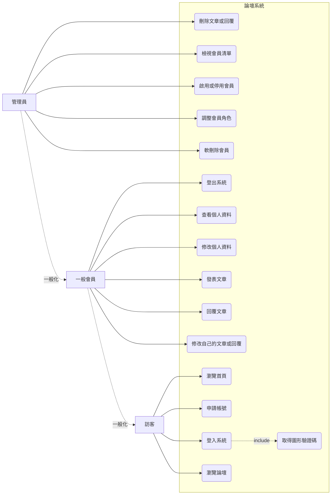
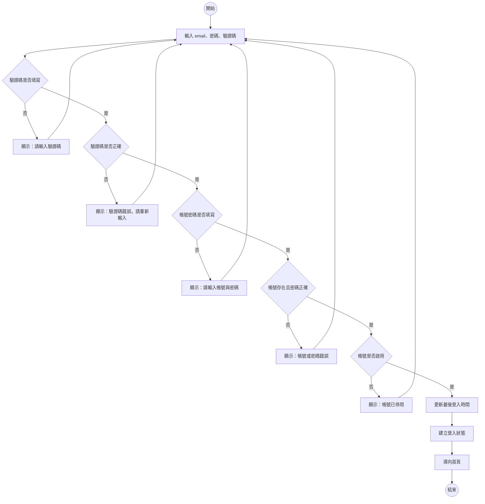
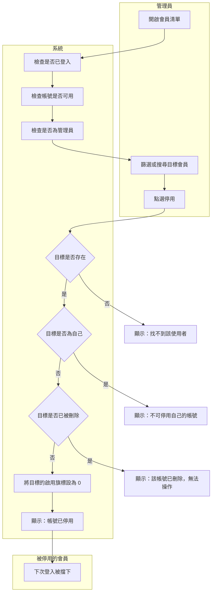
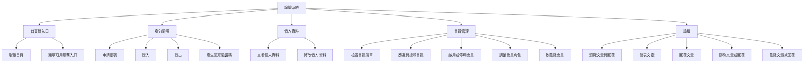
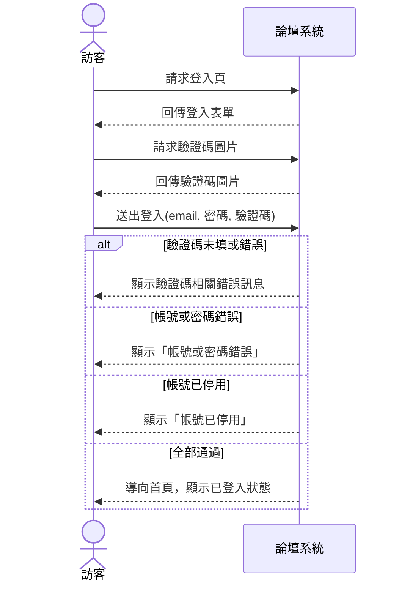
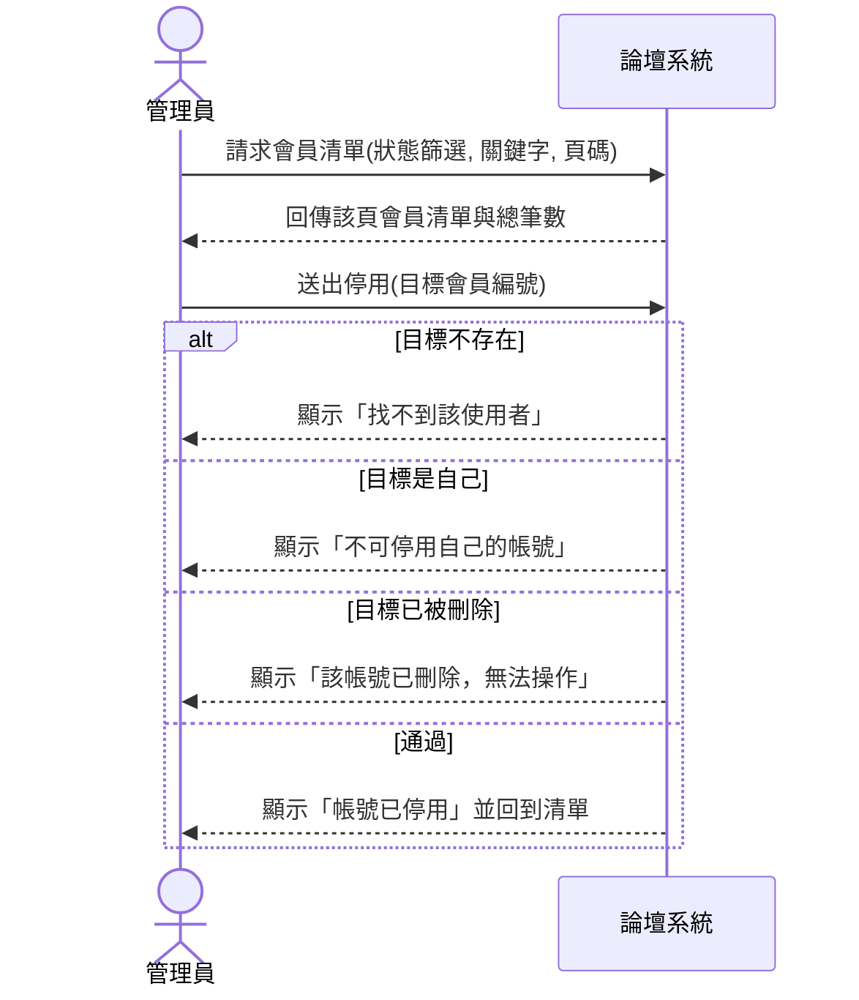
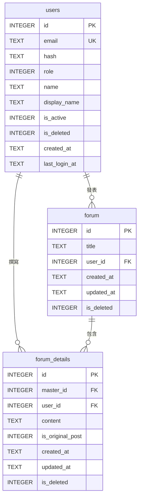
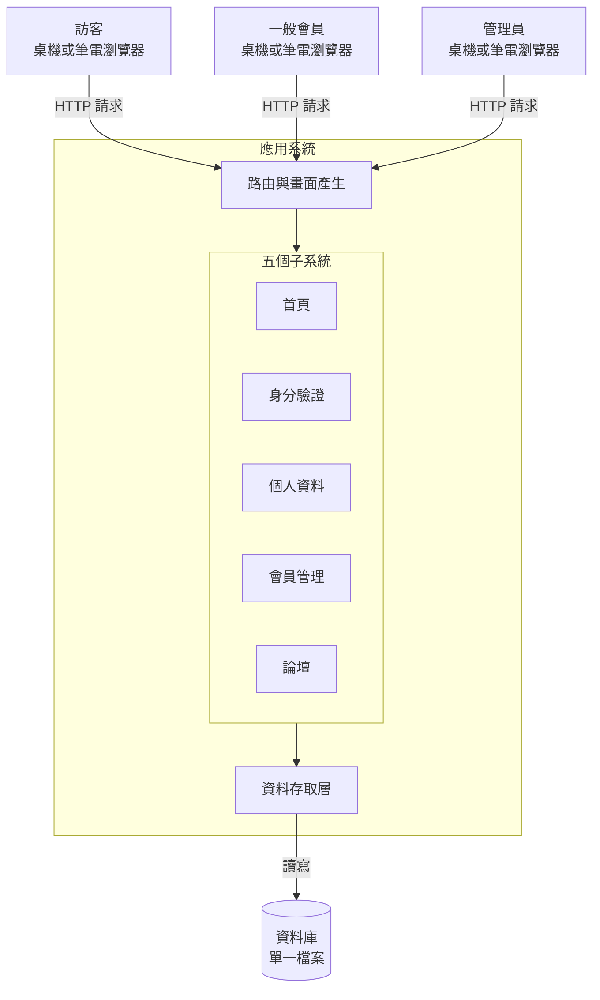

# 系統分析範例報告說明

這份文件是[「報告內容」](../00-Course-Introduction/Report-Contents.md)〈一、期中小組報告〉那九項的示範。九項的定義以那份文件為準，這裡只回答一件事：**每一項實際寫出來長什麼樣子**。

示範對象是課堂用的範例系統 **論壇系統**（`sad-forum`）。它是一套可以實際跑起來操作的完整系統，**完整程式碼與系統文件放在 <https://github.com/billy1125/sad-forum>**，取得方式見〈二、2.1〉。

## 一、這份文件怎麼用

### 1.1 三件事要先講清楚

**範例寫得精簡，那是為了讓你一眼看懂結構，不是篇幅標準。** 每一項只放到「看得出該有哪些欄位、圖上該有哪些東西」為止。你的報告該寫多少就寫多少。

**各組抽到的題目不一樣。** 角色、流程、資料表、畫面全都要換成你那一題的內容。照抄會被看出來，訪談被追問時也答不上來。真正能沿用的是方法：怎麼反推問題、怎麼列需求、圖怎麼對得起來。

**這裡示範的是既有系統分析。** 期中的分析對象已經存在，你的工作是看懂它、把它寫成一致的分析文件，並指出哪裡還可以更好。不必證明它值不值得做，也不必重新設計一套。

### 1.2 做了清單以外的東西要登記

做了標示 **可選** 的項目、或做了九項以外的東西，在書面最前面放一張 **額外項目對照表**：做了什麼、對應哪一項、放在第幾章。**老師只認表上的項目**，沒列出來的視同沒做。額度與認定條件見[「額外投入加分」](../00-Course-Introduction/Bonus-Rules.md)。

### 1.3 關於 AI

遇到不確定的地方，翻課本、找資料，也可以請 AI 幫你梳理思路。但你必須看懂 AI 給你的東西，採用之前要能自己說明那些概念是什麼。使用揭露義務見[「SAD 課程介紹」](../00-Course-Introduction/Course-Introduction.md)〈AI 工具使用揭露〉。

就算你動用 Claude Code、Codex 這類工具，直接把這份說明丟給 AI 叫它照格式生一份報告，老師其實不介意，也沒什麼好遮掩的——你手上這份文件本身就是老師用 AI 協助梳理與撰寫出來的。問題在於，AI 生給你的東西，你真的懂嗎？懂或不懂，會在口頭報告與期末個人訪談的問答裡直接顯現出來。

---

## 二、範例系統速覽

### 2.1 系統是什麼

一套簡單的論壇系統：訪客可以瀏覽討論區、申請帳號並登入，會員可以發表文章與回覆、維護自己的資料，管理員可以治理帳號與內容。

**論壇是這套系統的主體，其餘四個子系統都在支撐它。** 沒有帳號就分不出誰發的文，沒有停用與刪除就處理不了違規的人。這個結構讓「一個被停用的帳號還能不能繼續發文」這種問題問得出來，而那正是分析時最值得追的地方。

| 面向 | 規模 |
|---|---|
| 子系統 | 5 個（首頁、身分驗證、個人資料、會員管理、論壇） |
| 角色 | 3 種（訪客、一般會員、管理員） |
| 資料表 | 3 張（`users`、`forum`、`forum_details`） |
| 路由 | 21 條 |
| 畫面 | 8 個 |
| 外部系統 | **無** |

規模與各組抽到的題目相當：使用者開瀏覽器操作、資料存在後端資料庫、沒有和其他系統耦合。

#### 怎麼取得

**完整程式碼與系統文件放在 <https://github.com/billy1125/sad-forum>。**

```bash
git clone https://github.com/billy1125/sad-forum.git
```

這套系統不隨課程教材一起發佈，要另外取得。裡面除了程式碼，還有一整套系統文件——系統規格書、建置流程書、五個子系統各自的說明——那些文件本身也值得讀，因為它們示範了一套系統的內部文件長什麼樣子。

### 2.2 上哪找資料

分析既有系統有三個資料來源，缺一不可：

| 來源 | 怎麼用 | 位置 |
|---|---|---|
| 實際操作 | 把每個畫面點過一遍，注意什麼被擋住、錯誤訊息說了什麼 | 啟動後開 `http://localhost:4000` |
| 系統文件 | 功能、資料模型、驗證規則、已知技術債 | `document/system-spec.md` |
| 程式碼 | 確認文件與實際行為是否一致 | `blueprints/`、`db/`、`templates/` |

啟動方式（本機直接跑或用容器，擇一）見專案根目錄的 `README.md`。三個種子帳號可直接登入：

| email | 密碼 | 身分 |
|---|---|---|
| `user@example.com` | `password123` | 一般會員 |
| `admin@example.com` | `admin1234` | 管理員 |
| `disabled@example.com` | `disabled123` | 停用帳號（登入會被擋下） |

**第三個帳號請一定要試著登入一次。** 它被擋下時的訊息，與輸入一個不存在的 email 時的訊息不一樣，這個差異是後面第 4 項與第 9 項的材料。

### 2.3 讀程式碼要讀到什麼程度

本課程不要求你每一行都看懂。要看得出來的是這三件事：

- 一個畫面上的按鈕，按下去會走到哪一條路由（看 `blueprints/*/__init__.py` 的 `@bp.route`）。
- 那條路由讀寫哪張資料表（看它呼叫哪個 `db.*` 函式，再去 `db/users.py` 或 `db/forum.py` 看那個函式的 SQL）。
- 哪些操作在什麼條件下會被擋下（看路由開頭那幾行 `if`）。

這三件事看懂了，第 4、6、7 項就寫得出來。

---

## 三、九項書面內容的示範

以下依[「報告內容」](../00-Course-Introduction/Report-Contents.md)的順序展開。每一項先列該有的欄位，再給範例。

**這九個編號是閱讀順序，不是動手順序。** 讀者從第 1 項讀起，你卻不該從第 1 項寫起——理由見下一節。

### 1. 問題與系統背景

#### 這一項要最後才寫得完

第 1 項與第 9 項是同一條邏輯的兩端：開頭問「這套系統當初要解決什麼問題」，結尾答「解決得如何、還剩什麼沒解決」。中間七項的分析，都是為了讓這兩端有憑有據。

所以它排在第 1，是因為它是報告書的第一章，讀者要先看到。**真正要寫進去的東西，得把第 2 到第 8 項盤過一遍才答得出來**——當初要解決什麼問題，是從角色、流程、需求、資料與邊界逐一反推出來的，不是憑印象想出來的。太早動筆，多半只能寫出「提升管理效率」「改善使用者體驗」這種換到任何一個系統都成立的句子。

建議的做法是分兩次寫：

| 時機 | 寫什麼 | 用途 |
|---|---|---|
| 開工時 | 一份草稿：這看起來是什麼系統、大概在解決什麼、這次打算分析哪些範圍 | 當作分析方向，避免漫無目的地亂點 |
| 第 2 到第 8 項做完後 | 回頭重寫，補上「推論依據」那一欄，並與第 9 項一起收尾 | 這才是交出去的版本 |

**第一次憑印象寫下的問題，跟做完分析之後的版本通常差很多。** 那個落差本身就是分析的成果，值得在報告裡留一句話交代——例如「初步認為主要問題是介面不夠直覺，完成流程與權限分析後發現，真正的斷點在帳號停用之後的處理」。

#### 該交代什麼

| 項目 | 說明 |
|---|---|
| 系統概述 | 這是什麼系統、誰在用、在什麼場域運作 |
| 分析範圍 | 這次分析涵蓋哪些子系統，不涵蓋哪些 |
| 原本要解決的問題 | 反推出來的，三到五條 |
| 系統做了哪些、哪些仍靠人工 | 兩欄對照 |
| 推論依據 | 上述判斷是從哪個功能、哪張表、哪條限制看出來的 |

最後一欄是期中報告特有的。你的問題與目標是反推出來的，要說明推論從哪裡來，讀者才判斷得出可不可信。這一欄也是訪談時最容易被追問的地方。

#### 反推的方法

系統上的每一個功能、每一道關卡、每一份紀錄，當初都是為了解決某個問題才被加上去的。逐項問：**這個設計在防止什麼、補救什麼、或方便誰？**

| 系統上看到的 | 可以推出的問題 |
|---|---|
| 登入要輸入圖形驗證碼，申請帳號卻不用 | 被自動化程式大量嘗試登入過，但註冊沒遇到同樣的壓力 |
| 帳號有「停用」這個狀態，而不是只有刪除 | 需要暫時擋住某個人但保留紀錄，例如爭議還沒查清楚的時候 |
| 刪除帳號只是把旗標設為 1，紀錄仍留在資料庫 | 出事之後要查得到這個帳號做過什麼 |
| 管理員不能停用自己、不能刪除自己、不能改自己的角色 | 有人把自己鎖在外面過，或至少預期得到會發生 |
| 論壇文章的刪除權收給管理員，作者自己不能刪 | 有人刪掉自己的文章，導致底下所有人的回覆一起消失 |
| 帳號被停用後，他發過的文章照常顯示 | 討論的脈絡屬於整個討論區，不隨作者的狀態消失 |

推不出來的部分要誠實標示。例如「`role` 欄位只有 0 與 1 兩個值，看不出當初有沒有規劃第三種角色，需查閱開發紀錄或訪談維護者」——這比硬掰一個理由有價值，訪談被追問時也站得住。

方法的完整說明見教材[「問題定義與現況分析」](../01-Course-Materials/02-Problem-Definition.md)〈一〉與〈二〉。

#### 範例：系統做了哪些、哪些仍靠人工

| 事項 | 系統處理的部分 | 仍靠人工或根本沒有 |
|---|---|---|
| 申請帳號 | 自助申請，即時生效 | 無人審核，任何 email 都能註冊 |
| 忘記密碼 | **沒有這個功能** | 使用者只能求助管理員，但管理員也沒有重設密碼的介面 |
| 停用帳號 | 有，管理員一鍵切換 | 「該不該停用」的判斷與通知當事人 |
| 還原被刪除的帳號 | **沒有這個功能**，軟刪除是終態 | 只能重新申請一個新帳號，舊的紀錄接不回來 |
| 升為管理員 | 有，由既有管理員指定 | 決定誰該當管理員 |
| 處理不當內容 | 刪除功能有 | 判斷什麼算不當、檢舉管道在系統之外 |

右欄那幾個「沒有這個功能」，就是第 9 項改善建議的第一批候選。

---

### 2. 使用者與利害關係人分析

#### 該交代什麼

先分兩層：**使用者** 是會直接操作畫面的人；**利害關係人** 範圍更大，包含不碰畫面但會影響系統或被系統影響的人。漏掉一個角色，就會連帶漏掉他那一組功能、權限規則與例外情況。

找角色的方法是把流程從頭走一遍，逐一問：誰輸入資料、誰查看資料、誰維護系統、誰為結果負責。

#### 建議欄位

| 欄位 | 說明 |
|---|---|
| 角色名稱 | 用角色名，不要用人名或部門名 |
| 使用目標 | 這個角色為什麼需要這套系統 |
| 主要需求 | 需要系統提供哪些功能 |
| 權限範圍 | 可以做什麼、不能做什麼 |
| 最在意什麼 | 這一欄常常是非功能需求的來源 |

#### 範例：角色分析

| 角色 | 使用目標 | 主要需求 | 權限範圍 | 最在意 |
|---|---|---|---|---|
| 訪客 | 進入系統、成為會員 | 瀏覽首頁、瀏覽論壇、申請帳號、登入 | 只能讀公開內容，不能發文、不能看個人資料 | 申請流程不要太麻煩 |
| 一般會員 | 維護自己的資料、參與討論 | 登入登出、查看與修改個人資料、發表與回覆文章、修改自己的內容 | 不能刪除任何內容、不能看別人的帳號資料 | 自己發的內容不會莫名消失 |
| 管理員 | 治理帳號與內容 | 會員清單、篩選搜尋、啟用停用、調整角色、軟刪除、刪除任何文章與回覆 | 一般會員的全部權限再加上管理功能；**不能對自己執行停用、刪除、改角色** | 不要把自己鎖在系統外 |

#### 範例：利害關係人

| 利害關係人 | 是否操作系統 | 受影響的方式 |
|---|---|---|
| 系統維護者 | 否 | 負責部署、備份與還原資料庫；沒有稽核紀錄時，出事只能靠猜 |
| 課程教師與助教 | 少量 | 用這套系統當教學案例，需要它能被重置回初始狀態 |
| 被討論到的第三人 | 否 | 論壇內容公開可見，內容涉及他時他沒有任何管道要求處理 |

第三列值得注意。這種「不碰系統但被系統影響」的角色最容易被漏掉，而漏掉他就等於漏掉了「檢舉與申訴」這一整組功能——這正是第 9 項可以寫的東西。

#### 使用案例圖

**這是期中三張必做 UML 的第一張**，回答「誰要做什麼」。圖上每一個參與者，都要能在上面兩張表裡找得到。



三件事要注意：

- **一般化**：管理員能做一般會員的所有事，一般會員能做訪客的所有事，因此用一般化把重複的連線收掉。不畫一般化也可以，代價是圖上會多出十幾條線。
- **«include»**：登入一定會用到驗證碼，所以是包含關係。若是「只在某條件下才發生」，那才是 «extend»。初學階段拿不準就用 «include»。
- 上圖以流程圖語法示意。正式的 UML 使用案例圖中，使用案例畫成橢圓、參與者畫成人形符號，系統邊界是包住所有橢圓的方框。

**「刪除文章或回覆」只掛在管理員身上，是這張圖最值得講的一格。** 一般會員可以修改自己的文章卻不能刪除，這條界線畫得很刻意，也是第 1 項反推出來的問題之一。

畫法與常見錯誤見教材[「使用者分析」](../01-Course-Materials/03-User-Analysis.md)〈六〉。

---

### 3. 現況流程分析

#### 該交代什麼

**至少兩條流程：主要角色一條、次要角色一條。** 每條都要交代從什麼事件開始、做到什麼狀態算結束。

除了一切順利的那條路，**重要的例外一定要畫出來**。一張沒有任何判斷節點的活動圖，等於把文字重排一次。系統上線後出問題的地方多半在例外分支。

#### 建議的文字格式

每條流程先寫成文字，再畫成圖：

```text
流程名稱：
主要角色：
觸發事件：
前置條件：
主要步驟：
例外情況：
完成後狀態：
```

#### 範例一：會員登入（主要角色）

> **流程名稱**：會員登入
> **主要角色**：訪客
> **觸發事件**：訪客在登入頁或首頁的內嵌表單送出帳號密碼
> **前置條件**：已載入驗證碼圖片
> **主要步驟**：輸入 email、密碼、驗證碼 → 系統驗證驗證碼 → 驗證帳號密碼 → 檢查帳號狀態 → 建立登入狀態 → 導向首頁
> **例外情況**：驗證碼未填或錯誤、帳密未填、帳號或密碼錯誤、帳號已停用
> **完成後狀態**：系統記住登入者身分，並更新該會員的最後登入時間



**這張圖上的分支順序不能任意調換，那本身就是一項分析發現。** 驗證碼排在帳號密碼之前，是為了在不查資料庫的情況下先擋掉自動化請求；而「帳號不存在」「帳號已刪除」「密碼錯誤」三種情況合併成同一則訊息，「帳號已停用」卻單獨給一則——前者避免有人藉此試出哪些 email 註冊過，後者是因為停用可以回復，告訴使用者去找管理員是合理的。

這種「為什麼是這個順序」的說明，比把步驟抄一遍有價值得多。

#### 範例二：管理員停用會員（次要角色，跨角色泳道）



跨泳道的箭頭代表責任的移交。這張圖有兩處值得寫進報告：

- **系統這一側的前三個動作（已登入 → 帳號可用 → 是管理員）順序不可調換。** 第二關失敗代表身分失效，處置是把人登出；第三關失敗代表權限不足，處置是導回首頁。調換順序會讓一個停用中的管理員收到與事實不符的回饋。
- **「不可停用自己」這條分支不是防呆，是防止系統被鎖死。** 配合「不可刪除自己」「不可改自己的角色」，可以推得系統中永遠至少有一個可用的管理員。

活動圖的符號、泳道畫法與常見錯誤見教材[「行為建模」](../01-Course-Materials/06-Behavioral-Modeling.md)〈二〉、〈三〉。

---

### 4. 系統需求分析

#### 該交代什麼

功能需求與非功能需求各一張表。**每一條都要找得到依據**——來自哪個畫面、哪條路由、哪個欄位、哪條錯誤訊息。不能靠想像補出系統沒有的功能。

「依據」那一欄是期中報告的重點。有了它，讀者才分得出哪些是你查到的、哪些是你猜的。

#### 範例：功能需求

| 編號 | 功能需求 | 依據 |
|---|---|---|
| FR-01 | 系統應提供首頁，並依登入狀態顯示不同內容 | 首頁畫面訪客與登入後兩種版面 |
| FR-02 | 系統應提供圖形驗證碼，於每次載入時產生新的答案 | 登入頁的驗證碼圖與重新整理按鈕 |
| FR-03 | 系統應提供申請帳號功能，新帳號一律為一般會員 | 申請頁；`users.role` 預設值為 1 |
| FR-04 | 申請帳號時應檢核電子郵件格式、密碼長度與兩次密碼是否一致 | 申請頁的三種錯誤訊息 |
| FR-05 | 系統應拒絕重複的電子郵件註冊 | 錯誤訊息「此電子郵件已被使用」；`users.email` 為唯一欄位 |
| FR-06 | 系統應提供登入功能，成功後記錄最後登入時間 | 登入流程；`users.last_login_at` 欄位 |
| FR-07 | 系統應阻擋已停用或已刪除的帳號登入 | 種子帳號 `disabled@example.com` 實測 |
| FR-08 | 系統應提供登出功能，登出後回到登入頁 | 各頁右上角的登出連結 |
| FR-09 | 系統應提供個人資料檢視，顯示信箱、姓名、顯示名稱、角色、建立時間與最後登入時間 | 個人資料頁六個欄位 |
| FR-10 | 系統應允許會員修改自己的姓名與顯示名稱 | 個人資料頁的編輯模式 |
| FR-11 | 系統應阻擋未登入者進入個人資料頁 | 未登入直接開啟該網址會被導向登入頁 |
| FR-12 | 系統應提供論壇文章列表，依最後活動時間由新到舊排序 | 論壇主頁；有新回覆的文章會移到最上面 |
| FR-13 | 系統應開放訪客瀏覽論壇，但發表與回覆須先登入 | 未登入時論壇可讀，右上角顯示「登入」 |
| FR-14 | 系統應允許會員發表文章，文章由標題與內文組成 | 新增文章表單的兩個欄位 |
| FR-15 | 系統應允許會員回覆文章，並將該文章移至列表最上方 | 回覆後列表排序改變 |
| FR-16 | 系統應允許原作者或管理員修改文章標題與內容 | 非作者開啟修改頁會被擋下 |
| FR-17 | 系統應僅允許管理員刪除文章與回覆，刪除文章時一併刪除其所有回覆 | 一般會員的文章上沒有刪除按鈕 |
| FR-18 | 系統應提供會員清單，支援依狀態篩選、關鍵字搜尋與分頁 | 會員管理頁的篩選列與分頁列 |
| FR-19 | 系統應允許管理員啟用、停用會員，並調整其角色 | 會員明細頁的操作區 |
| FR-20 | 系統應允許管理員刪除會員，刪除後紀錄仍可查閱 | 「已刪除」篩選仍列得出該筆 |
| FR-21 | 系統應禁止管理員對自己執行停用、刪除與角色調整 | 三則自我保護的錯誤訊息 |

#### 範例：非功能需求

| 編號 | 非功能需求 | 依據 |
|---|---|---|
| NFR-01 | 密碼不得以明文儲存，須經雜湊後保存 | `users.hash` 欄位存的是雜湊值，不是密碼 |
| NFR-02 | 登入須先通過圖形驗證碼，且驗證碼應在查詢資料庫之前檢查 | 驗證順序：驗證碼在帳密之前 |
| NFR-03 | 帳號不存在、已刪除與密碼錯誤三種情況，須回覆相同的錯誤訊息 | 三者實測皆顯示「帳號或密碼錯誤」 |
| NFR-04 | 刪除一律為軟刪除，資料須保留在資料庫中 | `is_deleted` 旗標；已刪除的帳號仍查得到 |
| NFR-05 | 權限檢查須依「已登入 → 帳號可用 → 具管理員身分」的順序執行 | 停用中的管理員被登出，而非收到「無權限」 |
| NFR-06 | 系統中須永遠至少存在一個可用的管理員 | 由三條自我保護規則推得 |
| NFR-07 | 會員清單與論壇列表須分頁，每頁筆數固定 | 資料超過一頁時出現分頁列 |
| NFR-08 | 系統須可於容器中啟動，資料以獨立磁碟區保存 | `Dockerfile` 與 `docker-compose.yml` |
| NFR-09 | 錯誤訊息應說明問題所在，但不得洩漏帳號是否存在 | 同 NFR-03 |

**NFR-05 與 NFR-06 是這份清單裡最有價值的兩條**，因為它們不是從畫面上看得到的，是從「不同狀況下系統給了不同回應」推出來的。能寫出這種需求，代表分析真的做進去了。

需求的分類、寫法與品質判準見教材[「系統需求分析」](../01-Course-Materials/04-System-Requirements-Analysis.md)。

---

### 5. 功能分析與系統邊界

#### 該交代什麼

- 系統有哪些重要功能，可以歸成哪幾群。
- 分解停在「使用者做得完一件事」，不要拆到「按下確認鈕」。
- 哪些事情系統不做、留給人工或別的方式完成——這條界線就是系統邊界。

#### 範例：功能階層圖



分群依業務性質，不依畫面。**「首頁與入口」這一群最容易被學生併掉**，但它有自己的規則（依登入狀態與角色決定顯示哪些卡片），刪掉它這條規則就沒有地方掛。

#### 範例：功能清單

功能階層圖呈現結構，功能清單承載細節。兩者搭配使用：

| 代號 | 功能名稱 | 使用角色 | 對應需求 | 對應使用案例 |
|---|---|---|---|---|
| F-22 | 登入 | 訪客 | FR-06、FR-07、NFR-02、NFR-03 | UC-03 |
| F-43 | 啟用或停用會員 | 管理員 | FR-19、FR-21、NFR-05 | UC-13 |
| F-55 | 刪除文章或回覆 | 管理員 | FR-17 | UC-11 |

「對應需求」與「對應使用案例」兩欄不可省略。它們讓每一項功能都答得出「我為什麼存在」，也是第 9 項回頭找問題時的入口。

#### 範例：系統邊界

| 界內（本系統負責） | 界外（本系統不做） |
|---|---|
| 帳號的申請、登入、停用、角色與軟刪除 | 寄送任何電子郵件（包含密碼重設信） |
| 個人資料的查看與修改 | 帳號的還原；軟刪除是終態 |
| 論壇文章與回覆的建立、修改、刪除 | 內容的檢舉與申訴流程 |
| 圖形驗證碼的產生與比對 | 第三方登入（Google、學校單一登入等） |
| 依角色決定可見與可操作的範圍 | 操作稽核紀錄；系統不記錄誰在何時做了什麼管理動作 |

**右欄不是隨手列的，每一條都要說得出「怎麼確認它不在界內」。** 例如「不寄送電子郵件」的依據是：整份程式碼沒有任何寄信的設定，路由表上也沒有忘記密碼的入口。

**可選**：若系統與其他系統或設備有資料往來，要標出交界在哪一段。**這套範例系統沒有任何外部介接**，所以這一項不適用；若你的題目有，就必須寫。反過來說，「經查證確認沒有外部系統」本身也是一項分析結論，值得寫一句話交代，不要留白讓人以為是漏了。

系統邊界的判定方法、界外對象的三種類型與範圍外清單的寫法，見教材[「功能分析」](../01-Course-Materials/05-Functional-Analysis.md)〈二〉。

---

### 6. 使用案例與系統互動分析

#### 該交代什麼

- 從重要使用案例中選 **1 到 2 個核心流程**，畫系統循序圖（System Sequence Diagram, SSD）。
- SSD 把整套系統當成一個黑箱，只畫使用者與系統之間的訊息往返。
- 能說明同一個使用案例在「文字敘述、活動圖、SSD」三者之間怎麼對應。

**可選**：程式物件、Controller、Service 或 Repository 這類技術類別。期中不要求，畫了也不會取代必做項目的分數。

#### 使用案例敘述

SSD 不是憑空畫的，來源是使用案例敘述。先把敘述寫出來：

| 欄位 | 內容 |
|---|---|
| 編號與名稱 | UC-03 登入系統 |
| 主要參與者 | 訪客 |
| 前置條件 | 已載入登入頁，驗證碼圖片已產生 |
| 觸發 | 訪客送出登入表單 |
| 主要流程 | 1. 訪客請求登入頁 2. 系統回傳表單與驗證碼圖 3. 訪客送出 email、密碼、驗證碼 4. 系統驗證驗證碼 5. 系統驗證帳號與密碼 6. 系統檢查帳號狀態 7. 系統記錄登入時間並建立登入狀態 8. 系統導向首頁 |
| 例外流程 | 4a 驗證碼未填或錯誤 5a 帳號密碼未填 5b 帳號或密碼錯誤 6a 帳號已停用 |
| 後置條件 | 系統記住登入者身分；該會員的最後登入時間被更新 |

#### 範例一：UC-03 登入系統



#### 範例二：UC-13 停用會員



畫這兩張圖時有三條規則：

**訊息要寫出攜帶的資料。** 只寫「送出登入」不夠，要寫成 `送出登入(email, 密碼, 驗證碼)`。括號裡的參數就是這個操作需要的輸入欄位，它會直接對到第 7 項的資料欄位。只寫動作不寫參數，這張圖對後面的工作沒有貢獻。

**每一條進去的訊息都要有回應。** 送進去沒有回傳箭頭，就要問：使用者怎麼知道這件事做完了？

**黑箱裡不要出現內部動作。** 圖上不該有「系統查詢資料庫」「系統呼叫雜湊函式」這類系統對自己的箭頭，那些屬於設計階段。

#### 三者怎麼對得起來

| 對照 | 檢查什麼 | 以 UC-03 為例 |
|---|---|---|
| 敘述 → 活動圖 | 每一條例外流程，圖上都有對應的判斷節點 | 4a、5a、5b、6a 對應到 D1／D2、D3、D4、D5 |
| 活動圖 → SSD | 圖上每一次跨系統邊界的動作，都是 SSD 上的一條訊息 | 「輸入 email、密碼、驗證碼」對應 `送出登入(...)` |
| SSD → 需求 | 每一條訊息與回應，都對得到一條功能需求 | 「帳號已停用」對應 FR-07 |

對不上的地方，不是圖畫錯了，就是有東西被漏掉了，兩種都值得在交件前查清楚。

畫法與片段語法見教材[「行為建模」](../01-Course-Materials/06-Behavioral-Modeling.md)〈四〉。

---

### 7. 資料需求分析

#### 該交代什麼

三份東西，是同一件事看三次、一次比一次細：

| 層次 | 回答的問題 | 產出 |
|---|---|---|
| 1 | 這個系統管哪些資料？彼此什麼關係？ | ERD |
| 2 | 存成哪幾張表？主鍵與外鍵是哪幾欄？ | Schema 與資料表清單 |
| 3 | 每一欄到底存什麼？ | 資料字典 |

**三者要對得起來**：ERD 上的每個實體，在 Schema 找得到表；Schema 每張表的每一欄，在資料字典找得到定義。少一層或對不上，代表資料模型還沒看懂。

**可選**：索引、Trigger、Stored Procedure 等資料庫實作細節。期中不要求。

#### 範例：ERD



**`forum` 與 `forum_details` 是一組主檔／明細結構**：標題屬於「一篇文章」，內容屬於「一則發言」。同一篇文章的第一則內文與後續回覆都存在明細表，用 `is_original_post` 區分。這個結構在別的題目上會換個名字出現——訂單／訂單明細、活動／報名、借用單／借用明細，都是同一件事。

#### 這張 ERD 有一件事必須寫進報告

**這三條關聯在資料庫裡其實不存在。** 整套系統沒有任何一個 `FOREIGN KEY` 宣告，關聯全靠程式在查詢時自己接起來。ERD 上畫成關聯是對的，因為業務上確實是那個關係；但分析報告要指出實作與模型之間的這個落差，並說明它造成什麼後果：

- 可以寫入一筆指向不存在使用者的文章，資料庫不會拒絕。
- 刪除一個使用者不會連帶處理他的文章。
- 刪除一篇文章不會自動刪除它的回覆，這件事必須由程式明寫。

看得出這一層，代表你不只是把畫面上的欄位抄下來。

#### 範例：Schema 與主鍵外鍵

| 資料表 | 用途 | 主鍵 | 對外參照 |
|---|---|---|---|
| `users` | 會員帳號 | `id` | 無 |
| `forum` | 文章主檔，只存標題與發文者 | `id` | `user_id` → `users.id` |
| `forum_details` | 內文與回覆 | `id` | `master_id` → `forum.id`、`user_id` → `users.id` |

`users.email` 另有唯一約束，是實際的登入帳號。

#### 範例：資料字典（`users` 表）

| 欄位名稱 | 中文名稱 | 型別 | 必填 | 值域／格式 | 資料來源 |
|---|---|---|---|---|---|
| `id` | 會員編號 | INTEGER | 是 | 主鍵，系統流水號 | 系統產生 |
| `email` | 電子郵件 | TEXT | 是 | 唯一；須含 `@` 與一個點 | 使用者輸入 |
| `hash` | 密碼雜湊 | TEXT | 是 | bcrypt 雜湊字串，非明文 | 系統產生 |
| `role` | 角色 | INTEGER | 是 | `0` 管理員、`1` 一般會員；預設 1 | 系統預設或管理員指定 |
| `name` | 姓名 | TEXT | 否 | 無長度限制；空白存為 NULL | 使用者輸入 |
| `display_name` | 顯示名稱 | TEXT | 否 | 同上 | 使用者輸入 |
| `is_active` | 是否啟用 | INTEGER | 是 | `1` 啟用、`0` 停用；預設 1 | 系統預設或管理員切換 |
| `is_deleted` | 是否已刪除 | INTEGER | 是 | `1` 已刪除、`0` 未刪除；預設 0 | 管理員執行刪除 |
| `created_at` | 建立時間 | TEXT | 是 | `YYYY-MM-DD HH:MM:SS`，UTC | 系統產生 |
| `last_login_at` | 最後登入時間 | TEXT | 否 | 同上；從未登入時為 NULL | 系統於登入成功時寫入 |

**「值域」是這張表最有價值的一欄。** 前面幾欄多數人都填得出來，值域則逼你把業務規則寫死：`role` 到底有哪幾個值、`is_active` 與 `is_deleted` 兩個旗標組合起來有幾種狀態、哪些狀態下不能登入。填得出來，代表你真的把系統操作過。

同樣的表要為 `forum` 與 `forum_details` 各做一份。`forum_details.is_original_post` 與兩張表的 `updated_at` 特別值得寫清楚——主檔的 `updated_at` 是「最後活動時間」，有新回覆會更新它；明細的是「最後編輯時間」，只有內容被改才更新。這個差異直接決定了文章在列表上的排序。

方法與檢查方式見教材[「資料建模與資料庫設計」](../01-Course-Materials/07-Data-Modeling.md)。

---

### 8. 系統環境與整體架構理解

#### 該交代什麼

- 系統用在哪些裝置或工作環境中。
- 使用者端、應用系統、資料庫與外部系統之間的整體關係。

期中的最低要求就是這兩件事，**不必分析微服務、負載平衡或雲端服務設計**，那些既看不出來也不是重點。

#### 範例：架構圖



圖上要標出來的四件事：

| 要標的 | 這套系統的情況 |
|---|---|
| 有哪些部分 | 使用者端瀏覽器、應用系統、資料庫；沒有外部系統 |
| 各部分在哪裡 | 三者跑在同一台機器上，可用容器打包成單一服務 |
| 彼此怎麼連 | 瀏覽器以 HTTP 連應用系統，應用系統直接讀寫本機的資料庫檔案 |
| 誰主動 | 一律由瀏覽器發起，系統不主動推送任何東西 |

#### 使用環境

| 面向 | 現況 |
|---|---|
| 使用裝置 | 桌上型或筆記型電腦的瀏覽器 |
| 行動裝置 | 版面沒有針對小螢幕調整，手機上可開但操作不便 |
| 網路 | 需連線才能操作，沒有離線暫存 |
| 畫面產生方式 | 由伺服器產生完整頁面回傳，每次操作都會整頁重新載入 |

**最後一列值得寫。** 它解釋了為什麼這套系統的每個動作都是「送出表單 → 換頁」，而不是像許多網站那樣在原地更新。這是架構決定的行為，不是設計者偷懶。

**這裡也是說明「業務規則放在哪一層」的地方。** 這套系統的所有檢查（權限、驗證碼、自我保護規則）都在應用系統執行，瀏覽器只負責顯示與收集輸入。所以就算有人繞過畫面直接送出請求，該擋的一樣擋得住。

架構圖要標什麼、期中做到哪裡，見教材[「系統環境與架構」](../01-Course-Materials/08-System-Architecture.md)。

---

### 9. 現況問題與改善建議

這一項是分析深度的主要判斷材料。整份報告如果只描述現況、沒有從分析結果提出問題與改善方向，代表停留在系統介紹，還沒完成系統分析。

**它與第 1 項一起收尾。** 第 1 項問「當初要解決什麼問題」，這一項答「解決得如何、還剩什麼沒解決」，兩者的材料都來自中間七項。做到這裡，回頭把第 1 項的草稿改成正式版本，整份報告才首尾閉合。

#### 先講一件事

**這套範例系統把 30 條已知缺陷寫在規格書第 11 章。** 那是為了教學——讓你看見「已知的問題」如何具體地存在於程式碼中。但 **各組拿到的題目不會附這樣一份清單**，老師會把問題藏在系統裡，要你自己挖出來。

所以這一節示範的是 **怎麼從自己畫的圖挖出問題**，不是怎麼抄清單。照抄第 11 章的組別，訪談時被問「你是從哪一張圖看出來的」就會卡住。

#### 問題要從自己的分析裡長出來

前面八項的產出，每一份都會自己浮出問題。逐項回頭掃一次：

| 分析產出 | 會浮出的問題 |
|---|---|
| 使用案例圖 | 某個角色只能看不能改、某項作業完全沒有系統支援 |
| 活動圖 | 例外情況沒人處理、同一件事在兩條路徑上規則不同 |
| 需求清單 | 有需求卻找不到對應功能、有功能卻對不到任何需求 |
| 功能清單與系統邊界 | 界外那幾條「系統不做」，是不是真的不需要做 |
| ERD 與資料字典 | 欄位沒有值域定義、關聯只存在模型上、資料無人維護 |
| 架構圖 | 單點故障、資料沒有備份機制 |
| 利害關係人清單 | 某個利害關係人完全沒有任何功能對應到他 |

#### 改善建議的三個層次

同一個問題，往往在三個層次都有處理的餘地。**只寫系統層次的報告，分析深度一定不夠。**

| 層次 | 處理什麼 |
|---|---|
| 流程 | 作業的順序、分工與規則 |
| 系統 | 功能、資料、介面 |
| 組織 | 權責、訓練、規範 |

#### 一條建議要包含四個部分

| 部分 | 說明 |
|---|---|
| 建議 | 具體要做什麼 |
| 針對的問題 | 對應到前面哪一條問題 |
| 依據 | 來自哪一份分析產出——**這一欄是分數的關鍵** |
| 預期效果 | 改善之後哪個指標或行為會不一樣 |

#### 範例一：停用帳號後，當事人仍可修改自己的資料

> **建議**：在「修改個人資料」這條路徑上補上帳號狀態檢查，與其他需要登入的功能一致。屬於系統層次。
> **針對的問題**：管理員停用一個帳號之後，該帳號只要瀏覽器還記著登入狀態，仍然可以成功修改自己的姓名與顯示名稱。
> **依據**：第 2 項的權限矩陣顯示「修改個人資料」需要登入；第 3 項的停用流程顯示停用的後置條件是「其後無法登入」。兩者對照後實測發現，停用只擋住了「重新登入」，沒有擋住「已經登入的狀態」。第 4 項 FR-11 只寫了「阻擋未登入者」，也沒有涵蓋這種情況。
> **預期效果**：停用動作的效果與 FR-19 的描述一致，管理員停用一個帳號之後不需要再另外確認對方是否還在線上。

**這一條是示範「怎麼靠交叉比對找出問題」的最好例子。** 它不是操作系統時直接看得到的，是把權限矩陣與流程圖的後置條件擺在一起才浮出來的。

#### 範例二：忘記密碼沒有任何解法

> **建議**：短期在登入頁標明「忘記密碼請聯絡管理員」，並在管理員端提供重設密碼的功能；長期評估是否導入以電子郵件重設密碼的流程。前者是流程與系統，後者牽涉到要不要引入寄信能力，屬於組織層次的決定。
> **針對的問題**：使用者忘記密碼時無路可走。系統沒有忘記密碼功能，管理員也沒有重設他人密碼的介面，實際上只能重新申請一個帳號，而舊帳號的論壇文章接不回新帳號。
> **依據**：第 5 項的功能清單中，身分驗證群組只有申請帳號、登入、登出與驗證碼四項；會員管理群組的五項操作裡沒有任何一項處理密碼。第 5 項的系統邊界表把「寄送電子郵件」列為界外，因此連自助重設的技術前提都不存在。
> **預期效果**：使用者不再因為忘記密碼而失去既有內容；管理員有一個明確的處理方式，不必臨時想辦法。

#### 範例三：沒有任何操作紀錄

> **建議**：為管理動作（啟用、停用、角色調整、刪除）建立一張紀錄表，至少記下誰、在什麼時候、對誰做了什麼。屬於系統層次；配套的「多久查閱一次、由誰負責」屬於組織層次。
> **針對的問題**：一個帳號被停用之後，系統查不出是哪位管理員做的、什麼時候做的、為什麼。有爭議時無從追究。
> **依據**：第 7 項的資料字典顯示 `users` 表只有 `is_active` 與 `is_deleted` 兩個當前狀態欄位，沒有任何欄位記錄狀態變更的歷程；三張資料表裡也沒有任何一張是紀錄用途的。第 1 項反推時已經看出「軟刪除是為了出事後查得到」，但系統只留下了結果，沒有留下經過。
> **預期效果**：管理動作可追溯，也讓「軟刪除」這個設計的原始意圖真正成立。

#### 挑哪幾條寫

找到的問題不必全部寫進報告。用兩個維度排序：

| | 影響大 | 影響小 |
|---|---|---|
| **改法明確** | 優先寫，是報告的主體 | 一句話帶過 |
| **改法不明** | 值得寫，但要說明還需要什麼資訊 | 不必寫 |

右下角那一格要克制。報告裡塞滿無關痛癢的小問題，會稀釋掉真正重要的那幾條。

**期中到此為止。** 改善建議只要提出合理方向，不必也不應該完成新系統設計——畫出新的架構圖、資料表、畫面原型，那是期末的工作。

方法與更多範例見教材[「問題定義與現況分析」](../01-Course-Materials/02-Problem-Definition.md)〈六〉、〈七〉。

---

## 四、期中的 UML 最低要求

期中必做的只有三種圖，各回答一個問題：

| 圖 | 回答的問題 | 在哪一項 | 數量 |
|---|---|---|---|
| 使用案例圖 | 誰要做什麼 | 第 2 項 | 至少 1 張，涵蓋所有角色 |
| 活動圖 | 事情怎麼做 | 第 3 項 | 至少 2 張，含例外分支；跨角色時用泳道 |
| 系統循序圖 | 使用者與系統怎麼互動 | 第 6 項 | 1 至 2 張核心流程 |

**可選**：概念類別圖。期中先把需求、流程與 ERD 串接一致，比再多一張與 ERD 容易混淆的圖更重要。這張圖 **期末是必做**，等你畫過一輪 ERD 之後再學，兩者的差別會清楚很多。

三張圖不是三份各自獨立的作業。同一個使用案例應該能在使用案例圖上找到那個橢圓、在活動圖上找到那條流程、在循序圖上找到那串訊息。對不上就是有東西漏了。

---

## 五、最低繳交標準

交件前逐項核對：

| 項目 | 必備 | 檢查重點 |
|---|---|---|
| 1 問題與系統背景 | 是 | 有沒有「推論依據」那一欄 |
| 2 使用者與利害關係人分析 | 是 | 使用案例圖上的參與者，清單裡都找得到 |
| 3 現況流程分析 | 是 | 至少兩條流程；活動圖上有判斷節點 |
| 4 系統需求分析 | 是 | 每條需求都寫得出依據 |
| 5 功能分析與系統邊界 | 是 | 有「這次不做」的清單，且說得出怎麼確認的 |
| 6 使用案例與系統互動分析 | 是 | 循序圖的訊息有寫參數；三者對照說得通 |
| 7 資料需求分析 | 是 | ERD、Schema、資料字典三份齊全且對得起來 |
| 8 系統環境與整體架構理解 | 是 | 圖上標得出「有哪些部分、在哪裡、怎麼連」 |
| 9 現況問題與改善建議 | 是 | 每條建議都指得出來自哪一份分析 |
| 使用案例圖 | 是 | — |
| 活動圖 | 是 | — |
| 系統循序圖 | 是 | — |
| 概念類別圖 | 可選 | 做了要登記在額外項目對照表 |
| 額外項目對照表 | 有做可選項目時必備 | 放在書面最前面 |

口頭報告講的就是這九項，沒有另一份內容要準備。**報告時間為每組 12 至 15 分鐘，另加 5 至 8 分鐘問答，這是規定不是建議。**

不需要逐頁照著文件念，優先說明：系統背景、主要角色、關鍵流程、主要需求、資料結構、系統整體構想，以及你們從分析中發現的問題與改善方向。

---

## 六、建議的檔案結構

章節怎麼分可以自己調整，這裡只是一個能對上九項的排法：

```text
analysis/
├── 01_problem-and-background.md      # 第 1 項
├── 02_users-and-stakeholders.md      # 第 2 項
├── 03_current-process.md             # 第 3 項
├── 04_requirements.md                # 第 4 項
├── 05_functions-and-boundary.md      # 第 5 項
├── 06_use-case-and-interaction.md    # 第 6 項
├── 07_data-requirements.md           # 第 7 項
├── 08_system-environment.md          # 第 8 項
├── 09_issues-and-suggestions.md      # 第 9 項
└── extra-items.md                    # 額外項目對照表（有做可選項目才需要）

diagrams/
├── use-case-diagram.png
├── activity-login.png
├── activity-deactivate-user.png
├── ssd-login.png
├── ssd-deactivate-user.png
├── erd.png
└── architecture.png
```

圖用什麼工具畫都可以。**唯一的要求是圖上的字要看得清楚**——一張縮到看不見文字的圖等於沒交，而訪談時老師會請你解讀自己的圖。

---

## 七、交件前的最後一輪

這七件事在交件前一天做一遍：

1. 使用案例圖上的每個參與者，在第 2 項的角色清單裡都找得到。
2. 活動圖上的每個動作，都對得回一個使用案例或一條需求。
3. 每一條需求的「依據」欄都填得出來，沒有一條是想像的。
4. ERD 的每個實體在 Schema 找得到表，Schema 的每一欄在資料字典找得到定義。
5. 循序圖上訊息括號裡的參數，都能在資料字典裡找到對應欄位。
6. 第 9 項的每一條建議，都指得出來自前面哪一項的哪一張圖或哪一張表。
7. 找一位沒有寫這一段的組員讀一次，問他有沒有看不懂的地方。

**第七項最有效也最少人做。** 自己寫的東西自己看永遠是通順的，因為你腦中補齊了文件上沒寫的部分；換一個人讀五分鐘，就能找出你完全沒察覺的跳躍。

---

*這份文件示範的是結構，不是篇幅。九項每一項該有哪些欄位、圖上該有哪些東西，照著做就對了；內容一律換成你那一題的。評分標準見[「報告評量 Rubrics」](../00-Course-Introduction/Rubrics.md)，繳交方式與期限見[「報告規範」](../00-Course-Introduction/Report-Rules.md)。*
