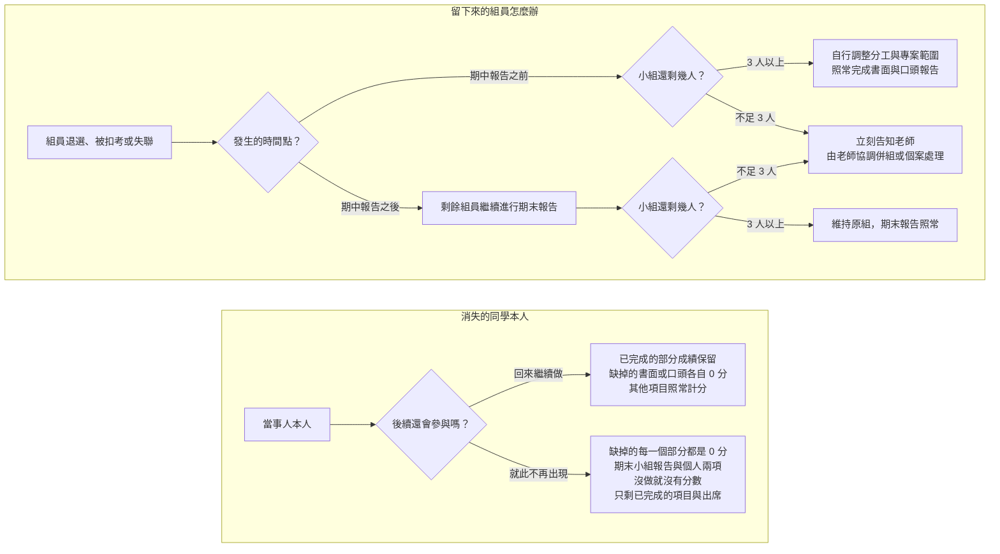

# 分組規範

**系統分析與設計（IE226）115-1** ｜ 課程總覽見 [00-Course-Introduction.md](00-Course-Introduction.md)、報告怎麼交見 [Report-Rules.md](Report-Rules.md)

> 本課程的期中與期末報告均以 **小組** 為單位進行，分組結果會影響整學期的專題進度與工作分配，請審慎選擇組員並及早完成分組。

## 分組原則與規定

|項目|規定|
|---|---|
|組成人數|**原則上為 3–4 人一組，初始分組不得少於 3 人**。|
|名單確定期限|最晚於 **第三週前** 確定名單。第三週後仍未分組者，由老師依各組人數與課程安排逕行分組：可能把未分組的同學湊成一組，也可能把個人指派到特定組別。不論以哪一種方式成組，適用的評分標準都與其他各組完全相同。|
|分工紀錄|各組須保留分工佐證，例如工作分配表、會議記錄、共筆或檔案版本紀錄，並於期中與期末報告繳交時一併附上。此紀錄是個人學習與貢獻報告、期末個人訪談的主要判斷依據，發生具名陳情時也以它為準。沒有紀錄，個人貢獻就只能憑各說各話認定。|
|人力減損|組員可能因退選、扣考或其他因素退出課程。人數減少時，由小組自行評估剩餘人力與進度，調整工作分配、專案範圍及成果內容，但 **不免除** 書面與口頭都必須完成的要求；若減損後不足 3 人，老師會 **先設法補人或併組**，只有真的沒有人可補進來時才讓小組以低於 3 人繼續，這不是常態。老師不替小組決定該刪減哪些工作，但期末評分時會依組員異動時間、剩餘人力與實際完成情況，適度調整對報告完整性的期待——人數減少並不代表核心要求可以免除。|
|期中後組員變動|期中報告後，個人可申請一次組員變動。申請人必須取得移出組與移入組所有成員的書面同意，原則上以單一成員移入 3 人組為主，且不得使原組低於 3 人。最終是否核准，由老師依各組人數、專題進度與實際情況決定。轉組核准後，期末小組報告的分數以 **新組** 為準。|
|組員變動申請期限|**最晚於第 10 週（11/11）當週下課前** 提出，以書面同意書送交老師為準，逾期不受理。老師最遲於第 11 週（11/18）上課時公布核准結果，讓各組立刻依新編組推進系統設計。之所以訂在這個時間點，是因為期末小組報告在第 16 週（12/23），扣掉停課週實際只剩四次上課，再晚異動會讓新組來不及磨合。**例外**：若期中口頭報告順延至第 10 週才全部結束，該次申請期限順延至第 11 週（11/18）當週下課前。|
|轉組後個人報告|期末個人報告仍以學生原屬小組的期中報告內容為主，不因轉組而改變。學生不須負責離組後原組新增或修改的內容。|
|組內衝突處理|一般性的分工、溝通與進度衝突由各組自行協調，老師原則上不擔任組內協調者，但接受具名私下陳情。陳情內容將作為期末個人訪談、工作貢獻判斷與成績評量的參考；若涉及霸凌、威脅、惡意排除成員或學術不誠信等重大情形，老師將依實際狀況另行處理。|

## 組員中途消失了怎麼辦？

每學期都會遇到同學退選、被扣考或直接失聯。下圖分成上下兩塊：上半講留下來的組員該怎麼辦，下半講消失的同學本人的成績會怎麼算。本圖處理的是當事人就此不再參與、也沒有打算補救的情形；若有客觀事由、本人也願意補上台，見 [Report-Rules.md](Report-Rules.md) 的「**如果遇到不可抗力因素？**」，那條路不會走到圖中的 0 分結果。

> 不論是哪一種情況，發現組員失聯就儘早告知老師。拖到報告當天才說，能處理的空間最小。

要提醒的是，**組內的事屬於小組自理範圍**：組員沒把檔案給你、組員失聯、分工沒喬好、簡報只有某一個人手上有——這些都不是個人缺席或遲交的正當理由，詳見 [Report-Rules.md](Report-Rules.md) 的「**什麼事情不是不可抗力**」。
