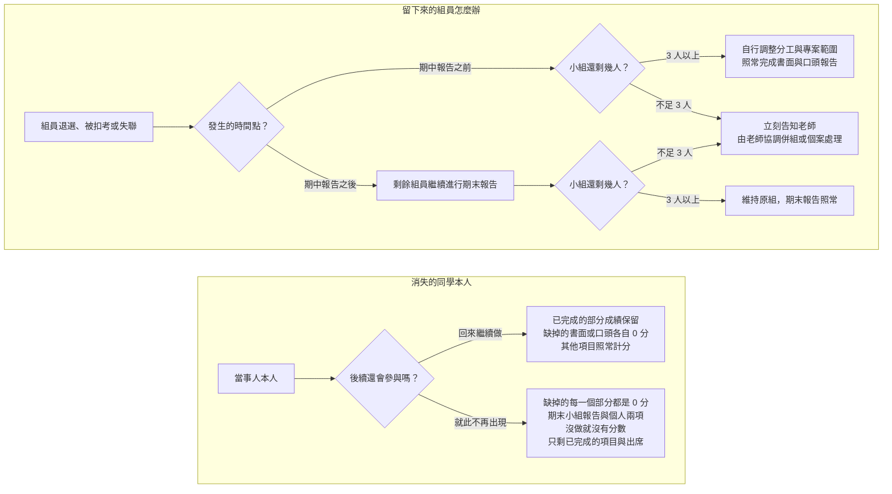

# 分組規範

**系統分析與設計（IE226）115-1** ｜ 課程總覽見 [Course-Introduction.md](Course-Introduction.md)、報告怎麼交見 [Report-Rules.md](Report-Rules.md)、分數怎麼算見 [Grading-Rules.md](Grading-Rules.md)

> 本課程的期中與期末報告均以 **小組** 為單位進行，分組結果會影響整學期的專題進度與工作分配，請審慎選擇組員並及早完成分組。

這份文件分成四節：**怎麼組隊**、**組起來之後怎麼管**、**中途想換組怎麼辦**、**出事了怎麼辦**。

## 一、組隊規範

| 項目 | 規定 |
|---|---|
| 組成人數 | **原則上 3–4 人一組，初始分組不得少於 3 人。** |
| 名單確定期限 | 最晚於 **第三週（9/23）前** 確定名單。 |

**逾期未分組會怎樣**：第三週後仍未分組者，由老師依各組人數與課程安排逕行分組——可能把未分組的同學湊成一組，也可能把個人指派到特定組別。不論以哪一種方式成組，適用的評分標準都與其他各組完全相同。

## 二、成員內部管理

### 分工紀錄

> **建議，但不強迫。** 沒有保留紀錄不會因此扣分，但到了要證明「這段是我做的」的時候，就只能各說各話。

各組可以自行保留分工佐證——工作分配表、會議記錄、共筆或檔案版本紀錄都算——並放進期中與期末的書面報告裡。

留著它的好處有三個：

- **個人學習與貢獻報告** 要靠它舉證，[Rubrics.md](Rubrics.md) 的規準裡「貢獻證據」單獨佔 15 分
- **期末個人訪談** 時，老師會拿它對照你說的話
- 真的發生 **具名陳情** 時，判斷以它為準

換句話說，不做紀錄不會被扣分，但你會少掉為自己說話的材料——對認真做事的人比較吃虧。

### 組內衝突處理

一般性的分工、溝通與進度衝突，**由各組自行協調**，老師原則上不擔任組內協調者。

但老師 **接受具名私下陳情**。陳情內容將作為期末個人訪談、工作貢獻判斷與成績評量的參考；若涉及霸凌、威脅、惡意排除成員或學術不誠信等重大情形，老師將依實際狀況另行處理。

## 三、組員變動

### 個人可以申請一次

期中報告後，個人可申請 **一次** 組員變動。原則是 **一組最多走一個人，而且只能加入人數還沒滿的組**——把異動的影響壓在最小範圍，不要變成兩個組之間的大搬風。

條件如下：

- 取得 **移出組與移入組所有成員的書面同意**
- **每一組最多一位成員移出**，不接受兩組互換成員，也不接受多人同時異動
- 移入的組別必須是 **3 人以下**（4 人組已經滿了，不再加人）
- **不得使原組低於 3 人**——實務上等於只有 **4 人組** 的成員提得出申請

最終是否核准，由老師依各組人數、專題進度與實際情況決定。轉組核准後，期末小組報告的分數以 **新組** 為準。

### 申請期限

**最晚於第 10 週（11/11）當週下課前** 提出，以書面同意書送交老師為準，**逾期不受理**。老師最遲於第 11 週（11/18）上課時公布核准結果，讓各組立刻依新編組推進系統設計。

之所以訂在這個時間點，是因為期末小組報告在第 16 週（12/23），扣掉停課週實際只剩四次上課，再晚異動會讓新組來不及磨合。

> **例外**：若期中口頭報告順延至第 10 週才全部結束，該次申請期限順延至第 11 週（11/18）當週下課前。

### 轉組之後的個人兩項

轉組會讓你的期中與期末落在兩個不同的組。**個人學習與貢獻報告與期末個人訪談，都依你當時實際待的那一組來認定**：

| 階段 | 依據哪一組 |
|---|---|
| 期中（分析階段） | **轉出組**——你期中報告時所屬的那一組 |
| 期末（設計階段） | **新組** |

所以個人報告寫到期中那一段，請以 **轉出組的期中報告內容** 為準；訪談時老師問到分析階段，抽的也是轉出組的文件。**你不須負責離組後原組期末報告的內容**，離開之後那一組怎麼做期末報告，都與你無關。

## 四、意外處理

### 人力減損

組員可能因退選、扣考或其他因素退出課程。人數減少時，由小組自行評估剩餘人力與進度，調整工作分配、專案範圍及成果內容，但 **不免除書面與口頭都必須完成的要求**。

若減損後不足 3 人，老師會 **先設法補人或併組**，只有真的沒有人可補進來時，才讓小組以低於 3 人繼續——這不是常態。

老師不替小組決定該刪減哪些工作，但期末評分時會依 **組員異動時間、剩餘人力與實際完成情況**，適度調整對報告完整性的期待。**人數減少並不代表核心要求可以免除。**

### 組員中途消失了怎麼辦？

每學期都會遇到同學退選、被扣考或直接失聯。下圖分成上下兩塊：上半講留下來的組員該怎麼辦，下半講消失的同學本人的成績會怎麼算。

本圖處理的是 **當事人就此不再參與、也沒有打算補救** 的情形；若有客觀事由、本人也願意補上台，見 [Report-Rules.md](Report-Rules.md) 的「**如果遇到不可抗力因素？**」，那條路不會走到圖中的 0 分結果。

> 不論是哪一種情況，**發現組員失聯就儘早告知老師**。拖到報告當天才說，能處理的空間最小。

圖中各種 0 分實際怎麼計入學期成績，見 [Grading-Rules.md](Grading-Rules.md)。

### 組內的事不是缺席或遲交的理由

**組內的事屬於小組自理範圍**：組員沒把檔案給你、組員失聯、分工沒喬好、簡報只有某一個人手上有——這些都不是個人缺席或遲交的正當理由，詳見 [Report-Rules.md](Report-Rules.md) 的「**什麼事情不是不可抗力**」。
