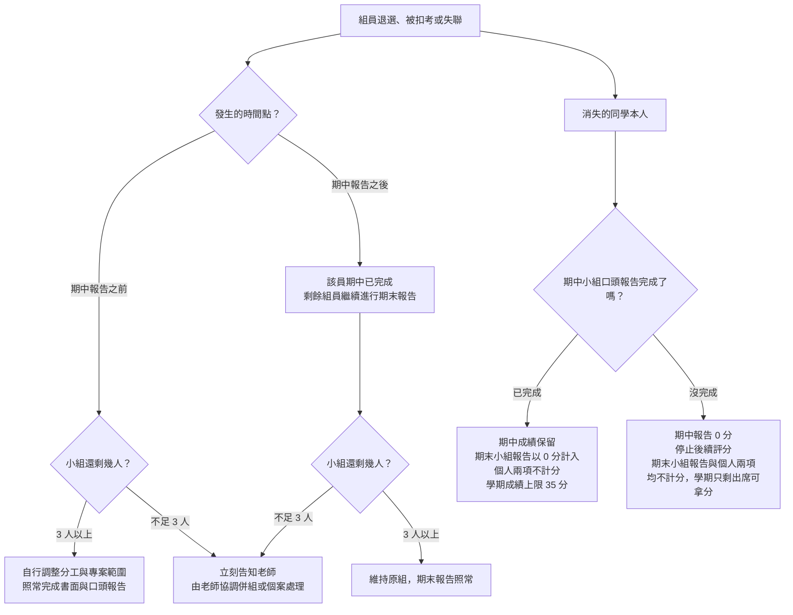

# 報告規範

**系統分析與設計（IE226）115-1** ｜ 課程總覽見 [00-Course-Introduction.md](00-Course-Introduction.md)

以下是四個評分項目共通的繳交與計分規則。這四個評分項目是：

- **期中小組報告**
- **期末小組報告**
- **期末個人訪談**
- **個人學習與貢獻報告**

> 請務必逐條看完，以下每一條都會直接影響學期成績。

## 小組報告是個人項目的前提

這四項 **不是各自獨立的作業，而是一條線**：期末的設計沿用期中分析的那一套方法，訪談與個人報告問的則是你在這兩份報告裡實際做了什麼。沒有那兩份小組報告，訪談與個人報告就沒有可問、可寫的對象。所以規則只有一條：

> **完成期中與期末兩份小組報告，是期末個人訪談與個人學習與貢獻報告能夠計分的前提。**

以下把「期末個人訪談」與「個人學習與貢獻報告」合稱 **個人兩項**。

| 完成情況 | 計分方式 | 學期成績上限 |
|---|---|---|
| 期中與期末小組報告都完成 | 四個項目均依實際表現計分 | 100 分 |
| 完成期中，未完成期末 | 僅計算期中小組報告；個人兩項不計分 | 35 分 |
| **未完成期中** | **停止後續評分**：不再進行期末小組報告與個人兩項，四個項目均不計分 | 5 分 |

其中 **期中小組報告是整學期的門檻**：

> **沒有完成期中小組報告者，依本課程評量規定停止後續評分**：不再進行期末小組報告，也不再進行個人兩項，四個項目全部不計分，整學期最高只剩出席那 5 分。

要說明的是，**「停止後續評分」是本課程的評量規定，不是學校學則上的扣考處分**。學則的扣考只依 **缺課時數** 認定（見 [00-Course-Introduction.md](00-Course-Introduction.md) 的「**扣考規則**」），兩者是不同的東西，只是在成績上的效果相同——後續三項都拿不到分數。

期末小組報告與個人兩項的關係則是 **單向** 的，兩種缺項要分清楚：

- **少的是期末小組報告**：期末報告 0 分，**個人兩項也一併不計分**，但 **期中的分數保留**。學期成績上限為期中的 30 分加出席的 5 分，共 35 分，確定不及格。
- **少的是個人兩項**：只影響那兩項本身，**兩份小組報告的分數照常保留**。都做完小組報告但沒交個人報告、也沒去訪談，學期成績上限為 65 分。

各項目的比重不會因為未完成而重算，**未完成的項目就是以 0 分計入學期成績**（計算方式見 [rubrics.md](rubrics.md)）。所以 **這門課仍然沒有哪一項適合策略性放棄**：放掉個人兩項等於直接丟掉 35 分，放掉期末小組報告連個人兩項也拿不到，而放掉期中小組報告，這門課就到此為止了。

至於什麼情況算「未完成」（**書面沒在期限前上傳也算**），以及後果由個人承擔還是全組一起承擔，詳見以下各節。

## 什麼時候要交什麼？

為了讓同學一眼看清楚 **哪一週要做什麼、要交什麼**，老師把整學期的繳交與上台時程整理如下表：

| 週次 | 時間 | 該做的事 | 形式 | 對應評分項目 | 沒有準時完成會怎樣 |
|---|---|---|---|---|---|
| 8 | 10/30（五）23:59 | 繳交 **期中書面報告** | 小組一份 | 期中小組報告的書面（30%） | 11/3（二）23:59 前補交，書面扣 10 分；**逾時全組期中報告 0 分，並停止後續評分** |
| 9 | 11/4（三）上課 | 進行 **期中口頭報告** | 全員上台 | 期中小組報告的口頭（70%） | 無故缺席者 **該員期中報告 0 分，並停止後續評分**，其餘組員不受影響 |
| 9 | 11/6（五）23:59 | 繳交 **期中投影片** | 小組一份 | 期中小組報告的口頭（70%） | 遲交扣口頭 10 分，沒有最晚可繳交時間 |
| 15 | 12/18（五）23:59 | 繳交 **期末書面報告** | 小組一份 | 期末小組報告的書面（30%） | 12/22（二）23:59 前補交，書面扣 10 分；**逾時全組期末報告 0 分，個人兩項一併不計分** |
| 14–16 | 12/9（三）開放，**12/23（三）截止** | 登記 **訪談時段** | 線上表單，個人自行選填 | 期末個人訪談（20%） | 不扣分，但改由老師逕行安排，不再協調，**時間壓縮的風險自負** |
| 16 | 12/23（三）上課 | 進行 **期末口頭報告** | 全員上台 | 期末小組報告的口頭（70%） | 無故缺席者 **該員期末報告 0 分，個人兩項一併不計分**，其餘組員不受影響 |
| 16 | 12/25（五）23:59 | 繳交 **期末投影片** | 小組一份 | 期末小組報告的口頭（70%） | 遲交扣口頭 10 分，沒有最晚可繳交時間 |
| 依訪談日 | 訪談日的前一個星期五 23:59 | 繳交 **個人學習與貢獻報告** | 個人各一份 | 個人學習與貢獻報告（15%） | 訪談日前一天午夜前補交，扣 10 分；**逾時個人兩項都以 0 分計算** |
| 17、18 | 自選時段（含另行公告的時段） | 進行 **期末個人訪談** | 本人到場 6–10 分鐘 | 期末個人訪談（20%） | **無故未到，個人兩項都以 0 分計算**，不另安排補訪 |

### 說明

- **沒有繳交書面，口頭一律 0 分**，這門課沒有「只上台報告」或「只來訪談」這種選項，細節詳見「**報告繳交項目說明**」。
- **小組口頭報告每位組員都要上台**，各自負責其中一段內容，無故缺席者該員 0 分，其餘組員不受影響，細節詳見「**口頭報告的規範**」。
- **繳交的書面報告與投影片都是 PDF 格式**，細節詳見「**報告繳交方式與期限**」。
- **訪談時段登記表單開放 12/9（三）至 12/23（三）**：逾時未登記者由老師逕行安排時段，老師的安排結果 **不保證會在 12/25 之前通知你**。既然不知道自己被排到哪一天，就請一律以最早的訪談日反推，**在 12/25（五）23:59 前把個人報告交出來**。這是沒有在期限內登記所要自行承擔的風險，不構成日後延後繳交或補交的理由。

## 報告繳交項目說明

### 1. 期中與期末小組報告

都由以下兩個項目構成，缺一不可：

- **書面報告**：全組共同完成，繳交一份，建議內容見「*待補*」
- **口頭報告**：期中 **11/4（第 9 週）**、期末 **12/23（第 16 週）** 上台，建議內容見「*待補*」

**請注意**：

- 一定要先繳交書面報告，才能口頭報告，沒有書面報告，整個小組報告 0 分；老師不接受「請只針對我有做的部分評分」這類要求。
- 口頭報告無故缺席者，**該員小組報告 0 分**，其餘組員不受影響。

### 2. 期末個人訪談、個人學習與貢獻報告

雖然分開計分，但運作方式類似，同樣由以下兩個項目構成：

- **書面報告**：即個人學習與貢獻報告，每人各交一份，建議內容見「*待補*」
- **口頭報告**：即期末個人訪談，時段以 **線上表單登記、同學自行選填** 的方式安排，建議內容見「*待補*」

**請注意**：這兩項不能只做一樣，**少任何一樣，期末個人訪談、個人學習與貢獻報告都以 0 分計算**。

> **再提醒，一定是「先交書面」，才能「口頭報告」，書面報告的繳交期限一律在上台或訪談之前**。

## 報告繳交方式與期限

所有報告與投影片一律以 **PDF 電子檔上傳學校 Portal 系統**，不收紙本，也不收 PDF 以外的格式；電子郵件、LINE、隨身碟等其他管道一律不受理。

繳交期限只有兩條原則，記住這兩句就不會交錯時間，實際日期見「**什麼時候要交什麼？**」的總表：

> **書面電子檔一律在小組上台報告，或個人接受訪談那一天的前一個星期五午夜 12 點前上傳。**
>
> **口頭報告的投影片，則在小組上台報告那一天的當週星期五午夜 12 點前上傳。**

書面排在報告 **前**，是因為老師要用週末讀完全班；投影片排在報告 **後**，是因為各組常改到上台前一刻。

### 1. 期中與期末小組報告

兩種檔案都要交，各 **全組繳交一份**：

- **書面報告**：報告日的前一個星期五 23:59 前上傳，期中為 **10/30（五）**、期末為 **12/18（五）**
- **投影片**：上台當週的星期五 23:59 前上傳，期中為 **11/6（五）**、期末為 **12/25（五）**

**請注意**：

- 投影片上傳的必須是 **當天實際報告的版本**，報告後不得增補內容。
- 口頭報告若因當週報告不完而順延（見 [00-Course-Introduction.md](00-Course-Introduction.md) 的「**課程預計進度表**」），**書面期限不隨之延後**，仍以原定的星期五為準；**投影片期限則以實際上台那一週的星期五** 為準。
- 老師於 **星期六早上** 統計書面的繳交狀況，以當下 Portal 上的檔案為準。

> **建議各組指定一位組員負責上傳，其他人在期限前自己上 Portal 確認檔案在不在。書面缺交是由全組承擔的：缺的是期中，全組停止後續評分；缺的是期末，個人兩項也一併不計分。**

### 2. 期末個人訪談、個人學習與貢獻報告

**只交書面，不必做投影片**：

- **個人學習與貢獻報告**：訪談日的前一個星期五 23:59 前上傳，**每人各交一份**
- **期末個人訪談**：本人到場即可，沒有要繳交的檔案。想帶自己的草稿、分工紀錄或圖表給老師看也可以，但訪談只有 6–10 分鐘，請挑真的講得完、打開就能看的東西。

**請注意**：

- 這份報告的期限 **跟著你自己的訪談日走**，不是全班同一天，請依登記到的時段自行往前推算。
- 訪談排 **12/30（三）** 者，期限為 **12/25（五）23:59**；排 **2027/1/6（三）** 或之後另行公告時段者，期限為 **2027/1/1（五）23:59**。

**繳交提醒**：老師會在 **截止日前三天** 與 **當天** 各在 LINE 群組提醒一次，**只提醒兩次**。這是善意提醒，不是義務——沒收到、沒看到、群組設靜音，都不構成延後繳交的理由。請自己把日期記進行事曆。

## 遲交與檔案問題的扣分

每一份報告的成績都以 **100 分** 為滿分計算（見 [rubrics.md](rubrics.md)），扣分就直接扣在這 100 分上。

常見的五種情況如下（**遲交** 與 **缺交** 的定義見下一節）：

| 狀況 | 計分 | 說明 |
|---|---|---|
| **遲交，檔案沒問題** | 該部分 **扣 10 分** | 過了期限才交，但檔案沒問題，且在最晚可繳交時間前補上 |
| **檔案有問題，已修正** | 該部分 **扣 5 分** | 準時繳交，經老師提醒後在最晚可繳交時間前補上合格檔案 |
| **檔案有問題，未修正** | 該部分 **0 分** | 準時繳交，但到最晚可繳交時間仍未補上合格檔案，以缺交論 |
| **遲交，檔案又有問題** | 該部分 **0 分** | 已經用掉遲交的緩衝，又沒交出讀得到的檔案，不再給補救機會，以缺交論 |
| **缺交** | 該部分 **0 分** | 沒有準時繳交，到最晚可繳交時間也沒有補交 |

扣分 **只扣對應的那一部分**，不影響另一部分：書面遲交扣書面的分數，投影片遲交扣口頭報告的分數，個人學習與貢獻報告遲交就扣它自己的分數。例如某組書面原得 82 分，遲交後扣 10 分，實得 72 分。

之所以嚴格，是因為老師是 **一份一份讀、一份一份給分**：星期五收齊、週末讀完、星期三聽報告。一份沒到位，整個排程就要為它重跑一次，擠掉的是別組的時間。職場也一樣——交付日期與格式本來就是需求規格的一部分。

### 遲交與缺交的定義

> 在 **繳交期限**（見「**報告繳交方式與期限**」）前交到，是 **準時**；過了期限但在 **最晚可繳交時間** 前補上，是 **遲交**；到最晚可繳交時間都還沒有交到，就是 **缺交**。

| 項目 | 準時 | 遲交 | 缺交 |
|---|---|---|---|
| 期中書面報告 | 10/30（五）23:59 前 | 10/31 至 **11/3（二）23:59** | 11/3（二）23:59 之後 |
| 期末書面報告 | 12/18（五）23:59 前 | 12/19 至 **12/22（二）23:59** | 12/22（二）23:59 之後 |
| 個人學習與貢獻報告 | 訪談日的前一個星期五 23:59 前 | 至 **訪談日前一天 23:59** | 訪談日前一天 23:59 之後 |
| 投影片 | 上台當週的星期五 23:59 前 | 之後補交，一律扣 10 分 | 無此情況 |

**請注意**：

- **書面報告的最晚可繳交時間，一律是報告日或訪談日的前一天午夜 12 點**，過了就視同放棄，該份報告 0 分。
- **檔案問題適用同一條線**：到最晚可繳交時間仍未補上可以開啟的合格檔案，等同缺交。
- **投影片沒有最晚可繳交時間**，因為它的期限落在報告日之後，口頭報告當天早已評分完畢。逾期上傳甚至一直沒交，一律扣口頭報告 10 分，不再加重。
- 缺交的後果不只是那一份 0 分：**期中書面** 缺交，全組停止後續評分；**期末書面** 缺交，個人兩項一併不計分；**個人學習與貢獻報告** 缺交，個人兩項都以 0 分計算。

### 什麼算「檔案有問題」

檔案有交，但 **不是 PDF、內容毀損、加了密碼、上傳到錯的地方，或是老師打不開**，一律視為 **這一份還沒有交到**。老師發現後會透過 LINE 群組通知，請你重新上傳。

要避開這 5 分很簡單：上傳完自己重新下載一次，用別台電腦或手機打開，確認頁數對、圖沒變空白、中文沒變亂碼。

## 口頭報告的規範

書面缺交是 **全組一起承擔**（見「**報告繳交方式與期限**」）；口頭報告不一樣，**當天無故缺席或沒有上台，由該員個人承擔**。

- **每位組員都要上台**，各自負責其中一段內容。
- 無故缺席者，**該次小組報告以 0 分計算**：缺的是期中報告，該員 **停止後續評分**；缺的是期末報告，該員的個人兩項一併不計分。
- **其餘組員不受影響**：三人一組當天有一人沒到，另外兩人照常取得該組應得的分數。
- **期末個人訪談** 無故未到者，個人兩項都以 0 分計算，**不另安排補訪**。

「其餘組員不受影響」指的是 **不會替缺席者連坐扣分**，不代表報告表現不受影響——少一個人上台，內容講不完整、段落銜接不上，這些落差 **仍會反映在小組的口頭報告分數上**。因此各組務必準備備案：每一段至少要有第二個人講得出來，資料與簡報檔也不要只放在一個人手上。

被學校扣考者不得進行期末小組報告與個人兩項，那三項一律不計分，整學期最高只剩出席那 5 分；**未完成期中小組報告者依本課程規定停止後續評分**，在成績上的效果相同。扣考的認定與計算方式，詳見 [00-Course-Introduction.md](00-Course-Introduction.md) 的「**扣考規則**」。

### 組員中途消失了怎麼辦？

每學期都會遇到同學退選、被扣考或直接失聯。下圖說明 **留下來的組員** 與 **消失的同學** 各自會怎麼處理。本圖處理的是 **當事人就此不再參與、也沒有打算補救** 的情形；若有客觀事由、本人也願意補上台，請看下一節，那條路不會走到圖中的 0 分結局。

> **不論是哪一種情況，發現組員失聯就儘早告知老師。拖到報告當天才說，能處理的空間最小。**

### 如果遇到不可抗力因素？

- **適用事由**：住院或急診、法定傳染病隔離、重大意外、直系親屬喪事、天災停課、兵役徵集與法院傳票等有客觀憑證的情況。打工、旅遊、社團活動、考照、睡過頭、交通遲到 **不在此列**，一律以無故缺席辦理。
- **通報與證明**：知道的當下立即通知老師與組長，最遲不得晚於報告當天上課前；突發狀況於事發後 **三個工作日內** 補行通報。同時仍須依學校請假系統辦理請假並提出證明文件（診斷證明、隔離通知、公文等），提不出證明者不適用本節。
- **小組怎麼辦**：報告 **照常進行、不延期**，缺席者的段落由其他組員代講。代講只保住小組成績，**不能替缺席者取得他的口頭分數**。
- **個人怎麼補**：經核准後由 **本人** 補上台，方式依優先順序為——線上即時報告、兩週內個別補報告（10 分鐘內）、錄影補交並線上答問、併入期末個人訪談加重提問。補救依 **原評分標準** 計分，不打折也不加分；同一學期 **原則上以一次為限，第二次起由老師個案認定**。
- **與 0 分規定的關係**：經核准且 **本人完成補救** 者，**不視為未完成報告**，因此不會停止後續評分，個人兩項也照常計分。未在期限內完成補救，或只由組員代講而本人沒補，仍以未完成論。確實無法補救者（例如長期住院），由老師個案處理，不強行以 0 分結案。
