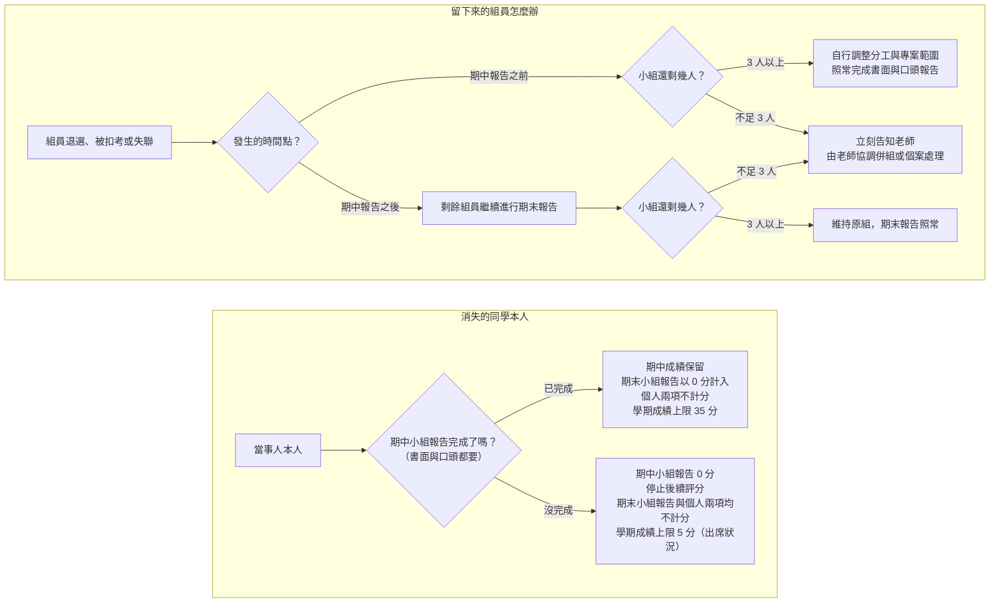

# 報告規範

**系統分析與設計（IE226）115-1** ｜ 課程總覽見 [00-Course-Introduction.md](00-Course-Introduction.md)

> 請務必逐條看完，以下每一條都會直接影響學期成績。

## 小組報告是個人項目的前提

以下是四個評分項目共通的繳交與計分規則。這四個評分項目是：

- 期中小組報告
- 期末小組報告
- 期末個人訪談
- 個人學習與貢獻報告

以下把「期末個人訪談」與「個人學習與貢獻報告」合稱「個人兩項」。

### 先講清楚幾個詞的差別

本文件反覆用到下面幾個詞，看起來都是被扣分，但輕重差很多：

| 用詞 | 意思 |
|---|---|
| 扣 N 分 | 只扣對應的那一部分：書面遲交扣書面的分數，投影片遲交扣口頭報告的分數，另一部分照常計分 |
| 整份報告 0 分 | 該次小組報告的書面與口頭 **一起** 是 0 分。書面沒交，或人沒上台，兩種都會走到這裡 |
| 不計分／以 0 分計算 | 該項目以 0 分代入學期成績公式（見 [rubrics.md](rubrics.md)），其他項目照常評分 |
| 停止後續評分 | 後續的評分項目不再進行、也不再評分。你仍然可以到課，但那些項目一律以 0 分代入 |

**書面與口頭是綁在一起的，不是兩份可以各拿各分數的作業**。沒交書面就不能上台，交了書面但人沒到也一樣——只要少一邊，該次小組報告就是 0 分。

> 請同學注意，以上四項評分項目「不是各自獨立的作業，而是一條線」。

期中與期末的題目可能完全不同，但用的是同一套分析與設計方法。訪談問的、個人報告寫的，都是你在那兩份小組報告裡實際做過的事——沒有那兩份報告，就沒有可問、可評估的對象。

以下整理各種可能的得分狀況：

| 項目 | 完成情況 | 計分方式 | 學期成績上限 |
|---|---|---|---|
| 1 | 期中與期末小組報告都完成 | 四個項目均依實際表現計分 | 100 分 |
| 2 | 完成期中與期末小組報告，未完成個人兩項 | 僅計算期中與期末小組報告；個人兩項不計分 | 65 分 |
| 3 | 完成期中小組報告，未完成期末小組報告 | 僅計算期中小組報告；期末小組報告不計分，個人兩項不論有沒有做，一律不計分 | 35 分 |
| 4 | 未完成期中小組報告 | 四個項目均不計分 | 5 分 |

你應該會注意到，兩份小組報告是基本門檻：

> 沒有完成 **期中** 小組報告者：四個項目全部不計分，整學期最高只剩出席那 5 分。
>
> 沒有完成 **期末** 小組報告者：期中成績保留，但個人兩項一併不計分，整學期最高 35 分。

情況 2 的 65 分看起來還能及格，但那是滿分推算。實際上要及格得滿足 0.3M + 0.3F + 5 ≥ 60，也就是兩份小組報告平均要拿到 92 分左右。放掉個人兩項，等於把自己的及格門檻壓到幾乎不可能的位置。**這門課不適合策略性放棄。**

接下來說明這四項各要繳交什麼、要做哪些事。

## 什麼時候要交什麼？

為了讓你一眼看清楚哪一週要做什麼、要交什麼，以下把整學期的繳交與上台時程整理成一張表。建議把它當成確認清單，每一項都打勾，及格就有基本保障。

| 週次 | 時間 | 該做的事 | 形式 | 對應評分項目 | 沒有準時完成會怎樣 |
|---|---|---|---|---|---|
| 8 | 10/30（五）23:59:59 | 繳交期中書面報告 | 小組一份 | 期中小組報告的書面（30%） | 11/3（二）23:59:59 前補交，書面扣 10 分；**逾時全組期中小組報告 0 分，並停止後續評分** |
| 9 | 11/4（三）上課 | 進行期中口頭報告 | 全員上台 | 期中小組報告的口頭（70%） | **無故缺席者該員期中小組報告 0 分，並停止後續評分**，其餘組員不受影響 |
| 9 | 11/6（五）23:59:59 | 繳交期中投影片 | 小組一份 | 期中小組報告的口頭（70%） | 過了期限一律扣口頭 10 分，不通知補交（順延至第 10 週報告的組別，期限為 11/13（五）） |
| 15 | 12/18（五）23:59:59 | 繳交期末書面報告 | 小組一份 | 期末小組報告的書面（30%） | 12/22（二）23:59:59 前補交，書面扣 10 分；**逾時全組期末小組報告 0 分，個人兩項一併不計分** |
| 14–16 | 12/9（三）開放，12/23（三）截止 | 登記訪談時段 | 線上表單，個人自行選填 | 期末個人訪談（20%） | 不扣分，但改由老師逕行安排，不再協調，時間壓縮的風險自負 |
| 16 | 12/23（三）上課 | 進行期末口頭報告 | 全員上台 | 期末小組報告的口頭（70%） | **無故缺席者該員期末小組報告 0 分，個人兩項一併不計分**，其餘組員不受影響 |
| 16 | 12/25（五）23:59:59 | 繳交期末投影片 | 小組一份 | 期末小組報告的口頭（70%） | 過了期限一律扣口頭 10 分，不通知補交（順延至第 17 週報告的組別，期限為 2027/1/1（五）） |
| 依訪談日 | 訪談日的前一個星期五 23:59:59 | 繳交個人學習與貢獻報告 | 個人各一份 | 個人學習與貢獻報告（15%） | 訪談日前一天 23:59:59 前補交，扣 10 分；**逾時個人兩項都以 0 分計算** |
| 17、18 | 自選時段（含另行公告的非上課時段） | 進行期末個人訪談 | 本人到場 6–10 分鐘 | 期末個人訪談（20%） | **無故未到，個人兩項都以 0 分計算**，不另安排補訪 |

### 說明

- 書面與口頭少任何一邊，整份報告 0 分。沒交書面就不能上台，交了書面但人沒到也一樣，這門課沒有「只上台報告」或「只來訪談」這種選項，細節詳見「報告繳交項目說明」。
- 小組口頭報告每位組員都要上台，各自負責其中一段內容。無故缺席者該員 0 分，其餘組員不受影響，細節詳見「口頭報告的規範」。
- 繳交的書面報告與投影片都是 PDF 格式，細節詳見「報告繳交方式與期限」。
- 訪談時段登記表單開放 12/9（三）至 12/23（三）。逾時未登記者由老師逕行安排時段，安排結果不保證會在 12/25 之前通知你。既然不知道自己被排到哪一天，就請一律以最早的訪談日反推，**在 12/25（五）23:59:59 前把個人報告交出來**。這是沒有在期限內登記所要自行承擔的風險，不構成日後延後繳交或補交的理由。

## 報告繳交項目說明

### 1. 期中與期末小組報告

無論是期中或期末小組報告，都由以下兩個項目構成：

- 書面報告：全組共同完成，繳交一份，建議內容見「*待補*」
- 口頭報告：期中 11/4（第 9 週）、期末 12/23（第 16 週）上台，建議內容見「*待補*」

請注意：

- 一定要先繳交書面報告，才能口頭報告。**沒有書面報告，整份小組報告 0 分**；老師不接受「請只針對我有做的部分評分」這類要求。
- 反過來也一樣：**交了書面但當天無故沒上台，該員整份小組報告仍是 0 分**，不會因為書面有交就保住書面那 30%。其餘組員不受影響。

### 2. 期末個人訪談、個人學習與貢獻報告

雖然分開計分，但運作方式類似，同樣由以下兩個項目構成：

- 書面報告：即個人學習與貢獻報告，每人各交一份，建議內容見「*待補*」
- 口頭報告：即期末個人訪談，時段以線上表單登記、同學自行選填的方式安排，建議內容見「*待補*」

請注意：這兩項不能只做一樣，**少任何一樣，期末個人訪談與個人學習與貢獻報告都以 0 分計算**。

> 再提醒一次：一定是先交書面，才能口頭報告，書面報告的繳交期限一律在上台或訪談之前。

## 報告繳交方式與期限

### 1. 報告繳交方式

所有報告與投影片一律以 PDF 電子檔上傳學校 Portal 系統，不收紙本，也不收 PDF 以外的格式；電子郵件、LINE、隨身碟等其他管道一律不受理。

Portal 系統老師已經開好作業繳交，請在期限前完成上傳。

上傳成功不等於繳交完成。檔案本身有問題一樣會扣分，扣分方式見「遲交、缺交與檔案問題的分數計算」一節。以下說明什麼叫做有問題的檔案。

#### 什麼叫做「檔案有問題」？

檔案有上傳成功，但只要符合以下任何一項，就是檔案有問題：

| 類型 | 具體情況 |
|---|---|
| 格式不對 | 不是 PDF。Word、PowerPoint、圖片檔都不收，也不要壓成 zip 或 rar 再上傳 |
| 打不開 | 檔案毀損、設了密碼保護、上傳中斷導致檔案不完整 |
| 打得開但讀不了 | 中文變亂碼或空白方框（字型沒嵌入）、圖表變空白、圖片沒顯示、頁面缺漏 |
| 內容是空的 | 0 KB、整份空白、只有封面、只有大標題沒有內文 |
| 看不清楚 | 拍螢幕或翻拍紙本轉成的 PDF、解析度太低、圖表縮到看不出數字與文字 |
| 沒有檔案，只有連結 | 上傳雲端硬碟的捷徑檔，或 PDF 裡只放一個連結要老師自己去下載 |
| 有安全疑慮 | 被資安軟體警示，或內含巨集、可執行內容 |
| 完全不相干 | 傳成別的科目的作業、別組的檔案 |

只要符合任何一項，一律視為沒有完成繳交。書面報告與個人學習與貢獻報告，老師發現後會透過 LINE 群組通知，請你重新上傳；**投影片不通知，也沒有補交機制**，直接扣口頭報告 10 分。

**傳錯版本不在上表之內**。如果你上傳的是本課程的舊版或草稿——檔案本身打得開、也讀得懂，只是不是你想交的那一份——老師 **一律就期限前 Portal 上的那一份評分，不會通知你，也沒有補正機會**。這不是檔案問題，是你自己該確認的事。

建議：上傳完自己重新下載一次，用別台電腦或手機打開，確認是正確的版本、頁數對、圖沒變空白、中文沒變亂碼。另外提醒兩件事：

- **檔案大小主要是圖片撐出來的**。請先用軟體把圖片壓縮過再放進文書軟體，不要直接貼相機原檔或未經處理的截圖——檔案太大容易上傳中斷，變成上表的「打不開」。
- **不必套用一堆非必要的版型與裝飾，但排版本身仍要顧**。標題階層、編號、圖表編號與引用格式是書面報告的評分項目之一，見 [rubrics.md](rubrics.md) 的「文件表達與格式」。

### 2. 報告繳交期限

繳交期限只有兩條原則，記住這兩句就不會交錯時間，實際日期見「什麼時候要交什麼？」的總表：

> 書面電子檔一律在小組上台報告，或個人接受訪談那一天的 **前一個星期五** 23:59:59 前上傳。
>
> 口頭報告的投影片，則在小組上台報告那一天的 **當週星期五** 23:59:59 前上傳。

書面排在報告前，是因為老師要用週末讀完全班；投影片排在報告後，是因為各組常改到上台前一刻。

#### 時間以 Portal 系統為準

期限一律以 **元智大學 Portal 系統記錄的上傳完成時間** 為準，不是你手錶、手機或電腦上的時間。算的也是 **上傳完成** 的時間，不是按下上傳的時間——檔案大、網路慢都可能讓完成時間比你以為的晚。

> **請不要壓線上傳。** 提早一天交，這條規則就跟你沒有關係。

**如果系統真的出問題，請盡快通知老師。** Portal 掛掉、上傳一直失敗，或有其他確實無法上傳的狀況，請在期限前透過 LINE 群組或 Email 告知，並附上錯誤畫面的截圖。越早說，能處理的空間越大；等期限過了才來講，就只能依遲交或缺交辦理。

#### 2.1 期中與期末小組報告

以下兩種檔案都要繳交，全組繳交一份即可：

- 書面報告：報告日的前一個星期五 23:59:59 前上傳，期中為 **10/30（五）**、期末為 **12/18（五）**
- 投影片：上台當週的星期五 23:59:59 前上傳，期中為 **11/6（五）**、期末為 **12/25（五）**

請注意：

- 投影片上傳的必須是當天實際報告的版本，報告後不得增補內容。
- 口頭報告若因當週報告不完而順延（見 [00-Course-Introduction.md](00-Course-Introduction.md) 的「課程預計進度表」），書面期限不隨之延後，仍以原定的星期五為準；投影片期限則以實際上台那一週的星期五為準，也就是期中順延組為 **11/13（五）**、期末順延組為 **2027/1/1（五）**。
- 老師於星期六早上統計書面的繳交狀況，以當下 Portal 上的檔案為準。

> 建議各組指定一位組員負責上傳，其他人在期限前自己上 Portal 確認檔案在不在。書面缺交是由全組承擔的：缺的是期中，**全組停止後續評分**；缺的是期末，**個人兩項也一併不計分**。

#### 2.2 期末個人訪談、個人學習與貢獻報告

只交書面，不必做投影片：

- 個人學習與貢獻報告：訪談日的前一個星期五 23:59:59 前上傳，每人各交一份，內容不得與其他同學雷同（見「個人報告的學術誠信」）。
- 期末個人訪談：本人到場即可，沒有要繳交的檔案。想帶自己的草稿、分工紀錄或圖表給老師看也可以，但訪談只有 6–10 分鐘，請挑真的講得完、打開就能看的東西。

請注意：

- 這份報告的期限跟著你自己的訪談日走，不是全班同一天。
- 所有訪談時段（含第 12 週停課挪出、另行公告的非上課時段）一律排在 **12/30（三）及之後**，因此期限只有兩種：訪談排在 **第 17 週** 者，期限為 **12/25（五）23:59:59**；排在 **第 18 週** 者，期限為 **2027/1/1（五）23:59:59**。

繳交提醒：老師會針對 12/25 與 2027/1/1 這兩個期限，各在 LINE 群組提醒兩次，分別在截止日前三天與當天。這是善意提醒，不是義務——沒收到、沒看到、群組設靜音，都不構成延後繳交的理由。請自己把日期記進行事曆。

### 3. 準時繳交、遲交與缺交的定義

上一節設定了各個書面、投影片檔案的繳交期限，但超過期限不等於直接 0 分。以下定義什麼是「準時繳交」「遲交」與「缺交」：

- 準時繳交：在繳交期限（見上節）前完成上傳。
- 遲交：過了期限，但在最晚可繳交時間前完成上傳。
- 缺交：超過最晚可繳交時間仍未完成上傳。

為了讓你更好掌握時間，以下把所有繳交時程整理起來：

| 項目 | 準時 | 遲交 | 缺交 |
|---|---|---|---|
| 期中書面報告 | 10/30（五）23:59:59 前 | 10/31 至 11/3（二）23:59:59 | 11/3（二）23:59:59 之後 |
| 期末書面報告 | 12/18（五）23:59:59 前 | 12/19 至 12/22（二）23:59:59 | 12/22（二）23:59:59 之後 |
| 個人學習與貢獻報告 | 訪談日的前一個星期五 23:59:59 前 | 至訪談日前一天 23:59:59 | 訪談日前一天 23:59:59 之後 |
| 投影片 | 上台當週的星期五 23:59:59 前 | 過了期限一律扣口頭 10 分 | 不適用（一直沒交也是扣口頭 10 分，不另行通知） |

請注意：

- 書面報告的最晚可繳交時間，一律是報告日或訪談日的前一天 23:59:59，過了就視同放棄，**整份報告 0 分**（小組報告的書面與口頭一起是 0）。
- 書面報告與個人學習與貢獻報告的檔案問題適用同一條線：老師發現後會通知你，到最晚可繳交時間仍未補上可以開啟的合格檔案，等同缺交。
- **投影片沒有最晚可繳交時間，也不會通知補交**：它的期限落在報告日之後，口頭報告當天早已評分完畢。過了期限之後不論遲交、檔案有問題還是一直沒交，一律扣口頭報告 10 分，不再加重。
- 缺交的後果不只是那一份檔案 0 分：**期中書面缺交，整份期中小組報告 0 分，全組停止後續評分；期末書面缺交，整份期末小組報告 0 分，個人兩項一併不計分；個人學習與貢獻報告缺交，個人兩項都以 0 分計算**。

## 遲交、缺交與檔案問題的分數計算

每一份報告的成績都以 100 分為滿分計算（見 [rubrics.md](rubrics.md)），扣分就直接扣在這 100 分上。這裡要先分清楚兩種層級：**還在扣分範圍內的**，以及 **已經到缺交程度的**。兩者的後果差很多。

### 1. 還在扣分範圍內：只扣對應的那一部分

| 狀況 | 小組書面報告 | 個人學習與貢獻報告 |
|---|---|---|
| 遲交，但檔案沒問題 | 書面扣 10 分 | 扣 10 分 |
| 檔案有問題，在最晚可繳交時間前補上合格檔案 | 書面扣 5 分 | 扣 5 分 |

這一類的扣分只扣對應的那一部分，不影響另一部分。例如某組書面原得 82 分，遲交後扣 10 分，實得 72 分，口頭報告的分數照原樣計算。

**投影片不走這張表，一律扣 10 分**：報告日在星期三、投影片期限在當週星期五，已經給了兩天。過了期限之後，不論是遲交、檔案有問題還是一直沒交，一律扣口頭報告 10 分，不再加重；老師也 **不會另行通知你補交**。

### 2. 已經到缺交程度：整份報告 0 分

以下三種情況一律以缺交論，不再給補救機會：

- **缺交**：到最晚可繳交時間都沒有上傳。
- **檔案有問題，未修正**：準時上傳了，但到最晚可繳交時間仍沒有補上合格檔案。
- **遲交，檔案又有問題**：已經用掉遲交的緩衝，又沒交出讀得到的檔案。

後果依項目而不同：

| 項目 | 後果 |
|---|---|
| 小組書面報告 | **整份小組報告 0 分**——書面與口頭一起是 0，不是只扣書面那 30%。缺的是期中，全組另加停止後續評分；缺的是期末，另加個人兩項一併不計分 |
| 個人學習與貢獻報告 | **個人兩項都以 0 分計算**，訪談有去也一樣 |
| 投影片 | 不會走到這一格。一直沒交也只是扣口頭報告 10 分，不再加重 |

投影片之所以不適用「整份報告 0 分」，是因為它的期限落在報告日之後——口頭報告當天早就評分完畢，投影片交不交都影響不了那天的表現，只影響有沒有留下當天實際報告的版本。

**口頭那一邊也是同一條規則**：書面交了，但當天全組無故缺席，該次小組報告一樣是全組 0 分，不會因為書面有交就保住那 30%。若只是部分組員缺席，由缺席者個人承擔，其餘組員不受影響，處理方式見「口頭報告的規範」一節。

之所以嚴格，是因為老師是一份一份讀、一份一份給分：星期五收齊、週末讀完、星期三聽報告。一份沒到位，整個排程就要為它重跑一次，擠掉的是別組的時間。職場也一樣——交付日期與格式本來就是需求規格的一部分。

## 個人報告的學術誠信

個人學習與貢獻報告是個人項目，每人各交一份，內容不得與其他同學雷同。

- **判定方式**：老師會使用 AI 工具比對全班的個人報告，但 AI 比對只是初篩，一律經老師人工複核確認後才成立。
- **罰則**：認定為雷同者，**所有雷同報告的同學書面分數一律以 55 分計**，覆蓋 [rubrics.md](rubrics.md) 中該項各面向的加總結果。
- **申訴**：這一項可以申訴。請於成績公告後一週內向老師提出，並附上足以證明獨立完成的過程紀錄，例如草稿、檔案版本紀錄或共筆歷程。

要避開這條規則其實不難：寫你自己實際做過的事、遇到的問題、當時怎麼判斷。這些東西每個人本來就不一樣，會雷同多半是因為直接複製了小組文件或別人的段落。

## 口頭報告的規範

書面缺交是全組一起承擔（見「報告繳交方式與期限」）；口頭報告不一樣，當天無故缺席或沒有上台，由該員個人承擔。

- 每位組員都要上台，各自負責其中一段內容。
- 無故缺席者，**該員該次整份小組報告以 0 分計算**——書面有交也一樣，不會只扣口頭那 70%。缺的是期中報告，該員 **停止後續評分**；缺的是期末報告，該員的個人兩項一併不計分。
- 其餘組員不受影響：三人一組當天有一人沒到，另外兩人照常取得該組應得的分數。
- 期末個人訪談無故未到者，**個人兩項都以 0 分計算**，不另安排補訪。

「其餘組員不受影響」指的是不會替缺席者連坐扣分，不代表報告表現不受影響——少一個人上台，內容講不完整、段落銜接不上，這些落差仍會反映在小組的口頭報告分數上。因此各組務必準備備案：每一段至少要有第二個人講得出來，資料與簡報檔也不要只放在一個人手上。

被學校扣考者不得進行期末小組報告與個人兩項，那三項一律不計分；已完成的期中小組報告成績保留，整學期最高 35 分。扣考的認定與計算方式，詳見 [00-Course-Introduction.md](00-Course-Introduction.md) 的「扣考規則」。

要分清楚的是，**未完成期中小組報告者依本課程規定停止後續評分，四個項目全部不計分，整學期最高只剩出席那 5 分，比扣考更嚴重**。扣考是學校依缺課時數作出的處分，停止後續評分是本課程的評量規定，兩者請不要混為一談。

### 組員中途消失了怎麼辦？

每學期都會遇到同學退選、被扣考或直接失聯。下圖分成上下兩塊：上半講留下來的組員該怎麼辦，下半講消失的同學本人的成績會怎麼算。本圖處理的是當事人就此不再參與、也沒有打算補救的情形；若有客觀事由、本人也願意補上台，請看下一節，那條路不會走到圖中的 0 分結局。

> 不論是哪一種情況，發現組員失聯就儘早告知老師。拖到報告當天才說，能處理的空間最小。

### 如果遇到不可抗力因素？

這一節處理的是 **個別同學** 因客觀事由無法上台或無法準時繳交的情形。走完這條路、且本人完成補救的人，不會被當成未完成報告。

天災停課、學校公告停課等 **影響全班** 的情況不走這一節，由老師另行公告順延的報告日期與新的繳交期限。

#### 1. 什麼事情算是不可抗力

**住院或急診、法定傳染病隔離、重大意外、直系親屬喪事、兵役徵集、法院傳票**。

要走這一邊，**三個條件必須同時成立**：

1. **事由本身不是你能決定的**——不是你決定可不可以發生的。
2. **你也沒有機會事先避開**——報告與訪談的日期第一週就公告了，凡是你有時間事先安排、事先排開的，都不算。
3. **提得出客觀憑證**。

第 2 條是關鍵。有同學會主張「打工班表不是我排的」——班表確實不是你排的，但你有整個學期可以拿報告日期去跟雇主調班，這叫做 **有機會事先避開**。旅遊、社團活動、考照、演唱會同理：日期或許不由你定，但要不要把那天排進去、以及有沒有提早處理，都是你決定的。住院、急診、意外、法院傳票不一樣，它們沒有給你事先安排的餘地。

憑證只是證明事情真的發生，**不能讓不符合前兩個條件的事情變成不可抗力**。機票、班表、報名表也都是憑證，交得出來一樣以無故缺席辦理。三個條件少任何一個，都不算。

#### 2. 什麼事情不是不可抗力

以下這些一律以無故缺席辦理：

| 類型 | 常見例子 |
|---|---|
| 自己安排的行程 | 打工班表、旅遊、返鄉、社團活動、系上活動、球隊練習或比賽、演唱會、婚宴、家庭聚餐 |
| 可以改期或再考一次的事 | 考駕照、語言檢定、各類證照考試、企業參訪、徵才活動、公司面試 |
| 其他課的事 | 別的課考試、作業或報告撞期；別的課的實驗、實習或校外教學 |
| 沒有就醫紀錄的身體不適 | 感冒、疲勞、身體不舒服，但沒有就醫，也提不出診斷證明 |
| 自己該管的準備工作 | 睡過頭、記錯日期、熬夜趕報告、電腦或手機壞掉、檔案沒存到、雲端沒同步、忘記把檔案帶來 |
| 交通問題 | 塞車、大眾運輸誤點、機車故障、找不到停車位 |
| 組內的事 | 組員沒把檔案給你、組員失聯、分工沒喬好、簡報只有某一個人手上有 |

這張表不是窮舉，沒有列到的情況一樣拿上面三個條件去判斷。要提醒的是最後兩類：**交通與器材問題請自己留緩衝**，報告日期你早就知道；**組內的事屬於小組自理範圍**，處理方式見「組員中途消失了怎麼辦？」與 [00-Course-Introduction.md](00-Course-Introduction.md) 的「分組原則與規定」，不能拿來當個人缺席的理由。

#### 3. 為什麼卡這麼死？因為出了社會別人不會因為你的個人因素配合你

以下都是離開學校之後真的會遇到的事情：

| 場合 | 你會講的理由 | 實際會發生的事 |
|---|---|---|
| 求職面試 | 「路上塞車，晚了二十分鐘」 | 面試官的時段是排定的，遲到就是取消，不會為你往後挪 |
| 對客戶提案 | 「我另一個會議撞期」 | 會議照開，你的部分換人講或直接跳過。案子沒拿到，不會因為你的理由重來一次 |
| 線上投標、報名、申請補助 | 「系統上傳到一半當掉」 | 截止時間一到系統就關閉，晚一秒都不收，沒有補件程序 |
| 報稅、繳費、各種法定期限 | 「我忘記了，也沒收到通知」 | 滯納金照算，逾期失權就是失權，沒有人有義務提醒你——老師自己就忘記過驗車，罰了 900 元，還得專程跑一趟監理所繳。跟誰都沒得談，只能認了 |
| 交件給客戶 | 「檔案壞掉，我重做一份就好」 | 違約金與逾期罰則照合約走，客戶不管你的檔案發生什麼事 |
| 排定的上班班表 | 「我睡過頭」 | 曠職紀錄照登，累積到一定次數就是資遣事由 |

這些場合的共同點是：**時間是所有人一起排的，不是你一個人的事**。你晚一天，後面每一個人都得跟著改。所以請務必照規定走——至少這門課還給了你遲交的緩衝、不可抗力的補救管道，以及一個願意聽你解釋的老師，這些外面都沒有。

#### 4. 通報與證明

| 項目 | 規定 |
|---|---|
| 通報對象 | 老師與組長，兩邊都要 |
| 通報時限 | 知道的當下立即通知，最遲不得晚於報告當天上課前 |
| 突發狀況 | 事發後 **三個工作日內** 補行通報 |
| 證明文件 | 仍須依學校請假系統辦理請假，並提出診斷證明、隔離通知、公文等 |

**提不出證明者不適用本節**，依無故缺席辦理。

#### 5. 當天小組怎麼辦

報告 **照常進行、不延期**，缺席者的段落由其他組員代講。代講只保住小組的口頭報告成績，**不能替缺席者取得他個人的口頭分數**——那要靠本人補救。

#### 6. 補救方式

經核准後由 **本人** 補上台。以下四種方式依序採用，能用前面的就不用後面的：

| 順序 | 方式 | 進行方式 | 完成時點 |
|---|---|---|---|
| 1 | 線上即時報告 | 報告當天以視訊接入，與其他組員同步進行 | 報告當天 |
| 2 | 個別補報告 | 另約時間到場，10 分鐘內講完自己負責的段落 | 原報告日起兩週內 |
| 3 | 錄影補交並線上答問 | 繳交錄影檔，另安排線上問答 | 原報告日起兩週內 |
| 4 | 併入期末個人訪談 | 不另補報告，於訪談時就該部分加重提問 | 訪談日 |

不論採哪一種：

- 補救一律須在 **原報告日起兩週內** 完成，併入期末個人訪談者以訪談日為完成日。
- 依 **原評分標準** 計分，不打折也不加分。
- 同一學期 **原則上以一次為限**，第二次起由老師個案認定。

#### 7. 書面怎麼補

- 經核准的事由若影響書面繳交，**最晚可繳交時間依核准的天數順延**，順延期間不扣遲交分數。
- 小組報告的書面 **由其餘組員先行完成繳交**，缺席者的貢獻另於個人學習與貢獻報告中說明。
- 全組同時受影響時，由老師另訂期限。

#### 8. 補救的三種結果

- **補起來了**：經核准、且本人確實完成補救者，該次報告 **算完成**，依原評分標準拿到自己的口頭分數，不會停止後續評分，個人兩項也照常計分。
- **沒補起來**：超過兩週還沒補，或只由組員代講、本人始終沒有補上台，一律 **以未完成論**，後果與無故缺席完全相同——該員該次整份小組報告 0 分，缺的是期中就停止後續評分，缺的是期末則個人兩項一併不計分。
- **真的補不了**：例如長期住院、整學期都無法到校，這種情形由老師依個案處理，不會直接用 0 分結案，請儘早聯絡老師討論。
