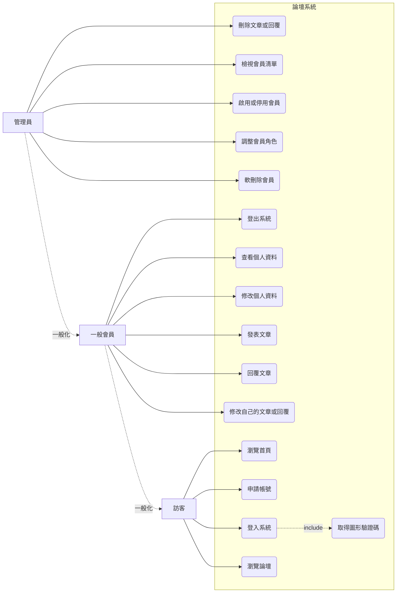
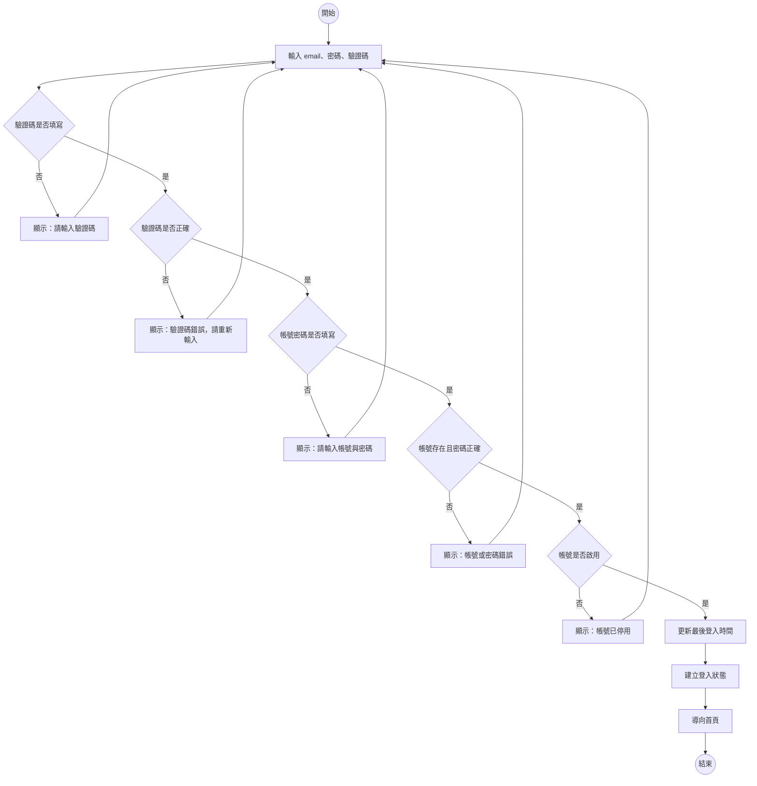
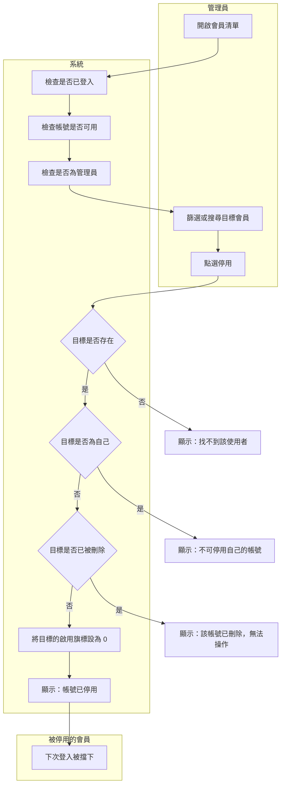
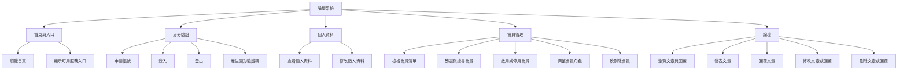
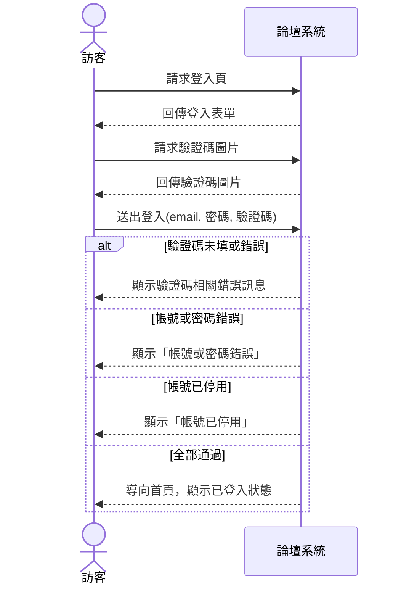
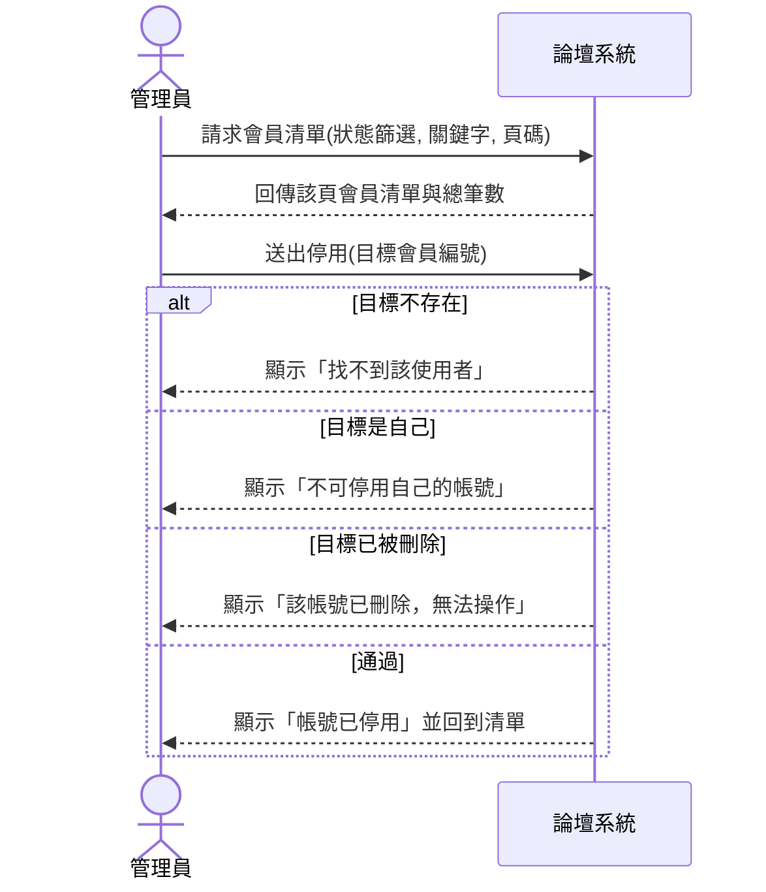
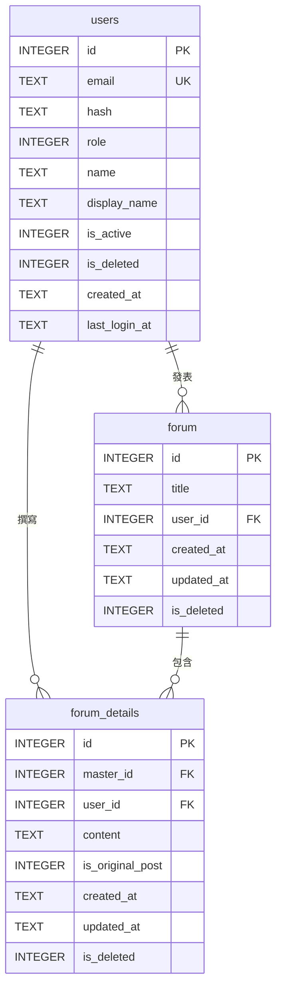
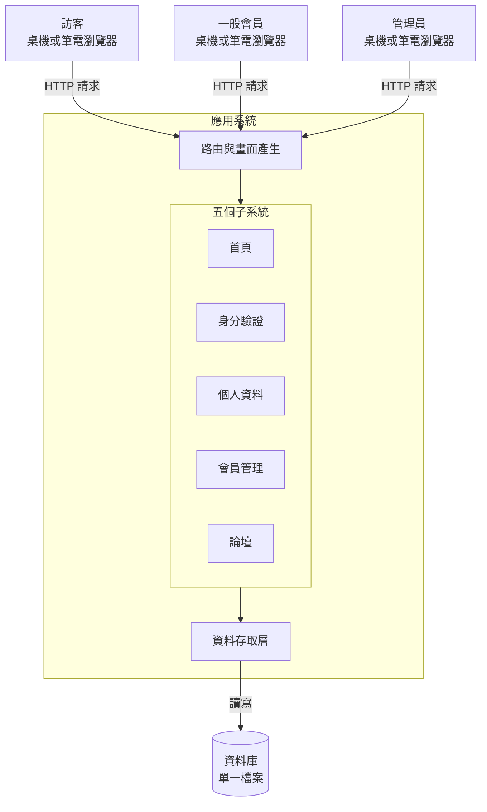

# 系統分析報告：論壇系統

> 這是一份寫好的期中書面報告，分析對象是課堂範例系統 `sad-forum`，其完整程式碼與系統文件放在 <https://github.com/billy1125/sad-forum>。
>
> 內容依[「報告內容」](../00-Course-Introduction/Report-Contents.md)〈一、期中小組報告〉的九項排列。每一項該有哪些欄位、為什麼要這樣寫、方法出自哪一章，見[「系統分析階段繳交規範」](Analysis-Phase-Deliverables.md)；這份只放成品。
>
> **各組題目不同，內容要換成自己那一題的。** 篇幅也不是標準——這裡每一項都收得很緊，是為了讓整份在一頁畫面內看得完。

---

## 1. 問題與系統背景

### 1.1 系統概述

本系統是一套簡單的論壇系統。訪客可以瀏覽討論區、自助申請帳號並登入；會員可以發表文章與回覆、修改自己的內容與個人資料；管理員可以治理所有會員帳號與論壇內容。

論壇是系統的主體，身分驗證、個人資料與會員管理三個子系統都在支撐它：沒有帳號就分不出誰發的文，沒有停用與刪除就處理不了違規的使用者。

系統以瀏覽器操作，資料存在後端資料庫，使用者、應用程式與資料庫可部署在同一台機器上。

| 面向 | 現況 |
|---|---|
| 子系統 | 5 個：首頁與入口、身分驗證、個人資料、會員管理、論壇 |
| 角色 | 3 種：訪客、一般會員、管理員 |
| 資料表 | 3 張：`users`、`forum`、`forum_details` |
| 對外介接 | 無。系統不與任何外部系統或設備交換資料 |

### 1.2 分析範圍

| 涵蓋 | 不涵蓋 | 理由 |
|---|---|---|
| 上述五個子系統的全部功能 | 部署與容器設定 | 屬於維運，不影響使用者的作業方式 |
| 三張資料表的結構與欄位定義 | 自動化測試的內容 | 屬於開發過程的產出，非系統對使用者提供的功能 |
| 三種角色的權限與例外處理 | 版面樣式與色彩配置 | 不涉及功能與資料 |

### 1.3 原本要解決的問題

系統的每一項設計都是為了處理某個問題。從功能、資料與限制三處反推：

| 系統上看到的 | 反推出的問題 |
|---|---|
| 登入要輸入圖形驗證碼，申請帳號卻不用 | 曾被自動化程式大量嘗試登入，但註冊沒有遇到同樣的壓力 |
| 帳號有「停用」這個狀態，而不是只有刪除 | 需要暫時擋住某個人但保留紀錄，例如爭議尚未查清的期間 |
| 刪除帳號只把旗標設為 1，紀錄仍留在資料庫 | 事後要查得到這個帳號做過什麼 |
| 管理員不能停用自己、不能刪除自己、不能改自己的角色 | 曾經有人把自己鎖在系統外，或預期得到會發生 |
| 論壇文章的刪除權收給管理員，作者自己不能刪 | 有人刪掉自己的文章，導致底下所有人的回覆一起消失 |
| 帳號被停用後，他發過的文章照常顯示 | 討論的脈絡屬於整個討論區，不隨作者的狀態消失 |

歸納為三條主要問題：

| 編號 | 問題陳述 |
|---|---|
| P-01 | 帳號可被任意程式大量嘗試登入，且無法在不刪除資料的前提下暫時停止某人使用系統 |
| P-02 | 帳號與其行為的關聯若隨帳號消失，事後無從追究；但若因此不能刪除帳號，又無法處理離職或違規的使用者 |
| P-03 | 討論內容由多人接續產生，任一人的個別決定（刪文、離開）會波及其他人的貢獻 |

推不出理由的部分：`users.role` 只有 0 與 1 兩個值，看不出當初是否規劃過第三種角色（例如助理管理員），需查閱開發紀錄或訪談維護者才能確認。

### 1.4 系統處理了哪些、哪些仍靠人工

| 事項 | 系統處理的部分 | 仍靠人工或沒有 |
|---|---|---|
| 申請帳號 | 自助申請，即時生效 | 無人審核，任何 email 都能註冊 |
| 忘記密碼 | 沒有這個功能 | 使用者只能求助管理員，但管理員也沒有重設密碼的介面 |
| 停用帳號 | 有，管理員一鍵切換 | 「該不該停用」的判斷與通知當事人 |
| 還原被刪除的帳號 | 沒有這個功能，軟刪除是終態 | 只能重新申請新帳號，舊帳號的論壇文章接不回來 |
| 升為管理員 | 有，由既有管理員指定 | 決定誰該當管理員 |
| 處理不當內容 | 刪除功能有 | 判斷什麼算不當，檢舉管道在系統之外 |

### 1.5 推論依據

| 判斷 | 依據 |
|---|---|
| P-01 | 登入流程的驗證碼欄位；會員管理的啟用／停用操作；`users.is_active` 欄位 |
| P-02 | `users.is_deleted` 欄位；會員清單的「已刪除」篩選仍列得出該筆紀錄 |
| P-03 | 論壇刪除文章時一併刪除所有回覆；一般會員的文章上沒有刪除按鈕 |
| 「沒有忘記密碼」 | 功能清單的身分驗證群組只有四項；會員管理的操作中沒有任何一項處理密碼 |

---

## 2. 使用者與利害關係人分析

### 2.1 使用者

| 角色 | 使用目標 | 主要需求 | 權限範圍 | 最在意 |
|---|---|---|---|---|
| 訪客 | 進入系統、成為會員 | 瀏覽首頁、瀏覽論壇、申請帳號、登入 | 只能讀公開內容，不能發文、不能查看個人資料 | 申請流程不要太麻煩 |
| 一般會員 | 維護自己的資料、參與討論 | 登入登出、查看與修改個人資料、發表與回覆文章、修改自己的內容 | 不能刪除任何內容、不能查看他人的帳號資料 | 自己發的內容不會莫名消失 |
| 管理員 | 治理帳號與內容 | 會員清單、篩選搜尋、啟用停用、調整角色、軟刪除、刪除任何文章與回覆 | 一般會員的全部權限，加上管理功能；不能對自己執行停用、刪除、改角色 | 不要把自己鎖在系統外 |

### 2.2 利害關係人

| 利害關係人 | 是否操作系統 | 受影響的方式 |
|---|---|---|
| 系統維護者 | 否 | 負責部署、備份與還原資料庫；系統沒有稽核紀錄，出事時只能靠推測 |
| 課程教師與助教 | 少量 | 以本系統作為教學案例，需要它能被重置回初始狀態 |
| 被討論到的第三人 | 否 | 論壇內容公開可見，內容涉及他時，他沒有任何管道要求處理 |

### 2.3 使用案例圖

管理員繼承一般會員的全部能力，一般會員繼承訪客的全部能力，因此以一般化表示，不重複連線。登入必定經過驗證碼，因此 UC-16 為 UC-03 的包含關係。

上圖以流程圖語法示意。正式的 UML 使用案例圖中，使用案例畫成橢圓、參與者畫成人形符號，系統邊界為包住所有橢圓的方框。

---

## 3. 現況流程分析

### 3.1 會員登入

> **主要角色**：訪客
> **觸發事件**：訪客在登入頁或首頁的內嵌表單送出帳號密碼
> **前置條件**：已載入驗證碼圖片
> **主要步驟**：輸入 email、密碼、驗證碼 → 驗證驗證碼 → 驗證帳號密碼 → 檢查帳號狀態 → 建立登入狀態 → 導向首頁
> **例外情況**：驗證碼未填或錯誤、帳密未填、帳號或密碼錯誤、帳號已停用
> **完成後狀態**：系統記住登入者身分，並更新該會員的最後登入時間

驗證順序上，驗證碼排在帳號密碼之前，可在不查詢資料庫的情況下擋掉自動化請求。「帳號不存在」「帳號已刪除」「密碼錯誤」三種情況合併為同一則訊息，避免有人藉此試出哪些 email 曾經註冊；「帳號已停用」單獨給一則訊息，因為停用是可回復的狀態，告知使用者聯絡管理員為合理處置。

### 3.2 管理員停用會員

> **主要角色**：管理員
> **次要角色**：被停用的會員
> **觸發事件**：管理員在會員清單或明細頁點選停用
> **前置條件**：管理員已登入、帳號可用、角色為管理員
> **主要步驟**：開啟會員清單 → 篩選或搜尋目標 → 點選停用 → 系統檢核 → 更新帳號狀態 → 回到清單
> **例外情況**：目標不存在、目標為自己、目標已被刪除
> **完成後狀態**：目標帳號的啟用旗標為 0，其後無法登入

系統側的前三個檢查依「已登入 → 帳號可用 → 具管理員身分」執行，順序固定。第二關失敗代表身分失效，處置是登出；第三關失敗代表權限不足，處置是導回首頁。

「不可停用自己」搭配「不可刪除自己」「不可修改自己的角色」三條規則，使系統中永遠至少存在一個可用的管理員。

---

## 4. 系統需求分析

### 4.1 功能需求

| 編號 | 功能需求 | 依據 |
|---|---|---|
| FR-01 | 系統應提供首頁，並依登入狀態顯示不同內容 | 首頁畫面訪客與登入後兩種版面 |
| FR-02 | 系統應提供圖形驗證碼，於每次載入時產生新的答案 | 登入頁的驗證碼圖與重新整理按鈕 |
| FR-03 | 系統應提供申請帳號功能，新帳號一律為一般會員 | 申請頁；`users.role` 預設值為 1 |
| FR-04 | 申請帳號時應檢核電子郵件格式、密碼長度與兩次密碼是否一致 | 申請頁的三種錯誤訊息 |
| FR-05 | 系統應拒絕重複的電子郵件註冊 | 錯誤訊息「此電子郵件已被使用」；`users.email` 為唯一欄位 |
| FR-06 | 系統應提供登入功能，成功後記錄最後登入時間 | 登入流程；`users.last_login_at` 欄位 |
| FR-07 | 系統應阻擋已停用或已刪除的帳號登入 | 以停用種子帳號實測 |
| FR-08 | 系統應提供登出功能，登出後回到登入頁 | 各頁右上角的登出連結 |
| FR-09 | 系統應提供個人資料檢視，顯示信箱、姓名、顯示名稱、角色、建立時間與最後登入時間 | 個人資料頁六個欄位 |
| FR-10 | 系統應允許會員修改自己的姓名與顯示名稱 | 個人資料頁的編輯模式 |
| FR-11 | 系統應阻擋未登入者進入個人資料頁 | 未登入直接開啟該網址會被導向登入頁 |
| FR-12 | 系統應提供論壇文章列表，依最後活動時間由新到舊排序 | 論壇主頁；有新回覆的文章會移到最上面 |
| FR-13 | 系統應開放訪客瀏覽論壇，但發表與回覆須先登入 | 未登入時論壇可讀，右上角顯示「登入」 |
| FR-14 | 系統應允許會員發表文章，文章由標題與內文組成 | 新增文章表單的兩個欄位 |
| FR-15 | 系統應允許會員回覆文章，並將該文章移至列表最上方 | 回覆後列表排序改變 |
| FR-16 | 系統應允許原作者或管理員修改文章標題與內容 | 非作者開啟修改頁會被擋下 |
| FR-17 | 系統應僅允許管理員刪除文章與回覆，刪除文章時一併刪除其所有回覆 | 一般會員的文章上沒有刪除按鈕 |
| FR-18 | 系統應提供會員清單，支援依狀態篩選、關鍵字搜尋與分頁 | 會員管理頁的篩選列與分頁列 |
| FR-19 | 系統應允許管理員啟用、停用會員，並調整其角色 | 會員明細頁的操作區 |
| FR-20 | 系統應允許管理員刪除會員，刪除後紀錄仍可查閱 | 「已刪除」篩選仍列得出該筆 |
| FR-21 | 系統應禁止管理員對自己執行停用、刪除與角色調整 | 三則自我保護的錯誤訊息 |

### 4.2 非功能需求

| 編號 | 非功能需求 | 依據 |
|---|---|---|
| NFR-01 | 密碼不得以明文儲存，須經雜湊後保存 | `users.hash` 欄位存的是雜湊值 |
| NFR-02 | 登入須先通過圖形驗證碼，且驗證碼應在查詢資料庫之前檢查 | 驗證順序：驗證碼在帳密之前 |
| NFR-03 | 帳號不存在、已刪除與密碼錯誤三種情況，須回覆相同的錯誤訊息 | 三者實測皆顯示「帳號或密碼錯誤」 |
| NFR-04 | 刪除一律為軟刪除，資料須保留在資料庫中 | `is_deleted` 旗標；已刪除的帳號仍查得到 |
| NFR-05 | 權限檢查須依「已登入 → 帳號可用 → 具管理員身分」的順序執行 | 停用中的管理員被登出，而非收到「無權限」 |
| NFR-06 | 系統中須永遠至少存在一個可用的管理員 | 由三條自我保護規則推得 |
| NFR-07 | 會員清單與論壇列表須分頁，每頁筆數固定 | 資料超過一頁時出現分頁列 |
| NFR-08 | 系統須可於容器中啟動，資料以獨立磁碟區保存 | 容器設定檔 |
| NFR-09 | 錯誤訊息應說明問題所在，但不得洩漏帳號是否存在 | 同 NFR-03 |

---

## 5. 功能分析與系統邊界

### 5.1 功能階層圖

分群依業務性質。「首頁與入口」單獨成群，是因為它有自己的規則：依登入狀態與角色決定顯示哪些服務入口。

### 5.2 功能清單

| 代號 | 功能名稱 | 使用角色 | 對應需求 | 對應使用案例 |
|---|---|---|---|---|
| F-11 | 瀏覽首頁 | 訪客、一般會員、管理員 | FR-01 | UC-01 |
| F-12 | 顯示可用服務入口 | 一般會員、管理員 | FR-01 | UC-01 |
| F-21 | 申請帳號 | 訪客 | FR-03、FR-04、FR-05 | UC-02 |
| F-22 | 登入 | 訪客 | FR-06、FR-07、NFR-02、NFR-03 | UC-03 |
| F-23 | 登出 | 一般會員、管理員 | FR-08 | UC-04 |
| F-24 | 產生圖形驗證碼 | 訪客 | FR-02 | UC-16 |
| F-31 | 查看個人資料 | 一般會員、管理員 | FR-09、FR-11 | UC-05 |
| F-32 | 修改個人資料 | 一般會員、管理員 | FR-10 | UC-06 |
| F-41 | 檢視會員清單 | 管理員 | FR-18、NFR-07 | UC-12 |
| F-42 | 篩選與搜尋會員 | 管理員 | FR-18 | UC-12 |
| F-43 | 啟用或停用會員 | 管理員 | FR-19、FR-21、NFR-05 | UC-13 |
| F-44 | 調整會員角色 | 管理員 | FR-19、FR-21 | UC-14 |
| F-45 | 軟刪除會員 | 管理員 | FR-20、FR-21、NFR-04 | UC-15 |
| F-51 | 瀏覽文章與回覆 | 訪客、一般會員、管理員 | FR-12、FR-13 | UC-07 |
| F-52 | 發表文章 | 一般會員、管理員 | FR-14 | UC-08 |
| F-53 | 回覆文章 | 一般會員、管理員 | FR-15 | UC-09 |
| F-54 | 修改文章或回覆 | 一般會員、管理員 | FR-16 | UC-10 |
| F-55 | 刪除文章或回覆 | 管理員 | FR-17 | UC-11 |

### 5.3 系統邊界

| 界內（本系統負責） | 界外（本系統不做） | 如何確認 |
|---|---|---|
| 帳號的申請、登入、停用、角色與軟刪除 | 寄送任何電子郵件（含密碼重設信） | 系統無寄信設定，功能清單亦無對應項目 |
| 個人資料的查看與修改 | 帳號的還原，軟刪除為終態 | 已刪除的帳號在管理操作中一律被拒 |
| 論壇文章與回覆的建立、修改、刪除 | 內容的檢舉與申訴流程 | 畫面上無檢舉入口，資料表無對應欄位 |
| 圖形驗證碼的產生與比對 | 第三方登入 | 登入頁僅有 email 與密碼欄位 |
| 依角色決定可見與可操作的範圍 | 操作稽核紀錄 | 三張資料表中無任何紀錄用途的表 |

本系統沒有任何外部系統或設備介接。經檢視畫面、路由與資料表後確認，所有資料皆由本系統自行產生與儲存。

---

## 6. 使用案例與系統互動分析

### 6.1 UC-03 登入系統

| 欄位 | 內容 |
|---|---|
| 編號與名稱 | UC-03 登入系統 |
| 主要參與者 | 訪客 |
| 前置條件 | 已載入登入頁，驗證碼圖片已產生 |
| 觸發 | 訪客送出登入表單 |
| 主要流程 | 1. 訪客請求登入頁 2. 系統回傳表單與驗證碼圖 3. 訪客送出 email、密碼、驗證碼 4. 系統驗證驗證碼 5. 系統驗證帳號與密碼 6. 系統檢查帳號狀態 7. 系統記錄登入時間並建立登入狀態 8. 系統導向首頁 |
| 例外流程 | 4a 驗證碼未填或錯誤　5a 帳號密碼未填　5b 帳號或密碼錯誤　6a 帳號已停用 |
| 後置條件 | 系統記住登入者身分；該會員的最後登入時間被更新 |
| 對應需求 | FR-02、FR-06、FR-07、NFR-02、NFR-03 |

### 6.2 UC-13 停用會員

| 欄位 | 內容 |
|---|---|
| 編號與名稱 | UC-13 啟用或停用會員（本節以停用為例） |
| 主要參與者 | 管理員 |
| 次要參與者 | 被停用的會員 |
| 前置條件 | 管理員已登入、帳號可用、角色為管理員 |
| 觸發 | 管理員在會員清單或明細頁點選停用 |
| 主要流程 | 1. 管理員請求會員清單 2. 系統回傳該頁清單與總筆數 3. 管理員送出停用 4. 系統檢核目標存在、非自己、未被刪除 5. 系統更新目標的啟用旗標 6. 系統回到清單並顯示結果 |
| 例外流程 | 4a 目標不存在　4b 目標為自己　4c 目標已被刪除 |
| 後置條件 | 目標帳號的啟用旗標為 0，其後無法登入 |
| 對應需求 | FR-19、FR-21、NFR-05 |

### 6.3 三者的對應關係

| 對照 | UC-03 的對應情形 |
|---|---|
| 敘述 → 活動圖 | 例外流程 4a、5a、5b、6a 分別對應〈3.1〉活動圖的 D1／D2、D3、D4、D5 |
| 活動圖 → 循序圖 | 活動圖的「輸入 email、密碼、驗證碼」對應循序圖的 `送出登入(email, 密碼, 驗證碼)` |
| 循序圖 → 需求 | 回應「帳號已停用」對應 FR-07；驗證碼往返對應 FR-02 與 NFR-02 |

---

## 7. 資料需求分析

### 7.1 實體關聯圖

`forum` 與 `forum_details` 為主檔／明細結構：標題屬於一篇文章，內容屬於一則發言。同一篇文章的首篇內文與後續回覆都存在明細表，以 `is_original_post` 區分。

圖上三條關聯在資料庫中並未以外鍵宣告，全由應用程式在查詢時自行接合。造成三個後果：可寫入指向不存在使用者的文章而資料庫不會拒絕；刪除使用者不會連動其文章；刪除文章不會自動刪除回覆，該連動須由程式明確執行。

### 7.2 資料表與鍵值

| 資料表 | 用途 | 主鍵 | 對外參照 | 其他約束 |
|---|---|---|---|---|
| `users` | 會員帳號 | `id` | 無 | `email` 唯一 |
| `forum` | 文章主檔，存標題與發文者 | `id` | `user_id` → `users.id` | 無 |
| `forum_details` | 內文與回覆 | `id` | `master_id` → `forum.id`、`user_id` → `users.id` | 無 |

### 7.3 資料字典：`users`

| 欄位名稱 | 中文名稱 | 型別 | 必填 | 值域／格式 | 資料來源 |
|---|---|---|---|---|---|
| `id` | 會員編號 | INTEGER | 是 | 主鍵，系統流水號 | 系統產生 |
| `email` | 電子郵件 | TEXT | 是 | 唯一；須含 `@` 與一個點 | 使用者輸入 |
| `hash` | 密碼雜湊 | TEXT | 是 | 雜湊字串，非明文 | 系統產生 |
| `role` | 角色 | INTEGER | 是 | `0` 管理員、`1` 一般會員；預設 1 | 系統預設或管理員指定 |
| `name` | 姓名 | TEXT | 否 | 無長度限制；空白存為 NULL | 使用者輸入 |
| `display_name` | 顯示名稱 | TEXT | 否 | 無長度限制；空白存為 NULL | 使用者輸入 |
| `is_active` | 是否啟用 | INTEGER | 是 | `1` 啟用、`0` 停用；預設 1 | 系統預設或管理員切換 |
| `is_deleted` | 是否已刪除 | INTEGER | 是 | `1` 已刪除、`0` 未刪除；預設 0 | 管理員執行刪除 |
| `created_at` | 建立時間 | TEXT | 是 | `YYYY-MM-DD HH:MM:SS`，UTC | 系統產生 |
| `last_login_at` | 最後登入時間 | TEXT | 否 | 同上；從未登入時為 NULL | 系統於登入成功時寫入 |

`is_active` 與 `is_deleted` 兩個旗標組合出四種帳號狀態：

| `is_active` | `is_deleted` | 狀態 | 可否登入 | 可執行的管理動作 |
|:---:|:---:|---|---|---|
| 1 | 0 | 正常 | 可以 | 停用、調整角色、刪除 |
| 0 | 0 | 停用 | 否，訊息為「帳號已停用」 | 啟用、調整角色、刪除 |
| 1 | 1 | 已刪除 | 否，訊息為「帳號或密碼錯誤」 | 無 |
| 0 | 1 | 已刪除 | 否，訊息為「帳號或密碼錯誤」 | 無 |

### 7.4 資料字典：`forum`

| 欄位名稱 | 中文名稱 | 型別 | 必填 | 值域／格式 | 資料來源 |
|---|---|---|---|---|---|
| `id` | 文章編號 | INTEGER | 是 | 主鍵，系統流水號 | 系統產生 |
| `title` | 文章標題 | TEXT | 是 | 無長度上限 | 使用者輸入 |
| `user_id` | 發文者編號 | INTEGER | 是 | 對應 `users.id`，無外鍵約束 | 由登入狀態帶入 |
| `created_at` | 建立時間 | TEXT | 是 | `YYYY-MM-DD HH:MM:SS` | 系統產生 |
| `updated_at` | 最後活動時間 | TEXT | 是 | 同上；新增回覆或修改標題時更新 | 系統產生 |
| `is_deleted` | 是否已刪除 | INTEGER | 是 | `1` 已刪除、`0` 未刪除；預設 0 | 管理員執行刪除 |

### 7.5 資料字典：`forum_details`

| 欄位名稱 | 中文名稱 | 型別 | 必填 | 值域／格式 | 資料來源 |
|---|---|---|---|---|---|
| `id` | 內容編號 | INTEGER | 是 | 主鍵，系統流水號 | 系統產生 |
| `master_id` | 所屬文章編號 | INTEGER | 是 | 對應 `forum.id`，無外鍵約束 | 系統帶入 |
| `user_id` | 作者編號 | INTEGER | 是 | 對應 `users.id`，無外鍵約束 | 由登入狀態帶入 |
| `content` | 內容 | TEXT | 是 | 無長度上限 | 使用者輸入 |
| `is_original_post` | 是否為首篇內文 | INTEGER | 是 | `1` 首篇內文、`0` 回覆；預設 0 | 系統依建立途徑決定 |
| `created_at` | 建立時間 | TEXT | 是 | `YYYY-MM-DD HH:MM:SS`；內容列表排序依據 | 系統產生 |
| `updated_at` | 最後編輯時間 | TEXT | 是 | 同上；僅內容被修改時更新 | 系統產生 |
| `is_deleted` | 是否已刪除 | INTEGER | 是 | `1` 已刪除、`0` 未刪除；預設 0 | 管理員執行刪除 |

`updated_at` 在兩張表中語意不同：主檔為「最後活動時間」，新增回覆會更新；明細為「最後編輯時間」，僅內容被改才更新。此差異決定文章在列表上的排序行為。

---

## 8. 系統環境與整體架構理解

### 8.1 架構圖

| 面向 | 現況 |
|---|---|
| 有哪些部分 | 使用者端瀏覽器、應用系統、資料庫；無外部系統 |
| 各部分在哪裡 | 三者可部署於同一台機器，並以容器打包為單一服務 |
| 彼此怎麼連 | 瀏覽器以 HTTP 連應用系統；應用系統直接讀寫本機資料庫檔案 |
| 誰主動 | 一律由瀏覽器發起，系統不主動推送 |

### 8.2 使用環境

| 面向 | 現況 |
|---|---|
| 使用裝置 | 桌上型或筆記型電腦的瀏覽器 |
| 行動裝置 | 版面未針對小螢幕調整，手機可開啟但操作不便 |
| 網路 | 需連線才能操作，無離線暫存 |
| 畫面產生方式 | 由伺服器產生完整頁面回傳，每次操作整頁重新載入 |

所有業務規則（權限檢查、驗證碼比對、自我保護規則）皆在應用系統執行，瀏覽器僅負責顯示與收集輸入。因此即使繞過畫面直接送出請求，檢核仍然生效。

---

## 9. 現況問題與改善建議

### 9.1 從分析中找到的問題

| 編號 | 問題 | 來自哪一項分析 |
|---|---|---|
| I-01 | 帳號被停用後，當事人只要仍保有登入狀態，仍可成功修改自己的姓名與顯示名稱 | 第 2 項權限矩陣 × 第 3 項停用流程的後置條件 |
| I-02 | 使用者忘記密碼時無路可走：系統無此功能，管理員也沒有重設密碼的介面 | 第 5 項功能清單與系統邊界 |
| I-03 | 系統不記錄任何管理動作，帳號被停用後查不出是誰、何時、為何執行 | 第 7 項資料字典：三張表皆無紀錄用途 |
| I-04 | 「被討論到的第三人」沒有任何管道要求處理涉及自己的內容 | 第 2 項利害關係人清單 |
| I-05 | 軟刪除為終態，誤刪的帳號無法還原，其論壇文章也接不回新帳號 | 第 1 項系統做了哪些／哪些沒做 |
| I-06 | 論壇文章與回覆的內容沒有長度上限 | 第 7 項資料字典的值域欄 |

### 9.2 改善建議

改善建議分流程、系統與組織三個層次。以下三條為影響較大且改法明確者。

#### 建議一：補上停用後的存取檢查

| 項目 | 內容 |
|---|---|
| 建議 | 在「修改個人資料」這條路徑上補上帳號狀態檢查，與其他需要登入的功能一致。屬系統層次。 |
| 針對的問題 | I-01 |
| 依據 | 第 2 項的權限矩陣顯示「修改個人資料」需要登入；第 3 項的停用流程顯示其後置條件為「其後無法登入」。兩者對照後實測發現，停用只擋住重新登入，未擋住已建立的登入狀態。第 4 項的 FR-11 僅涵蓋「未登入者」，未涵蓋此情況。 |
| 預期效果 | 停用動作的效果與 FR-19 的描述一致，管理員停用帳號後不需另行確認對方是否仍在線上。 |

#### 建議二：讓忘記密碼有解

| 項目 | 內容 |
|---|---|
| 建議 | 短期在登入頁標明「忘記密碼請聯絡管理員」，並於管理員端提供重設密碼功能；長期評估是否導入以電子郵件重設密碼的流程。前者為流程與系統層次，後者牽涉是否引入寄信能力，屬組織層次的決定。 |
| 針對的問題 | I-02 |
| 依據 | 第 5 項功能清單中，身分驗證群組僅有申請帳號、登入、登出與驗證碼四項；會員管理群組的五項操作皆不處理密碼。系統邊界表將「寄送電子郵件」列為界外，因此連自助重設的技術前提都不存在。 |
| 預期效果 | 使用者不再因忘記密碼而失去既有內容；管理員有明確的處理方式。 |

#### 建議三：建立管理動作紀錄

| 項目 | 內容 |
|---|---|
| 建議 | 為啟用、停用、角色調整與刪除四項管理動作建立紀錄表，至少記下執行者、時間、對象與動作。屬系統層次；配套的「多久查閱一次、由誰負責」屬組織層次。 |
| 針對的問題 | I-03 |
| 依據 | 第 7 項資料字典顯示 `users` 表僅有 `is_active` 與 `is_deleted` 兩個當前狀態欄位，無任何欄位記錄狀態變更歷程；三張資料表中亦無紀錄用途者。第 1 項反推時已判斷「軟刪除是為了事後查得到」，但系統只留下結果，未留下經過。 |
| 預期效果 | 管理動作可追溯，使軟刪除這項設計的原始意圖真正成立。 |

### 9.3 影響較小或改法待確認者

| 問題 | 處理方式 |
|---|---|
| I-04 檢舉管道 | 值得處理，但「什麼算不當內容、由誰認定」需先取得管理規範，才能決定系統要提供什麼功能 |
| I-05 帳號還原 | 涉及「還原後原有內容如何歸屬」，需先確認業務規則 |
| I-06 內容長度上限 | 改法明確但影響較小，可於後續版本一併處理 |

本階段僅提出改善方向，不進行新系統設計。

---

*本報告為課堂範例。各組題目不同，角色、流程、資料表與問題皆須依自己的題目重新推導。*
